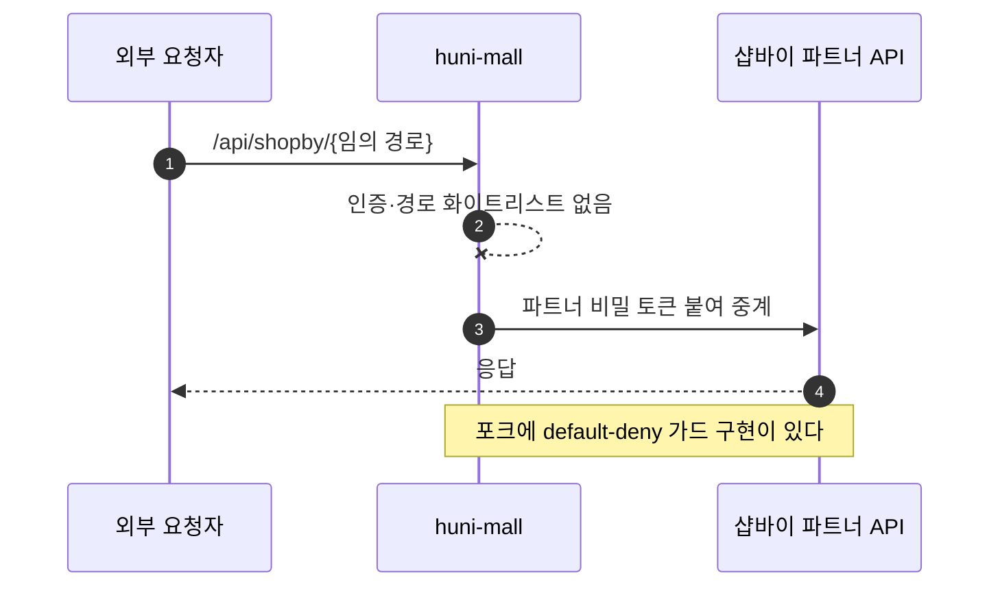
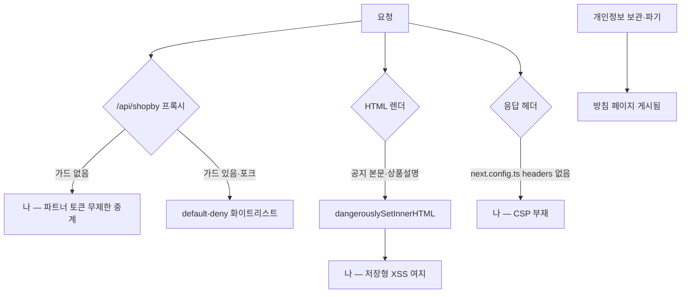

# P36 보안 강화(프록시 가드·XSS·CSP·개인정보)

> 카드 `t65` · 대분류 **시스템·플랫폼** · 중분류 품질 · 단계 4 · 빠진 곳 3

## 1. 한줄정의

남이 우리 시스템을 함부로 못 쓰게 막는 흐름. 가장 급한 구멍 하나는 파트너 비밀 토큰을 아무나 통과시키는 프록시다.

| | |
|---|---|
| **시작** | 외부 요청이 몰에 들어온다 |
| **끝** | 허용된 경로·허용된 내용만 통과한다 |
| **등장인물** | 외부 요청자 · huni-mall · 샵바이 파트너 API · 고객 |

## 2. 흐름 — sequenceDiagram

## 3. 분기 — flowchart

## 4. 단계표

| # | 단계 | 시스템 | 담당자 | 원장 row_id | 상태 | 근거 |
|---:|---|---|---|---|---|---|
| 1 | 1. /api/shopby 범용 프록시 인증·경로 화이트리스트 | huni-mall | 김동학 | `STD-SYS-043` | 미착수 | huni-skin-shopby/src/app/api/shopby/[...path]/route.ts:20-30 가드 없음 · artifacts/audit/iteration-1/report.md:27-33 C1·35 H1 · 포크 huni-skin-next/src/lib/api/server/shopby-proxy-guard.ts(default-deny) |
| 2 | 2. 공지 본문·상품설명 HTML 무필터 렌더 — sanitize 적용 | huni-mall | 김동학 | `STD-SYS-046` | 미착수 | huni-skin-shopby/src/app/(main)/notice/[articleNo]/page.tsx:69 · src/components/product/configurator.tsx:77 dangerouslySetInnerHTML · audit report.md:77 M3 · 포크 huni-skin-next/src/lib/security/sanitize.ts |
| 3 | 3. 보안 응답 헤더/CSP | huni-mall | 김동학 | `STD-SYS-047` | 미착수 | huni-skin-shopby/next.config.ts:1-17 headers 없음 · SPEC-TAKEOVER-001 spec.md:46 · 포크 M3(commit 348a8f4) CSP Report-Only |
| 4 | 4. 개인정보 보관·파기 정책 적용 | huni-mall | 김동학 | `STD-SYS-018` | 작동 | https://shopby.huniprinting.co.kr/privacy@2026-09-16 21:27 |

## 5. 빠진 곳

| id | 종류 | 내용 | 제안 담당 |
|---|---|---|---|
| `G-t65-107` | 나 — 행은 있는데 코드 0 | `/api/shopby/[...path]/route.ts:20-30` 이 인증도 경로 제한도 없이 파트너 비밀 토큰을 붙여 중계한다. 감사 보고서가 C1(Critical)·H1 로 잡아 둔 항목이고, 포크에는 `shopby-proxy-guard.ts` 의 default-deny 구현이 이미 있다. | 김동학 |
| `G-t65-108` | 나 — 행은 있는데 코드 0 | `notice/[articleNo]/page.tsx:69` 와 `configurator.tsx:77` 이 `dangerouslySetInnerHTML` 로 본문을 그대로 렌더한다. 운영자 계정이 하나 뚫리면 저장형 XSS 로 번진다. 포크에 `sanitize.ts` 가 있다. | 김동학 |
| `G-t65-109` | 나 — 행은 있는데 코드 0 | `next.config.ts:1-17` 에 `headers()` 가 없어 보안 응답 헤더·CSP 가 하나도 안 나간다. 포크는 CSP 를 Report-Only 로 먼저 켰다. | 김동학 |

## 6. 채우는 방법

1. **김동학** — 프록시 가드를 가장 먼저 넣는다. 세 항목 중 피해 범위가 제일 크다.
2. **김동학** — sanitize 를 공지·상품설명 두 곳에 적용한다(P09·P15 와 같은 작업).
3. **김동학** — CSP 를 Report-Only 로 켜서 위반을 모은 뒤 차단으로 올린다.

## 7. 확인 못 한 것

- 프록시가 현재 외부에서 실제로 호출되고 있는지 로그로 확인하지 못했다.
- 개인정보 파기 주기가 실제로 돌고 있는지 확인하지 못했다 — 방침 페이지 게시만 확인했다.
