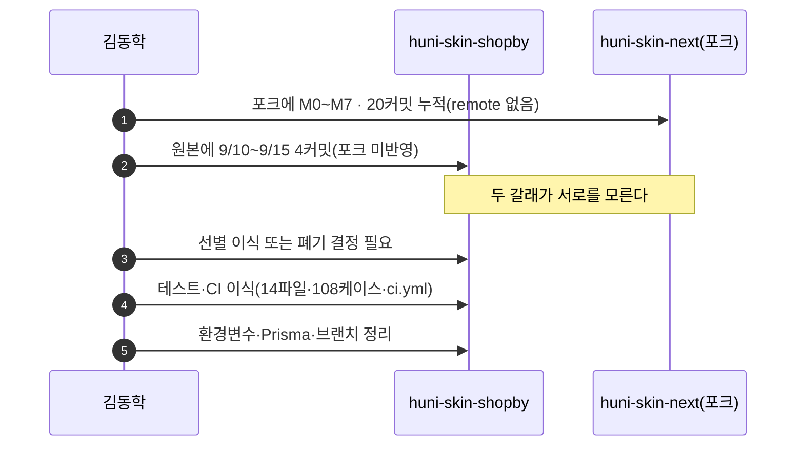
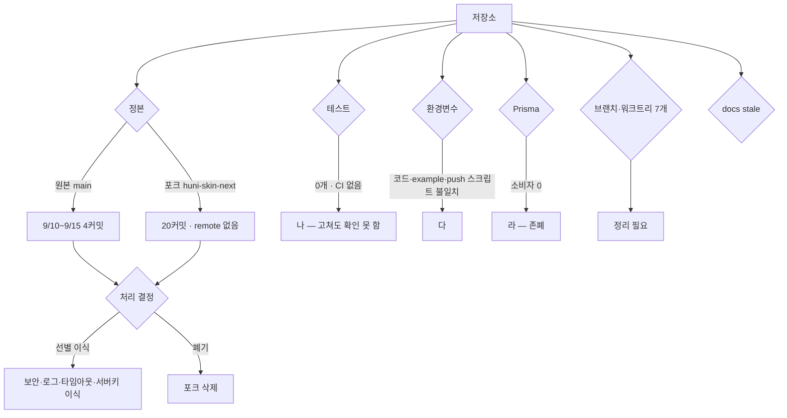

# P37 코드베이스 정비·포크 처리·CI·문서

> 카드 `t65` · 대분류 **시스템·플랫폼** · 중분류 품질 · 단계 7 · 빠진 곳 4

## 1. 한줄정의

지금 저장소가 어질러져 있다. 어느 것이 정본인지, 무엇이 죽은 코드인지, 고쳐도 안 깨졌는지 확인할 방법이 없는 상태를 푸는 흐름이다.

| | |
|---|---|
| **시작** | 누군가 코드를 고치려고 저장소를 연다 |
| **끝** | 정본이 하나이고, 바꾸면 테스트가 돌고, 문서가 코드와 맞는다 |
| **등장인물** | 김동학 · 서희항 · 저장소 |

## 2. 흐름 — sequenceDiagram

## 3. 분기 — flowchart

## 4. 단계표

| # | 단계 | 시스템 | 담당자 | 원장 row_id | 상태 | 근거 |
|---:|---|---|---|---|---|---|
| 1 | 1. huni-skin-next 포크 처리 결정(선별 이식 vs 폐기) | 결정(PM) | 신우진+김동학 | `STD-SYS-050` | 미착수 | huni-skin-shopby/.git/info/exclude:7 `huni-skin-next/` · huni-skin-next `git remote` 0 · `git log 0f65b32..HEAD` 20 · 원본 9/10~9/15 4커밋 미반영 |
| 2 | 2. 회귀 테스트 0개·CI 없음 — 포크 테스트·ci.yml 이식 | huni-mall | 김동학 | `STD-SYS-048` | 미착수 | `find huni-skin-shopby/src -name '*.test.*'` 0 · .github/workflows/ 에 label-sync.yml 만 · 포크 huni-skin-next: 14 test files·.github/workflows/ci.yml(commit ed448b7·77b43cd) |
| 3 | 3. 환경변수 정합(코드 vs .env.example vs push 스크립트) | huni-mall | 김동학 | `STD-SYS-052` | 미착수 | huni-skin-shopby/.env.example(21키) · scripts/vercel-env-push.sh(GRAPHQL_BRIDGE_SECRET·NEXT_PUBLIC_GRAPHQL_ENDPOINT) · src/lib/api/server/board.ts:14 · 포크 t10 commit 8ff573a |
| 4 | 4. Prisma 로컬 DB 존폐(소비자 0) | huni-mall | 김동학 | `STD-SYS-053` | 미착수 | `grep -rn '@/lib/prisma' huni-skin-shopby/src` 0(정의 파일 제외) · prisma/README.md:3 · package.json postinstall `prisma generate` · SPEC-TAKEOVER-001 U-6 |
| 5 | 5. 미병합 로컬 브랜치·워크트리 7개 정리 | huni-mall | 김동학 | `STD-SYS-051` | 미착수 | `git -C huni-skin-shopby branch --no-merged main` 7개 · `git worktree list` .claude/worktrees/{t1·t2·t3·t9·t10·t11·release-0.2.0} |
| 6 | 6. 저장소 문서 stale 정비(docs/api README) | huni-mall | 김동학 | `STD-INF-013` | 미착수 | huni-skin-shopby/docs/api/README.md:16-17 · docs/api/frontend/README.md:5-7 · artifacts/shopby-integration-status-report.md:6(2026-09-02 기준) |
| 7 | 7. 오픈·안정화 후 유지보수 내부 인력 이관 | 결정(PM) | 서희항 | `STD-SYS-026` | 미착수 | 후니정기미팅 정리260915.html §개발 역할 분담 · 확정 2 |

## 5. 빠진 곳

| id | 종류 | 내용 | 제안 담당 |
|---|---|---|---|
| `G-t65-110` | 라 — 결정 미정 | 포크(`huni-skin-next`)에 M0~M7 20커밋이 쌓여 있는데 remote 가 없고, 그 사이 원본 main 에 4커밋이 더 들어가 포크에 반영되지 않았다. 이 카드의 여러 항목(서버키 P30·로그 P35·보안 P36·타임아웃 P15)이 「포크에 이미 있다」로 걸려 있어, 포크 처리 결정 하나가 그 전부의 선행이다. | 신우진 |
| `G-t65-111` | 나 — 행은 있는데 코드 0 | 회귀 테스트가 0개이고 CI 가 없다(`.github/workflows/` 에 `label-sync.yml` 만). 포크에는 테스트 14파일·108케이스와 `ci.yml` 이 있다. 지금 상태로는 이 카드의 어떤 수정도 「안 깨졌다」를 증명할 수 없다. | 김동학 |
| `G-t65-112` | 다 — 코드는 있는데 연결 안 됨 | 환경변수가 세 곳에서 어긋난다 — 코드가 참조하는 키(`HUNI_WIDGET_SITE_KEY`·`SHOPBY_NOTICE_BOARD_NO`)가 `.env.example`(21키)에 없고, `vercel-env-push.sh` 는 쓰지 않는 `GRAPHQL` 2종을 밀고, `DEMO_AUTH_*` 는 아무도 안 쓴다. | 김동학 |
| `G-t65-113` | 라 — 결정 미정 | Prisma 로컬 DB(23테이블)의 소비자가 0이다(`src/lib/prisma.ts` 정의 파일 외 참조 0). 그런데 `package.json` 의 `postinstall` 이 매번 `prisma generate` 를 돌린다. 지울지 쓸지 정해야 한다. | 김동학 |

## 6. 채우는 방법

1. **신우진** — 포크 처리를 결정한다. 이 카드에서 가장 많은 항목이 걸린 단일 결정이다.
2. **김동학** — 테스트·CI 를 먼저 이식한다. 그래야 나머지 이식이 안전해진다.
3. **김동학** — 환경변수 3곳을 한 벌로 맞추고 `.env.example` 을 정본으로 올린다.
4. **김동학** — Prisma 와 미병합 브랜치 7개를 정리한다.
5. **서희항** — 유지보수 내부 인력 이관 계획을 세운다.

## 7. 확인 못 한 것

- 포크 20커밋 중 원본에 없는 실질 변경이 몇 개인지 diff 로 세지 않았다.
- 미병합 브랜치 7개에 유효 변경이 남아 있는지 확인하지 못했다.
