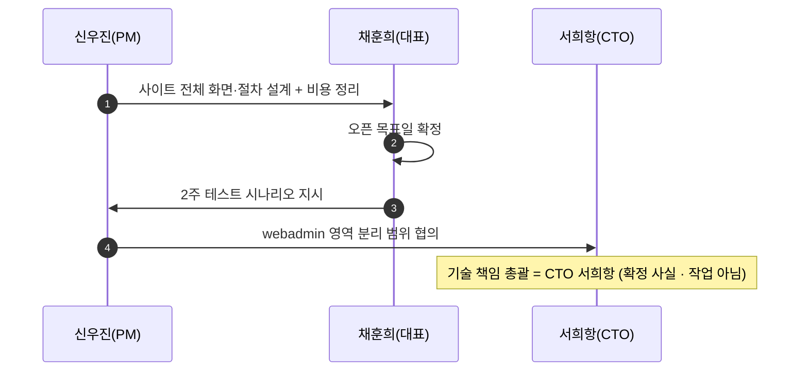
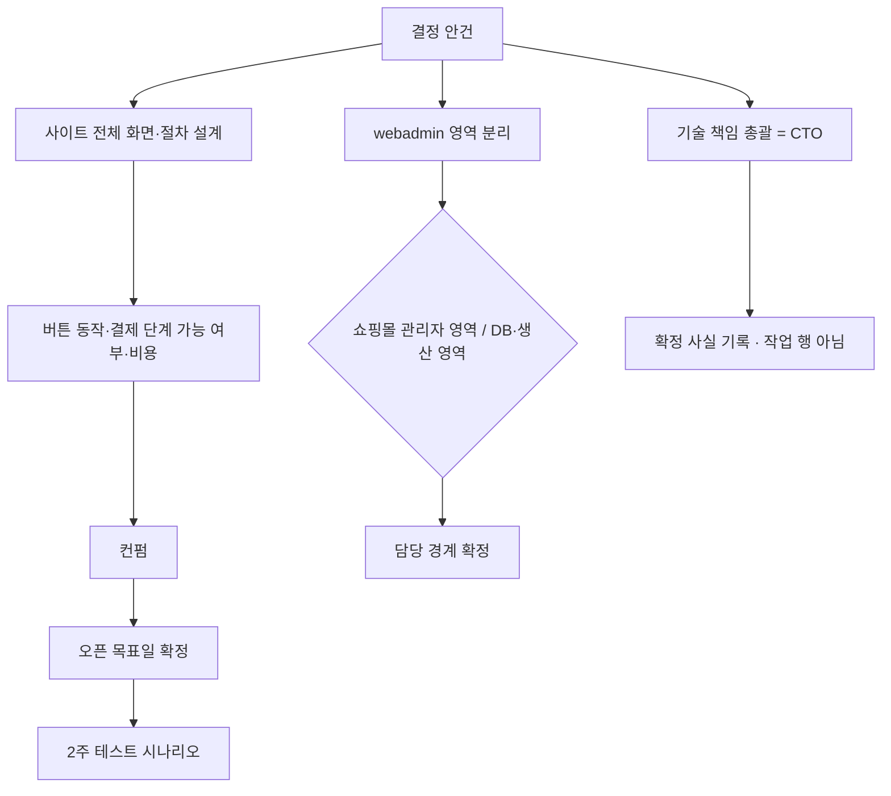

# P38 런칭 범위·조직·일정 결정

> 카드 `t65` · 대분류 **시스템·플랫폼** · 중분류 결정 · 단계 4 · 빠진 곳 4

## 1. 한줄정의

만드는 일이 아니라 정하는 일. 이 카드의 다른 모든 프로세스가 여기서 내려오는 답을 기다리고 있다.

| | |
|---|---|
| **시작** | 무엇을 1차에 넣고 무엇을 뺄지 물어야 하는 순간 |
| **끝** | 오픈 목표일·테스트 시나리오·조직 경계가 문서로 정해진다 |
| **등장인물** | 채훈희(대표) · 신우진(PM) · 서희항(CTO) |

## 2. 흐름 — sequenceDiagram

## 3. 분기 — flowchart

## 4. 단계표

| # | 단계 | 시스템 | 담당자 | 원장 row_id | 상태 | 근거 |
|---:|---|---|---|---|---|---|
| 1 | 1. 사이트 전체 화면·절차 설계(버튼 동작·결제 단계·비용 정리 후 컨펌) | 결정(PM) | 신우진 | `STD-SYS-033` | 미착수 | 후니정기미팅 정리260915.html §일정·설계 · 미결 2 |
| 2 | 2. 오픈 목표일 확정 + 2주 테스트 시나리오 | 결정(PM) | 채훈희 | `STD-SYS-032` | 부분 | 후니정기미팅 정리260915.html §일정·설계 · 미결 1 / 후니-오픈잔여작업-실무진안내_260909.html §항목 6 · ④ 완료 기준 |
| 3 | 3. webadmin 영역 분리(쇼핑몰 관리자 영역 / DB·생산 영역) | 결정(PM) | 신우진 | `STD-SYS-028` | 미착수 | 후니정기미팅 정리260915.html §개발 역할 분담 · 미결 1 |
| 4 | 4. 기술 책임 총괄 = CTO 서희항(확정 사실 기록) | 기록 | — | `STD-SYS-027` | 미착수 | 후니정기미팅 정리260915.html §개발 역할 분담 · 확정 3 |

## 5. 빠진 곳

| id | 종류 | 내용 | 제안 담당 |
|---|---|---|---|
| `G-t65-114` | 라 — 결정 미정 | 오픈 목표일이 확정되지 않아 무엇을 1차에서 뺄지가 정해지지 않는다. 이 카드의 「라」 항목 대부분이 「1차에 넣는가」를 먼저 물어야 답이 나온다. | 채훈희 |
| `G-t65-115` | 라 — 결정 미정 | webadmin 영역 분리(쇼핑몰 관리자 영역 vs DB·생산 영역)가 미정이라 P26 권한 설계와 P30 동기화 책임 경계가 같이 멈춰 있다. | 신우진 |
| `G-t65-116` | 가 — 원장에 행 없음 | 2주 테스트 시나리오가 원장에 행으로 없다 — `STD-SYS-032` 안에 문구로만 들어 있다. 시나리오를 누가 쓰고 누가 도는지가 작업 행으로 서 있지 않다. | 신우진 |
| `G-t65-117` | 라 — 결정 미정 | `STD-SYS-027`(기술 책임 총괄 = CTO)은 원장 판정이 「불필요」다 — 확정 사실 기록이지 작업이 아니다. 단계로는 두되 잔여 작업으로 세지 않는다. | — |

## 6. 채우는 방법

1. **채훈희** — 오픈 목표일을 정한다. 이 카드의 결정 항목들이 「1차 포함 여부」로 한꺼번에 갈린다.
2. **신우진** — 사이트 전체 화면·절차 설계를 비용과 함께 올려 컨펌을 받는다.
3. **신우진** — webadmin 영역 분리 경계를 정한다.
4. **신우진** — 2주 테스트 시나리오를 작업 행으로 원장에 올린다(제안은 gaps.csv 에 있다).

## 7. 확인 못 한 것

- 9/15 회의 이후 오픈 목표일이 논의된 기록이 더 있는지 확인하지 못했다.
- 비용 정리의 범위(개발비·라이선스·인프라)를 확인하지 못했다.
