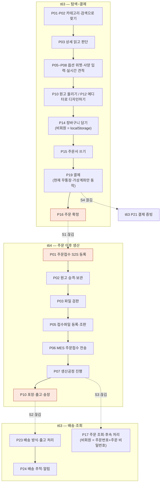

# J1 — 비회원이 주문을 끝까지 마치는 길

네 카드(t62·t63·t64·t65)의 `cross` 열에서 카드를 가로지르는 자리만 뽑아 이어 붙인 것이다.
**새로 판정하지 않았다** — 각 칸의 문장과 근거는 네 카드가 쓴 그대로이고, 여기서는 순서만 세웠다.

비회원은 가입하지 않으므로 t62(회원·마이페이지) 구간을 통째로 건너뛴다.
그래서 이 여정은 **t63 → t64 → 다시 t63** 두 번의 경계만 넘는데, **그 두 번이 다 끊겨 있다.**

---

## 길

---

## 묶음 경계에서 끊기는 지점

| # | 경계 | 무엇이 끊기나 | 근거(네 카드의 빠진 곳) |
|---|---|---|---|
| **S1** | t63 P16 주문 확정 → **t64 P01 주문접수 S2S** | 받는 쪽(`POST /api/w/v1/order/register`)은 **운영 라이브**인데 huni-mall 에서 **부르는 코드가 0건**이다. 결제가 끝나도 주문이 후니에 닿지 않는다. 게다가 S2S 가 실패했을 때의 재전송·수기 보정 경로가 **원장에 행조차 없다** | `GX-t63-114`(t63 P16 다) · `GX-t64-002`(t64 P01 다) · `GX-t63-111`(t63 P16 가) · 제공자 위치 `raw/webadmin/webadmin/catalog/widget_api.py:5591` |
| **S2** | t64 P10 포장·출고·송장 → **t63 P23·P24 배송** | 샵바이 서버 API 에 송장 등록(`PUT /orders/delivery`)·송장 일괄변경(`PUT /orders/update-invoices`)이 **다 있는데 호출 코드가 0건**이다. 포장·바코드·출고완료·송장출력·납품명세서·합배송도 전수 grep 0건. 여기에 **MES 택배사 코드 ↔ 샵바이 `deliveryCompanyType` 매핑이 없어** 코드를 붙여도 그 자리에서 막힌다 | `GX-t63-163`·`GX-t63-164`(t63 P23 나) · `GX-t64-088`(t64 P10 나) · `GX-t64-085`(t64 P10 가) · `GX-t65-097`(t65 P33 나) |
| **S3** | t64 P07·P09 생산 진행 → **t63 P17 주문 조회** | 고객이 보는 상태 라벨은 결제완료→상품준비→배송준비→배송중→배송완료→구매확정 **전 단계가 그려져 있는데**, 그 값을 만드는 쪽의 상태머신이 **4칸만 산다**. 어떤 웹훅 이벤트를 구독했는지조차 실측되지 않았다 | `GX-t63-118`(t63 P17 다) · `GX-t64-084`·`GX-t64-082`(t64 P09 라) · t64 verdict §4 「상태머신 4칸」(`artwork_promote.py:50-56`) |
| **S4** | t63 P19 결제 → **t63 P21 증빙 → t65 P24 정산** | 현금영수증 화면이 **정적 더미**(버튼에 `onClick` 이 없다)인데 샵바이 서버에는 신청 API(`POST /guest/orders/{orderNo}/cashReceipt`)가 있다. 그리고 **발급 주체(Shopby/자체/외부)가 아직 결정되지 않았다** | `GX-t63-149`(t63 P21 다) · 전제 행 `BLK-S1-4`·`T5-4` |
| **S5** | t63 P19 결제 → **t65 P29 결제 정책** | 1차 런칭을 무통장·가상계좌만으로 열지 카드까지 열지가 **미정**이다. 이 하나가 환불 경로(t65 P03)와 정산 대사(t65 P24)를 동시에 바꾼다 | `GX-t65-085`(t65 P29 라) · 전제 행 `BLK-S1-3` |

### 비회원만의 갈래 — 카드 안에서 이미 갈라져 있는 것

| 자리 | 사실 | 근거 |
|---|---|---|
| t63 P14 장바구니 | 샵바이 `/cart` 는 **회원 전용**이라 비회원 장바구니는 `localStorage`(`huni_guest_cart`)에만 있다 — **서버에 없다** | `GX-t63-092`(t63 P14 나) |
| t63 P17 주문 조회 | 원장은 「주문번호+휴대전화」라 적었는데 **구현은 주문번호+주문 비밀번호**다. 휴대전화 입력칸 자체가 없다 | `GX-t63-117`(t63 P17 나) |
| t65 P01·P02·P03 클레임 | 비회원용 샵바이 API(`/guest/...claims/...`)가 회원과 **대칭으로 다 열려 있는데** huni-mall 에 화면이 없다 | `GX-t65-001`·`GX-t65-004`·`GX-t65-007` |

---

## 한 줄

**비회원은 결제까지 갈 수 있다. 그 다음이 없다.**
결제 이후 주문이 후니로 넘어가는 다리(S1)와 출고 결과가 고객에게 돌아오는 다리(S2)가
둘 다 **받는 쪽만 있고 부르는 쪽이 없는** 같은 모양이다.
