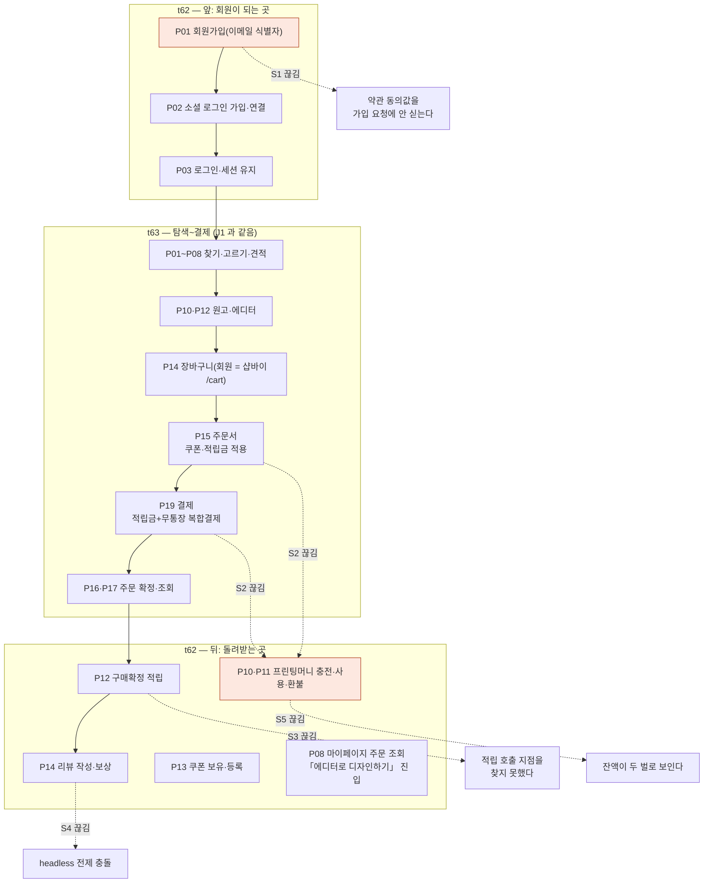

# J2 — 회원 가입 → 첫 주문 → 적립·리뷰

J1(비회원)과 갈라지는 지점만 다르다. 회원은 **t62(회원·마이페이지·프로모션)** 를 앞뒤로 두 번 지나간다 —
앞에서 가입하고, 뒤에서 적립·리뷰·프린팅머니를 받는다. **그 뒤쪽이 이 여정의 고비다.**

---

## 길

---

## 묶음 경계에서 끊기는 지점

| # | 경계 | 무엇이 끊기나 | 근거 |
|---|---|---|---|
| **S1** | t62 P01 가입 → **샵바이 회원 원장** | 폼은 약관 동의값(`joinTermsAgreements`)·마케팅 수신동의(`smsAgreed`·`directMailAgreed`)를 **모으는데 가입 요청에 싣지 않는다.** 몰 약관 ID 매핑이 없기 때문이다. 샵바이 `POST /profile` 스펙에는 세 필드가 다 있다 | `GX-t62-001`(t62 P01 다) |
| **S2** | t63 P15·P19 결제 → **t62 P10·P11 프린팅머니** | 결제 화면에서는 적립금이 **실제로 쓰인다**(사용액 입력 → 클램프 → `reserve` 의 `subPayAmt`). 그런데 마이페이지 `/mypage/money` 는 **"UI 전용(정적)"이고 잔액이 상수 `0`** 이다. 같은 몰 안에 `/mypage/point`(샵바이 적립금 실연동)와 둘로 갈려 있어 **고객에게 잔액이 두 벌로 보인다** | `GX-t63-132`(t63 P19 다) · `GX-t62-025`(t62 P10 다) · `GX-t62-043`(t62 P18 라) |
| **S3** | t63 P17 구매확정 → **t62 P12 적립** | 구매확정 API 는 회원·비회원 양쪽에 **다 있는데**, 구매확정 적립 규칙(적립률·대상)이 셀러어드민 설정인지 별도 잡인지 **확인하지 못했고 호출 지점을 찾지 못했다** | `GX-t63-120`(t63 P17 다) · `GX-t62-030`(t62 P12 나) |
| **S4** | t62 P14 리뷰 → **t65 P11 이용후기 운영** | `STD-PRM-009`(사진 리뷰 보상)는 **「샵바이 몰에서 쓴다」를 전제로 `작동` 판정**인데, 리뷰 작성 화면은 huni-mall 몫(`STD-MYP-012`)이다. **headless 에서 그 전제가 깨진다** — API 로 등록한 리뷰에 보상이 붙는지 확인되지 않았다 | `GX-t62-033`(t62 P14 라) · 기존 안건 = `t61/huni-mall-decisions.md` 신규 2건 중 하나 |
| **S5** | t62 P10·P11 → **t65 P25 프린팅머니 부채 집계** | 프린팅머니 원장을 **샵바이 적립금(A안)** 에 둘지 **후니 원장+외부포인트(B′안)** 에 둘지가 아직 결정되지 않았다. 부채 집계도, 환불 회수 규칙도, 수동 지급 화면도 전부 이 하나에 매여 있다 | `GX-t65-071`(t65 P25 라) · `GX-t62-031`(t62 P12 라) · `GX-t65-009`(t65 P03 라) · 기존 안건 `STD-MYP-051`(`t48/shopby-decisions.md`) |
| **S6** | t62 P07 구 회원·잔액 이관 → **전제 T6** | 이관은 어느 카드의 담당 행도 아닌 **전제 행**으로만 서 있다(`T6-1`·`BLK-S3-1`·`BLK-S3-2`·`BLK-S3-3`·`BLK-S3-5`·`BLK-S3-6`·`BLK-S3-7`·`BLK-S3-10`). 구 사이트 DB 접속 권한부터 **외부 회신 대기**다 | `all-process-tree.csv` 의 `전제-T6` 7행 · `전제-T3` 의 `BLK-S3-*` |

---

## 리드 정정 반영

t62 P08(마이페이지 주문 조회·상세)에서 편집기로 들어가는 **버튼 이름은 「에디터로 디자인하기」** 다
(리드 정정 260919). 이 문서의 도식·표에 그 이름을 썼다.

---

## 한 줄

**회원은 앞에서는 잘 들어오고, 뒤에서 돌려받는 자리가 비어 있다.**
가입(S1)·적립(S3)·리뷰 보상(S4)·프린팅머니(S2·S5)가 모두 **「화면은 있는데 값이 안 온다」** 한 모양이고,
S2·S5 는 뿌리가 하나다 — **프린팅머니 원장을 누가 갖는가**(RC-01 · 빠진 곳 27건).
