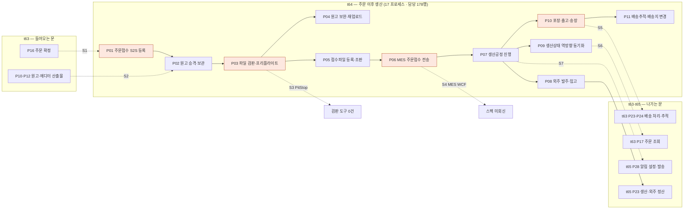

# J3 — 주문 → 검수 → 생산 → 출고 → 배송

t64 카드가 통째로 이 구간이다. 그러나 **양 끝이 다른 카드에 있다** — 들어오는 문은 t63(주문 확정),
나가는 문도 t63(배송 추적)이고, 알림·정산은 t65 다.
t64 verdict 의 표현을 그대로 빌리면 이 구간은 **「코드가 없다」가 아니라 「다리가 없다」** 다.

---

## 길

---

## 묶음 경계에서 끊기는 지점

| # | 경계 | 무엇이 끊기나 | 근거 |
|---|---|---|---|
| **S1** | t63 P16 → **t64 P01** | `order/register` 제공자는 살아 있고 **부르는 쪽이 0건**. 실패 시 재전송·수기 보정 경로도 원장에 없다 | `GX-t63-114`·`GX-t64-002`·`GX-t63-111` · 제공자 `widget_api.py:5591` |
| **S2** | t63 P12 에디터 → **t64 P02 원고 승격** | 결제가 끝나도 **Edicus 쪽 프로젝트는 `editing` 에 머물고 인쇄 데이터 생성이 시작되지 않는다**(`edicus_lookup.py` 자체 주석). S3 원고 파일의 `tmp→order` 승격은 `order/register` 직후로 구현돼 있는데, **그 `order/register` 가 안 불린다**(S1) — 두 끊김이 물려 있다 | `GX-t63-076`(t63 P10 다) · t64 verdict §4 `artwork_promote.py:161-220` |
| **S3** | t64 P03 검판 → **PitStop(외부 조달)** | `pitstop|preflight|virus.?scan|clamav|hotfolder` 세 저장소 전수 grep **0건**(매치는 전부 CORS preflight). 뿌리는 **구매 결정**이고 그건 개발 일이 아니다 | 뿌리 RC-04(8건) · 전제 행 `BLK-S2-4` · 기존 안건 `t50/pitstop-decisions.md` `STD-ART-033`·`034`·`035`·`T4-3` |
| **S4** | t64 P05·P06 → **MES(TS.BackOffice.Huni)** | MES 저장소는 실재하고 생산·바코드 부품도 있는데 **후니 연동이 0건**이고(`huniweb\|webadmin` grep 0), 우리 쪽도 `zeep\|suds\|wcf\|soap` **0건**이다. **WCF 스펙(WSDL·상태 코드·품목 마스터)이 외부 회신 대기**다 | 뿌리 RC-03(42건) · 전제 행 `BLK-S2-3` · t64 verdict §4 |
| **S5** | t64 P10 출고·송장 → **t63 P23·P24 배송** | J1 의 S2 와 같은 자리다. 샵바이 API 는 완비, 호출 0건, 택배사 코드 매핑 없음 | `GX-t63-163`·`GX-t63-164`·`GX-t64-088`·`GX-t64-085`·`GX-t65-097` |
| **S6** | t64 P09 역방향 동기화 → **t63 P17 / t62 P08 주문 조회** | 상태 13칸 중 **4칸만 산다.** 보정 폴링(30분 대사)·TO-1 fail-closed 재확인은 **설계에는 있는데 원장에 행이 없다**. 샵바이 웹훅은 **재전송이 없어** 유실분이 영영 안 온다 | `GX-t64-084`·`GX-t64-082` · t64 verdict §6 「가 33건 중 무거운 것」 ③④ · 뿌리 RC-06(6건) |
| **S7** | t64 P17 파일 알림 → **t65 P28 알림 설정** | **어느 시점에 무엇을 보낼지가 목록으로 정해지지 않았다** — 주문접수·입금확인·제작시작·출고·클레임 접수·답변 등록. t65 P01~P07 의 모든 흐름이 이 목록을 기다린다. 그리고 **카카오 심사 리드타임이 우리 통제 밖**이다 | `GX-t65-082`(t65 P28 라) · 뿌리 RC-09(10건) · 전제 행 `T5-2` |
| **S8** | t64 P14 운영자 주문 운영 → **webadmin** | `config/urls.py` 154경로 전수·`catalog/admin.py` 의 `M.TOrd` grep 결과 **주문 축 화면이 통째로 없다**(상품 축은 잘 돼 있다). 「작동」으로 적힌 `STD-ADO` 6행이 **우리 화면인지 셀러어드민인지 원장에 안 적혀 있어 t64 는 판정하지 않고 남겼다** | t64 verdict §5 미판정 4건 · 뿌리 RC-12 |

---

## 이 여정에서 개발보다 먼저 움직여야 하는 것

t64 verdict §7 의 정리를 그대로 옮긴다 — **셋 다 오늘 보낼 수 있는 요청이고, 셋 다 리드타임이 우리 통제 밖이다.**

1. MES 담당에게 **WCF 스펙 요청**(`BLK-S2-3` → S4)
2. **PitStop 구매 판단**(`BLK-S2-4` → S3)
3. **알림 채널 결정 + 카카오 심사 신청**(`T5-2` → S7)

그 사이에 기다리지 않고 할 수 있는 일은 `../quick-wins.md` 에 담당자별로 모아 두었다.

---

## 한 줄

**양 끝은 각자 돌아가고 가운데 번역기가 통째로 비어 있다.**
그리고 그 번역기를 시작하는 스위치 셋(S3·S4·S7)이 **개발이 아니라 요청**이다.
