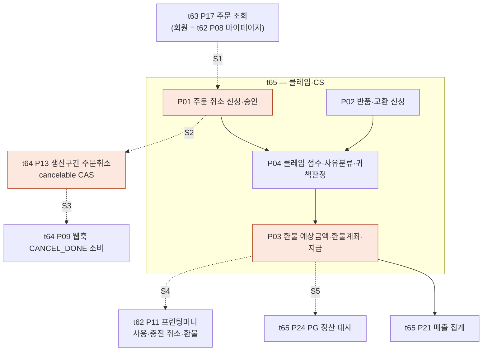

# J4 — 취소·환불

이 여정은 **네 카드를 다 지나간다.** 고객 화면(t63·t65) → 생산 구간의 취소 경합(t64) →
돈 돌려주기(t62 프린팅머니 · t65 정산). 그래서 경계가 가장 많고, 끊긴 자리도 가장 많다.

---

## 길

---

## 묶음 경계에서 끊기는 지점

| # | 경계 | 무엇이 끊기나 | 근거 |
|---|---|---|---|
| **S1** | t63 P17 / t62 P08 조회 → **t65 P01 취소 신청** | huni-mall 에 **취소 신청 화면·호출이 없다** — `src/app/(main)` 라우트 13개에 `claim`·`cancel` 이 없고 마이페이지 컴포넌트 18개에도 클레임 섹션이 없다. 더 나쁜 것은 **`cancel_req`/`cancel_done` 이 「주문취소」 글자가 붙은 상태 칩**이라 고객이 누르면 취소가 아니라 주문 상세가 열린다. 샵바이 Shop API 는 회원·비회원 **대칭으로 다 열려 있다** | `GX-305`(t65 P01 나) · `GX-306`(t65 P01 다) · `GX-308`·`GX-311`·`GX-315` |
| **S2** | t65 P01 취소 → **t64 P13 생산구간 취소** | **「제작 착수」의 시스템 신호가 정해져 있지 않다.** MES 작업지시 생성으로 볼지 PitStop 검판 통과로 볼지에 따라 **고객이 스스로 취소할 수 있는 구간이 달라진다.** 설계는 원자적 전환(CAS)을 말하는데 **`cancelable` 플래그를 만드는 행이 원장에 없다** | `GX-307`(t65 P01 라) · `GX-290`(t64 P13 가) · `GX-292`(t64 P13 가) |
| **S3** | t64 P13 → **t64 P09 웹훅 수신** | 게이트① **셀프 취소 웹훅(`CANCEL_DONE`) 소비**가 설계 FR-3 과 방향이 반대인데 **행이 없다.** 어떤 웹훅 이벤트를 구독했는지도 실측되지 않았고, 샵바이 웹훅은 **재전송이 없다** | `GX-291`(t64 P13 가) · `GX-279`(t64 P09 라) · 뿌리 RC-06 |
| **S4** | t65 P03 환불 → **t62 P10·P11 프린팅머니** | 환불 시 적립금·프린팅머니·쿠폰의 **회수 규칙(부분 취소 시 안분)이 정해지지 않았다.** 그리고 **일부 사용 후 충전 취소 정책(불가 vs 미사용분 부분 환불)이 미결**이라 구현 분기를 정할 수 없다. 둘 다 **프린팅머니 원장 소유 결정이 선행**이다 | `GX-313`(t65 P03 라) · `GX-028`(t62 P11 라) · `GX-029`(t62 P11 나) · 기존 안건 `STD-MYP-050`·`STD-MYP-051` |
| **S5** | t65 P03 환불 → **t65 P24 정산 대사** | **가상계좌 입금분을 환불할 때 고객 환불계좌를 어느 화면에서 어떻게 받을지가 미정**이고 원장 담당도 「미정」이다. 무통장·가상계좌가 현재 **유일하게 동작하는 결제 수단**이라(`checkout-form.tsx:8-9`) 1차 런칭에서 가장 먼저 부딪힌다 | `GX-312`(t65 P03 라) · `GX-389`(t65 P29 라) |
| **S6** | t65 P04 클레임 상태 → **t63 P17·t62 P08 고객 화면** | 원장이 적어 둔 `X-SHOPBY-CLAIM-FSM-01` — **클레임 상태머신이 닫혀 있지 않다.** 수거진행 중간상태가 빠지고 입금대기·교환대기·환불완료 전이가 정의돼 있지 않은데, 고객 화면 라벨은 **7종만 매핑**돼 있다. 정의되지 않은 상태가 오면 고객 화면이 무엇을 보일지 모른다 | `GX-314`(t65 P04 다) |
| **S7** | t65 P04 귀책 판정 → **t65 P03 금액 계산** | **귀책을 누가 어떤 기준으로 정하는지가 운영 규칙으로 없다.** 귀책이 배송비 부담과 환불액을 바꾸므로 금액 계산의 선행이다 | `GX-316`(t65 P04 라) |

---

## 이 여정에 걸린 결정 — 전부 「라」다

| 결정 | 주체(제안) | 무엇이 딸려 있나 |
|---|---|---|
| 프린팅머니 원장 소유 A vs B′ | 신우진(PM)·채훈희 | S4 전체 + t62 P10~P12 + t65 P25 부채 집계 (뿌리 RC-01 · 27건) |
| 「제작 착수」의 시스템 신호 | 신우진(PM) | S2 — 고객 셀프 취소 가능 구간이 여기서 갈린다 |
| 일부 사용 후 충전 취소 정책 | 신우진(PM) | S4 — M4 구현 분기 |
| 환불계좌 수령 화면·경로 | 미정 | S5 — 1차 런칭에서 가장 먼저 부딪힌다 |
| 귀책 판정 기준·주체 | 최숙진 | S7 |
| 결제수단 1차 범위 | 신우진(PM) | S5 + t65 P24 정산 대사 |

전수는 `../decisions.md` 에 결정 주체별로 있다.

---

## 한 줄

**취소 버튼이 없는데 취소 상태 칩은 있다.**
그 아래로 내려가면 끊김이 하나가 아니라 여섯이고, 그중 넷은 코드가 아니라 **아직 안 정한 것**이다.
