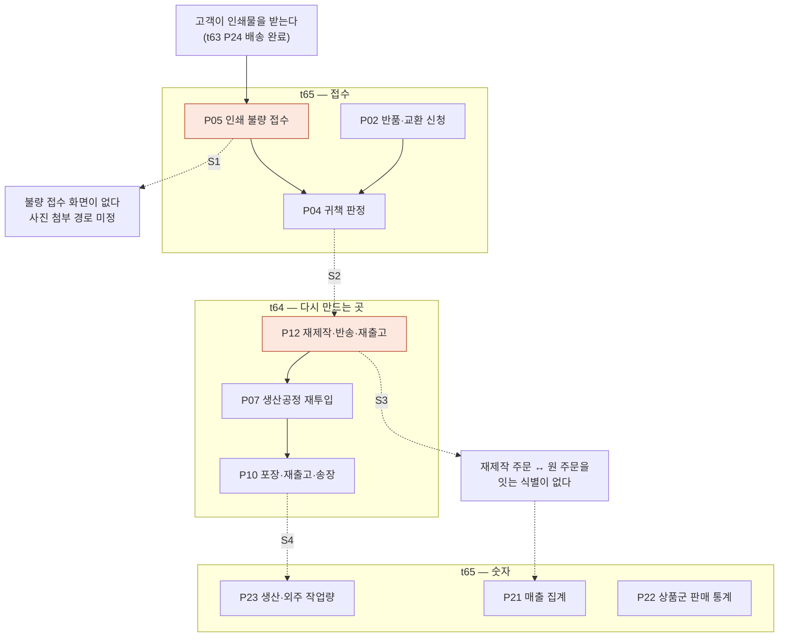

# J5 — 재제작(인쇄 불량)

인쇄는 **다시 만드는 것이 기본 처방**이다(`print-kb/wiki/policy/operations.md#OPS-04` 「재제작 우선」).
그런데 그 길은 **t65(불량 접수) → t64(재투입·재출고) → t65(정산·통계)** 로 카드를 세 번 넘고,
**세 번 다 끊겨 있다.** 게다가 끊김의 성격이 앞의 여정들과 다르다 — 여기서 끊기면 **숫자가 틀어진다.**

---

## 길

---

## 묶음 경계에서 끊기는 지점

| # | 경계 | 무엇이 끊기나 | 근거 |
|---|---|---|---|
| **S1** | 고객 → **t65 P05 불량 접수** | **불량 접수 화면이 huni-mall 에 없다.** 클레임 사유에 실어 보낼 수는 있으나 **사진 첨부 경로(원고 저장소를 재사용할지)가 정해져 있지 않다.** 한편 반품·교환 **정책 문구는 이미 고객에게 보인다**(`product-sections.tsx:227-228` — "제품 불량·인쇄 오류·파손·오염 시 수령 후 7일 이내 접수") — **약속은 화면에 있고 접수구가 없다** | `GX-t65-013`(t65 P05 나) · `GX-t65-005`(t65 P02 다) · `GX-t65-004`(t65 P02 나) |
| **S2** | t65 P05 → **t64 P12 재제작** | **재제작을 새 주문으로 만들지, 원주문에 재투입할지가 미정**이다(원장 판정 「분할」 — 경로 결정은 PM, 운영 절차는 실무운영). **이 갈래 하나로 매출 통계에 재제작분이 두 번 잡히는지가 갈린다.** 그리고 **무상 기준(색 편차·재단 오차 허용 범위)이 수치로 없다** — 「재제작 우선」만 있다 | `GX-t65-014`(t65 P05 라) · `GX-t65-015`(t65 P05 라) · `GX-t64-113`(t64 P12 라) |
| **S3** | t64 P12 안쪽 | **재제작 주문과 원 주문을 잇는 식별이 없다** — 없으면 **매출 이중 계상·원인 추적 단절**. 재제작 시 원고 회차 규칙·생산 쪽 불량 판정 기준·재출고 배송비 정산도 **원장에 행이 없다**. 사람이 전화로 처리하더라도 **웹훅 기록만은 남아야 한다**는 것이 t64 의 제안이다 | `GX-t64-105`·`GX-t64-106`·`GX-t64-107`(t64 P12 가) · `GX-t64-113`(t64 P12 라) |
| **S4** | t64 P10 재출고 → **t65 P23·P21·P22 숫자** | J1·J3 의 출고 끊김(송장 API 호출 0건 · 택배사 코드 매핑 없음)이 **재출고에도 그대로 있다.** 여기에 **분할 출고 시 샵바이 반영 규칙과 송장 정정 업무 흐름**이 없어, 재출고분을 어떻게 반영하는지가 비어 있다 | `GX-t64-088`·`GX-t64-085`·`GX-t64-086`·`GX-t64-087`(t64 P10) · `GX-t63-163`·`GX-t63-164`(t63 P23) |
| **S5** | t65 P02 교환 수거 → **t64 P12** | **수거한 인쇄물의 처리(폐기·보관·검증 보관기간)와 재제작 비용 부담 주체가 정해지지 않았다** | `GX-t65-006`(t65 P02 라) |

---

## 이 여정이 다른 여정과 다른 점

앞의 네 여정에서 끊김은 **「고객이 못 한다」** 였다. 여기서 끊김은 **「숫자가 틀어진다」** 다.

- S2·S3 이 안 정해지면 **같은 인쇄물 한 건이 매출에 두 번 잡힐 수 있다**(`GX-t65-014`·`GX-t64-105`).
- S3 이 없으면 **왜 다시 만들었는지 추적이 끊긴다** — 불량 원인이 쌓이지 않아 다음에도 같은 이유로 다시 만든다.
- t65 P22 는 이미 같은 문제를 안고 있다 — **수작 상품이 어느 시스템에 사는지 미정이라 통계 분모부터 안 정해진다**.

---

## 한 줄

**다시 만드는 길은 코드보다 규칙이 먼저 비어 있다.**
무상 기준(수치)·새 주문 여부·원주문 연결키 — 셋 다 **정하면 되는 것**이고,
정하기 전에는 **만들어도 숫자가 맞지 않는다.**
