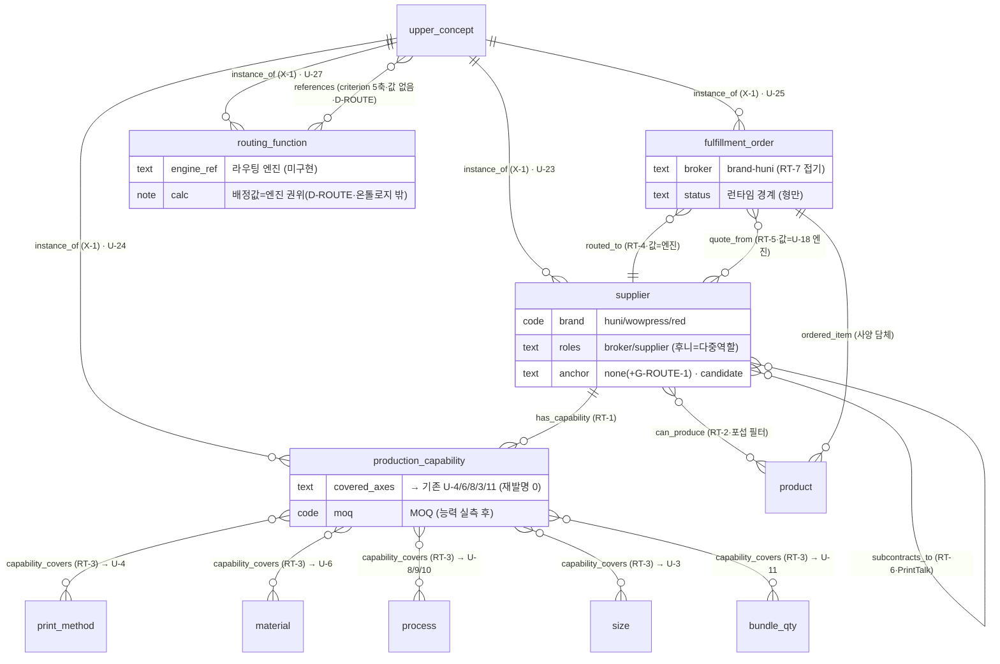

# 라우팅 층 스키마 — 주문 라우팅·이행(Fulfillment) 정식 편입 (§35 Phase 3 확장 산출)

> 작성: 2026-07-04 · mbo-ontology-architect · 방법론 = `mbo-ontology-design` 스킬.
> 상위 권위: §35 `03_upper_ontology/upper-ontology-schema.md`(개체 E1~E21+E-U·관계 폐쇄 23종·D-18)·§33 `02_ontology/ontology-schema.md`(v1.0.2·17종·19종) **읽기 재사용·무손상**.
> 입력: `00_research/structure/order-routing-fulfillment-ontology-research.md`(4프론트·CIP4 PrintTalk·JDF DeviceCapabilities·MSDL/MaRCO·schema.org Order/Offer)·`routing-schema-proposal.md`(U-23~U-27·E22~E25·RT-1~RT-7·D-ROUTE)·`structure-recommendations.md`.
> **[HARD] 지어내기 차단 [최중요]**: 후니·와우·레드 라이브에 공급자·능력·라우팅 **데이터 자체가 없다**(G-ROUTE-1). 이 층은 **형(型)/스키마만** — 전 브랜드 실물 노드 `anchor=none` 또는 `badge=candidate`(gap_ref=G-ROUTE-1). 실 앵커 = 공급자 레지스트리 확보 후(별도 도메인·인간 결정).
> **[HARD] search-before-mint**: 능력은 새 어휘를 만들지 않고 **기존 생산 축(print_method·material·process·size·bundle_qty)을 `capability_covers`로 가리킨다**(재발명 0). CIP4 PrintTalk·schema.org·MSDL 표준 이름표 재사용.
> **[HARD] 경계 동형 D-ROUTE(D-18 동형)**: 온톨로지 = can_produce 후보 필터 + 라우팅 기준 축 노드화까지. 실제 배정 스코어링·다목적 최적화 = 엔진 권위(routing_function=경계 노드·anchor=none).
> **[HARD] architecture-neutral**: "독립 §35 시작 후 §33 통합"(사용자 확정) 위에 얹힘. 두 결정 어느 쪽이든 재사용.
>
> **읽는 법(비전문가용):** 지금 온톨로지는 "이 고객 질의 → 이 상품 → 이 가격"까지 안다. 이 문서는 그 **뒤**에 "그럼 이 주문을 **어느 인쇄소가 실제로 찍나**"를 붙이는 새 층이다. 핵심 아이디어 하나: 인쇄소의 "능력"은 새 언어가 아니라, 이미 온톨로지가 아는 생산 축(인쇄방식·용지·후가공·사이즈·최소수량)으로 적는다 — "이 인쇄소는 UV인쇄 O·무선제본 O·최소 500장". 그러면 "이 주문 사양이 이 능력 안에 드나?"만 따져 후보 인쇄소가 걸러진다. 단, "누가 제일 싸고 빠른가"의 실제 계산은 온톨로지 밖(엔진)이다. **그리고 지금은 실제 공급자 데이터가 0개라, 이 문서는 그릇(스키마)만 만들고 그릇은 전부 비어 있음을 정직하게 표시한다.**

---

## 0. 설계 요약 (한 장)

- **신규 개체 4종**(E22~E25) — 현행 마지막 브랜드 개체 **E21 brand** 뒤에 정확히 이어붙임(리서치 제안 E22~E25와 번호 일치·reconcile 완료). `supplier`(E22)·`production_capability`(E23)·`fulfillment_order`(E24)·`routing_function`(E25).
- **신규 개체 미신설 1종(★search-before-mint 결정)**: 리서치가 "E-U 하위 or 축노드"로 열어둔 **RoutingCriterion(라우팅 기준 축 cost·lead_time·capacity·moq·quality)은 신규 개체를 만들지 않고 `upper_concept`(E-U) 재사용**으로 접는다 — 축 자체는 브랜드-중립 표준 개념이므로 upper_concept 자격 충족. 따라서 신규 브랜드 개체는 정확히 **E22~E25 4종**뿐(과공학 회피).
- **★핵심 재사용 설계**: `production_capability`(E23)는 자체 능력 어휘를 **새로 만들지 않는다.** 공급자 능력 = **이미 있는 생산 축 노드의 커버 집합**을 `capability_covers`(RT-3)로 가리킴(print_method U-4·material U-6·process U-8/9/10·size U-3·bundle_qty U-11). 매칭 = **주문 사양 축값 ⊆ 능력 커버 집합(포섭/subsumption)** → `can_produce`. 인쇄 개념 재발명 0.
- **신규 상위 개념 5종**(U-23~U-27) — 전부 표준 이름표 보유(§4). `SupplierConcept`·`ProductionCapability`·`FulfillmentOrder`·`RoutingCriterion`·`RoutingFunction`.
- **신규 관계 6종**(RT-1~RT-6): `has_capability`·`can_produce`·`capability_covers`·`routed_to`·`quote_from`·`subcontracts_to`. 폐쇄목록 **23 → 29종**. `brokered_by`(RT-7)는 **접기**(fulfillment_order.broker 속성·후니=고정 중개자).
- **경계 D-ROUTE(D-18 동형)**: can_produce 필터(사양⊆능력) + RoutingCriterion 축 노드(값 없음)까지 온톨로지. 배정 스코어링·다목적 최적화·최종 배정값 = **routing_function(E25·anchor=none·값=엔진 권위·U-18 quote_function과 완전 동형)**.
- **후니 = 다중역할**: `supplier-huni`.roles = `[broker, supplier]`(중개·라우터 + 자기 이행). 와우/레드/외부 trade printer = `[supplier]`.
- **닫힌세계 정직성**: 실 공급자·능력·라우팅 데이터 부재 → **E22~E25 전 실물 노드 현재 GAP/candidate**. 스키마 형(型)만·실 앵커는 공급자 레지스트리 확보 후. 신설 lint L-ROUTE-*가 "스키마는 열되 인스턴스는 GAP"을 lint 위반 없이 강제(§7).
- **레드 미포함·확장 대비**: brand 열 확장 = `red-supplier-*` 노드 append + instance_of만(어휘·스키마 불변).

---

## 1. 신규 개체 유형 4종 (E22~E25 — E21 뒤 정확히 이어붙임)

`upper-ontology-schema.md` §1.2 개체(E1~E21+E-U) 연장. **★현재 전부 GAP/candidate**(G-ROUTE-1: 실 공급자·능력·라우팅 데이터 부재). 각 행: 유형 → 정의 → id 접두 → 앵커 정책(현재) → 핵심 속성 → 표준 이름표. **닫힌세계 유지**(anchor 실재 or GAP·§7).

| # | type | 정의(쉬운 말) | id 접두사 | 앵커 정책(현재=스키마만) | 핵심 속성 | 표준 이름표 | 유래 |
|---|------|--------------|-----------|--------------------------|-----------|-------------|------|
| **E22** | `supplier` | 주문을 실제 이행하는 인쇄소/공급자 1개(다중역할 가능) | `supplier-`(huni자기)·`wow-supplier-`·`red-supplier-`·`ext-supplier-`(외부 trade printer) | ⚪ `none`(+사유="공급자 레지스트리 미확보·G-ROUTE-1") · badge=candidate · **레지스트리 확보 후 조직 앵커**(homepage/사업자) | brand·legal_name·**roles**(supplier/broker)·homepage·areaServed | schema.org **seller/provider(Organization)** · PrintTalk provider/**Subcontractor** · MSDL **Supplier** | 신규(표준 3중 앵커·강함) |
| **E23** | `production_capability` | 공급자가 "할 수 있는 것" 1개(축 커버 묶음) | `cap-` | ⚪ `none`(+사유="능력 실측 부재·G-ROUTE-1") · badge=candidate | supplier_ref·**covered_axes**(→기존 U-4/6/8/3/11 노드)·moq·max_qty | JDF **DeviceCapabilities**(속도·색수/용지 한계·모듈) 🟡 · MSDL **ManufacturingCapability** · **MaRCO** | 신규(schema.org 공백 GAP-ROUTE-2·§2) |
| **E24** | `fulfillment_order` | 이행 대상 주문(라우팅 입력·사양 담체) | `ford-` | ⚪ `none`(+사유="주문 인스턴스=런타임·온톨로지엔 형만") · badge=candidate · gap_ref=G-ROUTE-1/3 | ordered_item(→product)·spec_axes(사양)·qty·**broker**(=brand-huni·RT-7 접기)·criteria_weights(→엔진)·status | schema.org **Order/OrderItem** · PrintTalk **RFQ/PurchaseOrder** | 신규(표준 강함·A 에이전트 경계) |
| **E25** | `routing_function` | 배정 최적화 경계(값=엔진 권위) | `routefn-` | `none`(+사유="배정 엔진·표준 공백·D-ROUTE") — **정당 none**(E19 quote_function 선례) | brand·engine_ref·input_criteria(→U-26 축)·output(routed supplier) | **표준 없음**(명시적 공백·U-27·U-18 동형) | 신규(경계 노드·표준 공백) |

**신규 4 유형의 정당성(search-before-mint 통과 근거):**
- **E22 `supplier`** = schema.org seller/provider + PrintTalk subcontractor + MSDL Supplier **3중 표준 앵커** → 표준 강함. brand 축(E21/U-22)과 **직교**: 한 공급자는 한 brand이나 brand≠supplier(brand=출처 조직 축, supplier=이행 역할). 후니는 brand=huni인 동시에 supplier-huni(roles=[broker,supplier]).
- **E23 `production_capability`** = schema.org에 능력 타입 **없음**(GAP-ROUTE-2). JDF DeviceCapabilities(🟡 XJDF 폐기·GAP-ROUTE-1) + MSDL/MaRCO 차용. **자체 열거 안 만듦** — U-4/U-6/U-8/U-3/U-11 재사용(§2). 이 재사용이 이 층의 핵심.
- **E24 `fulfillment_order`** = §33/§35에 주문 노드가 없다(추천·가격까지만 모델). 라우팅 입력(사양 담체)이 노드로 실재해야 `routed_to`·`quote_from`으로 공급자에 건다. **주문 인스턴스는 런타임** → 온톨로지엔 형(型)만(A 에이전트=추천→주문 경계와 접합점, §10 G-ROUTE-3).
- **E25 `routing_function`** = **E19 quote_function과 완전 동형** 경계 노드. 표준 공백·값=엔진·anchor=none(+사유). 두 경계 노드(quote_function·routing_function)가 D-18·D-ROUTE 경계를 그래프에 명시.

---

## 2. ★능력 = 기존 생산 축 재사용 (search-before-mint 핵심·이 층의 심장)

`production_capability`(E23)는 **새 어휘를 만들지 않는다.** 공급자 능력 프로파일 = **이미 있는 상위 축 노드의 커버 집합**을 `capability_covers`(RT-3)로 가리킴:

| 능력 차원 | 재사용 상위 개념(현행) | 재사용 브랜드 노드 | 능력 표현 예 | can_produce 매칭 규칙(포섭) |
|---|---|---|---|---|
| 인쇄방식 | **U-4 PrintMethodIntent**(E18 print_method) | `printmethod-*`·`wow-prsjob-*` | "합판디지털·독판옵셋·UV 가능" | 주문 print_method ∈ 능력 커버 집합 |
| 자재/용지 | **U-6 MediaClass**(E4 material) | `material-MAT_*`·`wow-paper-*` | "스노우·아트지 계열·특수지 일부" | 주문 material ⊆ 커버 |
| 후가공 | **U-8 FinishingOp**(E6 process) | `process-PROC_*`·`wow-awkjob-*` | "코팅·타공·박 가능·귀도리 불가" | 주문 process ⊆ 커버 |
| 제본 | **U-9 BindingType**(E6 process) | `process-*`(제본류) | "무선·중철 가능·양장 불가" | 주문 binding ∈ 커버 |
| 사이즈 | **U-3 DimensionSpec**(E3 size) | `size-*`·`wow-size-*` | "max 국전·min 명함" | 주문 size ∈ 커버 범위 |
| 수량/MOQ | **U-11 QuantityRule**(E8 bundle_qty) | `qty-*`·wow ordqty | "MOQ 500·max 100k" | 주문 qty ∈ [moq, max_qty] |

- **매칭 = 포섭(subsumption)**: 주문 사양의 각 축값이 공급자 능력 커버 집합의 (하위)원소 → `can_produce`(RT-2). 학술 근거 = Product Model matchmaking(개념명 수준 포섭·research §2.3)·Cloud-Mfg semantic matching(§2.4).
- **결합 능력(combined capability)**: 공급자가 여러 단순 능력을 가지면 전 사양 커버(MaRCO·research §2.2). 결합 판정 자체는 reasoner/엔진(경계 밖·D-ROUTE).
- **재발명 0 원칙 명시**: `capability_covers`가 가리키는 target은 **전부 기존 노드**(E18/E4/E6/E3/E8·U-3/4/6/8/9/11). production_capability는 "어느 축값들을 묶어 가리키느냐"의 컨테이너일 뿐 — 인쇄 개념·축 값 어휘를 새로 만들지 않는다. 이것이 라우팅 축이 "새 KB"가 아니라 "기존 축의 재사용 + 공급자 노드"인 이유.
- **가격 축 접합**: `quote_from`(RT-5)은 각 supplier의 `quote_function`(E19·U-18)으로 잇는다. "공급자마다 다른 가격 엔진"(후니 evaluate_price·와우 jobcost)은 **기존 U-18 경계 재사용**(신규 가격 어휘 0).

---

## 3. 신규 관계 6종 (폐쇄목록 23 → 29종)

`upper-ontology-schema.md` §2.2 관계 폐쇄목록(23종 = §33 19 + X-1 instance_of·X-3 same_family_as·X-4 price_model_differs·X-5 component_differs) 연장. 각 행: 관계 → 방향 → 의미 → 표준 이름표 → 카디널리티 → 층 소속(온톨로지/엔진).

| # | rel | 방향(source→target) | 의미 | 표준 이름표 | 카디널리티 | 층 |
|---|-----|--------------------|------|-----------|-----------|-----|
| **RT-1** | `has_capability` | supplier → production_capability | 공급자가 능력 프로파일 보유 | MSDL **hasCapability** | 1:N | 온톨로지 |
| **RT-2** | `can_produce` | supplier → product / product_family | 공급자가 이 상품(군)/사양 생산 가능(포섭 매칭 결과) | Product Model matchmaking · schema.org **provider** | N:M | 온톨로지(필터) |
| **RT-3** | `capability_covers` | production_capability → (print_method\|material\|process\|size\|bundle_qty) | 능력이 어느 생산 축값을 커버(★기존 축 재사용) | JDF DeviceCapabilities · MaRCO | N:M | 온톨로지 |
| **RT-4** | `routed_to` | fulfillment_order → supplier | 주문이 이 공급자에 배정됨(**엣지=온톨로지·최종 선택값=엔진**) | schema.org Order.**seller** · PrintTalk PurchaseOrder | N:1 | 경계(엣지 존재까지) |
| **RT-5** | `quote_from` | fulfillment_order / product → supplier (경유 quote_function) | 이 공급자에게 받은 견적(**엣지=온톨로지·값=U-18 엔진**) | schema.org acceptedOffer · PrintTalk **Quotation** | N:M | 경계(엣지 존재까지) |
| **RT-6** | `subcontracts_to` | supplier → supplier | 하도급 이행(신원 은닉 가능) | **PrintTalk Subcontracting** | N:M | 온톨로지 |

- **RT-7 `brokered_by` 접기 결정**: schema.org Order.broker는 실재 어휘이나, 후니=broker는 대개 고정(단일 중개자) → 개체·엣지 신설보다 **`fulfillment_order.broker=brand-huni` 속성**으로 접기(routing-schema-proposal §5 권고 채택). 다중 중개(레드도 중개) 실증 시 승격(§10 G-ROUTE-4).
- **폐쇄목록 총계**: 현행 23 + RT-1~RT-6 = **29종**. 개방 관계명 사용 = lint FAIL(§33 D-7·L-14 승계).
- **경계 관계(RT-4·RT-5)**: 엣지는 온톨로지("배정/견적 관계가 있다"), **값(어느 공급자로 최종·얼마·며칠)은 엔진**(routing_function·quote_function). 이 이원성이 D-ROUTE 경계선(§6).
- **관계 사용 규칙**: (RT-2) `can_produce`는 반드시 대응 `has_capability`+`capability_covers` 포섭 근거를 동반(고아 can_produce 금지). (RT-3) target은 **기존 축 노드만**(신규 축 mint 금지·L-ROUTE-2). (RT-6) `subcontracts_to`는 두 supplier가 각각 `has_capability`를 가질 때만(빈 하도급 금지).

---

## 4. 신규 상위 개념 5종 (U-23~U-27·표준 이름표)

`00_research/upper-ontology-vocabulary.md` U-1~U-22 연장. 각 상위 개념 → 정의 → schema.org / CIP4 / 제조 온톨로지 이름표 → 브랜드 하위 대응.

| # | 상위 개념(E-U) | 정의(쉬운 말) | schema.org | CIP4 | 제조 온톨로지 | 브랜드 하위(예) |
|---|---|---|---|---|---|---|
| **U-23** | `UPPER_SupplierConcept` | 주문을 실제 이행하는 공급자 1개 | **seller / provider(Organization)** | PrintTalk provider · **Subcontractor** | MSDL **Supplier** | supplier-huni · wow-supplier-* · ext-supplier-* (E22) |
| **U-24** | `UPPER_ProductionCapability` | 공급자가 "할 수 있는 것"(축 커버) | — **(공백·GAP-ROUTE-2)** | **JDF DeviceCapabilities** 🟡 | MSDL **ManufacturingCapability**·**MaRCO** | cap-* (E23·covered_axes→U-4/6/8/3/11) |
| **U-25** | `UPPER_FulfillmentOrder` | 이행 대상 주문(라우팅 입력·사양 담체) | **Order / OrderItem** | **PrintTalk RFQ / PurchaseOrder** | — | ford-* (E24·형만) |
| **U-26** | `UPPER_RoutingCriterion` | 배정 결정 기준 축(값=엔진) | Offer.**deliveryLeadTime**·**eligibleQuantity**·areaServed | (MIS 스코어카드) | Cloud-Mfg matching criteria | criterion-cost·-leadtime·-capacity·-moq·-quality (**E-U 재사용·§4.1**) |
| **U-27** | `UPPER_RoutingFunction` | 최적 배정 경계(값=엔진 권위) | — **표준 없음** | — | Cloud-Mfg **multi-objective optimization**(엔진측) | routefn-huni · routefn-wow (E25) |

- **U-23** = 3중 표준 앵커(seller/provider·subcontractor·MSDL Supplier) → 표준 강함.
- **U-24** = schema.org 공백 → JDF/MSDL/MaRCO 차용. **자체 열거 안 만듦**(§2 재사용).
- **U-27** = **U-18 QuoteFunction과 완전 동형**: 표준 공백·값=엔진·경계 노드까지.

### 4.1 ★RoutingCriterion 5축 = upper_concept(E-U) 재사용 (신규 개체 미신설)

라우팅 기준 축 5종(cost·lead_time·capacity·moq·quality)은 **브랜드-중립 표준 개념**이므로 신규 개체를 만들지 않고 `upper_concept`(E-U) 노드로 표현한다. 각 노드 anchor=none(+사유="라우팅 기준 축·표준 이름표") + standard_url 필수(L-UP-1 승계).

| criterion 노드(E-U) | u_id | 정의 | 표준 이름표(값 아님·축 이름) |
|---|---|---|---|
| `criterion-cost` | U-26.1 | 총비용(인쇄+배송 TCO) | 공급자 스코어카드 TCO · 특허 8,861,005(비용 추정) |
| `criterion-leadtime` | U-26.2 | 납기(주문→출고 지연) | schema.org **Offer.deliveryLeadTime**(QuantitativeValue) |
| `criterion-capacity` | U-26.3 | 현재 작업 용량·가용성 | 특허 8,861,005(현재 용량 능력) · Cloud-Mfg |
| `criterion-moq` | U-26.4 | 최소주문수량·수량 유효구간 | schema.org **Offer.eligibleQuantity** |
| `criterion-quality` | U-26.5 | 품질(불량률·정시납품률) | 공급자 스코어카드 quality/OTD |

- **왜 신규 개체 아닌가(search-before-mint)**: 이 5축은 (1) 노드로 실재해야 하고(D-ROUTE=기준 축 노드화까지가 온톨로지 소속), (2) 브랜드-중립 표준 개념(schema.org/스코어카드 이름표 보유), (3) upper_concept 정의("브랜드-중립 표준 개념 1개")에 정확히 부합. → E-U 재사용이 최소 mint. **축(이름)만 노드화·값(며칠·얼마·몇%)은 엔진**(§6 D-ROUTE).
- routing_function(E25).input_criteria = 이 5개 criterion 노드를 참조(references R19·값 아님).

---

## 5. 상위-하위 2층 매핑 (instance_of 배선·라우팅 축)

`upper-ontology-schema.md` §4 매핑표(U-1~U-22) 연장. instance_of(X-1) 배선.

| upper_concept(U-) | 후니 노드 --instance_of--> | 와우 노드 --instance_of--> | 브랜드 실물 유형 |
|---|---|---|---|
| **`UPPER_SupplierConcept`(U-23)** | `supplier-huni`(roles=[broker,supplier]) | `wow-supplier-*` · `ext-supplier-*` | **E22 supplier(신규)** |
| **`UPPER_ProductionCapability`(U-24)** | `cap-huni-*`(covered_axes→기존 U-4/6/8/3/11) | `cap-wow-*` · `cap-ext-*` | **E23 production_capability(신규)** |
| **`UPPER_FulfillmentOrder`(U-25)** | `ford-*`(형만·런타임 경계) | (공통·브랜드 무관 주문) | **E24 fulfillment_order(신규)** |
| **`UPPER_RoutingCriterion`(U-26)** | `criterion-*` 5종(E-U 재사용·브랜드-중립) | (공통) | E-U upper_concept(재사용) |
| **`UPPER_RoutingFunction`(U-27)** | `routefn-huni`(evaluate 후단) | `routefn-wow` | **E25 routing_function(신규)** |

- **후니 다중역할**: `supplier-huni`.roles=[broker,supplier]. 자기 이행(supplier) + 중개·라우팅(broker=fulfillment_order.broker). 와우/레드/외부 trade printer = roles=[supplier].
- **레드 확장 안전**: 레드 공급자 추가 = `red-supplier-*`·`cap-red-*` 노드에 instance_of만 → 어휘·스키마 불변(§35 architecture-neutral·GAP-DELTA-2 승계).
- **가격 축 접합**: `quote_from`(RT-5) → 각 supplier의 quote_function(U-18)로. 신규 가격 어휘 0.

---

## 6. 경계 규칙 D-ROUTE (D-18 동형·신규 경계 선언)

```
온톨로지 (KB)                                       |  엔진 (권위)
----------------------------------------------------|----------------------------------
· has_capability / capability_covers (능력 기술)      |
· can_produce (사양 ⊆ 능력 포섭 필터·후보 공급자 집합)   |
· RoutingCriterion 축 노드 5종(cost·leadtime·        |  · 기준 값 측정·수집(며칠·얼마·몇%)
  capacity·moq·quality) — 축 이름만·값 없음            |  · 다목적 스코어링·가중 최적화
· routed_to / quote_from 엣지(배정/견적 관계 존재)     |  · 최종 배정 공급자 결정(값)
· routing_function 경계 노드(anchor=none·U-27)        |  · quote 값(U-18 엔진·서버 권위)
· subcontracts_to (하도급 관계)                       |  · load-balancing 실행(PrintTalk)
```

- **근거**: Cloud-Manufacturing "semantic matching(온톨로지) → multi-objective optimization(엔진)" 2단계(research §2.4·§4.3). 가격 D-18("축·구성요소 연결까지·값은 엔진")과 **완전 동형**.
- **판정 기준**: 온톨로지가 **후보 공급자를 좁히고(can_produce) 기준 축을 제공(criterion 5종)**하면 임무 완료. "누가 최종·얼마·며칠·몇% 유리"는 엔진(routing_function·quote_function). KB는 배정 값 계산·저장 안 함.
- **경계 노드 동형 확정**: E19 quote_function(D-18)과 E25 routing_function(D-ROUTE)이 각각 "값=엔진" 경계를 그래프에 명시. 두 노드 모두 anchor=none(+사유·표준 공백) — 정당한 none(§7).

---

## 7. 닫힌세계 정직성 — "스키마는 열되 인스턴스는 GAP" (지어내기 차단 [최중요])

**G-ROUTE-1: 후니·와우·레드 라이브에 공급자·능력·라우팅 데이터 자체가 없다(라우팅 미도입 도메인).** 따라서 이 층은 **형(型)/스키마만** — 전 브랜드 실물 노드는 실 앵커가 없다. `brand-anchor-spec.md` §3 닫힌세계 검사를 다음으로 확장한다(lint 위반 없이 정직하게).

### 7.1 신설 lint 규칙 L-ROUTE-*

| # | 규칙 | 판정 |
|---|------|------|
| **L-ROUTE-1** | 라우팅 실물 노드(supplier·production_capability·fulfillment_order)는 실 앵커가 **없으면** `anchor=none`(+사유) **AND** `badge=candidate` **AND** `gap_ref=G-ROUTE-1` 3필드 동반 필수. 셋 중 하나라도 없이 사실 단정 = FAIL(지어내기 차단) | 미동반 단정 = FAIL |
| **L-ROUTE-2** | `capability_covers`(RT-3) target은 **기존 축 노드**(E18 print_method·E4 material·E6 process·E3 size·E8 bundle_qty)만. 신규 축 mint = FAIL(재발명 0 강제) | 신규 축 = FAIL |
| **L-ROUTE-3** | `can_produce`(RT-2)는 포섭 근거(대응 has_capability + capability_covers) 없이 배선 금지(고아 can_produce = 근거 없는 매칭) | 근거 없음 = FAIL |
| **L-ROUTE-4** | `routing_function`(E25)·criterion 노드는 anchor=none(+사유="배정 엔진/기준 축·표준 공백") — 정당 none(E19·upper_concept 선례). 단 criterion은 standard_url 필수(L-UP-1 승계) | 사유·표준 미근거 = FAIL |
| **L-ROUTE-5** | 실 공급자 레지스트리 확보 시 supplier/capability 노드는 조직 앵커(homepage/사업자)·능력 실측 앵커로 승격하고 badge=candidate→verified·gap_ref 제거(생성≠검증·게이트 후) | (전이 규약) |

### 7.2 닫힌세계 원칙 (지어내기 완전 차단·확장)

```
라우팅 실물 노드(supplier·capability·fulfillment_order)
   → 실 앵커 부재 → anchor=none(+사유) + badge=candidate + gap_ref=G-ROUTE-1  (3필드 정직 표시)
   → 실 앵커 확보(레지스트리) 후에만 → 조직/능력 앵커 승격 + verified (게이트+인간 후)
경계 노드(routing_function·criterion)  → anchor=none(+사유·표준 공백) — 정당 none
capability_covers target                → 반드시 기존 축 노드(신규 mint 금지·L-ROUTE-2)
불확실·미도입                            → GAP(지어내지 않음·§33 gap 패턴 승계)
```

> **핵심**: 스키마(type·relation·upper_concept)는 **열려 있고**(설계 완료), 실물 인스턴스는 **전부 GAP/candidate로 정직 표시**. 이것이 "스키마는 열되 인스턴스는 지어내지 않음"의 lint-검사 가능한 구현. 파일럿 예시 노드(§8)도 전부 badge=candidate + gap_ref로 이 규약 시연.

---

## 8. 파일럿 예시 노드 (스키마 자기점검·2~3개·전부 GAP/candidate)

> 스키마가 실물에 먹히는지 검증. **★현재 실 데이터 부재(G-ROUTE-1) → 전 노드 badge=candidate + gap_ref**. 축 재사용·경계·정직성 시연용(값·실 공급자 아님).

### 8.1 예시 A — 상위 개념 노드 `UPPER_ProductionCapability` (E-U/U-24·브랜드-중립)
```yaml
id: UPPER_ProductionCapability
type: upper_concept
anchor: none        # 사유: 표준 개념 레이어(JDF DeviceCapabilities·MSDL ManufacturingCapability)
badge: candidate    # 🟡 GAP-ROUTE-2(schema.org 능력 타입 공백·JDF/MSDL 차용)
u_id: U-24
standard_class: "JDF DeviceCapabilities (레거시) / MSDL ManufacturingCapability / MaRCO capability"
standard_url: "https://www.cip4.org/print-automation/jdf"
props: {schema_org: "(공백)", cip4: "DeviceCapabilities", mfg_ont: "MSDL/MaRCO"}
sources:
  - {source_file: "00_research/structure/order-routing-fulfillment-ontology-research.md", source_locator: "§1.2 DeviceCapabilities·§2.1 MSDL·GAP-ROUTE-2", captured_at: "2026-07-04", badge: candidate, src_id: SR35-ROUTE-RES}
  - {source_file: "00_research/structure/routing-schema-proposal.md", source_locator: "U-24", captured_at: "2026-07-04", badge: candidate, src_id: SR35-ROUTE-PROP}
updated: 2026-07-04
```

### 8.2 예시 B — 후니 공급자 노드 `supplier-huni` (E22·다중역할·현재 GAP)
```yaml
id: supplier-huni
type: supplier
anchor: none            # 사유: 공급자 레지스트리 미확보·G-ROUTE-1 (레지스트리 확보 후 조직 앵커 승격)
badge: candidate        # 🟡 실 공급자 데이터 부재
gap_ref: G-ROUTE-1      # L-ROUTE-1 3필드(none+candidate+gap_ref) 정직 표시
brand: huni
props:
  legal_name: "후니프린팅"
  roles: [broker, supplier]     # ★다중역할: 중개(라우터) + 자기 이행
  homepage: "(레지스트리 확보 후)"
relations:
  - {rel: instance_of, target: UPPER_SupplierConcept}          # X-1 (2층 연결)
  - {rel: has_capability, target: cap-huni-digital-namecard}   # RT-1
sources:
  - {source_file: "00_research/structure/routing-schema-proposal.md", source_locator: "§4 E22 supplier·후니 다중역할 roles=[broker,supplier]", captured_at: "2026-07-04", badge: candidate, src_id: SR35-ROUTE-PROP}
updated: 2026-07-04
```
본문: 후니 = broker(중개·라우터·fulfillment_order.broker=brand-huni) + supplier(자기 이행). 와우/외부 trade printer = roles=[supplier]. **현재 실 공급자 레지스트리 부재로 anchor=none+candidate+gap_ref**(L-ROUTE-1). 레지스트리 확보 후 조직 앵커 승격.

### 8.3 예시 C — 후니 능력 노드 `cap-huni-digital-namecard` (E23·★축 재사용 시연·현재 GAP)
```yaml
id: cap-huni-digital-namecard
type: production_capability
anchor: none            # 사유: 능력 실측 부재·G-ROUTE-1
badge: candidate        # 🟡
gap_ref: G-ROUTE-1
brand: huni
props:
  supplier_ref: supplier-huni
  moq: "(능력 실측 후)"
  max_qty: "(능력 실측 후)"
relations:
  - {rel: instance_of, target: UPPER_ProductionCapability}       # X-1
  # ★capability_covers = 전부 기존 축 노드 재사용(신규 mint 0·L-ROUTE-2)
  - {rel: capability_covers, target: printmethod-huni-digital}   # RT-3 → E18 print_method(U-4) ※§35 투영 노드(실 t_* 앵커 아님·E18 투영)
  - {rel: capability_covers, target: material-MAT_000074}        # RT-3 → E4 material(U-6) [§33 실 노드]
  - {rel: capability_covers, target: process-PROC_000004}        # RT-3 → E6 process(U-8) [§33 실 노드]
  - {rel: capability_covers, target: size-SIZ_*}                 # RT-3 → E3 size(U-3) ※실 SIZ 코드=능력 실측 후 확정(예시·§33 규약 size-SIZ_*)
  - {rel: capability_covers, target: qty-016}                    # RT-3 → E8 bundle_qty(U-11)
sources:
  - {source_file: "00_research/structure/routing-schema-proposal.md", source_locator: "§2 능력=기존 생산 축 재사용·§4 E23", captured_at: "2026-07-04", badge: candidate, src_id: SR35-ROUTE-PROP}
updated: 2026-07-04
```
본문: **★핵심 시연** — 능력이 새 어휘 없이 기존 축 노드(print_method·material·process·size·bundle_qty) 5개를 `capability_covers`로 가리킴. 주문 사양 축값이 이 커버 집합의 부분집합이면 `supplier-huni --can_produce--> 그 명함 상품`(포섭). 재발명 0.

### 8.4 예시 D — 라우팅 함수 경계 노드 `routefn-huni` (E25·경계·정당 none)
```yaml
id: routefn-huni
type: routing_function
anchor: none        # 사유: 배정 엔진·표준 공백·D-ROUTE(값=엔진 권위·U-18 quote_function 동형)
badge: candidate    # 🟡 라우팅 엔진 미구현
props:
  engine_ref: "(후니 라우팅 엔진·미구현)"
relations:
  - {rel: instance_of, target: UPPER_RoutingFunction}   # X-1 (U-27)
  # input_criteria = criterion 5축 참조(값 아님·축 이름만·D-ROUTE)
  - {rel: references, target: criterion-cost}            # R19
  - {rel: references, target: criterion-leadtime}
  - {rel: references, target: criterion-capacity}
  - {rel: references, target: criterion-moq}
  - {rel: references, target: criterion-quality}
sources:
  - {source_file: "00_research/structure/order-routing-fulfillment-ontology-research.md", source_locator: "§4.3 경계 D-ROUTE·U-27 표준 공백", captured_at: "2026-07-04", badge: candidate, src_id: SR35-ROUTE-RES}
updated: 2026-07-04
```

### 8.5 자기점검 결과

| 점검 | 결과 |
|------|------|
| 신규 4 개체(E22~E25)가 E21 뒤 정확히 이어붙나·리서치 제안과 reconcile | ✅ E22 supplier·E23 production_capability·E24 fulfillment_order·E25 routing_function. 제안 번호 일치 |
| 능력이 기존 축 재사용(재발명 0)으로 표현되나 | ✅ cap 노드 capability_covers → print_method/material/process/size/bundle_qty 5개 전부 기존 노드(§8.3·L-ROUTE-2) |
| can_produce 포섭 매칭이 성립하나 | ✅ 주문 사양 축값 ⊆ capability_covers 집합 → can_produce(§2·research §2.3) |
| D-ROUTE 경계가 그래프에 명시되나 | ✅ routing_function(anchor=none·값=엔진) + criterion 5축(값 없음). 배정값=엔진(§6) |
| 후니 다중역할(broker+supplier)이 표현되나 | ✅ supplier-huni.roles=[broker,supplier] + fulfillment_order.broker(RT-7 접기) |
| 전 노드 GAP 정직성(지어내기 차단) 유지되나 | ✅ E22~E24 실물 전부 anchor=none+badge=candidate+gap_ref=G-ROUTE-1(L-ROUTE-1). 경계 노드=정당 none |
| 폐쇄목록 정합(23→29) | ✅ RT-1~RT-6 추가·RT-7 접기. 개방 관계명 0(L-14 승계) |
| §33/§35 무손상인가 | ✅ 기존 파일 읽기만. 델타 전량 이 문서(routing-layer-schema.md)에만. 기존 노드에 엣지 append만(파괴 0) |
| 레드·architecture 양쪽 재사용 되나 | ✅ red-supplier-* append + instance_of만. §33 통합/독립 §35 어느 쪽이든 라우팅 층 스키마 동일 재사용(§9 마이그레이션) |
| **발견된 한계** | ① 실 공급자·능력 데이터 0(G-ROUTE-1·전 노드 candidate) ② JDF capability XJDF 폐기(GAP-ROUTE-2) ③ fulfillment_order 런타임 접합(G-ROUTE-3) ④ 레드 미포함·MSDL 원문 403(GAP-ROUTE-5) |

---

## 9. mermaid ERD (라우팅 층·§35 상위 온톨로지 위 확장)



> 개념 구조도(RDF 아님·§33 D-2 승계). `capability_covers`(RT-3)가 가리키는 print_method/material/process/size/bundle_qty는 **전부 §33/§35 기존 노드**(신규 mint 0). 신규 관계는 RT-1~RT-6 6종뿐.

---

## 10. GAP (정직 기록)

- **G-ROUTE-1(최대)**: 후니·와우·레드 라이브에 공급자·능력·라우팅 데이터 자체 부재 → E22~E24 전 실물 노드 **현재 GAP/candidate**(anchor=none+candidate+gap_ref·L-ROUTE-1). 스키마 형(型)만. 실 앵커 = 공급자 레지스트리(외부 trade printer 능력 프로파일 포함) 확보 = **별도 도메인 작업·인간 결정**.
- **G-ROUTE-2**: U-24 ProductionCapability의 XJDF canonical 어휘 부재(XJDF DeviceCapability 구문 폐기·research GAP-ROUTE-1) → JDF 레거시 + MSDL/MaRCO(제조 도메인) 차용. **인쇄 특화 능력 열거 미확정**(🟡·brand 실증 필요).
- **G-ROUTE-3**: E24 fulfillment_order는 런타임 주문(라이브) → 온톨로지엔 형만. **A 에이전트(추천→주문 경계)와의 접합점** = §33/§35 통합 아키텍처 결정 시 조율(추천 산출 주문 → fulfillment_order 형에 주입 → 라우팅).
- **G-ROUTE-4**: RT-7 brokered_by 접기(fulfillment_order.broker=brand-huni). 다중 중개(레드도 중개) 실증 시 관계 승격.
- **G-ROUTE-5**: 관계 폐쇄목록 정식 등재(RT-1~RT-6)·개체 승격(E22~E25)은 **아키텍처 게이트(MB7)+인간 승인** 후 확정(§33 확장이면 스키마 v1.1 머지·독립이면 §35 시드·§35 G-SCHEMA-5 동형). 이 문서는 스키마 설계까지·**DB 미적재**.
- **G-ROUTE-6**: 레드 미포함(후니+와우 2브랜드·brand 열 확장 대비)·MSDL 원문 403(4원 구조 2차 확인 🟡)·PrintTalk 15 거래 객체 정밀 스키마 미직독(research GAP-ROUTE-5·6 승계).
- **G-ROUTE-7**: RoutingCriterion 5축(§4.1)을 upper_concept 재사용으로 접음 — 파일럿 실측서 criterion별 세부 속성(단위·방향성)이 부족하면 별도 경량 개체(E26) 승격 재검토(§33 D-22 접기 원칙 동형·현재는 최소 mint).

## Sources
- §35 `00_research/structure/order-routing-fulfillment-ontology-research.md`(4프론트·CIP4 PrintTalk/JDF DeviceCapabilities·MSDL/MaRCO/Cloud-Mfg·schema.org Order/Offer·경계 D-ROUTE §4.3·GAP-ROUTE-1~6) — 근거 원천(실 출처 앵커)
- §35 `00_research/structure/routing-schema-proposal.md`(U-23~U-27·E22~E25·RT-1~RT-7·§2 능력 재사용·§6 D-ROUTE·G-ROUTE-1~6) — 후보 어휘 입력
- §35 `00_research/structure/structure-recommendations.md`(architecture-neutral·설계자 결정 항목)
- §35 `03_upper_ontology/upper-ontology-schema.md`(개체 E1~E21+E-U·관계 폐쇄 23종·U-18 QuoteFunction 경계 선례·anchor=none 정당성·§4 2층 매핑)·`brand-anchor-spec.md`(§3 닫힌세계 lint L-*/L-UP-1·앵커 화이트리스트)·`crossbrand-relations.md`(폐쇄목록 등재 규약)
- §33 `02_ontology/ontology-schema.md`(v1.0.2·D-6 앵커·D-7 폐쇄목록·D-18 가격경계·D-22 접기·E19 quote_function 없음→§35 신설 선례) — 승계 기준선(읽기·무손상)
- 표준 URL 전량 = research 문서 Sources(CIP4 PrintTalk 2.2·JDF·schema.org Order/Offer/deliveryLeadTime/eligibleQuantity·MSDL/MaRCO/Cloud-Mfg·인쇄 브로커 실무·USPTO 8,861,005)
