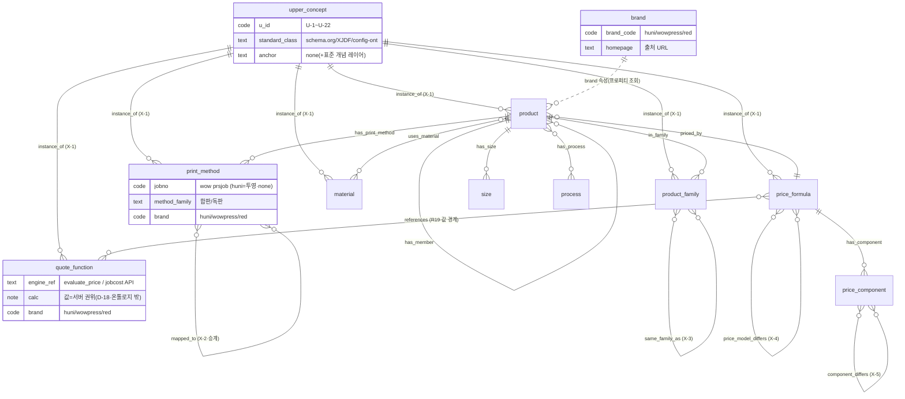

# 상위 온톨로지 스키마 — 브랜드-중립 다중브랜드 확장 (§35 Phase 3 주력 산출)

> 작성: 2026-07-04 · mbo-ontology-architect · 방법론 = `mbo-ontology-design` 스킬.
> 상위 권위: §33 `02_ontology/ontology-schema.md`(v1.0.2·개체17·관계19·출처5·badge4) **읽기 재사용·무손상**.
> 입력: `00_research/upper-ontology-vocabulary.md`(U-1~U-22·X-1~X-5)·`standards-mapping-delta.md`(D-U*)·`01_analysis/`(와우 6+2축)·`02_crossbrand/`(family-alignment 16쌍·difference-matrix D0-A~D·crossbrand-edges).
> **[HARD] search-before-mint**: §33 개체17·관계19 이름표 최대 재사용. 신규는 표준+와우 증거 있을 때만. **§33 골든 무손상**(이 산출은 `03_upper_ontology/`에만).
> **[HARD] 가격 경계 동형(D-18)**: 상위 온톨로지는 가격 축·구성요소 연결·**브랜드별 가격 아키타입**까지. 값 계산·저장 안 함(권위=브랜드별 엔진/API).
> **[HARD] architecture-neutral**: 아래 스키마는 "§33 확장 머지"든 "독립 §35 KB 시드"든 그대로 재사용(마이그레이션 노트 = `architecture-decision-brief.md`).
>
> **읽는 법(비전문가용):** 후니는 상품을 t_* 테이블로, 와우는 6+2축(규격·재질·도수·인쇄방식·후가공·부자재)으로 표현한다. 이름만 다를 뿐 같은 인쇄 개념이다. 이 문서는 그 위에 "브랜드-중립 공통 개념(상위 온톨로지)"을 한 층 두고, 두 브랜드 실물이 각각 그 공통 개념의 사례(instance_of)임을 잇는 설계도다. 이 층이 있으면 "고급 명함을 후니와 와우 중 어디서 뽑을까"를 한 그래프에서 답할 수 있다.

---

## 0. 설계 요약 (한 장)

- **2층 구조**: 상위 개념층(브랜드-중립·표준 이름표) + 브랜드 실물층(후니 t_* 앵커 · 와우 catalog/api/pdf 앵커). 둘을 잇는 엣지 = `instance_of`(X-1).
- **개체 델타** = §33 17종 **전량 승계** + **신규 5 유형**(E18 `print_method`·E19 `quote_function`·E20 `product_family`·E21 `brand`·**E-U `upper_concept`**). 나머지 신규 개념 2종(U-7 ImpositionStrategy·U-2 ConfigurabilityClass)은 **접기**(기존 개체 재사용 + 속성/upper_concept 노드) — search-before-mint.
- **관계 델타** = §33 19종 **전량 승계**(`mapped_to` 포함) + **신규 4**(X-1 `instance_of`·X-3 `same_family_as`·X-4 `price_model_differs`·X-5 `component_differs`). 폐쇄목록 → 23종. 상세·카디널리티 = `crossbrand-relations.md`.
- **브랜드축** = product/formula/component/print_method/family 노드에 **`brand` 속성 필수**(`huni`/`wowpress`/`red`). E21 `brand` 노드는 출처 그룹핑용(프로퍼티로 조회, 신규 엣지 불필요).
- **앵커 델타** = §33 앵커 3유형(`t_*/CODE`·`xlsx:`·`none`)에 와우 3유형(`catalog:`·`wowpress-api:`·`wowpress-pdf:`) 추가. 닫힌세계·지어내기 차단 유지(모든 노드 실 앵커 or GAP). 문법·lint = `brand-anchor-spec.md`.
- **가격 경계**: E19 `quote_function`(U-18·표준 공백 명시)이 값 계산 경계 노드. 후니 `evaluate_price` / 와우 `POST /std/prod/jobcost` 둘 다 서버 권위. 온톨로지는 여기까지 잇고 값은 안 본다(§33 D-18 동형).
- **badge/출처 = §33 그대로**(4종·5필드). GAP·양면 노드 패턴 승계.

---

## 1. 개체(노드) 유형 사전 — §33 승계 + 델타

### 1.1 §33 개체 17종 — 전량 승계 (재기술 안 함)

E1~E17(product·category·size·material·print_option·process·plate_size·bundle_qty·price_formula·price_component·option_group·constraint·term·rule·decision·gap·intent)은 §33 `ontology-schema.md` §1 정의를 **그대로 승계**. 다중브랜드 확장 = 각 노드에 **`brand` 속성 추가**(§1.4)와 **와우 앵커 병행 허용**(§1.3)뿐. 개체 의미·id 접두사·핵심 속성 불변.

> **브랜드-중립 재확인(standards-mapping-delta §0)**: §33이 채택한 표준 이름표(product=schema.org Product·size=XJDF FinishedDimensions·material=MediaIntent·도수=ColorIntent·후가공=Finishing Intent·제본=BindingIntent·판걸이=Imposition·constraint=config-ontology constraint)는 와우 6+2축 증거로 반증 0 재확인. §35는 재발명이 아니라 확장.

### 1.2 신규 개체 유형 5종 (표준+와우 증거 있는 것만)

각 행: 유형 → 정의 → id 접두사 → 앵커 정책 → 핵심 속성 → 표준 이름표. **닫힌세계 유지**(anchor 실재 or GAP).

| # | type | 정의(쉬운 말) | id 접두사 | 앵커 정책 | 핵심 속성 | 표준 이름표 | 유래 |
|---|------|--------------|-----------|-----------|-----------|-------------|------|
| **E-U** | `upper_concept` | 브랜드-중립 표준 개념 1개(2층의 상위 노드) | `UPPER_` | `none`(+사유="표준 개념 레이어") · `standard_url` 필수 | `standard_class`·`schema_org`·`xjdf`·`config_ont`·`u_id`(U-1~U-22) | (자기 자신이 표준 이름표) | 신규(2층 스파인) |
| **E18** | `print_method` | 인쇄방식 1개(합판/독판·옵셋/디지털/UV/INDIGO/윤전) | `printmethod-`(huni) · `wow-prsjob-`(wow) | huni=`none`(+사유="print_option 접힘분·plate/pansu 투영") · wow=`catalog:products/*.json#raw.prod_info.prsjobinfo` / `_cache/wow_domain_prsjob.csv#jobno` | brand·method_family(합판/독판)·jobno/jobpresetno(wow) | XJDF **Process View**(DigitalPrinting/Conventional) 🟡 GAP-STD-2 | **신규**(U-4·D0-A 최대 델타) |
| **E19** | `quote_function` | 동적 가격 계산 경계(값=서버 권위) | `quotefn-` | huni=`none`(+사유="Railway 서버 함수 evaluate_price") · wow=`wowpress-api:6.4#ord/cjson_jobcost` | brand·engine_ref·input_axes·output_field(ordcost_bill/evaluate 결과) | **표준 없음**(명시적 공백·schema.org Offer 정적 한계) | **신규**(U-18·표준 공백) |
| **E20** | `product_family` | 상품군(명함·스티커·사인·책자…) | `family-`(huni) · `wow-family-` | huni=`t_cat_categories/<cat_cd>`(최상위 카테고리) or `none`(+사유="§33 카테고리 트리 최상위 묶음") · wow=`catalog:categories/<catid>.json` | brand·family_label·member_count | schema.org **category 상위** | **신규**(U-20·same_family_as 기준선) |
| **E21** | `brand` | 브랜드 출처(huni/wowpress/red) | `brand-` | `none`(+사유="출처 축·조직") · `homepage` 필수 | brand_code(huni/wowpress/red)·legal_name·catalog_source | schema.org **brand(Organization)** | **신규**(U-22·§35 brand축) |

**신규 5 유형의 정당성(search-before-mint 통과 근거):**
- **E-U `upper_concept`** = 2층 설계의 필수 스파인. §33엔 "표준 이름표 열"만 있고 표준 개념 자체를 노드로 두지 않았다 → 다중브랜드 교차 매핑의 공통 그릇이 노드로 실재해야 `instance_of`로 세 브랜드를 건다. anchor=none은 §33 D-6이 KB 전용 레이어에 허용(gap·intent 선례).
- **E18 `print_method`** = D0-A 최대 델타. 와우 `prsjob`은 1급 가격결정 축(16종·합판디지털106·합판옵셋47·합판UV17·INDIGO8·옵셋5·윤전…)인데 후니엔 대등 노드가 없다(print_option에 접힘). 양 브랜드 대등 표현 위해 신설. 후니측은 anchor=none(투영·사유 명시).
- **E19 `quote_function`** = §33은 evaluate_price를 "경계"로만 두고 노드화 안 했다(단일 브랜드라 불필요). 다중브랜드에선 evaluate_price와 jobcost가 **같은 개념의 두 사례**임을 표현해야 "가격은 브랜드마다 다른 엔진이 계산" 경계가 그래프에 드러난다.
- **E20 `product_family`** = `same_family_as`(X-3) 16쌍의 정렬 기준선. §33 카테고리 트리(E2)만으론 후니↔와우 상품군을 잇는 상위 축이 없다.
- **E21 `brand`** = §33은 전 노드 huni 암묵. 3브랜드 출처 구분 축.

### 1.3 접기 결정 2종 (신규 개체 미신설 — 기존 재사용)

| 개념 | 결정 | 실현 방법 | 사유 |
|---|---|---|---|
| **U-7 `ImpositionStrategy`**(조판/판걸이) | **접기**(E7 재사용 + upper_concept + 속성) | 후니 = E7 `plate_size`(fn_calc_pansu 파생·기존) 그대로. 와우 = product 노드 속성 `pjoin`(합판9/독판0/별도1) + `UPPER_ImpositionStrategy` 노드에 양측 `instance_of`. **신규 브랜드 개체 없음** | §33 E7이 후니측을 이미 표현. 와우 pjoin은 선택 축이나 값이 3분류 이진에 가까워 상품 속성으로 충분(개체화 과잉). 파일럿 실측서 부족하면 승격 재검토(§33 D-22 접기 원칙 동형) |
| **U-2 `ConfigurabilityClass`**(구성형 vs 완제품) | **접기**(속성 + upper_concept) | product 노드 파생 속성 `configurability`(후니 prd_typ_cd .01~.05 / 와우 selType M/S) + `UPPER_ConfigurabilityClass` 노드 instance_of | 이미 §33 product 속성(prd_typ_cd)·와우 selType로 실재. 개체화 불필요 |

> 이 접기 2종도 **`upper_concept` 노드는 신설**(U-7·U-2)해 표준 정렬은 유지하되, 브랜드 실물은 기존 개체/속성으로 표현한다. = 상위층은 22 U-* 전부 노드로 존재, 하위층은 최소 델타.

### 1.4 브랜드축 (모든 브랜드 실물 노드 공통)

- **`brand` 속성 필수**: `product`·`price_formula`·`price_component`·`print_method`·`product_family`·`size`·`material`·`print_option`·`process`·`option_group` 등 브랜드 실물 노드에 `brand ∈ {huni, wowpress, red}` 강제(lint L-BR-1 = `brand-anchor-spec.md`).
- **상위 개념 노드**(E-U)·표준 레이어(term)는 `brand` 없음(브랜드-중립).
- E21 `brand` 노드는 **프로퍼티 조회 대상**(신규 엣지 불필요). "와우 상품 전량"은 `brand=wowpress` 필터로 조회.
- **id 충돌 회피**(G-EDGE-1 해소): 와우 노드는 `wow-` 접두 강제(`wow-product-<prodno>`·`wow-paper-<paperno>`·`wow-size-<sizeno>`·`wow-color-<colorno>`·`wow-prsjob-<jobno>`·`wow-awkjob-<jobno>`·`wow-family-<catid>`·`wow-jobcost`). 후니는 §33 접두(무접두 `product-`·`material-`…) 유지. brand 속성 병기로 이중 안전.

---

## 2. 관계(엣지) 유형 사전 — §33 승계 + 델타

### 2.1 §33 관계 19종 — 전량 승계

R1~R19(in_category·has_size·uses_material·has_print_option·has_process·has_plate_size·has_qty_rule·priced_by·has_component·has_option_group·option_refs·constrains·has_member·has_addon·decided_because·supersedes·derived_from·alias_of·references)는 §33 §2 그대로 승계. **개방 관계명 금지**(D-7) 유지. `mapped_to`는 §33 §9 동사 6종(uses/requires/excludes/priced_by/loaded_via/**mapped_to**)에 이미 1급 → **승계**(신규 아님).

### 2.2 신규 관계 4종 (폐쇄목록 등재)

| # | rel | 방향(source→target) | 의미 | 카디널리티 | 유래 | 상세 |
|---|-----|--------------------|------|-----------|------|------|
| **X-1** | `instance_of` | 브랜드노드 → upper_concept | 브랜드 실물이 상위 표준개념의 한 사례 | N:1 | 신규(2층 핵심) | 세부 = `crossbrand-relations.md` §2 |
| **X-3** | `same_family_as` | product↔product / family↔family | 두 브랜드 상품(군)이 같은 상품군 | N:M(무방향·대칭) | 신규(§35) | 16쌍 = `crossbrand-relations.md` §3 |
| **X-4** | `price_model_differs` | price_formula↔price_formula | 같은 상품군인데 가격 아키타입 상이 | N:M(무방향) | 신규(§35) | 8쌍 = `crossbrand-relations.md` §4 |
| **X-5** | `component_differs` | price_component↔(price_component\|축) | 같은 개념인데 구성요소 표현 상이 | N:M(무방향) | 신규(§35) | 9쌍 = `crossbrand-relations.md` §5 |

- `mapped_to`(X-2) = **승계**(§33 §9). 상위개념 경유 수평 교차(instance_of 배선 후 유도·명시 배선은 대표만).
- **폐쇄목록 총계**: §33 19 + 신규 4 = **23종**. 개방 관계명 사용 = lint FAIL(§33 D-7 승계).

### 2.3 관계 사용 규칙 (§33 승계 + 다중브랜드 보강)

- (§33 승계) `product`는 `priced_by` ≥1 or gap/양면 선언(D-13 I-5). `price_formula`는 `has_component` ≥1(고아 공식 검출). `option_group`의 `option_refs` 타깃은 같은 부모 product 실재(fn_chk_opt_item_ref).
- **(보강 X-1)** 신규 5 유형 중 브랜드 실물(E18 print_method·E20 product_family)은 대응 upper_concept로 `instance_of` ≥1 권장(2층 연결 완결성). 미배선 = 🟡 후보 상태로 표기(FAIL 아님·점진 배선).
- **(보강 X-3~X-5)** 교차관계는 **양쪽 앵커 병기 필수**(앵커 없는 엣지 금지·§33 닫힌세계 승계). same_family_as는 최소 확신도 `partial` 이상만 verified/candidate, 그 이하는 GAP(family-alignment §2·§3 단면 노드 보존).

---

## 3. 브랜드별 가격 아키타입 (D-18 경계 내·값 계산 없음)

가격 **값**은 안 본다. "어떤 축으로 달라지고, 어떤 아키타입으로 계산되는가"까지만 노드화. (difference-matrix D0-B 승계)

| brand | 가격 아키타입 | quote_function 노드 | 표현 |
|---|---|---|---|
| huni | **6종 내장 다형**: 원자합산(PRF_DGP_*)·고정가(PRF_NAMECARD_*)·완제품가룩업(PRF_STK_FIXED)·면적매트릭스(PRF_CLR_ACRYL/POSTER)·면적+부속(PRF_ACRYL_MAGNET)·셋트조합(evaluate_set_price) | `quotefn-huni-evaluate-price`(anchor=none·사유) | E9 formula 노드 `props.archetype` + has_component 배선(투명·D0-C) |
| wowpress | **단일 메커니즘**: 전 326상품 축조합 → `POST /std/prod/jobcost` → `ordcost_bill`. 정적 가격표 0(전량 requires-configuration) | `quotefn-wow-jobcost`(anchor=`wowpress-api:6.4`) | E9 `wow-jobcost-formula` 노드 + 입력 축 참조. 내역 `ordcost_base` 은닉(GAP-PRICE-3·재현 안 함) |

- 두 quote_function 노드 → `UPPER_QuoteFunction`(U-18)로 `instance_of`. = "가격은 브랜드마다 다른 엔진, 값은 서버 권위" 경계가 그래프에 명시.
- **price_model_differs**(X-4)는 이 아키타입 차이를 formula↔formula로 잇는다(값 대조 아님·모델 위치·형태만).

---

## 4. 상위-하위 2층 매핑표 (instance_of 배선 지도)

`upper_concept`(E-U) 22종 ← 후니 노드 / 와우 노드 (instance_of). crossbrand-edges §4 승계·확정.

| upper_concept(U-) | 후니 노드 --instance_of--> | 와우 노드 --instance_of--> | 브랜드 실물 유형 |
|---|---|---|---|
| `UPPER_ProductConcept`(U-1) | `product-*`(E1) | `wow-product-*` | E1 product |
| `UPPER_ConfigurabilityClass`(U-2)·접기 | product.prd_typ_cd(속성) | wow-product.selType(속성) | 속성(개체X) |
| `UPPER_DimensionSpec`(U-3) | `size-*`(E3) | `wow-size-*` | E3 size |
| **`UPPER_PrintMethodIntent`(U-4)** | `printmethod-huni-*`(E18·투영) | `wow-prsjob-*`(16종·E18) | **E18 print_method(신규)** |
| `UPPER_ColorSpec`(U-5) | `printopt-*`(E5) | `wow-color-*` | E5 print_option |
| `UPPER_MediaClass`(U-6) | `material-MAT_*`(E4) | `wow-paper-*` | E4 material |
| `UPPER_ImpositionStrategy`(U-7)·접기 | `plate-*`(E7)+fn_calc_pansu | wow-product.pjoin(속성) | E7 plate_size + 속성 |
| `UPPER_FinishingOp`(U-8) | `process-PROC_*`(E6) | `wow-awkjob-*`(2단) | E6 process |
| `UPPER_BindingType`(U-9) | `process-*`(제본류) | wow-awkjob(제본 그룹) | E6 process |
| `UPPER_FoldScheme`(U-10) | `process-*`(접지)·COMP_FOLD_* | wow-awkjob(접지 그룹) | E6 process |
| `UPPER_QuantityRule`(U-11) | `qty-*`(E8) | wow-product.ordqty·coverinfo | E8 bundle_qty |
| `UPPER_VariantAxis`(U-12) | `optgroup-*`(E11) | wow 6축(옵션 노출분) | E11 option_group |
| `UPPER_AxisValueRef`(U-13) | R11 option_refs | wow req_/rst_ 참조 | (엣지 한정자) |
| `UPPER_AccessoryComponent`(U-14) | `product-*`(has_addon R14) | `wow-prodadd-*`/optioninfo(2채널) | E1(has_addon) |
| `UPPER_CrossAxisConstraint`(U-15) | `constraint-*`(E12·CN-1~6) | wow req_/rst_(option-item) | E12 constraint |
| `UPPER_PriceModel`(U-16) | `formula-PRF_*`(E9·6아키타입) | `wow-jobcost-formula`(E9) | E9 price_formula |
| `UPPER_PriceComponent`(U-17) | `component-COMP_*`(E10·투명) | wow 입력 축(ordcost_base 은닉) | E10 price_component |
| **`UPPER_QuoteFunction`(U-18)** | `quotefn-huni-evaluate-price`(E19) | `quotefn-wow-jobcost`(E19) | **E19 quote_function(신규)** |
| `UPPER_CategoryNode`(U-19) | `category-*`(E2) | `wow-cat-*` | E2 category |
| **`UPPER_ProductFamily`(U-20)** | `family-*`(E20) | `wow-family-*`(E20) | **E20 product_family(신규)** |
| `UPPER_IntentPurpose`(U-21) | `INTENT_*`(E-intent) | (경쟁분석 용도 코퍼스) | intent |
| **`UPPER_BrandNode`(U-22)** | `brand-huni`(E21) | `brand-wowpress`(E21) | **E21 brand(신규)** |

> **레드 확장 안전**: 레드 추가 시 `wow-*` 대응 `red-*` 노드에 `instance_of`만 붙이면 상위 개념 경유 mapped_to가 자동 확장(upper-vocab §2 설계근거). 어휘·스키마 불변.

---

## 5. 파일럿 예시 노드 (스키마 자기점검 — 2~3개)

> 스키마가 실물에 먹히는지 검증. 앵커는 §33 live-snapshot(후니)·`_cache/*.csv`+catalog(와우) 실측. 수치는 스크립트 전사 대상(구조 예시).

### 5.1 예시 A — 상위 개념 노드 `UPPER_PrintMethodIntent` (E-U, 브랜드-중립)
```yaml
id: UPPER_PrintMethodIntent
type: upper_concept
anchor: none        # 사유: 표준 개념 레이어(XJDF Process View)
badge: candidate    # 🟡 GAP-STD-2(XJDF 정확 자원 위치 미확정)
u_id: U-4
standard_class: "XJDF Process View (DigitalPrinting / ConventionalPrinting)"
standard_url: "https://www.cip4.org/files/cip4/documents/XJDF%20Specification%202.2.pdf"
props: {schema_org: "(없음)", xjdf: "Process View", config_ont: "attribute"}
sources:
  - {source_file: "00_research/standards-playbook.md", source_locator: "§1.1.3 Process View", captured_at: "2026-07-04", badge: candidate, src_id: SR35-STD}
  - {source_file: "00_research/upper-ontology-vocabulary.md", source_locator: "U-4", captured_at: "2026-07-04", badge: verified, src_id: SR35-VOCAB}
updated: 2026-07-04
```

### 5.2 예시 B — 와우 인쇄방식 노드 `wow-prsjob-합판디지털` (E18, brand=wowpress)
```yaml
id: wow-prsjob-happan-digital
type: print_method
anchor: catalog:products/40070.json#raw.prod_info.prsjobinfo   # + _cache 재현
badge: verified
brand: wowpress
props: {method_family: "합판", jobno: "(전사)", jobpresetno: "(전사)"}
relations:
  - {rel: instance_of, target: UPPER_PrintMethodIntent}   # X-1 (2층 연결)
sources:
  - {source_file: "_cache/wow_domain_prsjob.csv", source_locator: "jobno:합판디지털행(106상품 최다)", captured_at: "2025-10-14 catalog", badge: verified, src_id: SR35-WOWPRSJOB}
updated: 2026-07-04
```
본문: 와우 합판디지털 = prsjob 16종 중 최다(106상품). 후니엔 대등 노드 없음(print_option 접힘) → 후니측 `printmethod-huni-digital`(anchor=none·투영)도 같은 `UPPER_PrintMethodIntent`에 instance_of. 이 두 노드가 걸리면 mapped_to(X-2) 유도.

### 5.3 예시 C — 교차 가격모델 엣지 `PMD-1` (X-4, 명함)
```yaml
# formula 노드 wow-jobcost-formula-40070 의 relations 내 (또는 crossbrand-edges 파일)
- rel: price_model_differs
  source: formula-PRF_NAMECARD_FIXED    # brand=huni · anchor=t_prc_price_formulas/PRF_NAMECARD_FIXED
  target: wow-jobcost-formula-40070     # brand=wowpress · anchor=catalog:products/40070.json#pricing.status
  qualifier:
    diff_type: "내장 고정가룩업([siz,qty]+박 셋업비 분리) vs 조회 API(prsjob+paper+awkjob)"
    both_authority: server              # 값 권위 둘 다 서버(D-18·경계 동형)
    inherits: [D0-A, D0-B]              # PrintMethodIntent 처리위치 + 아키타입 다형 vs 단일
  badge: verified
  sources:
    - {source_file: "02_crossbrand/difference-matrix.md", source_locator: "A-1 명함", captured_at: "2026-07-04", badge: verified, src_id: SR35-DIFF}
    - {source_file: "02_crossbrand/crossbrand-edges.md", source_locator: "PMD-1", captured_at: "2026-07-04", badge: verified, src_id: SR35-EDGE}
```

### 5.4 자기점검 결과

| 점검 | 결과 |
|------|------|
| 후니 12 라이브 유형이 상위 U-1~U-22에 빠짐없이 걸리나 | ✅ §4 매핑표 후니 열 전부 채워짐 |
| 와우 6+2축이 상위에 걸리나 | ✅ size→U-3·paper→U-6·color→U-5·prsjob→**U-4(E18)**·awkjob→U-8/9/10·prodadd→U-14·수량→U-11·pjoin→U-7(접기) |
| 인쇄방식(D0-A 최대 델타)이 양 브랜드 대등하게 표현되나 | ✅ E18 print_method + UPPER_PrintMethodIntent로 후니 투영·와우 1급 축 대등 |
| 양 브랜드 동적 가격이 상위로 통일되나 | ✅ E19 quote_function 2노드 → U-18. 값=서버 권위(D-18 동형·계산 안 함) |
| 지어내기 차단(닫힌세계) 유지되나 | ✅ 모든 브랜드 노드 실 앵커(후니 t_* / 와우 catalog·api) or GAP. upper_concept·brand만 none(+사유) |
| §33 골든 무손상인가 | ✅ §33 파일 읽기만. 델타 전량 03_upper_ontology/에만. brand 속성·와우 앵커는 §33 노드 추가 확장(파괴 없음) |
| 레드(3번째) 추가 시 버티나 | 🟡 후니+와우 2브랜드 검증. instance_of 구조라 red-* 노드 append만으로 확장(GAP-STD-3) |
| **발견된 한계** | ① U-4 XJDF 정확 자원 위치 🟡(GAP-STD-2) ② 와우 ordcost_base 은닉→component_differs는 입력 축 대응까지(GAP-PRICE-3) ③ same_family_as는 family 단위(상품 단위는 후속·G-EDGE-2) |

---

## 6. mermaid ERD (2층 구조·§33 승계 + 델타)



> 개념 구조도(RDF 아님·§33 D-2 승계). `has_print_method`·`in_family`는 §33 R4 `has_print_option`·R1 `in_category`의 다중브랜드 확장 별칭이 아니라 **기존 관계 재사용**(product→print_method는 R4 확장 target·product→family는 R1 확장 target). 신규 관계는 X-1/X-3/X-4/X-5 4종뿐.

---

## 7. 표준 이름표 배치 (§33 D-19 승계)

신규 5 유형·22 upper_concept의 schema.org/XJDF/config-ontology 대응 = §1.2 표·§4 매핑표에 인라인. 표준 URL 전량 = `00_research/standards-playbook.md` §1 Sources 승계(CIP4 XJDF 2.2·schema.org·config-ontology). U-18 QuoteFunction은 **표준 공백**(schema.org Offer 정적 한계·명시적 없음).

---

## 8. GAP (정직 기록)

- **G-SCHEMA-1**: U-4 `PrintMethodIntent`의 XJDF 정확 자원 위치 미확정(GAP-STD-2 승계) → E-U 노드 badge=🟡. 확정 = XJDF Spec PDF Process View 자원 직독(후속).
- **G-SCHEMA-2**: 와우 `ordcost_base`(가격 내역 map) 은닉(GAP-PRICE-3) → E10 price_component ↔ 와우 대조는 **입력 축까지**(component_differs 경계). 값 권위 경계상 의도적.
- **G-SCHEMA-3**: same_family_as는 **family 단위**만 배선(SFA-1~16). 상품 단위 same_family_as는 후속 델타(G-EDGE-2 승계).
- **G-SCHEMA-4**: 레드 미포함 → 신규 5 유형·교차 4관계 전부 후니+와우 2브랜드. 레드 추가 시 `red-*` 노드 append(instance_of 구조·확장 안전·GAP-DELTA-2 승계).
- **G-SCHEMA-5**: E18/E19/E20 신규 개체의 §33 관계 폐쇄목록 정식 등재(instance_of·same_family_as 등)는 **아키텍처 게이트(MB7)+인간 승인** 후 확정(§33 확장이면 §33 스키마 v1.1 머지·독립이면 §35 시드). 이 문서는 스키마 설계까지·DB 미적재.

## Sources
- §33 `02_ontology/ontology-schema.md`(v1.0.2·개체17·관계19·출처5·badge4·D-6 앵커·D-7 폐쇄목록·D-18 가격경계·D-22 접기) — 승계 기준선(읽기·무손상)
- §35 `00_research/upper-ontology-vocabulary.md`(U-1~U-22·X-1~X-5·§2 설계근거·§4 결정항목)·`standards-mapping-delta.md`(D-U2/4/7/14/15/18/20/22·신규 관계 4)·`standards-playbook.md`(§1 표준 URL·§1.4 QuoteFunction 표준 공백)
- §35 `01_analysis/wowpress-structure.md`(6+2축·selType·pjoin·앵커 규약 §7)·`wowpress-price-mechanism.md`(jobcost·ordcost_base 은닉)·`wowpress-catalog-map.md`(family)
- §35 `02_crossbrand/family-alignment.md`(A-1~16·HO-*·WO-*)·`difference-matrix.md`(D0-A~D·A-* 3축)·`crossbrand-edges.md`(SFA/PMD/CMD/instance_of/mapped_to 폐쇄목록 후보)
