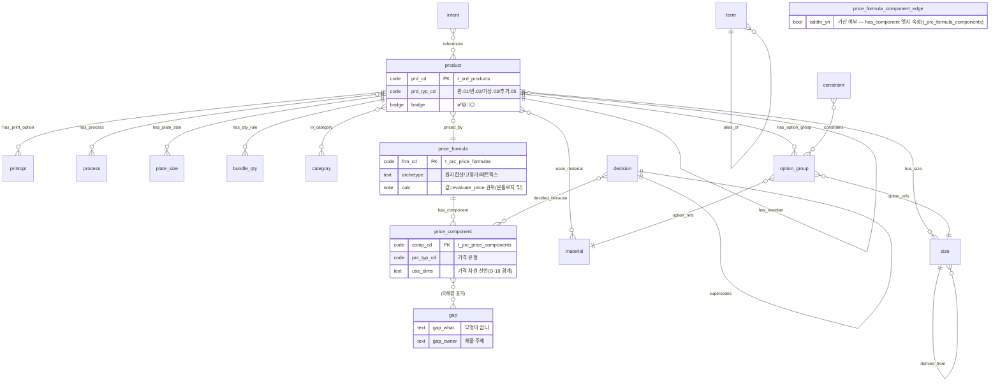

# 온톨로지 스키마 사전 — Huni-Ontology-KB (v1.0)

> 작성: 2026-07-03 · okb-ontology-architect (Phase 2 스키마 설계 — 첫 확정본)
> 상위 권위: `../00_research/methodology-playbook.md`(7대 원칙·D-1~D-22). 이 문서는 그 결정을 세부(개체·관계 사전·필드 문법)로 구체화한다.
> 메타 원칙 승계: `.claude/skills/okb-ontology-authoring/SKILL.md`(노드=정본·출처 강제·양면/GAP·search-before-mint) · `_workspace/print-kb/wiki/README.md` §3(관계 동사 6종·안정 @id·badge 4종).
> 자매 문서: `file-format-spec.md`(파일 문법·lint) · `graph-build-spec.md`(빌드 명세) · `nl-query-paths.md`(질의 경로 증명).
>
> **이 문서를 읽는 법(비전문가용):** 이 문서는 "후니 인쇄상품 지식을 컴퓨터가 이해하게 정리하는 개념 사전"이다. 개체(무엇을 점으로 그릴지)와 관계(어떻게 선으로 이을지)를 정하고, 각 점·선에 "이 사실이 어디서 왔는가(출처)"와 "얼마나 믿을 수 있는가(badge)"를 반드시 붙이게 강제한다. 스키마가 틀리면 그 위에 쌓는 모든 지식이 오염되므로, 이 문서가 이번 작업 전체의 토대다.

---

## 0. 설계 요약 (한 장)

- **개체 유형 17종** = 라이브 앵커 12종(t_* 테이블·코드 1:1 대응) + KB 전용 레이어 3종(용어·규칙·결정) + 특수 KB 전용 2종(`gap`·`intent` — 앵커 none). 방법론 D-5·D-6 준수: DB에 실재하는 코드에서 시작하고, DB에 없는 개념만 접두사 ID로 분리 선언한다. `gap`·`intent`는 §1.2 표에 type 값으로 실재하므로 lint 화이트리스트(L-4·I-3)에 반드시 포함한다.
- **관계 유형 19종** = FK유래 12종 + 문서유래 4종 + 파생 1종(`derived_from`, D-7) + 별칭 1종(`alias_of`, D-10) + 약참조 1종(`references`, R19 — 본문 `[[ ]]` 자동추출·any→any). §9 관계 동사 6종(uses/requires/excludes/priced_by/loaded_via/mapped_to)을 1급으로 승계. 개방 관계명 금지.
- **출처 5필드**(D-8): `source_file / source_locator / captured_at / badge / src_id`. 출처 없는 사실 = lint FAIL.
- **badge 4종**(§9 승계): ✅검증 · 🟡후보 · 🔴결함(현재값≠정답) · ⚪미상.
- **특수 노드 3패턴**: GAP 노드(원천 부재), 양면 노드(라이브 현재값 vs 권위 정답), alias 투영(용어집).
- **가격 경계**(D-18): 온톨로지는 "가격이 어떤 축으로 달라지는가(use_dims 차원 선언)"와 "상품→공식→구성요소→단가행 연결"까지만 모델링한다. **가격 값 계산은 `evaluate_price`가 단일 권위** — KB는 계산하지 않는다.
- **표준 이름표**(D-1·D-19): 각 개체·관계에 schema.org·XJDF·구성 온톨로지 대응어를 붙인다(어휘만 차용, 기술 스택 미도입). 매핑 전량은 횡단 페이지 `standards-mapping.md`로 승격.

---

## 1. 개체(노드) 유형 사전

### 1.0 공통 규약

- 모든 노드는 **id·type·anchor·badge·sources 5필드 필수**(file-format-spec §2). 
- **anchor(앵커)** = 이 개념이 실제로 존재한다는 증거 좌표. 3유형만 허용(D-6):
  1. `t_<table>/<CODE>` — 라이브 코드 실재 (예 `t_prd_products/PRD_000016`)
  2. `xlsx:<파일>#<시트>!<셀범위>` — 권위 엑셀 260702 셀 좌표
  3. `none` — KB 전용 레이어(용어·규칙·결정)이거나 GAP. `none`이면 사유 필수.
- 앵커 실재는 결정론 스크립트가 검사한다(빌드 lint I-2). 앵커 없는 개념 노드는 GAP으로만 존재 가능 — **환각 개체 완전 차단**(방법론 원칙 2).
- **junction·복합키 앵커 규약(V1-03 교정·016/041 통일):** `t_prd_product_option_groups`·`t_prd_product_option_items` 등 junction 테이블(1열=부모 `prd_cd`) 앵커는 `t_<table>/<부모 prd_cd>` 형식으로 쓴다. L-17 닫힌세계 검사는 **부모 prd_cd 실재까지** 검증하고, 복합키(`opt_grp_cd`·`opt_item_cd` 등 나머지 키)는 검사 범위 밖이므로 **각 노드 `sources`의 locator에 전체 복합키를 전사**해 확증한다(예 `키:(PRD_000041,OPT_000052)`). 즉 junction 노드는 `anchor=none`이 아니라 **부모측 앵커 + sources 복합키 확증**으로 통일한다(anchor=none은 KB 전용 레이어·GAP에만).

### 1.1 라이브 앵커 개체 (12종 — t_* 1:1 대응)

각 행: 유형 → 정의 → id 접두사 → 라이브 앵커 테이블 → 핵심 속성 → 표준 이름표(schema.org / XJDF / 구성 온톨로지).

| # | type | 정의(쉬운 말) | id 접두사 | t_* 앵커 | 핵심 속성 | 표준 이름표 |
|---|------|--------------|-----------|----------|-----------|-------------|
| E1 | `product` | 팔거나 만드는 상품 1개 | `product-` | `t_prd_products`/prd_cd | prd_typ_cd(.01완제품/.02반제품/.03기성/.05추가)·min_qty/max_qty/qty_incr·file_upload_yn·editor_yn | Product / — / component type |
| E2 | `category` | 상품 분류(3단 트리) | `category-` | `t_cat_categories`/cat_cd | 부모 cat_cd·깊이 | schema.org category / — / — |
| E3 | `size` | 사이즈(재단·작업 치수 1행) | `size-` | `t_prd_product_sizes`(+`t_siz_sizes`) | width×height·작업 vs 재단 (판걸이수는 사이즈 컬럼 아님 — 파생 `derived_from`·엔진 `fn_calc_pansu` 계산) | variesBy(size) / **LayoutIntent FinishedDimensions** / attribute value |
| E4 | `material` | 자재(용지·소재) | `material-` | `t_prd_product_materials`(+`t_mat_materials`) | mat_typ·usage_cd·연/장 단위 | variesBy(material) / **MediaIntent** / resource |
| E5 | `print_option` | 인쇄옵션=**도수·인쇄방식** | `printopt-` | `t_prd_product_print_options`(+`t_prt_print_options`) | print_side(단/양면)·front/back_colrcnt_cd·print_opt_cd | — / **ColorIntent** / attribute |
| E6 | `process` | 후가공·인쇄 공정 1개 | `process-` | `t_prd_product_processes`(+`t_proc_processes`) | mand_proc_yn·base여부·inputs(줄수 등) | — / **Process View / BindingIntent·FoldingIntent** / function→process |
| E7 | `plate_size` | 판형=출력용지규격(종이류만) | `plate-` | `t_prd_product_plate_sizes` | 출력용지 규격·fn_best_plate 자동선택 | — / press sheet / resource 선택규칙 |
| E8 | `bundle_qty` | 수량규칙(묶음·min/max/incr) | `qty-` | `t_prd_product_bundle_qtys`(+사이즈 수량규칙) | bdl_unit_typ·min/max/incr | eligibleQuantity / — / attribute |
| E9 | `price_formula` | 가격공식(상품에 바인딩) | `formula-` | `t_prc_price_formulas`(+`t_prd_product_price_formulas`) | frm_cd·use_yn·아키타입(원자합산/고정가/매트릭스) | — / — / (계산은 evaluate_price 권위) |
| E10 | `price_component` | 가격구성요소(공식의 부품) | `component-` | `t_prc_price_components`(+`t_prc_formula_components` 배선) | comp_cd·prc_typ_cd·use_dims (가산 여부 `addtn_yn`은 이 노드 속성 아님 — 공식↔구성요소 배선 `t_prc_formula_components` 컬럼이므로 R9 `has_component` 엣지 한정자로 표기) | CompoundPriceSpecification(개념) / — / — |
| E11 | `option_group` | CPQ 옵션 그룹(손님 선택 축) | `optgroup-` | `t_prd_product_option_groups`(+options/option_items) | sel_typ·min/max_sel·mand_yn (다형참조 `ref_dim_cd`+`ref_key1`/`ref_key2`는 이 노드 속성 아님 — `t_prd_product_option_items` 컬럼이므로 R11 `option_refs` 엣지 한정자로 표기) | variesBy / — / attribute 정의 |
| E12 | `constraint` | 제약규칙(안 되는 조합) | `constraint-` | `t_prd_product_constraints` | logic(폼빌더 shape)·CN-1~CN-6 유형 | — / — / **constraint** |

**단가행 접기(D-22):** `t_prc_component_prices`(라이브 22,995행)는 **노드로 펼치지 않는다.** 각 `price_component` 노드의 속성(use_dims 차원·행수 요약)으로 접는다. 사슬 추적 질의에서 부족이 실측되면 파일럿에서 재검토. 단가행 실값은 CSV 캐시·live-snapshot이 권위(스크립트 전사, LLM 손전사 금지).

**추가상품/템플릿:** 1차 스키마에서 `t_prd_product_addons`·`t_prd_templates`는 개별 노드 유형을 신설하지 않고 **`product` 노드 간 관계**(`E1 --has_addon--> E1`)와 `option_group`으로 표현한다(search-before-mint: 기존 유형으로 표현 가능하므로 유형 미신설). 파일럿에서 표현 부족이 실측되면 승격.

### 1.2 KB 전용 레이어 개체 (5종 — DB 앵커 불가, D-5)

라이브 t_*에 대응 테이블이 없는 개념. 접두사 ID로 분리 선언하고 anchor는 문서/엑셀 좌표 또는 `none(+사유)`. 여기 5종 = 일반 KB 전용 3종(`term`·`rule`·`decision`) + 특수 앵커-none 2종(`gap`·`intent`). **`gap`·`intent`도 실제 type 값이므로** §0의 총 17종에 포함되고 lint 화이트리스트(L-4·I-3)에 명시된다.

| # | type | 정의 | id 접두사 | 앵커 | 핵심 속성 | 표준 이름표 |
|---|------|------|-----------|------|-----------|-------------|
| E13 | `term` | 용어(표준어·동의어·오표기 정리) | `TERM_` | 용어집 파일(단일 원천, D-10) | prefLabel/altLabel/hiddenLabel/definition/schema_org_term/xjdf_term/process_mapping/status | SKOS Concept / — / controlled vocabulary |
| E14 | `rule` | 도메인 규칙·암묵지·안티패턴 | `RULE_` | SOT 문서 절 / MEMORY 토픽 | 규칙 문장·근거·적용 범위 | — / — / — |
| E15 | `decision` | 확정 결정·핸드오프 결론 | `DEC_` | 통화록·HANDOFF·CHANGELOG 행 | 결정 내용·일자·근거·supersedes | — / — / — |
| — | `gap` | 원천이 없어 못 닫는 공백(패턴) | `GAP_` | none(+무엇이 없는지) | 무엇이 없나·어디서 채우나·소유자 | — / — / — |
| — | `intent` | **용도·의도**(KB 전용 추천 축) | `INTENT_` | none(+용어집/경쟁사 근거) | 고객 표현(카페 오픈·청첩장 등)·연결 상품군 | — / **Product Intent(개념)** / function |

> **KB 전용 레이어 분리 선언(설계 원칙 2 준수):** `intent`(용도·의도)는 라이브 DB에 대응 테이블이 없다 — 고객이 "카페 오픈 기념 쿠폰"이라고 말할 때 이를 상품군으로 잇는 축은 후니 t_*에 없고, 용어집·경쟁사 코퍼스에서 유도한다. 그래서 **명시적으로 "KB 전용 레이어"로 선언**하고 앵커=none(+사유). 이 축이 없으면 "용도 추천" 질의(nl-query-paths 유형 2)를 답할 수 없다. `gap`도 앵커 없는 유일 정당 노드다.

### 1.3 특수 노드 패턴 3종

#### (a) GAP 노드 — 원천 부재 (방법론 원칙 2·SKILL §2)
지어내지 않고 "무엇을 모르는지"를 1급 지식으로 등재. 예: 판수 충돌(§4.3 예시 노드).
```yaml
type: gap
anchor: none  # 사유: 마스터 판수 15 vs 판걸이수 시트 18 — 두 tier A 원천 충돌
badge: unknown  # ⚪
gap_what: "디지털 73×98 판걸이수(UP수) 값 — 마스터=15, 판걸이수시트=18"
gap_fill_from: "실무진(신우진) 확인 — 견적 분모 직결"
gap_owner: staff
```

#### (b) 양면 노드 — 현재값 vs 정답 (D-16·SKILL §2·README R-8)
라이브 현재값 ≠ 권위 정답이면 **두 필드로 분리** 표기(산문 금지, 기계 검사 가능). badge=🔴.
```yaml
badge: defect  # 🔴
current_value: "MAT_000186 mat_typ=.08 (live-snapshot 20260702_1119)"
authority_value: ".06 가죽 (docs/huni/..._상품마스터_260702.xlsx#포토북!자재열)"
```
> 어느 한쪽 삭제 금지. 결정론 diff가 두 필드를 비교해 판정한다.

#### (c) alias 투영 — 용어집 (D-10)
`term` 노드의 altLabel/hiddenLabel은 그래프 빌드 시 **`alias_of` 엣지**로 투영된다(별도 노드 아님). 예: "귀돌이"·"라운딩" → `TERM_corner_round`. 동의어 정렬로 자연어 질의의 표현 다양성을 흡수.

---

## 2. 관계(엣지) 유형 사전

### 2.0 공통 규약
- 관계 어휘는 **폐쇄 목록**(D-7). 문서에 없는 관계명 사용 = lint FAIL. 신설은 이 문서에 등재 후에만.
- 각 엣지는 **방향(source→target)·의미·카디널리티·유래 태그(fk|doc|derived)** 를 가진다.
- 유래 태그: `fk`=라이브 FK에서 결정론 유도 · `doc`=집필 층이 문서에서 기록 · `derived`=파생 속성.

### 2.1 FK유래 관계 (12종 — 라이브 FK에서 결정론 유도, D-4·D-7)

| # | rel | 방향(source→target) | 의미 | 카디널리티 | §9 동사 | 예시 |
|---|-----|--------------------|------|-----------|---------|------|
| R1 | `in_category` | product→category | 상품이 이 분류에 속함 | N:M | (uses 계열) | product-016 → category-CAT_000307 |
| R2 | `has_size` | product→size | 이 사이즈로 주문 가능 | 1:N | uses | product-016 → size-016-73x98 |
| R3 | `uses_material` | product→material | 이 자재를 씀 | N:M | **uses** | product-016 → material-MAT_000074 |
| R4 | `has_print_option` | product→print_option | 이 도수/인쇄방식 선택 가능 | 1:N | uses | product-016 → printopt-016-단면 |
| R5 | `has_process` | product→process | 이 공정을 거침(mand/opt) | N:M | uses/requires | product-016 → process-PROC_000004 (mand) |
| R6 | `has_plate_size` | product→plate_size | 판형 후보(자동선택) | 1:N | uses | product-016 → plate-OUTPUT_PAPER.01 |
| R7 | `has_qty_rule` | product→bundle_qty | 수량규칙 적용 | 1:N | requires | product-016 → qty-016 |
| R8 | `priced_by` | product→price_formula | 이 공식으로 가격 결정 | N:1 | **priced_by** | product-016 → formula-PRF_DGP_A |
| R9 | `has_component` | price_formula→price_component | 공식이 이 구성요소로 배선됨(formula_components) | 1:N | uses | formula-PRF_DGP_A → component-COMP_PAPER |
| R10 | `has_option_group` | product→option_group | CPQ 손님 선택 축 | 1:N | uses | product-016 → optgroup-… |
| R11 | `option_refs` | option_group→(size\|material\|process\|print_option) | 옵션 값이 실물 차원을 가리킴. **다형참조는 option_group이 아니라 option_item 단위**(`t_prd_product_option_items`의 `ref_dim_cd`+`ref_key1`/`ref_key2`)이므로, 어느 item이 무엇을 가리키는지 엣지 한정자 `ref_key1`/`ref_key2`로 특정한다(예: `{rel: option_refs, target: material-…, ref_key1: MAT_000074}`). 한 그룹의 N item이 서로 다른 차원을 가리키면 각 item마다 엣지 1개. **option_item 노드 승격은 파일럿 실측 후 재검토**(현재는 최소안=한정자로 접기) | N:M | requires | optgroup → material-… (ref_key1=MAT_000074) |
| R12 | `constrains` | constraint→(option_group\|product) | 이 조합을 막음/강제 | N:M | **excludes** | constraint-047 → optgroup-coating |

### 2.2 문서유래 관계 (5종 — 집필 층이 기록/자동추출, doc 태그)

| # | rel | 방향 | 의미 | 카디널리티 | 예시 |
|---|-----|------|------|-----------|------|
| R13 | `has_member` | product(셋트 부모)→product(구성원) | 셋트 완제품이 반제품으로 구성(t_prd_product_sets — FK지만 셋트 의미는 문서 확인 병행) | 1:N | product-088 → product-089 |
| R14 | `has_addon` | product→product | 추가상품으로 딸림. **실 배선=product→template(`tmpl_cd`)→`t_prd_templates`.base_prd_cd 경유**(§1.1 template 노드 미신설로 문서 접기). 파일럿에서 addon 가격/선택 상세 추적 필요 시 template 노드 승격 재검토 | N:M | product-016 → product-봉투 |
| R15 | `decided_because` | decision→(any) | 이 결정이 이 노드 상태의 근거 | N:M | DEC_baseproc260701 → component-COMP_PRINT_DIGITAL_S1 |
| R16 | `supersedes` | decision→decision | 새 결정이 옛 결정을 대체 | 1:1 | DEC_… → DEC_… (STALE 표시) |
| R19 | `references` | (any)→(any) | 약한 참조(타입 없음) — 본문 `[[ ]]` 교차참조에서 **빌더가 자동추출**. frontmatter `relations`가 1급이고 이건 서술 보조용. **any→any이므로 I-3 source/target 타입 검사에서 예외**(폐쇄 목록에는 등재되어 L-14는 통과). intent→상품군 연결(nl-query-paths 유형 2)의 기록 수단 | N:M | INTENT_cafe_opening → product-016 |

### 2.3 파생·별칭 관계 (2종)

| # | rel | 방향 | 의미 | 유래 | 예시 |
|---|-----|------|------|------|------|
| R17 | `derived_from` | (속성)→(속성) | 이 값이 다른 값에서 계산됨(파생 속성, D-7) | derived | 책등두께 → 내지 사양·판수 → 사이즈 |
| R18 | `alias_of` | term(altLabel/hiddenLabel)→term(prefLabel) | 표기 변형이 표준어를 가리킴 | derived(용어집 투영) | "귀돌이" → TERM_corner_round |

> **`derived_from`을 1급 등재한 이유(D-7):** "책등 두께 = 내지 페이지수·평량의 함수", "판걸이수 = 사이즈의 함수" 같은 계산 의존성은 인쇄 도메인의 핵심이다. 이를 관계로 명시하면 "이 값을 바꾸면 무엇이 함께 바뀌나"를 그래프로 추적할 수 있다. 계산식 자체는 온톨로지 밖(엔진·`fn_calc_pansu`)이고, 온톨로지는 "의존한다"는 사실만 기록한다.

### 2.4 관계 사용 규칙(요약)
- `product`는 반드시 `priced_by` 엣지 ≥1 **또는** `gap`/양면 선언을 가져야 한다(끊긴 가격 사슬 검출, D-13 lint I-5).
- `price_formula`는 `has_component` 엣지 ≥1을 가져야 한다(고아 공식 = 견적 0 신호, §27 배선 계보).
- `option_group`의 `option_refs` 타깃은 **같은 부모 product에 실재**해야 한다(`fn_chk_opt_item_ref` 트리거 정합 — pack §3.9).

---

## 3. 출처·신뢰도 모델

### 3.1 출처 5필드 (D-8·SKILL §1)
모든 노드·모든 사실 블록에 강제. 출처 없는 사실 = lint FAIL(O1).

| 필드 | 의미 | 형식 예 |
|------|------|---------|
| `source_file` | 어느 파일 | `docs/huni/후니프린팅_상품마스터_260702.xlsx` · `live-snapshot/latest/t_prd_products.csv` |
| `source_locator` | 그 안 어디 | `시트:디지털인쇄!B3` · `테이블:t_prd_products 키:PRD_000016` · `문서:§3.6` |
| `captured_at` | 언제 확인 | `2026-07-03` · `live 20260702_1119` |
| `badge` | 신뢰도 | verified/candidate/defect/unknown |
| `src_id` | freshness 레지스트리 원천 ID | `SR-2.2-diff` · `SR-5-livesnap` · `SR-1-kb01` (staleness 전파가 grep으로 되게 — C-6) |

> **권위 순서(충돌 판정, SKILL §2):** 260702 엑셀 > evaluate_price 코드 > SOT 문서 > 라이브 현재값 > 하네스 산출 > 역공학/외부. 충돌 시 이기는 값을 badge로, **충돌 자체도 기록**(양면 노드 또는 gap).

### 3.2 badge 4종 (§9 승계)

| badge | 아이콘 | 의미 | 질의 취급 |
|-------|-------|------|-----------|
| `verified` | ✅ | 권위 원천 검증·결정론 diff 통과 | 사실로 사용 |
| `candidate` | 🟡 | 권장안·단일출처·미확정 | "후보"로만 제시, 사실 단정 금지 |
| `defect` | 🔴 | 현재값≠정답(양면 노드) | 교정 대기로 제시 |
| `unknown` | ⚪ | 원천 부재(GAP) | 정직하게 "모름" 제시 |

### 3.3 오염 블록리스트 연동 (D-16)
`05_verification/blocklist.md`(4종: STALE/v03 · 260702-diff 셀 · 라이브 오적재 · 환각 개체)에 실린 원천을 `sources`에 인용하면 lint FAIL(O2). blocklist는 `src_id`로 매칭한다.

---

## 4. 파일럿 예시 노드 (디지털인쇄 — 스키마 자기점검)

> 실물로 스키마가 먹히는지 검증. 아래 3개(정상 상품·배선교정 상품·GAP)는 live-snapshot 20260702_1119와 260702 캐시 실측에 앵커. 수치는 스크립트 전사 대상(여기선 구조 예시).

### 4.1 예시 A — `product-016-premium-postcard` (정상 완제품, ✅)
```yaml
id: product-016-premium-postcard
type: product
anchor: t_prd_products/PRD_000016
badge: verified
sources:
  - {source_file: "live-snapshot/latest/t_prd_products.csv", source_locator: "키:PRD_000016", captured_at: "live 20260702_1119", badge: verified, src_id: SR-5-livesnap}
  - {source_file: "docs/huni/후니프린팅_상품마스터_260702.xlsx", source_locator: "시트:디지털인쇄!프리미엄엽서행", captured_at: "2026-07-03", badge: verified, src_id: SR-2.2-diff}
relations:
  - {rel: in_category, target: category-CAT_000307}
  - {rel: has_size, target: size-016-73x98}      # +6행(스크립트 전사)
  - {rel: uses_material, target: material-MAT_000074}   # 몽블랑 등 USAGE.07 공통
  - {rel: has_print_option, target: printopt-016-single}  # POPT_000001 단면 / POPT_000002 양면
  - {rel: has_process, target: process-PROC_000004}   # 디지털인쇄 base, mand_proc_yn=Y
  - {rel: has_qty_rule, target: qty-016}           # min 15 (판형별 상이)
  - {rel: priced_by, target: formula-PRF_DGP_A}
  - {rel: has_addon, target: product-envelope}     # 엽서봉투 5행 TMPL
props:
  prd_typ_cd: PRD_TYPE.01   # 완제품 단일
  min_qty: 15
standards: {schema_org: Product, xjdf: "Product(엽서)", config_ont: "component type"}
updated: 2026-07-03
```
본문: 프리미엄엽서는 디지털인쇄 완제품. 사이즈 7종·칼라 단/양면·모서리/오시/미싱/가변 후가공. 봉투를 추가상품으로 딸 수 있다. 가격은 `PRF_DGP_A`(원자합산형)로 계산.

### 4.2 예시 B — `formula-PRF_DGP_A` (가격공식 + 배선, ✅)
```yaml
id: formula-PRF_DGP_A
type: price_formula
anchor: t_prc_price_formulas/PRF_DGP_A
badge: verified
sources:
  - {source_file: "live-snapshot/latest/t_prc_formula_components.csv", source_locator: "frm_cd:PRF_DGP_A", captured_at: "live 20260702_1119", badge: verified, src_id: SR-5-livesnap}
relations:   # addtn(가산 여부)은 이 has_component 엣지 한정자 — price_component 노드 속성 아님(F-4)
  - {rel: has_component, target: component-COMP_PRINT_SPOT_WHITE_S1, qualifier: {disp_seq: 1, addtn: Y}}  # 별색화이트(disp_seq=1)
  - {rel: has_component, target: component-COMP_PRINT_DIGITAL_S1, qualifier: {addtn: Y}}   # base 인쇄
  - {rel: has_component, target: component-COMP_PAPER}              # 용지비
  - {rel: has_component, target: component-COMP_PP_CORNER_RIGHT}    # 모서리(.03 고정·260702 교정)
  - {rel: has_component, target: component-COMP_PP_CREASE_1L}       # 오시
  - {rel: has_component, target: component-COMP_PP_PERF_1L}         # 미싱
  - {rel: has_component, target: component-COMP_PP_VARTEXT_1EA}
  - {rel: has_component, target: component-COMP_PP_VARIMG_1EA}
  - {rel: has_component, target: component-COMP_COAT_GLOSSY}        # 유광코팅
  - {rel: has_component, target: component-COMP_COAT_MATTE}         # 무광코팅
  # 총 10구성요소(live-snapshot 20260702_1119 실측·스크립트 전사 권위)
props: {archetype: "원자합산형", use_yn: Y}
standards: {schema_org: "(Offer 계산 — schema.org 표현 불가)", note: "값 계산=evaluate_price 권위(D-18)"}
updated: 2026-07-03
```
본문: 원자합산형 = [출력] + [소재]×[제작수량/판걸이수] + [후가공]. **판걸이수는 DB 함수 `fn_calc_pansu` 계산(앱 아님·T-7 정정)**. 온톨로지는 배선(어떤 구성요소가 붙나)까지, 값은 엔진.

### 4.3 예시 C — `gap-digital-pansu-73x98` (GAP 노드, ⚪)
```yaml
id: gap-digital-pansu-73x98
type: gap
anchor: none   # 사유: 두 tier A 원천이 서로 다른 값
badge: unknown
sources:
  - {source_file: "docs/kb/KB_01_엑셀해부_접근방법론.md", source_locator: "§8 #1", captured_at: "2026-07-03", badge: unknown, src_id: SR-1-kb01}
gap_what: "디지털 73×98mm 판걸이수(UP수): 상품마스터=15 vs 판걸이수시트=18"
gap_fill_from: "실무진(신우진) 확인 — 견적 분모 직결(판걸이수가 소재 단가 나눗셈 분모)"
gap_owner: staff
relations:
  - {rel: derived_from, target: size-016-73x98}   # 판수는 사이즈의 파생
updated: 2026-07-03
```

### 4.4 자기점검 결과 (스키마가 실물에 먹히는가)
| 점검 | 결과 |
|------|------|
| 정상 완제품(016)이 12 라이브 유형·8 관계로 빠짐없이 표현되나 | ✅ 됨. prd_typ·사이즈·자재·도수·공정·수량·공식·추가상품 전부 매핑 |
| 배선교정 상품(032 코팅명함·`PRF_NAMECARD_COAT`)의 "고아→배선" 이력이 표현되나 | ✅ `formula--has_component-->component` + `DEC_ --decided_because--> component`로 §29 교정 근거 기록 |
| 판수 충돌 같은 미해결이 지어내지 않고 표현되나 | ✅ gap 노드 + `derived_from`으로 정직 표현 |
| 도수를 색상코드(clr_cd)로 오모델링하지 않나 | ✅ `print_option`(E5)로 분리 — T-4 함정 회피(pack §3.3) |
| 판형이 종이류에만 붙나 | ✅ `plate_size`(E7)는 종이류 상품만 `has_plate_size` — 도메인 규칙 12항 정합 |
| **발견된 한계** | 셋트 부모의 "가격 all-in vs 자식 분리"는 `has_member`+`priced_by`로 표현되나, 셋트 가격 이중합산 방지는 그래프가 아니라 evaluate_set_price 검증 소관(경계 명확) |

---

## 5. mermaid ERD



> 위 ERD는 **개념 구조도**다(RDF/트리플스토어 아님, D-2). 실제 저장은 markdown 정본 → nodes/edges.jsonl → SQLite 3층(graph-build-spec).

---

## 6. 표준 이름표 배치 (D-19)
개체·관계별 schema.org / XJDF / 구성 온톨로지 대응은 위 표에 요약했고, **전량 매핑표는 횡단 1페이지 `standards-mapping.md`로 승격**(상품군 페이지 분산 금지). 원본 = product-ontology.md ②-5. 어휘만 차용하며 JDF/XML·RDF는 미도입(D-2, 기각 목록 ④).

---

## 7. 플레이북 결정과의 정합 확인 (일탈 사유)

| 결정 | 이 스키마의 처리 | 일탈? |
|------|-----------------|-------|
| D-5 노드 ID=라이브 코드 직결 | E1~E12 prd_cd 등 직결, E13~E15 접두사 | 정합 |
| D-6 앵커 3유형·닫힌 세계 | §1.0 강제, gap만 앵커 none | 정합 |
| D-7 관계 폐쇄목록·derived 1급 | 19종 폐쇄(R1~R18+R19 references)·R17 derived_from | 정합 |
| D-8 출처 5필드 | §3.1 그대로 | 정합 |
| D-18 가격 경계 | E9/E10 배선까지·값=엔진 | 정합 |
| D-22 단가행 접기 | component 속성으로 접음 | 정합 |
| — | **일탈 1건:** `intent`·`gap`을 개체 유형 목록(1.2)에 명시 추가 → 총 17종·lint 화이트리스트 반영(F-2 교정) | **사유:** 방법론이 "KB 전용 레이어 분리 선언"(설계 원칙 2)과 "거절형 경계"(Q4)를 요구하는데, 용도 추천·범위 밖 판정을 하려면 `intent` 축이 노드로 실재해야 함. D-5의 접두사 ID 체계(`INTENT_`) 안에서 신설이라 원칙 위반 아님 — 명시만. `gap`·`intent`가 실제 type 값이므로 개수(15→17)·L-4·I-3 화이트리스트를 갱신했다 |
| — | **관계 등재 1건:** `references`(R19)를 폐쇄 목록에 정식 등재(F-1 교정) | **사유:** 본문 `[[ ]]` 자동추출과 intent→상품 연결(nl-query-paths 유형 2)이 `references`에 의존하는데 폐쇄 18종에 없어 L-14/I-3가 정상 엣지를 FAIL시키는 자기모순. any→any 약참조로 등재하고 개수(18→19)를 갱신했다 |

---

## Sources
- `../00_research/methodology-playbook.md` (D-1~D-22·7원칙·②저장형식·부록 승계목록)
- `../00_research/product-ontology.md` (②-5 표준 매핑·XJDF 2뷰·구성 온톨로지 6개념)
- `../01_curation/source-registry.md` (§0 등급·§8 STALE·권위 순서)
- `../01_curation/pack-digital-print.md` (§3 축별 정답소스·T-1~T-8 함정·§4 교정이력)
- `.claude/skills/okb-ontology-authoring/SKILL.md` (§1 노드구조·§2 HARD·§4 승계표기)
- `_workspace/print-kb/wiki/README.md` (§3 관계동사 6종·R-7 안정@id·R-8 양면표기)
- live-snapshot 20260702_1119 실측: t_prd_products(PRD_000016 등)·t_prd_product_price_formulas·t_prc_formula_components(PRF_DGP_A 10구성요소)·t_prd_product_processes(PROC_000004 mand)·t_prt_print_options(POPT_000001/002) — 예시 노드 앵커

---

## 변경 이력

### v1.0.2 — 2026-07-03 (검증 라운드 1 결함 교정 — `_meta/fix-log-260703.md` R1)
> 개체·관계 의미 불변. junction 앵커 규약 명문화(암묵 불일치 해소).

- **V1-03 [Low]** §1.0에 junction·복합키 앵커 규약 추가 — junction 노드(option_groups/items 등)는 `t_<table>/<부모 prd_cd>` 앵커(L-17 부모측 실재) + sources 복합키 전사 확증으로 통일(016 방식). 041 옵션그룹이 `anchor=none`(사유)로 016과 어긋나던 모델링 불일치를 규약으로 못박음. anchor=none은 KB 전용 레이어·GAP 전용.

### v1.0.1 — 2026-07-03 (스키마 리뷰 교정 — `05_verification/schema-review-260703.md` F-1~F-9)
> 스키마 실질(개체·관계 의미) 불변. 문서 정합 결함만 해소.

- **F-1 [High]** `references`를 R19로 정식 등재(§2.2·any→any 약참조·본문 `[[ ]]` 자동추출). §0 "관계 18종"→"19종"·D-7 정합표·mermaid에 intent→product references 반영. 사유: 폐쇄 18종에 없던 `references`에 nl-query-paths 유형 2·`[[ ]]` 추출이 의존해 L-14/I-3가 정상 엣지를 FAIL시키는 자기모순. 기존 어휘 재표현보다 등재가 최소 변경(빌드/질의 3문서가 이미 references 명칭 사용 중).
- **F-2 [High]** 개체 유형 "15종"→"17종"(앵커 12+KB전용 3+특수 gap·intent 2) 정정. §0·§1.2 헤더(3종→5종)·§7 일탈표 갱신. 사유: `gap`·`intent`가 실제 type 값인데 화이트리스트가 15로 고정돼 정상 노드 FAIL 위험.
- **F-3 [Med]** E11에서 `ref_dim_cd` 제거, 다형참조를 option_item 단위로 정확 귀속. R11 `option_refs`에 `ref_key1`/`ref_key2` 한정자 추가(최소 교정)·카디널리티 N:M·option_item 노드 승격은 파일럿 실측 후 재검토로 명시. 사유: `ref_dim_cd`는 `t_prd_product_option_items` 컬럼(그룹 아님).
- **F-4 [Med]** E10에서 `addtn_yn` 제거(→R9 `has_component` 엣지 한정자)·`prc_typ`→`prc_typ_cd` 컬럼명 교정. mermaid price_component 블록도 동일 반영(예시 4.2와 일치). 사유: `addtn_yn`은 `t_prc_formula_components`(배선 엣지) 컬럼이라 공식마다 다를 수 있는 엣지 속성.
- **F-5 [Low]** 예시 4.2 PRF_DGP_A 구성요소 8→10 정정(별색화이트 disp_seq=1·무광코팅 추가·live 실측 총 10).
- **F-6 [Low]** E1 수량 컬럼명 `min/max/incr_qty`→`min_qty/max_qty/qty_incr`(라이브 실컬럼).
- **F-7 [Low~Med]** R14 `has_addon`에 "실 배선=product→template(tmpl_cd)→base_prd, 문서 접기·파일럿 후 승격 재검토" 명시.
- **F-9 [Low]** E3 size 핵심 속성에서 "판수(UP)" 제거, "판걸이수는 파생·`fn_calc_pansu` 엔진 계산"으로 주석.
