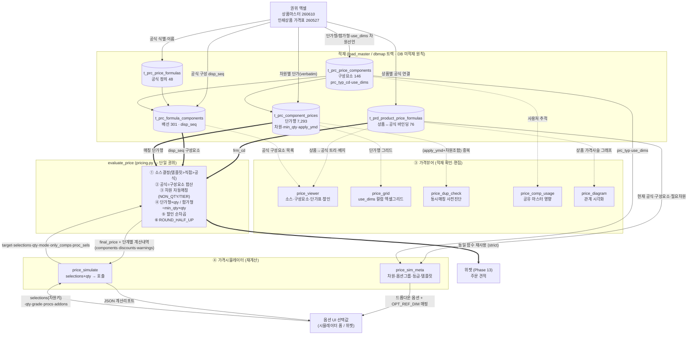

# price-flow-map.md — 4구성물 역할 + 데이터 흐름도

> 후니 가격계산의 4구성물(가격공식·가격구성요소·가격뷰어·가격시뮬레이터)의 역할을 코드 근거로
> 분리 명세하고, 권위 엑셀 → 적재 → 공식/구성요소/단가행 → 뷰어(확인) → 시뮬레이터(재계산) →
> 위젯(주문)까지를 한 흐름도로 도해한다. 각 화살표에 "무엇이 전달되는가"를 명시.
>
> 소스: `pricing.py`, `price_views.py`(이하 `pv.py`), `templates/catalog/price_*.html`.
> 라이브 실측: 2026-06-18. 산출자: hpq-engine-cartographer.

---

## 1. 4구성물 역할 (코드 근거)

### ① 가격공식 (`t_prc_price_formulas` 정의 + `t_prd_product_price_formulas` 바인딩)
- **정의 테이블** `t_prc_price_formulas`(frm_cd, frm_nm, frm_typ_cd): 공식의 식별·이름.
  **frm_typ_cd는 엔진 미참조**(pricing.py에 frm_typ 분기 없음) — 공식 = 항상 구성요소 합산.
- **바인딩 테이블** `t_prd_product_price_formulas`(prd_cd, frm_cd, apply_bgn_ymd): 상품↔공식
  연결. 가격 소스의 **3순위**(pricing.py:319-327). `_latest_ymd(apply_bgn_ymd)`로 현재 공식.
- 라이브: 공식 48·바인딩 76·직접단가 0 → 전 상품이 이 바인딩을 통해 공식 평가.

### ② 가격구성요소 (`t_prc_price_components` + `t_prc_formula_components` + `t_prc_component_prices`)
- **정의** `t_prc_price_components`(comp_cd, comp_nm, **prc_typ_cd**, **use_dims**): 구성요소
  단위. `prc_typ_cd`=단가형(.01)/합가형(.02). `use_dims`=이 구성요소가 선택값과 매칭하는 차원
  선언(jsonb 배열, 예 `["siz_width","siz_height","mat_cd"]`). 라이브 146개(.01=143/.02=3).
- **배선** `t_prc_formula_components`(frm_cd, comp_cd, disp_seq, addtn_yn): 공식↔구성요소.
  엔진은 `disp_seq` 순회(:450-453), **addtn_yn 무시**(CONTEXT). 라이브 301행.
- **단가행** `t_prc_component_prices`(comp_price_id, comp_cd, apply_ymd, unit_price, min_qty,
  siz_width, siz_height, dim_vals, NON_QTY_DIMS…): 실 단가. `use_dims` 선언 차원으로 selections
  자동매칭(pricing.py:78-90, :241). 라이브 7,293행.
- **검증 가능 명제 F-1**: use_dims에 선언된 비수량 차원이 단가행에서 전부 NULL이면 판별 불가 →
  항상 매칭(engine-contract C2). use_dims 선언 ↔ 단가행 실값의 정합이 데이터 건전성의 핵심.

### ③ 가격뷰어 (`price_viewer` view + `price_viewer.html`) — 적재 확인·편집 UI
- `pv.py:price_viewer`(:212-218): 좌측 상품트리(가격소스 배지) → 우측 ①소스 ②공식 구성요소
  ③단가표 그리드 ④할인. **적재된 것을 사람이 확인·편집**하는 화면(계산 아님).
- 보조 도구:
  - **그리드** `price_grid`/`price_grid_save`(:561-748): use_dims 순서대로 컬럼 구성한 엑셀형
    단가표. 부분수정·클립보드 일괄입력.
  - **중복검사** `price_dup_check`(:767-786): NULL 동일 취급, (apply_ymd+차원조합) 중복행 검출.
    = 엔진 ERR_AMBIGUOUS/ERR_DUPLICATE의 사전 진단.
  - **사용처** `price_comp_usage`(:751-764): 구성요소→공식→연결 상품(공유 마스터 영향 경고).
  - **다이어그램** `price_diagram`(:377-518): 상품→공식→구성요소→단가행 관계 시각화(mermaid).

### ④ 가격시뮬레이터 (`evaluate_price` 호출 경로 + `price_simulator.html`)
- `pv.py:price_sim_meta`(:1051-1258): 시뮬 입력 메타 — 현재 공식 구성요소·필요 차원·드롭다운
  옵션·옵션그룹·등급·템플릿·추가상품을 JSON으로 제공. **옵션선택 UI의 데이터 소스.**
- `pv.py:price_simulate`(:1262-1328): selections+qty(+grade/mode/only_comps/procs/addons)를
  받아 `pricing.evaluate_price` 호출(:1297) → 계산내역 JSON 반환. what-if(only_comps)·공정
  다중평가(proc_sels)·추가상품 개별평가 지원.
- `pv.py:price_simulator`(:1335-1338): 전용 페이지. lenient 기본(데이터 구멍 발견).

---

## 2. 데이터 흐름도 (mermaid)

### 흐름 핵심 (화살표 의미)
- **권위 엑셀 → 적재**: 단가값은 가격표 verbatim(메모리 [[dbmap-round21-isomorphism]]).
  공식/구성요소/배선/단가행 5엔티티로 분해 적재. **DB 미적재 원칙**(GO분만 라이브).
- **적재 → 뷰어**(점선): 사람이 적재 결과를 확인·편집. 계산하지 않음. 진단(dup/usage/diagram).
- **적재 → 시뮬레이터 메타**: 현재 공식의 구성요소·필요 차원·옵션그룹을 UI 드롭다운으로.
- **UI → simulate → engine**(굵은선): selections·qty 정규화 후 evaluate_price 호출. 계산내역 회신.
- **engine → 위젯**: **동일 evaluate_price 함수** 재사용(CONTEXT — Phase13 API·Phase15 주문
  재검증). 시뮬=lenient(검증), 위젯/주문=strict.

---

## 3. 구성물 간 결정적 연결 (검증 시 추적 경로)

| 연결 | 키 | 의미 | 근거 |
|------|----|------|------|
| 공식정의→배선 | frm_cd | 공식이 어떤 구성요소로 구성 | pricing.py:450 |
| 배선→구성요소정의 | comp_cd | 구성요소의 prc_typ·use_dims | :452 (조인) |
| 구성요소→단가행 | comp_cd | use_dims 차원으로 selections 매칭 | :238-241 |
| 상품→공식 | prd_cd, apply_bgn_ymd | 가격 소스 3순위 | :320-322 |
| 상품→수량할인 | prd_cd→dsc_tbl_cd | 할인 1단계 | :482-491 |
| 상품→주카테고리→등급할인 | prd_cd, cat_cd, grade_cd | 할인 2단계 | :513-524 |

- **사슬 단절 진단(메모리 [[dbmap-price-chain-dwire-per-product-formula]])**: 상품↔공식은
  바인딩되나, 공유 공식이 여러 상품에 걸리고 상품별 택일 구성요소가 배선 안 되면 가격사슬 단절.
  → 뷰어 `price_diagram`이 이 단절을 시각화. 시뮬레이터에서 "매칭 0건 0원" 경고로 발현.
