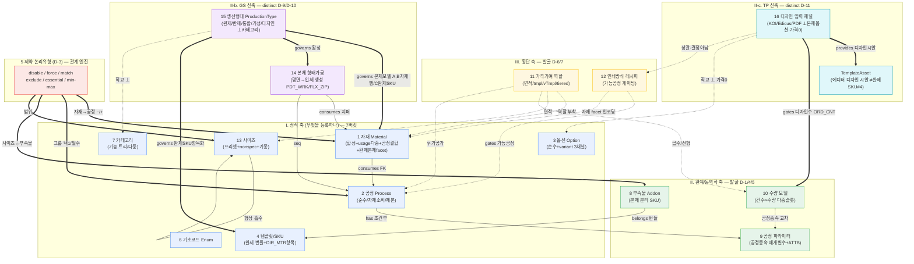
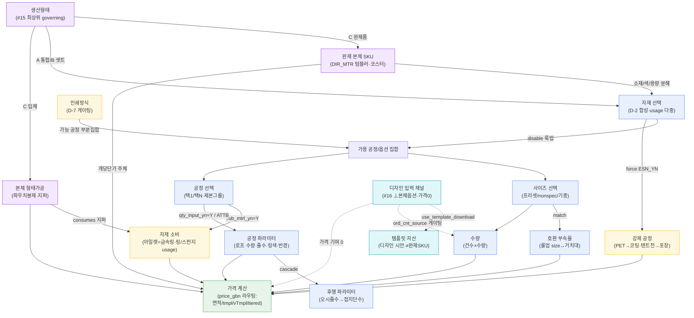

# RedPrinting 옵션 관리 메타모델 ERD (mermaid)

> rpm-metamodel-architect. **v3.0 (TP 통합):** 16 관리 축과 그 관계를 그린 ERD. 가치는 *관계*에 집중(SKILL §4).
> 정초 = `metamodel-dictionary.md`(축 사전 16축) + `discovered-axes.md`(발굴 근거 D-1~D-11).
> 추상 메타모델 — 후니 비종속(특정 t_* 컬럼명 아닌 패턴). RedPrinting BN(면적)+GS(완제/입체)+TP(디자인입력) 역공학 권위.
> **GS 반영:** 생산형태(#15 governing) · 본체 형태가공(#14) · 완제 본체 두 표현 facet · 가격모델 4종.
> **TP 신규 반영:** 디자인 입력 채널(#16 본체옵션과 직교·가격0) · 템플릿 자산(에디터 디자인 시안·#4 완제SKU와 별 엔티티 분리) · 입력채널→수량(디자인수 게이팅).

---

## 1. 엔티티 관계도 (ER)

```mermaid
erDiagram
    PRODUCT ||--o{ MATERIAL : "구성(belongs-to)"
    PRODUCT ||--o{ PROCESS_MEMBER : "후가공"
    PRODUCT ||--o{ ADDON : "번들(belongs-to)"
    PRODUCT ||--o{ QUANTITY_SLOT : "수량 슬롯 노출"
    PRODUCT ||--|| PRINT_METHOD : "1상품=1방식(gated-by)"
    PRODUCT ||--|| PRICING_MODEL : "가격모델 바인딩"
    PRODUCT }o--o{ CATEGORY : "다중분류(multi-tree)"
    PRODUCT ||--o{ OPTION_GROUP : "옵션"
    PRODUCT ||--o{ TEMPLATE : "완제 SKU(번들)"
    PRODUCT ||--|| PRODUCTION_TYPE : "생산형태(classified-by ⊥category)"
    PRODUCT ||--o{ FORM_ASSEMBLY : "본체 형태가공(GS 완제/입체)"
    PRODUCT ||--|| DESIGN_INPUT_CHANNEL : "디자인입력(classified-by ⊥본체옵션·가격0)"

    PRODUCTION_TYPE ||--o{ MATERIAL : "governs 본체모델(A/B=자재행 C=DIR_MTR SKU)"
    PRODUCTION_TYPE ||--o{ FORM_ASSEMBLY : "governs(C 입체만 활성)"
    PRODUCTION_TYPE ||--o{ TEMPLATE : "governs 완제 SKU 항목화"

    FORM_ASSEMBLY }o--o| MATERIAL : "consumes 지퍼(FLX_ZIP 부자재)"
    FORM_ASSEMBLY ||--o{ PROCESS_MEMBER : "seq(인쇄→재단→형태가공)"

    MATERIAL ||--|| MATERIAL_AXIS : "합성분해(TYPE/PTT/CLR/WGT/방식)"
    MATERIAL }o--|| ENUM_VALUE : "코드도메인"
    MATERIAL ||--o{ CONSTRAINT : "자재→공정 force/disable"

    PROCESS_MEMBER }o--|| PROCESS_GROUP : "그룹 소속"
    PROCESS_MEMBER }o--o| MATERIAL : "consumes(SUB_MTRL_YN=Y)"
    PROCESS_MEMBER ||--o{ PROCESS_PARAMETER : "has(조건부)"
    PROCESS_MEMBER ||--o{ PROCESS_MEMBER : "precedes(순서 의존)"
    PROCESS_GROUP ||--o{ CONSTRAINT : "택1/필수(exclude/essential)"

    ADDON }o--|| SIZE_PRESET : "match(부속물↔사이즈)"
    ADDON ||--o{ ADDON : "size variant(거치대 600/850/1000)"

    SIZE_PRESET }o--|| ENUM_VALUE : "프리셋 코드"
    SIZE_PRESET ||--o| NONSPEC_RANGE : "자유입력 min-max"
    SIZE_PRESET ||--o{ CONSTRAINT : "범위/match"

    OPTION_GROUP ||--o{ OPTION : "택1/택N"
    OPTION }o--o| MATERIAL : "polymorphic ref"
    OPTION }o--o| PROCESS_MEMBER : "polymorphic ref"
    OPTION }o--o| SIZE_PRESET : "polymorphic ref"
    OPTION ||--o{ CONSTRAINT : "옵션 제약"

    PROCESS_PARAMETER ||--o{ PROCESS_PARAMETER : "cascade(오시줄수→접지단수)"
    PROCESS_PARAMETER }o--o| QUANTITY_SLOT : "공정종속 수량(교차)"

    PRINT_METHOD ||--o{ PROCESS_MEMBER : "gates(가능공정 부분집합)"
    PRINT_METHOD }o--o| MATERIAL : "자재 facet 인코딩(수성/라텍스)"
    PRINT_METHOD }o..o| DESIGN_INPUT_CHANNEL : "상관(offset↔에디터0·결정아님)"

    DESIGN_INPUT_CHANNEL ||--o{ TEMPLATE_ASSET : "provides 디자인 시안(≠완제SKU)"
    DESIGN_INPUT_CHANNEL ||--o{ QUANTITY_SLOT : "gates 디자인수(ORD_CNT 산정출처)"

    TEMPLATE ||--o{ ADDON : "번들 구성"
    TEMPLATE ||--o{ TEMPLATE_SELECTION : "구성 선택"

    PRICING_MODEL ||--o{ MATERIAL : "면적단가키"
    PRICING_MODEL ||--o{ SIZE_PRESET : "SizeMatrix2D 면적"
    PRICING_MODEL ||--o{ QUANTITY_SLOT : "건수=곱수/수량=선형"
    PRICING_MODEL ||--o{ PROCESS_MEMBER : "후가공가"

    CATEGORY ||--o{ CATEGORY : "트리(parent-child)"

    PRODUCT {
        code prd_cd
        enum prd_typ "완제품/반제품/디자인/기성"
    }
    MATERIAL {
        code mtrl_cd "합성 PK"
        code ptt_cd "소재"
        code clr_cd "본체색(별색 아님)"
        code wgt_cd "무게/두께(GS 장패드 4T)"
        enum usage_cd "내지/표지/면지/공통(GS 다중슬롯✅)"
        bool sub_mtrl_yn "부자재"
        enum body_repr "BN자재행 / GS DIR_MTR완제SKU항목"
        tag price_flag "면적단가키"
    }
    PRODUCTION_TYPE {
        enum prd_typ "A통합/B셋트반제품/C완제품/기성/디자인"
        enum body_model "A,B=자재행 / C=완제SKU항목"
        enum set_structure "B=sub_prd+sets / A,C=sets0"
    }
    FORM_ASSEMBLY {
        code assembly_cd "PDT_WRK / FLX_ZIP"
        enum assembly_type "봉제/조립/지퍼/접합"
        code consumes_material "지퍼=부자재"
        enum direction_variant "세로형/가로형"
    }
    PROCESS_MEMBER {
        code pcs_cod "그룹"
        code pcs_dtl_cod "멤버 leaf"
        bool esn_yn "필수"
        bool sub_mtrl_yn "자재소비"
        bool qty_input_yn "파라미터수량"
        int seq "공정순서"
    }
    PROCESS_PARAMETER {
        code owner_pcs_dtl_cod "부모공정"
        enum param_type "줄수/mm/색/수량/조각수"
        text value_domain
    }
    ADDON {
        code addon_cd "독립 SKU"
        text label "실내외+종류"
        enum size_variant
    }
    QUANTITY_SLOT {
        enum slot_type "건수ORD/수량PRN/묶음/공정종속"
        tag price_role "곱수/선형"
    }
    SIZE_PRESET {
        text div_nm "프리셋"
        int cut_wdt
        int cut_hgh
        int work_margin "재단+4mm"
    }
    NONSPEC_RANGE {
        int min "0"
        int max "5000"
    }
    CONSTRAINT {
        enum constraint_type "disable/force/match/exclude/essential/minmax"
        json logic "JSONLogic"
        enum direction "force=+/disable=-"
    }
    PRINT_METHOD {
        enum method_cd "디지털/실사/UV/옵셋/실크"
        text allowed_processes "가능공정집합"
        text file_formats
        text team
    }
    PRICING_MODEL {
        enum model "면적SizeMatrix2D(BN) / tmpl개당가 / vTmpl variant / tiered구간(GS)"
        code price_gbn "라우팅키(완제본체 유무)"
    }
    CATEGORY {
        code cat_cd
        code parent_cat_cd
        bool main_yn "잎노드"
    }
    DESIGN_INPUT_CHANNEL {
        enum channel "item_gbn: vDigital(KOI)/edicus(VDP)/offset2023(없음·PDF)"
        bool use_koi_editor
        bool use_rp_editor
        bool use_template_download "TemplateAsset 노출 게이트"
        bool use_pdf "PDF 직접 업로드"
        enum ord_cnt_source "PDF/에디터(디자인수 산정·#10 게이팅)"
        bool vdp_capable "Edicus setVariableData(가변데이터)"
    }
    TEMPLATE_ASSET {
        code template_resource_id "koi_template_resource_id(≠완제SKU #4)"
        json asset_options "koiOption[]"
        int price "0(디자인 입력 무료)"
    }
```

---

## 2. 축 분류 그래프 (16축 + 제약 간선 엔진 + GS/TP governing)

---

## 3. 옵션 선택 캐스케이드 흐름 (위젯 런타임 게이팅)

> ★디자인 입력 채널(#16)은 본체 캐스케이드와 *분리된 직교 레인*이다 — 디자인수(ORD_CNT) 산정만 수량으로 게이팅하고 가격에는 기여하지 않음(가격 기여 0). 템플릿 자산(디자인 시안)을 노출하되 완제SKU(#4 번들)와 별 레이어.

---

## 관계 읽는 법 (요약)

- **제약(D-3)은 간선이다** — 정적 축들(자재·공정·사이즈·부속물)을 잇는 6유형 논리. 메타모델의 동역학은 전부 제약 그래프로 환원.
- **인쇄방식(D-7)이 최상위 게이트** — 가능 공정 집합을 먼저 결정하고, 그 안에서 자재/공정/사이즈가 선택됨.
- **공정은 두 방향으로 확장** — 아래로 파라미터(D-4), 옆으로 자재소비(D-2 FK). 단순 leaf 아님.
- **가격(D-6)은 모든 선택축에 부착되는 횡단 태그** — 독립 엔티티가 아니라 각 축의 price_role.
- **부속물(D-1)·템플릿(#4)은 본체 외부** — 부속물=부품, 템플릿=번들 단위. 본체 구성(자재·공정)과 분리.
- **★생산형태(#15·GS)가 인쇄방식보다 상위 governing** — 본체가 자재행(A/B)인지 완제 SKU 항목(C 완제품 DIR_MTR)인지를 *먼저* 결정. 카테고리와 직교(같은 노트에 A·C 공존).
- **★완제 본체(GS)는 자재 facet** — DIR_MTR=자재참조(소재/색/용량 분해) + 가격기여(#11 개당단가 주체) + 템플릿(#4 SKU). 신축 아닌 기존 축 결합.
- **★형태가공(#14·GS)은 본체를 생성** — 파우치/마이크텍 봉제·지퍼. 일반 후가공(본체에 작업)과 별 lifecycle. C 입체에서만 활성.
- **가격은 price_gbn 라우팅(GS)** — 면적형(BN)·tmpl·vTmpl·tiered 4종. 완제본체 유무가 분기 단서.
- **★디자인 입력 채널(#16·TP)은 직교 레인** — KOI/Edicus/PDF 에디터 채널이 본체 옵션과 분리(가격 0). 비-TP 트윈(HLCLSTD)과 본체/가격 동일·입력채널만 차이. 디자인수(ORD_CNT)만 수량으로 게이팅, 템플릿 자산(디자인 시안) 노출. 후니 위젯 Edicus 어댑터 통합 경계와 정합(huni-widget RedEditorSDK 계약).
- **★템플릿 두 의미 분리(TP·T-A)** — 완제SKU 번들(#4 `t_prd_templates`) vs 에디터 디자인 시안(TemplateAsset·#16 종속·가격0). 같은 단어 다른 의미·별 엔티티. 후니 매핑 시 디자인 시안을 완제SKU에 적재 금지.
- **3 상품군 미관측(갱신): 카테고리 트리 깊이·template_selections·vTmpl 분기조건 + TP 템플릿 자산 카탈로그·VDP 변수 스키마·티켓 넘버링(VDP vs 공정)·INN_PAGE↔가격 결합** — 책자/문구 reuse + 로그인 에디터 캡처로 보강 필요(discovered-axes 갭).
