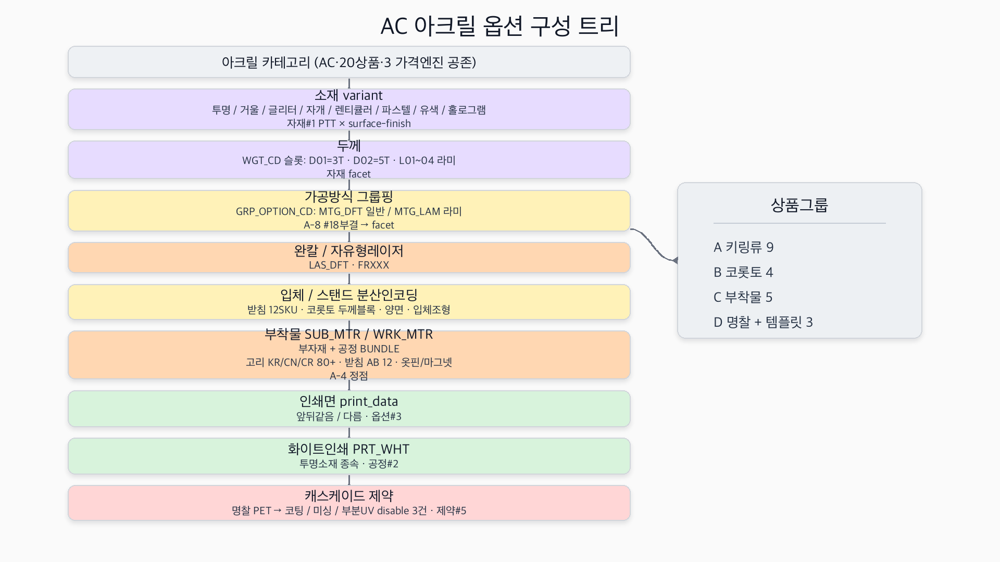
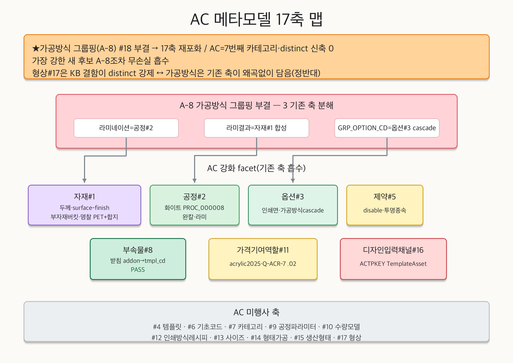
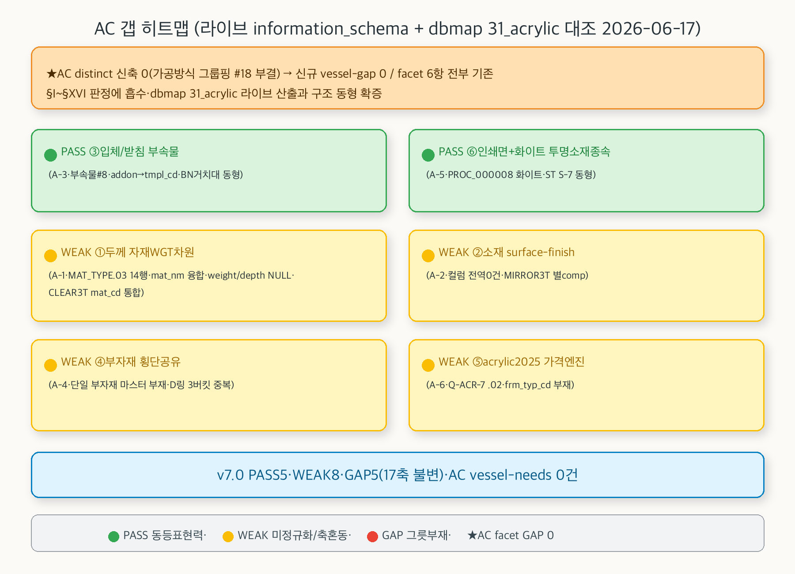
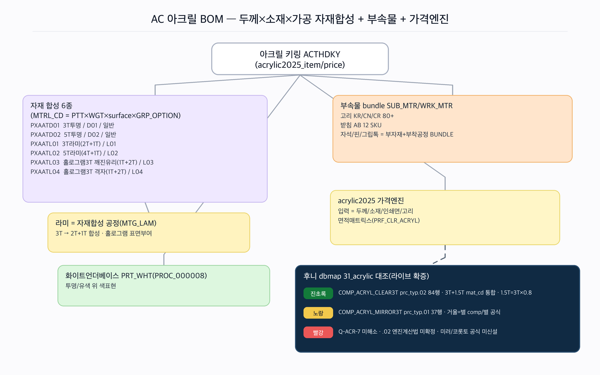

# AC(아크릴·키링·코롯토·명찰·등신대) 카테고리 — RP-Meta 파이프라인 요약

> 후니 RP-Meta 하네스. RedPrinting AC(아크릴 — 키링·코롯토/스탠드·명찰·등신대·마그넷/뱃지·템플릿) 카테고리의 역공학→메타모델→갭 파이프라인 산출 인덱스.
> **★AC 본질 = 가공방식 그룹핑(A-8) #18 부결(facet) → 17축 재포화 · 두께/소재/부착 자재 facet.** AC reverse가 "가공방식 그룹핑 슬롯(GRP_OPTION_CD/production_method)=distinct #18 강후보"를 강하게 제기(자재행을 가공방식 그룹으로 묶는 전용 슬롯·라미=두께/표면 능동 변환)했으나 메타모델 단계가 **9 fragment(A-1~A-9) 전건 facet 강등** → distinct 신축 0건. AC=7번째 카테고리·distinct 0이 ST(5번째·형상 #17)가 깬 포화를 **모델 안정성으로 재확인**(가장 강한 새 후보 A-8조차 무손실 흡수·PR·CL 패턴 반복). **★형상#17과 정반대 — 형상은 후니 KB "어느 축에도 없음" 결함이 distinct 강제, 가공방식은 기존 축(공정#2 라미·자재#1 합성·옵션#3 cascade)이 왜곡 없이 담음.**

## 산출물
- **역공학(reverse):** [`reverse.md`](reverse.md) — 대표 3상품(ACNTHAP 명찰=PET라벨+아크릴합지·라벨형·vTmpl_price / ACTHDKY 키링=두께×소재 6종·완칼·고리80+·acrylic2025_price superset / ACPDSTD 등신대=평면본체+받침12 SKU·입체·edicus/tmpl_price) 원자추출 + 17상품 그룹 횡단 태깅(§4: A 키링류9·B 코롯토4·C 부착물5·D 명찰+템플릿3). **★두께(D01=3T/D02=5T)=MTRL_CD WGT_CD 슬롯 인코딩·소재 variant(투명/거울/글리터/자개/렌티큘러/파스텔/유색/홀로그램)=자재 PTT+소재특화 pdtCode·입체/스탠드=받침 부자재+코롯토 두께블록 분산·완칼=자유형레이저 FRXXX·부착물=SUB_MTR/WRK_MTR BUNDLE(고리 KR/CN/CR ST 코드공유·정점 80+)·가공방식=GRP_OPTION_CD(일반/라미)·인쇄면+화이트=투명소재 종속·3 가격엔진 공존.** Ambiguous fragments A-1~A-9.
- **메타모델(02_metamodel):** [`_resolved-fragments.md`](../../02_metamodel/_resolved-fragments.md)(AC v7.0 판정·A-1~A-9) + [`discovered-axes.md`](../../02_metamodel/discovered-axes.md) §AC. **★distinct 승급 0건(가공방식 그룹핑 #18 부결·17축 재포화).** A-8 부결 3 기존 축 무손실 분해: ① 라미네이션=공정#2(합지 family) ② 라미 결과(라미된 자재행)=자재#1 합성(D-2·두께/표면) ③ GRP_OPTION_CD 그룹핑=옵션#3 polymorphic cascade. directive 4 관전 적대 판정: ① 두께=자재#1 WGT facet(후니 투명3T/1.5T mat_cd 통합 동형) ② 소재variant=자재#1 surface-finish facet(거울 별공식=#11 라우팅) ③ 입체/스탠드=분산 facet(받침=부속물#8·코롯토 두께=자재#1·양면=옵션#3·입체조형=공정#2) ④ 가공방식 그룹핑=#18 부결.
- **갭(03_gap):** [`gap-matrix.md`](../../03_gap/gap-matrix.md) §XVII~XVIII — 후니 라이브 t_* 대조(2026-06-17 read-only information_schema 직접 SELECT + ★dbmap 31_acrylic 직접 대조). **★AC facet 6항 = PASS 2·WEAK 4·GAP 0·신규 vessel-gap 0**(전부 기존 #1/#5/#8/#11 흡수): 🟢 PASS ③ 입체/받침 부속물(A-3·`t_prd_product_addons` addon→tmpl_cd·BN 거치대 D-1 동형) · 🟢 PASS ⑥ 인쇄면+화이트 투명소재종속(A-5·`PROC_000008 화이트` 별색 family 라이브 실재·ST S-7 동형) · 🟡 WEAK ① 두께 자재WGT차원(A-1·MAT_TYPE.03 14행·mat_nm 융합·weight/depth NULL·★dbmap CLEAR3T mat_cd 통합 확증) · 🟡 WEAK ② 소재 surface-finish(A-2·컬럼 전역 0건·MIRROR3T 별 comp) · 🟡 WEAK ④ 부자재 횡단공유(A-4·★단일 부자재 마스터 부재·D링 .02/.04/.07 3버킷 중복) · 🟡 WEAK ⑤ acrylic2025 가격엔진(A-6·★dbmap Q-ACR-7 .02 라이브 확증·frm_typ_cd 부재). v7.0 종합 카운트 **PASS 5·WEAK 8·GAP 5(17축·불변)**. **AC가 추가하는 vessel-needs = 0건**(V-1~V-12 불변). **★dbmap 31_acrylic 라이브 산출과 구조 동형 확증(CLEAR3T mat_cd 통합·MIRROR3T 별 comp·Q-ACR-7 .02·화이트=공정).**

## 시각화 (viz)

> **renderer: codex-image (gpt-5.5)** — preflight `AVAILABLE model=gpt-5.5` 확인 후 `codex exec -m gpt-5.5 --sandbox workspace-write`로 4종 PNG 병렬 생성(N=4). mermaid `.mmd` 소스도 동시 보유(폴백 안전망·codex outage 시 재사용). 4종 모두 분석 출처 섹션과 1:1 대응(노드/엣지/라벨/색 = 분석이 말한 것·없는 구조 발명 0). AC 핵심 = 가공방식 그룹핑 #18 부결·17축 재포화·두께/소재/부착 자재 facet — 4종 전부 이를 강조.

### 1. 옵션 구성 트리 — `viz/option-tree.png` (소스 `viz/option-tree.mmd`)

AC 아크릴 옵션 구성 트리 — 소재 variant(투명/거울/글리터/자개/렌티큘러/파스텔/유색/홀로그램·자재#1 PTT×surface-finish) → **★두께(WGT_CD 슬롯·D01=3T/D02=5T/L01~04 라미·자재 facet)** → 가공방식 그룹핑(GRP_OPTION_CD·일반/라미·A-8 #18부결) → 완칼 자유형레이저(LAS_DFT·FRXXX) → 입체/스탠드 분산인코딩(받침 12SKU·코롯토 두께블록·양면·입체조형) → **★부착물 SUB_MTR/WRK_MTR BUNDLE(고리 KR/CN/CR 80+ ST 코드공유·받침 AB 12·옷핀/마그넷·A-4 정점)** → 인쇄면(앞뒤같음/다름·옵션#3) → 화이트인쇄(PRT_WHT·투명소재 종속) → 캐스케이드 제약(명찰 PET→코팅/미싱/부분UV disable 3건). 상품그룹(키링9·코롯토4·부착물5·명찰+템플릿3). 출처: `reverse.md §0~§4`.

### 2. 메타모델 17축 맵 — `viz/axis-map.png` (소스 `viz/axis-map.mmd`)

AC가 17축 중 어느 축을 강화/미행사하나. **★가공방식 그룹핑(A-8) #18 부결 → 17축 재포화 배너**(AC=7번째·distinct 신축 0·가장 강한 새 후보 A-8조차 무손실 흡수·형상#17은 KB 결함이 distinct 강제 ↔ 가공방식은 기존 축이 왜곡 없이 담음 정반대). A-8 부결 3 기존 축 분해(라미=공정#2·라미결과=자재#1 합성·GRP_OPTION_CD=옵션#3 cascade) + AC 강화 facet 7항(자재#1 두께/surface-finish/부자재버킷/명찰합지·공정#2 화이트/완칼/라미·옵션#3 인쇄면/cascade·제약#5 disable/투명종속·부속물#8 받침 PASS·가격기여역할#11 acrylic2025·디자인입력#16 ACTPKEY). 회색 = AC 미행사(#4·#6·#7·#9·#10·#12·#13·#14·#15·#17). 출처: `02_metamodel/discovered-axes.md §AC·_resolved-fragments.md(AC v7.0)·gap §XVII`.

### 3. 갭 히트맵 — `viz/gap-heatmap.png` (소스 `viz/gap-heatmap.mmd`)

AC facet 6항 PASS/WEAK/GAP(라이브 2026-06-17 실측 + dbmap 31_acrylic 대조). 🟢 **③ 입체/받침 부속물 PASS**(`t_prd_product_addons` addon→tmpl_cd·BN 거치대 동형) / 🟢 **⑥ 인쇄면+화이트 PASS**(`PROC_000008 화이트` 별색 family 실재·ST S-7 동형) / 🟡 **① 두께 WEAK**(MAT_TYPE.03 14행·mat_nm 텍스트 융합·weight/depth NULL·★CLEAR3T mat_cd 통합 확증·V-3) / 🟡 **② surface-finish WEAK**(컬럼 전역 0건·MIRROR3T 별 comp·V-3) / 🟡 **④ 부자재 횡단공유 WEAK**(★단일 부자재 마스터 부재·D링 3버킷 중복·V-3) / 🟡 **⑤ acrylic2025 가격엔진 WEAK**(★Q-ACR-7 .02 라이브 확증·frm_typ_cd 부재·기존 #11). **★신규 vessel-gap 0·facet GAP 0 — facet 6항 전부 기존 #1/#5/#8/#11 흡수·AC가 추가하는 vessel-needs 0건·후니 dbmap 아크릴 동형 확증.** v7.0 종합 PASS 5·WEAK 8·GAP 5. 출처: `03_gap/gap-matrix.md §XVII~XVIII`.

### 4. 아크릴 BOM 다이어그램 — `viz/bom.png` (소스 `viz/bom.mmd`)

아크릴 키링(ACTHDKY) 자재 합성 구조 — **★두께(WGT)×소재(surface-finish)×가공(라미)** 자재 6종 합성(MTRL_CD = PTT×WGT×surface×GRP_OPTION·라미=3T→2T+1T 합성·홀로그램 표면부여) + **부속물 bundle**(SUB_MTR/WRK_MTR·고리 KR/CN/CR 80+·받침 AB 12·자석/핀/그립톡) + 화이트언더베이스(PRT_WHT·PROC_000008) + **acrylic2025 가격엔진**(두께/소재/인쇄면/고리 입력·면적매트릭스 PRF_CLR_ACRYL). **★후니 dbmap 31_acrylic 대조**(라이브 확증): COMP_ACRYL_CLEAR3T prc_typ .02 84행·3T+1.5T mat_cd 통합(1.5T=3T×0.8·RP WGT 슬롯 동형) / COMP_ACRYL_MIRROR3T .01 37행·거울=별 comp/별 공식(#11 라우팅) / Q-ACR-7 미해소(.02 엔진계산법·미러/코롯토 공식 미신설·가격 트랙 범위). 출처: `reverse.md §0.1~§0.4·§2 + gap §XVII`.

## 분석 링크
- 역공학: [`reverse.md`](reverse.md)
- 메타모델 판정(AC v7.0): [`../../02_metamodel/_resolved-fragments.md`](../../02_metamodel/_resolved-fragments.md)(A-1~A-9) + [`discovered-axes.md`](../../02_metamodel/discovered-axes.md) §AC
- 갭 매트릭스(AC §XVII~XVIII): [`../../03_gap/gap-matrix.md`](../../03_gap/gap-matrix.md) §XVII~XVIII
- 후니 dbmap 아크릴 대조: `_workspace/huni-dbmap/31_acrylic-price-link/{acrylic-chain-design,confirms-and-gaps}.md`
