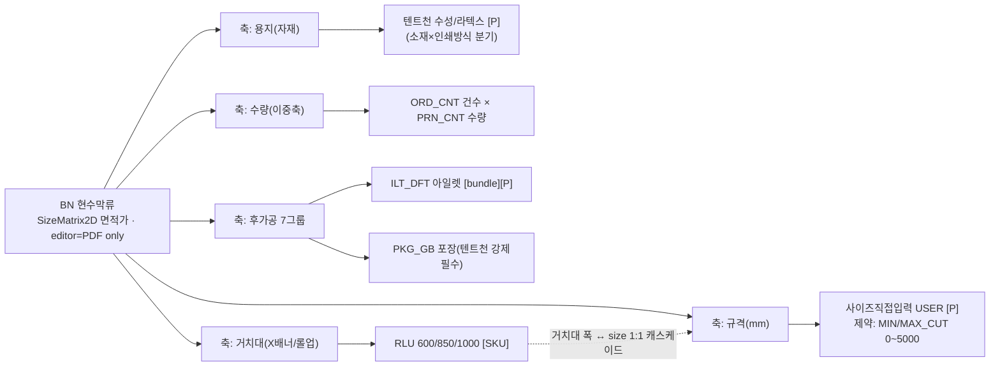
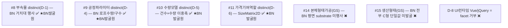
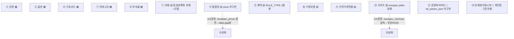
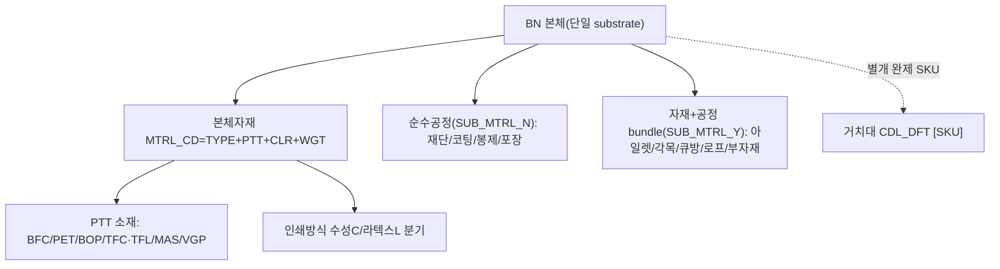

# BN(현수막류) 카테고리 — RP-Meta 파이프라인 요약

> 후니 RP-Meta 하네스. RedPrinting BN(현수막/대형 실사 배너) 카테고리의 역공학→메타모델→갭→그릇 파이프라인 산출 인덱스.

## 산출물
- **역공학(reverse):** `reverse.md` — 대표 6상품(BNBNFBL·BNPTPET·BNSTDFT·BNBNSOD·BNRLSLV·BNPTMAS·BNTNHVY) base-data 렌즈 원자 추출. Vue3 BFF + 레거시 jQuery SSR 이중 런타임·단일 base-data 모델.
- **메타모델(02_metamodel):** `metamodel-dictionary.md`·`discovered-axes.md` — BN+GS 통합 15축(7 정적 + 4 관계/동역학 + 2 횡단 + GS 신축 2).
- **갭(03_gap):** `gap-matrix.md` — 후니 라이브 t_* 대조 PASS 5·WEAK 7·GAP 3(2026-06-17 read-only 실측).
- **심층보강(deepcheck):** `deepcheck.md` — codex-cli second-opinion 갭발굴.

## deepcheck 포인터
- **`deepcheck.md` → 상태: DEEPCHECK PENDING (codex CLI 버전 블로커, 2026-06-17 재실행).**
  직전 "401 OAuth 만료"는 재인증으로 해소됨. 이번 블로커는 별개 — **codex CLI 0.38.0이 너무 낮음**:
  이 CLI의 모델 카탈로그(gpt-5*/gpt-5-codex*)는 ChatGPT 계정에서 `400 "not supported"`로 전수 거부,
  계정이 요구하는 `gpt-5.5`는 `400 "requires a newer version of Codex"`. 모델 지정·MCP off·OSS(ollama 미설치) 전부 우회 실패.
  후보 0건(날조 없음). **해소: codex CLI 최신 업그레이드(예 `@openai/codex@latest`) 후 ping 통과 확인 → rpm-deepcheck 재호출.**
  재실행 컨텍스트·명령 보존: `_tmp/rpm-bn-context.md` + deepcheck.md 내 갱신된 호출 명령(`-c mcp_servers='{}'` 포함).

## 시각화 (viz)

> **renderer: mermaid (codex deadlock)** — codex-image 환경 데드락(codex-cli 0.38.0이 ChatGPT 계정 gpt-5.5 미지원·400, OPENAI_API_KEY 미설정)으로 raster 경로 양쪽 차단. mermaid 텍스트 도해로 폴백(텍스트=분석 그대로·환각0·GitHub/뷰어 렌더). raster 경로 복구 시 PNG로 재생성. 소스 = `viz/*.mmd`.

### 1. 옵션-구성 트리 — `viz/option-tree.mmd`
BN 대표 6상품의 옵션 축(자재·사이즈·도수·수량·후가공 7그룹·거치대)→choices→캐스케이드/disable·가격영향 플래그([P])·필수(ESN)·bundle·SKU. 출처: `reverse.md §1~7`.

### 2. 15축 메타모델 맵 — `viz/axis-map.mmd`
BN이 15축 중 어느 축을 행사하나(행사 ✅ / 부분 △ / GS 신축 미행사 ✖ / D-8 facet 거부 ❌)·distinct vs facet. 출처: `02_metamodel/discovered-axes.md(D-1~D-10)`+`metamodel-dictionary.md`.

### 3. 갭 히트맵 — `viz/gap-heatmap.mmd`
BN 13축 축별 PASS/WEAK/GAP(🟢 5·🟡 6·🔴 2) + GS 라이브 정정(④·⑬ 완화). 출처: `03_gap/gap-matrix.md (v1.0 BN 보존 + §VI 델타)`.

### 4. 자재/공정 BOM — `viz/bom.mmd`
BN 본체자재(MTRL_CD 4축 합성코드 TYPE+PTT+CLR+WGT)·usage 슬롯(BN 단일 substrate)·후가공 공정(순수공정 vs SUB_MTRL_YN=Y 자재+공정 bundle)·별개 거치대 SKU. 출처: `reverse.md §1~8`.

> 4종 모두 분석 출처 섹션과 1:1 대응(노드/엣지/라벨/색 = 분석이 말한 것). 임베드는 요약 발췌이며 전문은 `.mmd` 파일.
