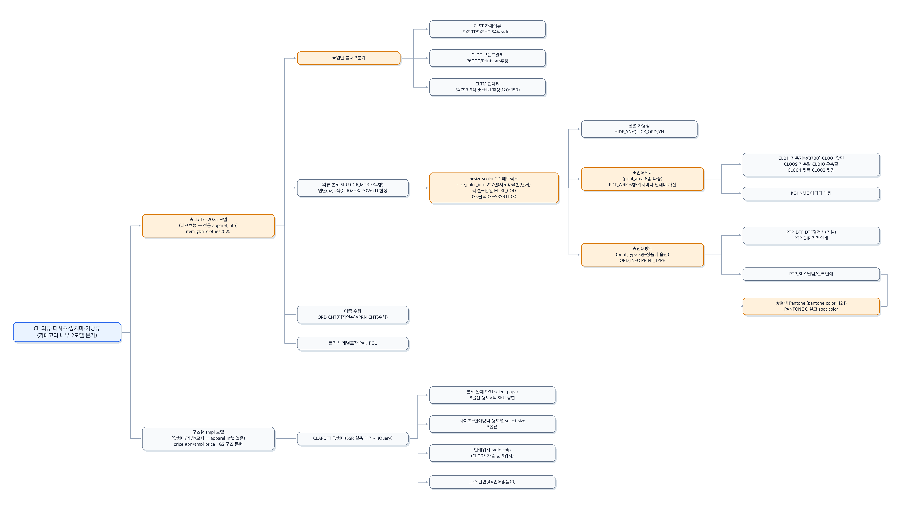
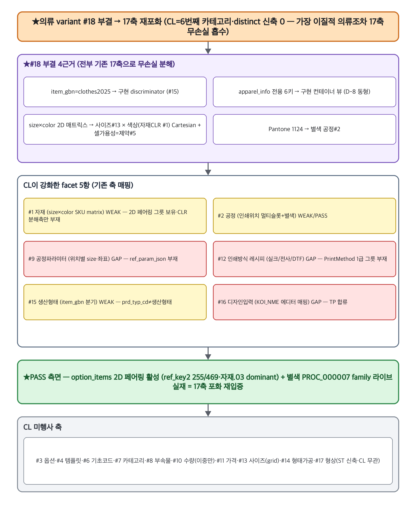
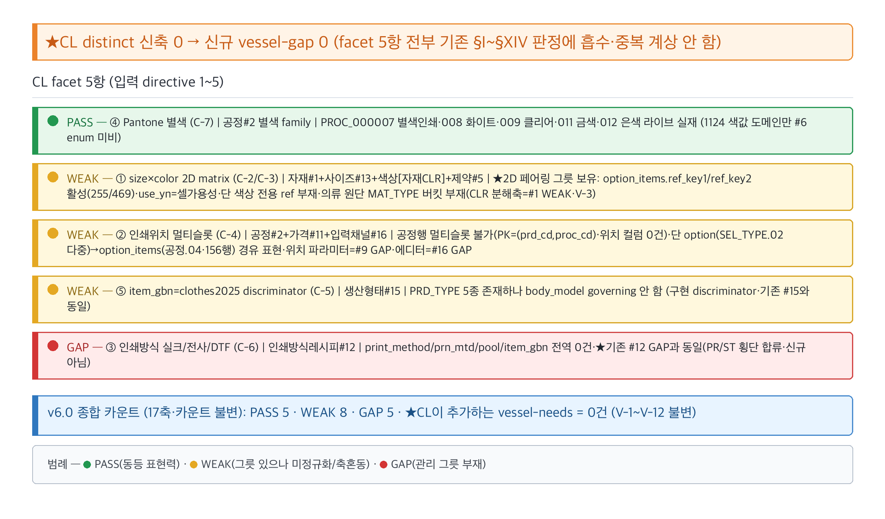
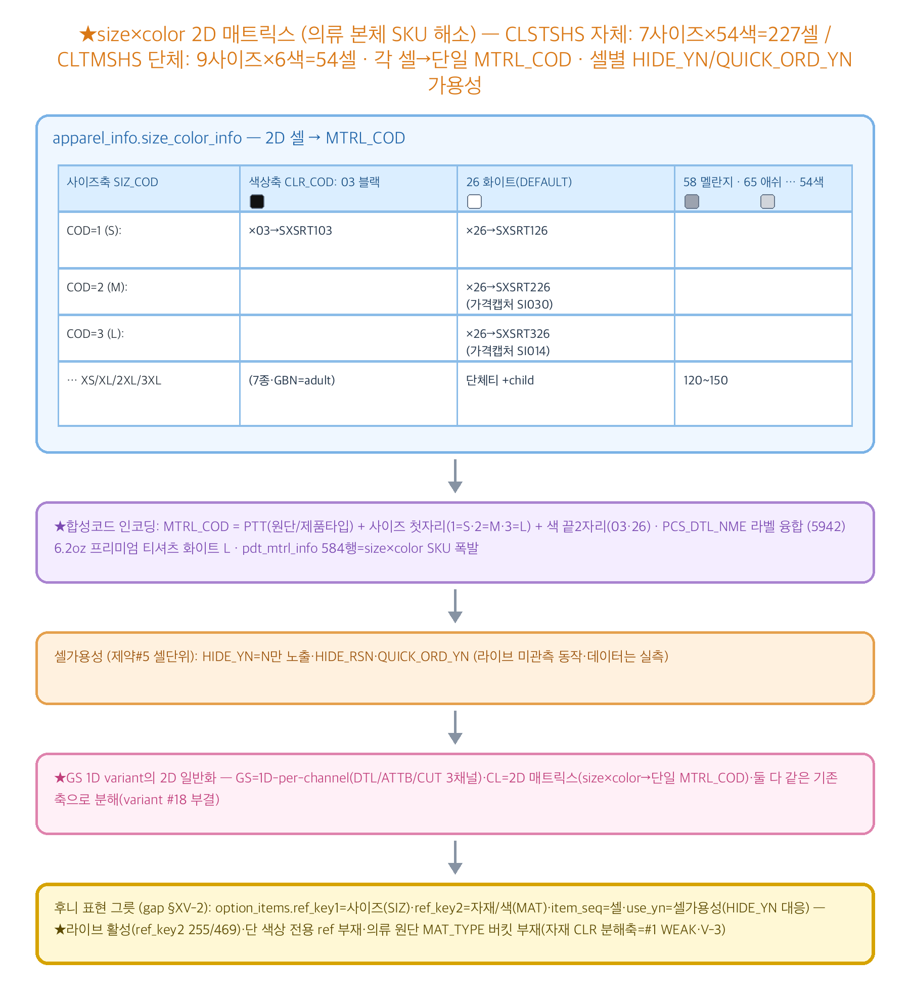

# CL(의류·티셔츠·앞치마·가방류) 카테고리 — RP-Meta 파이프라인 요약

> 후니 RP-Meta 하네스. RedPrinting CL(의류 — 자체/브랜드완제/단체티·앞치마·가방류) 카테고리의 역공학→메타모델→갭 파이프라인 산출 인덱스.
> **★CL 본질 = 의류 variant #18 부결(facet) → 17축 재포화 · size×color 2D 매트릭스 · 카테고리 내부 2모델(clothes2025 vs tmpl) · 인쇄위치 멀티슬롯 · Pantone 1124 별색.** CL reverse가 "의류 variant=distinct #18"을 강하게 제기(전용 clothes2025 모델·전용 apparel_info 6키·size×color 2D 매트릭스·Pantone 1124)했으나 메타모델 단계가 **9 fragment(C-1~C-9) 전건 facet 강등** → distinct 신축 0건. CL=6번째 카테고리·distinct 0이 ST(5번째·형상 #17)가 깬 포화를 **모델 안정성으로 재확인**(가장 이질적 의류조차 17축 무손실 흡수·PR 패턴 반복).

## 산출물
- **역공학(reverse):** [`reverse.md`](reverse.md) — 대표 3상품(CLSTSHS 자체 clothes2025 superset·CLTMSHS 단체·브랜드완제·child·CLAPDFT 굿즈형 tmpl SSR) + 보조 CLDFSHS(신규 Vue·unobs) 원자추출 + 30상품 그룹 횡단 분류(§14). **★apparel_info 전용 6키**(print_type 3종·print_area 6종·apparel_color 54색·size_info 7~9·size_color_info 227/54셀→MTRL_COD·pantone_color 1124) — BN/GS/TP/PR/ST 전무. ★size×color 2D 매트릭스(각 셀→단일 MTRL_COD·셀별 HIDE_YN)·인쇄위치 6종 PDT_WRK 가산(좌측가슴 3700)·인쇄방식 3종(상품내 ORD_INFO 옵션)·원단 출처 3분기(자체 SXSRT·브랜드 SXZSB·단체 child). Ambiguous fragments C-1~C-9.
- **메타모델(02_metamodel):** [`_resolved-fragments.md`](../../02_metamodel/_resolved-fragments.md)(CL v6.0 판정·C-1~C-9) + [`discovered-axes.md`](../../02_metamodel/discovered-axes.md) §31. **★distinct 승급 0건(의류 variant #18 부결·17축 재포화).** #18 부결 4근거 전부 기존 17축 무손실 분해: ① item_gbn=clothes2025 → 구현 discriminator(#15·G-1/P-4/S-5 동형) ② apparel_info → 구현 컨테이너 뷰(D-8 동형) ③ size×color matrix → 사이즈#13 × 색상(자재CLR #1) Cartesian + 셀가용성=제약#5(ST disable 227의 2D판) ④ Pantone → 별색 공정#2. **의류 variant = GS variant 축(G-4)의 2D 일반화 facet**(GS는 1D-per-channel DTL/ATTB/CUT·CL은 2D 매트릭스).
- **갭(03_gap):** [`gap-matrix.md`](../../03_gap/gap-matrix.md) §XV~XVI — 후니 라이브 t_* 대조(2026-06-17 read-only information_schema 직접 SELECT). **★CL facet 5항 = PASS 1·WEAK 3·GAP 1·신규 vessel-gap 0**(전부 기존 #1/#2/#9/#12/#15 흡수): 🟢 PASS ④ Pantone 별색(PROC_000007 family 라이브 실재·별색=공정 경계) · 🟡 WEAK ① size×color 2D(★option_items.ref_key1/ref_key2 2D 페어링 라이브 활성 255/469=그릇 보유·자재 CLR 분해축만 #1 WEAK) · 🟡 WEAK ② 인쇄위치 멀티슬롯(공정행 PK 한계·옵션 경유 표현 가능) · 🟡 WEAK ⑤ item_gbn(기존 #15) · 🔴 GAP ③ 인쇄방식(기존 #12·PR/ST 합류). v6.0 종합 카운트 **PASS 5·WEAK 8·GAP 5(17축·불변)**. **CL이 추가하는 vessel-needs = 0건**(V-1~V-12 불변).
- **심층보강(deepcheck):** ✅ 완료 — [`deepcheck.md`](deepcheck.md). codex-cli(gpt-5.5·read-only) second-opinion 13후보 triage(HIGH 3·MED 6·LOW 4·전부 `unverified`·채택 0). **★directive 직답: codex 독립 모델도 의류 variant #18 distinct 부결 동의(facet) — PR/ST/TP 패턴 반복·17축 robustness 추가 입증.** codex 기여=새 축이 아니라 *축 내부 보강 후보*(H-1 blank garment program 거버넌스·H-2 decoration_method 자수/패치/라벨·H-3 size×color 셀 재고 lifecycle). 전 후보 unverified·verify 후 02/03/04 재진입.

## 시각화 (viz)

> **renderer: codex-image (gpt-5.5)** — preflight `AVAILABLE model=gpt-5.5` 확인 후 `codex exec -m gpt-5.5 --sandbox workspace-write`로 4종 PNG 병렬 생성(N=4). mermaid `.mmd` 소스도 동시 보유(폴백 안전망·codex outage 시 재사용). 4종 모두 분석 출처 섹션과 1:1 대응(노드/엣지/라벨/색 = 분석이 말한 것·없는 구조 발명 0). CL 핵심 = 의류 variant #18 부결·17축 재포화·size×color 2D 매트릭스 — 4종 전부 이를 강조.

### 1. 옵션 구성 트리 — `viz/option-tree.png` (소스 `viz/option-tree.mmd`)

CL 의류 옵션 구성 트리 — **★카테고리 내부 2모델 분기**(clothes2025 티셔츠類·tmpl 앞치마/가방/모자) → clothes2025: 원단 출처 3분기(자체 CLST·브랜드 CLDF·단체 CLTM child) + 의류 본체 SKU → **★size×color 2D 매트릭스(227/54셀→단일 MTRL_COD·셀별 HIDE_YN)** → 인쇄위치(6종 PDT_WRK 가산·좌측가슴 3700) → 인쇄방식(DTF/직접/실크) → 별색 Pantone 1124(실크 spot color). tmpl(CLAPDFT 앞치마·SSR 실측): 완제 SKU(용도×색 융합)·인쇄영역 사이즈·radio chip 위치·도수. 출처: `reverse.md §0~3·§14`.

### 2. 메타모델 17축 맵 — `viz/axis-map.png` (소스 `viz/axis-map.mmd`)

CL이 17축 중 어느 축을 강화/미행사하나. **★의류 variant #18 부결 → 17축 재포화 배너**(CL=6번째·distinct 신축 0·가장 이질적 의류조차 17축 무손실 흡수·ST 형상 #17 추가 후 모델 안정성 재확인). #18 부결 4근거(item_gbn→#15·apparel_info→D-8·size×color→#13×#1·Pantone→#2) + CL 강화 facet 5항(자재#1·공정#2 WEAK/PASS·공정파라미터#9·인쇄방식#12·디자인입력#16 GAP·생산형태#15 WEAK) + **★PASS 측면**(option_items 2D 페어링 활성 255/469·별색 PROC_000007 family 실재=포화 재입증). 회색 = CL 미행사(#3·#4·#6·#7·#8·#10·#11·#13·#14·#17). 출처: `02_metamodel/discovered-axes.md §31·_resolved-fragments.md(CL v6.0)·gap §XV~XVI`.

### 3. 갭 히트맵 — `viz/gap-heatmap.png` (소스 `viz/gap-heatmap.mmd`)

CL facet 5항 PASS/WEAK/GAP(라이브 2026-06-17 실측). 🟢 **④ Pantone 별색 PASS**(PROC_000007 별색 공정 family 실재·별색=공정) / 🟡 **① size×color 2D WEAK**(★option_items.ref_key1/ref_key2 2D 페어링 라이브 활성 255/469=2D 셀·셀가용성 그릇 보유·자재 CLR 분해축만 #1 WEAK·V-3) / 🟡 **② 인쇄위치 멀티슬롯 WEAK**(공정행 PK 한계·option SEL_TYPE.02 다중→option_items 공정.04 경유 표현) / 🟡 **⑤ item_gbn WEAK**(기존 #15) / 🔴 **③ 인쇄방식 GAP**(print_method 전역 0건·기존 #12·PR/ST 합류). **★신규 vessel-gap 0 — facet 5항 전부 기존 #1/#2/#9/#12/#15 흡수·CL이 추가하는 vessel-needs 0건.** v6.0 종합 PASS 5·WEAK 8·GAP 5. 출처: `03_gap/gap-matrix.md §XV~XVI`.

### 4. size×color 2D 매트릭스 다이어그램 — `viz/bom.png` (소스 `viz/bom.mmd`)

의류 본체 SKU 해소 구조 — **★size×color 2D 매트릭스**(자체 7사이즈×54색=227셀·단체 9사이즈×6색=54셀)에서 **각 셀→단일 MTRL_COD**(S×블랙03→SXSRT103·M×화이트26→SXSRT226·L→SXSRT326). 합성코드 인코딩(PTT+사이즈 첫자리+색 끝2자리)·PCS_DTL_NME 라벨 융합·pdt_mtrl_info 584행 폭발. 셀가용성(제약#5 셀단위 HIDE_YN). **★GS 1D variant(DTL/ATTB/CUT 3채널)의 2D 일반화**(variant #18 부결). **후니 표현 그릇**(gap §XV-2): option_items.ref_key1=사이즈·ref_key2=자재/색·use_yn=셀가용성·라이브 활성(ref_key2 255/469)·단 색상 전용 ref 부재·의류 원단 MAT_TYPE 버킷 부재(#1 WEAK·V-3). 출처: `reverse.md §0.2~0.3 + gap §XV-2`.

## 분석 링크
- 역공학: [`reverse.md`](reverse.md)
- 심층보강(deepcheck): [`deepcheck.md`](deepcheck.md)
- 메타모델 판정(CL v6.0): [`../../02_metamodel/_resolved-fragments.md`](../../02_metamodel/_resolved-fragments.md)(C-1~C-9) + [`discovered-axes.md`](../../02_metamodel/discovered-axes.md) §31
- 갭 매트릭스(CL §XV~XVI): [`../../03_gap/gap-matrix.md`](../../03_gap/gap-matrix.md) §XV~XVI
