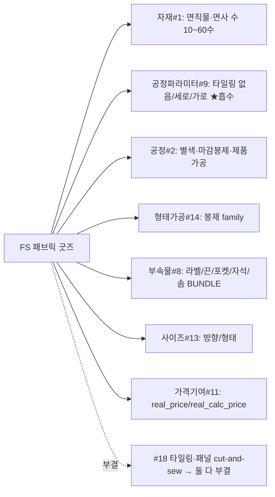

# FS(패브릭·봉제 완제 직물 굿즈 = 면직물 풀프린팅→재단/봉제 완제품) 카테고리 — RP-Meta 파이프라인 요약

> 후니 RP-Meta 하네스. RedPrinting FS(면직물 풀프린팅 후 재단·봉제한 완제 굿즈 — 쿠션·에코백·파우치·스카프·스크런치·코스터·테이블린넨·패브릭 포스터) 카테고리의 역공학→메타모델→갭→deepcheck→검증→codex 교차검증 파이프라인 산출 인덱스.
> **★FS 본질 = 면직물(면사 수) 풀프린팅(단일면 래핑) → 재단·봉제 완제품 · 타일링(반복배치)·마감봉제·완제 부자재 보유 · distinct 0 → 17축 재포화(10번째 카테고리).** FS reverse 1차 예측("타일링 1건 제외 무손실 흡수")을 메타모델/갭/검증이 적대 판정으로 비준 — 유일 신규 후보 타일링과 codex 제기 패널 구성(cut-and-sew) 둘 다 #18 부결, 가장 이질적인 *직물 풀프린팅+봉제 완제 굿즈*조차 17축으로 무손실 흡수. **★형상#17과 정반대 — 형상은 후니 KB G-SK-2 "어느 축에도 없음" 결함이 distinct 강제, 타일링/패널은 후니 KB가 인쇄 배치(`prcs_dtl_opt` jsonb)·봉제(공정#2)·부속물(#8)·디자인입력채널(#16)을 이미 1급 모델링(결함 없음·왜곡 없이 담음).**

## 산출물
- **역공학(reverse):** [`reverse.md`](reverse.md) — 대표 5상품(FSSQPST 패브릭 포스터=패브릭 현수막·real_price·풀슬롯 / FSCUDFT 쿠션=양면봉제·솜 충전 / FSBGECO 에코백=완제 가방·끈/포켓/자석 / FSPUSTR 스트링 파우치 / FSBDSCR 스크런치=소형 봉제 variant) 원자추출 + 횡단 태깅. 나머지 16종(코스터/엽서/노렌/테이블류·커버·파우치/필통·가방·스카프)은 §9에 소재/형태/부자재만 다른 동형으로 묶음(답습 회피). **★전 5상품 레거시 productOrder SSR(vueMarkers=0·라이브 추출 성공·PH 같은 client-render 블로커 없음·주문/POST 0).** Ambiguous fragments FS-1~FS-8.
- **메타모델(02_metamodel):** [`_resolved-fragments.md`](../../02_metamodel/_resolved-fragments.md)(FS v10.0 판정·FS-1~FS-8 + FS-A1) + [`discovered-axes.md`](../../02_metamodel/discovered-axes.md) §FS(facet 9종). **★distinct 승급 0건.** FS facet 흡수: FS-1 타일링→공정파라미터#9(인쇄 배치)·FS-2 방향→사이즈#13·FS-3 면사 수→자재#1(평량/번수·CL oz·AC mm·PD 번수 동형)·FS-4 별색→공정#2+기초코드#6·FS-5 마감봉제/제품가공→공정#2 봉제 family(PD SEW_LTR)+형태가공#14·FS-6 솜/끈/자석→자재#1 sub_mtrl+부속물#8(선택형)·FS-7 가격모델→가격기여#11.
- **★distinct #18 적대검증 (핵심 directive):**
  - **타일링(TILL_WH_GBN: 없음/세로/가로) #18 부결** — ①전용 슬롯 라이브 실재(충족)·②후니 KB 무왜곡 흡수 불가(**불충족**: `t_proc_processes.prcs_dtl_opt` jsonb가 오시/미싱 줄수·코팅 면 enum을 1급 모델링→타일링 enum 동형 흡수). **★HARD 경계: 타일링(고객 입력·등재) ≠ 판걸이수(앱계산 파생·DB 미저장·등재 금지).**
  - **패널 구성(cut-and-sew·codex 제기 강도전) #18 부결** — ①UNOBSERVED(면별 독립 디자인 슬롯 0건·FS=단일 풀프린팅 업로드·쿠션 양면=도수 토글이지 앞/뒤 분리 디자인 아님)·②결함없음(흡수 시 디자인입력채널#16 다중면 facet·CL 인쇄위치 멀티슬롯 선례). PH H-1·PD 봉제 부결과 일관.
- **갭(03_gap):** [`gap-matrix.md`](../../03_gap/gap-matrix.md) §XXIII~XXIV — 후니 라이브 information_schema 직접 SELECT(2026-06-19 read-only). **★FS facet = PASS 3·WEAK 3·GAP 1(기존 #9)·data-gap 2·★신규 vessel-gap 0**(전부 기존 V-1/V-3/V-8 흡수). data-gap: 타일링(공정#2 파라미터#9 미적재·vessel 실재)·면직물 본체 자재(면10~60수 본체행 미적재·round-22 굿즈 본체소재 부재 결함 동근·measure_type=V-3)·완제 부자재(솜/끈/자석·MAT_TYPE.09 봉제부자재 버킷 실재·자재행 0). **FS가 추가하는 vessel-needs = 0건**(V-11·V-12 불변·search-before-mint 10연속 통과).
- **deepcheck(Phase 4.5·codex 발굴):** [`deepcheck.md`](deepcheck.md) — codex(gpt-5.5) 33후보 triage(전부 unverified). 핵심: A-1 패널 구성을 타일링보다 강한 #18 도전으로 제기→metamodel 환류 적대검증→부결(①UNOBSERVED). A-9/A-10 거버넌스(wash-care·섬유혼용률 라벨)=약 후보·codex FTC 인용(미국 규제)=가설·한국 규제+후니 의도 확인 후 판정. 전 후보 unverified.
- **검증(05_validation):** [`mgate-verdict-FS.md`](../../05_validation/mgate-verdict-FS.md) — **M1~M6 전건 GO**·distinct 0 비준·라이브 재실측 7건 일치(prcs_dtl_opt jsonb 15행·MAT_TYPE.09·weight/measure_type 0건·PROC 별색/봉제/열재단·SHAPE/FORM/TILING enum 0건·addons 5/opt_groups 135/items 477)·결함 0. Low 노트 1(opt_groups 134→135 정상 적재 드리프트·판정 무영향).

## ★codex 교차검증 (Phase 6.5·신규 레인 첫 실증)
> codex 교차검증(Phase 6.5): gpt-5.5 독립 판정 **ABSORBED(타일링·패널 둘 다)** · validator distinct 0 부결과 **전건 합의·divergence 0 → 고신뢰 확정**. 원문 [`codex-verdict.md`](codex-verdict.md) · reconcile [`codex-reconcile-FS.md`](../../05_validation/codex-reconcile-FS.md).

- **정체성:** deepcheck(누락 발굴·생성측)와 구분되는 **결론 검증**(우리 M-게이트 판정이 옳은가). rpm-validator(Claude)의 GO·distinct 0 판정을 codex(gpt-5.5)로 독립 재판정 후 reconcile.
- **독립성[HARD] 보존:** codex 프롬프트에 우리 mgate-verdict(GO/NO-GO·부결 라벨) 비노출 + workdir=`categories/FS/`로 격리(05_validation 접근 차단) → 두 모델 합의가 echo 아닌 독립 도출임을 입증. codex가 타일링→공정파라미터#9 흡수처를 우리 라이브 재실측과 독립 지목·"패널을 NEW-AXIS로 했다면 과적합/fabrication"이라며 승격 쪽을 오히려 경고(환각 미발동).
- **가용성:** gpt-5.5 AVAILABLE·foreground 직접 호출 성공. **★preflight 백그라운드 행(hang·exit 144) 우회**: codex-review.sh 내부 preflight를 백그라운드로 부르면 행 → `codex exec -m gpt-5.5 --sandbox read-only --output-last-message` foreground 직접 호출로 우회.

## 시각화 (viz) — 경량 패턴(distinct 0·deferred)
FS는 선별 경량 패턴(distinct 0·신규 그릇 0)이라 codex-image PNG는 deferred. 17축 매핑 텍스트 요약(아래 mermaid·codex outage 무관 텍스트 ground-truth)으로 대체:

## 종단 결론
**FS = 17축 재포화 10번째 카테고리·distinct 0·신규 vessel 0.** M1~M6 GO + codex 교차검증 합의로 고신뢰 확정. 상품 커버리지 누적 ≈ 378/479(79%). FS 진짜 기여: 자재#1에 "면직물·면사 수(평량)" 단위 추가·공정#2에 "마감봉제(edge finish)" family 추가·타일링이라는 반복-배치 차원이 공정파라미터#9에 무왜곡 흡수됨을 검증. data-gap(타일링 적재·면직물 본체 자재·완제 부자재)은 dbmap 적재 트랙·round-22 ④자재 본체소재 부재와 동근.
