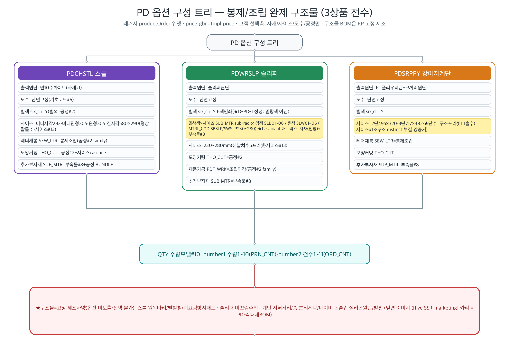
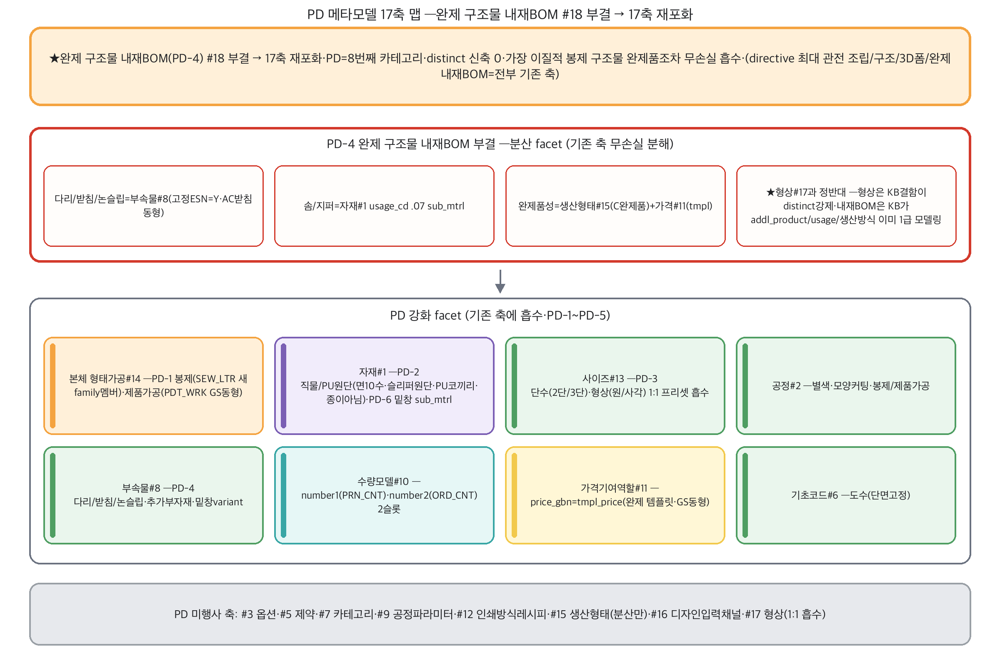
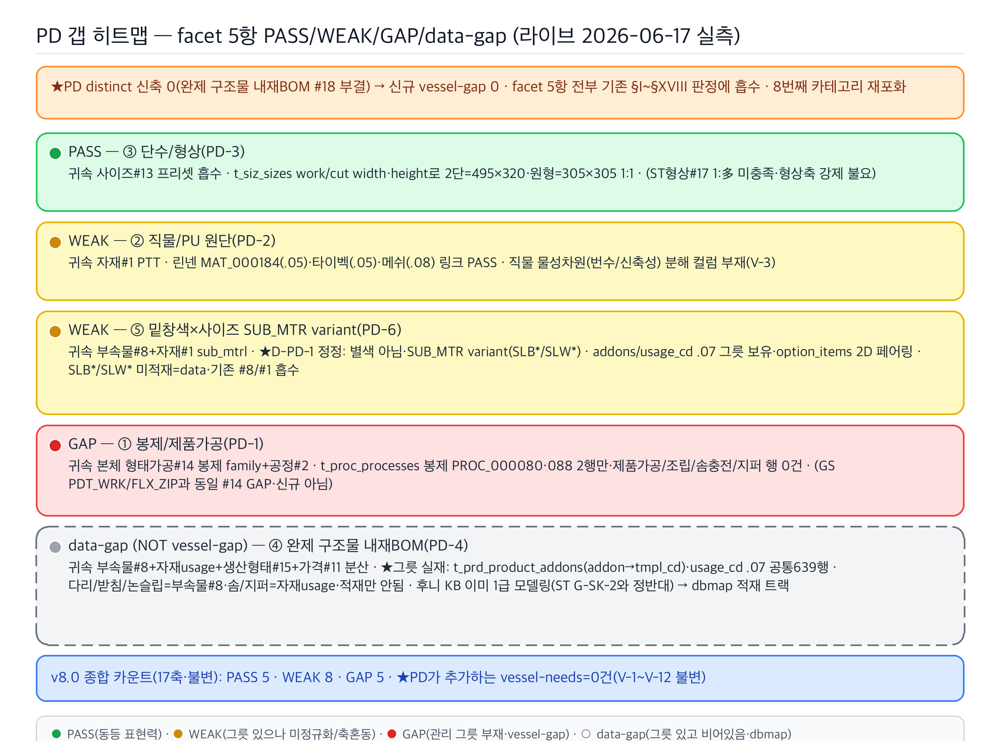
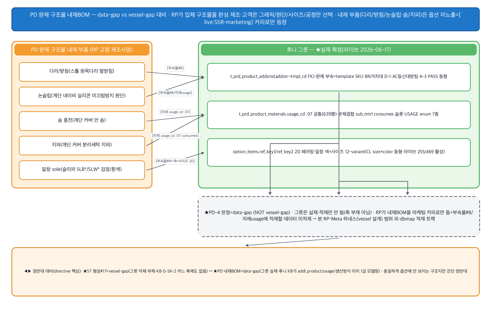

# PD(스툴·슬리퍼·강아지계단 = 봉제 구조물/3D 조립 완제품) 카테고리 — RP-Meta 파이프라인 요약

> 후니 RP-Meta 하네스. RedPrinting PD(봉제/조립 완제 구조물 — 스툴·슬리퍼·반려동물 계단) 카테고리의 역공학→메타모델→갭 파이프라인 산출 인덱스.
> **★PD 본질 = 인쇄 그래픽이 입혀진 봉제/조립 완제 구조물 · 완제 구조물 내재BOM(PD-4) #18 부결(facet) → 17축 재포화(8번째 카테고리·distinct 0).** PD reverse가 1차 예측한 "distinct 0(8번째 재포화)"를 메타모델/갭 단계가 적대 판정으로 비준 — directive 최대 관전(조립·구조·3D폼·완제 내재BOM이 distinct #18인가)이 전건 부결되고, 가장 이질적인 *봉제 구조물 완제품*조차 17축으로 무손실 흡수. **★형상#17과 정반대 — 형상은 후니 KB G-SK-2 "어느 축에도 없음" 결함이 distinct 강제, 완제 내재BOM은 후니 KB가 부속물(addl_product)·자재 usage·생산방식 A/B/C를 이미 1급 모델링(결함 없음·왜곡 없이 담음).**

## 산출물
- **역공학(reverse):** [`reverse.md`](reverse.md) — 대표(전수) 3상품(PDCHSTL 스툴=면10수화이트·형상융합사이즈·레더재봉 / PDWRSLP 슬리퍼=슬리퍼원단·신발치수·★밑창색×사이즈 SUB_MTR 12-variant·제품가공 / PDSRPPY 강아지계단=PU코끼리원단·단수2/3단·논슬립/솜/지퍼) 원자추출 + 횡단 태깅(§4). **★구조물성(다리/받침/바닥재/솜/지퍼/논슬립)=옵션 미노출 RP 고정 제조사양([live:SSR-marketing] 카피로만 등장)·고객 선택축=자재(직물/PU 원단)+사이즈(형상/치수/단수)+도수(단면)+공정(봉제 SEW_LTR/제품가공 PDT_WRK/모양커팅 THO_CUT/추가부자재 SUB_MTR)·price_gbn=tmpl_price.** Ambiguous fragments PD-1~PD-5(+D-PD-1 정정: 슬리퍼 밑창색=six_clr 별색 아님·SUB_MTR 부자재 variant SLB*/SLW*).
- **메타모델(02_metamodel):** [`_resolved-fragments.md`](../../02_metamodel/_resolved-fragments.md)(PD v8.0 판정·PD-1~PD-5) + [`discovered-axes.md`](../../02_metamodel/discovered-axes.md) §PD. **★distinct 승급 0건(완제 구조물 내재BOM PD-4 #18 부결·17축 재포화).** PD-4 분산 facet 분해: ① 다리/받침/논슬립=부속물#8(고정 ESN=Y·AC 받침 동형) ② 솜/지퍼=자재#1 usage_cd .07 sub_mtrl ③ 완제품성=생산형태#15(C 완제품)+가격#11(tmpl). PD-1~PD-5 적대 판정: (PD-1 봉제/제품가공=본체 형태가공#14[GS D-10] 봉제 family 신규 멤버·SEW_LTR 새 멤버·PDT_WRK GS 동형) · (PD-2 직물/PU 원단=자재#1 PTT 차원·AC 아크릴·CL 의류원단 동형) · (PD-3 단수/형상=사이즈#13 프리셋 흡수·2단=495×320 1:1·원형↔305×305 1개=ST 형상 1:多 미충족) · (★PD-4 완제 구조물 내재BOM=#18 부결·분산 facet) · (PD-5 모양커팅/추가부자재 enum=공정#2/부속물#8·infoCall unobserved).
- **갭(03_gap):** [`gap-matrix.md`](../../03_gap/gap-matrix.md) §XIX~XX — 후니 라이브 t_* 대조(2026-06-17 read-only information_schema 직접 SELECT). **★PD facet 5항 = PASS 1·WEAK 2·GAP 1·★data-gap 1·신규 vessel-gap 0**(전부 기존 #1/#8/#13/#14 흡수): 🟢 PASS ③ 단수/형상(PD-3·`t_siz_sizes` work/cut width·height로 2단=495×320·원형=305×305 1:1 프리셋·ST 형상#17 1:多 미충족·형상축 강제 불요) · 🟡 WEAK ② 직물/PU 원단(PD-2·린넨 MAT_000184[.05]/타이벡[.05]/메쉬[.08] 자재행 실재로 링크 PASS·직물 물성차원[번수/신축성] 분해 컬럼 부재·V-3) · 🟡 WEAK ⑤ 밑창색 SUB_MTR variant(PD-6·★별색 아님 D-PD-1 정정·addons/usage_cd .07 그릇 보유·SLB*/SLW* 미적재=data·기존 #8/#1) · 🔴 GAP ① 봉제/제품가공(PD-1·`PROC_000080`·`088` 봉제 2행만·제품가공/조립/솜충전/지퍼 행 0건·기존 #14 본체형태가공 GAP과 동일·GS PDT_WRK/FLX_ZIP) · ⚪ **data-gap ④ 완제 구조물 내재BOM(PD-4·★vessel-gap 아님·`t_prd_product_addons`[addon→tmpl_cd] 그릇·usage_cd .07 공통 639행 슬롯 실재·다리/받침/논슬립=부속물#8·솜/지퍼=자재 usage·적재만 안 됨·축 부재 아님·dbmap 적재 트랙).** v8.0 종합 카운트 **PASS 5·WEAK 8·GAP 5(17축·불변)**. **PD가 추가하는 vessel-needs = 0건**(V-1~V-12 불변).

## 시각화 (viz)

> **renderer: codex-image (gpt-5.5)** — preflight `AVAILABLE model=gpt-5.5` 확인 후 `codex exec -m gpt-5.5 --sandbox workspace-write`로 4종 PNG 병렬 생성(N=4). mermaid `.mmd` 소스도 동시 보유(폴백 안전망·codex outage 시 재사용). 4종 모두 분석 출처 섹션과 1:1 대응(노드/엣지/라벨/색 = 분석이 말한 것·없는 구조 발명 0). PD 핵심 = 완제 구조물 내재BOM #18 부결·17축 재포화(8번째)·★vessel-gap(ST 형상) vs data-gap(PD 내재BOM) 정반대 대비 — 4종 전부 이를 강조.

### 1. 옵션 구성 트리 — `viz/option-tree.png` (소스 `viz/option-tree.mmd`)

PD 3상품(스툴/슬리퍼/강아지계단) 옵션 구성 트리 — 출력원단(면10수/슬리퍼원단/PU코끼리·자재#1) → 도수(단면 고정·기초코드#6) → 별색(six_clr·공정#2) → 사이즈/형상/단수(스툴 미니사각·원형·긴사각 / 슬리퍼 230~280mm / 계단 2단·3단·사이즈#13) → 봉제(SEW_LTR 레더재봉·PDT_WRK 제품가공·공정#2 family) → 모양커팅(THO_CUT·공정#2+cascade) → **★SUB_MTR(슬리퍼 밑창색 검정 SLB*/흰색 SLW* 12-variant·MTRL_COD SBSLP/SWSLP230~280·★별색 아님 D-PD-1 정정·부속물#8)** → 수량모델#10(number1 PRN_CNT·number2 ORD_CNT). **★RED 경고박스: 구조물(원목다리·받침·논슬립·솜·지퍼)=고정 제조사양·옵션 미노출([live:SSR-marketing] 카피=PD-4 내재BOM).** 출처: `reverse.md §0~§3`.

### 2. 메타모델 17축 맵 — `viz/axis-map.png` (소스 `viz/axis-map.mmd`)

PD가 17축 중 어느 축을 강화/미행사하나. **★완제 구조물 내재BOM(PD-4) #18 부결 → 17축 재포화 배너**(PD=8번째·distinct 신축 0·가장 이질적 봉제 구조물 완제품조차 무손실 흡수·형상#17은 KB 결함이 distinct 강제 ↔ 내재BOM은 KB가 addl_product/usage/생산방식 이미 1급 모델링 정반대). PD-4 부결 분산 facet(다리/받침/논슬립=부속물#8·솜/지퍼=자재 usage·완제품성=생산형태#15+가격#11) + PD 강화 facet 8항(형태가공#14 봉제/제품가공·자재#1 직물/PU/밑창·사이즈#13 단수/형상·공정#2 별색/모양커팅/봉제·부속물#8 다리/받침/추가부자재·수량모델#10 2슬롯·가격#11 tmpl·기초코드#6 도수). 회색 = PD 미행사(#3·#5·#7·#9·#12·#15분산만·#16·#17 1:1흡수). 출처: `02_metamodel/discovered-axes.md §PD·_resolved-fragments.md(PD v8.0)·gap §XIX`.

### 3. 갭 히트맵 — `viz/gap-heatmap.png` (소스 `viz/gap-heatmap.mmd`)

PD facet 5항 PASS/WEAK/GAP/data-gap(라이브 2026-06-17 실측). 🟢 **③ 단수/형상 PASS**(`t_siz_sizes` work/cut width·height 1:1 프리셋·ST 형상#17 1:多 미충족·형상축 강제 불요) / 🟡 **② 직물/PU 원단 WEAK**(린넨/타이벡/메쉬 링크 PASS·물성차원 분해 컬럼 부재·V-3) / 🟡 **⑤ 밑창색 SUB_MTR WEAK**(★별색 아님·addons/usage 그릇 보유·SLB*/SLW* 미적재=data·기존 #8/#1) / 🔴 **① 봉제/제품가공 GAP**(봉제 PROC_000080/088 2행만·제품가공/조립/솜충전 행 0건·기존 #14와 동일) / ⚪ **④ 완제 구조물 내재BOM data-gap**(★vessel-gap 아님·addons/usage_cd .07 639행 그릇 실재·적재만 안 됨·dbmap 라우팅). **★신규 vessel-gap 0·facet GAP 1(#1 봉제)은 기존 #14 재확인·PD가 추가하는 vessel-needs 0건.** v8.0 종합 PASS 5·WEAK 8·GAP 5. 출처: `03_gap/gap-matrix.md §XIX~XX`.

### 4. 완제 구조물 내재BOM 다이어그램 — `viz/bom.png` (소스 `viz/bom.mmd`)

PD 완제 구조물 내재BOM의 **★data-gap vs vessel-gap 대비**(directive 핵심) — 내재 부품(다리/받침=부속물#8·논슬립=부속물#8/자재usage·솜/지퍼=자재 usage_cd .07 consumes·밑창 sole=부속물#8+색×사이즈 2D) → 후니 그릇 실재(`t_prd_product_addons` addon→tmpl_cd·`t_prd_product_materials.usage_cd .07` 639행·`option_items.ref_key1/2` 2D 페어링 255/469 활성) → **★PD-4 판정=data-gap(NOT vessel-gap)·그릇은 실재·적재만 안 됨(축 부재 아님)·dbmap 적재 트랙**. **◀▶ 정반대 대비: ★ST 형상#17=vessel-gap(그릇 자체 부재·KB G-SK-2 어느 축에도 없음) ↔ ★PD 내재BOM=data-gap(그릇 실재·후니 KB가 addl_product/usage/생산방식 이미 1급 모델링)** — 동일하게 "옵션에 안 보이는 구조"지만 진단 정반대. 출처: `reverse.md §0.1·§0.5·PD-4 + gap §XIX-1/§XIX-2`.

## 분석 링크
- 역공학: [`reverse.md`](reverse.md)
- 메타모델 판정(PD v8.0): [`../../02_metamodel/_resolved-fragments.md`](../../02_metamodel/_resolved-fragments.md)(PD-1~PD-5) + [`discovered-axes.md`](../../02_metamodel/discovered-axes.md) §PD
- 갭 매트릭스(PD §XIX~XX): [`../../03_gap/gap-matrix.md`](../../03_gap/gap-matrix.md) §XIX~XX
- deepcheck: [`deepcheck.md`](deepcheck.md) ✅ 완료 — codex gpt-5.5 17후보 triage(HIGH5/MED8/LOW4·전건 unverified·채택0). #18 후보 H-1(Construction Spec 축) 제기됐으나 codex 스스로 data-gap vs vessel-gap 프레임 일치로 단정 안 함·기각 예상. 진짜 기여=PD-4 data-gap 적재 attribute 풍부화(inner core 물성·footwear fit·care/safety). (병렬 실행이라 summary 1차 작성[13:48] 시점엔 deepcheck.md[13:50] 미생성 → 본 포인터로 정정.)
