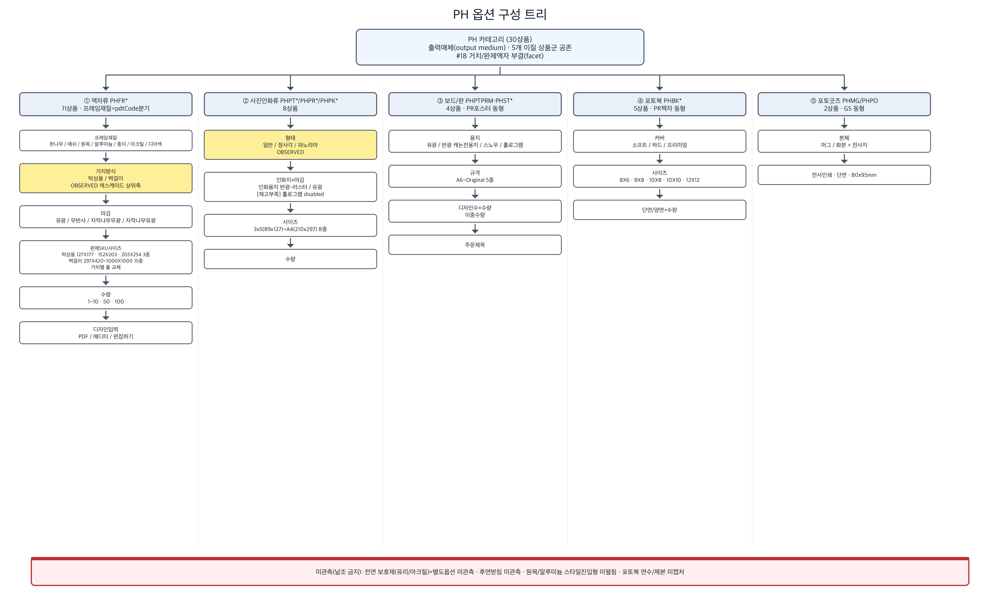
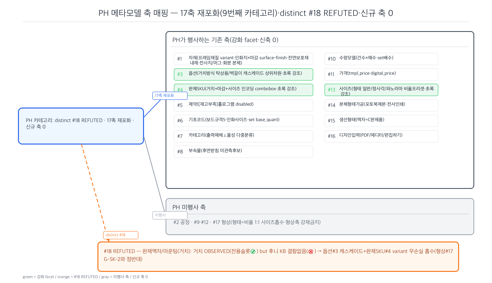
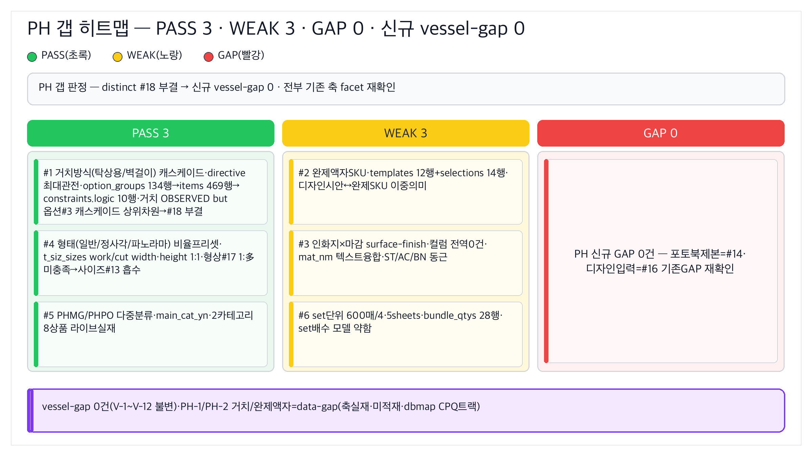
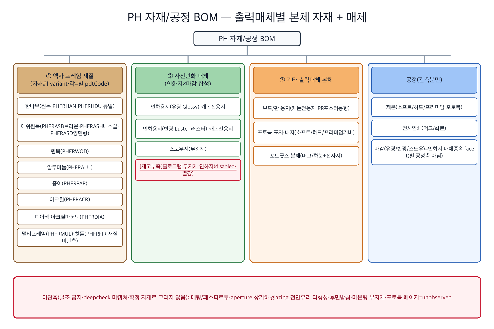

# PH(포토보드·액자·사진인화·포토북·포토굿즈 = 사진을 어떤 물성으로 출력하느냐로 묶인 카테고리) — RP-Meta 파이프라인 요약

> 후니 RP-Meta 하네스. RedPrinting PH(포토보드/액자/사진인화/포토북/포토굿즈 — 한 카테고리에 5개 이질 상품군 공존) 카테고리의 역공학→메타모델 패스 산출 인덱스.
> **★PH 본질 = "사진(이미지)을 어떤 물성(종이/보드/액자/책/머그)으로 출력하느냐"로 묶인 출력매체(output medium) 카테고리 · 완제 액자 그릇/마운팅(PH-1·PH-2) #18 부결(facet/variant) → 17축 재포화(9번째 카테고리·distinct 0).** PH reverse가 1차 예측한 "distinct 0(facet)·미확정(SSR-negative 블로커)"를 **§0.5 client-render 재캡처(gstack browse 2026-06-17)로 블로커 해소 + 메타모델 적대 판정이 비준** — directive 최대 관전(완제 액자 프레임·마운팅/거치·전면 보호재가 distinct #18인가)이 전건 부결되고, "인쇄물 + 별도 프레임 조립"이라는 2-파트 완제 구조조차 17축으로 무손실 흡수.
> **★형상#17과 정반대 — 형상은 후니 KB G-SK-2 "어느 축에도 없음" 결함이 distinct 강제, 마운팅/거치는 OBSERVED(실재)되었으나 옵션 캐스케이드 상위 차원(거치방식 → 완제 SKU variant)으로 구현되고 후니 KB에 "거치/마운팅 어느 축에도 없음" 결함 명시 없음(완제SKU#4·옵션#3·자재#1 variant가 왜곡 없이 담음).**

## distinct #18 verdict — **부결(refuted)·17축 재포화(9번째 카테고리)**

§0.5 client-render 재캡처가 PH 고유 블로커(액자/사진인화 SSR-negative)를 해소하여 1차 예측을 **증거로 강화**. PHFRDIA 디아섹 액자에서 **거치방식(탁상용/벽걸이) = 버튼 토글로 OBSERVED**(미싱데이터 실재)되었으나, 별 신규 메타모델 축이 아니라 **옵션 캐스케이드 상위 차원**(거치방식 → 마감 → 완제 SKU 사이즈 → 수량)으로 구현됨. 거치+마감+사이즈가 **완제 SKU combobox 1개**에 인코딩(AC 두께/소재 variant·GS 완제SKU G-1과 동형 구조 실측).

**HARD 기준 적용 (둘 다 충족해야 승격):**
- ① 전용 슬롯 라이브 실재? → **거치 버튼 토글 OBSERVED**(✅ 충족·미싱데이터 해소).
- ② 후니 KB가 "기존 축이 못 담음" 결함 명시? → **없음**(❌ 불충족) — 거치=옵션#3 캐스케이드 상위 차원 + 완제 SKU variant(완제SKU#4·자재#1)·형상#17의 G-SK-2 같은 KB 결함 부재.
- → **②가 불충족 → distinct #18 부결**(facet/variant 흡수). ST 형상(둘 다 충족·승격)과 결정적 분기.

## 산출물
- **역공학(reverse):** [`reverse.md`](reverse.md) — 5개 이질 상품군(① 액자 PHFR*11·프레임재질=pdtCode 분기 / ② 사진인화 PHPT*/PHPR*/PHPK*8·인화지×마감 / ③ 보드·판 PHPTPRM·PHST*4·PR포스터 동형 / ④ 포토북 PHBK*5·PR책자 동형 / ⑤ 포토굿즈 PHMG/PHPO2·GS 동형) 횡단 태깅 + 대표3(PHPTPRM 포토보드 SSR-legacy 풀·PHPTEDT 사진인화·PHFRDIA 디아섹액자). **★§0.5 client-render 재캡처(gstack browse·블로커 해소)**: PHFRDIA 거치(탁상용/벽걸이) 캐스케이드 OBSERVED·PHPTEDT 인화지×마감 합성+형태(일반/정사각/파노라마) OBSERVED·PHPRDFT [재고부족]홀로그램 disabled OBSERVED. Ambiguous fragments PH-1~PH-5 + 형태축.
- **메타모델(02_metamodel):** [`_resolved-fragments.md`](../../02_metamodel/_resolved-fragments.md)(PH v9.0 판정·PH-1~PH-5+형태축) + [`discovered-axes.md`](../../02_metamodel/discovered-axes.md) §PH + [`metamodel-dictionary.md`](../../02_metamodel/metamodel-dictionary.md) v9.0 + [`metamodel-erd.md`](../../02_metamodel/metamodel-erd.md) PH 노트. **★distinct 승급 0건(완제 액자 그릇/마운팅 PH-1·PH-2 #18 부결·17축 재포화).** PH-1~PH-5 적대 판정 1줄 요약(아래).

## PH-1~PH-5 + 형태축 disposition (각 1줄)

| Fragment | 1차 귀속 축 | 판정 | distinct/facet | vessel/data-gap |
|---|---|---|---|---|
| **PH-1** 완제 프레임=인쇄물 끼우는 빈 그릇 | **완제SKU#4(거치+마감+사이즈 인코딩) + 자재#1 프레임재질 variant + 생산형태#15(C 완제품)** | §0.5 거치/마감/사이즈가 완제 SKU combobox 1개에 인코딩=AC variant·GS 완제SKU(G-1) 동형·후니 KB 결함 없음 | **facet/variant(#18 부결)** ★directive 핵심 | data-gap (완제SKU 그릇 실재) |
| **PH-2** 마운팅/거치·전면 보호재·후면 받침 | **거치=옵션#3 캐스케이드 상위 차원 / 전면 보호재=자재#1 내재(facet) / 후면 받침=부속물#8 후보(미관측)** | 거치(탁상용/벽걸이)=RESOLVED OBSERVED·옵션 캐스케이드로 구현·전면재=마감 facet+디아섹 상품내재·후면받침 별도옵션 미관측 | **facet(#18 부결)** ★거치 RESOLVED | data-gap (옵션#3/자재#1 그릇 실재) |
| **PH-3** 인화지(자재) vs 마감(공정) 경계 | **자재#1 surface-finish facet**(인화지×마감 합성) | §0.5 "인화용지(반광-러스터)/인화용지(유광)" 한 combobox 합성 입증·BN 코팅·AC 글리터/거울 동형·마감=인화지 매체 종속 | **facet (자재#1)** | (자재 합성 차원·V-3 검토) |
| **PH-4** set/sheets 수량(600매·4/5sheets) | **수량모델#10(set 배수) + 완제SKU#4/템플릿(고정 set)·기초코드#6 base_quant** | 600매/4sheets/5sheets=상품명 인코딩 고정 set·GS 텀블러 base_quant 동형·1주문=1 set | **facet(거부)** | (it_g_base_quant 그릇 실재) |
| **PH-5** PHMG/PHPO(머그·화분)=PH vs GS 다중분류 | **카테고리#7 다중분류**(출력매체 PH ⊥ 물성 컵&홀더) | category=PH이나 cate=디지털인쇄>컵&홀더(실측)·GS 코스터 코드접두≠본질 동형·GS 횡단 다중분류 패턴 | **facet (카테고리#7)** | (카테고리 다중분류·정책 결정) |
| **형태축** 일반/정사각/파노라마(PHPTEDT) | **사이즈#13 비율 프리셋 흡수**(형상 1:1) | §0.5 버튼 토글 OBSERVED·일반/정사각/파노라마=인화 비율(aspect ratio) 프리셋·형상↔사이즈 1:1(ST 1:多 미충족·PD-3 동형) | **facet (사이즈#13·형상#17 부결)** ★형상축 강제 금지 | (사이즈 프리셋·기존 그릇) |

## PH 각 축 → 기존 17축 매핑 (강화 facet·신축 0)
- **자재#1** — 프레임재질 variant(한나무/애쉬/원목/알루미늄/종이/아크릴/디아섹·AC 소재 variant 동형)·인화지×마감 surface-finish(PH-3·ST S-4/AC A-2 동형)·전면 보호재 내재(유리/아크릴·디아섹 상품내재 facet)·전사지/머그·화분 본체(GS 동형).
- **옵션#3** — 거치방식(탁상용/벽걸이) 캐스케이드 상위 차원(PH-2·거치 → 마감 → 완제SKU사이즈 → 수량)·인쇄면.
- **완제SKU#4** — 거치+마감+사이즈 인코딩 완제 SKU combobox(PH-1·AC 두께/소재 variant·GS 완제SKU G-1 동형)·고정 set 단위(PH-4 600매/4sheets).
- **제약#5** — [재고부족]홀로그램 disabled(§0.5 PHPRDFT OBSERVED·재고/주문가능 constraint·ST disable·AC 명찰 cascade 동형).
- **기초코드#6** — 보드 규격 5종·인화 사이즈 enum·set base_quant.
- **카테고리#7** — 출력매체(사진굿즈) ⊥ 물성(컵&홀더) 다중분류(PH-5·GS 횡단 동형).
- **부속물#8** — 후면 받침(미관측·AC 받침·BN 거치대 후보).
- **수량모델#10** — 건수×매수 이중 수량(PHPTPRM 디자인수+수량·PR/TP 동형)·set 배수(PH-4).
- **가격#11** — tmpl_price(보드/포토굿즈)·digital_price(포토북·PR책자 동형) 라우팅.
- **사이즈#13** — 형태(일반/정사각/파노라마) 비율 프리셋 흡수(형상 1:1·ST 1:多 미충족·PD-3 동형)·작업/재단 치수 자동표시.
- **본체 형태가공#14** — 포토북 제본(소프트/하드/프리미엄·PR 책자 동형)·머그/화분 전사인쇄.
- **생산형태#15** — 액자=C 완제품(완제 프레임에 인쇄물 끼움 governing·PH-1)·보드/굿즈=완제.
- **디자인입력#16** — PDF/에디터/편집하기(§0.5 PHFRDIA OBSERVED·TP 동형)·koi 에디터(보드).
- **미행사:** #2(공정 — 마감은 자재 facet·포토북 제본은 #14)·#9·#12·#17(형상 — 형태=비율 1:1 사이즈 흡수, 형상축 강제 금지).

## vessel-gap vs data-gap 플래그
- **신규 vessel-gap = 0건** (V-1~V-12 불변). PH 전 fragment가 기존 17축 그릇(완제SKU#4·옵션#3·자재#1·사이즈#13)으로 무손실 흡수.
- **data-gap (그릇 실재·미적재·dbmap 적재 트랙):**
  - PH-1/PH-2 거치 완제 SKU — `t_prd_templates`/완제SKU 그릇 실재, 거치방식 캐스케이드(옵션#3 polymorphic ref)·거치+마감+사이즈 완제 variant 적재만(축 부재 아님).
  - PH-3 인화지×마감 surface-finish — 자재 합성 차원(V-3 점착/내후/surface-finish 합성축 검토·AC/ST 합류, 직물 물성 차원과 동근).
  - PH-4 set base_quant — `it_g_base_quant` 그릇 실재·set 단위 적재.
- **정책 결정(메타모델 판정 아님·갭/실무):** PH-5 출력매체 vs 물성 다중분류(GS G-2 코스터 소재 분리·정책 결정 동형).

## 메타모델 상태: **17축 유지 (재포화·9번째 카테고리·distinct 0)**
PH는 **9번째 종단 카테고리**로 distinct 신축 0 — PR(4)·CL(6)·AC(7)·PD(8) 재포화 패턴 반복. §0.5 client-render 재캡처가 핵심 블로커(거치/마운팅 SSR-negative)를 OBSERVED로 해소했음에도 거치방식이 **옵션 캐스케이드 상위 차원 + 완제 SKU variant**로 구현됨이 실측 확인 → 1차 예측(facet) 강화·#18 부결. "인쇄물을 사후에 끼우는 빈 프레임(2-파트 완제 그릇)"이라는 가장 distinct로 보이던 의미조차 완제SKU#4(거치+마감+사이즈 인코딩)+자재#1(프레임재질 variant)+생산형태#15(C 완제품)로 무손실 분담. 8 카테고리 안정(BN/GS/TP/PR/CL/AC/PD)→ST 1개 승격(형상#17)→4 연속 재포화(CL/AC/PD/PH)로 모델이 증거에 양방향 정직(과잉승격·과소강등 모두 적대 검증).

## deepcheck candidates (codex 외부 second-opinion)
- [`deepcheck.md`](deepcheck.md) — codex(gpt-5.5) 독립 second-opinion: **#18 부결 동의(conditionally)**·후보 16건(HIGH 3·MED 5·LOW 8) 전부 `unverified`·채택 0. ★강한 적대 후보 1건 = **H-1 content-container 합성역할 축**(완제SKU#4가 "인쇄 콘텐츠 ≠ 받는 그릇" 이중성을 담는가)이나 codex 결정 기준("재사용 라이브 슬롯 증거 없으면 부결")이 우리 PH-1 data-gap 판정과 일치. 진짜 기여 = 미캡처 unobserved 재명세(H-2 매팅/패스파르투·H-3 aperture/창 기하·M-4 glazing 다형성·M-6 포토북 페이지) → reverse-engineer 추가 client-render 캡처 표적. validator carry-forward 후보 = H-1·H-2·H-3·M-4·M-6.

## 시각화 (viz)

> rpm-visualizer 산출 — 분석 충실 도해(없는 사실 그리기 금지·미관측은 정직 표기). codex(gpt-5.5) PNG + mermaid `.mmd` 원본. 4종 안정 파일명.

| 다이어그램 | 임베드 | 한줄 캡션 |
|---|---|---|
| 옵션 구성 트리 |  | 5개 이질 상품군(액자/사진인화/보드·판/포토북/포토굿즈) 옵션 캐스케이드 — 액자 거치방식(탁상용/벽걸이)→마감→완제SKU사이즈→수량, 사진인화 형태(일반/정사각/파노라마)→인화지×마감→사이즈 |
| 메타모델 축 매핑 |  | PH가 행사하는 13개 기존 축(자재#1·옵션#3·완제SKU#4·제약#5·기초코드#6·카테고리#7·부속물#8·수량#10·가격#11·사이즈#13·#14·생산형태#15·디자인입력#16) — distinct #18 REFUTED·17축 재포화 |
| 갭 히트맵 |  | PASS 3(거치캐스케이드·형태비율·다중분류) / WEAK 3(완제액자SKU·인화지×마감·set단위) / GAP 0 · 신규 vessel-gap 0 |
| 자재/공정 BOM |  | 액자 프레임 재질(한나무/애쉬/원목/알루미늄/종이/아크릴/디아섹) + 인화지 매체(유광/반광/스노우/홀로그램) + 공정(제본·전사인쇄) · 미관측(매팅/aperture/glazing/후면받침)은 정직 표기 |

> mermaid 원본: [`viz/option-tree.mmd`](viz/option-tree.mmd) · [`viz/axis-map.mmd`](viz/axis-map.mmd) · [`viz/gap-heatmap.mmd`](viz/gap-heatmap.mmd) · [`viz/bom.mmd`](viz/bom.mmd)

## 분석 링크
- 역공학: [`reverse.md`](reverse.md) (특히 §0.5 client-render 재캡처)
- 메타모델 판정(PH v9.0): [`../../02_metamodel/_resolved-fragments.md`](../../02_metamodel/_resolved-fragments.md)(PH-1~PH-5+형태축) + [`discovered-axes.md`](../../02_metamodel/discovered-axes.md) §PH
- 심층보강(deepcheck): [`deepcheck.md`](deepcheck.md) — codex #18 부결 동의·후보 16건 unverified
- 다음 단계: gap(`03_gap/gap-matrix.md` §PH 추가)→deepcheck→vessel→visualize→M1~M6 (rpm-validator)
