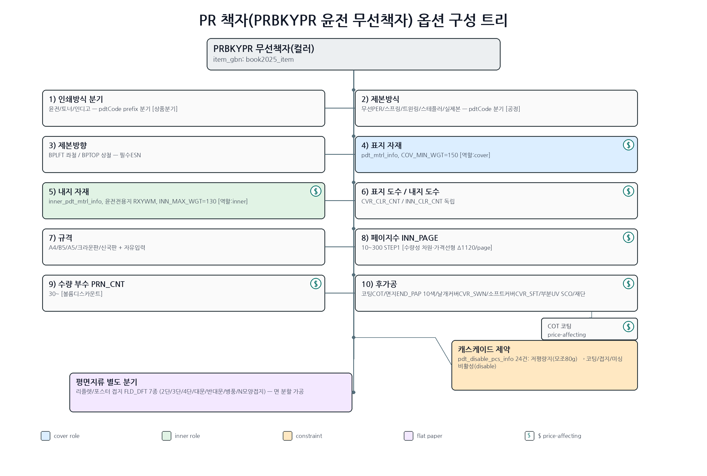
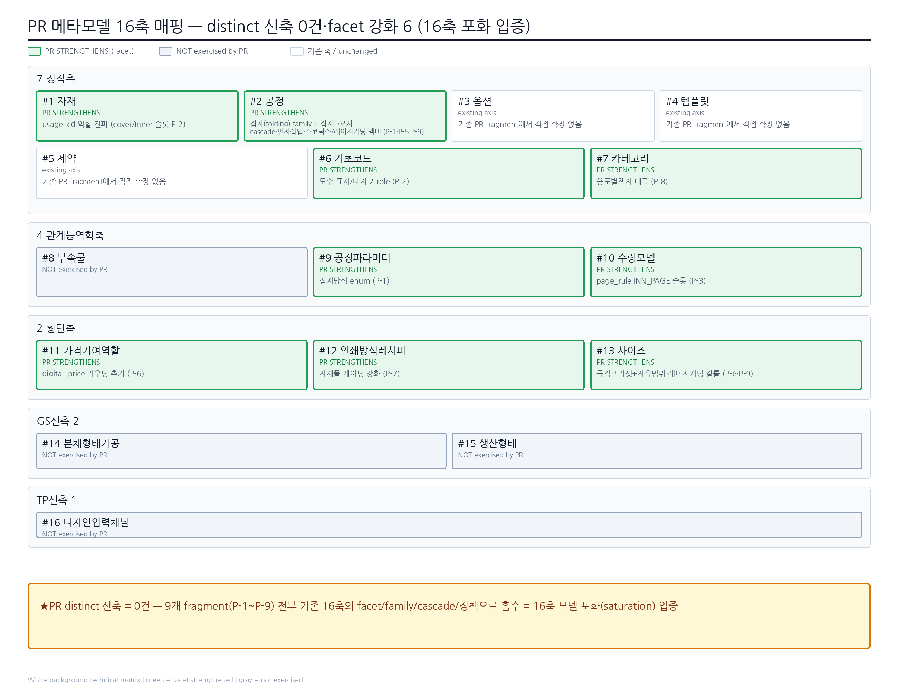
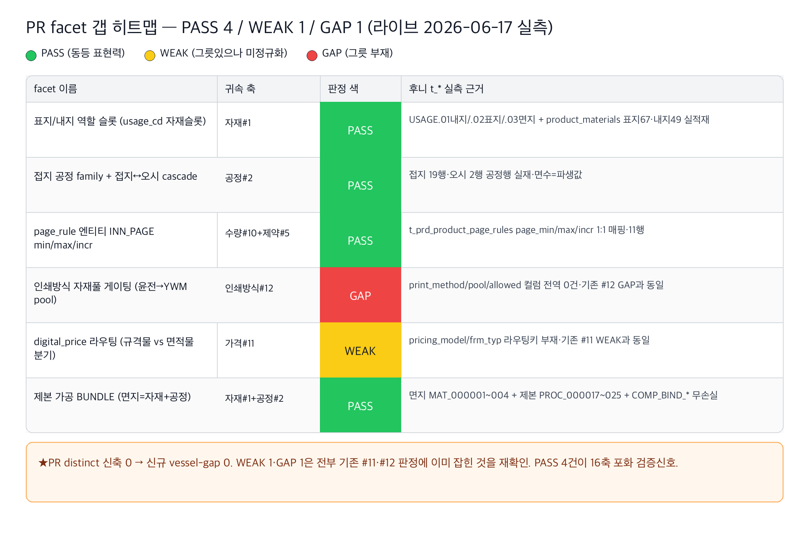
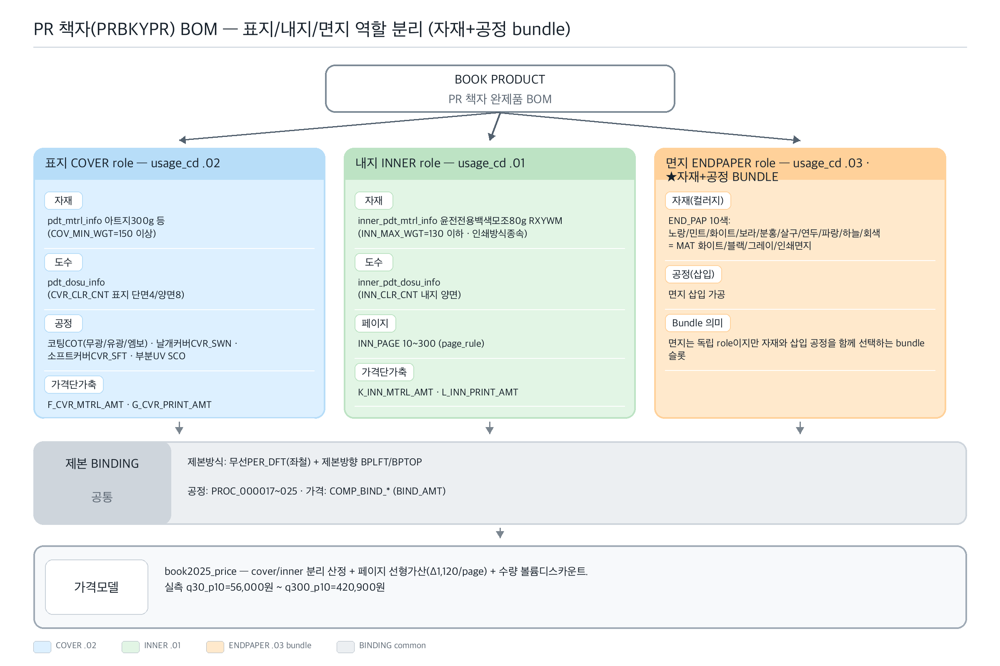

# PR(인쇄물·책자·리플렛·포스터) 카테고리 — RP-Meta 파이프라인 요약

> 후니 RP-Meta 하네스. RedPrinting PR(인쇄물 — 책자/리플렛/전단/포스터/카드/엽서) 카테고리의 역공학→메타모델→갭→그릇 파이프라인 산출 인덱스.
> **★PR 본질 = 다면·제본·접지·인쇄방식 축.** BN(면적·규격 단면)·GS(완제SKU·variant)·TP(디자인입력채널)에서 미발굴된 "다면/제본 레이어"(표지/내지 역할 분리·페이지수 차원)와 "접지(면 분할)"·"인쇄방식 분기"가 PR을 가른다. **그러나 distinct 신축 0건 — 9개 fragment(P-1~P-9) 전부 기존 16축의 facet/family/cascade/정책으로 흡수 = 16축 모델 포화(saturation) 입증.**

## 산출물
- **역공학(reverse):** `reverse.md` — 대표 3상품(PRBKYPR 윤전 무선책자·PRPOXXX 종이 포스터·PRLFXXX 리플렛) 원자추출 + 53상품 그룹 A~F 횡단 태깅. 표지/내지 이중자재·이중도수(`inner_pdt_*` 전용 슬롯)·페이지수(INN_PAGE)·접지(FLD_DFT 7종)·제본방식 5종·인쇄방식 분기(윤전/토너/인디고/리소)·disable 제약 24건. 풀 실측 2(PRBKYPR `[reuse:productInfo]`+가격 8조합·PRPOXXX `[reuse:productInfo]`+가격 3조합)·리플렛은 신규 Vue `[live:SSR-negative]`(접지축은 동형 포스터 FLD_DFT 7종 실측으로 확정).
- **메타모델(02_metamodel):** `_resolved-fragments.md §227~322` (PR 판정 v4.0·P-1~P-9). **distinct 승급 0건** — 9 fragment 전부 facet/family/cascade/정책으로 흡수. PR이 더한 것은 새 축이 아니라 기존 축의 *강화*: ① 공정#2 "접지(folding)" family + 접지↔오시 cascade ② 자재#1 usage_cd "역할 전파"(cover/inner→자재/도수/가격/평량) ③ page_rule 엔티티 정밀(INN_PAGE) ④ 인쇄방식#12 "자재풀 게이팅" 관계 ⑤ 가격#11 digital_price 라우팅(pricing_model 5종) ⑥ 공정#2 멤버(스코딕스 입체UV·레이저커팅·합지). BN+GS+TP+PR 통합 **16축 불변**.
- **갭(03_gap):** `gap-matrix.md §XI~XII` — 후니 라이브 t_* 대조 PR facet 6항 = **PASS 4·WEAK 1·GAP 1**(2026-06-17 read-only information_schema 정밀 실측). distinct 신축 0이므로 **신규 vessel-gap 0** — WEAK 1(digital_price 라우팅)·GAP 1(인쇄방식 자재풀 게이팅)은 전부 기존 #11·#12 판정 재확인. PASS 4(표지/내지 usage 슬롯·접지/제본 공정·page_rule 엔티티·면지 bundle)가 16축 포화 검증신호. v4.0 종합 카운트 **PASS 5·WEAK 8·GAP 4 불변**.
- **그릇(04_vessel):** PR 추가 vessel-needs = **0건** — 전부 기존 V-항목(자재 §1·제약 V-4·가격 V-7·인쇄방식 V-2)에 흡수. PR 통합으로 vessel-needs 신규 항목 없음(BN/GS/TP V-1~V-11 불변).
- **심층보강(deepcheck):** ✅ 실행 완료 — `deepcheck.md`. codex-cli(gpt-5.5·read-only) second-opinion 후보 **20건 + 도메인규칙 10항** triage. distinct 신축 0(16축 포화) 주장에 codex가 17축 후보 제기했으나 검증 후 기각 예상.

## deepcheck 포인터 → `deepcheck.md` (✅ 실행 완료·2026-06-17)
- **상태: ✅ codex-cli(gpt-5.5·`codex exec --sandbox read-only`·stdin pipe) 호출 완료(EXIT=0·10,485 bytes).** PR 분석(reverse 3대표+그룹·16축·P-1~P-9 facet·saturation 주장)을 컨텍스트로 적대적 5문항(17축 hunt/누락 옵션/누락 자재공정/모델 깨는 엣지케이스/도메인 규칙) 발굴.
- **후보 20건 triage:** HIGH 3(H-1 per-section 자재·H-2 서명/대수 17축후보·H-3 교정/승인) · MED 8(M-1~M-8) · LOW/폐기 6(L-1~L-6) + 도메인규칙 10항.
- **17축 후보 결과:** codex가 **H-2 제조구조/대수(signature/section) 축**을 최강 17축 후보로 제기 → **기각 예상**(후니 권위상 임포지션/대수=앱계산·DB미저장·RP PR 스토어프론트 미노출=생산내부). **단 H-1 per-section 자재(섹션별 다른 내지)는 P-2 facet 판정의 정당한 사각**(usage_cd 2슬롯이 N-섹션 미검토)→검증 가치 HIGH.
- **채택 0 — 전부 `unverified` 후보 등재까지.** 라우팅: H-1→gap-analyst+reverse-engineer · H-2→metamodel-architect(앱계산 경계 재확인) · H-3→reverse-engineer · M-5/M-6(결방향·caliper)→자재 분해축(WEAK) 풍부화 · 나머지→기존 축 facet 정밀화. **[HARD] 환각경계:** codex(RP 데이터 무접근)는 *상업인쇄 가능*과 *RP 노출*을 구별 못함 — 1차 검증 질문 = "RP PR 캡처/라이브에 보이는가". 검증 후 살아남는 후보만 메타모델/갭 재진입. validator는 본 목록으로 M-gate "무검증 채택 0" 확인.

## 시각화 (viz)

> **renderer: codex-image (gpt-5.5)** — preflight `AVAILABLE model=gpt-5.5` 확인 후 `codex exec -m gpt-5.5 --sandbox workspace-write`로 4종 PNG 병렬 생성(N=4). 전부 raster 성공(2200~2600px·181~247KB·유효 PNG·한글 정상 렌더). mermaid `.mmd` 소스도 동시 보유(폴백 안전망·codex outage 시 재사용). 4종 모두 분석 출처 섹션과 1:1 대응(노드/엣지/라벨/색 = 분석이 말한 것·없는 구조 발명 0).

### 1. 옵션-구성 트리 — `viz/option-tree.png` (소스 `viz/option-tree.mmd`)

PRBKYPR(윤전 무선책자) 옵션 구성 트리 — 인쇄방식 분기 → 제본방식/방향 → **표지(cover·파랑)/내지(inner·초록) 역할 자재·도수 분리** → 규격 → 페이지수 INN_PAGE → 수량 부수 → 후가공. **★캐스케이드 제약(pdt_disable_pcs_info 24건·저평량지→코팅/접지/미싱 disable)** + 평면지류(리플렛/포스터) 접지 FLD_DFT 7종 별 브랜치. 가격기여 노드 $ 표기. 출처: `reverse.md §0~3·§4`.

### 2. 메타모델 16축 맵 — `viz/axis-map.png` (소스 `viz/axis-map.mmd`)

PR이 16축 중 어느 축을 강화하나(facet). **★PR distinct 신축 = 0건** — 9 fragment(P-1~P-9) 전부 기존 축 흡수. 초록=PR이 강화(자재#1 역할전파·공정#2 접지family·기초코드#6·공정파라미터#9·수량#10 page_rule·가격#11 digital_price·인쇄방식#12 자재풀게이팅·사이즈#13·카테고리#7)·회색=PR 미행사(#4·#8·#14·#15·#16). 하단 배너 = 16축 포화(saturation) 입증. 출처: `02_metamodel/_resolved-fragments.md §227~322(P-1~P-9 판정)`.

### 3. 갭 히트맵 — `viz/gap-heatmap.png` (소스 `viz/gap-heatmap.mmd`)

PR facet 6항 PASS/WEAK/GAP(🟢 4·🟡 1·🔴 1·라이브 2026-06-17 실측). 🟢 표지/내지 usage 슬롯·접지/제본 공정·page_rule 엔티티·면지 bundle / 🟡 digital_price 라우팅(기존 #11) / 🔴 인쇄방식 자재풀 게이팅(기존 #12). **★distinct 신축 0 → 신규 vessel-gap 0·WEAK/GAP은 기존 #11·#12 재확인·PASS 4건이 포화 검증신호.** 출처: `03_gap/gap-matrix.md §XI`.

### 4. 책자 BOM 구조 — `viz/bom.png` (소스 `viz/bom.mmd`)

PRBKYPR 책자 = **표지(cover·usage.02)·내지(inner·usage.01)·면지(endpaper·usage.03 ★자재+공정 BUNDLE) 역할 분리 BOM** + 제본 공통(PROC_000017~025). 각 role의 자재·도수·가격단가축(F_CVR/K_INN 등) 분리. 가격모델 book2025_price(cover/inner 분리 산정 + 페이지 선형가산 Δ1,120/page + 수량 볼륨디스카운트·실측 56,000~420,900원). 출처: `reverse.md §0.1·§2·§5` + `02_metamodel(P-2·P-5)`.

## 분석 링크
- 역공학: [`reverse.md`](reverse.md)
- 메타모델 판정(PR v4.0): [`../../02_metamodel/_resolved-fragments.md`](../../02_metamodel/_resolved-fragments.md) §227~322
- 갭 매트릭스(PR §XI~XII): [`../../03_gap/gap-matrix.md`](../../03_gap/gap-matrix.md) §XI~XII
