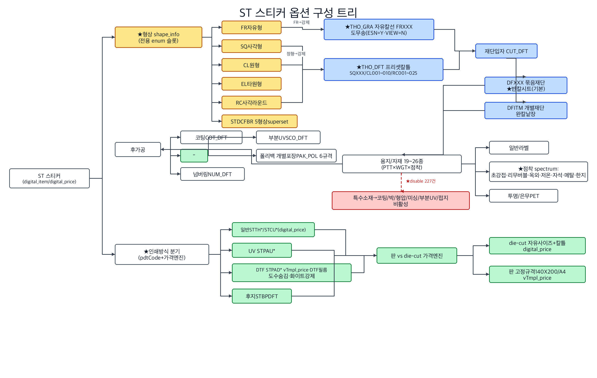
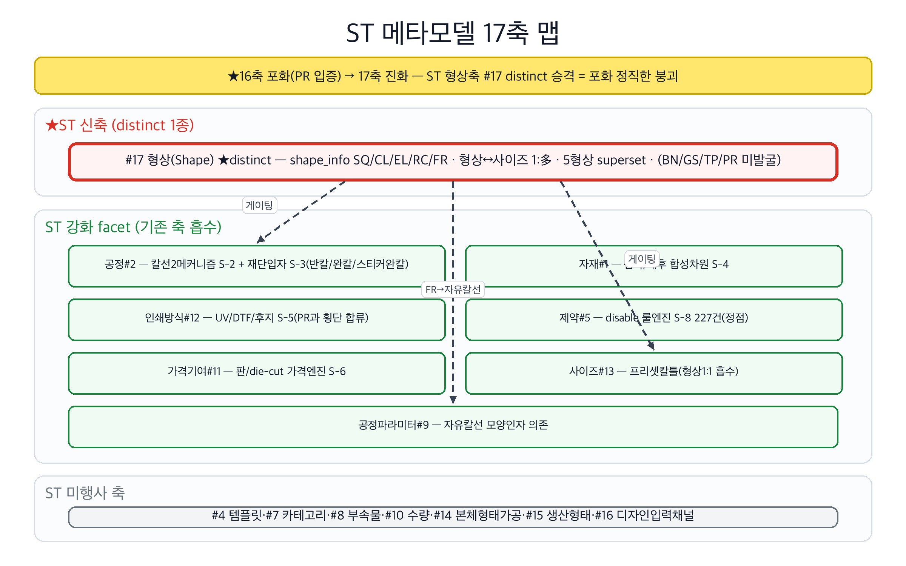
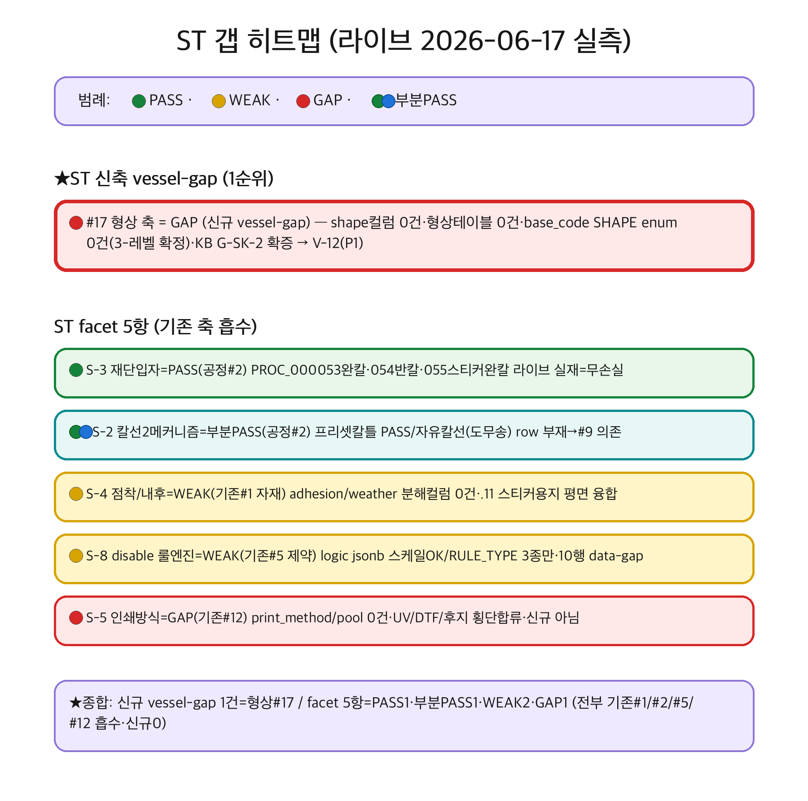
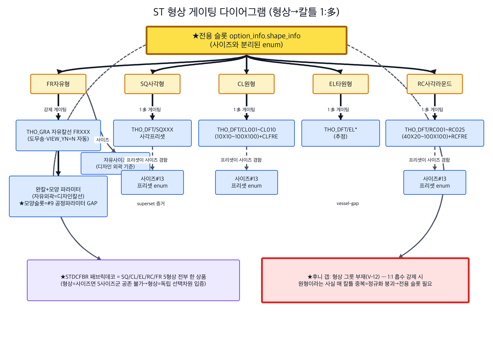

# ST(스티커) 카테고리 — RP-Meta 파이프라인 요약

> 후니 RP-Meta 하네스. RedPrinting ST(스티커 — 자유형/반칼/원형/판/DTF/UV/후지) 카테고리의 역공학→메타모델→갭→그릇 파이프라인 산출 인덱스.
> **★ST 본질 = 형상×칼선×점착소재×인쇄방식 4축 교차.** BN(면적)·GS(완제SKU·variant)·TP(디자인입력채널)·PR(다면/제본/접지)에서 미발굴된 "형상 enum + 칼선 2메커니즘(THO_DFT 프리셋 vs THO_GRA 자유) + 재단입자(반칼/완칼) + 점착소재 분기 + 인쇄방식 분기(UV/DTF/후지)"가 ST를 가른다. **★distinct 신축 1건(#17 형상) — PR이 입증한 16축 포화를 ST가 정직하게 깸 = 17축 진화.** 나머지 9 fragment(S-2~S-10)는 전부 기존 축의 facet/family/cascade로 흡수.

## 산출물
- **역공학(reverse):** `reverse.md` — 대표 3상품(STTHUSR 자유형·STCUXXX 사각반칼·STPADPN DTF판) 원자추출 + 33상품 그룹 A~F 횡단 태깅(풀 실측 8 캡처). 형상 enum(SQ/CL/EL/RC/FR)·칼선 2메커니즘(THO_GRA 자유칼선/THO_DFT 프리셋칼틀 CL001~010·RC001~025)·재단입자(DFXXX 반칼시트/DFITM 완칼낱장)·점착소재 spectrum(19~26종)·인쇄방식 분기(일반/UV/DTF/후지)·판 vs die-cut 가격엔진(digital/vTmpl/tmpl)·disable 227건·PAK_POL 6규격. Ambiguous fragments S-1~S-10.
- **메타모델(02_metamodel):** `_resolved-fragments.md §417~497`(ST 판정 v5.0·S-1~S-10) + `discovered-axes.md D-12`(#17 형상). **★distinct 승급 1건(D-12 형상·#17) = 16축 포화 최초 붕괴.** 4 후보 적대 판정: ① 형상=distinct #17(전용 shape_info 슬롯·형상↔사이즈 1:多·5형상 superset·KB G-SK-2 size축 미수용 확증) ② 칼선 2메커니즘=facet of 공정#2(도무송/완칼/반칼 공정 멤버) ③ 재단입자 반칼/완칼=facet of 공정#2(PROC_053/054/055) ④ 점착/내후=facet of 자재#1(합성 분해축). 7버킷+발굴 = **17 dictionaried 축**.
- **갭(03_gap):** `gap-matrix.md §XIII~XIV` — 후니 라이브 t_* 대조(2026-06-17 read-only information_schema 3-레벨 직접 SELECT). **★#17 형상 = GAP(vessel-gap·신규·1순위)** — shape/outline/die/form_typ 컬럼 0건·형상 테이블 0건·base_code SHAPE enum 0건 → KB G-SK-2 "형상이 어느 축에도 없음" 라이브 확증 = `vessel-needs.md` V-12(P1). **ST facet 5항 = PASS 1·부분PASS 1·WEAK 2·GAP 1**(전부 기존 #1/#2/#5/#12 흡수·신규 vessel-gap 0). v5.0 종합 카운트 **PASS 5·WEAK 8·GAP 5(17축)**.
- **그릇(04_vessel):** ST 추가 vessel-needs = **1건(V-12 형상 그릇)** — 형상 enum·형상→칼틀 게이팅·자유형→자유칼선 강제를 담을 전용 슬롯(단 1:1 흡수 카테고리 BN/GS/TP/PR는 사이즈 프리셋 유지·형상축 전면 강제 금지). facet 5항은 기존 V-항목(자재 §1·제약 V-4·인쇄방식 V-2·공정파라미터)에 흡수.
- **심층보강(deepcheck):** ✅ 완료 — [`deepcheck.md`](deepcheck.md). codex-cli(gpt-5.5) second-opinion 30후보 triage(HIGH 6·MED 11·이미커버 6·환각 3). **★directive 직답: codex 독립 모델도 "#18 distinct 축 없음(no defensible #18 yet)" 확정 — 형상 #17 1종 distinct·칼선/점착/재단/인쇄방식/판 전부 facet 판정에 동의(적대 확인 통과). 형상 #17 적대 반론도 우리 안전장치[1:1 흡수=size 유지]를 독립 재발견 = robustness 입증.** codex 최대 기여=새 축이 아니라 *축 내부 채움 누락*(칼선 geometry 제약 H-3·전사테이프/weeding H-4·돔/에폭시 H-6·security/특수substrate M-6/M-7·컬러관리/registration M-8/M-9). 전 후보 `unverified`·채택 0(verify 후 02/03/04 재진입). watchlist: VDP(H-1·TP REFUTED 동형 예상)·롤사양(H-2).

## 시각화 (viz)

> **renderer: codex-image (gpt-5.5)** — preflight `AVAILABLE model=gpt-5.5` 확인 후 `codex exec -m gpt-5.5 --sandbox workspace-write`로 4종 PNG 병렬 생성(N=4). mermaid `.mmd` 소스도 동시 보유(폴백 안전망·codex outage 시 재사용). 4종 모두 분석 출처 섹션과 1:1 대응(노드/엣지/라벨/색 = 분석이 말한 것·없는 구조 발명 0). ST 핵심 = 형상축 #17 신규(포화 붕괴) — 4종 전부 이를 강조.

### 1. 옵션 구성 트리 — `viz/option-tree.png` (소스 `viz/option-tree.mmd`)

ST 스티커 옵션 구성 트리 — **★형상 shape_info(전용 enum 슬롯·노랑)** → 칼선 2메커니즘(FR→THO_GRA 자유칼선·정형→THO_DFT 프리셋칼틀·파랑) → 재단입자(DFXXX 반칼시트/DFITM 완칼낱장) → 소재(점착 spectrum 19~26종) → 후가공(코팅/$화이트인쇄/넘버링/부분UV/폴리백포장). **★disable 227건**(특수소재→코팅/박/형압/미싱/부분UV/접지 비활성·빨강) + **인쇄방식 분기**(일반/UV/DTF/후지) + **판 vs die-cut 가격엔진**(digital/vTmpl·초록). 출처: `reverse.md §0~3`.

### 2. 메타모델 17축 맵 — `viz/axis-map.png` (소스 `viz/axis-map.mmd`)

ST가 17축 중 어느 축을 강화/추가하나. **★16축 포화 → 17축 진화 배너**(ST 형상축 #17 distinct 승격 = 포화 정직한 붕괴). 빨강 굵은테 = **#17 형상(신규 distinct·BN/GS/TP/PR 미발굴)** · 초록 = ST 강화 facet 7종(공정#2 칼선/재단입자·자재#1 점착·인쇄방식#12 UV/DTF/후지·제약#5 disable 227·가격#11 판/die-cut·사이즈#13 프리셋칼틀·공정파라미터#9 자유칼선) · 회색 = ST 미행사(#4·#7·#8·#10·#14·#15·#16). 형상 #17이 공정#2·사이즈#13·공정파라미터#9를 게이팅. 출처: `02_metamodel/_resolved-fragments.md §417~497(S-1~S-10)·discovered-axes.md D-12`.

### 3. 갭 히트맵 — `viz/gap-heatmap.png` (소스 `viz/gap-heatmap.mmd`)

ST 형상 #17 GAP + facet 5항 PASS/WEAK/GAP(라이브 2026-06-17 실측). 🔴 **#17 형상 = GAP(신규 vessel-gap·1순위·shape 3-레벨 0건·V-12)** / 🟢 S-3 재단입자 PASS(PROC_053/054/055 실재) / 🟢🔵 S-2 칼선 부분PASS(자유칼선 row 부재→#9 의존) / 🟡 S-4 점착 WEAK(기존 #1) · 🟡 S-8 disable WEAK(기존 #5) / 🔴 S-5 인쇄방식 GAP(기존 #12). **★facet 5항 신규 vessel-gap 0 — 전부 기존 #1/#2/#5/#12 흡수·ST 신규 vessel-gap은 형상 #17 단 1건.** 출처: `03_gap/gap-matrix.md §XIII~XIV`.

### 4. 형상 게이팅 다이어그램 — `viz/bom.png` (소스 `viz/bom.mmd`)

형상(shape)이 칼틀(사이즈)·모양 파라미터를 게이팅하는 **1:多 구조** — **★전용 슬롯 option_info.shape_info(노랑)** → 5형상 → FR은 자유칼선(THO_GRA)+완칼 모양 파라미터(#9 GAP), 정형(SQ/CL/EL/RC)은 프리셋칼틀(CL001~010/RC001~025·1:多 게이팅·프리셋이 사이즈 겸함). **STDCFBR 5형상 superset**(형상=사이즈면 5사이즈군 공존 불가→형상=독립 선택 차원 입증·연보라) + **후니 갭 V-12**(1:1 흡수 강제 시 정규화 붕괴→전용 슬롯 필요·빨강). 출처: `reverse.md §0.1~0.2 + discovered-axes.md D-12 + gap §XIII-3`.

## 분석 링크
- 역공학: [`reverse.md`](reverse.md)
- 메타모델 판정(ST v5.0): [`../../02_metamodel/_resolved-fragments.md`](../../02_metamodel/_resolved-fragments.md) §417~497 + [`discovered-axes.md`](../../02_metamodel/discovered-axes.md) D-12
- 갭 매트릭스(ST §XIII~XIV): [`../../03_gap/gap-matrix.md`](../../03_gap/gap-matrix.md) §XIII~XIV
