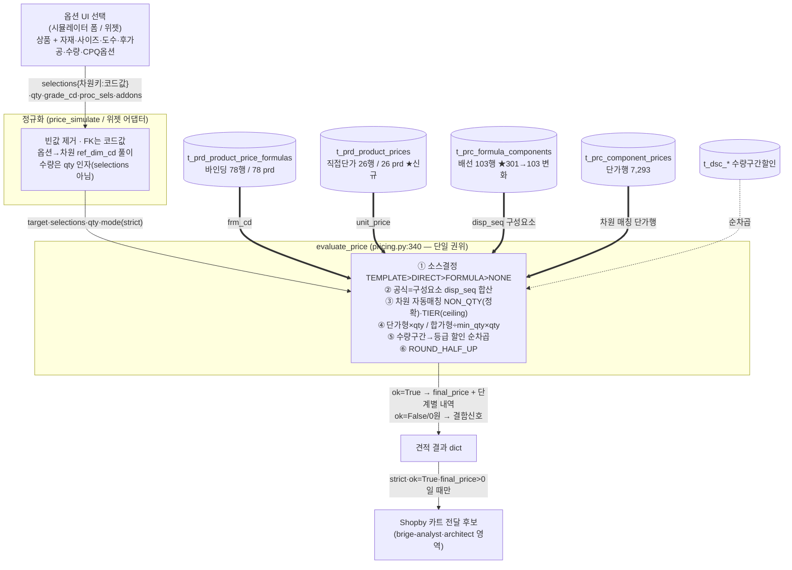

# webadmin-pricecalc-flow.md — 상품+구성요소 선택 → evaluate_price → final_price 흐름

> **토대 ① (Shopby 연동 선행).** 사용자가 상품과 구성요소(자재·사이즈·도수·후가공·수량·CPQ
> 옵션)를 선택하면 `evaluate_price`가 어떻게 `final_price`를 만드는지를 코드 근거로 못박는다.
> Shopby 카트로 보낼 "가격"의 원천이 여기다.
>
> **권위 순서 [HARD]:** ① 라이브 코드(`pricing.py`·`price_views.py` 동작) ② 라이브 스키마/데이터
> ③ 기존 종합 재사용(§13 engine-contract·§14 5장치 — 명제는 유효, 라인번호는 STALE).
> **재사용·재실측:** 새 조사 반복 0. 명제는 §13/§14 재사용, 라인 앵커는 현행 소스로 재확인.
> 작성 2026-06-25 · hsb-foundation-curator. 코드 라인은 현행 `pricing.py`(827줄)·`price_views.py`(1775줄) 기준.

---

## 0. 한 줄 요약

> 위젯/시뮬레이터/주문이 **단일 함수 `evaluate_price`** 하나를 호출한다. 입력 = `target`(prd_cd
> 또는 tmpl_cd) + `selections`(차원키→코드값 dict) + `qty` + `grade_cd` + `proc_sels` + `addons`.
> 엔진은 **가격소스 결정 → 공식=구성요소 합산 → 차원 자동매칭 → 단가형/합가형 환산 → 할인 순차곱
> → 반올림**으로 `final_price`를 만든다. **위젯은 이 계약을 그대로 호출 가능**하다(아래 §4).

---

## 1. 함수 시그니처 (현행 라인 재확인)

```
evaluate_price(target, selections, qty, grade_cd=None, mode="lenient",
               as_of=None, only_comps=None, proc_sels=None)      # pricing.py:340
evaluate_set_price(set_prd_cd, members, set_selections, copies, ...) # pricing.py:718 (셋트 — §6)
```

- `target` = `{"prd_cd":..}` 또는 `{"tmpl_cd":..}` (상품 또는 SKU 템플릿).
- `selections` = `{차원키: 값}` 부분 선택 가능. `qty` int≥1. `grade_cd` 고객등급(None=기준가).
- `mode` = `lenient`(시뮬·구멍발견) / `strict`(실주문·잘못된 0원 차단).
- 반환 dict: `ok·target·qty·as_of·mode·base{source,amount,components,warnings}·discounts[]·final_price·warnings[]·errors[]`.

> **freshness:** §13 engine-contract.md는 `evaluate_price`를 `:247`(570줄 시점)로 인용했으나
> 현행은 **`:340`**(827줄, `evaluate_set_price` 추가로 성장). **명제(E0·P1~P8·C1~C9)는 유효**하나
> 인용 라인은 약 +90~250 드리프트. 인용 시 현행 라인으로 재확인 필요(§foundation-reuse-map 참조).

---

## 2. 가격계산 6단계 흐름

| 단계 | 동작 | 현행 코드 근거 | 핵심 규칙 |
|------|------|---------------|-----------|
| ① 가격소스 결정 | 템플릿단가 → 직접단가 → 공식 → 없음 | `pricing.py:372-440` (`source="TEMPLATE_PRICE"` :389 / `"PRODUCT_PRICE"` :409 / `"FORMULA"` :417 / `"NONE"` :428) | 직접단가 1행이라도 있으면 공식 미발화(오버라이드) |
| ② 공식 = 구성요소 합산 | `t_prc_formula_components`를 `frm_cd`로 disp_seq 순회 | `pricing.py:440-` | **frm_typ_cd·addtn_yn 미참조** — 공식은 항상 전 구성요소 합산(차감 불가) |
| ③ 차원 자동매칭 | 각 구성요소가 selections와 차원 매칭, 매칭행만 포함 | `NON_QTY_DIMS`/`TIER_DIMS` `pricing.py:42-50` | 비수량=정확매칭(NULL=와일드카드)·티어(siz_w/h='이하'상한 ceiling·min_qty='이상'하한) |
| ④ 단가형/합가형 환산 | 단가형=장당가×qty / 합가형=구간총액÷min_qty×qty | `PRICE_TYPE.01/.02` `pricing.py:52-53`, `:189` | 합가형 min_qty NULL/0 → ValueError(견적 붕괴 위험·C3) |
| ⑤ 할인 순차곱 | base 산출 후 수량구간할인 → 등급할인(직전결과 기준) | `DSC_TYPE.01/.02` `pricing.py:54-55`, `:617/:650` | `ok`일 때만·amount≤0 스킵 |
| ⑥ 반올림 | `final_price = round_won(running)` (ROUND_HALF_UP) | `pricing.py` | strict+errors면 `final_price=None`(`ok=False`) |

### 흐름도 (mermaid)



---

## 3. 5장치 역할 요약 (§14 재사용)

| 장치 | 역할 (한 줄) | 책임 차원 | 코드 근거 |
|------|------------|----------|-----------|
| **① 가격공식** `t_prc_price_formulas`(+바인딩 `t_prd_product_price_formulas`) | **값 없는 레시피 헤더** — 상품→구성요소 묶음 진입점. frm_typ 폐기 | (없음·묶음만) | `pricing.py:417,440-` |
| **② 가격구성요소** 마스터 `t_prc_price_components`+배선 `t_prc_formula_components`+단가행 `t_prc_component_prices` | **원자 비용 항목 정의(use_dims·prc_typ) + 차원조합별 실 단가 룩업**(7,293행). ★가격의 모든 차원 책임이 여기 | siz/mat/proc/print_opt/coat/bdl/siz_wh/min_qty/dim_vals | `pricing.py:42-50` |
| **③ 할인테이블** `t_dsc_*` | base 산출 후 **수량구간→등급 순차 후처리**(곱/차감). 가격 구성 아닌 후처리 | 수량구간·등급 | `pricing.py:617,650` |
| **④ 가격뷰어** `price_viewer`·`price_grid`·`price_dup_check`·`price_diagram` | **적재 확인·편집 읽기 UI** — 계산 안 함. 중복검사=ERR_AMBIGUOUS/DUPLICATE 사전진단 | — | `price_views.py:212,741,953` |
| **⑤ 가격시뮬레이터** `price_sim_meta`+`price_simulate`→`evaluate_price` | **선택값+수량→실견적 실행** — 위젯·주문과 동일 단일 알고리즘 호출(자기 로직 없음) | (전부 호출) | `price_views.py:1560,1573` |

> `product_viewer.html`(135줄) = 좌측 상품트리(완/반/기/디/추 유형 배지·셋트 중첩) → 우측 9섹션
> 카드(각 = 1개 `t_prd_product_*` 테이블) + 하단 옵션/제약/SKU 편집 드릴다운. **읽기·편집 UI이며
> 가격을 계산하지 않는다.** 가격 계산은 오직 `price_simulator`→`evaluate_price`.

---

## 4. 위젯/Shopby 호출 가능성 — 판정 [핵심 질문]

**판정: 위젯은 이 계약을 그대로 호출 가능하다.** 옵션선택 → 차원환원 → 단가행 → final_price 경로가
라이브 `price_simulate`(`price_views.py:1573`) 정규화 패턴으로 입증돼 있다(§13 widget-price-contract).

| 계약 | 위젯이 채우는 법 | 근거 |
|------|----------------|------|
| `target` | `{"prd_cd":코드}` 또는 `{"tmpl_cd":SKU}` | `price_views.py:price_simulate` |
| `selections` | 차원키→**코드값** dict(빈값 제거·라벨 금지) | widget-price-contract W-1·W-2 |
| `qty` | int≥1 (수량은 selections 아님·qty 인자) | W-3 |
| `grade_cd` | 로그인 고객등급(비로그인=None=기준가) | W-0 |
| `mode` | **strict 필수**(실주문) — 잘못된 0원 차단 | W-0 |
| 옵션→차원 | option_item의 `ref_dim_cd` 보고 selections/proc_sels 풀이(`OPT_REF_DIM.01~07`) | `price_sim_meta._opt_maps` |
| `proc_sels` | 다중공정 `[{proc_cd,detail:{개수:N}}]` (detail=dim_vals 정확매칭) | W-8·W-9 |
| `addons` | `[{tmpl_cd,qty}]` 각 개별 evaluate → grand_total 합산 | W-10 |

### 위젯/Shopby 호출 시 반드시 지킬 위험지점 (§13 R-1~R-7)

| ID | 위험 | 함의 (Shopby 카트 가격 신뢰) |
|----|------|------------------------------|
| **R-1** | 침묵 0원 — lenient에서 매칭0/소스부재가 ok=True로 0원 | **위젯=strict 필수**. PRICE=0은 항상 결함신호([[huni-widget-red-price-never-zero]]) |
| **R-2** | 옵션 매칭 단위 불일치 — 라이브는 ref_dim으로 차원 풀이 | 위젯/Shopby 매핑이 ref_dim 따라야 매칭 일치 |
| **R-3** | 합가형 min_qty 결손 → ValueError로 견적 붕괴 | 합가형 3종(아크릴 등) 단가행 min_qty 점검 |
| **R-4** | 판별차원 없음 → 옵션 무관 무조건 합산(과청구) | use_dims 비수량차원 단가행 NULL 점검 |
| **R-5** | 사이즈 상한초과 = ERR_ABOVE_MAX(strict여도 비치명·그 comp만 0원) | 면적 본체 0원 별도 검지 |
| **R-6** | 코드값 vs 라벨 — 드롭다운 value가 라벨이면 전부 0원 | value=코드 강제 |
| **R-7** | 위젯은 후니 DB 아닌 **정규화 계약** 의존(어댑터 경계) | selections 키 사전이 Shopby 어댑터 계약 경계 |

> **Shopby 함의:** Shopby 카트로 보낼 "가격"의 원천 = `evaluate_price(strict).final_price` where
> `ok=True and final_price>0`. **위젯이 산출한 final_price를 Shopby 주문옵션 가격으로 그대로 전달**
> 하는 것이 무손실 경로다(서버 권위·클라 캐싱 [[huni-widget-price-strategy]]). 0원/ok=False는
> 카트 전달 차단 신호.

---

## 5. 검증 가능 결정 규칙 (§13 C1~C9 — 게이트 SB2/SB3 재검증용)

| ID | 명제 | 라이브 현황(2026-06-25 재실측) |
|----|------|-------------------------------|
| C1 | 직접단가 0행이면 전 상품 FORMULA로만 평가 | **변화** — 직접단가 26행/26 prd 적재됨(순위2 발화). 나머지는 FORMULA |
| C2 | use_dims 비수량차원 단가행 전부 NULL → 항상매칭(판별불가 갭) | 점검 대상(인스펙터 트랙) |
| C3 | 합가형 단가행 티어선택 min_qty NULL/0 → 견적 ValueError | 합가형 comp 3종 한정 위험 |
| C7 | frm_typ_cd·addtn_yn 엔진 미참조(공식=항상 합산) | 유효 |
| C9 | grade_discount_rates 0행이면 등급할인 경고만 | **유효** — 2026-06-25 재실측 `t_dsc_grade_discount_rates`=0행 |

---

## 6. 셋트상품 가격 (evaluate_set_price — §23 신규 경로)

- `evaluate_set_price`(`pricing.py:718`) = 구성원별 `evaluate_price` 합산 + 셋트 완제품 공식 + 할인.
- 라이브 `t_prd_product_sets` = **28행 / 7 부모상품**(§23 set-product 적재, 2026-06-25 재실측).
- 시뮬 경로 = `price_simulate_set`(`price_views.py:1650`). Shopby 카트로 셋트를 보낼 때 가격 원천.
- ★ §13 base 산출(2026-06-18)에는 셋트 경로 없음 — `evaluate_set_price`는 그 이후 추가. **신규 토대.**

---

## 7. 미상 / open (→ open-questions.md)

- 위젯이 strict 호출 시 라이브 견적이 0원이 아닌 정상값을 반환하는 상품 집합의 실제 비율(§live-db-loaded-state §4 가격사슬 완전성과 연동).
- 옵션→차원 ref_dim 풀이(R-2)가 위젯 어댑터에서 손실 없이 재현되는가(huni-widget 검증 영역).
- Shopby 주문옵션 모델이 후니 `final_price`를 어떤 필드로 수용하는가(commerce-research·architect 영역).
