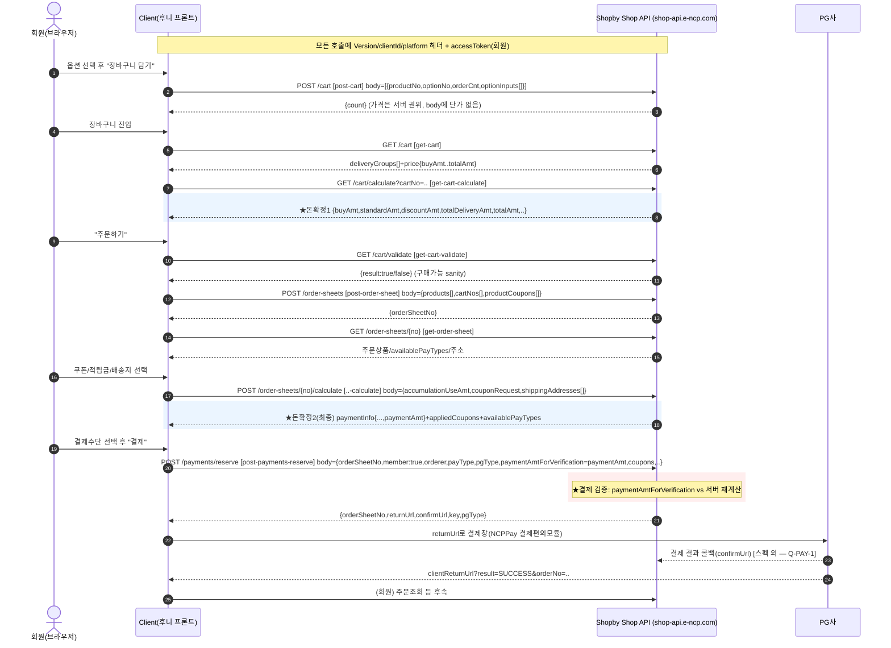
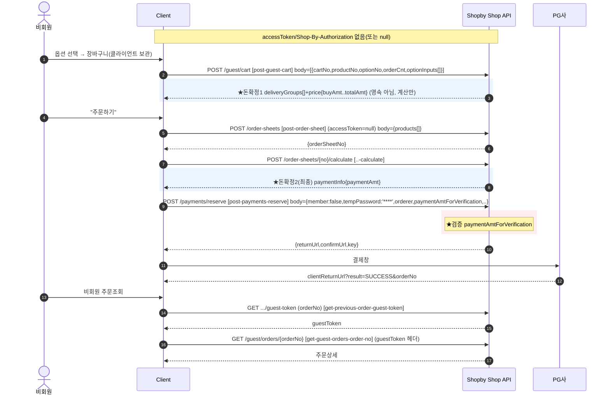

# Shopby Shop API 커머스 흐름 계약 — Cart → OrderSheet → Purchase

> 권위: Shopby OpenAPI 스펙(`docs/shopby/shopby-api/order-shop-public.yml`) 1차 →
> enterprise/docs-complete 문서 보강. 모든 shape 주장에 `스펙: <파일>:<operationId>` 근거.
> 서버: `https://shop-api.e-ncp.com` (스펙: order-shop-public.yml:7 `servers.url`).
> 라이브 읽기전용 — 본 문서는 스펙 추출이며 실제 주문/결제/장바구니 submit을 하지 않았다.

---

## 0. 전 구간 공통 인증 헤더 규약

모든 Cart/OrderSheet/Purchase 오퍼레이션이 동일한 헤더 묶음을 받는다(각 operationId의 `parameters` 블록에서 반복 확인).

| 헤더 | 필수 | 설명 | 근거 |
|------|:---:|------|------|
| `Version` | ✅ | API 버전(`1.0`) | 스펙: order-shop-public.yml:457-463 (get-cart) 외 전 op |
| `clientId` | ✅ | 쇼핑몰 클라이언트 아이디 | 스펙: order-shop-public.yml:464-470 |
| `platform` | ✅ | 클라이언트 플랫폼 (PC, MOBILE_WEB, AOS, IOS) | 스펙: order-shop-public.yml:471-477 |
| `language` | - | 언어 (기본 ko) | 스펙: order-shop-public.yml:478-484 |
| `accessToken` | - | 회원 액세스 토큰(레거시) | 스펙: order-shop-public.yml:485-491 |
| `Shop-By-Authorization` | - | 액세스 토큰(OAuth2, `Bearer <token>`) | 스펙: order-shop-public.yml:492-498 |

- 회원 vs 게스트 분기는 `accessToken`/`Shop-By-Authorization` **존재 여부**로 갈린다. 게스트 경로는 토큰 없이 호출하거나, 비회원 전용 엔드포인트(`/guest/*`)를 쓴다.
- `accessToken`과 `Shop-By-Authorization`은 둘 다 optional이고 상호배타적으로 쓰인다(둘 중 하나로 회원 식별). 상세는 `auth-session-model.md`.

---

## 1. Cart 단계 (회원 장바구니 = 서버 상태)

회원 장바구니는 서버에 영속된다(`cartNo`로 식별). 게스트는 영속 카트가 없고 클라이언트가 라인을 보관 후 계산만 호출한다(§4).

### 1.1 `post-cart` — 장바구니 등록하기 (★핵심 requestBody)

- 스펙: order-shop-public.yml:679 `operationId: post-cart` / `POST /cart`
- requestBody schema: `cart-1115878954` (배열) — 스펙: order-shop-public.yml:32025-32070
- requestBody 항목(배열의 각 원소):

| 필드 | 타입 | 필수 | 의미 | 근거(라인) |
|------|------|:---:|------|------|
| `productNo` | number | ✅ | 상품번호 | 32067-32069 |
| `optionNo` | number | ✅ | 옵션번호 | 32064-32066 |
| `orderCnt` | number | ✅ | 구매개수 | 32043-32045 |
| `optionInputs[]` | array | - | 구매자 입력형 옵션(`inputNo`,`inputLabel`,`inputValue`) | 32046-32063 |
| `baseProductNo` | number(null) | - | 본상품번호(추가상품이면 필수) | 32035-32038 |
| `groupId` | string(null) | - | 장바구니 그룹 아이디 | 32039-32042 |
- 응답: `recurring-payments-cart246616480` = `{"count": <int>}` — 스펙: order-shop-public.yml:738-741
- ★ 후니 브리지 관점: 가격 관련 필드가 **requestBody에 없다**. 라인은 `productNo`+`optionNo`+`orderCnt`로만 식별되며, 가격은 Shopby가 서버측 상품/옵션 마스터에서 권위로 산출한다(임의 단가 주입 불가). `optionInputs`는 구매자 자유입력(텍스트)일 뿐 가격 인자가 아니다.

### 1.2 `put-cart` — 장바구니 수정하기

- 스펙: order-shop-public.yml:615 `operationId: put-cart` / `PUT /cart`
- requestBody schema: `cart1293580171` (배열) — 예시 `[{cartNo, orderCnt, optionInputs[], groupId}]` (스펙: order-shop-public.yml:664-667). 수량/입력옵션 변경.
- 응답: 204 No Content — 스펙: order-shop-public.yml:668-670

### 1.3 `get-cart` — 장바구니 가져오기

- 스펙: order-shop-public.yml:443 `operationId: get-cart` / `GET /cart`
- query: `divideInvalidProducts`(구매불가 분할), `groupId` — 스펙: order-shop-public.yml:444-456
- 응답 schema: `cart-subset592056677`. `deliveryGroups[].orderProducts[].orderProductOptions[]`에 라인별 `price{salePrice,addPrice,immediateDiscountAmt,additionalDiscountAmt,buyAmt,standardAmt}`와 `validInfo`, 최상위 `price{buyAmt,...,totalAmt}` 포함 — 스펙: order-shop-public.yml:507-1128 (예시). ★가격은 응답에서 노출(읽기), 입력에는 없음.

### 1.4 `delete-cart` — 장바구니 삭제하기

- 스펙: order-shop-public.yml:752 `operationId: delete-cart` / `DELETE /cart`
- query: `cartNo`(쉼표구분 리스트, 필수) — 스펙: order-shop-public.yml:754-759
- 응답: `{"count": <int>}` — 스펙: order-shop-public.yml:808-810

### 1.5 `get-cart-calculate` — 선택 상품 금액 계산하기 (★돈 확정 1차)

- 스펙: order-shop-public.yml:820 `operationId: get-cart-calculate` / `GET /cart/calculate`
- query: `cartNo`(선택 라인, 미전달 시 전체 / 빈 값이면 0원), `divideInvalidProducts`, `groupId` — 스펙: order-shop-public.yml:821-839
- 응답 schema: `recurring-payments-cart-calculate582355184` — 스펙: order-shop-public.yml:25490-25529

| 응답 필드 | 의미 | 근거(라인) |
|------|------|------|
| `buyAmt` | 구매금액 합 | 25503-25505 |
| `standardAmt` | 정상금액 (상품판매가+옵션추가금액)×수량 | 25518-25520 |
| `discountAmt` | 할인금액 | 25506-25508 |
| `totalAdditionalDiscountAmt` | 추가할인 합 | 25515-25517 |
| `totalDeliveryAmt` / `totalPrePaidDeliveryAmt` / `totalPayOnDeliveryAmt` | 배송비 합/선불/착불 | 25521-25529 |
| `totalAmt` | 총 구매금액 합(구매금액+선불배송비) | 25509-25511 |
| `accumulationAmtWhenBuyConfirm` | 구매확정 시 적립금 | 25512-25514 |

- ★ **돈 확정 지점(장바구니)**: `cart/calculate`가 서버측 권위 단가로 선택 라인의 금액을 재계산한다. 클라이언트가 보낸 가격은 없고, 모두 Shopby 산출값이다.

### 1.6 `get-cart-validate` — 구매가능 검증 (★결제 전 sanity)

- 스펙: order-shop-public.yml:1138 `operationId: get-cart-validate` / `GET /cart/validate`
- 응답 schema: `cart-validate-1611636330` = `{"result": <bool>}` — 스펙: order-shop-public.yml:1182-1190
- 장바구니 전 상품의 구매 가능 여부를 boolean으로 반환(재고/판매상태 등). 주문서 진입 전 가드.

### 1.7 보조

- `get-cart-count` — `GET /cart/count`, 담긴 개수 — 스펙: order-shop-public.yml:903
- `get-cart-subset` — `GET /cart/subset` — 스펙: order-shop-public.yml:965
- `get-cart-coupons-maximum` — `GET /cart/coupons/maximum`, 최대 할인 쿠폰 — 스펙: order-shop-public.yml:1200

---

## 2. GuestOrder 단계 (비회원)

### 2.1 `post-guest-cart` — 비회원 장바구니 계산하기 (영속 아님)

- 스펙: order-shop-public.yml:1272 `operationId: post-guest-cart` / `POST /guest/cart`
- requestBody schema: `guest-cart337708942` (배열) — 스펙: order-shop-public.yml:32078-32127

| 필드 | 타입 | 필수 | 근거(라인) |
|------|------|:---:|------|
| `cartNo` | number | ✅ | 32082-32086, 32121-32123 |
| `productNo` | number | ✅ | 32124-32126 |
| `optionNo` | number | ✅ | 32118-32120 |
| `orderCnt` | number | ✅ | 32097-32099 |
| `optionInputs[]` | array | - | 32100-32117 |
| `baseProductNo` | number(null) | - | 32089-32092 |
| `channelType` | string(null) | - | 32093-32096 |
- 응답 schema: `guest-cart294369222` — `deliveryGroups[]` + 최상위 `price{buyAmt,...,totalAmt}` (회원 cart와 동형) — 스펙: order-shop-public.yml:1326-1407
- ★ 회원과 차이: 헤더에 `accessToken`/`Shop-By-Authorization`이 **없다**(스펙: order-shop-public.yml:1280-1307 — guest-cart 파라미터에 토큰 헤더 미포함). POST지만 서버에 카트를 영속하지 않고 **금액 계산만** 한다(회원 cart는 GET /cart/calculate, 게스트는 라인을 매번 body로 보냄). `cartNo`는 클라이언트 보관 임시값.

### 2.2 비회원 주문 조회·관리

- `get-guest-orders-order-no` — `GET /guest/orders/{orderNo}`, ★`guestToken` 헤더 필수 — 스펙: order-shop-public.yml:1421 / guestToken 파라미터 order-shop-public.yml:1463 부근(required:true)
- `get-previous-order-guest-token` — `GET .../guest-token`, 주문번호로 guestToken 발급 — 스펙: order-shop-public.yml:5309
- `get-guest-orders-order-no-forgot-password` — 비회원 주문 비밀번호 찾기 — 스펙: order-shop-public.yml:2579
- 비회원 주문은 §4 reserve 시 `member:false` + `tempPassword`로 생성하고, 이후 조회는 `guestToken`(orderNo로 발급)으로 한다.

---

## 3. OrderSheet 단계 (주문서)

### 3.1 `post-order-sheet` — 주문서 작성하기 (★핵심 requestBody)

- 스펙: order-shop-public.yml:3789 `operationId: post-order-sheet` / `POST /order-sheets`
- requestBody schema: `order-sheets-427257668` — 스펙: order-shop-public.yml:21397-21516+
- "주문서 페이지 진입 전 실행. 비회원 주문인 경우 accessToken을 null로 보냄" — 스펙: order-shop-public.yml:3786-3788

| 필드 | 타입 | 필수 | 의미 | 근거(라인) |
|------|------|:---:|------|------|
| `products[]` | array | ✅ | 주문 상품 목록 | 21398-21399, 21432-21435 |
| `products[].productNo` | number | ✅ | 상품번호 | 21436-21439 |
| `products[].optionNo` | number | ✅ | 옵션번호 | 21436-21439 |
| `products[].orderCnt` | number | ✅ | 주문수량 | 21501-21503 |
| `products[].optionInputs[]` | array | - | 소비자 입력형 옵션 | 21504-21516 |
| `products[].baseProductNo` | number(null) | - | 추가상품 본상품번호 | 21489-21492 |
| `products[].recurringPaymentDelivery` | object | ✅ | 정기결제 배송 정보(일반주문도 필수 키, null 허용 필드) | 21440, 21458-21488 |
| `products[].rentalInfos[]` | array | - | 렌탈 정보 | 21443-21457 |
| `productCoupons[]` | array | - | 상품쿠폰(`couponIssueNo`,`mallProductNo`) | 21402-21415 |
| `cartNos[]` | array(null) | - | 장바구니 경유 구매 시 카트번호(완료 시 해당 카트 삭제) | 21420-21427 |
| `trackingKey` | string(null) | - | 쇼핑채널링 추적키 | 21416-21419 |
| `channelType` | string(null) | - | 쇼핑채널링 채널타입 | 21428-21431 |
- 응답 schema: `order-sheets1946220584` = `{"orderSheetNo": "<string>"}` — 스펙: order-shop-public.yml:3850-3854
- ★ **두 진입 경로가 한 엔드포인트로 통합**:
  - 장바구니 경유: `products[]`에 라인을 싣고 `cartNos[]`에 해당 카트번호 → 구매 완료 시 카트 자동 삭제(스펙: 21422-21424).
  - 바로구매(direct): `products[]`만 채우고 `cartNos[]` 비움.
- ★ 게스트도 동일 엔드포인트. accessToken을 null로(헤더 미설정) 보내면 비회원 주문서.

### 3.2 `get-order-sheet` — 주문서 조회하기

- 스펙: order-shop-public.yml:3870 `operationId: get-order-sheet` / `GET /order-sheets/{orderSheetNo}`
- query: `includeMemberAddress` — 스펙: order-shop-public.yml:3878-3883
- 응답에 `availablePayTypes`(결제 가능 수단), 주문상품/배송/금액 정보 포함. reserve의 `payType`/`pgType`은 여기 `availablePayTypes` 참고(스펙: order-shop-public.yml:4700 reserve 설명에 명시).

### 3.3 `post-order-sheets-order-sheet-no-calculate` — 쿠폰·배송지 반영 금액 계산 (★돈 확정 2차, 최종)

- 스펙: order-shop-public.yml:4063 `operationId: post-order-sheets-order-sheet-no-calculate` / `POST /order-sheets/{orderSheetNo}/calculate`
- requestBody schema: `order-sheets-orderSheetNo-calculate177283610` — 스펙: order-shop-public.yml:4119-4149 (예시)
  - `accumulationUseAmt`(적립금 사용액), `couponRequest{cartCouponIssueNo,promotionCode,productCoupons[]}`, `addressRequest`/`shippingAddresses[]`(jibunAddress 입력해야 지역별 추가배송비 계산 — 스펙: order-shop-public.yml:4059), `externalPayTotalAmt`/`externalPayInfos`.
- 응답 schema: `order-sheets-orderSheetNo-calculate-895073402` (필수: `paymentInfo`,`availablePayTypes`,`deliveryGroups`,`appliedCoupons`) — 스펙: order-shop-public.yml:18912-18918
  - `paymentInfo`: `productAmt`,`deliveryAmt`,`remoteDeliveryAmt`,`productCouponAmt`,`cartCouponAmt`,`deliveryCouponAmt`,`usedAccumulationAmt`,`accumulationAmt`,`totalStandardAmt`,`totalImmediateDiscountAmt`,`totalAdditionalDiscountAmt`,`externalPayTotalAmt`,**`paymentAmt`**(최종 결제예정금액) — 스펙: order-shop-public.yml:4159-4167 (예시)
  - `appliedCoupons`(쿠폰 적용 결과), `availablePayTypes`(결제수단), `freeGiftInfos`(사은품)
- ★ **최종 돈 확정 지점**: 쿠폰·적립금·배송지(지역추가배송비)까지 반영한 `paymentAmt`가 결제 직전 권위 금액. 이 값을 reserve의 `paymentAmtForVerification`으로 되돌려 보내 검증한다(§4).

### 3.4 쿠폰 보조

- `get-order-sheets-order-sheet-no-coupons` — `GET .../coupons`, 적용 가능 쿠폰 — 스펙: order-shop-public.yml:4236
- `post-order-sheets-order-sheet-no-coupons-apply` — `POST .../coupons/apply` — 스펙: order-shop-public.yml:4338
- `post-order-sheets-order-sheet-no-coupons-calculate` — `POST .../coupons/calculate` — 스펙: order-shop-public.yml:4489
- `post-order-sheets-order-sheet-no-coupons-maximum` — `POST .../coupons/maximum`, 최대할인 쿠폰 — 스펙: order-shop-public.yml:4596

---

## 4. Purchase / 결제 단계

### 4.1 `post-payments-reserve` — 주문 예약하기 (★핵심 requestBody + 돈 검증)

- 스펙: order-shop-public.yml:4703 `operationId: post-payments-reserve` / `POST /payments/reserve`
- requestBody schema: `payments-reserve-2101669004` — 스펙: order-shop-public.yml:33000-33401+
- 필수(`required`): `clientReturnUrl`, `member`, `orderSheetNo`, `orderer`, `payType`, `pgType`, `saveAddressBook`, `subPayAmt`, `updateMember` — 스펙: order-shop-public.yml:33001-33010

| 필드 | 타입 | 필수 | 의미 | 근거(라인) |
|------|------|:---:|------|------|
| `orderSheetNo` | string | ✅ | 주문서번호(§3.1 산출) | 33255-33257 |
| `member` | boolean | ✅ | 회원 여부 | 33222-33224 |
| `tempPassword` | string(null) | △ | 임시주문비밀번호(**비회원 필수**) | 33241-33244 |
| `orderer` | object | ✅ | 주문자(`ordererName`✅,`ordererContact1`✅,`ordererEmail`,`ordererContact2`) | 33373-33397 |
| `payType` | string(enum) | ✅ | 결제수단(CREDIT_CARD, VIRTUAL_ACCOUNT, NAVER_PAY, KAKAO_PAY, ...) | 33132-33178 |
| `pgType` | string(enum) | ✅ | PG사(KCP, INICIS, TOSS_PAYMENTS, NAVER_PAY, ...) | 33258-33293 |
| `paymentAmtForVerification` | number(null) | △ | **검증을 위한 결제예정금액(적립금사용후)** | 33398-33401 |
| `subPayAmt` | number | ✅ | 보조 결제 금액 | 33009 (required), 정의 33000+579 부근 |
| `coupons` | object | - | `cartCouponIssueNo`,`promotionCode`,`productCoupons[]` | 33185-33217 |
| `shippingAddress` | object | △ | 배송지(`receiverName`,`receiverZipCd`,`receiverAddress`,`countryCd`,...) | 33402-33406+ |
| `useDefaultAddress`/`saveAddressBook`/`useMemberInfo`/`updateMember` | boolean | △/✅ | 주소·회원정보 처리 | 33218-33254 |
| `clientReturnUrl` | string | ✅ | 결제 완료 후 리턴 URL(result=SUCCESS&orderNo / result=FAIL&message) | 33179-33184 |
| `agreementTermsAgrees[]` | array | - | 약관 동의(`termsType`,`isAgree`) | 33347+ |
| `customTermsAgrees[]` | array | - | 추가약관 동의 | 33030-33043 |
| `orderMemo`/`deliveryMemo`/`orderTitle` | string(null) | - | 메모·PG 명세 주문명 | 33060-33063, 33235-33240, 33343-33346 |
| `bankAccountToDeposit`/`remitter`/`applyCashReceipt` | obj/str/bool | - | 무통장 입금 | 33102-33118, 33231-33234, 33294-33297 |
| `appCardInfo`/`extraData`/`clientParams` | object | - | 앱카드·PG 추가정보 | 33064-33101, 33019-33025, 33013-33018 |
| `externalPayInfos[]` | array | - | 외부결제(`externalPayKey`,`payAmt`,`authKey`) | (예시) 33000+786 |
| `freeGiftInfos[]` | array | - | 선택 사은품 | 33298-33324 |
- 응답 schema: `payments-reserve487730185` — 스펙: order-shop-public.yml:14893-14931

| 응답 필드 | 의미 | 근거(라인) |
|------|------|------|
| `orderSheetNo` | 주문서번호 | 14900-14902 |
| `pgType` | PG사 | 14903-14905 |
| `clientReturnUrl` | client 전환 URL | 14910-14912 |
| `returnUrl` | PG사 결제 URL(리다이렉트 대상) | 14924-14927 |
| `confirmUrl` | confirm redirect URL | 14920-14923 |
| `key` | PG 예약 승인 키 | 14928-14931 |
| `extraData` | PG 특수정보 | 14906-14909 |
| `profile` | 결제키 환경(REAL/ALPHA) | 14913-14919 |
- ★ **결제 직전 돈 검증(anti-tamper)**: 클라이언트가 §3.3에서 받은 `paymentInfo.paymentAmt`를 `paymentAmtForVerification`으로 되돌려 보낸다. Shopby가 서버측 재계산값과 비교해 불일치 시 예약을 거절한다(추정 아님 — 필드 설명 "검증을위한 결제예정금액", 스펙: order-shop-public.yml:33398-33401). 단가 자체는 항상 Shopby 권위.

### 4.2 결제 확정(PG 리다이렉트) — 스펙 외 흐름

- reserve 응답의 `returnUrl`/`confirmUrl`로 PG 결제창을 띄우고, 완료 후 `clientReturnUrl`로 `result=SUCCESS&orderNo` 리다이렉트된다(스펙: order-shop-public.yml:33179-33184). reserve가 명시 참조하는 '결제편의모듈/NCPPay script'(스펙: order-shop-public.yml:4698-4702)가 PG 위젯·확정 콜백을 담당한다.
- ★ 본 order-shop 스펙에는 "결제 완료 후 주문 생성/확정" 전용 POST가 없다(grep 결과 confirm은 모두 구매확정=배송 후 단계). 결제 확정은 PG↔Shopby 서버 콜백으로 처리됨 → `open-questions.md` Q-PAY-1.

### 4.3 네이버페이 경로

- `post-payments-naver-ordersheet` — `POST /payments/naver/ordersheet`. requestBody `payments-naver-ordersheet127871417` = `{items[{productNo,optionNo,additionalProductNo,orderCnt,optionInputs[],channelType}], clientReturnUrl, naCo, nvadid, extraData}` (스펙: order-shop-public.yml:4815, 예시 4864-4868). 응답 `text/plain` = 네이버페이 구매 URL `https://test-order.pay.naver.com/customer/buy/{key}/{shopId}` (스펙: order-shop-public.yml:4869-4878).
- `put-payments-naver-validate` — `PUT /payments/naver/validate`, 네이버페이 상품구매 검증 — 스펙: order-shop-public.yml:4888
- `post-payments-naver-wish-list` — `POST /payments/naver/wish-list` — 스펙: order-shop-public.yml:4960
- ★ 네이버페이는 별도 mini-OrderSheet(items 직전달)로, 후니 표준 cart→ordersheet→reserve 경로와 분기. 1차 통합 범위에서는 후순위.

---

## 5. 시퀀스 다이어그램

### 5.1 회원 — 장바구니 경유

### 5.2 게스트(비회원)

---

## 6. 돈 확정 지점 요약 (브리지 설계 핵심)

| 지점 | 엔드포인트 | 역할 | 권위 |
|------|-----------|------|------|
| 돈확정1 (장바구니) | `cart/calculate`(회원) / `guest/cart`(게스트) | 선택 라인의 상품·할인·배송비 합 산출 | Shopby 서버 단가 |
| 돈확정2 (주문서, 최종) | `order-sheets/{no}/calculate` | 쿠폰·적립금·배송지 추가배송비 반영 `paymentAmt` | Shopby 서버 |
| 검증 (결제 직전) | `payments/reserve`의 `paymentAmtForVerification` | 클라 표시금액 vs 서버 재계산 일치 검증 | Shopby 서버(거절권) |

- ★ Shopby는 상품/옵션 가격을 **항상 서버 권위로 재계산**한다. requestBody 어디에도 임의 단가 주입 필드가 없다(post-cart/post-order-sheet/reserve 전수 확인).
- 후니 계산가(위젯 산출 인쇄 견적가) 주입 가능성 = Shopby 옵션 추가금액(`addPrice`)/옵션 마스터를 통한 간접 경로로만 가능하며, requestBody 직접 주입은 불가 → `open-questions.md` Q-PRICE-1(후니 견적가를 Shopby 옵션가에 어떻게 싣는가)이 브리지 핵심 미해결.
