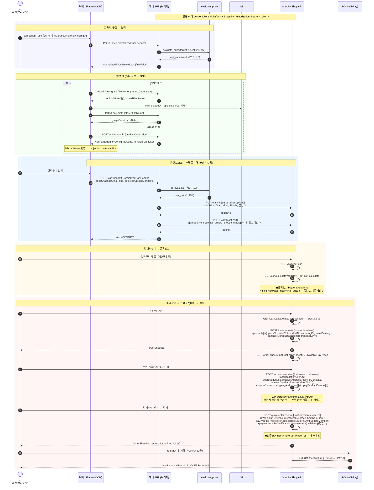
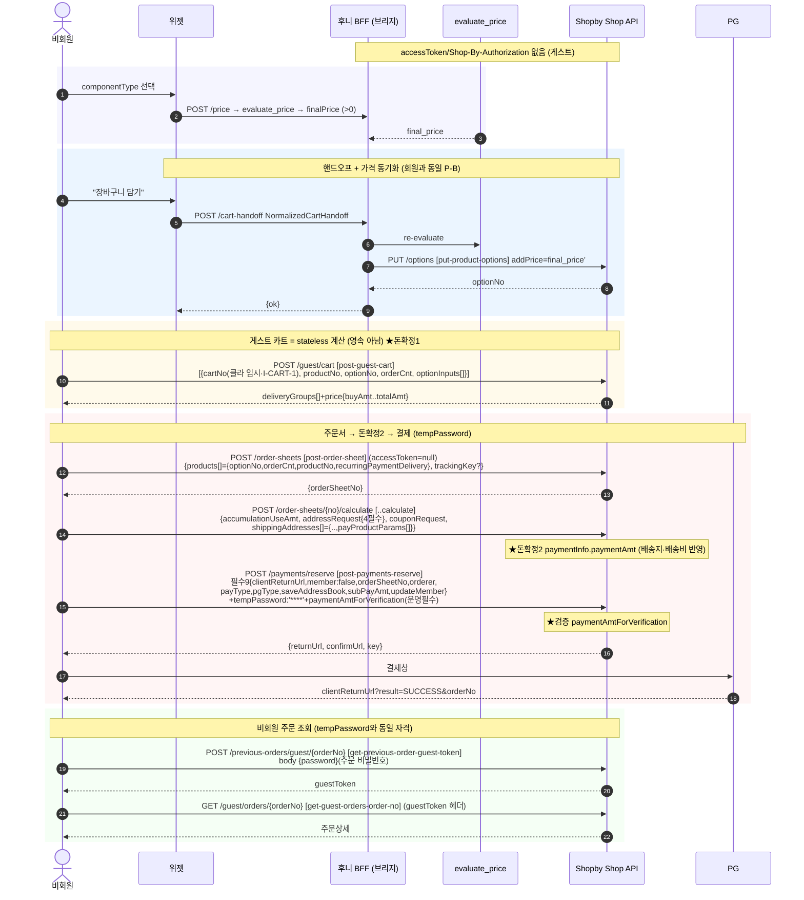
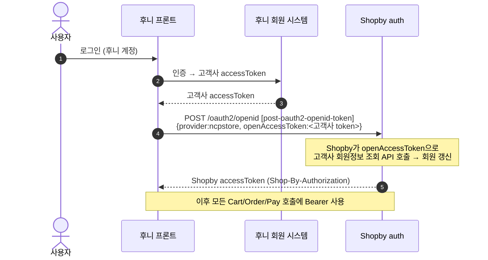

# e2e-sequences.md — 회원/게스트 종단 시퀀스 (operationId 바인딩, dead link 0)

> 산출자: hsb-integration-architect. 작성: 2026-06-25.
> 모든 단계는 `01_research/commerce-flow-contract.md`의 실제 operationId에 바인딩한다(스펙 외 흐름은 명시 표기).
> 권위: Shopby OpenAPI 스펙(`order-shop-public.yml`·auth.mdx) 1차. 입력 팩 밖 엔드포인트 창작 0.
> 가격 권위 정합(addPrice 동기화)은 `integration-architecture.md §4` 참조.

---

## 0. 단계별 operationId 바인딩 표 (dead link 검증)

| # | 단계 | operationId | Method · Path | 입력(이전 출력과 연결) | 출력(다음 입력) | 근거 |
|---|------|-------------|---------------|------------------------|-----------------|------|
| 0 | 위젯 구성·견적 | (BFF) `POST /price` | 후니 BFF | NormalizedPriceRequest | finalPrice | api-contract §2 |
| B | 가격 동기화(D/P-B) | `put-product-options` | `PUT /options`(product-server) | addPrice=final_price | optionNo | product-server:1804, bridge §3.2 P-B |
| 1 | 장바구니 등록(회원) | `post-cart` | `POST /cart` | {productNo, optionNo, orderCnt, optionInputs[]} | {count} | order-shop:679 |
| 1g | 장바구니 계산(게스트) | `post-guest-cart` | `POST /guest/cart` | [{cartNo, productNo, optionNo, orderCnt, optionInputs[]}] | deliveryGroups[]+price | order-shop:1272 |
| 2 | 장바구니 조회(회원) | `get-cart` | `GET /cart` | — | deliveryGroups[]+price | order-shop:443 |
| 3 | 금액 계산 ★돈확정1(회원) | `get-cart-calculate` | `GET /cart/calculate` | cartNo | {buyAmt, totalAmt, ...} | order-shop:820 |
| 4 | 구매가능 검증 | `get-cart-validate` | `GET /cart/validate` | — | {result:bool} | order-shop:1138 |
| 5 | 주문서 작성 | `post-order-sheet` | `POST /order-sheets` | {products[]={optionNo, orderCnt, productNo, **recurringPaymentDelivery**}, cartNos[], productCoupons[], trackingKey?} | {orderSheetNo} | order-shop:3789·products[] required :21436 |
| 6 | 주문서 조회 | `get-order-sheet` | `GET /order-sheets/{orderSheetNo}` | orderSheetNo | availablePayTypes, 주소, 금액 | order-shop:3870 |
| 7 | 금액 계산 ★돈확정2(최종) | `post-order-sheets-order-sheet-no-calculate` | `POST /order-sheets/{orderSheetNo}/calculate` | {accumulationUseAmt, **addressRequest**{receiverAddress, receiverContact1, receiverDetailAddress, receiverZipCd}, couponRequest, shippingAddresses[]={..., payProductParams[]}} | paymentInfo.paymentAmt | order-shop:4063·required :28580·addressRequest :28588 |
| 8 | 주문 예약 ★검증 | `post-payments-reserve` | `POST /payments/reserve` | {**clientReturnUrl, member, orderSheetNo, orderer, payType, pgType, saveAddressBook, subPayAmt, updateMember**}(필수9) + paymentAmtForVerification=paymentAmt(nullable·운영필수) + tempPassword?(게스트) | {returnUrl, confirmUrl, key} | order-shop:4703·required :33000 |
| 9 | PG 결제(스펙 외) | — (NCPPay 결제편의모듈) | returnUrl → PG | reserve 출력 | clientReturnUrl?result=SUCCESS&orderNo | order-shop:33179-33184 (I-PAY-1) |
| 10g | 게스트 주문 토큰 | `get-previous-order-guest-token` | **`POST /previous-orders/guest/{orderNo}`** | path orderNo + body {password}(주문 비밀번호) | guestToken | order-shop:5214 path·5304 post:·5352 {password} |
| 11g | 게스트 주문 조회 | `get-guest-orders-order-no` | `GET /guest/orders/{orderNo}` | guestToken(헤더) | 주문상세 | order-shop:1421 |

> **연결(operationId) 검증**: 각 단계 출력이 다음 입력으로 연결됨(B.optionNo→1.optionNo, 5.orderSheetNo→6/7/8,
> 7.paymentAmt→8.paymentAmtForVerification, 8.returnUrl→9, 9.orderNo→10g, 10g.guestToken→11g). **operationId 연결 0 끊김.**
> **단 필수 필드 갭은 별도 분리**(R-8 정직성): #5 `recurringPaymentDelivery` 일반주문 빈/null shape=**I-OS-1**(갭필),
> #7 `addressRequest`/payProductParams·#8 reserve 필수세트는 본 표에 반영(상기). #9(결제 확정)는 스펙 외 콜백=**I-PAY-1**(모름).
> 즉 "operationId 골격 정합"과 "필드 단위 실현가능성"은 다른 차원 — 골격 끊김 0, 필드 갭은 X07·X08·X09·I-OS-1로 추적.

---

## 1. 회원 종단 시퀀스 (장바구니 경유, 전략 D/P-B 가격 동기화 포함)

---

## 2. 게스트(비회원) 종단 시퀀스 (stateless 카트)

---

## 3. 외부회원 연동(ncpstore) 로그인 시퀀스 (후니 자체 회원 권위 시 — Aurora 근거)

> 근거: `aurora 외부회원_연동 §2`. 고객사 회원정보 조회 API는 1:1 문의로 사전 등록(운영 선결).
> 채택 여부 = 인간 승인(I-AUTH-3). `post-oauth2-openid-token` raw body shape는 갭필 필요(I-AUTH-2).

---

## 4. trackingKey 흐름 (Aurora 추적 가이드 정합)

- 진입 URL에 trackingKey 포함 → **로그인 API query-string** + **주문서 작성 API body**에 추가
  (`aurora 추적_TrackingKey_가이드`).
- 주문서 바인딩: `post-order-sheet.trackingKey`(order-shop:21416-21419, string nullable) — commerce-flow §3.1 정합.
- 캠페인 통계까지 추적(카카오 친구톡·마이앱). 1차 통합에서 선택적.

---

## 5. 자기 점검

- [x] 회원/게스트 양 경로 종단 시퀀스 — 모든 단계 operationId 바인딩(§0 표).
- [x] **operationId 연결 검증(§0 하단)** — 출력→입력 연결 확인, **연결 0 끊김**. 단 "dead link 0"≠"필드 단위
  실현가능"임을 명시(R-8 정직성): 필수 필드 갭은 X07(recurringPaymentDelivery·I-OS-1)·X08(addressRequest)·
  X09(reserve 필수세트)로 분리 추적.
- [x] 가격 동기화(P-B) 단계를 시퀀스에 명시 — addPrice=final_price·salePrice=0(§4.2.1 불변식) → 이중계산 0.
- [x] #7 addressRequest(4필수)+payProductParams·#8 reserve 필수9 + paymentAmtForVerification(nullable·운영필수) 반영.
- [x] #10g guest-token = **POST /previous-orders/guest/{orderNo} + {password}**(method/body 정정, R-7).
- [x] 스펙 외 흐름(#9 결제확정·게스트 cartNo·일반주문 recurringPaymentDelivery shape)은 "모름"
  (I-PAY-1·I-CART-1·I-OS-1)으로 분리, 날조 0.
