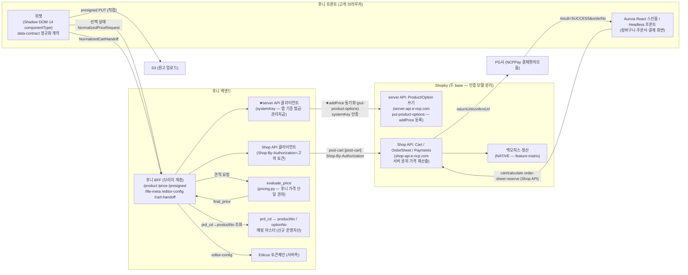
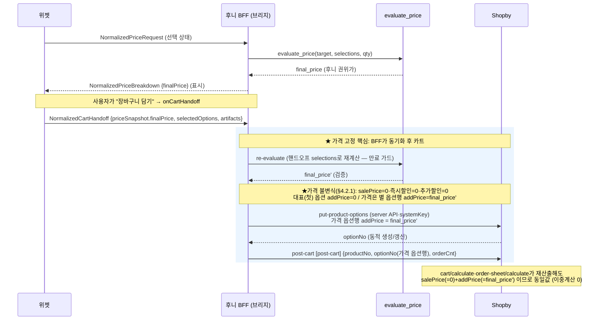

# integration-architecture.md — 위젯→가격엔진→브리지→Shopby→정산 종단 통합 아키텍처

> 산출자: hsb-integration-architect (생성). 작성: 2026-06-25.
> 권위 순서: Shopby OpenAPI 스펙(`docs/shopby/shopby-api/*.yml`) 1차 → enterprise/docs-complete →
> 라이브 갭필(docs.shopby.co.kr, 부족분만). 두 입력 팩(01_research·02_bridge) 밖 엔드포인트/필드 창작 0.
> 미상은 `open-issues.md`로 분리("모름" 명시). 비밀값(clientId·토큰)은 키 이름만, 값 비노출.
> 입력 근거: `01_research/commerce-flow-contract.md`·`auth-session-model.md`,
> `02_bridge/shopby-product-model.md`·`product-price-bridge-spec.md`·`bridge-strategy-options.md`,
> 위젯 계약 `_workspace/huni-widget/03_spec/data-contract.md`·`api-contract.md`,
> Aurora `docs/shopby/aurora-react-skin-guide/`, admin `docs/shopby/admin-analysis/feature-matrix.md`.

---

## 0. 결론 요약 (한 문단)

후니 위젯(componentType 기반 CPQ 선택)이 `evaluate_price`로 후니 권위 견적가를 산출하면, **후니 BFF(브리지 계층)**가
그 계산가를 **Shopby 옵션 가격(`addPrice`)으로 동기화**(server API·systemKey — Shop API와 인증 분리, §1.1)한 뒤
해당 `optionNo`로 Shopby 카트/주문 흐름
(`post-cart`→`cart/calculate`→`post-order-sheet`→`order-sheet/calculate`→`payments/reserve`)을 태운다.
Shopby는 라인에 임의 단가를 받지 못하므로(스펙 사실, `product-price-bridge-spec §3.1`), 계산가가 살아남는
**유일한 길은 "후니 계산가 = Shopby 등록 addPrice, salePrice=0·할인=0" 불변식**(§4.2.1·`shopby-product-model M-PRICE-1`)이다. 본 설계는
**전략 D(혼합)의 실현형 — 노출=카탈로그 동기화(A), 가격=주문 직전 옵션 동적 생성(P-B)**을 권고하되, 그 핵심 관문
(P-B 실시간 정합·정산 권위·동시성)은 인간 승인·라이브 갭필 전 BLOCKED로 명시한다. 인쇄 사양·Edicus/PDF 원고는
가격 효과가 없는 `optionInputs`(텍스트) + 주문 추가정보 채널로 무손실 전달하며, 상품 등록/파일업로드/생산
워크플로우는 admin-analysis가 "CUSTOM 개발"로 분류한 영역과 정합한다.

---

## 1. 시스템 경계도 (위젯 ↔ 가격엔진 ↔ 브리지 ↔ Shopby ↔ 정산)

**경계 책임 분리 [HARD]**

| 계층 | 책임 | 책임 아님 |
|------|------|-----------|
| 위젯 | componentType 선택·사양 스냅샷·원고 핸드오프(`onCartHandoff`) | 가격 계산(서버 권위)·Shopby API 직접 호출(`data-contract §6` UNDECIDED) |
| evaluate_price | 후니 견적가 단일 권위(`final_price`) | Shopby 통신 |
| 후니 BFF (브리지) | 계산가→addPrice 동기화·prd_cd↔productNo 매핑·Edicus 토큰체인·Shopby 카트 라인 조립·**두 API 클라이언트 라우팅(§1.1)** | 가격 산정(엔진 위임)·결제 확정(PG↔Shopby) |
| BFF / Shop API 클라이언트 | 고객 주문 흐름(cart/order-sheet/reserve)을 **고객 토큰(Shop-By-Authorization)** 으로 호출 | 상품/옵션 쓰기(systemKey 필요) |
| BFF / **server API 클라이언트** | **put-product-options(옵션 addPrice 등록/갱신)** 을 **systemKey**(관리자급)로 호출 | 고객 토큰 사용·고객 critical path 직접 점유(§1.1 격리) |
| Shopby Shop API | 라인 가격 서버 재산출·주문서·결제 예약·주문/정산 관리 | 임의 단가 수신(불가, `product-price-bridge-spec §3.1`) |
| 정산(Shopby NATIVE) | 정산·세금계산서·거래명세서(`feature-matrix.md:79-85`) | (정산 권위가 라인가인지 = OQ-4 미상) |

### 1.1 두 인증 클라이언트 분리 [HARD · R-2/X05 보정]

`put-product-options`는 **Shop API(고객)와 다른 server API**다 — 스펙 직접 확인:

| 항목 | server API (put-product-options) | Shop API (cart/order-sheet/reserve) |
|------|----------------------------------|-------------------------------------|
| base url | `server-api.e-ncp.com` (`product-server-public.yml:7`) | `shop-api.e-ncp.com` (`order-shop-public.yml:7`) |
| 인증 헤더 | **`systemKey` (header, required:true)** · `version` (header, required:true) (`product-server-public.yml:put-product-options` :1758·:1789) | `Shop-By-Authorization: Bearer <고객토큰>` (회원) / 무토큰(게스트) |
| 권한 등급 | 앱 기준 발급(관리자급) — 고객 토큰과 무관(`Authorization` required:false :1773) | 고객 세션 권한 |

→ BFF는 **2개 클라이언트로 명시 분리**한다(혼용 금지):
1. **Shop API 클라이언트** — 고객 토큰(Shop-By-Authorization). cart/order-sheet/reserve 전부.
2. **server API 클라이언트** — `systemKey`(+`version`). **put-product-options 전용**.
   - `systemKey`는 `.env.local`/BFF 서버 세션에만 보관(키 이름만 노출, 값·클라이언트·로그·산출물 비노출).
   - 고객 요청마다 관리자급 server 호출이 끼므로 **실패 격리·레이트 제한·동시성 가드**(§4.4·open-issues I-PRICE-1).
   - 그대로 인라인하면 인증 불일치 호출 실패 + 관리자 자격 고객경로 노출 위험 → 분리가 필수.

---

## 2. 브리지 전략 권고 — 전략 D(혼합) 실현형

### 2.1 권고 (트레이드오프 인용 근거)

**권고: 전략 D(혼합) — 노출=카탈로그 정식 동기화(A) + 가격=주문 직전 옵션 동적 생성(P-B) + 사양=텍스트(F5)·메타(F7).**

근거(`bridge-strategy-options.md §2` 5축 표 인용):

| 판정축 | D 점수(표 인용) | 권고 사유 |
|--------|------|-----------|
| ① 스펙 가능성 | ✅ "A의 노출 + P-B의 가격. 스펙 조합으로 성립" | 순수 C(직접 주입)는 ❌ 불가(라인 가격 필드 0건). D만 스펙으로 성립 |
| ② 무손실성 | ✅ "가격 무손실(P-B) + 노출 무손실(A)" | **후니 directive=evaluate_price 단일 권위 보존** → 계산가 무손실이 최우선 판정축 |
| ⑤ 위젯 적합 | ✅ "위젯=가격권위(P-B), Shopby=노출/주문관리" | 위젯 CPQ 자유선택(면적매트릭스·구간형 연속 조합)을 사전 열거 불가 → A 단독(⑤🔴) 탈락 |

**전략 A 단독을 권고하지 않는 이유**(반례 인용): A의 무손실성은 "⚠️ 조합 열거 가능 범위만. CPQ 연속/대규모 조합은
옵션 폭발로 사실상 손실"(`bridge-strategy-options §2 ②A`). 후니 가격은 `engine-contract §9` 면적매트릭스/구간형
연속·매트릭스 → "유한 옵션으로 열거 시 수천~수만 행, 위젯이 만드는 조합을 사전에 다 등록 불가"
(`bridge-strategy-options §3 A`). 따라서 A 단독은 위젯 적합 🔴.

**전략 B/C 단독 탈락**(인용): B="가격 주입 필드 부재로 컨테이너+자유금액이 스펙상 성립 안 함 → 결국 P-B 필요"
(`§3 B`). C="순수 직접주입은 스펙상 불가. 실현은 P-B로 귀결"(`§3 C`).

→ evaluate_price 단일 권위 directive + 위젯 연속 조합 + 라인 가격 필드 부재 = **D/P-B 외 선택지 사실상 없음**
(`bridge-strategy-options §4-4` 명문).

### 2.2 D의 핵심 리스크와 BLOCKED 관문 [HARD]

D는 "가장 강한 무손실+위젯 적합이나 운영/정합 복잡도 최고"(`§3 D`). 채택의 관문 3개는 **갭필·인간 승인 전 BLOCKED**:

1. **P-B 실시간 정합(OQ-3)**: 주문 직전 `put-product-options`로 addPrice=계산가 옵션 즉석 등록 → ① 등록 즉시
   storefront 노출/구매가능 지연 ② 상품심사(judgement, `put-inspection-confirm`) 통과 필요 여부 ③ 잔존 옵션
   청소·동시성 ④ 재고 — **전부 미검증**(`bridge open-questions OQ-3`).
2. **정산 권위(OQ-4)**: 정산이 라인 salePrice/addPrice를 권위로 쓰는지 미상. P-B로 라인가=계산가 일치시키면
   정합되나, 정산 소스 미확인(`OQ-4`).
3. **할인 모델 불일치(OQ-5)**: 후니 final_price는 이미 수량구간·할인 반영된 최종가 → Shopby 할인=0으로 두어야
   이중할인 회피(`OQ-5`). 설계 영역(§4.4 참조).

### 2.3 대안 + 마이그레이션 경로

- **MVP 시작 = 전략 A 부분(고정가·소조합 상품군만)**: CPQ 조합이 유한·열거 가능한 상품군(고정가형·소조합 —
  엽서북/떡메 류 §18 고정가형)은 사전 옵션 동기화(P-A)로 즉시 가능. P-B 관문이 닫히기 전 운영 개시 가능.
  근거: `bridge-strategy-options §4-1` "전자=A, 후자=D/P-B → 상품군별 하이브리드".
- **확장 = 전략 D/P-B(연속·매트릭스형)**: 면적매트릭스/구간형(실사·배너·디지털인쇄)은 P-B 관문 검증 후 전환.
- **마이그레이션 경로**: `A 부분(고정가) → D/P-B(연속형) 확장`. 상품군별 전략 분리(하이브리드)가 권고 형태.
  위젯·data-contract는 무변경(`api-contract §4` 어댑터 전환=위젯 무영향 — 컨버전 키스톤).

### 2.4 상품군별 전략 매핑 (하이브리드)

| 상품군 유형 | 가격 계산방식(근거) | 권고 전략 | 사유 |
|-------------|--------------------|-----------|------|
| 고정가형·소조합 | 고정가(엽서북/떡메 §18) | **A (P-A 사전 동기화)** | 조합 유한·열거 가능 → 무손실 |
| 연속·매트릭스형 | 면적매트릭스·구간형(`engine-contract §9`) | **D (P-B 직전 동적 생성)** | 조합 폭발 → 사전 등록 불가 |
| 세트상품(부품조립) | `evaluate_set_price`(pricing.py:718) | **D (P-B)** | 구성원 합산가 동적 → 직전 동기화 |

> ★ 전략 분리는 위젯·BFF 정규화 계약 무변경(어댑터 내부 선택). gate(SB2)가 상품군별 무손실·계산가 생존 재검증.

---

## 3. 인증·세션 모델 (회원/게스트 + 운영방식 분기)

### 3.1 Aurora 운영방식 2분기 (프런트 접점 경계) [선결 결정]

Aurora 가이드는 몰 운영방식을 **스킨몰 vs headless**로 나눈다(`aurora index.mdx`). 후니는 인쇄 CPQ 위젯·커스텀
주문 흐름이 필수이므로 **headless(또는 스킨 위 광범위 커스텀)** 가 적합 후보 — 단 최종 운영방식 결정은 인간 승인
(open-issues I-AUTH-1). 근거: index.mdx "headless몰은 [API 문서] 확인하여 스킨개발 진행이 필요".

| 운영방식 | 프런트 | 인증 처리 | 후니 적합도 |
|----------|--------|-----------|-------------|
| 스킨몰(Aurora) | `@shopby/react-components` + `fetchHttpRequest` 유틸이 OAuth2 자동 처리(`외부회원_연동 §2`) | 스킨 제공 유틸 | CPQ 위젯 임베드·커스텀 주문 흐름 제약 가능 |
| Headless | 후니 자체 프론트가 Shop API 직접 | 후니가 토큰 직접 관리 | CPQ·생산 워크플로우 커스텀 자유도 ↑ |

### 3.2 회원 인증 (OAuth2 권장)

`auth-session-model §3.1` 근거:

- 토큰 발급(로그인): `POST /oauth2` [`post-oauth2-token`] (auth.mdx:629-633).
- 갱신: `PUT /oauth2` (`Shop-By-Authorization`+`Refresh-Token` 헤더) [`put-oauth2-token`].
- 로그아웃: `DELETE /oauth2` [`delete-oauth2-token`].
- 호출 헤더: `Shop-By-Authorization: Bearer <token>`(신규 권장) — 레거시 `accessToken` 대신
  (`auth-session-model §1`, member.mdx:169-171).
- ★ `post-oauth2-token` requestBody(아이디/비밀번호) shape는 본 레포 yml에 없음 → open-issues I-AUTH-2(=Q-AUTH-1).

### 3.3 외부회원 연동 (후니 자체 회원 시스템 보유 시) [Aurora 근거]

후니가 자체 회원 DB를 권위로 두면 **ncpstore provider 외부회원 연동**으로 Shopby 토큰을 발급한다
(`aurora 외부회원_연동 §2`):

- `POST /oauth2/openid` [`post-oauth2-openid-token`], `provider: ncpstore`, `openAccessToken: <고객사 토큰>`.
- Shopby 서버가 `openAccessToken`으로 고객사 회원정보 조회 API 호출 → Shopby 회원 갱신 → 토큰 발급.
- 고객사 회원정보 조회 API 등록은 1:1 문의로 사전 등록 필요(운영 선결).
- ★ 이 경로 채택 여부 = 인간 승인(후니 회원 권위를 어디 둘지). open-issues I-AUTH-3.

### 3.4 게스트(비회원) 세션

`auth-session-model §4` 근거:

- 장바구니: 토큰 없이 `POST /guest/cart` [`post-guest-cart`] — 서버 영속 안 함(매 호출 라인 body 전달).
  `cartNo`는 클라이언트 임시값(출처 미상 = open-issues I-CART-1 / Q-CART-1).
- 주문서: `POST /order-sheets` [`post-order-sheet`]를 accessToken=null로 호출(order-shop:3787).
- 결제: `POST /payments/reserve` [`post-payments-reserve`] `member:false` + `tempPassword`(비회원 필수, :33241-33244).
- 주문 조회: `GET .../guest-token` [`get-previous-order-guest-token`]로 guestToken 발급 →
  `GET /guest/orders/{orderNo}` [`get-guest-orders-order-no`] (guestToken 헤더 필수).

### 3.5 비밀값 보관 [HARD]

- `clientId`(몰 식별 비밀값)·토큰·refreshToken은 `.env.local` 또는 후니 BFF/서버 세션에 보관, 클라이언트 노출 최소.
- 위젯은 인증 메커니즘에 결합하지 않음(`api-contract §0` — `credentials:'include'` 쿠키 위임, 토큰 필요 시 BFF 발급).
- base URL: order 서비스 `shop-api.e-ncp.com`(order-shop:7), auth/member docs `shop-api.shopby.co.kr`(auth.mdx:18).
  단 외부회원 연동 `oauth2/openid` 호출은 `shop-api.e-ncp.com`로 표기됨(aurora 외부회원_연동:72). 두 도메인
  차이(별칭/환경) 잔존 미상 = open-issues I-ENV-1(=Q-ENV-1).

---

## 4. 가격 권위 정합 — evaluate_price 단일 권위 주입·고정 [HARD]

### 4.1 핵심 사실 (스펙 인용, 추정 0)

- Shopby 라인 가격 입력 필드 **없음**: `post-cart`/`post-order-sheet`/`calculate` 3개 쓰기·계산 엔드포인트 모두
  productNo+optionNo+orderCnt만(`product-price-bridge-spec §3.1`, M-RECOMPUTE-1). 6개 yml 전수 검색
  `customPrice`·`orderPrice`·`priceOverride` 0건.
- 라인가 = 서버가 항상 `salePrice + addPrice (− 즉시/추가할인)` 재산출(`shopby-product-model §6` M-PRICE-1,
  product-shop:3816-3833).
- addPrice 등록(쓰기)은 **고객 Shop API가 아니라 server API(`put-product-options`·systemKey, §1.1)** 로만 가능 —
  인증 모델이 다름(R-2/X05).
- → **계산가 생존 유일 조건 = "후니 final_price = Shopby 등록 addPrice, salePrice=0"** (§4.2.1 불변식,
  `product-price-bridge-spec §3.2`).

### 4.2 권위 주입·고정 메커니즘 (전략 D/P-B)

### 4.2.1 가격 불변식 [HARD · R-1/X03 보정 — 돈크리티컬]

`addPrice = final_price`가 **과금 정합하려면 아래 불변식이 동시에 성립해야 한다**. 근거: 옵션상품 구매가 =
`salePrice × (1 − 즉시할인율) + addPrice`(`product-shop-public.yml` get-products-related-products description, 게이트
직접 확인). 즉시할인이 salePrice에만 적용되는 비대칭이 있어 salePrice≠0이면 환산이 복잡·오류 위험.

| 불변식 | 값 | 근거 |
|--------|----|------|
| `salePrice` (대표상품/컨테이너) | **0 고정** | salePrice≠0이면 `salePrice+addPrice ≠ final_price` → 과금 오류 |
| 즉시할인율 | **0** | salePrice에만 적용되는 비대칭 제거(라인 할인 전부 0, OQ-5) |
| 추가할인 | **0** | 이중할인 회피(후니 final_price가 이미 최종가) |
| 가격 = `addPrice` 한 곳에만 | `addPrice = final_price'` | 라인 가격 입력 필드 부재(X02)로 등록가 동기화가 유일 생존 경로 |
| **대표(첫) 옵션 addPrice** | **0 강제** | "첫 옵션가는 반드시 추가금이 0"(`product-server-public.yml:9504,11646,13273,14567,16495` 5곳) → 가격은 **별 옵션행**으로 생성(첫 옵션과 분리) |

- **구조 결론**: P-B 동적 가격은 **첫(대표) 옵션과 별개의 옵션행**(`order≥2`, addPrice=final_price')으로 만든다.
  첫 옵션 addPrice=0 제약과 충돌하지 않게 분리(`put-product-options.options[]` 다중 행, X04 shape 참조 widget-cart-contract §4).
- **대안(salePrice 보존 필요 시)**: `addPrice = final_price − salePrice×(1−즉시할인율)` 환산식 — 단 즉시할인 비대칭
  때문에 권장하지 않음(salePrice=0 고정이 단순·안전).
- **검증 게이트**: 재게이트 SB2 골든 e2e에서 **최종 청구액 = final_price**(cart/calculate·order-sheet/calculate
  재산출 동일값 + 배송지 반영 후 paymentInfo.paymentAmt) 확인. 라이브 evaluate_price 실호출은 §6 위임(I-VERIFY-1).

- **주입**: BFF가 `put-product-options`(**server API·systemKey, §1.1**)로 `addPrice = final_price`(후니 권위가)인
  **가격 옵션행**을 등록/갱신(`product-server-public.yml:put-product-options` :1756, addPrice 등록 가능, P-B 경로).
- **고정**: 카트 라인은 그 `optionNo`(가격 옵션행)만 참조 → `cart/calculate`·`order-sheet/calculate`가 재산출해도
  `salePrice(=0) + addPrice(=final_price')` = final_price 로 **동일값**(이중계산 0, `product-price-bridge-spec §3.3`).
- **검증(anti-tamper)**: `order-sheet/calculate` 응답 `paymentInfo.paymentAmt`를 reserve의
  `paymentAmtForVerification`으로 되돌려 검증(commerce-flow §4.1, order-shop:33398-33400 nullable이나 운영규칙상 항상 전송 — §4.5).

### 4.3 PRICE≠0 보존·이중계산 0

- **PRICE≠0**: final_price가 0이면 후니측 결함 신호(메모리 `huni-widget-red-price-never-zero`). BFF는
  `evaluate_price.ok=true && final_price>0` 일 때만 동기화·카트 진행 — 0/None이면 차단(§5 예외).
- **이중계산 0**: 라인가가 addPrice 한 곳에만 살아있고, 후니 final_price는 이미 수량구간·할인 최종 반영
  (`engine-contract`). 따라서 **Shopby 즉시/추가할인·쿠폰을 그 라인에 0으로 설정**해야 이중할인 회피
  (`bridge open-questions OQ-5` — "후니 final_price가 이미 최종가이므로 Shopby 할인=0 권장").

### 4.4 가격 만료·재계산 불일치 처리

| 상황 | 처리 | 근거 |
|------|------|------|
| 가격 만료(`evaluate_price.as_of` 경과·단가 변경) | 핸드오프 시 BFF 재계산(§4.2 re-evaluate). 표시가≠재계산가면 위젯에 재견적 요구(차단) | `product-price-bridge-spec §3.3` |
| reserve 검증 불일치(`paymentAmtForVerification` ≠ 서버 재계산) | Shopby가 예약 거절(거절권 보유) → 위젯/스킨이 order-sheet/calculate 재호출해 최신가 재확인 | commerce-flow §4.1, :33398-33400 |
| 동시 주문이 같은 동적 옵션 공유(P-B 동시성) | optionNo를 주문건별 고유 생성(공유 금지) — P-C(컨테이너 salePrice 덮어쓰기) 회피 | `product-price-bridge-spec §3.2 P-C` 한계 |
| **server API(put-product-options) 호출 실패**(R-2/X05) | **고객 critical path와 격리** — put-product-options 실패가 주문 전체를 막지 않게 재시도/큐로 흡수, storefront 노출 지연 가드(등록 즉시 구매가능 보장 안 됨). systemKey 인증 실패는 별도 모니터링 | §1.1, OQ-3 |

> ★ P-B 동적 옵션의 잔존 청소·동시성·심사·**server API 격리/레이트**는 OQ-3 미검증 — open-issues I-PRICE-1(BLOCKED 관문).

---

## 5. 상태/예외 처리

| 단계 | 예외 | 처리 |
|------|------|------|
| 가격 | final_price=0/None | BFF 차단·위젯 status=error(메모리 PRICE≠0) |
| 가격 | 만료·재계산 불일치 | §4.4 — 재견적 요구 |
| 카트 | `cart/validate` result=false [`get-cart-validate`] | 주문서 진입 차단(구매불가 sanity, commerce-flow §1.6) |
| 카트(게스트) | cartNo 채번 미상 | I-CART-1 — 클라 임시값 추정, 갭필 필요 |
| 주문서 | `recurringPaymentDelivery` 일반주문 필수 처리 미상 | I-OS-1(=Q-OS-1) — 일반주문 빈/null 키 채움법 갭필 |
| 결제 | reserve 검증 거절 | §4.4 — 재계산 후 재시도 |
| 결제 | 결제 확정 전용 POST 부재 | I-PAY-1(=Q-PAY-1) — PG↔Shopby 콜백(confirmUrl)·NCPPay 모듈 갭필 |
| 세션 | 토큰 만료 | `PUT /oauth2` 갱신(Refresh-Token), Aurora 토큰갱신 콜백 옵션(`토큰_갱신_콜백_옵션_가이드.mdx`) |

---

## 6. 인쇄 사양·Edicus/PDF 원고 전달 (카트 라인→주문→생산)

### 6.1 사양 전달 채널 (가격 효과 0, 무손실 텍스트)

`shopby-product-model §3` M-INPUT-1: `optionInputs[].inputValue`는 자유 텍스트, 가격 무관. 인쇄 사양
(자재·사이즈·도수·후가공·수량)을 **표시·전달하는 무손실 채널로 적합**.

| 후니 사양 | → Shopby 라인 필드 | 근거 |
|-----------|-------------------|------|
| 자재·사이즈·도수·후가공 라벨 | `optionInputs[].inputValue`(텍스트) | order-shop:32046-32063, F5 |
| 수량 | `orderCnt` | order-shop:32043, F4 |
| 사양 메타(분류, 예 "지종=아트지") | `customProperty`(상품 단위) / `extraInfo` | F7. ★라인 단위 customProperty 첨부는 미확인 = I-META-1(=OQ-2) |

> 위젯은 `NormalizedCartHandoff.selectedOptions`(id+label 스냅샷, `data-contract §6`)로 사양을 BFF에 넘기고,
> BFF가 이를 `optionInputs`로 평면화한다.

### 6.2 Edicus/PDF 원고 전달

위젯 `NormalizedArtifact`(`data-contract §6`)가 면별 원고를 담는다:

- 에디터(Edicus): `{side, kind:'editor', projectId(Edicus Firebase pushID), thumbnailUrls[], totalPageCount}`.
- PDF 업로드: `{side, kind:'pdf', storedFileName(S3 UUID), originalFileName}`.
- 업로드 경로: 위젯이 BFF `/presigned`로 URL 발급 → **S3 직접 PUT**(BFF 경유 안 함, `api-contract §1`).

원고 식별자(projectId/storedFileName)의 Shopby 라인 적재 경로:

- 후보 1: `optionInputs[].inputValue`에 텍스트로 적재(무손실 식별자 전달, 가격 무관).
- 후보 2: 주문 추가정보/주문 메모(`payments/reserve.orderMemo`, order-shop:33060-33063).
- ★ 라인 단위 구조화 첨부(파일 메타 객체)의 표준 Shopby 경로는 스펙 미확인 = I-FILE-1(=OQ-2 연장).

### 6.3 생산까지 — admin-analysis "CUSTOM 개발" 정합

`feature-matrix.md` 근거:

- 상품 등록·대량 등록·이미지 관리 = **CUSTOM**("파일업로드 기능 포함 — 인쇄 파일 관리 커스터마이징 필요",
  feature-matrix:31-39). → 후니 원고/생산 파일 관리는 Shopby NATIVE 밖, **후니 커스텀 개발** 영역.
- 주문 목록/상세/배송/취소반품 = NATIVE(feature-matrix:42-48). 생산 워크플로우(원고→인쇄→배송)는 후니가
  주문 추가정보·후니 자체 생산관리로 연결(MES 연동은 본 하네스 범위 밖, 메모리 `dbmap-goal-ui-quote-mes`).
- → 원고는 후니 BFF/생산 시스템이 권위 보관(S3 projectId/storedFileName), Shopby 주문에는 식별자만 실어
  추적성 확보. 정합 결론: **Shopby=주문/정산 관리 + 후니=원고/생산 관리**의 역할 분리.

---

## 7. 라이브 토대 재확인 (2026-06-25 읽기전용 SELECT)

> `.env.local RAILWAY_DB_*`(chmod 600)·읽기전용 SELECT만·파괴적 쓰기 0·비밀값 비노출. 본 설계가 가정한
> "카트 전달 가능 상태" 토대 행수를 재실측해 드리프트 0 확인(토대 `live-db-loaded-state §1`과 일치).

| 항목 | 재실측 값 | 설계 의존 |
|------|:---:|------|
| `t_prd_products` (del_yn='N') | 275 | 전 상품 모수 |
| 가격소스 보유 상품(공식∪직접단가) | **104 / 275** | GREEN 기준선(전략 A/D 파일럿 대상) |
| CPQ 옵션그룹 적재 상품 | **51** | 옵션→차원 매핑(F2) 1순위 |
| 셋트 부모상품 | **7** | evaluate_set_price 경로(D/P-B·SB3) |
| 등급할인율 행 | **0** | Shopby 할인=0 권장 정합(C9·OQ-5) |

> ★ 드리프트 0 — 토대 §1 재실측(2026-06-25)과 동일. 본 설계의 GREEN 우선 착수(약 60상품)·CPQ 51상품
> 옵션 매핑 전제는 라이브로 재확인됨. 상품별 실견적 성공(0원 여부)은 게이트 SB2(I-VERIFY-1)에서 검증.

---

## 8. 자기 점검

- [x] 종단 각 단계 실제 operationId 바인딩(§4.2 + e2e-sequences.md) — dead link 0.
- [x] 브리지 전략 트레이드오프 인용 권고(§2.1) + 대안/마이그레이션(§2.3·§2.4).
- [x] 계산가 권위 주입·고정·이중계산 0 설계(§4.2-4.3) + 만료/불일치 처리(§4.4).
- [x] 입력 팩 밖 엔드포인트/필드 창작 0 — 미상 전부 open-issues "모름" 표기.
- [x] 위젯→카트 계약(widget-cart-contract.md)·미해결(open-issues.md) 산출 완비 — 4개 출력 전부.
- [x] 라이브 토대 재확인(§7) — 드리프트 0.
