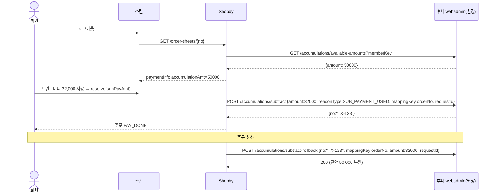
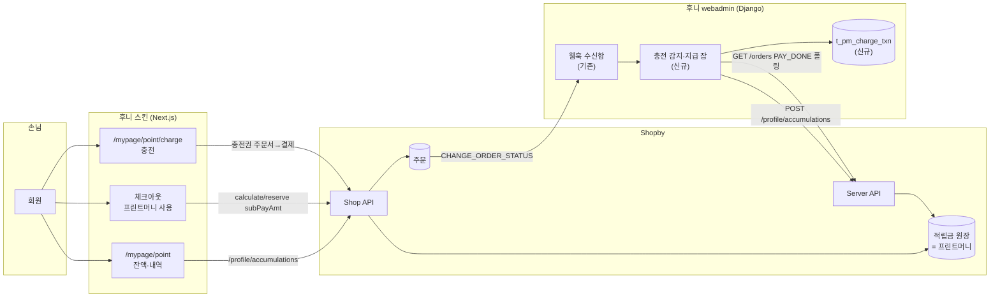
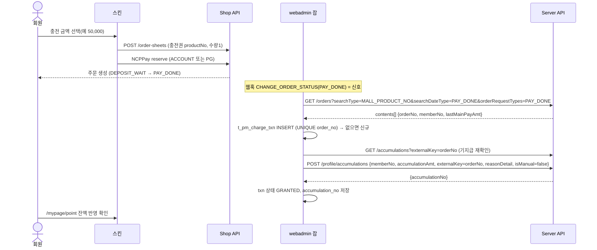
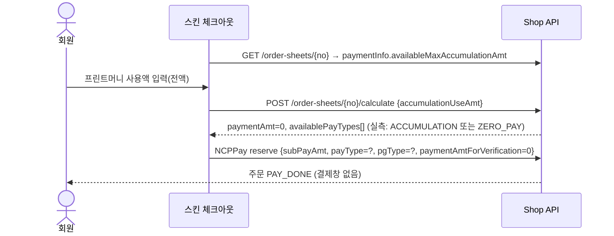
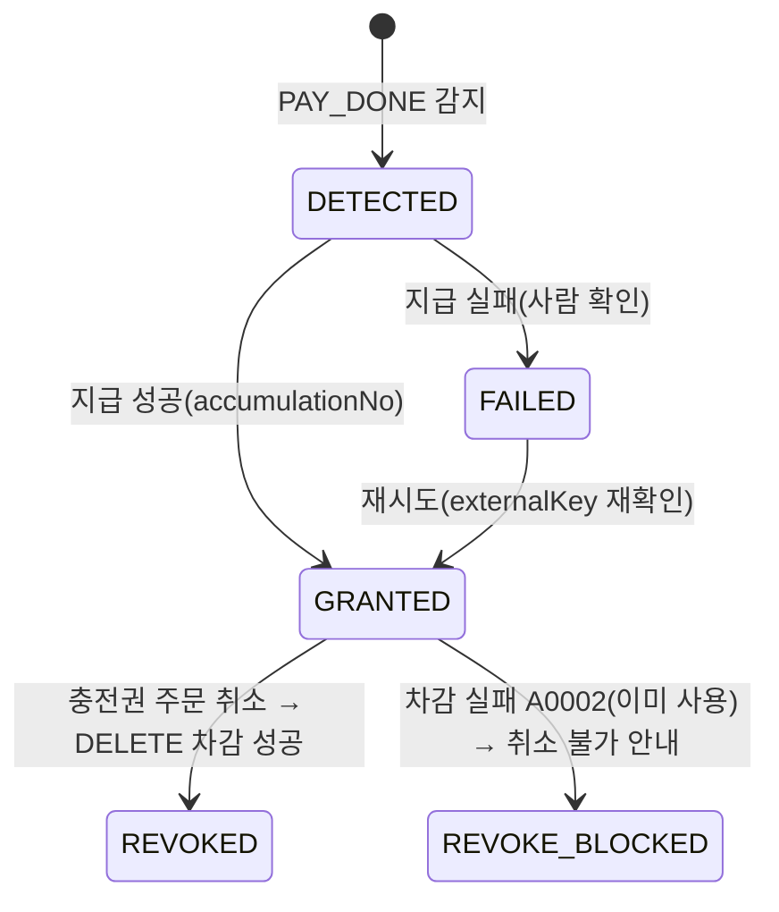
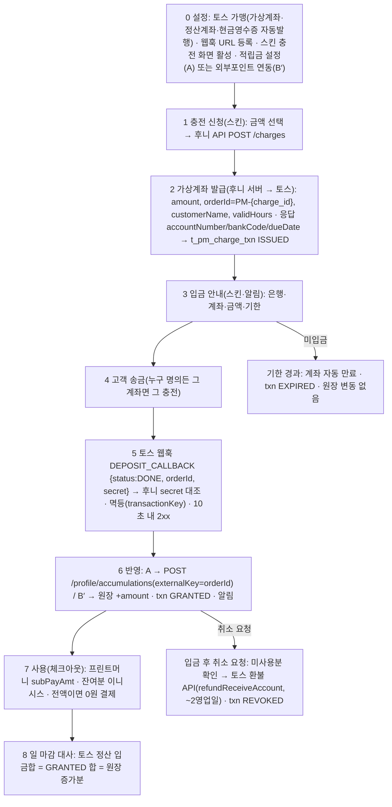
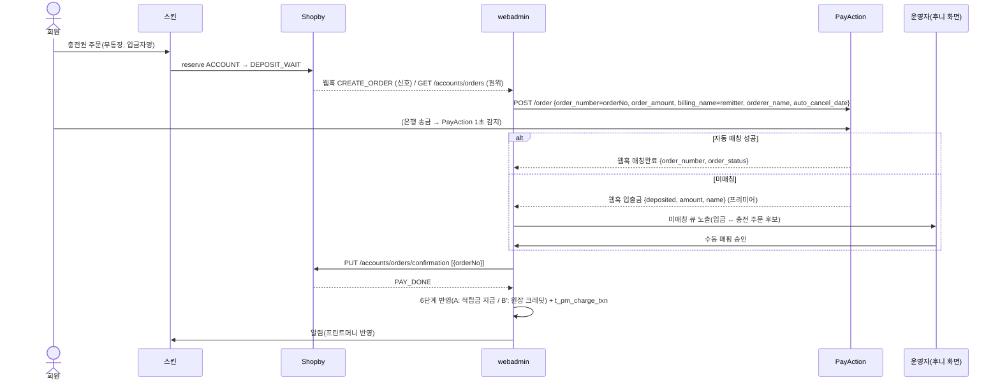
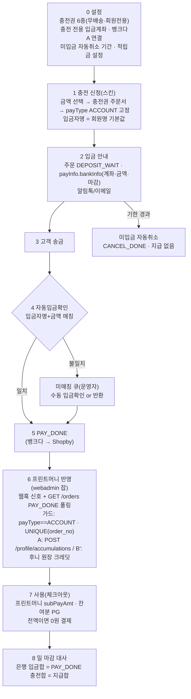

# 프린트머니(선불 충전금) — Shopby 위 구현 분석·설계

> 작성 2026-09-15 · lead 세션. 입력 = `SPEC-HARVEST-260915.md`(최신 OpenAPI 24개 파일 실측), `_workspace/huni-launch-scope/03_migration/printmoney-migration-spec.md`(260630), `16_bank-transfer/BANK-TRANSFER-API-260903.md`, `raw/webadmin/docs/shopby-server-api.md`(260819), 스킨 `~/Dev/huni-skin-shopby` 코드 정독.
> 위상: **설계 문서**. Shopby·라이브 어느 쪽에도 쓰기 0건. 실 구현·설정 변경은 인간 승인 후.

## 0. 결론 한 장

| 질문 | 답 |
|---|---|
| Shopby 가 선불 충전(예치금)을 지원하나 | **아니오.** 24개 명세·엔터프라이즈 매뉴얼 어디에도 예치금/충전 개념 없음 |
| 그럼 어떻게 구현하나 | 두 길. **A**: Shopby 적립금(accumulation)을 "프린트머니 원장"으로 재해석 — 잔액·사용·환불·만료·마이페이지는 Shopby 표준, 후니는 "충전 → 적립금 지급" 한 구간만 Server API 로. **B′**: 후니가 충전식 원장을 직접 보유하고 Shopby 「외부포인트 연동(방법2)」으로 Shopby 가 결제·취소 때 후니 API 를 호출(§3-B) |
| 후니 원장을 Shopby 가 외부포인트로 인정하나 | **예 — 정식 기능.** 단 엔터프라이즈 전용·NHN 1:1 문의 세팅·후니 API 5종 구현·결제 경로 가용성 책임이 후니로 이동(§3-B) |
| 충전은 어떻게 받나 | **(9/16 확정) 토스페이먼츠 가상계좌를 후니가 직접 발급** → 입금 웹훅 → 원장 반영(§14-0). Shopby 주문을 만들지 않으므로 회계 분리가 자연스럽고 매칭·승인이 없다. 9/15 안(충전권 상품 + Shopby 무통장 + 입금 매칭)은 §14-1~4 에 대안으로 보존 |
| 결제 시 전액 프린트머니로 되나 | **된다.** 몰 설정 `accumulationUseMaxRate=100`, `payType` 열거에 `ACCUMULATION: 적립금 전액 사용`·`ZERO_PAY: 0원결제` 존재. 어느 조합인지는 테스트몰 실측 1건 필요 |
| 이름이 "적립금"으로 보이나 | 아니오. 어드민 적립금 설정에서 명칭 "프린트머니"/단위 "원"으로 바꾸면 쇼핑몰 화면 전체에 반영(어드민 화면은 미반영) |
| 새로 만드는 코드 규모 | webadmin: 충전 감지 잡 + 지급 + 트랜잭션 표 1개 · 스킨: 충전 화면 배선(이미 화면 있음, 훅만 스텁) + 체크아웃 전액결제 분기 · 어드민 설정 체크리스트. **Shopby 원장을 쓰므로 돈 무결성 책임을 Shopby 에 위임** |

## 1. 현황

- 구 사이트: `/mypage/money.asp` 에 잔액 단일값 + 적립/사용 내역 목록. 충전 화면은 미관측(테스트 계정 0원).
- Shopby 후니 테스트몰: 결제수단 무통장(`ACCOUNT`, pgType `NONE`)만 활성. PG 계약 전.
- 스킨(`huni-skin-shopby`): `/mypage/point`(잔액 = `GET /profile/accumulations/summary`, 내역 = `GET /profile/accumulations`)는 이미 Shopby 적립금으로 동작. `/mypage/point/charge` 화면(금액 6종·결제수단 3종 라디오)은 있으나 `useChargePoint()` 가 `null` 반환 스텁(`src/lib/legacy-data/hooks.ts:423`). 체크아웃(`checkout-form.tsx`)은 `calculate(accumulationUseAmt)` → `reserve(subPayAmt)` 로 적립금 사용을 이미 구현.
- webadmin: Shopby Server API 클라이언트(`catalog/shopby_client.py`, 헤더 3종·프록시·fail-closed), 웹훅 수신함(`catalog/shopby_hook.py`, `CREATE_ORDER`/`CHANGE_ORDER_STATUS` 원문 보관 후 200), 장기토큰 계약(`docs/shopby-server-api.md`)이 이미 있음.
- 260630 마이그레이션 설계: 구 잔액 이관 = 회원당 `POST /profile/accumulations` 1건(방안 A, P-G1 합계 대사 게이트). "향후 PG 선불충전"만 스코프 밖 → **이 문서가 그 빈칸**.

## 2. Shopby 가 주는 것 / 안 주는 것

| 있음(그대로 씀) | 근거 |
|---|---|
| 회원별 적립금 지급·차감·잔액·이력·사용처 추적 Server API 10종 | `manage-server-public.yml` |
| 지급 시 `externalKey`(60자)·`reasonDetail`(200자)·`expireYmd`·`isManual` | 〃 |
| 주문서 `calculate(accumulationUseAmt)` → `reserve(subPayAmt)` 로 결제 차감 | `order-shop-public.yml` |
| `payType` `ACCUMULATION`/`ZERO_PAY`, 최대 사용비율 100% | 〃, `admin-shop-public.yml` |
| 명칭·단위 커스터마이즈, 유효기간 1~71개월/제한없음, 만료 알림 | `accumulation-setting.mdx` |
| 주문 취소 시 사용 적립금 자동 재적립(`SUB_CANCEL`/`ADD_CANCEL` 사유 존재) | 열거값(동작 실측 필요) |
| 결제확인 조회 `GET /orders?searchDateType=PAY_DONE&searchType=MALL_PRODUCT_NO` | `order-server-public.yml` |
| 웹훅 이벤트 `CHANGE_ORDER_STATUS`·`ACCUMULATION_ADDED/SUBTRACTED` | `workspace-server-public.yml` |

| 없음(후니가 만듦 / 우회) | 대응 |
|---|---|
| 예치금·충전 개념 | 충전권 상품 + 지급 API |
| 일괄 지급 쓰기 API(`/accumulations/assembles` GET 만) | 회원별 반복 호출(마이그레이션은 어드민 엑셀 일괄로 대체 가능) |
| 적립금 설정 변경 API | 어드민 수동 1회 |
| 웹훅 등록 API·페이로드 스키마·재전송·서명 | 워크스페이스 앱 설정에서 등록(webadmin 문서 §1) · 폴링을 권위, 웹훅은 신호 |
| `externalKey` 유일성 보장 | 후니 DB `UNIQUE(order_no)` + 지급 전 `GET /accumulations?externalKey=` 재확인 |

## 3. 방안 비교

| | A. 적립금 재해석 + 충전권 상품 (권고) | B. 후니 자체 원장 + 외부포인트 연동 | C. 충전 없이 무통장/PG 직접 결제만 |
|---|---|---|---|
| 원장 소유 | Shopby | 후니 | — |
| 신규 개발 | S~M(감지 잡·지급·화면 배선) | XL(원장·정합·마이페이지·환불·정산 전부) | 0 |
| 돈 무결성 | Shopby 책임(취소 재적립·만료·이력 native) | 후니 책임(이중원장 동기화 리스크, 260630 OQ-G3) | — |
| 마이그레이션 정합 | 260630 방안 A 그대로 이어짐 | 재설계 | 구 잔액 처리 불가 |
| 제약 | 자동 구매적립과 한 통에 섞임(설정으로 끔) · 어드민 화면엔 "적립금"으로 보임 | 「외부포인트 연동」 계약 문서 없음(미확인 #9) | 기존 고객 관행(선충전) 단절 |

→ **1차 = A.** B 는 아래 §3-B 로 구체화됨 — "후니가 원장을 갖는 것"이 사업 요건이면 B′ 가 정답이고, 조건 2개(엔터프라이즈 플랜·후니 서버 가용성 책임)가 갈림길.

## 3-B. 방안 B′ — 후니 충전식 원장 + Shopby 「외부포인트 연동(방법2)」

> 근거: NHN커머스 워크스페이스 「[엔터프라이즈] 외부 적립금 연동가이드」(https://workspace-help.nhn-commerce.com/contents/recommended/prm_mileage_guide · 원문 md 30KB 확보, 2026-07-01 개정분 포함). Server 명세의 `GET /accumulations/externals`·`EXTERNAL_ACCUMULATION`·Shop 이력의 `mappingKey(외부포인트 사용 시에만)`가 이 기능의 흔적.

### 개념
「고객사에서 기존에 사용하던 적립금(마일리지)를 전환 절차 없이 그대로 사용할 수 있고, 샵바이에서 고객사의 외부포인트를 연동하는 개념」. **호출 주체가 뒤집힌다** — 방안 A 는 후니가 Shopby 를 부르고, B′ 는 **Shopby 가 후니를 부른다.** 후니 webadmin 이 프린트머니 원장(잔액·트랜잭션)을 갖고, Shopby 는 결제·취소·조회 때마다 후니 API 를 동기 호출한다. Shopby 가 제시하는 두 방식 중 방법1(전환)은 곧 방안 A 의 마이그레이션이고, 방법2(연동)가 B′ 다.

### 후니가 구현해야 하는 API (Shopby → 후니, HTTPS, header `token`)

| # | URI(예시) | 메서드 | 필수 | Shopby 가 부르는 시점 | 요청 핵심 | 응답 |
|---|---|---|---|---|---|---|
| 1 | `/accumulations/add` | POST | ✅ | 구매확정 적립·후기·가입·생일·등급·수동 지급 | `memberKey`, `amount`(Long), `reason`, `reasonType`(ADD_AFTER_PAYMENT/ADD_POSTING/ADD_MANUAL/ADD_SIGNUP/ADD_BIRTHDAY/ADD_GRADE/ADD_GRADE_BENEFIT/ADD_AFTER_REPLACE_PAYMENT), `expiredDateTime`, `mappingKey`(주문/리뷰/옵션번호 또는 "0"), `additionalMappingKey{orderNo,reviewNo,orderOptionNo}`, `requestId`(멱등, 2026-07-01 추가) | `{no}` |
| 2 | `/accumulations/subtract` | POST | ✅ | **결제완료 시 적립금 사용(`SUB_PAYMENT_USED`)**, 교환 추가결제, 후기 삭제, 수동 차감 | `memberKey`, `amount`(양수), `reason`, `reasonType`, `mappingKey`(주문번호), `additionalMappingKey`, `orderExtraData`(reserve 의 extraData 바이패스), `requestId` | `{no}`(롤백 키) |
| 3 | `/accumulations/subtract-rollback` | POST | ✅ | **주문 취소(전체/부분)** | `no`(차감 응답 키, 없으면 주문번호), `mappingKey`(취소 주문번호), `amount`(롤백액), `lastSubPayAmt`(부분취소 시 남은 적립금), `reason`, `memberKey`, `requestId` | 200 |
| 4 | `/accumulations/available-amounts` | GET | ✅ | **주문서·체크아웃에서 사용가능 잔액 조회** | `memberKey`, `expireStartYmdt/EndYmdt` | `{amount, expiresAmount}` |
| 5 | `/accumulations` | GET | 선택 | 마이페이지 내역 | `startDateTime`, `endDateTime`, `searchType(REGISTERED/EXPIRED)`, `type(ADD/SUBTRACT)`, `memberKey`, `page`, `size` | `{totalCount, contents[]{no,memberKey,type,amount,reason,registerDateTime,expiredDateTime,mappingKey,totalAmount,extraData}}` |

실패는 HTTP 400 + `{errorCode, errorMessage}`. `memberMappingKey` 는 `MEMBER_ID`(기본)/`MEMBER_NO`/`CI` 중 택1. **적립 롤백 API 는 없음**(잘못 지급한 것은 차감 API 로 회수). 설정은 셀프서비스가 아니라 **NHN커머스 1:1 문의로 URI·헤더·memberMappingKey 를 세팅 요청**하고 Shopby ACL IP(103.194.111.5, 115.89.203.145)를 후니 방화벽에 허용.

### 충전은 어디서 받나 (B′ 에서도 Shopby PG 를 쓸 수 있다)
- **B′-1 (Shopby 경유)**: 방안 A 와 같은 충전권 상품 주문 → `PAY_DONE` 감지 → 이번엔 Shopby 적립금이 아니라 **후니 원장에 크레딧**. Shopby PG·무통장 흐름을 그대로 쓰고 후니는 결제 모듈이 필요 없다.
- **B′-2 (후니 직접)**: 후니가 PG 를 직접 계약해 스킨 충전 화면에서 결제 → 원장 크레딧. Shopby 주문이 생기지 않아 어드민에 충전 주문이 쌓이지 않지만 PG 계약·결제 구현이 후니 몫.

### 시퀀스(결제·취소)

### A vs B′ 비교

| 항목 | A. Shopby 적립금 재해석 | B′. 후니 원장 + 외부포인트 연동 |
|---|---|---|
| 원장·잔액의 정답 | Shopby | **후니 DB** |
| 플랜 요건 | 전 플랜(Server API) | **엔터프라이즈 전용**(가이드 제목) — 후니 플랜 확인 필요(`docs/shopby/…엔터프라이즈 소개서.pdf` 보유) |
| 세팅 | 어드민 설정 1회 | NHN 1:1 문의로 URI 등록 + ACL |
| 후니 개발 | 감지 잡·지급·표 1개 (S~M) | 원장 스키마·API 5종·멱등(`requestId`)·운영 화면·모니터링 (L) |
| 결제 경로 의존성 | 후니 서버가 죽어도 결제는 됨(충전 반영만 지연) | **후니 API 가 느리거나 죽으면 Shopby 체크아웃 자체가 막힘**(가이드 주의: 「고객사 서버에서 바로 응답되지 않는 성능 이슈가 발생하지 않도록」) |
| 구 잔액 마이그레이션 | Shopby 로 시드(P-G1 대사) | **불필요** — 구 원장을 후니 DB 로 그대로 승계 |
| 충전식 모델 보존 | 적립금 통에 섞임(설정으로 자동적립 끔) | 100% 보존(충전·사용·소멸 규칙 자유) |
| 이중 지급 리스크 | 후니 3중 가드 | 생일·등급 배치가 `mappingKey:"0"` 으로 와서 중복 가능 — 해당 지급 전부 미사용으로 끄면 회피 |
| 회계 | Shopby 정산 "적립금 사용" | 후니가 선수금 원장 보유(회계 자연스러움) |
| 어드민 가시성 | Shopby 어드민 적립금 화면에 보임 | Shopby 어드민에는 연동 이력만(`GET /accumulations/externals`) |
| 스킨 잔액/내역 화면 | 기존 그대로 | Shop API 가 외부를 프록시하는지(`mappingKey` 필드 존재로 추정) 실측 필요 — 아니면 스킨이 후니 API 직접 호출 |
| 되돌리기 | A→B′: Shopby 잔액을 `POST /accumulations/members/available` 로 읽어 후니 원장으로 이전 | B′→A: 방법1(전환) |

### 판단
- **후니가 원장을 소유해야 한다(충전식 선불금은 후니 자산·회계·정책의 핵심)** 가 사업 요건이면 **B′ 가 정답**이고, 방법2 는 Shopby 가 공식 문서로 지원하는 정식 경로라 "가능하다"에 대한 답은 **예**.
- 대가는 둘: ① 엔터프라이즈 플랜, ② **결제 경로의 가용성을 후니가 책임**(webadmin 이 Railway/Lightsail 위에서 Shopby 가 부를 때 항상 수 초 내 응답해야 함 — 현재 webadmin 은 사내 운영툴 성격이라 SLA 검토 필요).
- 권고 시퀀스: **플랜 확인 → 엔터프라이즈면 B′ 를 목표 아키텍처로 확정하고 M0 실측에 "외부포인트 연동 세팅 문의"를 추가.** 엔터프라이즈가 아니거나 가용성 책임을 지기 어려우면 A 로 간다. A 로 시작해도 B′ 로 이전하는 길(잔액 일괄 조회→후니 원장)은 열려 있다.

### B′ 실측·확인 항목(추가)
| # | 항목 |
|---|---|
| V9 | 후니 Shopby 플랜이 엔터프라이즈인지(워크스페이스 계약 화면) |
| V10 | 외부 연동 활성 시 Shop API `GET /profile/accumulations(/summary)` 가 후니 API 를 프록시하는지, `accumulationName` 설정이 계속 적용되는지 |
| V11 | 외부 연동 시 Shopby 자체 적립금 원장·어드민 수동지급이 비활성화되는지(가이드에 명시 없음) |
| V12 | 테스트몰에서 외부 연동을 켜고 끌 수 있는지(1:1 문의 처리 리드타임·개발몰 분리 가능 여부) |
| V13 | `available-amounts` 응답 지연 허용치(타임아웃 값)와 실패 시 체크아웃 동작 |

## 4. 목표 아키텍처

### 4-1. 충전 시퀀스

### 4-2. 사용 시퀀스(전액 결제)

### 4-3. 충전 트랜잭션 상태

## 5. API 매핑

| 단계 | 호출 | 핵심 필드 | 담당 |
|---|---|---|---|
| 충전권 상품 등록 | Server `POST /products` (v3.0) | `accumulationRate:0`, `accumulationUseYn:"N"`, 무배송, 회원전용 | 어드민(1회) |
| 충전 주문 | Shop `POST /order-sheets` → NCPPay `reserve` | 무통장: `payType:ACCOUNT`, `bankAccountToDeposit`, `remitter` / PG: `CREDIT_CARD` 등 | 스킨 |
| 결제 확인(무통장) | Server `PUT /accounts/orders/confirmation [{orderNo}]` | 기존 16_bank-transfer 흐름 | 운영/webadmin |
| 결제완료 감지 | Server `GET /orders` (Version 1.1) | `searchType=MALL_PRODUCT_NO&searchValues=<충전권 no>&searchDateType=PAY_DONE&orderRequestTypes=PAY_DONE&startYmdt&endYmdt` | webadmin 잡 |
| 지급 | Server `POST /profile/accumulations` | `memberNo`, `accumulationAmt`(=`lastMainPayAmt`), `externalKey=orderNo`, `reasonDetail="프린트머니 충전 {orderNo}"`, `isManual:false`, `expireYmd`(정책) | webadmin 잡 |
| 멱등 확인 | Server `GET /accumulations?externalKey=` | `items[].accumulationNo` | webadmin 잡 |
| 잔액/내역 | Shop `GET /profile/accumulations/summary`, `GET /profile/accumulations` | `totalAvailableAmt`, `items[].reasonDetail` | 스킨(기존) |
| 사용 | Shop `POST /order-sheets/{no}/calculate` → `reserve` | `accumulationUseAmt` → `subPayAmt`, 전액이면 `payType` 실측값 | 스킨(기존+분기) |
| 충전 취소 | Server `DELETE /profile/accumulations` | `memberNo`, `accumulationAmt`, `externalKey=orderNo`; 실패 `A0002` | webadmin 잡 |
| 감사 | Server `GET /accumulations/usage`, `/settlement` | 지급건이 어느 주문에 쓰였는지 | 운영 |

## 6. 데이터 모델(webadmin 신규 1표)

`t_pm_charge_txn`: `charge_id`(PK) · `order_no`(UNIQUE) · `member_no` · `member_id` · `amount` · `pay_type` · `pay_ymdt` · `accumulation_no`(nullable) · `external_key`(=order_no) · `status`(DETECTED/GRANTED/FAILED/REVOKED/REVOKE_BLOCKED) · `fail_reason` · `hook_id`(수신함 FK, nullable) · `reg_dt`/`upd_dt`.
원칙: 잔액은 저장하지 않는다(권위 = Shopby). 이 표는 "충전 1건 = 지급 1건" 대응만 기록.

## 7. 화면

| 화면 | 변경 |
|---|---|
| `/mypage/point` | 명칭만 "프린트머니"(몰 설정으로 자동). 내역 `reasonDetail` 노출 |
| `/mypage/point/charge` | `useChargePoint` 스텁 → 충전권 productNo 매핑(6종) → 주문서 생성 → 기존 체크아웃 흐름 재사용(무통장 입금안내). 결제수단 라디오는 `availablePayTypes` 기준으로 동적 |
| 체크아웃 | 사용액 == 결제예정액이면 `payType` 전액결제 분기(실측값), 무통장 입력란 숨김 |
| 주문완료 | 충전권 주문이면 "입금 확인 후 프린트머니 반영" 문구 |

## 8. 어드민 설정 체크리스트(1회, 인간 실행)

1. 운영관리 › 적립금 설정: 명칭 `프린트머니`, 단위 `원`, 유효기간(정책 결정, 약관 고지), 최소 기준금액/최소 사용 해제, 최대 사용 100%
2. 구매·가입·후기·생일 적립 전부 미사용, 회원등급/그룹 적립률 0 (충전권 이중적립 차단)
3. 충전권 상품 6종 등록: 판매가=액면, `accumulationRate 0`, `accumulationUseYn N`, 무배송, 회원전용, 전시 비노출(직접 링크)
4. 워크스페이스 앱 권한에 적립금(manage) scope 포함 + 웹훅 `CHANGE_ORDER_STATUS` 수신 URL(기존 비밀경로)
5. 무통장 입금 계좌 등록(이미 안내됨)

## 9. 돈 무결성·리스크

| 리스크 | 대응 |
|---|---|
| 이중 지급(웹훅+폴링 중복, 잡 재실행) | `UNIQUE(order_no)` + 지급 전 `externalKey` 조회 + 지급 후 `accumulation_no` 저장(3중) |
| 웹훅 유실(재전송 없음) | 폴링이 권위(`PAY_DONE` 기준, 초당 100회 상한 내 주기) · `GET /webhooks/failed` 7일 보정 |
| 충전 취소·환불 | 미사용분만 `DELETE` 회수 → 성공 시 주문 취소 승인; `A0002`면 취소 불가 정책(약관) |
| 인쇄 주문 취소 시 사용분 | Shopby `SUB_CANCEL` 자동 재적립 기대 — 실측 V6 |
| 무통장 충전 미입금 | 주문 `DEPOSIT_WAIT` 자동취소 기간 설정에 위임, 지급 안 함 |
| 부분 입금·과입금 | `confirmation` 은 전액 전제 → 지급액 = `lastMainPayAmt`(주문금액) 고정, 차액은 운영 수기 |
| 자동 구매적립 혼입 | 설정으로 전부 끔(§8-2) · 그래도 생기면 `reasonDetail` 로 구분 |
| 만료·소멸 | 선불금 소멸은 약관 고지 필수(매뉴얼 경고). 기본 "제한없음" 권고, 정책 결정 사항 |
| 회계 | 충전 = 선수금, Shopby 정산은 "적립금 사용"으로 집계 → 회계 처리 별도 |
| 마이그레이션 연결 | 구 잔액 시드(260630 P-G1 대사)와 같은 API·같은 `externalKey` 규약(`MIG-{memberId}` vs `orderNo`)으로 구분 |

## 10. 테스트몰 실측 계획(미확인 해소)

| # | 검증 | 방법 | 판정 |
|---|---|---|---|
| V1 | 지급 API 최소 바디(`expireYmd`/`notificationChannels` 생략) | `POST /profile/accumulations` 1건 | 200 + `accumulationNo` |
| V2 | `externalKey` 중복 시 서버 동작 | 같은 키로 2회 | 거부 여부 기록(어느 쪽이든 후니 가드가 막음) |
| V3 | 전액 결제 조합 | `calculate` 후 `availablePayTypes` 확인 → `reserve` | `payType`/`pgType` 확정, 결제창 없이 `PAY_DONE` |
| V4 | 충전권 상품 `accumulationRate 0` 이 0 적립인지 | 충전권 구매확정 후 적립 여부 | 0원 |
| V5 | `PAY_DONE` 폴링 쿼리 | 무통장 충전 → `confirmation` → `GET /orders` | 해당 주문 1건 검색 |
| V6 | 인쇄 주문 취소 시 사용분 재적립 | 적립금 사용 주문 취소 | 잔액 복원 |
| V7 | 충전 취소(미사용/일부사용) | `DELETE` | 성공 / `A0002` |
| V8 | 웹훅 `CHANGE_ORDER_STATUS` 에 `PAY_DONE` 도달 | 수신함 원문 확인 | 페이로드 기록 |

실측은 라이브 쓰기(적립금 지급)이므로 **지니 승인 후 테스트 회원 1명·소액·잔여물 회수**.

## 11. 구현 단위(우선순위)

| 단위 | 내용 | 우선순위 | 선행 |
|---|---|---|---|
| M0 | 어드민 설정 + 충전권 상품 6종 + 실측 V1~V8 | High | 지니 승인 |
| M1 | webadmin `t_pm_charge_txn` + 감지·지급 잡(폴링) + 웹훅 신호 연결 | High | M0 |
| M2 | 스킨 충전 화면 배선(`useChargePoint` → 충전권 주문서) | High | M0 |
| M3 | 체크아웃 전액결제 분기 | High | V3 |
| M4 | 충전 취소/환불 처리 + 운영 화면(txn 목록·재시도) | Medium | M1 |
| M5 | 구 잔액 마이그레이션 시드 실행(260630 스펙) | Medium | M0, 원천 DB |
| M6 | PG 계약 후 카드 충전 활성(코드 변경 없이 `availablePayTypes` 로 자동) | Low | PG 계약 |

## 12. 결정 요청(지니)

1. ~~유효기간~~ → **제한없음 확정(2026-09-15)** — 약관에 "소멸 없음" 명시
2. 충전 단위·최소/최대(현 화면 6종 10,000~500,000) 유지 여부
3. 일부 사용 후 충전 취소 정책: 불가(권고) vs 미사용분 부분 환불
4. PG 계약 전 무통장 충전으로 먼저 오픈할지
5. ~~칸반 카드 등록~~ → **리포트만 보관(2026-09-15)**. 착수 시 "프린트머니 카드 등록"으로 재개
6. **원장 소유 결정**: A(Shopby 적립금) vs B′(후니 원장 + 외부포인트 연동) — 엔터프라이즈 플랜 여부(V9)와 결제 경로 가용성 책임을 후니가 질지가 판단 기준
7. ~~자동입금확인 방식~~ → **토스 가상계좌 API 직접 발급 확정(2026-09-16)** — §14-0. 전제 V24(면제 조건)·V26(심사) 미충족 시 §14-1~4 무통장+PayAction 으로 복귀
9. ~~개발 주체·화면 배치~~ → **확정(2026-09-16)**: 쇼핑몰·가이드북·상세페이지 탭(페이지빌더)은 **김동학 대표**가 개발, 오픈·안정화 후 **서희항 CTO(기술 총괄)·지니**가 유지보수. webadmin(`raw/webadmin`)은 **쇼핑몰 관리자 영역 / DB·생산 영역으로 분할** — 신우진·김동학·서희항 3자 논의로 역할 분담 예정(§16). 디자인 등록 관리는 webadmin(상품정보) 확정
8. 충전 전용 입금계좌 분리 여부, 과입금·부분입금 정책 — §14-4

해소됨(2026-09-15 지니 확정, §14-6): 4번(충전=무통장 전용·PG=이니시스 상품 전용), 가상계좌 제외, 회계 분리, 미매칭 사람 승인 흐름.

## 14. 전체 프로세스 — 충전 입금 확인

> 결정 이력: 9/15 지니 — 충전은 계좌 입금으로만, PG(이니시스)는 상품 주문만, 가상계좌는 수수료 때문에 제외. **9/16 피드백·재확정 — 가입비·연관리비 면제 프로모션 확인을 전제로 「토스페이먼츠 가상계좌 API 직접 발급」 채택(D-3 대체).** 아래 §14-0 이 확정 흐름이고, §14-1~14-4 의 무통장+매칭(PayAction·뱅크다) 설계는 **대안 기록**으로 남긴다(고정비 면제가 안 되거나 심사 탈락 시 복귀 경로).

### 14-0. 확정 흐름 (2026-09-16) — 토스 가상계좌 직접 발급

**구조**: 충전은 Shopby 를 거치지 않는다. 스킨 충전 화면 → 후니 서버가 토스 가상계좌 발급 → 고객 입금 → 토스 `DEPOSIT_CALLBACK` 웹훅 → 후니 원장 크레딧(B′) 또는 Shopby 적립금 지급(A). 상품 결제는 이니시스(Shopby PG), 충전은 토스(후니 계약) — **PG 역할 분리 = 회계 분리**.

| 단계 | 담당 | 핵심 규칙 |
|---|---|---|
| 0 설정 | 후니(1회) | 토스 가맹(가상계좌 상품 심사·정산계좌·에스크로 여부 V26) · 개발자센터 웹훅 URL(`DEPOSIT_CALLBACK`) 등록 · 현금영수증 자동발행 설정(V19) · 스킨 충전 화면의 결제수단 라디오 → "가상계좌" 단일 |
| 1 충전 신청 | 스킨 | `useChargePoint(amount)` → 후니 `POST /api/w/v1/pm/charges {amount}` (회원 인증 필수) |
| 2 발급 | 후니 서버 → 토스 | 토스 결제 승인 API(가상계좌) `amount, orderId=PM-{charge_id}, customerName, validHours(정책, 기본 72h), cashReceipt 옵션` → 응답 `virtualAccount{accountNumber, bankCode, dueDate}, secret` 를 `t_pm_charge_txn` 에 저장(status `ISSUED`) |
| 3 안내 | 스킨·알림 | 계좌·금액·기한 표시, 알림톡/이메일(후니 발송 또는 토스 안내) |
| 4 송금 | 고객 | 금액 정확 일치만 허용(토스 규칙) |
| 5 웹훅 | 토스 → 후니 | `DEPOSIT_CALLBACK` 원문 보관(`t_pm_deposit`) → `secret` 대조 → `orderId` 로 txn 조회 → `status` `DONE` 만 처리 · `transactionKey` 멱등 · **10초 내 2xx** · 실패 시 토스 재전송 규칙 확인 + 후니 보정 폴링(토스 결제 조회 API) |
| 6 반영 | 후니 잡 | §4-1 지급 로직 그대로(`externalKey=orderId`) / B′ 는 원장 크레딧. UNIQUE(`orderId`) 가드 |
| 7 사용 | 스킨 | §4-2 |
| 8 대사 | 후니 배치 | 토스 정산 내역(가상계좌 입금) = GRANTED 합 = 원장 증가분. Shopby 는 개입 없음 |

**대안 기록 대비 사라지는 것**: 충전권 상품 6종·Shopby 무통장 주문·`PUT /accounts/orders/confirmation`·PayAction/뱅크다·미매칭 매핑 화면·충전권 매출 제외 처리(§14-6). **새로 생기는 것**: 토스 가맹·가상계좌 발급/웹훅/환불 3 API·`t_pm_charge_txn` 에 `virtual_account_*`·`due_dt`·`toss_payment_key` 컬럼.

#### 예외 처리(확정 흐름)

| 예외 | 처리 |
|---|---|
| 기한 내 미입금 | 토스가 계좌 만료 → txn `EXPIRED`. 이후 입금은 은행이 거부(계좌 무효) |
| 금액 불일치 | 토스가 입금 거부(정확 일치 규칙) → 고객에게 재송금 안내 |
| 웹훅 유실·지연 | `t_pm_deposit` 미도착 + 기한 내 → 후니 보정 폴링(토스 결제 조회)로 `DONE` 확인 |
| 이중 웹훅 | `transactionKey`/`orderId` 멱등 → 두 번째 무시 |
| 입금 후 충전 취소 | 미사용분만 A: `DELETE /profile/accumulations` / B′: 원장 차감 → 토스 환불 API(계좌 환불) → txn `REVOKED`. 일부 사용 후엔 취소 불가(정책, §12 3번) |
| 토스 장애 | 발급 실패 시 충전 화면에 "잠시 후 재시도" · 원장 변동 없음. 상품 결제(이니시스)는 무관 |
| 회원 아닌 요청 | 충전 API 는 회원 토큰 필수 |

---

**아래 §14-1 ~ §14-4 는 9/15 무통장+매칭 설계(대안 기록)** — 토스 면제 조건(V24)이 성립하지 않거나 심사(V26)에 떨어지면 이 경로로 복귀한다.

### 14-1. 결제수단 분리 원칙

| 대상 | 허용 결제수단 | 어떻게 강제하나 |
|---|---|---|
| 상품 주문 | PG(카드·간편결제 등) + 프린트머니(적립금 `subPayAmt`) + (선택) 무통장 | 몰 결제수단 설정 |
| **충전권 주문** | **무통장입금(`ACCOUNT`)만** | **스킨 충전 화면이 `payType:ACCOUNT` 고정**(다른 수단 비노출) + **webadmin 가드**(충전권 주문의 `payType≠ACCOUNT` 이면 지급하지 않고 운영 큐로) |

주의: Shopby 명세에 **상품 단위 결제수단 제한 필드는 없다**(`limitPayType(s)` 는 쿠폰·프로모션 전용). 그래서 강제는 스킨+webadmin 두 겹으로 건다. 어드민 상품 설정에 결제수단 제한 UI 가 있는지는 「미확인」(V14).

### 14-2. 자동입금확인 — 세 갈래

| | ① 뱅크다A 앱(Shopby 앱스토어) | ② 후니 자체 매칭(계좌조회 API) | ③ 가상계좌(PG) |
|---|---|---|---|
| 원리 | 뱅크다가 은행 거래내역 수집 → Shopby 입금대기 주문과 **입금자명+금액** 매칭 → Shopby 가 `PAY_DONE` 처리 | webadmin 이 팝빌 계좌조회(EasyFinBank: `RequestJob`→`GetJobState`→`Search`, 필드 `trdt/accIn/remark1~4/balance`) 등으로 거래내역 수집 → `GET /accounts/orders`(입금대기·`remitterName`·`bankAmt`) 와 매칭 → `PUT /accounts/orders/confirmation` | PG 가 주문마다 1회용 계좌 발급 → 입금 즉시 PG→Shopby 콜백으로 자동 `PAY_DONE`(매뉴얼: 「가상계좌… 입금이 확인되면 자동으로 입금확인 처리」, 수동 입금확인 불가) |
| 주기 | 5~10분(앱 안내) | 우리가 정함(계좌조회 수집 지연 + 폴링) | 즉시 |
| 개발 | 0(앱 설치·계좌 연결) | 수집·매칭·확인 잡 + 운영 화면 (M) | 0(PG 계약·설정) |
| 비용 | 15일 무료 후 30일 9,000원/360일 90,000원, 상점·계좌 각 1개 포함(추가 유료), 계좌 최대 3개 | 팝빌 계좌조회 정액 + 은행 빠른조회 | PG 가상계좌 건당 수수료 |
| 매칭 실패 | 동명이인·금액 불일치 → 수동 매칭 | 규칙을 우리가 통제(허용오차·후보 제시) | 없음(계좌가 곧 주문) |
| 전제 | 은행 **빠른조회 서비스** 등록(인터넷뱅킹), 지원 은행 20곳 | 팝빌 계좌 등록 + 빠른조회 | PG 계약(상품용으로 어차피 필요) |
| 지니 결정과의 정합 | ○ 무통장 | ○ 무통장 | △ "PG 상품 국한"과 충돌 가능(가상계좌는 PG 상품이나 실질은 계좌이체) |

③ 은 D-3 로 제외. ①/② 의 실제 후보를 서비스 단위로 비교하면(2026-09-15 조사):

#### 14-2-1. 입금 감지·매칭 서비스 비교 (지니 지목: PayAction 류)

| 서비스 | 방식 | 감지 | Shopby 연동 | API/웹훅 | 요금(공개) | 판정 |
|---|---|---|---|---|---|---|
| **PayAction(페이액션)** | 계좌 등록(인증서 불필요) → 은행 입금 실시간 수신 → 주문(입금자명+금액) 자동 매칭 → 웹훅. 스마트 부분매칭/리매칭·수동 매칭 화면·현금영수증 자동발행·알림톡 | **1초**(스타터 이상; 프리는 60분) | 공식 플러그인 목록에 **샵바이 없음**(카페24·아임웹·고도몰·식스샵·독립몰) → **"독립몰/개발" 방식으로 후니 webadmin 이 연동** | `POST https://api.payaction.app/order`(`order_number, order_amount, order_date, billing_name, orderer_name, auto_cancel_date…`), `POST /orders/{n}/cancel`, 웹훅 **매칭완료**(`order_status`) + **입출금**(`transaction_type deposited/withdrawn`, 금액·거래자명·잔액; 프리미어) · 헤더 `x-api-key`/`x-mall-id`, 웹훅 `x-webhook-key` | 프리 0원/10건·1계좌 · 스타터 9,900/200건·3계좌 · **프로 33,000/1,000건·5계좌(입금확인 API)** · **프리미어 99,000/5,000건·10계좌(+입출금 데이터 API)** · 14일 무료 | **★ 1순위** — 후니가 매칭 결과를 받아 Shopby 입금확인을 직접 호출하는 구조라 "미매칭은 후니가 매핑" 요건과 정합 |
| 뱅크다A | 거래내역 수집 → Shopby 입금대기 주문과 매칭 → Shopby 가 직접 입금확인 | 5~10분 | **Shopby 앱스토어 정식 앱** | 없음(앱 내부) | 15일 무료 후 30일 9,000·360일 90,000·계좌 최대 3 | 개발 0 이지만 매칭·승인이 Shopby/뱅크다 화면에 갇힘 → 후니 원장·회계 대사와 연결하려면 어차피 폴링 필요 |
| 계좌조회api(bankapi.co.kr) | 간편계좌조회 REST(거래내역·입금확인·예금주) | 계좌당 **5분에 1회** 제한 | 없음 | REST | 무료(5개 은행: 농협·국민·우리·기업·신한) | 소규모·보조용. 조회 제한이 커 주 경로로 부적합 |
| 팝빌 계좌조회(EasyFinBank) | `RequestJob`→`GetJobState`→`Search`(1개월 단위·3개월 이전까지) | 배치(수집 요청 후) | 없음 | REST(11개 언어 SDK) | 정액(공개 페이지 500 오류로 미확인) | 대사·감사용 원천으로 적합, 실시간 확인용은 아님 |
| 금융결제원 오픈뱅킹 거래내역조회 | 공식 API | 실시간 | 없음 | REST | 이용기관 심사·보증 필요 | 직접 연동 부담 큼 — 위 서비스들이 이걸 대신 감싸 줌 |

**권고**: **PayAction 프로(입금확인 API) 이상**으로 시작. 후니가 충전 주문을 PayAction 에 등록하고, 매칭완료 웹훅을 받아 Shopby `PUT /accounts/orders/confirmation` 을 호출한다. **미매칭 입금은 후니 운영 화면에서 사람이 충전 주문과 매핑**(D-4) → 같은 확인 호출. 프리미어(입출금 데이터 API)를 쓰면 모든 입금 건이 후니에 실시간 도착해 미매칭 큐·일 마감 대사(§14-6)를 후니 원장만으로 닫을 수 있다. 뱅크다A 는 개발 0 이 장점이나 회계 원장과 결합이 약해 2순위.

#### 14-2-2. PayAction 연동 시퀀스(후니 webadmin = "독립몰/개발")

후니 쪽 추가 구현: `t_pm_deposit`(PayAction 입금/매칭 이벤트 원문 보관, 멱등 키 `x-trace-id`) · 미매칭 큐 화면(입금 건 ↔ `DEPOSIT_WAIT` 충전 주문 후보: 금액 일치·이름 유사도 순) · 승인 시 `confirmation` 호출 + 감사 로그 · 미입금 자동취소 시 `POST /orders/{n}/cancel` 로 PayAction 주문도 닫기.

#### 14-2-3. 재검토 — 입금알림 서비스 대신 **토스페이먼츠 가상계좌 API** 로 가는 경우 (피드백 2026-09-16)

> 피드백: 「토스 가상계좌 최초 가입비는 요즘 계속 면제 프로모션이 있고 연관리비도 마찬가지… 포트원 같은 곳을 통해 가입하면 면제 프로모션이 있다. 확인 필요로 적어 두고, 입금알림 서비스 대신 토스 가상계좌 API 로 가게 된 이유 설명이 필요하다.」 — 어제(9/15) D-3 "가상계좌 제외(수수료)"의 전제였던 **고정비(가입비·연관리비)** 가 면제 가능하다면 남는 비용은 **건당 수수료**뿐이므로 다시 비교한다. **최종 확정은 지니 결정 사항**(§12 7번).

**구조 차이 — 이 안은 "충전권 상품 + Shopby 무통장 주문"을 쓰지 않는다.** 후니 스킨 충전 화면 → 후니 서버가 토스 가상계좌를 **직접 발급**(Shopby 주문 없음) → 고객 입금 → 토스 `DEPOSIT_CALLBACK` 웹훅 → 후니 원장(B′) 크레딧 또는 Shopby 적립금 지급(A). 즉 §3-B 의 **B′-2(후니 직접)** 경로이며, 상품 주문 PG(이니시스)와는 **계약·정산이 완전히 분리**된다.

| 관점 | 입금알림 서비스(PayAction 류) + Shopby 무통장 충전권 | **토스 가상계좌 API 직접 발급** |
|---|---|---|
| 입금 확인 원리 | 은행 입금 감지 후 **입금자명+금액 매칭** | **계좌 = 주문**. 주문마다 1회용 계좌 → 매칭 개념 자체가 없음 |
| 미매칭·사람 승인 | 발생함(동명이인·오타·타인 명의) → 후니 운영 화면 필요 | **구조적으로 없음**(누가 보내든 그 계좌면 그 충전). 금액 불일치는 토스가 거부(「입금 금액은 주문 금액과 정확히 일치」) |
| 확인 지연 | 1초(PayAction) | 즉시(은행→토스→웹훅) |
| Shopby 개입 | 충전권 상품·무통장 주문·`confirmation` 호출·충전권 매출 제외(§14-6) 전부 필요 | **없음** — Shopby 주문이 안 생기므로 Shopby 매출 통계가 오염되지 않음 → **회계 분리(D-2)가 자연스럽게 성립** |
| 증빙 | Shopby 무통장 현금영수증(플랜 제한) + 후니 처리 | **토스가 입금 후 현금영수증 자동 발행**(선수금 단계 발행 여부는 V19 세무 검토 동일) |
| 환불 | 무통장 계좌 환불 수동 | 토스 환불 API(`refundReceiveAccount`, 입금 후 ~2영업일) |
| 입금 기한 | Shopby 미입금 자동취소 설정 | `validHours`(기본 7일, 최대 90일) 후 자동 만료 |
| 후니 개발 | PayAction 주문 등록·웹훅·미매칭 큐·Shopby confirmation | 토스 발급 API·`DEPOSIT_CALLBACK` 수신(`secret` 검증, 10초 내 2xx)·원장 크레딧 — **더 단순** |
| 고정비 | PayAction 월 33,000(프로)~99,000(프리미어) | 가입비 22만·연관리비 11만 — **「확인 필요」: 계약형태·포트원 추천패키지 등 프로모션으로 면제 사례 다수**(토스 FAQ 「가입비와 연관리비는 계약형태에 따라 상이」) |
| 변동비 | 없음(건수 한도 내) | **건당 300원**(토스 공시·VAT 별도 여부 확인) |
| 손익분기(고정비 면제 가정) | — | 월 충전 **110건** 이하면 가상계좌가 PayAction 프로보다 저렴, 330건 이하면 프리미어보다 저렴 |
| "PG 는 상품 국한" 결정과의 관계 | 정합 | 토스 = **충전 전용 PG**, 이니시스 = 상품 PG 로 **역할 분리**. "상품 결제에 PG 를 쓴다"와 충돌하지 않고, 오히려 회계 분리를 돕는다 |
| Shopby VIRTUAL_ACCOUNT(이니시스 경유) 변형 | — | 충전권 주문을 Shopby 가상계좌로 받는 변형도 가능하나 Shopby 주문·매출 오염·이니시스 정산 혼입이 그대로라 **비권장** |

**전환 사유 정리(리포트 독자용)**: ① 매칭·수동 승인 운영이 사라진다 ② Shopby 주문을 만들지 않아 회계 분리와 매출 통계가 깨끗하다 ③ 현금영수증·환불·기한만료가 토스 API 로 표준화된다 ④ 고정비가 면제되면 월 110건 이하에서 더 저렴하다 ⑤ 후니 개발 범위가 더 작다. **반대 급부**: 건당 300원, 토스 가맹 심사·정산계좌·에스크로 적용(가상계좌는 현금성) 확인, 고객이 "가상계좌 = 카드 PG" 로 오인하지 않도록 UI 문구.

**확인 필요(V24~V27)**: V24 토스 가입비·연관리비 면제 조건(직접 계약 vs 포트원 추천패키지) · V25 가상계좌 건당 수수료·VAT·정산 주기 · V26 후니(선수금 충전) 업종으로 가상계좌 심사 통과 여부·에스크로 의무 여부 · V27 `DEPOSIT_CALLBACK` 테스트(샌드박스 입금 시뮬레이션) → 원장 크레딧 종단.

## 16. 화면 배치와 개발 주체 (피드백 2026-09-16)

> 피드백: 「프린팅머니·외부포인트 API 5종·증빙 발행·충전운영화면을 **내가(지니) 개발하면 webadmin 메뉴**에 넣는 게 맞고, **김동학 대표가 개발하면 별도 화면**이 맞다. webadmin 은 상품·위젯 관리 화면 모음인데 쇼핑몰 관리자에 들어가야 할 기능을 webadmin 에 쑤셔 넣는 느낌. 디자인등록 관리는 상품정보의 일부라 webadmin 에 들어가도 된다.」

### 원칙
- **webadmin = 상품·위젯(카탈로그) 관리 도구.** 프린트머니·입금·증빙은 **쇼핑몰 운영(주문·결제·정산)** 성격이라 성격이 다르다.
- 그래도 **한 저장소·한 배포**에 두는 것이 지금은 가장 싸다 — 이미 Shopby 클라이언트·웹훅 수신함·장기토큰·프록시가 webadmin 안에 있고, 별도 서비스로 쪼개면 인증·배포·모니터링을 두 번 만든다.
- 절충: **Django 앱을 분리**(`catalog` 와 별개의 `shopops` 앱)하고 **사이드바 메뉴 그룹을 "쇼핑몰 운영"으로 분리**한다. 코드·메뉴가 따로 있으면 나중에 별도 서비스로 떼어내기 쉽고, 지금은 "쑤셔 넣은" 느낌 없이 같은 관리자에서 쓴다.

### 기능별 배치

| 기능 | 성격 | 지니 개발 시 | 김동학 대표 개발 시 | 비고 |
|---|---|---|---|---|
| 프린트머니 원장(잔액·트랜잭션·대사) | 쇼핑몰 운영·회계 | webadmin `shopops` 앱 · 메뉴 「쇼핑몰 운영 › 프린트머니」 | 별도 운영 콘솔(신규 저장소) · 원장 DB 는 라이브 Railway 공유 또는 API 로 접근 | 원장 테이블 위치는 어느 쪽이든 **라이브 DB 1곳**(이중 원장 금지) |
| 외부포인트 API 5종(Shopby → 후니) | 서버 API(화면 없음) | webadmin URL `api/w/v1/points/*` (기존 `api/w/v1/shopby/webhook` 옆) | 별도 서비스 엔드포인트 | Shopby ACL·`token` 헤더·`requestId` 멱등은 어디에 있든 동일 |
| 충전 운영 화면(입금 큐·미매칭 매핑·승인·취소/환불·재시도) | 쇼핑몰 운영 | 「쇼핑몰 운영 › 충전 입금」 | 별도 콘솔 | **토스 가상계좌(§14-2-3)로 가면 미매칭 매핑 화면 자체가 사라지고** 취소/환불·조회만 남는다 |
| 증빙 발행(현금영수증·간이영수증·세금계산서) | 쇼핑몰 운영·세무 | 「쇼핑몰 운영 › 증빙」 — 토스/Shopby 발행 결과 조회·재발행 요청 | 별도 콘솔 | 자동 발행 주체(토스/Shopby)에 따라 화면은 "조회·예외 처리" 위주 |
| 디자인 등록 관리(포토북·캘린더 등 상품 1개에 여러 디자인) | **상품정보의 일부** | **webadmin `catalog` 메뉴(상품 뷰어 하위)** | (동일 — 상품정보라 webadmin 이 맞음) | 피드백대로 webadmin 확정. 고객용 보관함·편집기 저장 방식은 스킨/에디터 영역(런웨이 리포트의 열린 항목) — 이 문서 범위 밖 |
| 마이페이지 프린트머니 잔액·내역·충전 | 고객 화면 | 스킨(기존) | 스킨(기존) | 변동 없음 |

### 확정(지니 · 2026-09-16)
- **초기 개발 = 김동학 대표** — 쇼핑몰, 쇼핑몰에 들어가는 가이드북, 상세페이지 탭(페이지빌더). 프린트머니·외부포인트 API·증빙·충전 운영 화면도 이 범위에서 **별도 화면(쇼핑몰 관리자 영역)** 으로 개발.
- **오픈·안정화 후 = 서희항 대표(CTO, 기술 총괄) + 지니**가 유지보수를 맡는다.
- **webadmin(`raw/webadmin`) 분할** — 지금은 기능이 너무 많이 들어가 있어 **① 쇼핑몰 관리자 영역**(주문·결제·프린트머니·증빙·페이지빌더 콘텐츠)과 **② DB·생산 영역**(상품·위젯·가격·공정·MES 연계)으로 나눈다. 역할 분담은 **신우진·김동학·서희항 3자 논의**로 확정 예정 → 이 문서는 그 논의의 입력.
- 그 논의와 무관하게 확정: **디자인 등록 관리는 ② DB·생산 영역(webadmin 상품정보)**, 프린트머니 원장 테이블은 **라이브 DB 한 곳**, Shopby 를 부르는 코드는 **한 클라이언트**(`shopby_client.py` 재사용 또는 이식).

### 3자 논의에 넘길 분할 초안

| 영역 | 담는 것 | 초기 개발 | 유지보수 |
|---|---|---|---|
| ① 쇼핑몰 관리자 영역 | 프린트머니 원장·충전 운영(가상계좌 발급 내역·환불)·외부포인트 API 5종·증빙 조회·페이지빌더(가이드북·상세 탭)·주문/배송 운영 | 김동학 | 서희항 총괄·지니 |
| ② DB·생산 영역 | 상품 뷰어·위젯빌더·가격엔진·공정/자재 마스터·디자인 등록 관리·MES 핸드오프 | (현 webadmin) | 서희항 총괄·지니 |
| 공유 | 라이브 DB(원장 포함)·Shopby 클라이언트·웹훅 수신함·장기토큰·프록시 | — | 1벌 유지 |

미결로 남기는 것: ①을 별도 저장소로 떼는지, webadmin 안의 별도 Django 앱+메뉴 그룹으로 두는지(§16 원칙의 절충안) — 3자 논의 결과에 따른다.

### 14-3. 종단 흐름(8단계)

| 단계 | 담당 | 핵심 규칙 |
|---|---|---|
| 0 설정 | 어드민(1회) | §8 체크리스트 + **충전 전용 입금계좌**(상품 무통장과 분리하면 대사가 쉬움) + 뱅크다A 앱 설치·계좌 연결 + `미입금 주문 자동취소` 기간(서비스관리›쇼핑몰 설정) |
| 1 충전 신청 | 스킨 | `useChargePoint` → 충전권 `POST /order-sheets` → NCPPay `reserve {payType:ACCOUNT, pgType:NONE, bankAccountToDeposit=충전계좌, remitter}`; 입금자명 기본값 회원명(매칭률↑), 변경 시 경고 문구 |
| 2 입금 안내 | 스킨·Shopby | 주문완료 화면에 `payInfo.bankInfo{bankAmt, account, paymentExpirationYmdt}`; 주문 알림(알림톡)은 Shopby 기본 |
| 3 송금 | 고객 | — |
| 4 자동입금확인 | 뱅크다A | 5~10분 주기, 입금자명+금액 일치 → 입금확인. 불일치 → 뱅크다/Shopby 미확인 입금자 큐 |
| 5 PAY_DONE | Shopby | `DEPOSIT_WAIT → PAY_DONE`, `bankInfo.depositYmdt/depositAmt` 채움. 웹훅 `CHANGE_ORDER_STATUS` 발신 |
| 6 반영 | webadmin 잡 | §4-1 그대로. 추가 가드 2: `payType==ACCOUNT`·`lastMainPayAmt==충전권 액면`(아니면 GRANT 보류·운영 큐) |
| 7 사용 | 스킨 | §4-2. 프린트머니 + PG 혼합 결제 가능(`subPayAmt` + `payType:CREDIT_CARD`) |
| 8 대사 | webadmin 배치 | 일 단위 3자 합계: 은행(충전계좌 입금합) = Shopby(충전권 `PAY_DONE` `bankAmt` 합) = 지급합(`t_pm_charge_txn` GRANTED 합). 불일치 = 조사 신호 |

### 14-4. 예외 처리 규칙

| 예외 | 처리 |
|---|---|
| 입금자명 불일치(동명이인·오타·타인 명의) | 자동 매칭 실패 → 운영자가 뱅크다/Shopby 미확인 입금자 화면에서 수동 매칭 → `PAY_DONE` → 6단계 자동 |
| 금액 불일치(부분·과입금) | 자동 매칭 실패. 정책: **과입금**=주문금액만 확인·차액 환불 or 별도 충전(운영 결정) / **부분입금**=확인 보류·추가입금 안내·기한 경과 시 자동취소+환불 |
| 미입금 기한 경과 | Shopby 자동취소(`CANCEL_DONE[환불 없음]`) → 지급 없음. 늦게 입금되면 계좌 반환 |
| 충전권을 PG 로 결제한 주문 | 스킨이 막지만 우회 시 webadmin 가드가 GRANT 보류 → 운영자 판단(취소·환불) |
| 이중 입금(같은 주문 2회 송금) | 두 번째 입금은 매칭 대상 없음 → 미확인 큐 → 반환 |
| 충전 후 취소 요청 | 미사용 시 `DELETE /profile/accumulations`(A) / 원장 차감(B′) 성공 → Shopby 주문 취소 → **무통장 환불은 계좌 환불(수동, 클레임 「환불 보류→환불 처리」)** |
| 비회원 입금 | 충전권은 회원 전용 → 주문 자체 불가 |
| 자동입금확인 서비스 장애 | Shopby 어드민 입금대기 리스트에서 수동 입금확인 → 6단계는 그대로 동작(폴링 기반) |

### 14-6. 확정 결정(지니 · 2026-09-15) 과 회계 분리 설계

| 결정 | 내용 | 설계 반영 |
|---|---|---|
| D-1 | 상품 주문 PG = **이니시스(INICIS)**. 충전에는 쓰지 않는다 | 몰 결제수단 = INICIS(카드·간편결제 등) + 무통장. 충전권은 무통장 고정(§14-1) |
| D-2 | **프린팅머니는 회계상 PG 매출과 별도로 처리**한다 | 아래 회계 분리 설계 |
| D-3 | ~~가상계좌 제외(건당 수수료)~~ → **9/16 대체: 토스 가상계좌 API 직접 발급 채택**(고정비 면제 확인 V24 전제) | §14-0 확정 흐름. 건당 300원은 수용 |
| D-4 | ~~무통장 자동 매칭 + 미매칭 사람 승인~~ → 가상계좌에서는 **매칭·승인 단계 자체가 없음** | §14-0. 무통장 대안으로 복귀할 때만 §14-3/14-4 적용 |
| D-5 (9/16) | Shopby 용어는 **외부포인트**(외부적립금 ✕) | 문서 전체 치환 |
| D-6 (9/16) | 개발 주체·화면 배치는 **김동학(초기 개발) → 안정화 후 서희항 CTO 총괄·지니 유지보수**, webadmin 분할은 3자 논의 | §16 |

#### 회계 분리 설계 (D-2)

돈의 성격이 다르다 — **충전 입금 = 선수금(부채)**, **상품 결제 = 매출**. 프린트머니를 쓴 상품 주문은 "선수금이 매출로 바뀌는 시점"이다. Shopby 통계는 이 구분을 모른 채 충전권 주문을 "무통장 매출", 프린트머니 사용을 "적립금 사용(할인)"으로 잡으므로 **후니 쪽에 별도 원장이 있어야 회계가 맞는다.** 원장 소유(A/B′)와 무관하게 다음을 둔다.

| 회계 사건 | 발생 시점 | 후니 원장 기록 | Shopby 에서 어떻게 보이나(주의) |
|---|---|---|---|
| 충전 입금 | 충전권 `PAY_DONE` | `t_pm_charge_txn` GRANTED (+선수금) | 무통장 주문 매출로 집계됨 → **정산·매출 보고에서 충전권 상품(productNo)은 제외** |
| 프린트머니 사용 | 상품 주문 `PAY_DONE` (`lastSubPayAmt>0`) | `t_pm_usage_txn` (−선수금, +매출 인식) — A 는 `GET /accumulations/usage`/`settlement` 동기화, B′ 는 `subtract` 호출 시 직접 기록 | 적립금 사용 = 할인처럼 보임 → **매출은 `lastMainPayAmt`(PG) + `lastSubPayAmt`(프린트머니)** 합으로 재구성 |
| 상품 주문 취소로 재적립 | 취소 | 사용 취소(+선수금) | 적립금 재적립(`SUB_CANCEL`) |
| 충전 취소·환불 | 클레임 | REVOKED (−선수금, 현금 반환) | 무통장 환불(계좌, 수동) |
| 만료·소멸 | 정책 | (선수금 → 잡이익) — 유효기간 "제한없음"이면 발생 없음 | `SUB_EXPIRED` |
| PG 결제(이니시스) | 상품 `PAY_DONE` | 원장 무관 — PG 정산 | 카드 매출·PG 수수료 |

핵심 규칙 3:
1. **충전권 상품은 매출이 아니다** — Shopby 매출 통계·세금계산서·현금영수증 판단에서 제외하고, 현금영수증은 정책상 "충전 시" 가 아니라 **"사용 시(상품 주문)"** 발행이 원칙(선수금 단계 발행은 세무 검토 필요 → V19).
2. **일 마감 3자 대사(§14-3 8단계)** 에 "사용" 축을 추가: 은행 입금합 = 충전 GRANTED 합 / Shopby `lastSubPayAmt` 합 = 후니 사용 원장 합 / 잔액 = Σ충전 − Σ사용 + Σ재적립 − Σ환불 = Shopby(A) 또는 후니(B′) 잔액 합.
3. **A 를 택해도 후니는 충전·사용 두 원장을 갖는다**(Shopby 는 잔액 권위, 후니는 회계 권위). B′ 면 두 권위가 후니로 합쳐진다 — D-2 는 B′ 쪽에 무게를 실어 주는 요인.

## 15. 구 사이트 프린팅머니(이관 잔액) — 별도 관리 설계

> 지니 질문(2026-09-15): "이전 사이트의 프린팅머니는 이미 회계 처리가 된 부분인데 별도로 어떻게 관리하나?"

핵심: **이관 잔액은 새 돈이 아니다.** 구 장부에서 이미 선수금(부채)으로 잡혀 있는 금액이므로, 새 시스템에서는 **현금 입금 없이 "선수금 기초잔액(opening balance)"으로만 옮기고**, 신규 충전과 **원천(source)을 분리**해 추적한다. 사용 시점의 매출 인식은 신규 충전분과 동일하다.

| 항목 | 신규 충전(2026 오픈 후) | 구 사이트 이관 잔액 |
|---|---|---|
| 회계 사건 | 입금 시 +선수금(현금 수취) | **기초잔액 이월** — 현금 사건 없음(이미 구 장부에 계상) |
| 후니 원장 표기 | `source=CHARGE`, `order_no`(충전권 주문) | **`source=LEGACY`**, `legacy_member_id`, `legacy_balance_snapshot_at`, `order_no` 없음 |
| Shopby 표기(A 인 경우) | `reasonDetail="프린트머니 충전 {orderNo}"`, `externalKey=orderNo` | `reasonDetail="구사이트 프린팅머니 이관"`, **`externalKey=MIG-{legacyMemberId}`** |
| 대사 기준 | 은행 입금합 = GRANTED 합 | **Σ이관액 = Σ구 잔액 스냅샷(P-G1, 1원 차이 = NO-GO)** — 은행과는 대조하지 않음 |
| 사용 시 매출 인식 | 동일 | 동일(선수금 → 매출) |
| 환불 | 무통장 계좌 환불 | 정책 결정: 구 사이트 환불 규정 승계 여부(원칙적으로 동일 취급) |
| 만료 | 제한없음(확정) | 제한없음(확정) — 구 만료정책이 있었다면 승계 여부만 확인 |

### 절차(260630 `printmoney-migration-spec.md` 를 그대로 계승, 원장별 분기)
1. **동결·추출**: 구 DB 회원별 잔액 스냅샷(기준시각) + 음수/0 분류. 스냅샷 이후 구 사이트 변동은 동결 또는 델타 재적용.
2. **변환**: `t_pm_charge_txn` 에 `source=LEGACY` 행 생성(회원당 1건, 금액=구 잔액, `external_key=MIG-{id}`). 합계 검증값 산출.
3. **적재**:
   - **B′(후니 원장)**: 위 행이 곧 잔액 — Shopby 호출 없음. Shopby 는 이후 `available-amounts` 로 읽어 갈 뿐.
   - **A(Shopby 적립금)**: 회원당 `POST /profile/accumulations {accumulationAmt, externalKey:MIG-{id}, reasonDetail:"구사이트 프린팅머니 이관", isManual:true}` 또는 어드민 엑셀 일괄. `expireYmd` 생략(제한없음).
4. **검증(게이트)**: P-G1 합계 대사(Σ이관 = Σ스냅샷) · P-G2 건수 · P-G3 샘플 1:1 · P-G4 멱등 재실행 · P-G5 종단 사용 1건.
5. **롤백**: B′ 는 `source=LEGACY` 행 삭제/무효화, A 는 `DELETE /profile/accumulations?externalKey=MIG-{id}`(이미 사용분은 `A0002` → 부분 회수 정책).

### 회계 처리 메모
- 새 시스템의 선수금 계정은 **기초잔액 = Σ이관액**으로 시작하고, 구 장부의 선수금은 같은 금액만큼 대체(이월)된다 — 이중 계상 없음.
- 이관분과 신규분은 **잔액 통합 1개**(고객이 보는 프린트머니는 하나)이되, **원장에서는 `source` 로 구분**되어 "이관 잔액이 얼마나 소진됐나"를 언제든 낼 수 있다. 사용 차감 순서(이관분 먼저 vs 신규분 먼저)는 B′ 면 후니가 정하고, A 면 Shopby 규칙(미확인 #5)에 따른다 — 회계상 순서가 필요하면 B′ 가 유리.
- 음수 잔액(미수금)은 이관 대상이 아니라 별도 채권 관리(260630 MQ-18).

### 14-5. 추가 실측·확인 항목

| # | 항목 |
|---|---|
| V14 | 어드민 상품 설정에 결제수단 제한이 있는지(명세엔 없음) |
| V15 | 뱅크다A 앱 설치 → 후니 입금계좌 빠른조회 등록 → 테스트 입금 1건 → `PAY_DONE` 자동 전환·소요시간 |
| V16 | 뱅크다 매칭 규칙 세부(입금자명 정규화·금액 완전일치 여부·다건 동시 입금) |
| V17 | 충전 전용 계좌를 Shopby 입금계좌 목록에 추가하고 충전권 주문서에서만 그 계좌를 고르게 할 수 있는지(`tradeBankAccountInfos` 는 몰 공통) |
| V18 | 미입금 자동취소 기간 설정값과 `paymentExpirationYmdt` 표시 |
| V19 | 선수금(충전) 단계 현금영수증 발행 여부 — 세무 검토 |
| V20 | Shopby 정산/매출 통계에서 특정 상품(충전권)을 제외할 수 있는지, 없으면 `GET /orders/sales`·`/settlement*` 를 productNo 로 걸러 후니가 재집계 |
| V21 | PayAction 14일 무료로 후니 충전 계좌 등록 → 주문 등록 API → 테스트 입금 → 매칭완료 웹훅 수신·지연 측정 |
| V22 | PayAction 입출금 웹훅(프리미어)이 미매칭 입금도 전부 보내는지, `x-trace-id` 멱등 보장 |
| V23 | 구 DB 프린팅머니 잔액·원장 스키마 실측(260630 MQ 승계) |

## 13. 출처

- https://workspace-help.nhn-commerce.com/contents/recommended/prm_mileage_guide — 「[엔터프라이즈] 외부 적립금 연동가이드」(방법1 전환 / 방법2 연동, API 5종 스펙, 2026-07-01 `requestId` 추가) · 원문 md 확보
- https://shopby-help.nhn-commerce.com/shopby/introduce/price.md — 플랜별 기능(「회원/적립금 연동」 = Enterprise)
- https://apps.godo.co.kr/apps/1385 — 뱅크다A 자동입금확인 앱(지원 솔루션 샵바이·고도몰, 설치 무료·15일 무료 후 유료, 최종 업데이트 2026-08-25) · https://a.bankda.com/ — 갱신주기 5~10분·요금·지원 은행·빠른조회 전제
- https://nhn-commerce.gitbook.io/shopby_enterprise_manual/order/deposit-wait — 입금대기 주문(수동 입금확인·가상계좌 자동확인)
- https://developers.popbill.com/reference/easyfinbank/python/api/job — 팝빌 계좌조회 API(RequestJob/GetJobState/Search, 1개월 단위·3개월 이전까지)
- https://payaction.app/ · https://payaction.app/developer · https://payaction.app/pricing · https://payaction.app/for-service — 페이액션(1초 감지, `POST /order`, 매칭완료·입출금 웹훅, 요금 4단계)
- https://bankapi.co.kr/ — 계좌조회api(무료·5개 은행·계좌당 5분 1회)
- https://developers.kftc.or.kr/dev/openapi/open-banking/transaction — 금융결제원 오픈뱅킹 거래내역조회
- https://docs.tosspayments.com/resources/glossary/virtual-account · https://docs.tosspayments.com/guides/v2/payment-window/integration-virtual-account — 토스 가상계좌(발급→입금→완료, `DEPOSIT_CALLBACK`, `validHours` 7일~90일, 금액 정확 일치, 현금영수증 자동 발행, 환불 ~2영업일)
- https://www.tosspayments.com/about/fee · https://www.tosspayments.com/faq/91 — 가상계좌 건당 300원, 가입비 22만·연관리비 11만(「계약형태에 따라 상이」)
- https://blog.portone.io/opi_pg-comparison2026/ — 포트원 추천패키지 PG 가입비 면제 안내

- `_workspace/huni-shopby/17_prepaid-money/SPEC-HARVEST-260915.md` — 명세 원문 인용·「미확인」 12항
- `_workspace/huni-launch-scope/03_migration/printmoney-migration-spec.md` — 방안 A, P-G1
- `_workspace/huni-shopby/16_bank-transfer/BANK-TRANSFER-API-260903.md` — 무통장 흐름
- `raw/webadmin/docs/shopby-server-api.md`, `catalog/shopby_client.py`, `catalog/shopby_hook.py`
- `~/Dev/huni-skin-shopby/src/components/mypage/point-section.tsx`, `checkout/checkout-form.tsx`, `lib/legacy-data/hooks.ts:423`
- `docs/shopby/shopby_enterprise_docs/management/accumulation-setting.mdx`, `accumulation-payment-deduct/*.mdx`
- https://nhn-commerce.gitbook.io/shopby_enterprise_manual/management/accumulation-setting (WebFetch 확인)
