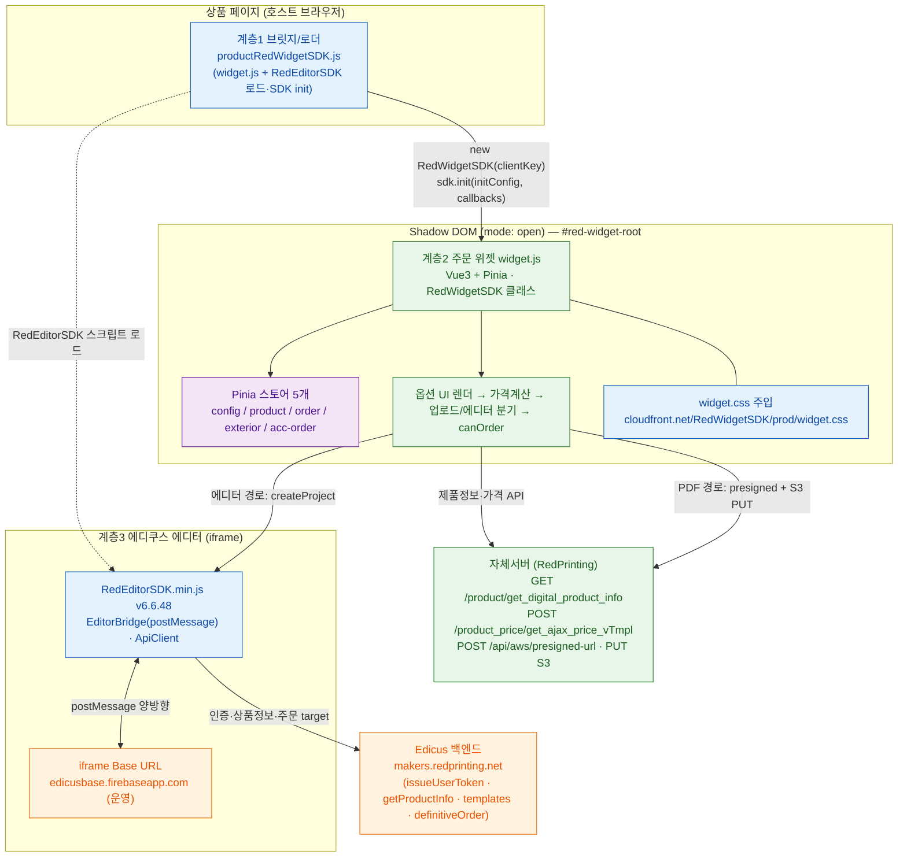
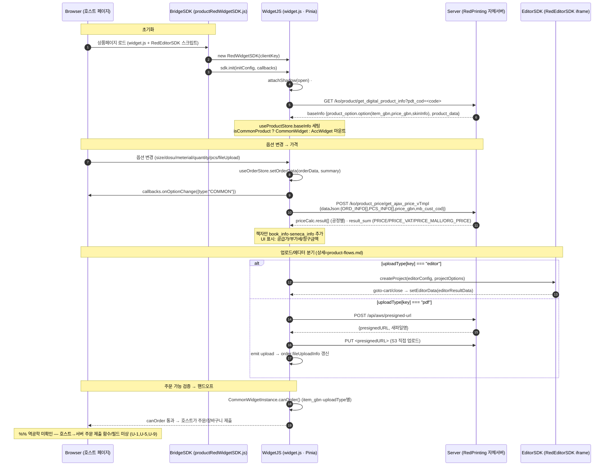
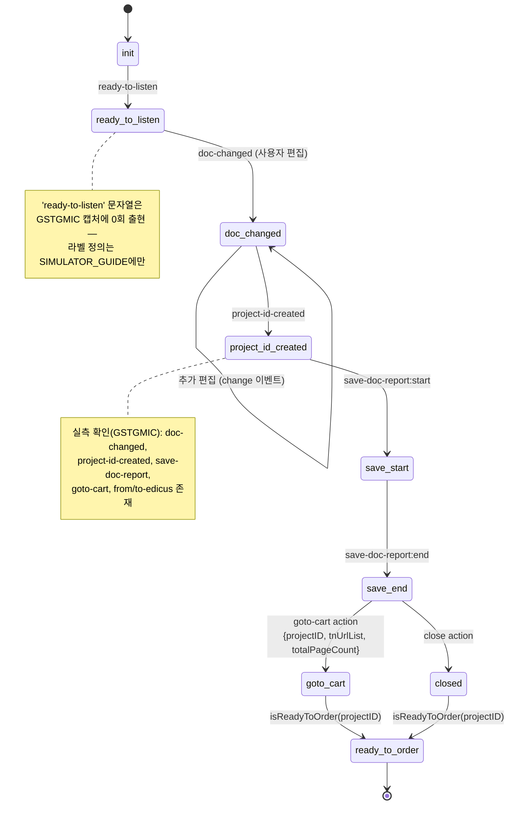
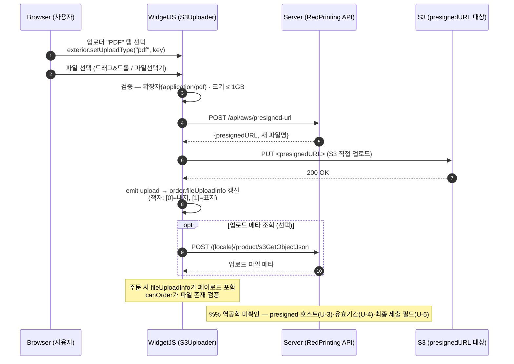

# 00_architecture.md — RedPrinting 위젯 아키텍처 & 플로우 (개발자용 mermaid)

> 집필가: hwf-mermaid-author · 청중=개발자(정확·완전·렌더가능 우선)
> 근거=`01_curation/`(widget-architecture.md · path-branch-spec.md · unknowns-board.md)
> [HARD] 팩에 있는 노드·화살표·조건만. 팩이 "모름"이라 한 것은 **점선 엣지 + `%% 역공학 미확인`** 으로 표기(확정사실 아님).
> 미상 항목 키(U-1~U-14)는 `unknowns-board.md` 참조.

---

## (a) 전체 아키텍처 flowchart — 3계층 + Shadow DOM 경계 + 출처(CDN/자체서버)

3계층 구조: ① 브릿지/로더(`productRedWidgetSDK.js`) → ② 주문 위젯(`widget.js`, Vue3+Pinia, Shadow DOM open) → ③ 에디쿠스 에디터(`RedEditorSDK.min.js` v6.6.48, iframe). 출처는 `classDef`로 구분(CDN=cloudfront / 자체서버=redprinting / Edicus백엔드=makers·firebase).

**개발자 노트 (출처·계약):**
- **계층1 → 계층2 진입**: `new RedWidgetSDK(clientKey)` (clientKey ∈ {`"red-pc"`,`"red-mobile"`}, 그 외 throw) → `sdk.init({target,pdtCode,pttCode,locale="ko",member,deviceType="pc"}, callbacks)`. `target`에 `attachShadow({mode:"open"})` → `
` → Vue mount. 전역 `window.RedWidgetSDK` 노출. (deob_06:30-103)
- **Shadow DOM 경계**: 위젯 UI 전체가 open-mode Shadow Root 내부. CSS는 cloudfront CDN `widget.css`를 Shadow Root에 링크 주입(호스트 페이지 스타일 격리). (deob_06:98,1389-1391)
- **출처 분리**: CDN(파랑)=`d2vgy67dgpwzce.cloudfront.net` SDK/CSS · 자체서버(초록)=RedPrinting 제품/가격/presigned API · Edicus(주황)=`makers.redprinting.net` + `edicusbase.firebaseapp.com` iframe.
- `%% 역공학 미확인` — 계층1 `productRedWidgetSDK.js`는 이름만 확인(monitor_report.md:14)되고 자체 소스 라인 근거 없음(**U-12**). 브릿지 역할 서술은 문서 기반.

---

## (b) 초기화 → 옵션 → 가격 → 주문 sequenceDiagram

participant: Browser(호스트), BridgeSDK(계층1), WidgetJS(계층2), Server(자체서버), EditorSDK(계층3).

**개발자 노트 (엔드포인트·스토어·이벤트):**
- **제품정보 API**: `GET /ko/product/get_digital_product_info?pdt_cod=<code>` → `useProductStore.baseInfo`. (deob_05:1085-1110, 응답 monitor_report.md:67-89)
- **가격 API**: `POST /ko/product_price/get_ajax_price_vTmpl`, body `{dataJson:{ORD_INFO[],PCS_INFO[],price_gbn,mb_cust_cod}}`. 응답 `result[]`(공정별)+`result_sum`(합계); 책자만 `book_info`,`seneca_info`. (deob_05:1129-1154, monitor_report.md:142-160)
- **스토어 변화**: 옵션 변경 → `useOrderStore.setOrderData()`가 `callbacks.onOptionChange({type:"COMMON"})` 자동 호출(부자재=ACC). (deob_06:822-842, 850-869)
- **가격 표시 우선순위**(할인/몰가): `CommonWidgetInstance` deob_06:1273-1285 / `Acc` 1336-1339.
- `%% 역공학 미확인` — **U-1**(`sdkCreatePot` 라인 근거 없음·시뮬레이터 문서에만), **U-5**(PDF 주문 최종 제출 필드), **U-9**(호스트↔위젯 주문 핸드오프). 점선 처리한 마지막 단계가 이에 해당. Edicus 측 최종 주문은 `definitiveOrder` target으로만 확인(deob_editor_sdk.js:2784).

---

## (c) 에디쿠스 라이프사이클 stateDiagram-v2

iframe postMessage 라이프사이클: `init → ready-to-listen → doc-changed → project-id-created → save-doc-report → goto-cart`. 정의 출처=`SIMULATOR_GUIDE.md:35-40`.

**개발자 노트 (이벤트·target):**
- **라이프사이클 정의**: `SIMULATOR_GUIDE.md:35-40`. `save-doc-report`(status="end") → `{message,projectId,data{...mode,deviceTarget}}` 구성 → `close`/`goto-cart` action이면 `isReadyToOrder(projectID)` 호출. (deob_editor_sdk.js:11385-11398)
- **goto-cart 페이로드**: `{projectID, tnUrlList, totalPageCount}`. (SIMULATOR_GUIDE.md:41, deob_editor_sdk.js:11393)
- **SDK 수신 이벤트 22종**(`on(eventType,cb)`): create, close, load, change, save, select, historyState, historyLabel, promoReport, error, imagePool, previewClose, fontList, changeMode, pageCountChange, pageChange, groupCaption, imposeOpened, printCountChange, customTabSelectionChange, docReport, all. (editor_sdk_method_catalog.md:233-242, deob_editor_sdk.js:11463-11470)
- **주문 target**: `tentativeOrder`(임시) / `definitiveOrder`(확정) / `isReadyToOrder`(가능검사) / `cancelOrder`. (deob_editor_sdk.js:2784)
- `%% 역공학 미확인` — `ready-to-listen` 상태는 캡처 미출현(SIMULATOR_GUIDE 라벨 정의에만 존재). 점선/note로 표기.

---

## (d) PDF 업로드 presigned 시퀀스

PDF 탭 경로: 파일선택 → 검증 → presigned-url 발급 → S3 PUT 직접 업로드 → emit → fileUploadInfo 갱신.

**개발자 노트 (엔드포인트):**
- **5단계 업로드**: 파일선택 → 검증(확장자/1GB) → `POST /api/aws/presigned-url`(presigned URL+새파일명) → `PUT presignedURL`(S3 직접) → emit. (deob_06:542-561, 1GB 에러 deob_05:1412)
- **슬롯 갱신**: emit → `order.fileUploadInfo`. 책자는 `[0]`=내지(inner), `[1]`=표지(default). (deob_06:558-559, 1180-1181)
- **메타 조회(선택)**: `POST /{locale}/product/s3GetObjectJson`. (deob_05:1167-1184)
- `%% 역공학 미확인` — **U-3**(엔드포인트 표기차 `/api/aws/presigned` vs `/api/aws/presigned-url`, 절대 호스트 미확정), **U-4**(presigned URL 유효기간 모름), **U-5**(주문 최종 제출 시 s3FileUrl 필드·엔드포인트 라인 근거 없음). presigned 호스트 화살표는 점선 처리 대상.

---

## 부록 — 미상 항목 점선 처리 인덱스

| 도해 | 점선/note 처리 | 미상 키 |
|------|----------------|---------|
| (a) 아키텍처 | 계층1 `productRedWidgetSDK.js` 소스 근거 없음 | U-12 |
| (b) 시퀀스 | 호스트→서버 주문 제출 함수·페이로드 | U-1, U-5, U-9 |
| (c) 라이프사이클 | `ready-to-listen` 캡처 미출현(라벨 정의만) | (U-1 인접) |
| (d) presigned | presigned 호스트·유효기간·최종 제출 필드 | U-3, U-4, U-5 |

> 상품군별 분기(uploadType editor/pdf 자동/수동 규칙 U-2, 신위젯 적용 범위 U-14)는 `product-flows.md`에서 점선 처리.
</content>
</invoke>
