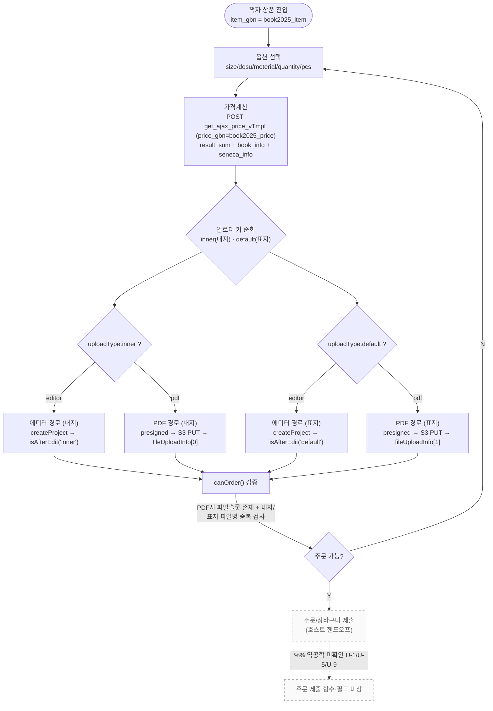
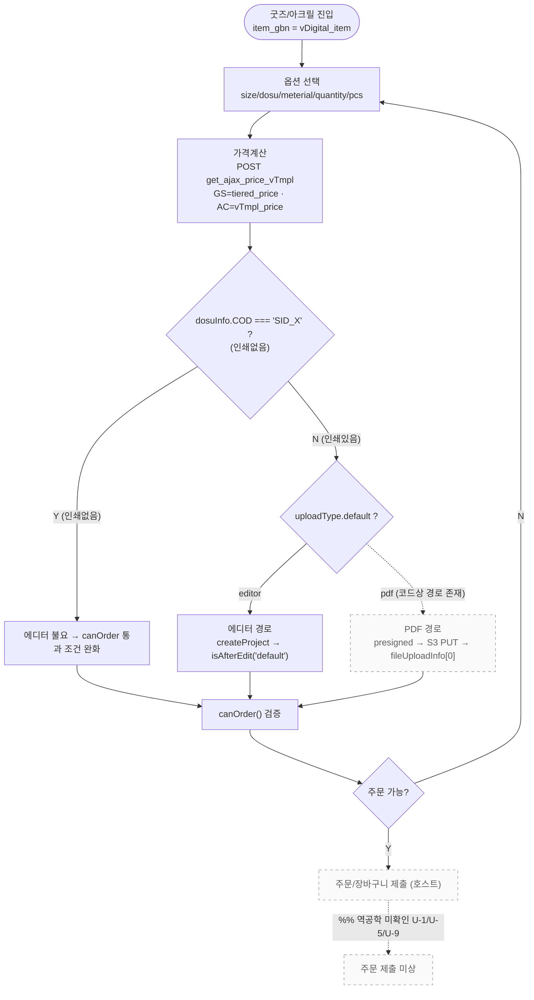
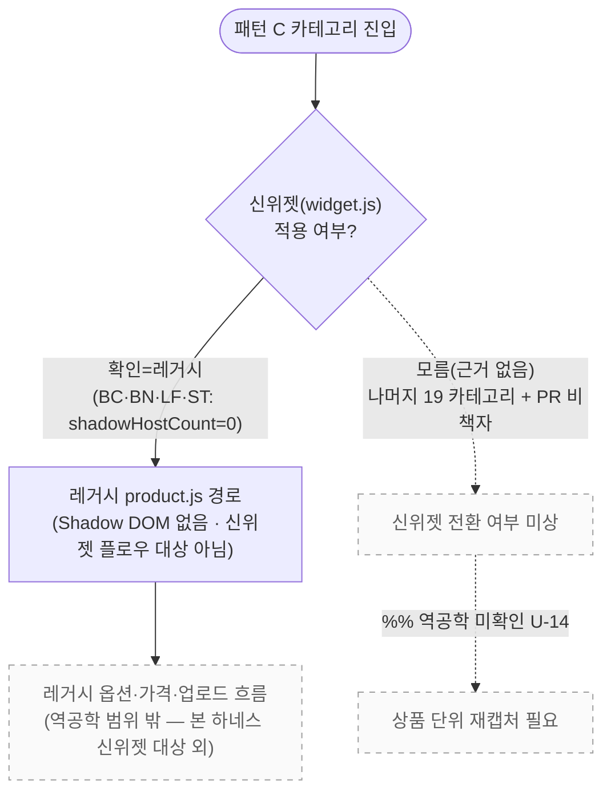

# product-flows.md — 상품군별 경로 분기 (26 카테고리 패턴 분류)

> 집필가: hwf-mermaid-author · 청중=개발자
> 근거=`01_curation/product-path-matrix.csv` · `path-branch-spec.md` · `unknowns-board.md`
> [HARD] 분기 결정요인 = `item_gbn`(상품유형) + `exterior.uploadType[key]`(키별 editor/pdf). 팩에 없는 분기 창작 금지.
> confidence=추정/모름인 카테고리는 그 사실을 표기. 미상은 점선 + `%% 역공학 미확인`.

---

## 0. 분기 결정요인 (확인된 사실)

| 결정요인 | 값 | 효과 | 근거 |
|----------|-----|------|------|
| `exterior.uploadType[key]` | `"editor"` \| `"pdf"` | 업로더 탭 = 에디쿠스 vs PDF 경로 | deob_06:781-787 |
| `uploadType` 기본값 | `{default:"editor"}` | 초기 탭 = **에디터** | deob_06:781-783 |
| 업로더 키 | `"default"`(표지) / `"inner"`(내지) | 책자는 내지·표지 2개 독립 분기 | deob_06:1174-1182 |
| `item_gbn` | `book2025_item` / `vDigital_item` / `clothes2025_item` | canOrder 검증 경로 분기 | deob_06:1169-1203 |
| Edicus `editor` 필드 | `"template"` / `"upload"` | Edicus 상품 템플릿형/업로드형 | editor_api_analysis.md:66,102 |

> `%% 역공학 미확인` — uploadType을 editor/pdf로 **자동 vs 수동 결정하는 규칙**(어떤 상품이 PDF 탭만/에디터 탭만/둘 다)의 단일 코드 라인 근거 없음(**U-2**). `uploadConfig{editor,pdf,token}`(buildUploadConfig)에 의존하나 구현 생략(deob_06:580-590,612-622). → 상품 단위 가용성은 추정/모름.

---

## 1. 패턴 분류 요약 (커버리지 = 26 카테고리 전수)

3개 분기 패턴으로 그룹핑. **26 카테고리 전부**가 어느 패턴에 속하는지 빠짐없이 명시.

| 패턴 | 정의 | item_gbn | 직접증거 카테고리 | 추정/모름 포함 |
|------|------|----------|-------------------|----------------|
| **A** | 에디터 + 업로드 **둘 다**(책자: 내지·표지 각각 분기) | `book2025_item` | **PR**(PRBK* 6종 확인) | PR 비책자=추정(레거시) |
| **B** | 에디터 + 코드상 PDF 경로 존재(굿즈/아크릴) | `vDigital_item` | **GS**(GSTGMIC), **AC**(ACNTHAP) | GS/AC 카테고리 전상품=추정 |
| **C** | 레거시(product.js, Shadow DOM 없음) / 신위젯 미확인 | N/A 또는 모름 | **BC·BN·LF·ST**(레거시 캡처 확인) | 나머지 카테고리=모름(근거 없음) |

### 1.1 카테고리 → 패턴 매핑 (26/26)

| # | 카테고리 | 패턴 | item_gbn | confidence | 근거 |
|---|----------|------|----------|-----------|------|
| 1 | **AC** 아크릴 | B | vDigital_item | **확인**(ACNTHAP) / 카테고리 전상품=추정 | ACNTHAP_cascade.json |
| 2 | **AH** 점착 | C | 모름 | **모름(근거 없음)** | monitor_report.md:10-18 |
| 3 | **AI** 에코백류 | C | 모름 | **모름(근거 없음)** | monitor_report.md:10-18 |
| 4 | **BC** 명함 | C | N/A(레거시) | **확인=레거시**(BCSPDFT/BCSPHIG shadowHostCount=0) | BCSPDFT/BCSPHIG_capture.json |
| 5 | **BN** 배너 | C | N/A(레거시) | **확인=레거시**(BNSTDFT shadowHostCount=0) | BNSTDFT_capture.json |
| 6 | **BT** 버튼 | C | 모름 | **모름(근거 없음)** | monitor_report.md:10-18 |
| 7 | **CL** 의류류 | C | 모름 | **모름(근거 없음)** | monitor_report.md:10-18 |
| 8 | **EN** 봉투 | C | 모름 | **모름(근거 없음)** | monitor_report.md:10-18 |
| 9 | **ET** 손목띠류 | C | 모름 | **모름(근거 없음)** | monitor_report.md:10-18 |
| 10 | **FB** 패드류 | C | 모름 | **모름(근거 없음)** | monitor_report.md:10-18 |
| 11 | **FS** 패브릭 | C | 모름 | **모름(근거 없음)** | monitor_report.md:10-18 |
| 12 | **GS** 굿즈 | B | vDigital_item | **확인**(GSTGMIC) / 카테고리 전상품=추정 | GSTGMIC_cascade.json |
| 13 | **HL** 합판전단 | C | 모름 | **모름(근거 없음)** | monitor_report.md:10-18 |
| 14 | **LF** 전단 | C | N/A(레거시) | **확인=레거시**(LFXXXXX shadowHostCount=0) | LFXXXXX_capture.json |
| 15 | **ME** 봉투류 | C | 모름 | **모름(근거 없음)** | monitor_report.md:10-18 |
| 16 | **NC** 명함(옵셋) | C | 모름 | **모름(근거 없음)** | monitor_report.md:10-18 |
| 17 | **OT** 기타 | C | 모름 | **모름(근거 없음)** | monitor_report.md:10-18 |
| 18 | **PD** 가구류 | C | 모름 | **모름(근거 없음)** | monitor_report.md:10-18 |
| 19 | **PH** 포토보드 | C | 모름 | **모름(근거 없음)** | monitor_report.md:10-18 |
| 20 | **PM** 포트폴리오 | C | 모름 | **모름(근거 없음)** | monitor_report.md:10-18 |
| 21 | **PO** 포맥스류 | C | 모름 | **모름(근거 없음)** | monitor_report.md:10-18 |
| 22 | **PR** 책자/리플렛 | **A**(책자) + C(비책자) | book2025_item(책자) / 모름(비책자) | **확인=책자 6종**(PRBK*) / 비책자=추정 레거시 | PRBK*_cascade.json; PRLFXXX_capture.json |
| 23 | **PV** 카드 | C | 모름 | **모름(근거 없음)** | monitor_report.md:10-18 |
| 24 | **SK** 스티커(옵셋) | C | 모름 | **모름(근거 없음)** | monitor_report.md:10-18 |
| 25 | **ST** 스티커 | C | N/A(레거시) | **확인=레거시**(STDRCAD shadowHostCount=0) | STDRCAD_capture.json |
| 26 | **TP** 디자인명함 | C | 모름 | **모름(근거 없음)** | monitor_report.md:10-18 |

**커버리지 확인: 26/26 카테고리 분류 완료.**
- 패턴 A: 1 카테고리(PR 책자분).
- 패턴 B: 2 카테고리(GS, AC).
- 패턴 C: 23 카테고리(AH·AI·BC·BN·BT·CL·EN·ET·FB·FS·HL·LF·ME·NC·OT·PD·PH·PM·PO·PV·SK·ST·TP) + PR 비책자분.
- (PR은 책자분=A, 비책자분=C로 양쪽에 걸침.)

> `%% 역공학 미확인` — **U-14**: monitor_report.md:17="새 위젯 확인 상품 약 25개(18 책자 + GS + AC)". GS(136)·AC(20) 카테고리 **전 상품**이 신위젯인지 일부만인지 상품 단위 근거 없음 → 카테고리 행은 "추정". 나머지 22 카테고리 + PR 비책자는 레거시 추정이나 신위젯 전환분 존재 가능성 미상 → "모름(근거 없음)". BC/BN/LF/ST는 캡처로 레거시 "확인".

---

## 2. 패턴 A — 책자 (book2025_item): 에디터 + 업로드 둘 다 · 내지/표지 독립 분기

소속: **PR 카테고리의 책자 상품**(PRBKYPR/PRBKYRN/PRBKYSL/PRBKORD/PRBKOPR/PRBKOST — 6종 확인, price_gbn=`book2025_price`).
핵심: 업로더 키가 `inner`(내지)·`default`(표지) **2개**이고 각각 editor/pdf로 독립 분기.

**개발자 노트:**
- **canOrder(책자)**: `uploadType`을 키별(inner/default) 순회 — `editor`면 `isAfterEdit(key)`, `pdf`면 해당 파일 슬롯 존재 + 내지/표지 파일명 중복 검사. (deob_06:1174-1189)
- **파일 슬롯**: `fileUploadInfo[0]`=내지, `[1]`=표지. (deob_06:1180-1181)
- **가격**: `book2025_price`, 응답에 책자 전용 `book_info`/`seneca_info`. (monitor_report.md:142-160,166-170)
- 점선 종단(ORDER→HOST)=호스트 주문 제출 미상(U-1/U-5/U-9).

---

## 3. 패턴 B — 굿즈/아크릴 (vDigital_item): 에디터 + 코드상 PDF 경로

소속: **GS 카테고리**(GSTGMIC 마이크 네임택, price_gbn=`tiered_price`) · **AC 카테고리**(ACNTHAP 아크릴 명찰, price_gbn=`vTmpl_price`).
핵심: 업로더 키 `default` 1슬롯. `uploadType.default` editor/pdf. 인쇄없음(`dosuInfo.COD==="SID_X"`)이면 에디터 불요.

**개발자 노트:**
- **canOrder(vDigital)**: `uploadType.default==="pdf"`면 `fileUploadInfo[0]` 필수. `editor`이고 `!isAfterEdit()`이고 인쇄있음(`dosuInfo.COD!=="SID_X"`)이면 에디터 편집 필요. (deob_06:1192,1203)
- **PDF 경로 점선 처리 이유**: 코드상 vDigital_item도 `uploadType.default==="pdf"` 분기 존재(deob_06:1192)하나, 상품 단위로 PDF 탭이 실제 노출되는지는 `uploadConfig` 설정에 달려 있고 출처 라인 근거 없음 → **"vDigital_item=에디터 전용" 단정 불가**(**U-10**). PDF 경로 엣지를 점선으로 표기.
- **price_gbn 불일치 주의**: monitor_report.md:170은 AC를 `tiered_price`로 적었으나 ACNTHAP 캡처는 `vTmpl_price` → 캡처 권위 채택(**U-8**). 도해에 캡처값(vTmpl_price) 반영.

---

## 4. 패턴 C — 레거시 / 신위젯 미확인 (23 카테고리 + PR 비책자)

소속: AH·AI·BC·BN·BT·CL·EN·ET·FB·FS·HL·LF·ME·NC·OT·PD·PH·PM·PO·PV·SK·ST·TP (+ PR 비책자).
핵심: 레거시 `product.js`(Shadow DOM 없음)로 추정 또는 모름. 신위젯 플로우 대상 아님(또는 미확인).

**개발자 노트:**
- **레거시 확인분(BC/BN/LF/ST)**: 캡처에서 `shadowHostCount=0`, `mountPoints=[]` → 레거시 `product.js`(Shadow DOM 없음). 신위젯 위젯 플로우 대상 아님. (각 *_capture.json; monitor_report.md:10-18)
- **모름분(나머지 19 + PR 비책자)**: monitor_report.md:10-18은 "명함/전단/스티커/배너 등 400+=레거시 product.js"로 일반화하나, 카테고리 내 신위젯 전환 상품 존재 가능성은 상품 단위 근거 없음 → **모름(근거 없음)**. 결론으로 위장 금지.
- **PR 비책자(리플렛 등 PRLFXXX)**: PR 카테고리 중 책자 PRBK*만 신위젯 확인. 리플렛 등 나머지는 레거시 추정(PRLFXXX_capture.json 레거시). (**U-11**: `LFXXXXX`/`PRLFXXX`의 `XXXXX`는 캡처용 자리표시자)
- 전체 박스가 점선/dim 처리 — 이 패턴은 확정 플로우가 아니라 "레거시 또는 미상" 상태.

---

## 5. 미상 항목 점선 처리 인덱스 (product-flows)

| 위치 | 점선 처리 | 미상 키 |
|------|-----------|---------|
| §1.1 카테고리 매핑 | GS/AC 카테고리 전상품 신위젯 여부, 나머지 22+PR비책자 | U-14 |
| §0/§3 | uploadType editor/pdf 자동·수동 결정 규칙 | U-2 |
| §3 패턴 B | vDigital_item PDF 경로(상품 단위 가용성) | U-10 |
| §3 패턴 B | AC price_gbn(vTmpl_price 캡처 권위) | U-8 |
| §2·§3 종단 | 호스트 주문 제출 함수·필드 | U-1, U-5, U-9 |
| §4 패턴 C | 레거시 vs 신위젯 전환 여부 | U-11, U-14 |

> 확정 플로우(렌더 가능·근거 있는 실선)는 패턴 A(책자) 전체와 패턴 B(에디터 경로·canOrder)만. PDF 가용성·레거시 전환·주문 제출은 모두 점선 + `%% 역공학 미확인`.
</content>
