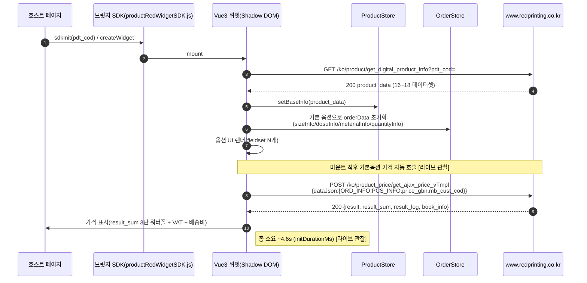
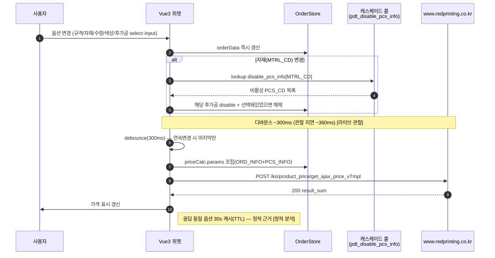
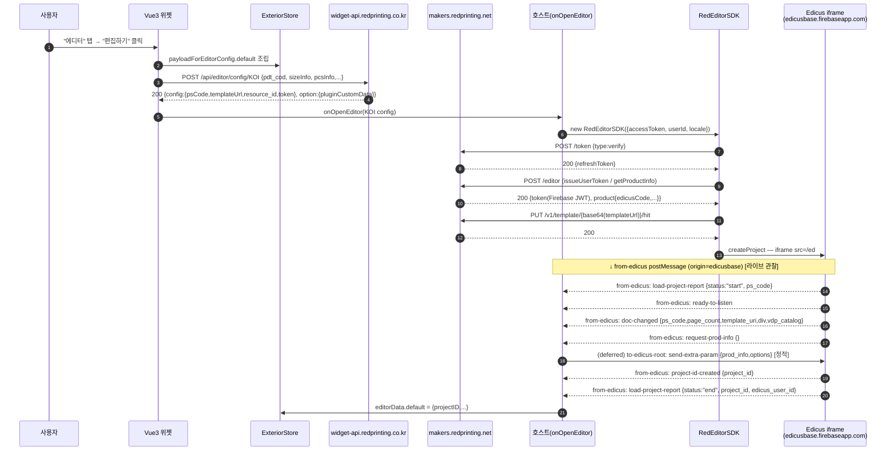
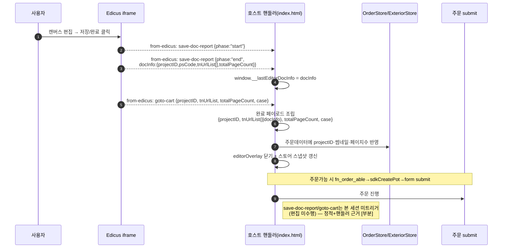
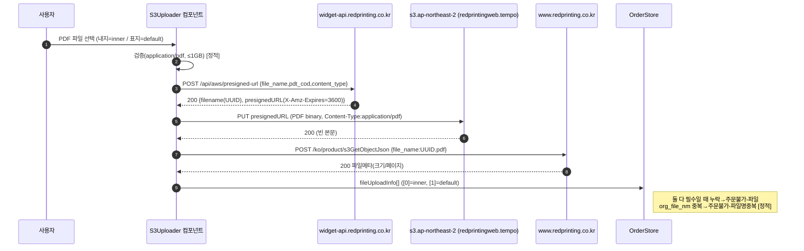
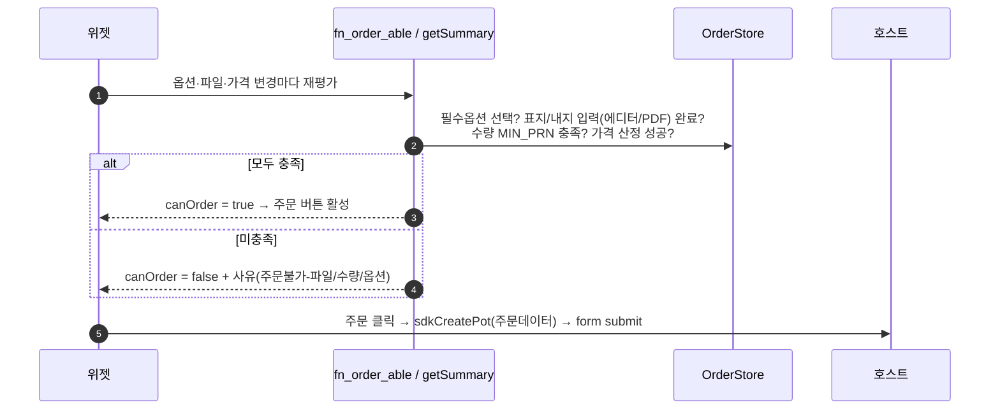

# 시퀀스 다이어그램 (구현 등급)

> 파이프라인 ② 산출물. 모든 다이어그램은 라이브 관찰(`02_analysis/captures/`) 또는 Phase 1 캡처에 근거.
> 근거: `[라이브 관찰]` 본 세션 실측 / `[정적+라이브]` Phase 1 재확인 / `[정적 분석]` deob 소스.
> 식별자(함수·엔드포인트·이벤트)는 후니 구현가가 직접 참조 가능하도록 실제 명칭 사용.

---

## 1. 초기화 (상품 선택 → 위젯 마운트 → 첫 가격) [라이브 관찰]

## 2. 옵션 변경 → 가격 재계산 (디바운스) [라이브 관찰]

## 3. 에디터 열기 (표지 디자인) [라이브 관찰 — 잔존#1 해소]

## 4. 에디터 저장 → 장바구니 (편집 완료) [정적 + 테스트베드 핸들러]

## 5. PDF 업로드 (S3 presigned) [정적+라이브, Phase 1]

## 6. 주문 가능성 판정 (canOrder) [정적 분석]

---

## 참고: 호스트 ↔ 에디터 메시지 방향 요약 [정적+라이브]

| 방향 | type | 라이브 관찰 액션 |
|------|------|----------------|
| iframe→호스트 | `from-edicus` | load-project-report, ready-to-listen, doc-changed, request-prod-info, project-id-created [라이브] / save-doc-report, goto-cart, close [정적] |
| iframe→호스트 | `from-edicus-private` | waiting-for-extra-param, waiting-for-ddp-data (SDK 자체처리) [정적] |
| 호스트→iframe | `to-edicus-root` | send-extra-param, send-ddp-data, change-project [정적] |
| 호스트→iframe | `to-edicus` | change-layout, set-item-attribute, add-page ... [정적] |
