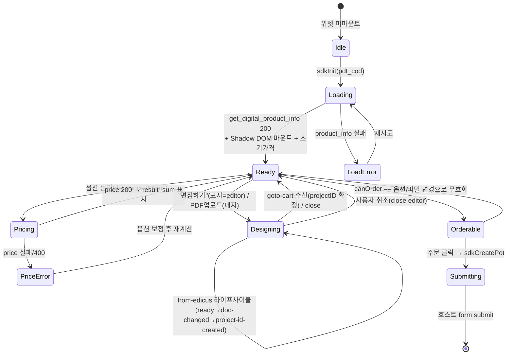
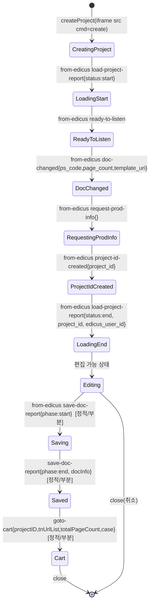

# 주문 상태 머신 (옵션 선택 ~ canOrder)

> 파이프라인 ② 산출물. 위젯 전역 상태 전이 + 주문 가능성(canOrder) 판정 조건.
> 근거: `[라이브 관찰]` 본 세션 스토어·라이프사이클 / `[정적 분석]` deob getSummary/canOrder / `[정적+라이브]` Phase 1.

---

## 1. 위젯 전역 상태 머신 [라이브 관찰 + 정적]



## 2. 에디터 서브 라이프사이클 (from-edicus 상태) [라이브 관찰]



> 라이브 관찰: `CreatingProject → ... → LoadingEnd` 까지 6 이벤트 실측. `Editing → Saving → Saved → Cart`는 실제 편집·저장·장바구니 액션을 트리거해야 발생 — 본 세션 미관찰([부분], 정적+핸들러 근거).

## 3. 상태 전이 조건 표 [라이브 관찰 + 정적]

| From | To | 조건(트리거) | 부작용(스토어/API) |
|------|----|-----------|------------------|
| Idle | Loading | sdkInit(pdt_cod) | — |
| Loading | Ready | product_info 200 + 마운트 | ProductStore.baseInfo, OrderStore 초기화, 초기 price |
| Ready | Pricing | 옵션 변경 이벤트 | OrderStore.orderData 갱신 + 캐스케이드 적용 |
| Pricing | Ready | price 200 | result_sum 표시, priceCalc 보관 |
| Ready | Designing | 편집하기/PDF선택 | editor/config 또는 presigned 호출 |
| Designing | Designing | from-edicus 메시지 | exterior.editorData 갱신 |
| Designing | Ready | goto-cart / close | projectID·tnUrlList·totalPageCount 반영 |
| Ready | Orderable | canOrder==true (아래 §4) | 주문 버튼 활성 |
| Orderable | Submitting | 주문 클릭 | sdkCreatePot(주문데이터) |
| Submitting | (종료) | form submit | 호스트로 위임 |

## 4. canOrder 판정 조건 (getSummary/fn_order_able) [정적 분석 + 라이브 데이터]

주문 가능 = 아래 must-pass 전부 충족:

```
canOrder = AND(
  옵션완결:    필수 옵션(규격·자재·도수) 모두 선택됨,
  수량유효:    minPrintCount ≤ prnCnt 이고 FIR/INC/STEP 규칙 충족,
  페이지유효:  (책자) minInnerPage ≤ pageCnt ≤ maxInnerPage,
  표지입력:    exterior.uploadType.default 경로 완료
                 - editor: editorData.default.projectID 존재(goto-cart 수신)
                 - pdf:    fileUploadInfo[표지] 업로드 완료,
  내지입력:    (책자) exterior.uploadType.inner 경로 완료
                 - pdf:    fileUploadInfo[내지] 업로드 완료,
  파일무결성:  표지·내지 org_file_nm 중복 아님,
  가격산정:    price API 200 + result_sum.PRICE > 0
)
```

### 주문불가 사유 코드 [정적 분석]
| 사유 | 조건 |
|------|------|
| `주문불가-파일` | 필수 파일(표지/내지) 누락 |
| `주문불가-파일명중복` | 내지·표지 org_file_nm 동일 |
| `주문불가-수량` | prnCnt < MIN_PRN 또는 STEP 위반 |
| `주문불가-옵션` | 필수 옵션 미선택 |

> 라이브 근거: 책자 exterior.uploadType={default:editor, inner:pdf}로 **표지·내지 입력 수단 이원화**가 확정되어, canOrder는 면별 입력완료를 각각 검사해야 함. [라이브 관찰]

## 5. 상품군별 canOrder 차이 [라이브 관찰]

| 상품군 | 표지/내지 | 에디터 | canOrder 입력 체크 |
|--------|----------|--------|-------------------|
| 책자(PRBKYPR) | 분리(default+inner) | 표지=editor, 내지=pdf | 양면 입력 완료 필요 |
| 굿즈(GSTGMIC) | 단일 | editor(KOI) 또는 PDF | 단일 면 입력 |
| 아크릴(ACNTHAP) | 단일 + option_info(제작방식/형태) | template | 제작방식·형태·인쇄데이터 |
| 부자재(ACC) | subMtrlInfo | — | acc-order canOrder(getSummary) [정적] |

## 6. 잔존 미검증
- `getSummary`/`canOrder` 실 boolean 전이 라이브 관찰 — 본 세션 주문 미진행. 조건은 정적 + 라이브 스토어 구조 근거. [정적]
- save→goto-cart 후 canOrder=true 전이 실측 미수행. [부분]
