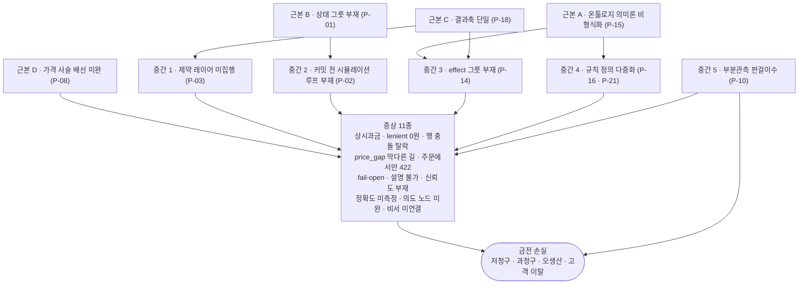
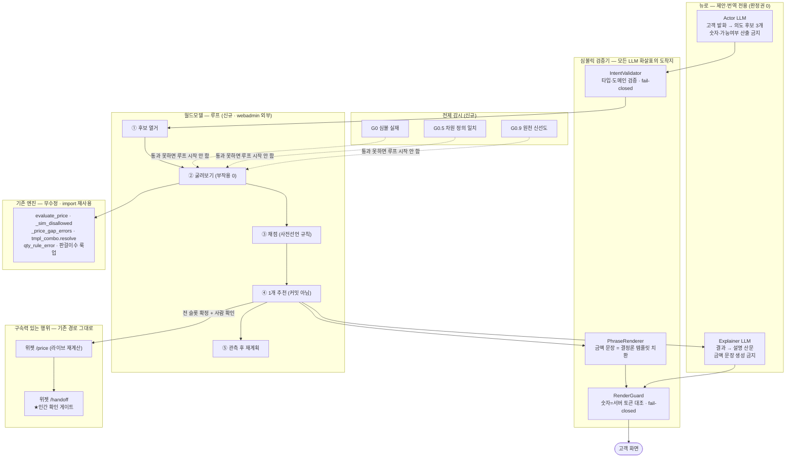

# 뉴로-심볼릭 월드모델과 후니프린팅

> 종합 리서치 리포트 · 2026-08-15
> 원본 15편(이론 7 · 진단 8) + 문제 원장 + 평가 루브릭 + 최종 설계 + 게이트 판정을 하나로 종합한 문서.
> 대상 독자: 인쇄 도메인은 아는데 AI 아키텍처는 처음 보는 의사결정자.
> [규율] 확인한 사실과 추정을 섞지 않는다. 추정에는 **[추정]** 배지를 붙인다. 모든 사실 주장에는 근거 파일·라인을 단다.
> 원본 15편은 삭제하지 않았다. 본문 각 절에서 경로로 링크한다.

---

## 요약

**한 문장.** 후니프린팅에는 "고객이 옵션을 고르면 얼마인가"를 실행 없이 계산하는 기계가 **이미 라이브에서 돌고 있고**, 빠진 것은 그 기계를 **고르기 전에 미리 굴려 보는 루프**다.

### 다섯 줄 결론

1. **"월드모델(world model, 행동의 결과를 실제로 해 보기 전에 머릿속에서 계산하는 내부 모델)이 없다"는 말은 틀렸다.** 라이브 코드에 결과를 미리 계산하는 결정론(같은 입력이면 늘 같은 답) 함수가 최소 4개 실재한다 — 가격 계산기 `evaluate_price`, 제약 시뮬레이터 `_sim_disallowed`, 판형·판걸이수 함수 `fn_best_plate`/`fn_calc_pansu`, 삭제 영향 사전집계 `delete_usage`. (근거: `_workspace/huni-worldmodel/03_problem/problem-ledger.md:36-45`)

2. **그러나 그 월드모델은 결과축이 "가격" 하나뿐이고, 커버리지가 59.4%이며, 서로 결합되지 않았고, 계획에 쓰이지 않는다.** 라이브 288개 상품 중 가격공식이 연결된 것이 171개(59.4%)이고, "이 조합은 못 만든다"는 제약규칙을 가진 상품은 34개(11.8%)뿐이며, 제약을 위반한 조합의 가격이 태연히 계산된다. (근거: `02_diagnosis/D8-live-schema.md:79,130`, `02_diagnosis/D2-pricing-engine.md:290`)

3. **정확한 진단은 "모델이 없다"가 아니라 "모델을 쓰는 루프와 그 루프가 딛고 설 상태(state)가 없다"이다.** 적재(데이터 넣는) 작업에는 이미 "커밋 전에 시뮬레이터로 확인" 규율이 있고, **고객 견적 경로에만 없다.** (근거: `problem-ledger.md:62-65`)

4. **제안하는 것은 새 AI가 아니다.** 이미 있는 결정론 엔진 6종을 **한 줄도 고치지 않고 불러다 묶어**(import) 하나의 "부작용 없는 전이함수"로 만들고, 고객이 옵션을 하나 고를 때마다 다음 후보들을 **선택 전에 전부 굴려 비교 제시**하는 얇은 계층을 webadmin 바깥에 얹는 것이다. 라이브 DB에 단 한 행도 쓰지 않는다. (설계: `04_design/design-FINAL.md:23`)

5. **이 설계는 사전 선언한 18개 규칙으로 적대적 검증을 받았고 판정은 CONDITIONAL_GO(조건부 통과)다.** 3개 렌즈 × 2개 독립 검증자(그중 하나는 외부 모델 codex-cli gpt-5.5 xhigh)가 19건을 제기했고, **설계 뼈대를 무너뜨린 지적은 0건**, 확정 위반 5건은 전부 문서 교정으로 닫힌다. 다만 **설계의 중심 논지를 재는 규칙 하나(RULE-03)가 검증되지 않은 채 남았고**, 그 보충이 조건에 포함됐다. (근거: `05_gate/gate-report.md:341-351`)

### 이 리포트가 정직하게 남기는 세 가지

- **저청구가 사라지는 것이 아니라 보이게 될 뿐이다.** 판별차원 0 구성요소 상시 과금(동판비가 박 미선택 주문에도 5,000~64,000원 붙는 형태)은 이 설계가 **탐지**하지만 **고치지는 않는다.** 충전은 다른 트랙 소관이다. (`design-FINAL.md:739`)
- **관측 채널이 얇다.** "고객이 실제로 무엇을 골랐고 그 주문이 어떻게 됐는가"를 담을 주문 테이블 자체가 라이브에 없다. 예측은 남기지만 대조할 실제 데이터가 구조적으로 부족하다. (`design-FINAL.md:735`)
- **이 설계가 성공해도 그것이 "AI가 잘한다"의 증거가 아닐 수 있다.** 이미 있는 엔진이 좋았을 뿐일 수 있고, 설계 스스로 그것을 수치로 정산하는 게이트(G9)를 자기에게 걸어 두었다. (`design-FINAL.md:761-763`)

---

## 1부 이론 — 뉴로심볼릭·월드모델이 무엇인가

### 1.1 월드모델 = "판 걸기 전에 결과를 아는 것"

**월드모델(world model)**은 한 문장으로 정의된다: **행동의 결과를 실제로 실행하기 전에 내부에서 예측하는 모델.**

인쇄로 옮기면 이미 우리가 매일 하는 일이다.

| 인쇄 현장의 것 | 월드모델 용어 |
|---|---|
| 판을 걸기 전에 조판(임포지션) 시뮬레이션으로 "이 사이즈면 한 판에 몇 장 앉나"를 미리 본다 | **전이함수** f(상태, 행동) → 다음 상태 |
| "이 종이에 이 후가공 넣으면 안 된다"는 실무진의 판단 | **전제조건(precondition)** |
| "코팅 넣으면 단가가 이만큼 붙고 납기가 하루 늘어난다" | **효과(effect)** |
| 견적서를 뽑아 보고 아니면 옵션을 바꿔서 다시 뽑는다 | **롤아웃(rollout) + 재계획** |

학술 계보에서 이 정의를 정본으로 세운 것은 Ha & Schmidhuber의 2018년 논문 「World Models」다. 이 논문의 유명한 문장이 "에이전트를 **자기 월드모델이 만든 꿈 안에서 전부 학습시킨 뒤** 실제 환경으로 정책을 옮길 수 있다"이다(WebFetch로 초록 직접 확인). 여기서 중요한 것은 방법이 아니라 **발상**이다 — 실제로 해 보기 전에 머릿속에서 굴려 본다.

> 📌 **인쇄 도메인에 이식할 것은 신경망이 아니라 이 발상이다.** 후니의 월드모델은 학습된 신경망일 필요가 전혀 없다. 후속 연구가 명시했듯 **"월드모델이 반드시 신경망일 필요는 없다 — SQL 함수도, 제약 솔버도, 룩업 테이블도 여기에 꽂힌다."** (`01_research/R2-world-model-theory.md:208`)

### 1.2 뉴로와 심볼릭 — 영업사원과 견적서 엑셀

**뉴로(neuro)**는 신경망·LLM(대규모 언어모델, ChatGPT 같은 것)처럼 **데이터에서 감을 배운 층**이다. 모호한 말을 알아듣고, 비슷한 것을 찾고, 후보를 만들어 낸다. 대신 왜 그렇게 답했는지 추적하기 어렵고, 같은 질문에 다른 답을 낼 수 있다.

**심볼릭(symbolic)**은 **규칙·계산·논리로 이루어진 층**이다. 가격표 조회, 판걸이수 계산, "이 조합은 금지"라는 규칙 판정이 전부 여기다. 느리고 답답해 보이지만 **같은 입력이면 늘 같은 답이 나오고, 왜 그 답인지 추적된다.**

인쇄 비유로 정확히 옮기면:

| | 뉴로 | 심볼릭 |
|---|---|---|
| 사람으로 치면 | 고객 전화를 받는 **영업사원** | 견적서를 뽑는 **가격표 엑셀** |
| 잘하는 것 | "명함 좀 고급스럽게 500장" 이 무슨 뜻인지 알아듣기 | 4,320원 × 판수 × 할인율 정확히 계산 |
| 못하는 것 | 금액을 정확히 기억·계산 | "고급스럽게"를 해석 |
| 틀렸을 때 | 다시 물어보면 됨 | 틀리면 **돈이 샌다** |

**뉴로-심볼릭(neuro-symbolic)**은 이 둘을 붙이는 아키텍처다. Henry Kautz가 2020년 AAAI 기념강연에서 결합 방식을 6가지로 분류했고, 여기서 **결합 방향이 곧 신뢰성 등급**이라는 결론이 나온다 — 심볼릭이 최종 통제권을 쥐는 형태는 검증 가능하고, 신경망이 최종 답을 내는 형태는 사실상 검증 불가다. (`01_research/R1-neurosymbolic-theory.md:24-37`)

**한 줄 원칙 (이 리포트 전체를 관통한다):**

> **생성은 뉴로에 열어주되, 판정·산출·기록은 심볼릭이 독점한다.** (`R1-neurosymbolic-theory.md:103`)

### 1.3 왜 LLM에게 가격을 계산시키면 안 되는가

이건 취향 문제가 아니라 **측정된 사실**이다. 세 편의 1차 연구가 각각 다른 각도에서 같은 결론에 도달한다.

**① LLM은 스스로 계획도, 자기 검증도 못한다.**
Kambhampati 외, 「Position: LLMs Can't Plan, But Can Help Planning in LLM-Modulo Frameworks」(ICML 2024). 핵심 주장을 WebFetch로 직접 확인했다: *"자기회귀 LLM은 그 자체로 계획도 자기검증도 할 수 없다(자기검증 또한 추론의 일종이므로)."* 해법은 **외부 검증기와의 양방향 결합**이다. → **LLM에게 "네 답이 맞는지 확인해 봐"라고 시키는 것은 방어선이 아니다.**

**② 같은 질문을 8번 하면 다른 답이 8번 나온다.**
τ-bench(arXiv:2406.12045). WebFetch 확인: 최신 함수호출 에이전트(gpt-4o급)조차 과제의 50% 미만을 성공하고, **8회 반복 시 일관성(pass^8)이 리테일 도메인에서 25% 미만**으로 붕괴한다. 견적으로 옮기면 **같은 고객이 같은 말을 8번 하면 견적이 8번 다르게 나온다**는 뜻이다.

**③ 챗봇의 발언은 법적 책임이 된다.**
Moffatt v. Air Canada (2024 BCCRT 149) — 항공사 챗봇이 잘못 안내한 환불 정책에 대해 **회사가 과실 부실표시 책임**을 졌고, "챗봇은 별개 법인"이라는 항변이 기각됐다. 패소 이유의 핵심이 **정적 페이지와 챗봇 답변의 불일치**였다. (`01_research/R7-agentic-commerce.md:73`)

**그래서 업계 표준이 이미 이 분업을 프로토콜로 강제한다.** OpenAI·Stripe가 공동 관리하는 Agentic Commerce Protocol의 체크아웃 스펙을 직접 확인한 결과: **라인아이템 단가·소계·세금·배송비·합계는 전부 머천트(판매자)가 계산해 반환**하고, ChatGPT는 그 값을 **표시·수집만** 한다. 에이전트는 가격을 만들지 않는다.

> 📌 **후니 번역: LLM은 후보 생성기이고, `evaluate_price`가 집행기다. 이 선을 넘는 설계는 검토 대상이 아니다.**

### 1.4 학습형 월드모델 vs 선언형 월드모델 — 인쇄는 후자다

월드모델을 만드는 방법은 두 갈래다. 갈리는 것은 **지식의 출처**다.

| | **학습형** (데이터에서 배움) | **선언형** (사람이 규칙을 적음) |
|---|---|---|
| 대표 | Ha&Schmidhuber, MuZero, JEPA | PDDL, CSP(제약충족문제), 제품 컨피규레이터 |
| 성립 조건 | **시행착오가 싸고 되돌릴 수 있을 것** | **규칙이 실제로 존재하고 적을 수 있을 것** |
| 검증 가능성 | 낮음(블랙박스) | **높음(어느 전제가 깨졌는지 지목 가능)** |
| 오답 비용 | 감내 가능해야 함(게임·로봇) | **낮아야 함(돈·계약)** |
| 대표 도메인 | 게임, 로보틱스 | **제조 구성, 물류, 제약 계획** |

인쇄 견적은 **압도적으로 오른쪽 조건**이다 — 시행착오가 비싸고(판 걸면 종이·잉크·시간이 실제로 나간다), 비가역이며, 오답이 곧 금전 손실이고, **규칙이 이미 가격표와 실무진 머릿속에 존재한다.** (`R2-world-model-theory.md:169`)

그리고 결정적 사실: **Ha&Schmidhuber 계열의 "학습된 신경망 월드모델"을 제조 또는 커머스 프로덕션에 적용한 공개 실사례는, 이번 조사 범위에서 확인되지 않았다.** R2가 이를 명시적으로 "없다"고 기록했다(`R2:214`). 확인된 인접 계열은 디지털 트윈(대부분 물리·규칙 기반)과 지식기반 제품구성(수십 년 프로덕션 적용)뿐이다.

> 📌 **정직한 번역: "인쇄에 월드모델을 도입한다"는 말의 실제 뜻은 "Ha&Schmidhuber를 이식한다"가 아니라 "이미 있는 선언적 구성 모델을 실행 전 시뮬레이션 루프에 꽂는다"이다.** (`R2:227`)

**단 하나 예외가 있다.** 판걸이수(한 판에 완제품이 몇 장 앉는가)는 순수 기하 계산이 실무 값과 다르다. 실측 사례 — 프리미엄엽서에서 실무진 권위값이 73×98mm → **15**, 100×150mm → **8**인데 엔진의 기하 계산은 **18 / 9**가 나왔다. 원인은 "간격(gutter) 미반영 과다패킹 → 판수 과소 → **저청구**". 판정은 "코드 정상, 데이터 문제". (`_workspace/_foundation/product-scoreboard.csv:2`, `problem-ledger.md:200`)

이론 용어로 이것은 **부분관측(partial observability, 모델의 상태공간이 실세계보다 좁다)**이고, 해법은 계산식 개선이 아니라 **상태공간 확장** — 즉 실무진 권위값을 룩업 테이블(`t_siz_pansu`)에 적재하는 것이다. **역할은 학습형이지만 형태는 신경망이 아니라 테이블이다.** (`R2:283-285`)

### 1.5 루프 — 이 리포트에서 가장 중요한 개념

여러 계보(로봇 제어의 MPC, 웹 에이전트의 WebDreamer, 언어모델 추론의 RAP)가 사실상 동일한 5단계로 수렴한다.

```
현재 상태 s  +  목표 g
      │
      ├─(1) 후보 행동 열거      A = {a₁ … a_k}     ← 고를 수 있는 옵션들
      │
      ├─(2) 각 후보를 월드모델에 통과   ŝᵢ = f(s, aᵢ)  ← 실행 없음. 상상만.
      │
      ├─(3) 채점                  cᵢ = Cost(ŝᵢ, g)  ← 가능한가 / 얼마인가 / 예산 안인가
      │
      ├─(4) 최상위 1개만 실제 실행                    ← 나머지는 버린다
      │
      └─(5) 관측 → 상태 갱신 → 재계획                ← 옵션 하나 바뀔 때마다 (1)로
```
(`R2-world-model-theory.md:185-201`)

**(2)에서 실제 부작용이 발생하지 않는 것이 전부다.** WebDreamer 논문(arXiv:2411.06559, WebFetch 확인)이 이 문제를 정확히 짚는다: *"현실 환경은 되돌릴 수 없는 행동으로 가득하다. 이것이 백트래킹(되돌리기)의 성립 가능성을 무너뜨린다."* 해법은 **커밋 전에 결과를 시뮬레이션하는 것**이다.

**인쇄는 정확히 이 환경이다.** 잘못된 견적으로 주문이 들어가 판이 걸리면 되돌릴 수 없고, 저청구는 **조용히** 손실이 된다.

그리고 결정적 관찰: **후니의 적재(데이터 넣는) 트랙에는 이미 이 루프가 있다.** 도메인 규칙 #9(충분조건 미달 시 역산 준비 확인 → 시뮬레이터 입증)와 #12(라이브 적재 전 webadmin 실화면 확인)가 그것이다. **고객 견적 트랙에만 없다.** (`_workspace/_foundation/HARNESS-DOMAIN-RULES-260701.md:63-66,79`, `R2:302`)

### 1.6 조합폭발 — 열거하지 말고 접어라

후니가 마주한 조합 규모는 자릿수로 10¹⁵(성원애드피아 일반지명함 실측 2,876,131,293,750,000 = 약 2.88×10¹⁵). (`_workspace/print-story/02_capture/complexity-metrics.md:105`)

**여기서 반드시 교정해야 할 오해가 하나 있다.**

> ❌ "2,876조 가지라서 계산이 불가능하다"
> ✅ "2,876조는 표현의 난이도가 아니라 **UI가 사용자에게 떠넘긴 분류 노동의 크기**다"

이유는 지식 컴파일(knowledge compilation) 이론에서 확립돼 있다. **컴파일 표현의 크기는 해(解)의 개수가 아니라 제약의 구조로 정해진다.** n개의 독립 변수에 제약이 없으면 표현은 사실상 선형이다. 후니 실측 산식이 후가공 10개 축을 **곱셈으로** 계산했다는 사실 자체가 "이 축들이 UI 상 서로 독립"이라는 증거이고, 독립 축의 곱은 표현상 **합**으로 접힌다 — 자릿수 15개짜리 공간이 수백 노드로 표현될 수 있다. (`01_research/R6-cpq-constraint-theory.md:73-85`)

**진짜 비용은 반대편에 있다.** 지금 UI가 곱으로 제시하지만 실제로는 불가능한 조합(코팅×평량, 오시간격×규격, 박×도무송 간섭)이 존재한다. 그 교차 제약이 **어디에도 기록돼 있지 않다.** 지불할 비용은 "10¹⁵을 다루는 비용"이 아니라 **"암묵지를 명시 제약으로 옮기는 비용"**이다. (`R6:89`)

지식기반 제품구성(knowledge-based configuration)은 40년 된 분야이고, Wikipedia 표제 항목을 직접 확인한 결과 이 도메인의 정설이 그대로 적혀 있다 — **CSP/SAT/ASP 표현**, **도메인 지식과 문제해결 지식의 엄격한 분리**, 그리고 **원가 최소화 같은 최적화는 NP-complete이므로 휴리스틱을 쓴다**는 것.

그리고 이 분야의 가장 유명한 실패 사례가 경고로 남아 있다 — DEC의 **XCON**은 연 $40M 순이익을 냈지만 규칙이 1만 개를 넘자 유지보수가 붕괴했다. 근본 원인은 **도메인 지식과 문제해결 지식의 상호의존**이었다. (`01_research/R5-ontology-graphrag.md:111`)

> 📌 **후니 대입: 온톨로지·지식DB가 가격을 계산하기 시작하는 순간이 XCON 재현 시점이다.** 가격 값의 권위는 `evaluate_price` 하나로 유지해야 한다. (`R5:113`)

**원본:** [R1 뉴로심볼릭 이론](/Users/innojini/Dev/HuniWeb/_workspace/huni-worldmodel/01_research/R1-neurosymbolic-theory.md) · [R2 월드모델 계보](/Users/innojini/Dev/HuniWeb/_workspace/huni-worldmodel/01_research/R2-world-model-theory.md) · [R5 온톨로지·GraphRAG](/Users/innojini/Dev/HuniWeb/_workspace/huni-worldmodel/01_research/R5-ontology-graphrag.md) · [R6 CPQ 제약이론](/Users/innojini/Dev/HuniWeb/_workspace/huni-worldmodel/01_research/R6-cpq-constraint-theory.md) · [R7 에이전틱 커머스](/Users/innojini/Dev/HuniWeb/_workspace/huni-worldmodel/01_research/R7-agentic-commerce.md)

---

## 2부 이주환 대표 논지와 그 적용

이 절은 **확인된 것과 확인 안 된 것을 문장 단위로 분리**해서 쓴다. R4의 판정을 그대로 따르며, 넘어서지 않는다.

### 2.1 [확인됨] 전제는 실재한다

**판정: 근거 있음(확인됨).** "이주환 = 뉴로심볼릭 월드모델"이라는 전제는 실재한다. (`01_research/R4-leejoohwan-web.md:7`)

본 리포트가 출판사 페이지(roadbook.co.kr/346)를 **직접 WebFetch로 재확인**한 결과:

| 항목 | 확인값 |
|---|---|
| 제목 | 『AI 에이전트 실행 세계 1_원리편: **뉴로심볼릭 월드 모델의 이론과 적용**』 |
| 저자 | 조쉬(이주환) |
| 출간일 | 2026-06-17 |
| ISBN / 쪽수 | 979-11-93229-48-4 / 584쪽 |
| 저자 소개 | *"에이전틱 AI를 위한 ESTC(Entity·State·Transition·Constraint) 프레임워크와 월드 모델 캔버스를 **창시**했으며"* |

### 2.2 [확인됨 — 그러나 압축하면 틀린다] 그가 "창시"한 것은 무엇인가

이 구분을 뭉개면 안 된다.

- **"창업자"는 회사 창업자라는 뜻이다** — 실리콘밸리 Swit Technologies Inc.의 창업자·CEO. (`R4:8,21`)
- **그가 창시했다고 표기되는 것**은 뉴로심볼릭도 월드모델도 아니라 **ESTC 프레임워크와 월드 모델 캔버스**다(위 WebFetch 재확인).
- **뉴로심볼릭과 월드모델은 그가 차용·재해석한 학계 계보다.** 결정적 증거: 1권 3.1장의 제목 자체가 **"월드 모델이라는 단어의 출처"**다. (`R4:36,39`)

> ✅ **정확한 표현:** "이주환은 Swit Technologies 창업자이며, 뉴로심볼릭 월드모델을 기업 실행 문제에 적용한 ESTC 프레임워크의 제안자."
> ❌ **틀린 압축:** "뉴로심볼릭 월드모델 창업자."
> (`R4:41`)

### 2.3 [확인됨] 그의 핵심 논지

로컬 자료 9편(유튜브 강연·인터뷰 자동자막)을 전문 정독한 결과, 논지는 일관되게 하나다.

> **"에이전트가 필요로 하는 것은 더 높은 지능이 아니라, 에이전트가 발 딛고 서서 실행할 '세계(world)'다."** (`01_research/R3-leejoohwan-local.md:54`, 원문 F2:32)

비유가 명료하다 — **"불 끈 방에서 물 가져오기"**. 신입 직원이 서울대를 나왔든 박사든 IQ가 100이든, **깜깜한 방에서는 물을 못 가져온다. 지능의 문제가 아니라 환경의 문제다.** (`R3:46-50`)

여기서 파생되는 확인된 논지 5개:

| # | 논지 | 원문 근거 |
|---|---|---|
| ① | **LLM은 "평균화된 지능"이라 우리 조직의 엣지 케이스를 대변하지 않는다.** 갈아끼울 수 있는 지능(LLM)과 끝까지 보유해야 할 자산(월드모델·도메인 지식·궤적 데이터)을 구분하라 | `R3:58-64` |
| ② | **언어의 환각과 "실행의 환각"은 다르다.** 언어 환각은 만족도 문제라 재시도가 되지만, 실행 영역의 환각은 되돌릴 수 없는 상태 변경으로 남는다 | `R3:68-70` |
| ③ | **뉴럴이 후보를 제안하고, 심볼릭이 실행성(executability)을 판정한다.** 조합폭발은 인간이 못 하고 뉴럴이 잘하며, 그 후보군을 심볼릭이 깎아낸다 | `R3:76-84` |
| ④ | **ESTC — 엔티티·상태·전이·제약을 명세하라.** 다만 모든 세계를 완벽히 명세하는 것은 불가능하므로 **아주 작은 세계부터** 시작한다. "한 번의 딸깍은 존재하지 않는다" | `R3:99-101` |
| ⑤ | **버전이 갱신 안 되면 "설계한 세계가 낡아" 실행 탈주가 발생한다.** 문서관리 문제가 아니라 사고의 직접 원인 | `R3:348-351` |

그의 **에이전틱 AI 4대 조건**은 ① 상태 관리 ② 규칙 준수 ③ **감사 추적** ④ 오류 복구다. (`R4:51`)

### 2.4 [확인 안 됨] R4·R3가 명시한 한계 — 그대로 옮긴다

이 리포트는 아래를 **확인된 사실로 쓰지 않는다.**

| # | 미확인 항목 | 근거 |
|---|---|---|
| 미-1 | **원문 1,252쪽 미대조.** 두 권의 본문을 읽지 않았다. 목차·책소개·기사 수준의 2차 자료만으로 판정했다. ESTC의 구체 스키마 정의, 월드 모델 캔버스의 실제 양식은 **확인하지 못했다** | `R4:162` |
| 미-2 | **"88%가 실패, 성공한 12%" 수치의 1차 출처 미확인.** 그는 "스탠퍼드·버클리와 빅테크 협업"이라고만 언급하고 보고서명·저자·연도를 특정하지 않는다. **R3가 "대외 문서에 인용하지 말 것"으로 명시했고, 본 리포트는 이 수치를 인용하지 않는다** | `R3:161,360,368` |
| 미-3 | **"뉴로심볼릭" 정확 표기 미확인.** 자동자막이 일관되게 "뉴로볼릭"으로 적는다. **개념 사용은 확실**하나 한글 표기 확정은 [추정]이다 | `R3:277-278` |
| 미-4 | **ESTC의 학술적 신규성 미판정.** 기존 상태기계·이벤트 소싱·DDD와 얼마나 다른지는 원문 없이 판정 불가. [추정] 표면상 상황미적분 + FSM + 제약논리의 실무 재포장으로 보이나 **검증되지 않은 가설** | `R4:166` |
| 미-5 | **"하네스 엔지니어링"의 그의 정의가 로컬 자료 9편에 없다.** 3회 언급이 전부 "부분 기술"로 상대화하는 맥락이다 | `R3:110,366` |
| 미-6 | **"루프 엔지니어링 7단계 런타임"의 내용 미확보.** 책 원리편 4장에 코드 레벨로 공개했다고만 말한다. **우리 견적 루프 설계에 가장 직접 쓰일 재료일 가능성이 높은데 접근 불가** | `R3:367` |
| 미-7 | **인쇄/제조 도메인 사례는 그의 자료에 전무하다.** 사례는 SCM 프로모션·세일즈·의료·협업툴에 집중. **아래 적용표는 우리 쪽 번역이며 그가 인쇄에 대해 말한 것이 아니다** | `R3:372` |

> ⚠️ **따라서 본 설계는 "이주환 대표의 7단계 런타임 루프를 반영했다"고 주장하지 않는다.** 설계의 5단 루프는 R2(로봇 제어 MPC 계보)에서 왔고, 그것이 그의 7단계와 어떻게 대응하는지는 [추정]조차 하지 않는다. (`design-FINAL.md:725,792`)

### 2.5 그의 프레임이 후니에 실제로 걸리는 지점

**억지 연결이 아닌 이유:** 우리 DB 스키마가 이미 ESTC 형태를 부분적으로 하고 있다.

| ESTC | 후니 자산 | 현재 상태 |
|---|---|---|
| **E** (Entity, 존재) | 6축 기초데이터 — 자재·사이즈·도수·인쇄옵션·공정·기초코드 | **그릇 있음, 내용 오염·누락 진행 중** |
| **S** (State, 상태) | 견적 세션 상태 | **그릇 자체가 없음** — 서버 완전 무상태 |
| **T** (Transition, 전이) | 옵션 캐스케이드(자재 선택 → 가능한 도수 축소) | **위젯 클라이언트 로직에 흩어져 있음** |
| **C** (Constraint, 제약) | `t_prd_product_constraints`(JSONLogic 제약규칙) | **그릇 있음, 34/288 상품(11.8%)만 채워짐** |
(`R3:313`, `R4:119-122`, `D8-live-schema.md:130`)

**그의 4대 조건에 대한 후니 갭 점검:**

| 조건 | 후니 현황 | 갭 |
|---|---|---|
| 상태 관리 | 견적 세션 상태가 위젯 브라우저에만 존재 | 서버측 영속화 미비 |
| 규칙 준수 | 제약규칙 하네스 진행 중(파일럿 단계) | 전 상품 전파 미완 |
| **감사 추적** | 가격 산출 근거(어느 단가행이 매칭됐는지) 불투명 | **R4가 "최대 갭"으로 지목** |
| 오류 복구 | 조합 불가 시 사용자 유도 경로 부재 | "왜 안 되는지 + 가장 가까운 가능 조합" 미설계 |
(`R4:141-148`)

### 2.6 그의 주장 중 **채택하지 않는** 것

R3가 명시적으로 배제 판정을 내렸다. 그대로 따른다.

| 그의 주장 | 후니에 부적합한 이유 |
|---|---|
| **뉴럴 월드모델(learned, 시뮬레이션 기반)** | 그의 SCM/프로모션 사례는 수요·경쟁·시장이 변수인 **열린 세계**다. 인쇄 견적은 자재·공정·판형이라는 **결정론적 물리 제약**이 지배한다 |
| **컨피던스 점수 기반 자동 승인** | 인쇄는 비가역이고 금액이 즉시 확정된다. **초기엔 자동 확정 임계를 사실상 100%로 두는 것이 안전** |
| **"AX는 C레벨 어젠다" 거버넌스 프레이밍** | 후니는 조직 규모상 도메인 오너=실무진=승인권자가 사실상 동일. 그의 거버넌스 계층 논의는 과잉 |
| **88%/46% 수치 인용** | 1차 출처 미확인 (미-2) |
(`R3:355-360`)

**원본:** [R3 이주환 로컬 자료 9편 정독](/Users/innojini/Dev/HuniWeb/_workspace/huni-worldmodel/01_research/R3-leejoohwan-local.md) · [R4 이주환 웹 보강 조사](/Users/innojini/Dev/HuniWeb/_workspace/huni-worldmodel/01_research/R4-leejoohwan-web.md)

---

## 3부 webadmin 현황 — 우리는 이미 무엇을 갖고 있는가

이 절의 모든 수치는 **2026-08-15 라이브 DB 읽기전용 실측**이다. INSERT/UPDATE/DELETE/DDL은 한 건도 실행하지 않았다. (`02_diagnosis/D8-live-schema.md:5`)

### 3.1 라이브 실측 전경

| 항목 | 실측값 |
|---|---|
| DB 엔진 | PostgreSQL 18.4, 총 27MB |
| public 테이블 총수 | 154 (도메인 `t_*` **46** + 백업 잔해 `bak_*`/`z_bak_*` **97** + Django 시스템 10) |
| 라이브 상품 수 | **288** (`del_yn≠'Y'`) |
| 최근 데이터 갱신 | 2026-08-14 — **죽은 스냅샷이 아니라 어제까지 실사용 중인 운영 DB** |
| 코드↔DB 컬럼 드리프트 | **0건** (46개 db_table 전부 실재, 컬럼 차이 0) |
(`D8-live-schema.md:12,38,79,146-150`)

### 3.2 4층 구조 — 무엇이 어디에 있는가

```
L0 기초 마스터   코드·카테고리·사이즈(629)·자재(660)·도수(9)·인쇄옵션(13)·공정(168)
                 → "세상에 어떤 것들이 있는가"의 어휘집
L1 상품 차원     상품(305) × {사이즈 803, 자재 1,406, 공정 659, 판형 404, 카테고리 418 …}
                 → "이 상품은 무엇으로 구성되는가"
L2 CPQ 옵션      옵션그룹 / 옵션(1,103) / 옵션항목(906) + 제약규칙(60행·34상품)
                 → "고객이 무엇을 고를 수 있는가" / "무엇을 고를 수 없는가"
L3 가격 엔진     공식(110) → 구성요소(202) → 다차원 단가행 (23,573) + 할인 2종
                 → "얼마인가"
L4 표현·연동     위젯 / Edicus 에디터 / 비서 로그
```
(`D8-live-schema.md:44-64,160-164`)

**무게중심이 어디인지 한 줄로:** 도메인 전체 데이터의 압도적 다수가 `t_prc_component_prices` **23,573행 단가 격자** 한 테이블에 몰려 있다. 이 시스템은 **"잘 정규화된 제품 온톨로지 + 부분적으로 배선된 가격 계산기"**다. (`D8:207`)

### 3.3 ⭐ 이미 잘 되고 있는 것 — 다시 만들 필요가 없다

이 목록이 이 리포트에서 가장 중요한 절일 수 있다. **여기 있는 것을 "문제"로 세우면 이미 지불한 비용을 두 번 내는 것이다.**

| # | 잘 되고 있는 것 | 근거 |
|---|---|---|
| ✅ **금액 하드코딩 0건** | `pricing.py` 전체(1,003줄)에 금액 리터럴이 **하나도 없다**. 남은 숫자는 정률 할인 분모 `100` 하나뿐. 모든 값·구조를 DB에서 읽는다 | `pricing.py:249`, 실측 `D2:54` |
| ✅ **완전 결정론 + 안정 tie-break** | 같은 입력에 늘 같은 출력. 비결정성이 새어들 유일한 지점(동일 적용일 2건)을 **행 내용 기반 정렬**로 막았다. 결정론에 대한 의식적 방어 | `pricing.py:272-281`, `D2:225` |
| ✅ **모호성을 흡수하지 않고 오류로 승격** | 단가행이 2개 이상 동시 매칭되면 "아무거나 하나 고르기"를 **명시적으로 거부**하고 `ERR_AMBIGUOUS`를 낸다. 심볼릭 시스템에서 가장 중요한 성질 — **규칙이 불완전하면 답을 내지 않는다** | `pricing.py:24-25,151-157` |
| ✅ **조용한 누락 금지** | 판수 환산 불가·티어 행 없음처럼 "그냥 빼면 계산이 되는" 경우를 전부 오류 코드로 표면화. 코드 주석이 사유를 명시: **"조용히 빼면 언더차지"** | `pricing.py:62-71,645-649` |
| ✅ **2모드 인식론** | `lenient`(데이터 구멍 발견용 진단 모드) / `strict`(집행 모드)를 분리했다 | `pricing.py:30-31` |
| ✅ **엔진의 도메인 무지 (데이터 드리븐)** | 코드 주석 그대로: **"엔진은 코팅 등 도메인을 모른다(데이터 드리븐)"**. 코팅면수·별색면수 같은 개념이 코드에 없고, 마스터의 선언을 따른다. **새 도메인 축을 데이터만으로 추가할 수 있는 유일한 통로** | `pricing.py:373-399` |
| ✅ **읽기 전용 안전 경계** | 관리자 비서의 SQL 도구가 정규식 게이트 + `SET TRANSACTION READ ONLY` + **무조건 롤백** 3중 방어를 갖췄고, 쓰기 경계를 **AST(코드 구조) 테스트로 못박아** 두었다 | `assistant_tools.py:619-732`, `tests/test_assistant.py:258-313` |
| ✅ **온톨로지 KB 실물** | 노드 1,485 · 엣지 4,568 · 상품 275 · 하드 lint 0 · 멱등 빌드. **새로 만들 필요 없음** | `huni-ontology-kb/HANDOFF.md:44` |
| ✅ **파일→장비 구간은 이미 해결됨** | 프리플라이트·조판·커팅·실시간 견적은 2015~2020에 결정론으로 해결됐다. **재현 대상이지 미해결 과제가 아니다** | `print-story/04_thesis/thesis-arc.md:43-53` |
(전체 목록: `problem-ledger.md:466-478`)

### 3.4 ⭐ 이미 있는 "월드모델의 부품" 4개

라이브 코드에 **행동→결과를 실행 없이 계산하는 함수**가 실재한다. 이것이 이 프로젝트의 가장 중요한 반증 증거다.

| # | 함수 | 무엇을 예측하는가 | 위치 |
|---|---|---|---|
| **CT-1** | `evaluate_price(target, selections, qty, grade_cd, mode, as_of, only_comps, …)` | (상품, 옵션 선택, 수량) → 최종 금액. **결정론·순수함수·시점 지정 가능·구성요소 부분집합 what-if 지원** | `pricing.py:428-429` |
| **CT-2** | `_sim_disallowed(prd_cd, sel)` | 현재 선택 기준 각 차원의 **불가값 → 사유 규칙명** 맵. 후보값을 실제로 대입해 평가하는 **forward simulation 그 자체** | `price_views.py:2701-2734` |
| **CT-3** | `fn_best_plate` / `fn_calc_pansu` | 완제품 사이즈 → 최효율 판형 → 판걸이수. **고객이 고르지 않는 생산 상태를 자동 도출** | `sql/33_fn_best_plate.sql`, `sql/32_fn_calc_pansu.sql` |
| **CT-4** | `cfg_utils.delete_usage` | "이 마스터를 지우면 무엇이 깨지는가"를 **실행 전에** 역방향 FK 리플렉션으로 사전 집계 | `cfg_utils.py:294-343` |
(`problem-ledger.md:38-45`)

> 📌 **CT-1의 시그니처를 다시 보라.** `as_of`(기준 시점)와 `only_comps`(구성요소 부분집합)를 **이미 지원한다.** 즉 **"이 선택을 하면 가격이 얼마가 되는가"를 반사실적으로(counterfactually, 실제로 하지 않은 가정 하에) 굴려 볼 수 있는 시뮬레이터가 코드베이스에 이미 존재한다.** 그런데 관리자 비서 도구는 그중 4개 인자만 노출한다. **월드모델의 실행기는 있는데 에이전트에게 연결되어 있지 않다.** (`D4-neuro-layer.md:393`)

### 3.5 4계층 판정 — 우리는 어디에 서 있는가

8편의 진단이 각자 독립적으로 같은 결론에 수렴했다.

| 계층 | 판정 | 근거 |
|---|---|---|
| **(1) 뉴로** | **0.** 라이브 46 테이블 어디에도 임베딩·벡터·가중치 컬럼이 없다. 관리자 비서(LLM)는 존재하나 **한 턴 안에서만 사는 반응형 도구 사용자**이며, 결과 예측·다중 후보 비교·이력 누적 계획이 코드에 **하나도 없다** | `D8:195`, `D4:241` |
| **(2) 심볼릭** | **강함, 그러나 3곳 파편화.** 규칙이 JSONLogic 데이터 / Python 코드 / SQL 함수 세 언어로 갈려 있다. **계산기로는 우수, 추론기(설명·증명)로는 미완** | `D1:293`, `D2:339` |
| **(3) 지식/온톨로지** | **가장 강한 층, 그러나 의미론이 비형식화.** 기계가 `MAT_TYPE.01`=종이라는 것을 추론할 근거가 **스키마에 없고 주석에만 있다** | `D8:199`, `D1:285` |
| **(4) 월드모델** | **가격 1축에서만 부분 성립.** 커버리지 59.4%, 결과축 1개, 상태 그릇 없음, 계획 미사용 | `D8:201-206`, `D2:374` |

**D6이 남긴 문장이 이 절 전체를 요약한다:**
> *"이 코드베이스에서 **가장 값진 자산이 가장 접근 불가능한 형태로 저장돼 있다**"* — 도메인 지식이 도크스트링(코드 주석)에 살아 있고 데이터에 없다. (`D6-editor-artwork.md:338`)

**원본:** [D1 도메인 모델](/Users/innojini/Dev/HuniWeb/_workspace/huni-worldmodel/02_diagnosis/D1-domain-model.md) · [D2 가격엔진](/Users/innojini/Dev/HuniWeb/_workspace/huni-worldmodel/02_diagnosis/D2-pricing-engine.md) · [D3 위젯 캐스케이드](/Users/innojini/Dev/HuniWeb/_workspace/huni-worldmodel/02_diagnosis/D3-widget-cascade.md) · [D4 뉴로 계층](/Users/innojini/Dev/HuniWeb/_workspace/huni-worldmodel/02_diagnosis/D4-neuro-layer.md) · [D5 운영 암묵지](/Users/innojini/Dev/HuniWeb/_workspace/huni-worldmodel/02_diagnosis/D5-ops-tacit.md) · [D6 에디터·원고·조합](/Users/innojini/Dev/HuniWeb/_workspace/huni-worldmodel/02_diagnosis/D6-editor-artwork.md) · [D7 선행 하네스 자산](/Users/innojini/Dev/HuniWeb/_workspace/huni-worldmodel/02_diagnosis/D7-prior-harness.md) · [D8 라이브 스키마 실측](/Users/innojini/Dev/HuniWeb/_workspace/huni-worldmodel/02_diagnosis/D8-live-schema.md)

---

## 4부 무엇이 비어 있는가 (문제 원장)

### 4.1 핵심 판정 — 가설은 절반만 맞았다

**원래 가설:** "webadmin에는 뉴로·심볼릭·지식 계층은 있으나 월드모델이 없다."

**판정: PARTIALLY_CONFIRMED (부분 확인).** 전면 확인이 아니다. **반증 증거가 실재하며, 그것을 무시하면 이미 가진 자산을 다시 만들게 된다.** (`problem-ledger.md:30-32`)

**반증된 부분:** §3.4의 CT-1~CT-4가 실재하므로 **"월드모델이 전혀 없다"는 거짓**이다.

**확인된 부분 — 가설의 "계획에 쓰는"이라는 요건이 4지점에서 무너진다:**

| # | 무너지는 요건 | 실측 근거 |
|---|---|---|
| **W-1** | **결과축이 가격 1개뿐이다.** 라이브 46개 도메인 테이블 어디에도 리드타임·수율·불량률·설비부하·재고 컬럼이 **0개**. 공정 테이블 전 컬럼에 순서·설비·소요시간·수율·원가가 **하나도 없다** — 공정은 "돈이 드는 이름표"로만 모델링됨 | `D8:205`, `D1:222` |
| **W-2** | **두 예측기가 결합되지 않는다.** 가격 예측기와 가능성 예측기가 서로를 모른다. 결과적으로 **제약을 위반한 조합의 가격이 태연히 계산된다** | `D2:290`, `huni-constraint-rules/CHANGELOG.md:7` |
| **W-3** | **상태를 담을 그릇도, 그 위를 도는 루프도 없다.** 위젯 서버 완전 무상태(`request.session` 사용 0건). `/price`→`/validate`→`/handoff`가 서로의 결과를 참조하지 않고, `/handoff`가 가격을 **처음부터 재계산**한다. **주문·견적 실체 테이블 자체가 부재** | `D3:213-224`, `models.py:883-899` |
| **W-4** | **계획에 쓰이지 않는다.** 관리자 비서는 결과 예측·다중 후보 비교·이력 누적 계획이 코드에 **0건**이고, 이미 있는 반사실 인자조차 도구로 노출되지 않는다 | `D4:379-387` |
(`problem-ledger.md:53-58`)

### 4.2 판정문 — 서술을 이렇게 교정한다

| ❌ 폐기할 서술 | ✅ 채택할 서술 |
|---|---|
| "월드모델이 없다" | "월드모델이 **가격 1축·59.4% 커버리지로 존재하며, 상태·루프·결합·다축이 없다**" |
| "월드모델을 새로 만들어야 한다" | "**새 모델이 아니라 (a)상태 그릇 (b)커밋 전 시뮬레이션 루프 (c)제약×가격 결합 (d)결과축 확장**을 만들어야 한다" |
| "LLM/신경망을 도입해야 한다" | "학습형이 필요한 지점은 **암묵지 구간 하나**(판걸이수 권위 룩업)이며 그것도 신경망이 아니라 **관측 테이블**이다" |
(`problem-ledger.md:69-73`)

> **R2의 한 문장으로 압축:** **"빠진 것은 모델이 아니라 루프다."** 적재 트랙에는 커밋 전 시뮬레이션이 이미 있고 **고객 견적 트랙에만 없다.** (`R2:246,302`)

### 4.3 문제 원장 26항 — 돈이 새는 곳부터

●= 잘못된 값이 곧 금전 손실(과청구·저청구·오생산)로 이어짐.

#### A. 구조적 부재 (월드모델 축)

| ID | 문제 | 돈 | 핵심 증거 |
|---|---|:--:|---|
| **P-01** | **상태 그릇 부재** — 주문·견적 실체 테이블 없음. `CREATE TABLE` 전수에 `t_ord_*`가 없고, 유일한 흔적이 스스로 "순수 부수 기록"이라 선언한 append-only 로그. 고객 0행·등급할인 0행·핸드오프 로그 0행 | ● | `models.py:883-899`, `D8:66-68` |
| **P-02** | **커밋 전 시뮬레이션 루프 부재 (고객 견적 트랙)** — 서버에 캐스케이드 계산 코드는 있으나 **관리자 시뮬레이터 전용**이고 위젯에서 호출 0건. SKU 선택값은 **저장 후에** 제약을 평가해 경고만 띄우고 저장을 막지 않는다 | ● | `price_views.py:2701-2734`, `views.py:4081-4114` |
| **P-18** | **결과축 단일** — 납기·제작가능성·수율·재고 테이블 전무. `fn_best_plate`가 1장당 판면적(생산 효율)을 계산하고도 **반환하지 않고 버린다** | ○ | `D8:205`, `sql/33_fn_best_plate.sql:48` |

#### B. 돈이 직접 새는 지점 (심볼릭 축)

| ID | 문제 | 돈 | 핵심 증거 |
|---|---|:--:|---|
| **P-03** | **제약 레이어 미집행** — 제약과 가격이 결합되지 않는다. 선행 하네스 자체 판정: *"제약 레이어는 가격·주문 어디에도 연결 안 됨"*. 커버리지 34/288 = **11.8%** | ● | `huni-constraint-rules/CHANGELOG.md:7`, `D8:130` |
| **P-04** | **단가행 부재(price_gap)가 제약 모델 밖** — 실제 사고 이력: *"아크릴 머리끈 500원 사고(260802) — 자재 신·구 코드 이중화로 단가 미매칭"*. 이 제약은 클라이언트 캐스케이드가 **예고할 수 없다** | ● | `widget_api.py:458-460`, `D3:190` |
| **P-05** | **판별차원 0 구성요소 상시 과금** — `use_dims`가 비면 *"선택과 무관하게 항상 매칭"* 노트만 달고 합산된다. 실제 사례: **동판비가 박 미선택 주문에도 5,000~64,000원 상시 과금** | ● | `pricing.py:632-635`, `huni-price-engine-design/HANDOFF.md:27` |
| **P-06** | **`lenient` 기본값이 데이터 구멍을 0원으로 흡수** — 호출자가 명시 안 하면 조용한 저청구. **비서 도구는 lenient 고정, strict 불가**. lenient 0원과 정당한 0원이 출력에서 같은 모양 | ● | `pricing.py:429`, `assistant_tools.py:281-282`, `D2:372` |
| **P-07** | **NULL 와일드카드 + 전용행 공존 → 구성요소 전체 탈락** — 새 전용 단가행 INSERT 한 건이 기존 공통행과 충돌해 그 구성요소가 합산에서 통째로 빠진다. **데이터 추가가 회귀를 만드는 구조** | ● | `pricing.py:98,151-157`, `D2:281` |
| **P-19** | **제약 평가 fail-open** — JSONLogic 평가 예외를 "통과"로 처리. 두 곳 동일. 잘못 저장된 규칙은 **오류 없이 무력화되며 아무도 모른다** | ● | `views.py:3836-3839,4101-4104` |
| **P-20** | **tmpl_combo_gap — 가격 다 보고 주문에서만 422** — 설계 의도로 명시: *"가격 자체는 정확하므로 표시를 막지 않는다"*. 최종 메시지가 **"관리자에게 문의해 주세요"**. 금지인지 미등록인지 구별 불가 | ● | `widget_api.py:11-12,1894-1909` |
| **P-21** | **캐스케이드 이중 구현** — 서버가 제약 규칙 **원문을 클라에 통째로** 내리고 프런트가 계산. 서버는 같은 규칙을 다시 평가. 코드 4곳 이상이 경고: *"갈리면 화면은 통과인데 주문이 422"* | ● | `widget_api.py:340,1322`, `price_views.py:2739` |

#### C. 검증 불가능성 (측정 축)

| ID | 문제 | 돈 | 핵심 증거 |
|---|---|:--:|---|
| **P-08** | **가격 사슬 절반 끊김** — 288 중 바인딩 171(**59.4%**), 미바인딩 117(완제품 66 포함), 고아 구성요소 **79**, 단가행 0인 구성요소 **32**, 구성요소 0개 공식 **1** | ● | `D8:79-87` |
| **P-09** | **유일 전이함수의 정확도 미측정** — L3+ 83상품은 가격이 나오지만 **예전 사이트 정답가 대조 미수행**. *"전이함수는 있으나 오차를 모른다"* | ● | `huni-product-readiness/HANDOFF.md:12`, `D7:155` |
| **P-10** | **부분관측 — 자재종속 판걸이수 표현 불가** — 프리미엄엽서 권위 15/12/8 vs 엔진 18/12/9. **gutter 미반영 과다패킹 → 판수 과소 → 저청구** | ● | `product-scoreboard.csv:2` |
| **P-11** | **견적 신뢰도 등급 부재** — 권위 룩업 기반과 기하 폴백 기반을 구분하는 필드가 응답에 없다. **저청구가 조용한 손실로 남는다** | ● | `pricing.py:561-582` |
| **P-13** | **감사 추적 부재** — `comp_price_id`는 DB 행 ID일 뿐, 어느 권위 엑셀 어느 셀에서 왔는지가 응답에 없다. **R4가 4대 조건 중 "최대 갭"으로 지목** | ● | `D2:252`, `R4:148` |

#### D. 지식층 결손

| ID | 문제 | 돈 | 핵심 증거 |
|---|---|:--:|---|
| **P-12** | **설명 불가** — 티어 선택 근거(`selected` dict)를 만들어 놓고 반환하지 않는다. 탈락 후보는 전부 지역변수라 버려진다. **"왜 이 행이고 저 행이 아니었는가"가 반환되지 않는다** | ○ | `pricing.py:162-183,193` |
| **P-14** | **효과(effect) 표현 그릇 부재** — `has_component`가 **공식→구성요소**만 잇고 `option → component` 링크가 없다. "코팅을 켜면 무엇이 붙는가"를 말할 수 없다 | ● | `R5:212` |
| **P-15** | **온톨로지 의미론 비형식화** — `MAT_TYPE.01`=종이라는 것을 기계가 추론할 근거가 스키마에 없고 주석에만. 자기참조 FK 4개가 is-a인지 part-of인지 구분 불가 | ○ | `models.py:190`, `admin.py:93-97` |
| **P-16** | **참조차원 정의 5벌 병렬 + DB 트리거** — 차원 하나 추가에 최소 6곳 수동 동기화. **어느 하나 빠뜨려도 예외가 안 나고 조용히 기능만 빠진다** | ○ | `views.py:61-69,1882-1890,1893-1901,3670-3678` |
| **P-17** | **의도(intent) 진입 노드 미완** — intent 노드 3개, 전부 `{candidate}` 배지. **월드모델의 입력 쪽이 출력 쪽보다 훨씬 덜 만들어져 있다** | ○ | `R5:208`, `D7:156` |
| **P-22** | **전이함수가 DB 밖** — 가격공식 테이블에 계산방식 컬럼이 **없다**(6컬럼뿐). *"DB는 세계의 상태는 알지만 전이 함수는 모른다"* | ○ | `models.py:267-278`, `D8:17` |

#### E. 운영 오염

| ID | 문제 | 돈 | 핵심 증거 |
|---|---|:--:|---|
| **P-23** | **권위 엑셀 버전 모순** — SOT는 가격표 **260705**/상품마스터 **260703**인데, §33 규칙은 **260702**, §18 HANDOFF는 **260610/260527** 기준. **월드모델이 stale 권위를 예측 근거로 삼을 위험** | ● | `PRICE-SHEET-SOT-260705.md:4,52` vs `D7:84` |
| **P-24** | **상품 분모 불일치** — 275 / 283 / 288(라이브 실측) / 297. "전 상품 완주"가 어느 분모인지 검증 불가 | ○ | `D7:85` |
| **P-25** | **원고 승격 워커 미착수** — *"주문 버킷 규약으로 저장된 객체 0건"*. 키 검사는 **접두 모양 검사일 뿐** 발급·존재를 증명하지 않는다. **주문은 통과했는데 원고가 없는 상태**가 만들어질 수 있다 | ● | `s3_artwork.py:24-25,167-169` |
| **P-26** | **비서 에이전트에 월드모델 미연결** — 반사실 인자 미노출, 셋트 계산 거부, lenient 고정 | ○ | `assistant_tools.py:275-282` |

### 4.4 인과 — 무엇이 근본이고 무엇이 증상인가

26항을 원인 관계로 정리하면 **근본 4 → 중간 5 → 증상 11**의 구조가 나온다.


(전체 그래프: `problem-ledger.md:339-425`)

**읽는 법 4문장:**

1. **근본 A(의미론 비형식화)는 지식층 문제인데 돈으로 직결된다.** 엔진이 자기 축의 의미를 모르기 때문에 *"이 구성요소는 자재비인데 자재 축이 없다"*를 구조적으로 막을 수 없고, 그 결과가 P-05 상시 과금이다. **지식층 정비를 "나중 일"로 미루면 안 되는 유일한 이유가 이것이다.**
2. **근본 B(상태 그릇 부재)가 검증 불가능성의 뿌리다.** 관측이 축적되지 않으므로 P-09(정확도 미측정)와 P-11(신뢰도 등급)이 **원리적으로** 해결되지 않는다.
3. **중간 1·2(제약 미집행 + 루프 부재)가 증상 5개를 동시에 낳는다.** 즉 **최대 지렛대는 이 둘**이고, 그것이 "빠진 것은 모델이 아니라 루프"의 실체다.
4. **근본 D(배선 미완)는 성격이 다르다 — 설계 문제가 아니라 적재 작업량이다.** 이미 다른 트랙이 소유한 일이며, 월드모델 설계가 흡수하려 하면 하네스 경계 침범이다.
(`problem-ledger.md:427-432`)

### 4.5 ⭐ 재제기 금지 목록 — 이건 문제가 아니다

선행 하네스들이 이미 **기각 확정**한 접근이 19건 있다. **여기 있는 항목을 다시 제안하면 선행 결정을 뒤집는 것이다.** 주요 항목만:

| # | 기각된 것 | 사유 |
|---|---|---|
| N-01~04 | **임베딩 검색 1차 경로 · 트리플스토어 · OWL 추론기 · 자동 커뮤니티 탐지** | 283상품 규모엔 **과공학**. 결정론 트리+SQLite가 더 감사 가능 |
| N-06 | **범용 GraphRAG 도구로 대체** | 스키마-우선 닫힌세계 앵커가 환각 차단에서 우위 |
| N-08 | **온톨로지가 가격 값을 계산하게 하기** | **이 경계를 깨는 순간이 XCON 재현 시점** |
| N-16 | **`raw/webadmin` 직접 수정 / `pricing.py` 엔진코드 수정** | read-only 확정, 드롭인 패키지로 분리 |
| N-17 | **학습된 신경망 월드모델 이식** | 롤아웃이 비싸고 비가역이며 오답이 금전 손실 직결 + 규칙이 이미 존재 |
| N-18 | **LLM에게 유효성 판정·금액 산출 위임** | 검증 불가 → **금지 등급** |
| N-19 | **10¹⁵ 조합을 전수 열거·사전계산 적재로 해결** | 컴파일 표현 크기는 해의 개수가 아니라 제약 결합도에 비례. **"10¹⁵이라 불가"는 거짓** |
(전체: `problem-ledger.md:436-463`)

**원본:** [문제 원장 26항 + 인과 그래프](/Users/innojini/Dev/HuniWeb/_workspace/huni-worldmodel/03_problem/problem-ledger.md)

---

## 5부 제안하는 구조 — 계측 롤아웃 루프

### 5.1 한 문장

**이미 라이브에서 돌고 있는 결정론 엔진 6종을 규칙 한 줄 쓰지 않고 불러다(import) "하나의 부작용 없는 전이함수"로 묶은 얇은 계층을 webadmin 바깥에 얹고, 고객이 옵션을 하나 고를 때마다 후보를 실행 없이 전부 굴려 비교 제시하는 루프를 돌리되 — 빌려 쓴 정의가 여전히 참인지 매 실행 기계 게이트로 계측한다.** (`design-FINAL.md:23`)

### 5.2 왜 이 구조인가 — 세 안 중 C를 택한 이유

세 개의 설계안을 만들고 세 개의 렌즈(구현가능성 / 가격정확성 / 운영부담)로 심사했다. 세 렌즈가 **모두 C를 승자로 판정**했다.

| 안 | 접근 | 왜 탈락 / 채택 |
|---|---|---|
| **A** 선언적 월드모델 | 효과(effect)를 새 테이블 `t_wm_effects`에 사람이 손으로 등록 | ❌ **효과 1행을 등록할 화면이 존재하지 않는다.** webadmin 편집 화면은 `models.py` 선언 모델만 순회해 자동 생성되는데, 거기에 테이블을 추가하는 것은 A 자신이 금지한 raw/webadmin 수정이다. **제약 커버리지가 지금 11.8%라는 사실이 이 선언 비용이 지불되지 않았다는 증거다** |
| **B** 지식그래프 우선 | 그래프에서 "옵션 → 구성요소" 관계를 파생 | ❌ 그 파생은 `use_dims`가 선언됐을 때만 작동한다. **그런데 돈이 가장 크게 새는 P-05는 정확히 `use_dims`가 빈 케이스다.** 선언에서 답을 찾으면 이 케이스가 영원히 안 보인다 |
| **C** 시뮬레이터 루프 | 이미 있는 엔진을 조립해 굴린다 | ✅ **재사용 표면이 100% 실증됐다** — 심볼 12종 전건 실재 확인 |
(`design-FINAL.md:68-96`)

**그러나 세 렌즈가 공통으로 지적한 것이 하나 있었다:** *"import한 그 정의가 맞다는 것은 누가 보증하는가?"*

최종안은 그 보증을 **산문이 아니라 게이트로** 만든다. 이것이 C 원안과의 유일한 차이다.

### 5.3 전경 — 누가 무엇을 판정하는가



**읽는 법 4줄:**

1. **LLM 노드의 출력 화살표는 예외 없이 결정론 검증기로 들어간다.** 고객·주문 시스템에 직접 닿는 LLM 화살표가 **0개**다.
2. **금액이 들어간 문장은 LLM을 아예 통과하지 않는다.** `PhraseRenderer`가 결정론 템플릿으로 만들고 LLM은 그 주변 설명만 쓴다.
3. **파란 박스(기존 엔진)는 한 줄도 수정하지 않는다.** 조립층은 가격·제약·기하 규칙을 새로 정의하지 않는다.
4. **전제 감시 3종이 통과하지 못하면 롤아웃 자체가 시작되지 않는다** (fail-closed).
(`design-FINAL.md:200-206`)

### 5.4 핵심 장치 5개

#### ① 결합된 결과 스키마 — 위반 조합의 가격이 존재할 자료구조가 없다

```
Outcome = {
  feasible:  "PROVEN_OK" | "PROVEN_BLOCKED" | "UNKNOWN",
  blockers: [ { source, id, kind: "FORBIDDEN"|"UNREGISTERED", msg, repairs } ],
  price:    { amount, confidence: "CONFIRMED"|"PROVISIONAL"|"NONE", confidence_reasons },
  components: [ { comp_cd, subtotal, zero_reason, matched_row_id, tier, rejected, anchor } ],
  reachability: { verdict, witness, dead_dim }
}
```

**결정적 성질:** `feasible != "PROVEN_OK"`이면 `price.amount`는 **스키마상 반드시 `None`**이다. 제약을 위반한 조합의 가격이 **존재할 자료구조 자체가 없다.** 이것이 P-03(제약과 가격 미결합)에 대한 답이다. (`design-FINAL.md:306`)

에이전틱 커머스 연구가 정리한 원칙의 직접 적용 — **"출력 스키마에서 능력을 제거한다."** 구속력 있는 필드를 스키마에서 빼면 모델은 "확정"을 발화할 수 없다. (`R7:93`)

#### ② `kind` — 금지와 미등록을 구별한다

현행은 `tmpl_combo_gap`에서 **"금지"인지 "데이터 미등록"인지 구별할 수 없고 탈출구가 "관리자에게 문의"뿐**이다(`widget_api.py:1906-1907`). 새 스키마는 `FORBIDDEN`(진짜 금지)과 `UNREGISTERED`(우리가 아직 안 넣은 것)를 분리하고, 후자만 실무진 큐로 라우팅한다.

#### ③ `confidence` — 저청구를 조용한 손실에서 가시적 플래그로

권위 룩업(`t_siz_pansu`)으로 계산된 견적은 **CONFIRMED**, 기하 폴백으로 계산된 견적은 **PROVISIONAL**. 값이 아니라 플래그다. (`R2:304` 처방의 직접 적용)

#### ④ 전제 감시 3종 — 재사용이 낳는 의무

| 센서 | 감시 대상 | 실패 시 |
|---|---|---|
| **G0** | 불러 쓰는 심볼 12종의 실재 | 즉시 중단. 조용한 degrade 금지 |
| **G0.5** | 차원 정의 5벌의 축 집합 동일성 | 빌드 FAIL. 불일치 1건이면 롤아웃 금지 |
| **G0.9** | 판정 입력 테이블의 (행수, 최종수정시각) 해시 | 캐시 무효화 + 재계산. **낡은 산출물로 답하지 않는다** |

**G0.5의 논리적 필연성:** "import만 하니 정의가 6벌이 되지 않는다"는 맞다. **그러나 5벌이 이미 갈려 있으면 어느 벌을 import했느냐에 따라 판정이 갈린다.** 차원 어휘가 갈리면 다른 단가행 매칭 = **다른 금액**이다.

그리고 이 도메인은 **이미 그 경험을 했다** — `_price_gap_errors` 함수의 주석이 직접 적고 있다: *"한쪽만 고치면 미리보기·임베드가 갈린다."* (`widget_api.py:477` 인접, 설계 문서가 직접 실측)

#### ⑤ 확정 권위는 위젯에 남긴다

루프의 산출물은 **"전 슬롯이 확정된 옵션 집합"**이며, 그것을 위젯에 넘기면 위젯이 자기 `/price`로 다시 계산해 표시하고 `/handoff`로 확정한다.

> 📌 **루프가 아무리 틀려도 고객이 서명하는 금액은 루프가 만들지 않는다.** (`design-FINAL.md:443`)

### 5.5 종단 시나리오 — "명함 500장, 고급스럽게, 예산 5만원"

| 단계 | 무슨 일이 일어나는가 |
|---|---|
| **T-1** 전제 감시 | 세션 시작 전 G0/G0.5/G0.9가 돈다. **하나라도 실패하면 루프는 시작되지 않는다** |
| **T0** Actor(LLM) | 발화를 의도 후보 3개로 번역. **숫자를 만들지 않는다.** "고급스럽게"는 값이 아니라 `soft_prefs`(선호 가중치)로, "5만원"은 `budget_krw`로 착지하되 **채점 페널티에만** 쓰인다 |
| **T1** 검증기 | `qty=500`이 int인지, 상품 후보가 라이브에 실재하는지, 원문 범위와 대조되는지 검증. **실패 시 진행 금지** |
| **T2** 후보 굴리기 | 상품 후보 3개를 각각 부작용 0으로 굴린다. **하나가 "PROVEN_DEAD(자재 축에서 유효값 0)"로 여기서 사라진다.** 현행 구조라면 고객이 그걸 끝까지 고른 뒤 주문 단계 422를 맞는다 |
| **T3** 되묻기 | 미확정 슬롯이 남았으므로 **기본값을 채워 확정하지 않는다.** 되묻기가 실패가 아니라 **정상 경로**다 |
| **T4** ⭐ 6번째 후보 3개 | 5개 슬롯이 찼고 마지막 후가공만 남았다. 후보 3개를 **선택 전에** 굴린다:<br/>· 후보1 무광코팅 → 가능, 44,300원, CONFIRMED<br/>· 후보2 박 → **금지**(규칙 위반), **가격 없음**, 복원 후보 반환("용지를 바꾸면 가능")<br/>· 후보3 에폭시 → **미등록**(조합 템플릿 없음), **가격 없음**, 실무진 큐로 라우팅<br/>**DB write 0건. 주문 상태 변경 0건** |
| **T5** 1개 제시 | 금액 문장은 결정론 템플릿이 만든다 — *"무광코팅이면 44,300원이고 예산 안입니다."* LLM은 비금액 부분만 쓴다 — *"박은 지금 고르신 용지와 같이 쓸 수 없어요 — 용지를 바꾸면 가능합니다."* |
| **T6** 확정 | 고객이 고르면 루프는 옵션 집합을 위젯에 넘긴다. **위젯이 라이브 재계산하고, 사람이 확인 버튼을 누른 뒤에야 서명한다.** 루프는 어떤 경우에도 스스로 주문을 확정하지 않는다 |
(`design-FINAL.md:463-516`)

### 5.6 ⭐ 이 설계가 하지 않는 일 (명시적 비목표 18항)

**여기 적힌 것을 "안 해서 결함"이라고 주장하는 것은 범위 밖 지적이다.** 주요 항목:

1. `raw/webadmin/**` 및 `pricing.py`를 **수정하지 않는다**
2. **라이브 DB에 단 한 행도 쓰지 않는다.** 테이블 신설 0, DDL 0, UPDATE 0
3. **가격을 계산하지 않는다.** 엔진 반환값을 전재할 뿐 금액에 산술 연산을 하지 않는다
4. **제약 규칙을 새로 작성하지 않는다.** JSONLogic 신규 등록 0
5. **차원 정의를 새로 만들지 않는다.** import만 하며 6벌째를 만들지 않는다
6. **전수 열거·사전계산 적재를 하지 않는다**
7. 온톨로지/지식그래프 계층을 도입하지 않는다
9. 납기·수율·불량률·재고·판면효율을 결과축으로 도입하지 않는다 (**원천 부재**)
10. **가격 사슬 배선(P-08)을 흡수하지 않는다** — 다른 트랙 소유
13. **스스로 주문을 확정하지 않는다**
14. **LLM에게 금액·가능여부 판정 권한을 주지 않는다.** 금액 문장은 LLM이 생성조차 하지 않는다
15. **자동 확정 임계를 두지 않는다.** `CONFIRMED`여도 자동 주문 경로가 코드에 없다
18. **이주환 대표의 "7단계 런타임 루프"를 반영했다고 주장하지 않는다** (원문 미확보)
(전문: `design-FINAL.md:771-792`)

### 5.7 도입 순서 — 시간 추정 없이 의존 순서로

각 조각은 **이전 조각의 게이트가 통과해야만** 시작한다.

| 단계 | 만드는 것 | 넣지 않는 것 |
|---|---|---|
| **S1** | 엔진 import 모음 · 조립 함수 · 후보 열거·굴리기(읽기전용 트랜잭션 + 무조건 롤백) · **전제 감시 3종** · 골든 측정 하네스 · **순수 SQL 대조군** | **LLM 전부 · 원장 · 설명 복원.** **월드모델이 정확한지 먼저 재는 것이 순서다** |
| **S2** | 설명 복원(why-this/why-not) · 권위 셀 링크 배선 · 예측 원장 · 실무진 큐 | **S1의 정확도 게이트(G4)가 실패했으면 시작하지 않는다** — 틀린 월드모델의 설명을 정교하게 만드는 것은 손해다 |
| **S3** | 의도 스키마 · 검증기 · 문구 렌더러 · 가드 · **Actor/Explainer LLM** | **여기서 처음으로 LLM이 들어온다** |
| **S4** | 2차 파일럿(다른 상품군) → 동형 전파. 셋트 상품·비서 연결은 이후 | |
(`design-FINAL.md:523-559`)

**파일럿 상품 선정 기준 6개** (코드값을 단정하지 않고 기준만 선언, 실행 시 라이브 SELECT로 확정):
가격공식 바인딩 있음 / 제약규칙 ≥1 / 판형 연결 ≥2 / 판걸이수 룩업 히트와 미스가 **둘 다** 존재 / 권위 격자 대조 셀 ≥20 / **★ `use_dims`가 빈 구성요소를 최소 1개 보유**.

마지막 조건이 특별한 이유: **P-05(상시 과금)를 첫 파일럿에서 드러나게 하는 유일한 장치**이기 때문이다. 조건을 완화해야 한다면 이것을 **마지막에** 완화하고, 그래도 완화해야 하면 2차 파일럿에 의무로 기록한다. (`design-FINAL.md:535-543`)

**원본:** [최종 설계 — 계측 롤아웃 루프](/Users/innojini/Dev/HuniWeb/_workspace/huni-worldmodel/04_design/design-FINAL.md) · [설계안 A](/Users/innojini/Dev/HuniWeb/_workspace/huni-worldmodel/04_design/design-A-declarative-worldmodel.md) · [설계안 B](/Users/innojini/Dev/HuniWeb/_workspace/huni-worldmodel/04_design/design-B-knowledge-first-graphrag.md) · [설계안 C](/Users/innojini/Dev/HuniWeb/_workspace/huni-worldmodel/04_design/design-C-simulator-loop.md)

---

## 6부 이 설계를 어떻게 검증했는가 — 반대를 위한 반대를 막는 평가체계

> **이 절은 방법론 자랑이 아니다.** 7부의 결론을 독자가 얼마나 믿어야 하는지를 스스로 판단할 수 있게 하려면, **어떤 잣대로 쟀는지**를 먼저 알아야 한다.

### 6.1 왜 근거 없는 적대검증이 좋은 설계를 무너뜨리는가

"검증자를 붙여서 공격시킨다"는 방법에는 **구조적 실패 모드가 셋** 있다. 공유된 기준 없이 반증만 시키면 세 가지가 동시에 일어난다.

| # | 실패 | 무슨 일이 일어나는가 |
|---|---|---|
| ① **잣대의 즉석 생성** | 반증자가 **공격하는 시점에** 기준을 만든다 | 같은 설계가 반증자마다 다른 판정을 받는다 — **판정이 아니라 판정자 교체**가 된다 |
| ② **입증책임의 비대칭** | 주장 측은 근거를 대야 하는데 반증 측은 **"가능성"만 제기해도 이긴다** | **근거 없는 우려가 근거 있는 설계를 이긴다** |
| ③ **표면적 역선택** | 잘 만들어진 설계일수록 기술 분량이 많아 공격 지점이 많다 | **덜 쓴 설계가 이긴다** — 문서화를 처벌하는 인센티브 |
(`04_design/evaluation-rubric.md:16-21`)

인쇄 현장 비유로 옮기면: **검수 기준서 없이 "불량 찾아와"라고만 시키면, 검수자가 그날 기분에 따라 기준을 만들고, 잘 만든 제품일수록 볼 곳이 많아 더 많이 걸린다.** 그러면 그 검수는 품질을 재는 게 아니라 검수자를 재는 것이 된다.

**이 셋을 막는 방법은 하나뿐이다: 평가지표를 설계를 보기 전에, 명시적 규칙 집합으로 선언한다.**

### 6.2 그래서 평가 루브릭을 설계보다 **먼저** 선언했다

**루브릭(rubric)** = 채점 기준표. 검수 기준서에 해당한다.

> **작성 시점 선언 (문서 4행에 박혀 있다):** *"이 문서가 작성된 시점에 04_design의 설계안은 **존재하지 않는다.** 작성자는 어떤 설계안도 읽지 않았다."* (`evaluation-rubric.md:4`)

이것이 **역산 불가능성**의 담보다 — 특정 설계에 유리하게 규칙을 만들 수가 없다. 작성 당시 설계가 없었기 때문이다. 그리고 이후 규칙을 수정하는 것은 금지되지 않지만, **설계안 제출 이후의 수정은 그 자체가 기록 대상**이다(개정 이력 의무).

**규칙 구성:** 18개 규칙, **BLOCKER 5개(27.8%)** — 상한 1/3을 지켰다. MAJOR 9, MINOR 4.

| 등급 | 뜻 | 판정 효과 |
|---|---|---|
| **BLOCKER** | 뼈대. 위반하면 설계가 성립하지 않는다(**고쳐 붙일 수 있는 결함이 아니라 구조가 틀렸다**) | REJECT |
| **MAJOR** | 뼈대는 살아 있으나 그대로 두면 금전 손실 또는 검증 불가 | AMEND(교정 후 해당 규칙만 재심) |
| **MINOR** | 감수 가능한 위험이거나 후속 트랙 이월 가능 | NOTE |

**규칙은 "느낌"이 아니라 "실행 절차"여야 한다.** 각 규칙은 `violation_test` — **심사자가 실행할 수 있는 절차** — 를 갖는다. 예를 들어 RULE-01(판정권 심볼릭 독점)의 절차는 다음과 같다:

> *"설계의 데이터 흐름도에서 LLM 노드의 **출력 화살표 도착지**를 전수 추적한다. 도착지가 `evaluate_price`/제약엔진/스키마 검증기가 아닌 것이 1건이라도 있으면 위반."* (`evaluation-rubric.md:59`)

**"느낌상 부족하다"는 규칙 위반의 근거가 될 수 없다.** 이 원칙의 근거는 이 프로젝트 자신이 도메인에 대해 내린 결론과 **동일한 구조**다 — *"actions는 독립적으로 테스트할 수 있지만 instructions는 신뢰성 있게 테스트할 수 없다"*(`R7:29`). 설계 심사도 같은 규율을 받는다.

**18규칙의 축:**

| 축 | 규칙 |
|---|---|
| A 계층 책임분리 | RULE-01 판정권 심볼릭 독점(B) · RULE-02 인터페이스 타입화(B) · RULE-18 층 귀속 명시 |
| B 결정론 경계 | RULE-03 커밋 전 시뮬레이션 루프(B) · RULE-17 재현 결정론 |
| C 가격 정확성 | RULE-04 가격 단일권위·무수정(B) · RULE-05 반증 가능한 종료 척도(B) · RULE-06 제약×가격 결합 · RULE-09 불확실성 가시화 |
| D 지식 유지비용 | RULE-12 단일 정의·편집표면 · RULE-11 감사 추적 · RULE-10 설명·복원 경로 |
| E 기존 자산 보존 | RULE-13 실패 검출·되돌리기 · RULE-15 선행 자산 정합 |
| F 조합폭발 작동성 | RULE-08 파일럿 실측 의무 · RULE-16 결과축 절제 · RULE-07 상태 그릇 |
| G 사람 개입 | RULE-14 HITL 배치 |

### 6.3 반증에도 입증책임을 지웠다

**[HARD] 기본값 규정:** *"근거가 불충분할 때의 기본값은 **'반증 성립'이 아니라 '각하'**다."* (`evaluation-rubric.md:165`)

**반증은 주장이며, 주장하는 쪽이 입증책임을 진다.** 이것은 설계 측을 편들기 위한 규정이 아니라 §6.1 ②(입증책임 비대칭)를 제거하기 위한 **대칭화 장치**다.

**"가능성"만으로는 반증이 성립하지 않는다.** "~할 수도 있다", "~가 우려된다"는 각하된다. 이 규율은 프로젝트가 이미 **자기 자신에게** 적용하고 있는 것과 같다 — 문제 원장 스스로 P-05·P-06·P-07을 *"코드 구조상 가능한 결함이며 라이브 발생 규모 미측정 → 현 상태는 가설"*로 격하했다(`problem-ledger.md:485`).

**심리 요건 5항 (전부 충족해야 심리):**

| # | 요건 | 미충족 시 |
|---|---|---|
| (a) | **위반했다고 주장하는 규칙 ID를 명시** | 각하 |
| (b) | **구체적 실패 시나리오** — 입력·기대 결과·실제 결과를 재현 가능한 형태로 | 각하 |
| (c) | **근거** — `파일경로:라인` 또는 WebFetch 확인 URL. **반증자의 일반 지식·경험은 근거가 아니다** | 각하 |
| (d) | **자기 반증조건** — "내 지적이 틀렸다면 무엇을 보면 알 수 있는가". **반증 불가능한 지적은 심리 대상이 아니다** | 각하 |
| (e) | **대안 부담** — MAJOR 이상을 주장하면 교정 방향을 함께 제시 | MINOR로 **강등**(각하 아님) |

(e)만 강등인 이유: 대안 없는 지적도 정보 가치가 있으나, **대안 없는 지적이 설계를 죽이게 두면 §6.1 ③(표면적 역선택)이 재발**하기 때문이다.

**자동 각하 5종:** 이미 기각된 접근의 재제안 / 이미 잘 되고 있는 것을 결함으로 제기 / 다른 트랙이 소유한 작업을 안 했다는 지적 / 원장이 [추정]으로 표시한 것을 확정 결함으로 제기 / **도메인 도구 없이 텍스트 패턴만으로 확정한 결함 주장**.

**단, 봉쇄가 아니라 통로를 뒀다.** 기각된 접근을 뒤집으려는 반증은 ① 기각 사유 원문 인용 ② 그 사유가 **무효화되었음을 새 증거로** 논증 ③ 영향받는 선행 자산 열거 — 3항을 갖추면 **별도 안건으로 심리**한다. (`evaluation-rubric.md:193-201`)

**그리고 다수결을 금지했다:**
> *"등급은 규칙 위반의 심각도로 결정된다. **반증 건수로 결정되지 않는다.** MINOR 30건은 AMEND가 되지 않는다. MINOR 30건은 MINOR 30건이다. **같은 위반을 3명이 지적해도 위반 1건이다.**"* (`evaluation-rubric.md:232-238`)

### 6.4 codex-cli(gpt-5.5, xhigh)를 외부 독립 반증자로 썼다

**왜 외부 모델인가:** 같은 모델이 설계도 쓰고 검증도 하면 **자기 논리의 사각지대를 공유한다.** 생성자가 놓친 것을 생성자와 같은 훈련 분포를 가진 검증자가 잡을 확률은 구조적으로 낮다.

**구성: 3렌즈 × 2검증자 = 6개 독립 findings 문서**

| 렌즈 | 무엇을 보는가 | codex(gpt-5.5 xhigh) | Claude |
|---|---|---|---|
| **G1** 구조·실현 | 이 구조가 실제로 만들어지는가, 심볼이 실재하는가 | 3건 | 3건 |
| **G2** 가격·돈 | 돈이 새는 경로가 남았는가 | 4건 | 3건 |
| **G3** 운영·자산 | 실무진이 유지할 수 있는가, 선행 자산과 충돌하는가 | 4건 | 2건 |

**codex 가용 렌즈 3/3 전건 실행.** 총 **19건 제기.** (`05_gate/gate-report.md:18,268`)

**그리고 게이트가 심리 결과를 그대로 받아 적지 않았다.** 판정을 가르는 코드 사실 7건을 **게이트 자신이 원본에서 직접 재실측**했다:

| # | 재실측 대상 | 결과 |
|---|---|---|
| R-1 | 핸드오프가 로그 기록을 필연 호출하는가 | **확인** — `widget_api.py:1958-1963` |
| R-2 | 그 로그가 라이브 INSERT/DELETE인가 | **확인** — `widget_api.py:1677,1733` |
| R-4 | 차원 후보 열거 함수가 몇 축을 처리하는가 | **확인 — 5축** (설계는 12축을 전제) |
| R-5 | 가격 차원 어휘는 몇 축인가 | **확인 — 12축** |
| R-6 | 참조차원 코드는 몇 축인가 | **확인 — 7축** |
| R-7 | 매칭 실패가 무경고로 빠지는 경로가 실재하는가 | **확인** — `pricing.py:655-660` |
(`gate-report.md:30-38`)

**R-6은 심리가 "[추정] 미확정"으로 남긴 항목 1건을 해소했다** — 두 코드 체계가 동일 개념인지가 미확정이었는데, 게이트가 원본을 다시 읽어 **"행 식별자 vs 마스터 FK로 서로 다른 컬럼"**임을 확정하고 판정을 교체했다.

### 6.5 ⭐ 오판 감사 — 검증자도 측정 대상이다

**왜 의무인가:** 검증자가 정당한 설계를 결함으로 오판한 건수를 집계하지 않으면, **검증은 판정이 아니라 판정자 교체가 된다.** 검증자가 무제한으로 틀려도 비용을 치르지 않으므로 **"일단 다 걸고 본다"가 우세 전략**이 되고, §6.1 ③(표면적 역선택)이 되살아난다.

근거는 이 프로젝트가 채택한 실증이다 — R7이 인용한 상업보험 인수심사 에이전트는 **비판 에이전트 자신의 오탐률(12%)을 별도로 측정·공개**했다(`R7:45`). **비판자도 측정 대상**이라는 것이 그 사례의 설계다.

**오판 4유형:**
- **FP-1** 확정 위반으로 올렸으나 설계 문서에 해당 기술이 있어 취하됨
- **FP-2** 인용한 `파일:라인`이 실제로 그 내용을 담고 있지 않음 (**근거 오인용**)
- **FP-3** 실패 시나리오가 실제로 재현되지 않음
- **FP-4** 주장한 규칙의 절차를 적용하지 않고 **다른 기준**으로 판정

**[HARD] 정밀도가 기록되지 않은 검증 결과는 무효로 취급한다.** (`evaluation-rubric.md:302`)

### 6.6 오판 감사 결과 — 정밀도 0.39

```
제기 총건:  19   (codex 11 / Claude 8)
심리:       18   (각하 1 — 요건(a) 규칙 ID 미지목, 자진 각하)
중복 병합:  18 → 14  (양측이 독립적으로 같은 결함을 지적한 4쌍 병합)
확정 위반:   7건 제기 / 병합 후 5건
오판:       12건  (FP-4 11건 + FP-2 부분 1건)

정밀도:     7/18 = 0.39   (병합 후 5/14 = 0.36)
```
(`gate-report.md:265-278`)

**정밀도 0.39는 루브릭 임계 0.5를 밑돈다.** 그 조항은 *"그 라운드의 BLOCKER 주장은 전부 재심"*을 요구하고, 게이트는 재심을 수행했다. **그러나 낮은 정밀도의 원인 진단이 재심보다 중요하다.**

#### 원인 진단 — 이것은 설계의 문제가 아니라 **검증 프롬프트와 루브릭의 문제**다

**오판 12건 중 11건이 FP-4(다른 기준 적용)이고, FP-2(근거 오인용)는 부분 1건뿐이다.**

> **즉 검증자들은 코드 사실을 정확히 짚었으나 규칙 매핑에서 틀렸다.**

- 인용 근거의 **원본 실재 확인률은 codex 3렌즈·Claude 3렌즈 모두 100%**
- 게이트의 독립 재실측 7건(R-1~R-7)도 **전건 일치**

세 가지 원인이 식별됐다:

1. **루브릭 18규칙의 커버리지 공백.** 과세 기준(공급가 vs 청구액) · 문서 내부 정합 · 앵커 폴백 사다리는 **어느 규칙도 재지 않는 축**이다. 검증자는 실체 결함을 발견했으나 걸 규칙이 없어 가장 가까운 규칙을 억지로 걸었고, 그 결과가 FP-4로 집계됐다. **루브릭 스스로 인정한 한계가 실측으로 확인된 것이다.**
2. **검증 프롬프트가 등급 인플레이션을 유발했다.** 반증자에게 "BLOCKER/MAJOR/MINOR 중 등급을 밝히라"고 요구하면서 **"어느 등급도 아닐 수 있다"는 선택지를 구조적으로 약하게 제시**했다. codex는 G2에서 4건 중 2건을 BLOCKER로 올렸고 **둘 다 FP-4**였다.
3. **설계 품질** — 위 둘로 설명되지 않는 잔여분. 이 라운드에서는 **작다**: 확정 5건은 전부 게이트 명세·스키마 선언의 국소 결손이고, **뼈대를 무너뜨린 것은 0건**이다.
(`gate-report.md:313-323`)

#### 대표 오판 3건 — 정당한 설계를 결함으로 오판한 것

**① codex G2-OBJ-01 (RULE-01 BLOCKER 주장).**
설계는 LLM 출력 화살표를 **예외 없이 결정론 검증기로 착지**시켰고, 나아가 **금액 문장을 LLM 생성 대상에서 아예 빼서** 결정론 템플릿으로 옮겼다. 이는 규칙이 요구한 수준을 **넘는** 방어선이다. codex는 이 구조를 인정하면서도 의도 객체의 `qty`가 정수라는 이유로 BLOCKER를 주장했다 — **규칙이 명시한 판정 절차 대신 선행 문언만 적용**한 것이다.
결론: **결함은 실재하나(수치 재파싱 부재 → 교정 채택) 등급과 규칙 매핑이 틀렸다.**
그리고 주목할 점 — **codex 자신이 이 오판 가능성을 자기 findings에 기록했다**(`G2-codex-findings.md:152`). 대칭 규율이 이행됐다.

**② codex G3-OBJ-04 (권위 격자 stale).**
지적의 전제는 *"설계가 권위 격자의 신선도를 인식하지 못한다"*였다. 그러나 설계는 이미 파일럿 기준에서 G4 분모를 260705에 결박하고, 260702 스큐 회피를 **명시**하고 있었다. **설계가 이미 답한 것을 답하지 않았다고 주장한 것이다.** 남는 실질은 "선언은 있고 검사 절차가 없다"는 훨씬 좁은 것이며 NOTE급이다.

**③ 두 검증자가 합의했지만 오판인 사례 (`gap_owner`).**
두 검증자가 **독립적으로 같은 지적**을 냈고 **사실 자체는 참**이었다(에스컬레이션 목적지로 지목된 것이 운영 큐가 아니라 KB의 필드 이름이었다). 그러나 해당 규칙의 절차는 *"라우팅 목적지가 문서에 없으면 위반"*만 묻는다. 매핑표가 존재하는 이상 절차는 통과한다.
> **두 검증자가 합의했다는 사실은 등급을 올리지 않는다** — 다수결 금지의 정확한 적용 사례다. (`gate-report.md:310-311`)

#### 이 결과가 독자에게 뜻하는 것

**정밀도 0.39는 "검증이 부실했다"는 뜻이 아니다.** 근거 인용 정확도는 100%였고, 게이트의 독립 재실측도 전건 일치했다.

**그것은 "18개 규칙이 재지 못하는 축이 실측으로 3개 드러났다"는 뜻이다.** 그래서 게이트는 **루브릭 개정 안건 3건을 등재**하고 다음 라운드 전 심의를 조건에 넣었다:

- **개정안 ①** RULE-04에 항 추가 — *"고객에게 표시·판정에 쓰이는 금액의 **과세 기준**(공급가/청구액)이 단일하게 선언되지 않으면 위반"*
- **개정안 ②** 신설 RULE-19(MINOR) *문서 내부 정합* — enum·매핑표·단계배치가 자기 문서의 다른 절과 모순되면 위반
- **개정안 ③** RULE-11에 **앵커 폴백 사다리 순서 규정** 요구 추가
(`gate-report.md:325-328`)

**원본:** [평가 루브릭 v1.0 (사전등록)](/Users/innojini/Dev/HuniWeb/_workspace/huni-worldmodel/04_design/evaluation-rubric.md) · [게이트 판정 보고서](/Users/innojini/Dev/HuniWeb/_workspace/huni-worldmodel/05_gate/gate-report.md) · [G1 codex](/Users/innojini/Dev/HuniWeb/_workspace/huni-worldmodel/05_gate/G1-codex-findings.md) · [G1 Claude](/Users/innojini/Dev/HuniWeb/_workspace/huni-worldmodel/05_gate/G1-claude-findings.md) · [G2 codex](/Users/innojini/Dev/HuniWeb/_workspace/huni-worldmodel/05_gate/G2-codex-findings.md) · [G2 Claude](/Users/innojini/Dev/HuniWeb/_workspace/huni-worldmodel/05_gate/G2-claude-findings.md) · [G3 codex](/Users/innojini/Dev/HuniWeb/_workspace/huni-worldmodel/05_gate/G3-codex-findings.md) · [G3 Claude](/Users/innojini/Dev/HuniWeb/_workspace/huni-worldmodel/05_gate/G3-claude-findings.md)

---

## 7부 검증 결과와 남은 위험

### 7.1 최종 판정

```
설계안:    04_design/design-FINAL.md (계측 롤아웃 루프)
루브릭:    evaluation-rubric.md v1.0 (버전 고정, 사전등록)
검증:      3렌즈 × 2검증자(codex-cli gpt-5.5 xhigh / Claude) + 게이트 독립 재실측 7건
심리 반증:  18건 / 각하 1건 / 중복 병합 후 14건
확정 위반:  BLOCKER 0건(효과 기준) · MAJOR 5건 · MINOR 6건 · 규칙 외 실체 결함 3건
오판:      12건 (FP-4 11 · FP-2 부분 1) · 정밀도 0.39
미검증 규칙: 2 (RULE-03 BLOCKER · RULE-17 MAJOR) · 부분검증 2

최종 등급:  CONDITIONAL_GO (조건부 통과)
```
(`gate-report.md:341-351`)

### 7.2 왜 REJECT가 아닌가 — 그리고 이 판정의 가장 약한 지점

**REJECT 판정은 하나도 나오지 않았다.** 그러나 그것만으로 통과가 자동 성립하지는 않는다 — **RULE-02는 BLOCKER 규칙이고, 확정 위반 중 하나(A7)가 그 절차를 직격했다.** 규칙을 **축자 적용하면 REJECT**가 된다.

**게이트는 그럼에도 AMEND를 냈다. 근거는 BLOCKER 정의의 두 번째 절이다:**
> *"뼈대. 위반하면 설계가 성립하지 않는다(**고쳐 붙일 수 있는 결함이 아니라 구조가 틀렸다**)"* (`evaluation-rubric.md:51`)

즉 BLOCKER의 REJECT 효과는 **"구조가 틀렸음"을 요건으로 삼는다.** 해당 건에서는:
- (i) **스키마 그릇이 제자리에 있다** — 필드 목록·미확정 표현·단일 검증 지점이 모두 선언되어 있고
- (ii) 결손은 그 그릇 **안**의 일부 필드에 대한 출처 선언 누락이며
- (iii) 교정이 **선언 3분류 + SELECT 1개 + 재파서 1개**로 닫힌다

**구조가 틀린 것이 아니라 구조가 미완결이다. 따라서 AMEND.**

**⚠️ 그리고 이 해석 분기를 은폐하지 않고 재심 트리거를 걸었다:**
> **FIX-1·FIX-2가 설계 문서에 반영되지 않은 채 S1이 착수되면, 이 판정은 REJECT로 승격한다. AMEND는 "고칠 것을 전제로 한 통과"이지 "안 고쳐도 되는 통과"가 아니다.** (`gate-report.md:366`)

### 7.3 ⭐ 이 라운드가 검증하지 **않은** 것 — 가장 큰 공백

**[HARD] 검증하지 않은 규칙을 '통과'로 쓰지 않는다.** "위반 미확정"과 "미검증"은 다른 상태다.

```
전 18규칙
  검증됨:       12
  검증됨(약식):  2  (강점 축 확인만, 반증 제기 0건)
  부분검증:      2  (부재 기록만, 시나리오/전수대조 미실행)
  미검증:        2  ← RULE-03 (BLOCKER) · RULE-17 (MAJOR)

BLOCKER 5개 중 미검증 1개 — 커버리지 80%
```

**RULE-03 미검증이 이 라운드의 가장 큰 구조적 공백이다.**

RULE-03은 **"커밋 전 시뮬레이션 루프"** — 즉 **이 설계가 존재하는 이유 그 자체**를 재는 규칙이다. 루브릭이 그 판정 시나리오까지 명시해 두었다: *"고객이 옵션 6개 중 5개를 고른 상태에서 6번째 옵션 후보 3개를 화면에 띄운다"*(`evaluation-rubric.md:76`).

**6개 findings 문서 전체에서 RULE-03 인용은 0회다. 어느 검증자도 이 시나리오를 실행하지 않았다.**

> **세 렌즈(구조·실현 / 가격·돈 / 운영·자산)의 분할이 "루프가 실제로 루프인가"를 어느 렌즈에도 배정하지 않은 결과다. 주변부를 정밀 검증하고 중심을 비운 것이며, 이는 렌즈 분할 설계의 결손이지 설계의 공로도 흠결도 아니다.** (`gate-report.md:135,387`)

같은 이유로 RULE-17(재현 결정론)도 인용 0회로 미검증이다.

**따라서 두 규칙의 독립 검증이 조건에 포함됐다.**

### 7.4 확정 교정사항 10건

**뼈대 클러스터 (BLOCKER 규칙 위반 확정)**

| # | 무엇을 고치는가 | 왜 |
|---|---|---|
| **FIX-1** | 의도 객체의 `selections` **값 도메인 출처를 축 부류별 3분류로 재선언** — 열거축 5(기존 함수 import) / 열거축 +1 `print_opt_cd`(SELECT 1개 신설) / 비열거축 6(파생축 표기 + 키에서 제외) | 설계는 12축을 한 함수로 덮는다고 선언했으나 **그 함수가 실제 처리하는 것은 5축**이다(R-4 재실측). 설계 자신의 워크스루가 **미커버 축을 태우고 있다** |
| **FIX-2** | LLM 산출 수치(`qty`·`budget_krw`)에 **결정론 재파싱 대조**를 건다 — 원문 위치(span)를 필수화하고, 심볼릭 규칙으로 재파싱해 LLM 값과 불일치하면 **fail-closed 되묻기**. 심볼릭 계층 진입값은 **재산출값** | LLM의 숫자 전사 오류가 수량 규칙을 통과해 가격 엔진에 도달할 경로가 열려 있다 |

> **[FIX-1 부기 — 설계 주장의 강도가 약해지는 지점을 은폐하지 않는다]**
> `print_opt_cd` 열거 로직은 라이브에 존재하나 중첩 클로저라 import가 불가능해 **동등 SELECT 1개를 우리가 작성해야 한다.** 이는 설계의 주장 1("조립만으로 성립한다")의 반증조건과 접하는 지점이다.
> 게이트 판정: **재배선(비재사용 위치에 있던 기존 규칙의 이식)이며 신규 도메인 규칙 작성이 아니다** — 값 집합·라벨 규칙·필터가 모두 기존 계약의 복제이고 새 판단 규칙이 0건이기 때문이다. **단, "조립만으로 성립"이라는 주장의 강도는 약화된다.** (`gate-report.md:156`)

**게이트 명세 결함**

| # | 무엇을 고치는가 | 왜 |
|---|---|---|
| **FIX-3** | 차원 파리티 게이트를 **G0.5a(참조차원 7축 × 표면 5벌 = 35쌍)와 G0.5b(가격차원 12축 × 표면 3벌 = 36쌍)로 분할**하고, 두 게이트 사이 사상(projection) 맵을 문서화 | **분모(12축)와 감시 대상(7축)이 서로 다른 우주**여서, 규정대로 구현하면 **드리프트가 0인데도 상시 FAIL**이 난다 |
| **FIX-4** | 검증 오라클을 **라이브(`/validate` 단독) / clone DB(`/handoff` 축)로 분리**하고, 핸드오프 로그 테이블을 분모에서 명시 제외하되 **대체 계측 서브게이트로 반드시 짝지어** 문서화 | **G6 오라클이 라이브 write를 유발한다** — 설계의 "라이브 write 0건" 선언과 3중 충돌(R-1~R-3 재실측 확인). 백업·DRY-RUN·undo 전부 부재 |

**돈 축 (루브릭이 재지 못한 축)**

| # | 무엇을 고치는가 | 왜 |
|---|---|---|
| **FIX-5** | `price`를 **공급가 / 부가세 / 청구액 3필드로 분리**하고, 예산 판정·고객 문구·tie-break를 **청구액에 고정**. 권위 격자 대조는 **공급가 축**으로 명시. **루프 표시가 vs 서명가 대조 게이트(G10) 신설** (허용오차 0) | 현행 `price.amount`가 **과세 기준이 불명**이다. 예산 판정과 고객 문구는 공급가 기준인데 실제 서명액은 부가세 포함가다 — **10% 갈림이 무계측 상태** |

**정합·잠재 결손**

| # | 무엇을 고치는가 |
|---|---|
| **FIX-6** | 전제 감시 실패 종류(`PREMISE_FAIL`)를 에스컬레이션 열거형에 편입(6종→7종)하고, 게이트별 라우팅 3행 추가. **같은 종류가 3개 목적지로 갈리므로 게이트 ID를 필수 키로** |
| **FIX-7** | 권위 셀 앵커에 **폴백 사다리 3단** 규정 — ① 권위 셀 좌표 ② **DB 행 식별자(기본 폴백, 이 단계에서 None으로 떨어지지 않는다)** ③ 매칭 자체가 없으면 None + 에스컬레이션 |
| **FIX-8** | 0원 사유를 **매칭행 유무 1차축 4분류로 교체** — 정당한 0원 / 단가행 부재 / **미선택 차원(플래그만)** / **매칭 실패 무경고(에스컬레이션 + 신뢰도 강등)**. 마지막 분류가 **언더차지 1경로**이며 현행 이분류는 이것을 "정당한 0원"으로 오분류한다(R-7 재실측) |

**커버리지 조건 (설계 결함이 아니라 검증 라운드의 결손)**

| # | 무엇을 하는가 |
|---|---|
| **FIX-9** | **RULE-03(BLOCKER)을 S1 착수 전 독립 검증한다** — 루브릭 시나리오를 실제 적용해 (a) 3후보의 결과가 선택 전에 계산되는 경로가 문서에서 추적되는가 (b) 부작용 0인가 (c) 사후통보 구조가 남아 있지 않은가 |
| **FIX-10** | **RULE-17(MAJOR)을 S1 착수 전 독립 검증한다** — (a) 재현성 측정 방법 (b) 비교 대상이 최종 상태인가 (c) 확보 수단이 모델 설정에만 의존하지 않는가 |

**그리고 선행 실측 1건:** `/validate` 엔드포인트의 부작용(로그 write) 유무를 라이브 코드로 실측한다. **미확인 상태로 오라클을 채택하면 fail-open을 도입하는 것이다.** (`gate-report.md:374`)

### 7.5 통과 조건 8항

| 순서 | 조건 | 미충족 시 |
|---|---|---|
| **①** 뼈대 교정 | FIX-1 · FIX-2 문서 반영 | **REJECT 승격** |
| **②** 게이트 명세 교정 | FIX-3 · FIX-4 | S1 게이트가 자기모순 상태로 실행 — 롤아웃 개시 금지 |
| **③** 선행 실측 | `/validate` 부작용 유무 | fail-open 도입 |
| **④** 돈 축 교정 | FIX-5 | 표시가·서명가의 10% 갈림이 무계측으로 남음 |
| **⑤** 정합 교정 | FIX-6 · FIX-7 · FIX-8 | 전제감시 로그 유실 · 앵커 결손 · **언더차지 1경로 미탐지** |
| **⑥** 커버리지 보충 | FIX-9 · FIX-10 | **BLOCKER 1개 미검증 상태 롤아웃 — 설계의 중심 논지가 미검증** |
| **⑦** NOTE 기록 | 감수 위험 6건 + 미확정 5건 등재 | 운영부담 0 서술이 정직하게 상계되지 않음 |
| **⑧** 루브릭 개정 심의 | 개정안 ①②③ | 같은 오판 패턴이 다음 라운드에 재발 |

### 7.6 남은 위험 — 해결 못 하는 것

**설계 스스로 기록한 감수 위험 9건 중 무거운 것:**

| # | 위험 | 실질 |
|---|---|---|
| **11-1** | **관측 채널이 구조적으로 얇다** | 예측-관측 루프의 관측 쪽은 주문 실체 테이블이 있어야 제대로 선다. 그 그릇은 라이브 소유이고 우리는 라이브에 쓰지 않는다. 핸드오프 로그는 현재 **0행**. **"고객이 실제로 무엇을 골랐고 그 주문이 어떻게 됐는가"가 원리적으로 들어오지 않는다.** 시뮬레이터 관점의 가장 큰 자기모순 |
| **11-2** | **시뮬레이터는 의미론 공백을 고치지 못한다 — 탐지는 해결이 아니다** | 엔진이 "이 구성요소는 자재비인데 자재 축이 없다"를 모르는 한, 판별차원 0 상시 과금(동판비 5,000~64,000원)은 롤아웃해도 **일관되게 과금된 결과**가 나온다. **시뮬레이터는 틀린 값을 충실히 재현한다.** 보이게 될 뿐이며 충전은 다른 트랙 소관 |
| **11-3** | **차원 정의 5벌 병렬은 남는다** | 감시 게이트는 **갈리는 순간을 알려줄 뿐** 정의를 하나로 만들지 않는다. 통합은 webadmin 소유 |
| **11-4** | **판정 주체가 하나 늘어난다** | 규칙 정의는 안 늘지만 **"고객에게 무엇을 보여줄지 판정하는 주체"는 하나 는다.** 루프 화면과 위젯 화면이 갈릴 가능성이 남고, 게이트는 그것을 **측정**할 뿐 봉합하지 못한다 |
| **11-5** | **private 심볼 의존은 계약이 아니라 관행에 기댄다** | 재사용 심볼 중 여럿이 밑줄 접두(내부용)다. webadmin 트랙이 리팩터하면 우리 층이 깨진다. **"무수정 재사용"의 대가** |
| **11-7** | **이 설계는 비용에서 먼저 깨질 것이다** | 성능 임계(300ms/2s/30%)는 **후니 데이터로 측정된 값이 아니라 [추정]**이다. 그리고 단가행 조회 함수가 구성요소 전 행을 메모리로 끌어오므로, 후보 40개 스윕은 그 비용을 40배 한다. **초과 시 처방은 "임계를 낮춘다"가 아니라 "고객 실시간 루프를 폐기하고 관리자·CS 도구로 강등한다"** |
| **11-8** | **성공해도 그것이 엔진의 공일 수 있다** | LLM은 선호 가중치와 비금액 설명만 만든다. **이 설계가 성공해도 "AI가 잘한다"가 아니라 "엔진이 이미 좋았다"의 증거일 수 있다.** 설계가 그것을 수치로 정산하는 게이트(G9 순증분 대조군)를 자기에게 걸어 두었고, **정산 결과가 후자로 나오는 것을 감수한다** |
(`design-FINAL.md:733-767`)

**게이트가 추가로 등재한 감수 위험 6건과 미확정 5건**은 `gate-report.md:241-249`에 있다. 그중 **S1 착수 전 반드시 실측해야 하는 것은 `/validate` 부작용 유무 1건**이다.

### 7.7 설계가 스스로에게 건 반증 조건 — 이 설계는 어떻게 틀릴 수 있는가

**반증 조건이 없는 주장은 검증 불가능하므로 주장 자격이 없다.** 설계는 8개 핵심 주장 각각에 **자기가 틀렸음을 보이는 조건**을 명시했다.

| 주장 | 이것이 틀렸다면 무엇을 보면 아는가 |
|---|---|
| **1. 월드모델은 이미 있고 빠진 것은 루프다** | S1에서 조립만으로 후보 굴리기가 성립하지 않고 **새 도메인 규칙을 1줄이라도 작성해야 하면** 틀렸다 |
| **2. 재사용은 전제 감시 의무를 낳는다** | 파리티 게이트를 파일럿 내내 돌렸는데 **불일치가 단 1건도 관측되지 않으면** 과잉 방어다 |
| **3. 상시 과금은 반사실 관측으로만 찾을 수 있다** | 반사실 스윕이 `use_dims` 빈 구성요소를 못 잡으면 **탐지 주장을 철회한다** |
| **4. 확정 권위를 위젯에 남기면 안전하다** | 예측 "가능"인데 주문에서 422, 또는 예측 "불가"인데 통과가 **1건이라도 나오면 부분 반증**(금액은 안전하나 안내는 안전하지 않다) |
| **5. 첫 반증은 정확도가 아니라 비용에서 온다** | 성능 실측 p95가 **2초 이하로 나오면** 이 주장은 틀렸다 |
| **6. 오차를 모르는 전이함수 위에 플래너를 얹으면 증폭할 뿐** | 권위 격자 ≥20셀 + 골든 30건 대조가 **전건 오차 0원**이면 이 파일럿에 한해 기각. **불일치가 나오는데도 다음 단계를 진행한다면 이 주장을 스스로 배반하는 것** |
| **7. 이 계층의 순증분은 측정되어야 한다** | 순수 SQL 대조군과 **결과가 동일하고 비용만 크면 논지가 부분 반증**된다. **어느 쪽이든 수치를 판정 기록에 남긴다** |
| **8. 뉴로 계층은 마지막에 붙여야 한다** | 결정론 층만으로 파일럿이 성립하지 않으면 순서가 틀렸다 |
(`design-FINAL.md:630-680`)

### 7.8 판정의 실질 요약

**이 설계는 규칙의 하한선을 넘었고, 뼈대는 무손상이다.**

3렌즈 × 2검증자 × 19건의 적대적 반박에서 **설계 뼈대를 무너뜨린 지적은 0건**이었고, 확정 위반 5건은 전부 게이트 명세와 스키마 선언의 국소 결손으로 문서 교정으로 닫힌다. 설계가 스스로 박은 자기반증 조항 — 순증분 대조군, "미측정이면 실패", 전 게이트의 "실패 시 무엇을 버리는가" 열 — 은 **루브릭의 요구를 넘어선 자기구속**이며, 두 검증자 모두 이를 대칭 규율로 기록했다.

**동시에 두 가지를 정직하게 남긴다.**

1. **이 라운드는 설계의 중심 논지를 검증하지 않았다.** 커밋 전 시뮬레이션 루프를 재는 규칙이 어느 렌즈에도 배정되지 않아 미검증으로 남았다.
2. **정밀도 0.39는 루브릭과 검증 프롬프트를 겨눈다.** 오판 12건 중 11건이 규칙 매핑 오류였고 근거 인용 정확도는 100%였다. **검증자들은 실체를 정확히 봤고 이름을 잘못 붙였다.**
(`gate-report.md:383-388`)

---

## 부록 A · 용어사전

| 용어 | 쉬운 말 | 이 리포트에서의 의미 |
|---|---|---|
| **월드모델 (world model)** | 실행 전에 결과를 아는 내부 모델 | 판 걸기 전에 조판 시뮬레이션으로 결과를 보는 것과 같은 것. 후니에서는 `evaluate_price` 등 |
| **뉴로 (neuro)** | 데이터에서 감을 배운 층 | LLM·신경망. 모호한 말을 알아듣지만 추적이 어렵고 같은 질문에 다른 답을 낼 수 있다 |
| **심볼릭 (symbolic)** | 규칙·계산·논리로 이루어진 층 | 가격표 조회, 판걸이수 계산, 제약 판정. 같은 입력이면 늘 같은 답 |
| **뉴로-심볼릭** | 둘을 붙인 구조 | 이 프로젝트의 결론: **생성은 뉴로, 판정·산출·기록은 심볼릭** |
| **결정론 (deterministic)** | 같은 입력이면 늘 같은 답 | 견적서 엑셀이 결정론적. LLM은 아니다 |
| **전이함수 (transition function)** | "이 상태에서 이 행동을 하면 어떻게 되는가"를 계산하는 함수 | `evaluate_price`가 후니의 유일한 완성된 전이함수 |
| **롤아웃 (rollout)** | 실행 없이 굴려 보기 | 실제 DB를 바꾸지 않고 결과만 계산해 보는 것 |
| **부작용 0 (side-effect free)** | 굴려 봐도 아무것도 안 바뀜 | 읽기전용 트랜잭션 + 무조건 롤백으로 보장 |
| **커밋 (commit)** | 되돌릴 수 없게 확정하기 | 주문 확정, 판 걸기 |
| **비가역 (irreversible)** | 되돌릴 수 없음 | 인쇄는 비가역 산업. 그래서 **커밋 전 시뮬레이션이 필수** |
| **fail-closed / fail-open** | 문제 생기면 막는다 / 문제 생기면 통과시킨다 | 현행 제약 평가는 예외를 **통과로 처리**(fail-open)한다 — 잘못된 규칙이 조용히 무력화된다 |
| **결합도 (coupling)** | 서로 얼마나 얽혀 있는가 | 조합폭발 난이도를 결정하는 것은 조합 개수가 아니라 **축 사이의 결합도** |
| **제약충족 (CSP)** | "이 조합이 되는가"를 규칙으로 푸는 방법 | 40년 된 표준. 조합을 **열거하지 않고 규칙으로 접는다** |
| **CPQ** | 구성-가격-견적 (Configure-Price-Quote) | 옵션 조합이 가격을 만드는 상품의 견적 시스템. 인쇄가 전형 |
| **컨피규레이터 (configurator)** | 옵션 조합기 | CPQ의 조합 부분. Tacton·Configit·SAP LO-VC 등이 상용 제품 |
| **온톨로지 (ontology)** | 개념·관계의 사전 | "자재란 무엇인가, 공정과 어떻게 다른가"를 기계가 읽을 수 있게 적은 것. 후니는 **어휘는 있으나 관계·의미가 없다** |
| **부분관측 (partial observability)** | 모델이 세상보다 좁게 본다 | 판걸이수 함수가 자재를 인자로 안 받아 자재종속 판걸이수를 표현 못 하는 것 |
| **반사실 (counterfactual)** | "만약 이랬다면" | `only_comps`로 특정 구성요소만 빼고 계산해 보는 것 |
| **커버리지 (coverage)** | 몇 %가 채워졌나 | 가격공식 바인딩 59.4%, 제약규칙 11.8% |
| **드리프트 (drift)** | 두 곳이 서로 갈림 | 문서와 코드, 캐시와 라이브, 정의 5벌끼리 |
| **앵커 (anchor)** | 근거 좌표 | "이 값은 이 엑셀의 이 셀에서 왔다"는 링크. 환각 차단의 핵심 장치 |
| **환각 (hallucination)** | AI가 없는 걸 지어냄 | 언어 환각(재시도 가능) vs **실행 환각(되돌릴 수 없음)** |
| **에스컬레이션 (escalation)** | 사람에게 넘기기 | 고불확실 케이스를 실무진 큐로 라우팅 |
| **HITL (human-in-the-loop)** | 사람이 중간에 낌 | 원칙: **읽기는 자율, 쓰기는 승인** |
| **루브릭 (rubric)** | 채점 기준표 | 검수 기준서. **설계보다 먼저** 선언했다 |
| **사전등록 (pre-registration)** | 결과 보기 전에 기준 선언 | 특정 설계에 유리하게 규칙을 역산할 수 없게 하는 담보 |
| **오판 / 정밀도 (false positive / precision)** | 정당한 것을 결함이라 한 것 / 확정 위반 ÷ 심리 건수 | 이번 라운드 0.39. **검증자도 측정 대상** |
| **AMEND / REJECT / NOTE** | 교정 후 통과 / 다시 세워라 / 기록만 | 이번 판정은 조건부 AMEND |

## 부록 B · 원본 15편 경로

**01_research — 이론 7편**
| 문서 | 다룬 것 |
|---|---|
| [R1-neurosymbolic-theory.md](/Users/innojini/Dev/HuniWeb/_workspace/huni-worldmodel/01_research/R1-neurosymbolic-theory.md) | Kautz 6분류, 뉴로/심볼릭 책임분리 5축, 실패모드 10종 |
| [R2-world-model-theory.md](/Users/innojini/Dev/HuniWeb/_workspace/huni-worldmodel/01_research/R2-world-model-theory.md) | Ha&Schmidhuber·MuZero·JEPA 계보, 학습형 vs 선언형, 루프 5단계 |
| [R3-leejoohwan-local.md](/Users/innojini/Dev/HuniWeb/_workspace/huni-worldmodel/01_research/R3-leejoohwan-local.md) | 이주환 로컬 자료 9편 전문 정독, 적용 원칙 15항, 미채택 4항 |
| [R4-leejoohwan-web.md](/Users/innojini/Dev/HuniWeb/_workspace/huni-worldmodel/01_research/R4-leejoohwan-web.md) | 전제 실재성 판정, ESTC, 4대 조건, 미확인 6항 |
| [R5-ontology-graphrag.md](/Users/innojini/Dev/HuniWeb/_workspace/huni-worldmodel/01_research/R5-ontology-graphrag.md) | GraphRAG 승패 정량, XCON 실패, 환각 억제 4기전, 행위-효과 4원소 |
| [R6-cpq-constraint-theory.md](/Users/innojini/Dev/HuniWeb/_workspace/huni-worldmodel/01_research/R6-cpq-constraint-theory.md) | CSP 표준, 지식 컴파일, 상용 CPQ 데이터모델, 가격 2계층 |
| [R7-agentic-commerce.md](/Users/innojini/Dev/HuniWeb/_workspace/huni-worldmodel/01_research/R7-agentic-commerce.md) | 의도→주문 실사례, ACP 프로토콜, 실패 지점, HITL 배치 |

**02_diagnosis — 진단 8편**
| 문서 | 다룬 것 |
|---|---|
| [D1-domain-model.md](/Users/innojini/Dev/HuniWeb/_workspace/huni-worldmodel/02_diagnosis/D1-domain-model.md) | 47모델/46테이블 전수, 무엇/어떻게/얼마 3축, 공백 12종 |
| [D2-pricing-engine.md](/Users/innojini/Dev/HuniWeb/_workspace/huni-worldmodel/02_diagnosis/D2-pricing-engine.md) | 가격엔진 계약·규칙 배분·설명 불가 지점·확장 취약점 12종 |
| [D3-widget-cascade.md](/Users/innojini/Dev/HuniWeb/_workspace/huni-worldmodel/02_diagnosis/D3-widget-cascade.md) | 위젯 캐스케이드, CSP 관점 판정, 막다른 길 3경로, 무상태 |
| [D4-neuro-layer.md](/Users/innojini/Dev/HuniWeb/_workspace/huni-worldmodel/02_diagnosis/D4-neuro-layer.md) | 관리자 비서 전수, 도구 10종, 자기검증 장치, 확장 벽 7종 |
| [D5-ops-tacit.md](/Users/innojini/Dev/HuniWeb/_workspace/huni-worldmodel/02_diagnosis/D5-ops-tacit.md) | 순서 의존성 19항, 하드코딩 도메인 규칙 24건, 막지 못하는 실수 8종 |
| [D6-editor-artwork.md](/Users/innojini/Dev/HuniWeb/_workspace/huni-worldmodel/02_diagnosis/D6-editor-artwork.md) | Edicus·원고·조합템플릿·용지·설정추상화 5경계 |
| [D7-prior-harness.md](/Users/innojini/Dev/HuniWeb/_workspace/huni-worldmodel/02_diagnosis/D7-prior-harness.md) | 선행 하네스 자산 23종, **기각 목록 18종**, 모순 5건 |
| [D8-live-schema.md](/Users/innojini/Dev/HuniWeb/_workspace/huni-worldmodel/02_diagnosis/D8-live-schema.md) | 라이브 DB 읽기전용 실측, 결함 14종 |

**03~05 — 문제·설계·검증**
| 문서 | 다룬 것 |
|---|---|
| [problem-ledger.md](/Users/innojini/Dev/HuniWeb/_workspace/huni-worldmodel/03_problem/problem-ledger.md) | 핵심 판정, 문제 26항, 인과 그래프, 재제기 금지 30항 |
| [evaluation-rubric.md](/Users/innojini/Dev/HuniWeb/_workspace/huni-worldmodel/04_design/evaluation-rubric.md) | **사전등록** 18규칙, 입증책임 5항, 판정 3분류, 오판 감사 |
| [design-FINAL.md](/Users/innojini/Dev/HuniWeb/_workspace/huni-worldmodel/04_design/design-FINAL.md) | 최종 설계, 게이트 G0~G9, 주장 8건 + 반증조건, 감수 위험 9건 |
| [gate-report.md](/Users/innojini/Dev/HuniWeb/_workspace/huni-worldmodel/05_gate/gate-report.md) | reconcile 14건, 커버리지, 오판 감사, 교정 10건, 최종 판정 |
| 심사 3편 | [L1 구현가능성](/Users/innojini/Dev/HuniWeb/_workspace/huni-worldmodel/04_design/score-L1-구현가능성.md) · [L2 가격정확성](/Users/innojini/Dev/HuniWeb/_workspace/huni-worldmodel/04_design/score-L2-가격정확성.md) · [L3 운영부담](/Users/innojini/Dev/HuniWeb/_workspace/huni-worldmodel/04_design/score-L3-운영부담.md) |
| findings 6편 | `05_gate/G{1,2,3}-{codex,claude}-findings.md` |

---

## Sources:

### 본 리포트가 WebFetch로 직접 실재·내용을 확인한 URL (8건)

1. [Ha, D. & Schmidhuber, J. (2018). World Models. arXiv:1803.10122](https://arxiv.org/abs/1803.10122) — 제목·저자 확인, 초록의 *"train our agent entirely inside of its own hallucinated dream"* 문장 확인
2. [Schrittwieser, J. et al. (2019). Mastering Atari, Go, Chess and Shogi by Planning with a Learned Model (MuZero). arXiv:1911.08265](https://arxiv.org/abs/1911.08265) — 초록의 *"predicts the quantities most directly relevant to planning: the reward, the action-selection policy, and the value function"* 확인
3. [Kambhampati, S. et al. (2024). Position: LLMs Can't Plan, But Can Help Planning in LLM-Modulo Frameworks. PMLR 235](https://proceedings.mlr.press/v235/kambhampati24a.html) — 제목·저자·게재처 확인, *"auto-regressive LLMs cannot, by themselves, do planning or self-verification"* 확인
4. [Gu, Y. et al. (2024). Is Your LLM Secretly a World Model of the Internet? (WebDreamer). arXiv:2411.06559](https://arxiv.org/abs/2411.06559) — *"irreversible actions"* 및 *"simulate and deliberate over the outcome of each candidate action before committing"* 확인
5. [Yao, S. et al. (2024). τ-bench: A Benchmark for Tool-Agent-User Interaction in Real-World Domains. arXiv:2406.12045](https://arxiv.org/abs/2406.12045) — pass^k 지표 및 *"pass^8 <25% in retail"* 확인
6. [Knowledge-based configuration — Wikipedia](https://en.wikipedia.org/wiki/Knowledge-based_configuration) — CSP/SAT/ASP 표현, 도메인 지식과 문제해결 지식의 분리, 원가 최소화의 NP-completeness 확인
7. [Agentic Checkout Spec — OpenAI Developers](https://developers.openai.com/commerce/specs/checkout/) — 머천트가 라인아이템 금액·합계·세금·배송 옵션을 계산해 반환하는 책임 구조 확인
8. [로드북 신간소개 — AI 에이전트 실행 세계 1_원리편: 뉴로심볼릭 월드 모델의 이론과 적용](https://roadbook.co.kr/346) — 제목·저자(조쉬/이주환)·출간일 2026-06-17·ISBN 979-11-93229-48-4·584쪽, 저자 소개의 *"ESTC(Entity·State·Transition·Constraint) 프레임워크와 월드 모델 캔버스를 창시"* 표기 확인

### 외부 출처의 검증 소유권

본 리포트가 인용한 나머지 외부 1차 출처(Kautz 2022 AI Magazine 6분류, Garcez & Lamb, Program-of-Thoughts, Logic-LM, ConstraintLLM, AlphaGeometry, I-JEPA / V-JEPA 2, Dreamer, RAP, Darwiche & Marquis 지식 컴파일 맵, Amilhastre 외 일관성 복원, Andersen 외 비용 구성, Di Noia 외 대화형 추천 복잡도, Tacton / Configit / Salesforce CPQ 벤더 문서, Moffatt v. Air Canada, AI Incident Database #622, Klarna 사례, Bosch VKG, XCON, F-ONTOCOM, CoreDiag, 예스24·알라딘·전자신문·인공지능신문·다음뉴스·청년개발자신문 기사 등)의 **URL 실재 검증은 각 R 문서가 소유한다.** 각 문서의 `## Sources:` 절에 WebFetch로 확인한 URL만 등재되어 있으며, 확인 실패한 URL은 명시적으로 제외 처리되어 있다.

- R1 §Sources — 13건 (`01_research/R1-neurosymbolic-theory.md:230-247`)
- R2 §Sources — 12건 (`01_research/R2-world-model-theory.md:341-368`)
- R3 — **웹 URL 없음**(로컬 자료 정독만 수행, `01_research/R3-leejoohwan-local.md:394`)
- R4 §Sources — 11건 + 검증 실패로 제외한 URL 2건 명시 (`01_research/R4-leejoohwan-web.md:171-187`)
- R5 §Sources — 15건 + 403/리다이렉트로 검증 실패해 미등재한 4건 명시 (`01_research/R5-ontology-graphrag.md:238-265`)
- R6 §Sources — 12건 + 본문 fetch 실패로 [추정] 처리한 항목 명시 (`01_research/R6-cpq-constraint-theory.md:441-462`)
- R7 §Sources — 12건 (`01_research/R7-agentic-commerce.md:197-214`)

D1~D8, 문제 원장, 루브릭, 설계, 게이트 판정은 **전부 저장소 내부 파일·라이브 DB 직접 관측 근거**이며 웹 검색을 사용하지 않아 `Sources:` 절을 두지 않는다.

### 저장소 내부 1차 근거 (본문에서 파일:라인으로 인용)

- `raw/webadmin/webadmin/catalog/` — `models.py` · `pricing.py` · `price_views.py` · `widget_api.py` · `widget_views.py` · `views.py` · `admin.py` · `cfg_utils.py` · `tmpl_combo.py` · `edicus_views.py` · `paper_views.py` · `s3_artwork.py` · `assistant*.py`
- `raw/webadmin/sql/` — `32_fn_calc_pansu.sql` · `33_fn_best_plate.sql` 외
- `raw/webadmin/tests/test_assistant.py`
- Railway PostgreSQL `railway` — **읽기전용 SELECT만** (2026-08-15 실측, `02_diagnosis/_evidence/D8-live-schema-evidence.txt`)
- `_workspace/_foundation/` — `PRICE-SHEET-SOT-260705.md` · `HARNESS-DOMAIN-RULES-260701.md` · `product-scoreboard.csv` · `가격파이프라인-쉬운설명-260629.md`
- `_workspace/` 선행 하네스 — `huni-ontology-kb` · `huni-multibrand-ontology` · `huni-price-engine-design` · `huni-price-engine-diag` · `huni-constraint-rules` · `huni-product-readiness` · `huni-widget-flow` · `huni-launch-scope` · `print-kb` · `print-story`
