# D1 — 후니 webadmin 도메인 모델 지도 (models.py 전수 진단)

대상: `raw/webadmin/webadmin/catalog/models.py` (1,052줄) 전문 + `raw/webadmin/sql/01a_tables_master.sql`, `01b_tables_relations.sql`, `07_comments.sql` 대조.
읽기 전용 진단. 파일 수정 없음.

---

## 요약

- models.py 는 **47개 Django 모델 클래스 / 46개 물리 테이블**을 선언한다(`TPaperMaterials`는 `t_mat_materials`의 proxy — models.py:187-198). 전부 `managed = False`, 즉 **Django 가 스키마의 주인이 아니라 SQL(`sql/*.sql`) 이 주인**이고 models.py 는 그 물리 스키마의 *반영(inspectdb 파생)* 이다(models.py:1-7).
- 도메인은 6개 군집으로 갈린다: **기초 마스터(코드·카테고리·사이즈·자재·도수·공정·인쇄옵션)** → **상품 및 상품별 N:M 결합(9종)** → **CPQ 옵션 레이어(옵션그룹/옵션/옵션항목/제약)** → **가격 4단 엔진(공식→구성요소→다차원단가 + 할인 2종)** → **템플릿/추가상품·Edicus 연동** → **위젯·로그(부수 기록)**.
- 원본 DDL(`01a`/`01b`, 29 테이블)과 현재 models.py 사이에 **17개 이상의 스키마 마이그레이션(sql/10~85)이 누적된 대규모 드리프트**가 있다. 01a/01b 만 읽으면 현재 도메인을 오독한다(§실측 사실 4).
- **'무엇/어떻게/얼마' 3축 중 '어떻게'(제조·공정 실행) 축이 압도적으로 빈약하다.** 무엇=고해상도, 얼마=고해상도(4단 엔진+10차원 단가), 어떻게=공정의 *이름표*만 존재하고 순서·설비·수율·리드타임·작업지시가 전무하다. 생산계와의 유일한 접점은 `MES_ITEM_CD` 단일 컬럼(models.py:551)이다.
- 월드모델 관점: 이 영역은 **(3) 지식/온톨로지 + (2) 심볼릭 규칙**이다. **(4) 월드모델(행동→결과 예측)은 가격 축에서만 부분적으로 성립**하고(선택→가격), 제작가능성·납기·품질·수율 등 물리 결과 예측은 **전무**하다. (1) 뉴로 요소는 0(LLM 비서 로그 테이블 2개는 도메인 추론이 아니라 운영 로그).

---

## 실측 사실 (모든 주장에 파일경로:라인 인용)

### 1. 모델/테이블 전수 목록 (47 클래스 / 46 테이블)

#### (A) 기초 마스터 — "세상에 어떤 것들이 있는가"

| # | 모델 (models.py:라인) | 테이블 | 도메인 개념 | 자기참조 |
|---|---|---|---|---|
| 1 | `TCodBaseCodes` :69 | `t_cod_base_codes` | 기초코드정보 — enum 전체의 단일 저장소(:83-84) | `upr_cod_cd` :72 |
| 2 | `TCatCategories` :13 | `t_cat_categories` | 카테고리(고객 IA 트리) :27-28 | `upr_cat_cd` :16 |
| 3 | `TSizSizes` :616 | `t_siz_sizes` | 사이즈정보 — 작업/재단 치수 2쌍 + 여백 4방 + 조판판형여부 :622-630 | 없음 |
| 4 | `TMatMaterials` :155 | `t_mat_materials` | 자재정보 — 유형/치수(width·height·depth)/무게/묶음수 :160-168 | `upr_mat_cd` :161 |
| 5 | `TPaperMaterials` :187 | (=`t_mat_materials`) | **proxy** — 용지(`mat_typ_cd='MAT_TYPE.01'`) 전용 권한 분리 단위 :188-198 | — |
| 6 | `TClrColorCounts` :31 | `t_clr_color_counts` | 도수정보(채널수) :32-34 | 없음 |
| 7 | `TPrtPrintOptions` :48 | `t_prt_print_options` | 인쇄옵션 마스터 — 인쇄면 + 앞/뒤 도수 조합 :49-55 | 없음 |
| 8 | `TProcProcesses` :582 | `t_proc_processes` | 공정정보 — 상세옵션 JSON + 면별선택여부 :587-596 | `upr_proc_cd` :587 |
| 9 | `TCusCustomers` :87 | `t_cus_customers` | 고객(코드·명·등급) :88-91 | 없음 |

#### (B) 상품 + 상품별 결합(N:M) — "이 상품은 무엇으로 구성되는가"

| # | 모델 | 테이블 | PK | 도메인 개념 |
|---|---|---|---|---|
| 10 | `TPrdProducts` :549 | `t_prd_products` | `prd_cd` | 상품정보 — 상품유형/반제품역할/비규격 6파라미터/수량규칙/게시·품절 :550-574 |
| 11 | `TPrdProductCategories` :315 | `t_prd_product_categories` | (prd,cat) :316 | 다중 카테고리 귀속 + 주카테고리 :319 |
| 12 | `TPrdProductSizes` :528 | `t_prd_product_sizes` | (prd,siz) :529 | 상품별 사이즈 + **사이즈별 수량규칙 폴백** :534-537 |
| 13 | `TPrdProductMaterials` :347 | `t_prd_product_materials` | (prd,mat,usage) :348 | 상품별 자재 + 용도(내지/표지…) + 고객선택여부 :351-353 |
| 14 | `TPrdProductPrintOptions` :452 | `t_prd_product_print_options` | (prd,opt_id) :453 | 상품별 인쇄옵션. 도수 2칸은 **의미 폐기**(진실은 마스터로 일원화) :459-462 |
| 15 | `TPrdProductProcesses` :487 | `t_prd_product_processes` | (prd,proc) :488 | 상품별 공정 + 필수여부 + 상세옵션범위 JSON :492-493 |
| 16 | `TPrdProductBundleQtys` :297 | `t_prd_product_bundle_qtys` | (prd,bdl_qty) :298 | 상품별 묶음수 + 묶음단위 :300-301 |
| 17 | `TPrdProductPlateSizes` :384 | `t_prd_product_plate_sizes` | (prd,siz,item_siz) :385 | 상품별 판형사이즈 + 출력용지/파일유형 :390-392 |
| 18 | `TPrdProductPageRules` :366 | `t_prd_product_page_rules` | (prd,print_opt) :367 | 페이지 min/max/증분 :371-373 |
| 19 | `TPrdProductSets` :506 | `t_prd_product_sets` | (prd,sub_prd) :507 | **셋트(부품조립) BOM** — 하위상품수량·구성 min/max/증분·책등계산여부 :510-514 |
| 20 | `TPrdProductAddons` :281 | `t_prd_product_addons` | (prd,tmpl) :283 | 상품별 추가상품(**템플릿 참조로 전환**) :282-285 |

#### (C) CPQ 옵션 레이어(Phase 7) — "고객이 무엇을 고를 수 있는가"

| # | 모델 | 테이블 | 도메인 개념 |
|---|---|---|---|
| 21 | `TPrdProductOptionGroups` :653 | `t_prd_product_option_groups` | 옵션그룹 + 선택유형/최소·최대선택수/필수여부 :659-662 |
| 22 | `TPrdProductOptions` :677 | `t_prd_product_options` | 옵션(그룹 소속, 기본값·고객노출설명·태그) :680-692 |
| 23 | `TPrdProductOptionItems` :702 | `t_prd_product_option_items` | **폴리모픽 옵션항목** — `ref_dim_cd`(참조차원유형) + `ref_key1/2` :707-709 |
| 24 | `TPrdProductConstraints` :776 | `t_prd_product_constraints` | **JSONLogic 제약규칙** + 오류메시지 :782-783 |

`ref_key1/ref_key2` 는 DB FK 를 걸 수 없어 **트리거 `fn_chk_opt_item_ref` 가 무결성을 담당**한다고 코드 주석이 명시한다(models.py:647-649).

#### (D) 가격 — "얼마인가"

| # | 모델 | 테이블 | 도메인 개념 |
|---|---|---|---|
| 25 | `TPrcPriceFormulas` :267 | `t_prc_price_formulas` | 가격공식(구성요소 합산체) :268-269 |
| 26 | `TPrcFormulaComponents` :231 | `t_prc_formula_components` | 공식↔구성요소 배선 + 가산여부 :233-236 |
| 27 | `TPrcPriceComponents` :246 | `t_prc_price_components` | 가격구성요소 + **단가형/합가형(`prc_typ_cd`)** + `use_dims` JSON :250-253 |
| 28 | `TPrcComponentPrices` :201 | `t_prc_component_prices` | **다차원 단가 격자** — 15컬럼 복합 자연키 :227 |
| 29 | `TPrdProductPriceFormulas` :405 | `t_prd_product_price_formulas` | 상품↔공식 바인딩(시계열) :407-410 |
| 30 | `TPrdProductPrices` :421 | `t_prd_product_prices` | 상품 직접단가(시계열) :422-425 |
| 31 | `TPrdTemplatePrices` :436 | `t_prd_template_prices` | 템플릿(SKU) 단가 오버라이드 :437-441 |
| 32 | `TDscDiscountTables` :121 | `t_dsc_discount_tables` | 수량구간할인 마스터 + 할인유형 :122-125 |
| 33 | `TDscDiscountDetails` :102 | `t_dsc_discount_details` | 수량구간 상세(시계열) :103-110 |
| 34 | `TDscGradeDiscountRates` :137 | `t_dsc_grade_discount_rates` | (등급×카테고리)별 할인율 :138-144 |

단가 격자의 차원(models.py:205-217): `siz_cd`, `plt_siz_cd`, `clr_cd`, `mat_cd`, `proc_cd`, `opt_cd`, `print_opt_cd`, `coat_side_cnt`, `spot_side_cnt`, `bdl_qty`, `siz_width`, `siz_height`, `min_qty` + 동적 `dim_vals` JSON(:220) — **13 고정 차원 + 1 동적 차원**.

#### (E) 템플릿·Edicus 연동

| # | 모델 | 테이블 | 도메인 개념 |
|---|---|---|---|
| 35 | `TPrdTemplates` :724 | `t_prd_templates` | 추가상품 템플릿(SKU) + `combo_yn` 조합신원 + `dim_sels` :726-737 |
| 36 | `TPrdTemplateSelections` :753 | `t_prd_template_selections` | 템플릿 선택값(폴리모픽 `ref_dim_cd`/`opt_cd`) :757-763 |
| 37 | `TPrdTmplComboConfigs` :979 | `t_prd_tmpl_combo_configs` | 상품별 조합 축(`use_dims`)·필터 :985-987 |
| 38 | `TPrdEdicusConfigs` :1001 | `t_prd_edicus_configs` | 상품별 Edicus 사용차원 :1003-1005 |
| 39 | `TPrdEdicusTemplates` :1019 | `t_prd_edicus_templates` | 옵션조합별 Edicus PSCode/URI :1021-1041 |

#### (F) 위젯 + 부수 로그

| # | 모델 | 테이블 | 도메인 개념 |
|---|---|---|---|
| 40 | `TWgtSites` :801 | `t_wgt_sites` | 허용 사이트(도메인 화이트리스트·공개키) :804-805 |
| 41 | `TWgtWidgets` :818 | `t_wgt_widgets` | 위젯(상품×사이트) + 상태 + 최근사용 :820-834 |
| 42 | `TWgtWidgetItems` :842 | `t_wgt_widget_items` | 위젯 항목(소스유형·컨트롤유형·행열 배치·제약처리) :845-857 |
| 43 | `TWgtWidgetVersions` :867 | `t_wgt_widget_versions` | 위젯 구성 스냅샷 버전 :869-872 |
| 44 | `TWgtHandoffLogs` :883 | `t_wgt_handoff_logs` | **주문 인계 로그(append-only, FK 없음)** :884-899 |
| 45 | `TAstChatLogs` :909 | `t_ast_chat_logs` | 관리자 비서 대화로그(토큰 계측 포함) :919-931 |
| 46 | `TAstIssueReports` :942 | `t_ast_issue_reports` | 비서 이슈보고 + 승인 게이트 상태 :954-969 |

### 2. 관계(FK) 군집 구조 — 실측

- **기초코드 허브**: `t_cod_base_codes` 를 참조하는 FK 가 최소 16개(prd_typ_cd :553, semi_role_cd :554, qty_unit_typ_cd :574, mat_typ_cd :160, sel_typ_cd :162/:659, usage_cd :351, bdl_unit_typ_cd :301, comp_typ_cd :249, prc_typ_cd :251, dsc_typ_cd :125/:142, grade_cd :90/:139, ref_dim_cd :707/:757, rule_typ_cd :781, output_paper_typ_cd :391, sts_typ_cd :823, src_typ_cd :847, ctrl_typ_cd :849, block_typ_cd :855). **모든 enum 이 한 테이블에 모여 있어, 도메인 의미가 코드값 문자열에 인코딩**된다.
- **상품 허브**: `t_prd_products.prd_cd` 를 참조하는 자식 테이블이 16개 이상(:284,:299,:317,:334,:349,:368,:386,:408,:423,:454,:490,:508+509,:530,:655,:679,:704,:726,:778,:820,:846,:1022).
- **자기참조 4곳**: 카테고리(:16), 기초코드(:72), 자재(:161), 공정(:587) — 모두 트리. 여기에 상품↔상품 셋트(:508-509)와 위젯항목 부모(:845).
- **폴리모픽 참조 2곳**: `t_prd_product_option_items.ref_dim_cd + ref_key1/2`(:707-709), `t_prd_template_selections`(:757-759). DB FK 불가 — 트리거 가드(:647-649).
- **FK 를 의도적으로 끊은 곳**: `t_wgt_handoff_logs.site_cd/wgt_cd/prd_cd` 는 CharField(:886-894, 사유 주석 :886-889), `t_ast_issue_reports.chat_id`(:955, 사유 :944-947), `t_prd_product_page_rules.print_opt_cd`(:369-370, 공통값 `''` 허용), `t_prd_product_plate_sizes.item_siz_cd`(:388-389).

### 3. 실제 스키마(SQL)와의 대조

- 원본 DDL 은 **29 테이블**을 선언한다(`01b_tables_relations.sql:14` "Phase 2 전체 테이블 수: 29개 = 마스터 15 + 관계 13 + PRCX-01 1"). `07_comments.sql:6` 도 "all 29 tables"라 적는다. 현재 models.py 는 **46 테이블** — **17 테이블이 후속 마이그레이션(sql/10_phase7_ddl.sql ~ sql/85_tmpl_combo_dims.sql)으로 추가**되었다.
- `sql/` 디렉터리에는 `01`~`85` 번대 마이그레이션 파일이 존재한다(디렉터리 목록 실측). 즉 01a/01b 는 **현재 스키마가 아니라 창세기 스냅샷**이다.

### 4. 확인된 스키마 드리프트(01a/01b ↔ models.py)

| 대상 | 원본 DDL | 현재 models.py | 근거 |
|---|---|---|---|
| `del_yn` 논리삭제 | **없음**(01a/01b 어느 테이블에도 없음) | 거의 전 테이블 보유 | 01a:20-30 vs models.py:20 (sql/24_add_del_yn.sql) |
| `t_prd_product_addons` PK | `(prd_cd, addon_prd_cd)` 01b:147-155 | `(prd_cd, tmpl_cd)` models.py:283 | models.py:282 주석 "Phase 7 (07-06) … 구 컬럼은 마이그레이션이 DROP" |
| `t_prd_product_page_rules` PK | `(prd_cd)` 단일 01b:169 | `(prd_cd, print_opt_cd)` models.py:367 | sql/43_page_rules_per_print_opt.sql |
| `t_prd_product_plate_sizes` PK | `(prd_cd, siz_cd)` 01b:97 | `(prd_cd, siz_cd, item_siz_cd)` models.py:385 | sql/38_plate_size_item_override.sql |
| `t_prd_product_processes.excl_grp_cd` | 존재 01b:126 | **삭제** | models.py:483-485 "택일그룹 테이블을 옵션그룹 레이어로 흡수 후 DROP" |
| `t_prc_component_prices` 차원 | 6차원(siz/clr/mat/coat/bdl/min_qty) 01b:232-237 | 13+1차원 models.py:205-220 | sql/28,29,32,39,73 계열 |
| `t_prd_product_sets` | 하위수량/표시순서/비고만 01a:79-88 | +min_cnt/max_cnt/cnt_incr/spine_calc_yn models.py:511-514 | sql/34_set_cnt_rules.sql, sql/44_spine_calc_yn.sql |
| `t_prd_products` | 비규격 min/max만 01a:59-62 | +`nonspec_*_incr` 3컬럼 models.py:558,561 | sql/30_nonspec_size_incr.sql |
| `t_prd_products.use_yn` | 주석 '사용여부' 07_comments.sql:49 | 주석 **'게시여부'** + `soldout_yn` 신설 models.py:568-569 | sql/51_product_publish_soldout.sql |
| `t_dsc_discount_details.dsc_typ_cd` | 상세행 보유 01a:242 | **마스터로 이동** models.py:108,124-125 | models.py:108 주석(2026-06-13) |
| `t_prc_price_formulas.frm_typ_cd` | 이미 폐기 주석 01a:181-182 | 없음 | sql/25_drop_frm_typ |
| 고객 표시명 `usr_def_nm` | 없음 | 자재/공정/사이즈/인쇄옵션/옵션/템플릿에 존재 | models.py:52,159,586,620 (sql/76) |
| 스와치(`swatch_img_key`,`swatch_color`) | 없음 | 자재·공정 | models.py:172-175, 601-604 (sql/75) |

**따라서 `07_comments.sql` 의 컬럼 주석은 부분적으로 stale 하다**(예: `use_yn` 을 '사용여부'로 기술하나 실제 의미는 '게시여부').

### 5. 가격 계산은 테이블이 아니라 코드에 있다

`webadmin/catalog/pricing.py` (1,003줄) 가 존재하며, 다음 함수들이 실측된다: `evaluate_price`(:428), `evaluate_set_price`(:889), `component_subtotal`(:196), `plate_qty`(:218), `apply_discount`(:235), `_calc_pansu`(:298), `_reduce_siz_dims`(:315), `_derive_price_dims`(:373), `derive_inner_sheets`(:865). 즉 **차원 매칭 규칙·티어 선택·판수 계산·내지 장수 유도는 전부 Python 절차 코드**이고, models.py 에는 그 규칙을 표현하는 엔티티가 없다.

---

## 구조 해설

### 층위 4단

```
L0 기초 마스터   : 코드·카테고리·사이즈·자재·도수·인쇄옵션·공정   (세상의 원자)
L1 상품 차원 결합 : 상품 × {사이즈,자재,인쇄옵션,공정,묶음수,판형,페이지,셋트,카테고리}
L2 CPQ 옵션 레이어: 옵션그룹/옵션/옵션항목(폴리모픽) + JSONLogic 제약  (고객 선택 표면)
L3 가격 엔진     : 공식 → 구성요소 → 다차원 단가 격자 + 할인 2종     (금액)
L4 표현/연동     : 템플릿·Edicus·위젯 빌더 + append-only 로그
```

핵심은 **L2 가 L1 을 *가리키는* 방식**이다. 옵션항목은 `ref_dim_cd`(어느 차원인가) + `ref_key1/2`(그 차원의 어느 값인가)로 L1 의 임의 차원을 참조한다(models.py:707-709). 이 폴리모픽 간접층 덕분에 "옵션"이라는 UI 개념과 "차원"이라는 생산/가격 개념이 분리되지만, **DB FK 로 강제할 수 없어 무결성이 트리거로 밀려났다**(models.py:647-649).

### 가격 축의 해상도가 가장 높다

`t_prc_component_prices` 의 자연키가 15컬럼(models.py:227)이라는 사실이 이 시스템의 무게중심을 보여준다. 사이즈·판형·도수·자재·공정·인쇄옵션·코팅면수·별색면수·묶음수·가로·세로·수량하한까지 **가격이 의존하는 축을 전부 열거**해 두었다. 반면 같은 축들이 *생산*에 어떻게 작용하는지는 어디에도 없다.

### 시계열 처리

가격·할인·바인딩은 `apply_ymd` / `apply_bgn_ymd` 복합 PK 로 시계열이다(models.py:204, 336, 410, 422, 440, 105, 141). 반면 **상품 구성(사이즈·자재·공정 결합)은 시계열이 아니다** — 언제부터 이 자재를 쓰는지 모델이 기억하지 못한다.

---

## 결함·공백

### C1. "이 모델이 명시적으로 표현하는 것" vs "코드/사람 머릿속에만 있는 것" ★핵심

**명시적으로 표현된 것 (테이블·컬럼·FK 로 존재)**

- 상품의 정적 구성: 어떤 사이즈/자재/도수/인쇄옵션/공정/묶음수/판형을 *가질 수 있는가*
- 고객 선택 표면: 옵션그룹 카디널리티(min/max/필수), 기본값, 표시순서, 고객노출설명
- 선택 간 금지 관계: JSONLogic 제약규칙(models.py:782)
- 가격 축: 공식→구성요소→단가 격자, 단가형/합가형, 수량구간·등급 할인
- 셋트 BOM: 완제품←구성원 수량·개수 범위(models.py:508-513)
- 표현 계층: 위젯 배치(row/col), 스와치 이미지·색, 고객 표시명 폴백

**모델에 없는 것 — 코드·SQL 함수·사람 머릿속에만 있는 것**

| # | 없는 지식 | 실제로 어디 있나 | 증거 |
|---|---|---|---|
| G1 | **차원 매칭·티어 선택 규칙**(어느 단가행이 이 선택에 맞는가, '이하 최대 임계값' 규칙) | `pricing.py` `_row_matches`/`_tier_order_val`/`match_component` | pricing.py:97,124,137 |
| G2 | **판걸이수(판수) 계산** — 판형에 완제품이 몇 개 앉는가 | DB **함수** `fn_calc_pansu` / `fn_best_plate` | sql/32_fn_calc_pansu.sql, sql/33_fn_best_plate.sql, pricing.py:298 |
| G3 | **내지 장수 유도**(부수·페이지·판수→장수) | `derive_inner_sheets` | pricing.py:865 |
| G4 | **공정 순서·선후관계** | 어디에도 없음(공정은 트리 + 표시순서뿐) | models.py:587,597 |
| G5 | **설비·능력·수율·리드타임·납기** | 어디에도 없음 | 46 테이블 중 해당 컬럼 0 |
| G6 | **제작 가능/불가 판정의 물리 근거**(왜 이 자재로 이 사이즈가 안 되는가) | JSONLogic 문자열로 *결과만* 인코딩, 이유는 `err_msg` 한국어 문장 | models.py:782-783 |
| G7 | **주문·견적 실체** | **테이블 없음.** 유일한 흔적이 append-only `t_wgt_handoff_logs.payload` JSON | models.py:883-899 (`CREATE TABLE` 목록에 `t_ord_*` 부재) |
| G8 | **고객 이력·주문 이력** | `t_cus_customers` 는 코드·명·등급뿐 | models.py:88-94 |
| G9 | **자재 재고·매입가·원가** | 없음(자재는 치수·무게·묶음수만) | models.py:164-168 |
| G10 | **코드값의 의미**(예: `MAT_TYPE.01`=종이) | 문자열 규약 + 사람의 암묵지. 주석에 산발 | models.py:190 |
| G11 | **상품 구성의 시간축** | 가격만 시계열, 구성은 현재 스냅샷 | models.py:422 vs :530 |
| G12 | **MES 로 무엇이 넘어가는가** | `MES_ITEM_CD` 컬럼 1개 + `proc_sels` JSON 언급(주석) | models.py:551, 595 |

### C2. 무결성이 스키마 밖으로 밀려난 지점

- 폴리모픽 `ref_key1/2` → 트리거 의존(models.py:647-649)
- `''`(공통) 센티널 값이 FK 를 불가능하게 함(models.py:369-370, 388-389)
- 로그 3종은 의도적으로 FK 없음(models.py:886-889, 944-947)
- 논리삭제 `del_yn` 필터링은 **애플리케이션 규약**이며 별도 정적 감사기(`tools/audit_del_yn.py`)로 강제 — DB 제약이 아님(raw/webadmin/CLAUDE.md D-06 규칙)

### C3. 문서-스키마 드리프트

`01a`/`01b`/`07_comments.sql` 은 29테이블 시점 문서다(01b:14, 07_comments:6). 현재 46테이블. **07_comments.sql 을 도메인 사전으로 신뢰하면 오독**한다(§실측 사실 4 표).

### C4. 의미가 폐기된 채 남은 컬럼(좀비 컬럼)

`t_prd_product_print_options.print_side` 는 이름은 '인쇄면'이나 실제 역할은 **상품별 표시명**(models.py:456-458). 같은 테이블의 `front_colrcnt_cd`/`back_colrcnt_cd` 는 진실이 마스터로 이동해 **물리 DROP 대기 상태**(models.py:459-460). 이름과 의미가 어긋난 채 라이브에 존재한다.

---

## '무엇 / 어떻게 / 얼마' 3축 분류

| 축 | 정의 | 담당 엔티티 | 해상도 | 판정 |
|---|---|---|---|---|
| **무엇 (What)** | 상품이 무엇이며 무엇으로 이루어지는가 | 상품, 사이즈, 자재, 도수, 인쇄옵션, 공정(이름), 카테고리, 셋트 BOM, 옵션 레이어 — 24 테이블 | 높음 | **충실** — 정적 구성·선택 표면은 조밀 |
| **얼마 (How much)** | 그 구성이 얼마인가 | 공식·구성요소·다차원단가·상품단가·템플릿단가·할인 2종 — 10 테이블 + 13차원 격자(models.py:205-220) | 매우 높음 | **가장 조밀** — 단, 규칙은 `pricing.py` 에 있음(G1) |
| **어떻게 (How)** | 그 물건을 실제로 어떻게 만드는가 | `t_proc_processes`(이름·트리·JSON 상세옵션), `t_prd_product_processes`(필수여부·범위), 판형/조판(`impos_yn`), `MES_ITEM_CD` 1컬럼 | **낮음** | **가장 빈약** |

**'어떻게' 축이 빈약한 근거(증거 기반)**

1. `t_proc_processes` 의 컬럼 전수(models.py:583-608)에 **순서·선후·설비·소요시간·수율·비용원가 컬럼이 하나도 없다**. 있는 것은 코드/명/사용자정의명/상위공정/상세옵션JSON/면별선택여부/표시순서/사용여부/비고/고객설명/스와치.
2. 공정이 가격 축에는 참여한다(`t_prc_component_prices.proc_cd` models.py:209) — 즉 **공정은 "돈이 드는 이름표"로만 모델링**되어 있다.
3. 조판/판걸이 지식은 테이블이 아니라 **DB 함수**로 존재한다(`fn_calc_pansu`, `fn_best_plate` — sql/32, sql/33). 모델 계층에서 조회 불가.
4. 생산 시스템 접점은 `MES_ITEM_CD` 단일 컬럼(models.py:551)이며 D-05 예외로 원형 보존만 규정될 뿐 **무엇이 전달되는지의 계약이 스키마에 없다**.
5. 주문 실체 테이블이 없다(§C1 G7). '어떻게'의 결과물인 작업지시가 저장될 곳 자체가 부재.

부차적으로 **'누가/언제'(고객·주문·납기) 축도 사실상 공백**이다(G7, G8).

---

## Mermaid ER 요약 (핵심 18 엔티티)

```mermaid
erDiagram
    T_COD_BASE_CODES ||--o{ T_COD_BASE_CODES : "상위코드"
    T_CAT_CATEGORIES ||--o{ T_CAT_CATEGORIES : "상위카테고리"

    T_PRD_PRODUCTS ||--o{ T_PRD_PRODUCT_CATEGORIES : "귀속"
    T_CAT_CATEGORIES ||--o{ T_PRD_PRODUCT_CATEGORIES : ""

    T_PRD_PRODUCTS ||--o{ T_PRD_PRODUCT_SIZES : "가용 사이즈"
    T_SIZ_SIZES ||--o{ T_PRD_PRODUCT_SIZES : ""
    T_SIZ_SIZES ||--o{ T_PRD_PRODUCT_PLATE_SIZES : "판형"

    T_PRD_PRODUCTS ||--o{ T_PRD_PRODUCT_MATERIALS : "자재+용도"
    T_MAT_MATERIALS ||--o{ T_PRD_PRODUCT_MATERIALS : ""
    T_MAT_MATERIALS ||--o{ T_MAT_MATERIALS : "상위자재"

    T_PRD_PRODUCTS ||--o{ T_PRD_PRODUCT_PROCESSES : "공정(이름표)"
    T_PROC_PROCESSES ||--o{ T_PRD_PRODUCT_PROCESSES : ""
    T_PROC_PROCESSES ||--o{ T_PROC_PROCESSES : "상위공정"

    T_PRD_PRODUCTS ||--o{ T_PRD_PRODUCT_PRINT_OPTIONS : "인쇄옵션"
    T_PRT_PRINT_OPTIONS ||--o{ T_PRD_PRODUCT_PRINT_OPTIONS : ""
    T_CLR_COLOR_COUNTS ||--o{ T_PRT_PRINT_OPTIONS : "앞뒤 도수"

    T_PRD_PRODUCTS ||--o{ T_PRD_PRODUCT_SETS : "셋트 BOM(자기참조)"

    T_PRD_PRODUCTS ||--o{ T_PRD_PRODUCT_OPTION_GROUPS : "선택 표면"
    T_PRD_PRODUCT_OPTION_GROUPS ||--o{ T_PRD_PRODUCT_OPTIONS : ""
    T_PRD_PRODUCT_OPTIONS ||--o{ T_PRD_PRODUCT_OPTION_ITEMS : ""
    T_PRD_PRODUCT_OPTION_ITEMS }o--|| T_COD_BASE_CODES : "ref_dim_cd(폴리모픽)"
    T_PRD_PRODUCTS ||--o{ T_PRD_PRODUCT_CONSTRAINTS : "JSONLogic 금지규칙"

    T_PRD_PRODUCTS ||--o{ T_PRD_PRODUCT_PRICE_FORMULAS : "공식 바인딩"
    T_PRC_PRICE_FORMULAS ||--o{ T_PRD_PRODUCT_PRICE_FORMULAS : ""
    T_PRC_PRICE_FORMULAS ||--o{ T_PRC_FORMULA_COMPONENTS : ""
    T_PRC_PRICE_COMPONENTS ||--o{ T_PRC_FORMULA_COMPONENTS : ""
    T_PRC_PRICE_COMPONENTS ||--o{ T_PRC_COMPONENT_PRICES : "13차원 단가격자"
    T_PRD_PRODUCTS ||--o{ T_PRD_PRODUCT_DISCOUNT_TABLES : ""
    T_DSC_DISCOUNT_TABLES ||--o{ T_DSC_DISCOUNT_DETAILS : "수량구간"
```



---

## 월드모델 관점 판정

판정 기준: (1) 뉴로 — 학습된 파라미터로 표현되는 암묵 지식 / (2) 심볼릭 — 명시적 규칙·논리 / (3) 지식·온톨로지 — 개체·속성·관계의 분류 체계 / (4) 월드모델 — **행동 → 결과를 예측**하는 전이 함수.

### 판정 ① — 본질은 (3) 지식/온톨로지다 [확인]

46 테이블 중 압도적 다수가 **개체 분류와 개체 간 관계**를 선언한다. 자기참조 트리 4개(카테고리 :16, 기초코드 :72, 자재 :161, 공정 :587)는 전형적 taxonomy 이고, `t_cod_base_codes` 단일 테이블이 전 도메인 enum 을 흡수한 구조(§실측 사실 2)는 "속성 값 집합의 온톨로지 중앙화"다. `usage_cd`(내지/표지/면지…, 01b:74)는 **역할(role) 관계**를 명시한 온톨로지적 모델링이다.

**결론: 온톨로지 층은 존재하고 비교적 성숙하다.** 다만 **의미론(semantics)이 코드 문자열과 한국어 주석에 얹혀 있고 형식화되어 있지 않다**(§C1 G10) — 기계가 `MAT_TYPE.01`이 종이라는 것을 추론할 근거가 스키마에 없다(models.py:190 주석에만 존재).

### 판정 ② — (2) 심볼릭 규칙은 부분적으로 존재한다 [확인]

- `t_prd_product_constraints.logic`(JSONLogic, models.py:782) — 선언적 규칙 엔진. **명확한 심볼릭 층**.
- `t_prc_formula_components`(models.py:231-236) — 공식=구성요소 합산이라는 대수 구조.
- CHECK 제약(`use_yn IN ('Y','N')` 01a:26 등), 카디널리티(min/max_sel_cnt models.py:660-661), 페이지룰(models.py:371-373), 셋트 구성 범위(models.py:511-513).

**그러나 결정적 심볼릭 규칙은 스키마 밖에 있다**: 차원 매칭·티어 선택은 `pricing.py`(:97,:124,:137), 판걸이수는 DB 함수 `fn_calc_pansu`(sql/32). 즉 **심볼릭 층이 3곳(JSONLogic 데이터 / Python 코드 / SQL 함수)으로 파편화**되어 있다.

### 판정 ③ — (4) 월드모델은 '가격' 한 축에서만 부분 성립 [확인 + 일부 추정]

월드모델의 최소 요건은 *상태 + 행동 → 다음 상태/결과* 예측이다.

- **성립하는 부분**: `evaluate_price(target, selections, qty, …)`(pricing.py:428)는 "고객이 이 선택을 하면 금액은 얼마"를 계산한다. 이는 **선택(행동) → 가격(결과)의 결정론적 전이 함수**이며, 그 파라미터를 `t_prc_component_prices` 13차원 격자가 공급한다(models.py:205-220). 셋트에는 `evaluate_set_price`(pricing.py:889)까지 있다. **가격 축에 한해 forward model 이 존재한다.**
- **성립하지 않는 부분**: 물리 세계 결과 예측이 전무하다.
  - 제작 가능 여부: 금지 규칙(JSONLogic)으로 *열거된 것만* 막는다 — 물리적 이유로부터 유도되지 않는다(§C1 G6).
  - 납기/리드타임/설비 부하: 예측할 상태 변수 자체가 없다(§G5).
  - 자재 소요/수율/로스: `derive_inner_sheets`(pricing.py:865)·`plate_qty`(pricing.py:218)가 장수를 유도하지만 이는 **가격 계산의 부산물**이고, 재고·소요량으로 이어지는 엔티티가 없다(§G9).
  - 결과를 저장할 곳이 없다: 주문 테이블 부재(§G7). 유일한 `t_wgt_handoff_logs`(models.py:883)는 **append-only 로그**이며 스스로 "순수 부수 기록"이라 선언한다(models.py:884).

**판정: 이 도메인 모델은 '월드모델'이 아니라 '카탈로그 + 가격 계산기'다.** 행동→결과 예측이 성립하는 유일한 결과 차원이 '금액'이며, 제조 물리 결과(가능성·시간·품질·소요)는 예측 대상으로 모델링되어 있지 않다.

### 판정 ④ — (1) 뉴로 요소는 0 [확인]

46 테이블 중 학습 파라미터·임베딩·모델 가중치를 담는 것은 없다. `t_ast_chat_logs`(models.py:909)·`t_ast_issue_reports`(models.py:942)는 LLM 비서의 **운영 로그**이지 도메인 추론 장치가 아니다(토큰 계측 컬럼 models.py:926-929이 그 성격을 확정한다).

### 판정 요약표

| 층 | 상태 | 증거 |
|---|---|---|
| (1) 뉴로 | **없음** | 해당 테이블 0 |
| (2) 심볼릭 | **부분 존재, 3곳 파편화** | models.py:782 / pricing.py:97,137 / sql/32_fn_calc_pansu.sql |
| (3) 지식·온톨로지 | **존재·성숙, 단 의미론 비형식화** | 자기참조 트리 4개, `t_cod_base_codes` 허브 16+ FK |
| (4) 월드모델 | **가격 축만 부분 성립. 제조 축 전무** | pricing.py:428,889 성립 / §G4,G5,G7 부재 |

### 이번 설계의 핵심 입력 (진단이 지목하는 것)

1. **'어떻게' 축을 실체화**해야 한다 — 공정 순서·설비·소요·수율을 담을 엔티티가 없다(§G4,G5).
2. **행동의 결과를 저장할 개체(주문/견적/작업지시)가 없다** — 예측을 검증할 관측치가 축적되지 않는다(§G7).
3. **암묵 규칙 3곳 파편화의 통합** — pricing.py / DB 함수 / JSONLogic 이 같은 세계를 서로 다른 언어로 말한다.
4. **온톨로지 의미론의 형식화** — 코드 문자열 규약을 기계가 읽을 수 있는 의미로 승격(§G10).

---

## 미확인

- **[미확인]** 라이브 DB 실제 테이블 수·컬럼: 본 진단은 `models.py` + `sql/*.sql` 정적 대조만 수행했다. Railway 라이브 `information_schema` 실측은 하지 않았다. models.py 가 `managed=False` 이므로 라이브와의 최종 정합은 별도 실측이 필요하다.
- **[미확인]** `sql/02_foreign_keys.sql`, `03_triggers.sql`, `04_indexes.sql`, `05_seed.sql` 및 `10`~`85` 번대 마이그레이션 전문은 읽지 않았다(파일 존재와 파일명만 실측). 따라서 FK 실제 부여 여부·트리거 목록·기초코드 seed 값 집합은 확정하지 않았다.
- **[미확인]** `t_options_master`, `t_price`, `t_tables`, `t_chat_logs`, `t_handoff_logs` 는 `grep CREATE TABLE` 결과에 등장하나 models.py 에 대응 모델이 없다. 마이그레이션 중간 산물·임시 테이블·문자열 오탐 가능성이 있어 실체를 확정하지 않았다. [추정] `t_chat_logs`/`t_handoff_logs`는 `t_ast_chat_logs`/`t_wgt_handoff_logs` 의 개명 전 이름일 수 있으나 검증하지 않았다.
- **[추정]** `MES_ITEM_CD` 를 통해 실제로 어떤 생산 데이터가 MES 로 흐르는지는 코드 주석(models.py:595 `proc_sels`)에서만 암시된다. MES 연동 계약 문서를 확인하지 않았다.
- **[미확인]** `admin.py`/`views.py`(적재 surface)는 이번 범위 밖이다. 따라서 "어떤 컬럼이 실무진에게 실제로 노출·입력되는가"는 판정하지 않았다.
- 웹 검색을 사용하지 않았으므로 Sources 절은 없다.
