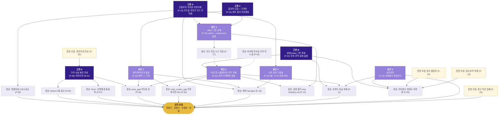

# 03_problem — 문제 원장 (Problem Ledger)

> 작성 2026-08-15 · 트랙 `huni-worldmodel/03_problem`
> 입력: 01_research R1~R7(이론 7편) + 02_diagnosis D1~D8(코드·라이브 진단 8편) 전문 정독 + `print-story/04_thesis/{thesis-arc,ontology-layer,open-questions-for-audience}.md` + `print-story/06_artifact/build-notes.md` §1
> [HARD] 규율: 모든 주장에 `파일경로:라인` 또는 선행 산출물 인용. 추정은 `[추정]` 배지. raw/webadmin·라이브 DB 무수정(본 문서는 읽기 전용 종합).
> 이 문서는 **문제를 확정**하는 것까지다. 설계·처방은 04_design 소관이며, 여기서는 "무엇을 고쳐야 하는가"의 목록과 인과만 낸다.

---

## 0. 발표 서사와의 접속점 — §5가 주장한 것

`print-story/06_artifact/build-notes.md:26`(§1 섹션 매핑)에 따르면 발행 아티팩트 §5 "남은 문제 — 의도→주문 (본론)"은 3탭 구성이고 주 소스가 `thesis-arc.md` §2·§3 + `ontology-layer.md` §A~§E다. 그 서사가 주장한 것은 정확히 셋이다.

| # | §5의 주장 | 근거 |
|---|---|---|
| 5-①| **UI로는 원리적으로 못 푼다** — 인쇄 주문은 UI 문제가 아니라 구성(configuration) 문제이고, 탐색 공간을 줄이는 것은 화면이 아니라 제약이다 | `thesis-arc.md:117-126` (Mittal & Frayman IJCAI-89 인용) |
| 5-②| **그래서 지식DB가 필요하다 — 단, 목적이 아니라 수단** | `thesis-arc.md:146` "온톨로지·GraphRAG를 하고 싶어서 문제를 찾은 것이 아니다" |
| 5-③| **중간의 유효성 판정을 LLM에 맡기면 틀린다** — LLM은 입구(자연어→진입노드)와 출구(설명)만 | `thesis-arc.md:140`, 역할 분담표 `thesis-arc.md:191-199` |

**본 문서의 위치**: 발표는 §5에서 "의도→주문이 남은 문제"라고 *선언*했다. 이 원장은 그 선언을 **코드 증거로 해체해 무엇이 실제로 비어 있는지**를 확정한다. 그리고 아래 §1의 판정이 보여주듯, §5의 서사에는 한 가지 교정이 필요하다 — 문제는 "지식이 없다"가 아니라 **"지식은 있는데 그것으로 미래를 굴려보는 층이 없다"**이다.

---

## 1. [핵심 판정] 월드모델 부재 가설

### 가설

> "webadmin 에는 뉴로·심볼릭·지식 계층은 있으나 월드모델(행동→결과를 예측/시뮬레이션해 계획에 쓰는 내부 모델)이 없다."

### 판정: **PARTIALLY_CONFIRMED**

전면 CONFIRMED가 아니다. **반증 증거가 실재하며, 그것을 무시하면 이 프로젝트는 이미 가진 자산을 다시 만들게 된다.**

### 1.1 반증 증거 — "월드모델이 전혀 없다"는 거짓이다

가설에 유리하게 쓰지 않기 위해 반증부터 적는다. 코드에 **행동→결과를 실행 없이 계산하는 함수가 최소 4개** 실재한다.

| # | 실재하는 전이함수/예측기 | 무엇을 예측하는가 | 근거 |
|---|---|---|---|
| **CT-1** | `pricing.evaluate_price(target, selections, qty, grade_cd, mode, as_of, only_comps, proc_sels, skip_plate)` | (상품, 옵션 선택, 수량) → 최종 금액. **결정론·순수함수·시점(as_of) 지정 가능·구성요소 부분집합(only_comps) what-if 지원** | `raw/webadmin/webadmin/catalog/pricing.py:428-429`; 순수 모듈 선언 `pricing.py:4-5` |
| **CT-2** | `price_views._sim_disallowed(prd_cd, sel)` | 현재 선택 기준 각 차원의 **불가값 → 사유 규칙명** 맵. 후보값을 실제로 대입해 평가하는 **forward simulation 그 자체** | `raw/webadmin/webadmin/catalog/price_views.py:2701-2734` |
| **CT-3** | `fn_best_plate` / `fn_calc_pansu` | 완제품 사이즈 → 최효율 판형 → 판걸이수. 고객이 고르지 않는 생산 상태를 자동 도출 | `raw/webadmin/sql/33_fn_best_plate.sql:25-56`; `sql/32_fn_calc_pansu.sql`; 호출 `pricing.py:308` |
| **CT-4** | `cfg_utils.delete_usage` | "이 마스터를 지우면 무엇이 깨지는가"를 **실행 전에** 역방향 FK 리플렉션으로 사전 집계 | `raw/webadmin/webadmin/catalog/cfg_utils.py:294-343`, 확인 게이트 `:391-406` |

이론 측 근거도 같은 방향을 가리킨다. R2가 명시했듯 **"월드모델이 반드시 신경망 latent일 필요가 없다 — SQL 함수도, 제약 솔버도, 룩업 테이블도 (2)단계에 꽂힌다"**(`01_research/R2-world-model-theory.md:208`). 즉 CT-1~CT-4는 계보상 정당한 월드모델 구성물이다. D7도 독립적으로 같은 결론에 도달했다 — "라이브에서 실제로 행동→결과를 계산하는 것은 `evaluate_price` 단일 함수"(`02_diagnosis/D7-prior-harness.md:154`).

**따라서 "월드모델이 없다"는 REFUTED이고, 정확한 명제는 "월드모델이 1축·부분·비결합 상태다"이다.**

### 1.2 그러나 가설이 성립하는 4개 지점 — 여기가 CONFIRMED다

월드모델의 정의를 가설이 쓴 그대로 **"행동→결과를 예측/시뮬레이션해 *계획에 쓰는* 내부 모델"**로 두면, 밑줄 친 부분이 전부 무너진다.

| # | 무너지는 요건 | 실측 근거 |
|---|---|---|
| **W-1** | **결과축이 1개뿐이다** — 가격 외 결과(제작가능성·납기·수율·재고)는 예측 대상으로 모델링돼 있지 않다. 라이브 46개 도메인 테이블 어디에도 리드타임·수율·불량률·설비부하·재고 컬럼이 0개 | `D8-live-schema.md:205`; `t_proc_processes` 전 컬럼에 순서·설비·소요시간·수율·원가 0개 — `D1-domain-model.md:222`(models.py:583-608) |
| **W-2** | **두 예측기가 결합되지 않는다** — 가격 예측(pricing.py)과 가능성 예측(price_views:2701)이 서로를 모른다. 결과적으로 **제약을 위반한 조합의 가격이 태연히 계산된다** | `D2-pricing-engine.md:290`(F12), `:368`; 제약 미집행 자체 판정 `_workspace/huni-constraint-rules/CHANGELOG.md:7` |
| **W-3** | **상태(state)를 담을 그릇도, 그 위를 도는 루프도 없다** — 위젯 서버 완전 무상태(`request.session` 0건), `/price`→`/validate`→`/handoff`가 서로의 결과를 참조하지 않고 handoff가 evaluate_price를 처음부터 재호출. 주문·견적 실체 테이블 자체가 부재 | `D3-widget-cascade.md:213-224`(F8), 재호출 `widget_api.py:1831-1833` vs `1291-1293`; 주문 테이블 부재 `D1-domain-model.md:188`(G7) |
| **W-4** | **계획(planning)에 쓰이지 않는다** — 뉴로 계층(관리자 비서)은 결과 예측·다중 후보 비교·이력 누적 계획이 코드에 하나도 없는 반응형 도구 사용자이고, 이미 있는 `evaluate_price`의 반사실 인자(`only_comps`/`as_of`)조차 도구로 노출되지 않는다 | `D4-neuro-layer.md:241`, `:379-387`(판정표), 인자 미노출 `assistant_tools.py:281-282` vs `pricing.py:428-429` |

### 1.3 판정문

> **PARTIALLY_CONFIRMED.**
> webadmin 에는 뉴로(관리자 비서 LLM)·심볼릭(JSONLogic 제약·pricing 4단 사슬·SQL 기하함수)·지식(t_cod_base_codes 축 데이터화 + 온톨로지 KB 노드 1,485/엣지 4,568) 3계층이 실재한다. **월드모델도 완전히 부재하지는 않다 — `evaluate_price`라는 진짜 결정론 전이함수와 3개의 미완성 예측기(CT-2·CT-3·CT-4)가 코드에 있다.**
> 그러나 그것은 **가격 단일축·커버리지 59.4%·서로 비결합·상태 없음·계획 미사용** 상태다. 즉 **"모델은 있는데 모델을 쓰는 루프와 그 루프가 딛고 설 상태가 없다."**
> R2의 표현을 빌리면 **"빠진 것은 모델이 아니라 루프"**(`R2-world-model-theory.md:246`)이며, 적재 트랙에는 커밋 전 시뮬레이션이 이미 있고(도메인 규칙 #9·#12) **고객 견적 트랙에만 없다**(`R2:302`).

### 1.4 가설 서술을 이렇게 교정한다

| 폐기할 서술 | 채택할 서술 |
|---|---|
| "월드모델이 없다" | "월드모델이 **가격 1축·59.4% 커버리지로 존재하며, 상태·루프·결합·다축이 없다**" |
| "월드모델을 새로 만들어야 한다" | "**새 모델이 아니라 (a)상태 그릇 (b)커밋 전 시뮬레이션 루프 (c)제약×가격 결합 (d)결과축 확장**을 만들어야 한다" |
| "LLM/신경망을 도입해야 한다" | "학습형이 필요한 지점은 **암묵지 구간 하나**(판걸이수 권위 룩업)이며 그것도 신경망이 아니라 관측 테이블이다" (`R2:283`) |

---

## 2. 문제 원장

등급 기준 — **money**: 잘못된 값이 곧 금전 손실(과청구·저청구·오생산)로 이어지는가. **layer**: neuro / symbolic / knowledge / worldmodel / ops.

### 2.1 요약표

| ID | 제목 | 계층 | 돈 | 한 줄 |
|---|---|---|:--:|---|
| **P-01** | 상태(state) 그릇 부재 — 주문·견적 실체 테이블 없음 | worldmodel | ● | 행동의 결과를 축적할 곳이 없어 예측-관측 교정 루프가 구조적으로 불가 |
| **P-02** | 커밋 전 시뮬레이션 루프 부재 (고객 견적 트랙) | worldmodel | ● | 적재 트랙엔 있고 견적 트랙엔 없다 — 비가역 산업에서 사후 통보 구조 |
| **P-03** | 제약 레이어 미집행 — 제약과 가격이 결합되지 않음 | symbolic·worldmodel | ● | 불가능한 조합의 가격이 태연히 계산된다 |
| **P-04** | 단가행 부재(price_gap)가 제약 모델 밖 | worldmodel·symbolic | ● | 캐스케이드가 예고 불가한 막다른 길. 실제 언더차지 사고 이력 |
| **P-05** | 판별차원 0 구성요소 상시 과금 | symbolic | ● | 차원 미충전 구성요소를 배선하는 순간 전 주문 과청구 |
| **P-06** | `lenient` 기본값이 데이터 구멍을 0원으로 흡수 | symbolic | ● | 호출자가 명시 안 하면 조용한 저청구 |
| **P-07** | NULL 와일드카드 + 전용행 공존 → 구성요소 전체 탈락 | symbolic | ● | **데이터 추가가 회귀를 만드는 구조** |
| **P-08** | 가격 사슬 절반 끊김 — 미바인딩 117상품·고아 구성요소 79·단가행 0인 구성요소 32 | knowledge·symbolic | ● | 전이함수 커버리지 59.4% |
| **P-09** | 유일 전이함수의 정확도 미측정 (골든 전수대조 미수행) | worldmodel·ops | ● | "계산이 된다"≠"맞다" |
| **P-10** | 부분관측 — `fn_calc_pansu` 2인자가 자재종속 판걸이수를 표현 불가 | worldmodel | ● | 기하 과다패킹 → 판수 과소 → 저청구. 실측 사례 존재 |
| **P-11** | 견적 신뢰도 등급 부재 (권위 룩업 vs 기하 폴백 구분 없음) | worldmodel | ● | 저청구가 조용한 손실로 남는다 |
| **P-12** | 설명 불가 — 선택 근거(why-this)·대안 대조(why-not-that) 미반환 | symbolic·worldmodel | ○ | 티어 선택 근거와 탈락 후보를 버린다 |
| **P-13** | 감사 추적 부재 — 권위 엑셀 셀 링크 없음 | knowledge·ops | ● | "이 가격이 맞는가"를 엔진 응답만으로 확인 불가 |
| **P-14** | 효과(effect) 표현 그릇 부재 — `option → component` 링크 없음 | knowledge·worldmodel | ● | "이 옵션을 켜면 무엇이 붙는가"를 말할 수 없다 |
| **P-15** | 온톨로지 의미론 비형식화 — 코드값 의미가 코드 리터럴·주석에만 | knowledge | ○ | 기계가 `MAT_TYPE.01`=종이를 추론할 근거가 스키마에 없다 |
| **P-16** | 참조차원(ref_dim) 정의 5벌 병렬 + DB 트리거 | knowledge·ops | ○ | 차원 하나 추가 = 사람이 5~6곳 수동 동기화 |
| **P-17** | 의도(intent) 진입 노드 미완 — 의도→옵션 벡터 번역층 부재 | neuro·knowledge | ○ | 월드모델의 입력단이 출력단보다 훨씬 덜 만들어짐 |
| **P-18** | 결과축 단일 — 납기·제작가능성·수율·재고 테이블 전무 | worldmodel | ○ | 가격 외 어떤 결과도 예측 대상이 아님 |
| **P-19** | 제약 평가 fail-open — 잘못된 규칙이 로그 없이 무력화 | symbolic | ● | "규칙을 걸었는데 안 걸린다"가 아무도 모르게 발생 |
| **P-20** | tmpl_combo_gap — 가격 다 보고 주문에서만 422, 탈출구 "관리자 문의" | symbolic·worldmodel | ● | 이탈 지점. 금지인지 미등록인지 구별 불가 |
| **P-21** | 캐스케이드 이중 구현 — 클라 계산 / 서버 사후검사, 수동 동기화 | symbolic | ● | 갈리면 "화면은 통과인데 주문이 422" |
| **P-22** | 전이함수가 DB 밖 — 가격공식 테이블에 계산방식 컬럼 부재 | symbolic·worldmodel | ○ | 세계의 *상태*는 DB에, *동역학*은 pricing.py 1,003줄에 |
| **P-23** | 권위 엑셀 버전 모순 (260702/260610/260527 vs SOT 260705/260703) | ops·knowledge | ● | 월드모델이 stale 권위를 예측 근거로 삼을 위험 |
| **P-24** | 상품 분모 3~4종(275/283/288/297) — 커버리지 주장의 분모 불일치 | ops | ○ | "전 상품 완주"가 어느 분모인지 검증 불가 |
| **P-25** | 원고 승격 워커 미착수 + 실측 검증 부재 (지연 실패) | ops | ● | 주문은 통과했는데 원고가 없는 상태가 만들어질 수 있다 |
| **P-26** | 비서 에이전트에 월드모델 미연결 — 반사실 인자 미노출 | neuro | ○ | 실행기는 있는데 에이전트에 연결돼 있지 않다 |

### 2.2 상세

---

#### P-01 · 상태(state) 그릇 부재 — 주문·견적 실체 테이블 없음
- **계층**: worldmodel · **돈**: ● (간접 — 교정 루프 부재)
- **증거**:
  - `CREATE TABLE` 전수에 `t_ord_*` 부재. 유일한 흔적이 스스로 "순수 부수 기록"이라 선언한 append-only 로그 — `raw/webadmin/webadmin/catalog/models.py:883-899`(D1 G7)
  - 라이브 실측: `t_cus_customers` 0행, `t_dsc_grade_discount_rates` 0행, `t_wgt_handoff_logs` 0행 — `02_diagnosis/D8-live-schema.md:66-68`
  - 그런데 `evaluate_price(grade_cd=...)`는 이미 등급 인자를 받는다 — `pricing.py:428-437` (코드가 데이터 없는 경로를 선행 개설)
- **지금 방식의 한계**: 월드모델의 정의상 필수인 "예측 → 실행 → 관측 → 모델 갱신" 루프에서 **관측을 저장할 곳이 없다.** D8의 표현대로 "실제 행동 이력이 축적되지 않으므로, 예측을 관측으로 교정하는 루프가 구조적으로 불가능"(`D8:206`). 이주환의 프레임으로는 S(State)/T(Transition)의 그릇 자체가 없는 상태(`R3-leejoohwan-local.md:313` A-1 표 — "S/T는 현재 우리 스키마에 명시적 그릇이 없음 → 갭").

---

#### P-02 · 커밋 전 시뮬레이션 루프 부재 (고객 견적 트랙)
- **계층**: worldmodel · **돈**: ●
- **증거**:
  - 위젯 서버는 완전 무상태이며 `/price`·`/validate`·`/handoff`가 서로의 결과를 참조하지 않는다 — `D3-widget-cascade.md:213-224`; `/handoff`가 `evaluate_price`를 처음부터 재호출 `widget_api.py:1831-1833` vs `1291-1293`
  - 서버에 캐스케이드 계산 코드는 있으나 **관리자 시뮬레이터 전용**이고 `widget_api.py`에서 호출 0건 — `price_views.py:2701-2734`, 노출부 `:2783-2792`, 호출 부재 `D3:118`
  - SKU 선택값은 **커밋 후** 제약을 평가해 세션 경고로 알리며 저장을 막지 않는다 — `views.py:4081-4114`(D5 §(4))
  - 반면 **적재 트랙에는 이미 루프가 있다** — 도메인 규칙 #9(충분조건 미달 시 역산 준비 확인 → 시뮬레이터 입증)·#12(라이브 적재 전 실화면 확인) `_workspace/_foundation/HARNESS-DOMAIN-RULES-260701.md:63-66,79`
- **지금 방식의 한계**: 인쇄는 비가역 산업이다. WebDreamer의 논지 — "되돌릴 수 없는 환경에서는 백트래킹이 성립하지 않아 커밋 전 시뮬레이션이 필수"(`R2:177-179`) — 가 그대로 적용된다. 이주환의 용어로는 언어의 환각이 아니라 **실행의 환각**(`R3:68`, F1:65). 현재 구조는 "저장하면 무슨 일이 생기는가"를 **저장 후에** 알려준다(`D5:237`).

---

#### P-03 · 제약 레이어 미집행 — 제약과 가격이 결합되지 않음
- **계층**: symbolic · worldmodel · **돈**: ●
- **증거**:
  - 제약을 위반한 조합도 `evaluate_price`는 기꺼이 계산한다. 두 계층을 잇는 것은 프런트/호출자 규약뿐 — `D2-pricing-engine.md:290`(F12), 제약 `price_views.py:2701-2735` / 가격 `pricing.py:428`
  - 선행 하네스 자체 판정: "제약 레이어는 **가격·주문 어디에도 연결 안 됨**" — `_workspace/huni-constraint-rules/CHANGELOG.md:7`; High=강제 지점 부재 `huni-constraint-rules/HANDOFF.md:7`
  - 라이브 커버리지 실측: 제약규칙 보유 상품 34/288 = **11.8%** — `D8-live-schema.md:130`
- **지금 방식의 한계**: D7이 이것을 "월드모델의 가장 큰 공백"으로 지목했다(`D7:13,128` G1). "제약 있음"을 feasibility 예측의 근거로 쓰면 안 된다는 것이 선행 하네스의 명시 경고다(`D7:88` C5). 발표 §5의 5-① 주장("공간을 줄이는 것은 제약")이 **라이브에서 실제로는 집행되지 않는다**는 뜻이므로, 서사와 실물 사이의 최대 격차 지점이다.

---

#### P-04 · 단가행 부재(price_gap)가 제약 모델 밖
- **계층**: worldmodel · symbolic · **돈**: ●
- **증거**:
  - `_price_gap_errors`가 붙은 사유가 실제 사고다 — "엔진은 매칭 실패 구성요소를 조용히 0원으로 빼고 계산을 계속한다 … 고객 주문 경로에 그대로 두면 언더차지다(아크릴 머리끈 500원 사고, 260802)" `widget_api.py:458-460`
  - "이 제약은 `constraints` 메타에 없으므로 클라이언트 캐스케이드가 예고할 수 없다" — `D3-widget-cascade.md:199`
  - CSP 관점 판정: "가격 데이터의 존재 여부는 제약으로 모델링되어 있지 않다 … **제약 그래프에 아예 들어 있지 않은 하드 제약**" — `D3:190`
- **지금 방식의 한계**: R6의 KB 결함 4종 분류에서 **dead option**(어떤 유효 구성에도 등장할 수 없는 옵션)에 해당하는데, 그것이 제약이 아니라 계산 부산물(`data_gap`)로만 드러난다(`R6-cpq-constraint-theory.md:213`). 즉 **탐색 공간에서 잘라낼 수 있는 것을 잘라내지 않고 끝까지 계산한 뒤 실패**시킨다.

---

#### P-05 · 판별차원 0 구성요소 상시 과금
- **계층**: symbolic · **돈**: ●
- **증거**: `use_dims`가 비었거나 opt_grp만 있으면 "판별차원 없음 — 선택과 무관하게 항상 매칭"으로 note만 달고 `included=True` 진행 — `pricing.py:632-635`; 결함 등급 High `D2-pricing-engine.md:300`(D2-1)
- **연결 실측**: 선행 하네스가 같은 형태의 사고를 이미 기록 — 동판비 `use_dims`에 `proc_cd`가 없으면 NULL 와일드카드로 **박 미선택 주문에도 5,000~64,000원 상시과금** `_workspace/huni-price-engine-design/HANDOFF.md:27`
- **지금 방식의 한계**: 엔진이 자기 축의 *의미*를 모르기 때문에 구조적으로 막을 수 없다 — "엔진이 '이 구성요소는 자재비인데 자재 축이 없다'를 알 방법이 없다"(`D2:351`). 이것이 P-15(온톨로지 의미론 비형식화)가 돈으로 직결되는 경로다.

---

#### P-06 · `lenient` 기본값이 데이터 구멍을 0원으로 흡수
- **계층**: symbolic · **돈**: ●
- **증거**: `evaluate_price(..., mode="lenient")` 기본값 `pricing.py:429`; 뷰 기본값 `price_views.py:2824`; 비서 도구는 **lenient 고정, strict 불가** `assistant_tools.py:281-282`
- **지금 방식의 한계**: 호출자가 명시하지 않으면 데이터 구멍이 0원으로 조용히 흡수되고, 관리자 시뮬레이터·위젯 미리보기·비서가 전부 이 기본값을 탄다(`D2:286`, D2-2 등급 High). 그리고 lenient의 0원 결과와 **정당한 0원이 출력에서 같은 모양**이라 경고 문자열을 파싱해야 구분된다(`D2:372`).

---

#### P-07 · NULL 와일드카드 + 전용행 공존 → 구성요소 전체 탈락
- **계층**: symbolic · **돈**: ●
- **증거**: NULL=와일드카드 `pricing.py:98` + 비수량 차원조합 2개 이상=`ERR_AMBIGUOUS` `pricing.py:151-157`. "공통가 NULL행 + 전용가 행 공존"이 곧바로 오류가 되어 **그 구성요소 전체가 합산에서 빠진다** — `D2-pricing-engine.md:281`(F3), 등급 High `:302`(D2-3)
- **지금 방식의 한계**: **데이터 추가가 회귀를 만드는 구조**다. 새 전용 단가행 INSERT 한 건이 기존 공통행과 충돌해 저청구를 유발할 수 있고, 이는 적재 하네스의 정상 작업 흐름과 정면 충돌한다.

---

#### P-08 · 가격 사슬 절반 끊김
- **계층**: knowledge · symbolic · **돈**: ●
- **증거** (라이브 실측 2026-08-15, `02_diagnosis/_evidence/D8-live-schema-evidence.txt`):
  - 라이브 상품 288 중 가격공식 바인딩 **171 (59.4%)** → 미바인딩 117(완제품 66 포함) — `D8-live-schema.md:79,87`
  - 가격구성요소 202 중 **어떤 공식에도 미배선(고아) 79** — `D8:84`
  - **단가행 0인 구성요소 32**, **구성요소 0개인 공식 1** — `D8:83,81`
  - `addtn_yn` NULL 7건 / `comp_typ_cd` NULL 4건 / `use_dims` NULL 1건 — `D8:178-180`
- **지금 방식의 한계**: 유일한 전이함수의 **정의역이 59.4%**다. R2의 표현으로 "상태 공간의 3분의 1 이상이 행동해도 결과가 안 나오는 영역"(`D7:130` G3). 월드모델을 얹기 전에 이 배선이 선행되어야 하며, 이는 §7 dbmap/§18 설계 트랙 소관이다.

---

#### P-09 · 유일 전이함수의 정확도 미측정
- **계층**: worldmodel · ops · **돈**: ●
- **증거**: L3+ 83상품은 `PRICE≠0`이나 **예전사이트 정답가 대조 미수행** — `_workspace/huni-product-readiness/HANDOFF.md:12`, 재확인 `D7-prior-harness.md:131`(G4)
- **지금 방식의 한계**: 월드모델 관점에서 **전이함수는 있으나 오차를 모른다**(`D7:155`). Ha&Schmidhuber의 model exploitation 교훈(`R2:58`)이 적용되는 지점 — 모델이 틀릴 수 있음을 명시하지 않으면 그 오차가 그대로 금액이 된다. 종료 척도는 이미 정의돼 있다: "전 상품 × 전 옵션조합 100% 일치, 불일치 0"(`open-questions-for-audience.md:112`).

---

#### P-10 · 부분관측 — `fn_calc_pansu` 2인자가 자재종속 판걸이수를 표현 불가
- **계층**: worldmodel · **돈**: ●
- **증거**:
  - 프리미엄엽서 실측: 권위 판걸이수 73×98→**15**, 98×98→12, 100×150→**8** vs 엔진 기하계산 **18/12/9**. 원인 "간격(gutter) 미반영 과다패킹 → 판수 과소 → **저청구**", 판정 "코드 정상·데이터 문제" — `_workspace/_foundation/product-scoreboard.csv:2`
  - 자재 종속(투명엽서 6 vs 일반 8)은 2인자 시그니처로 표현 불가, `prd_cd` 인자 필요(C트랙) — `_workspace/_foundation/HARNESS-DOMAIN-RULES-260701.md:25`
  - 도메인 규칙 #1: "실무진 판걸이수가 권위" — 같은 파일 `:24`
- **지금 방식의 한계**: 이론적으로 **전형적 부분관측(partial observability)**이며, 해법은 근사 개선이 아니라 **상태공간 확장**이다(`R2-world-model-theory.md:285`). **이 프로젝트에서 유일하게 "학습형/관측형"이 필요한 지점**이며, 그것도 신경망이 아니라 `t_siz_pansu` 권위 룩업 테이블이다(`R2:283`).

---

#### P-11 · 견적 신뢰도 등급 부재
- **계층**: worldmodel · **돈**: ●
- **증거**: 엔진 출력에 불확실성 표현이 없다 — lenient 0원과 정당한 0원이 같은 모양(`D2:372`). 권위 룩업 기반 판걸이수와 기하 폴백 기반을 구분하는 필드가 응답에 없다(`pricing.py:561-582` 출력 스키마).
- **지금 방식의 한계**: R2의 처방 — `t_siz_pansu` 권위 룩업 견적 = CONFIRMED, 기하 폴백 견적 = **PROVISIONAL** — 이 미적용 상태다(`R2:304`). R7의 실무 사례도 같은 방향: 인수심사 에이전트가 "구속력 있는 필드를 스키마에서 제거"해 확정을 발화할 수 없게 만든 것(`R7-agentic-commerce.md:93`). **저청구를 조용한 손실에서 가시적 플래그로 전환하는 것이 핵심 이득**이다.

---

#### P-12 · 설명 불가 — why-this / why-not-that 미반환
- **계층**: symbolic · worldmodel · **돈**: ○
- **증거**:
  - `match_component`가 축별 선택 임계값을 `selected` dict에 담지만 반환은 `{"row","tier_min_qty","error"}`뿐 — `pricing.py:162-183` vs `:193`
  - 후보 `cand`·그룹 `grp`·티어 `tiers` 전부 지역변수. **정상 매칭 시 "왜 이 행이고 저 행이 아니었는가"는 반환되지 않는다** — `pricing.py:146,159,167`; `D2:250`
  - 판형 선택 사유 `diag`가 단일상품 경로에서 폐기 — `price_views.py:2804` vs 세트 경로 보존 `:2991-2995`
  - 제약 평가는 `bool`만 반환해 규칙 신원(`rule_cd`·`err_msg`)이 병합 시점에 소실 — `cfg_utils.py:42-79`
- **지금 방식의 한계**: R6이 인용한 Amilhastre·Fargier·Marquis(2002)의 **일관성 복원(consistency restoration)** — "박과 에폭시를 같은 면에 동시 적용할 수 없습니다 — 에폭시를 뒷면으로 옮기면 가능합니다"가 UX 카피가 아니라 **알고리즘 출력**이어야 한다는 것(`R6:128-130`) — 이 구조적으로 불가능하다. 자동화 입장에서는 반복 시도(guess-and-check) 외 전략이 없다(`D6-editor-artwork.md:264`).

---

#### P-13 · 감사 추적 부재 — 권위 엑셀 셀 링크 없음
- **계층**: knowledge · ops · **돈**: ●
- **증거**: `matched_row.comp_price_id`는 DB 행 ID일 뿐, 그 값이 어느 권위 엑셀 어느 시트 어느 셀에서 왔는지가 엔진 응답에 없다 — `D2-pricing-engine.md:252`; 공백 목록 `:314`
- **지금 방식의 한계**: R4가 정리한 이주환의 **에이전틱 AI 4대 조건**(상태관리·규칙준수·**감사추적**·오류복구) 중 하나의 정면 위반이며, R4는 이를 "최대 갭"으로 지목했다(`R4-leejoohwan-web.md:148`). 온톨로지 KB는 앵커 3유형(`t_<table>/<CODE>` / `xlsx:파일#시트!셀` / `none`)을 이미 강제하고 있으므로(`_workspace/huni-ontology-kb/02_ontology/ontology-schema.md:29-33`), **KB에는 있고 엔진 응답에는 없는 비대칭**이다.

---

#### P-14 · 효과(effect) 표현 그릇 부재 — `option → component` 링크 없음
- **계층**: knowledge · worldmodel · **돈**: ●
- **증거**:
  - 현재 `has_component`는 **공식→구성요소**만 잇는다. "옵션 선택의 효과"를 못 말하는 직접 원인이 `option → component` 링크 부재 — `01_research/R5-ontology-graphrag.md:212`
  - 월드모델화에 필요한 4원소(state / action / precondition / effect) 중 스키마에 있는 것은 precondition 부분표현(constraint 10개)뿐 — `R5:142-148`
  - 암묵지는 (a)물리 불가=constraint (b)가능하지만 결과 나쁨=effect 로 나눠야 하는데 **(b)를 담을 그릇이 없다** — `R5:202`
- **지금 방식의 한계**: "코팅을 추가하면 COMP_COATING이 붙고 납기가 +1일 되며 자재 선택지가 축소된다" 같은 사실이 **지금 어디에도 없다**(`R5:161`). 이것이 P-18(결과축 단일)의 지식층 대응물이다.

---

#### P-15 · 온톨로지 의미론 비형식화
- **계층**: knowledge · **돈**: ○ (단 P-05를 통해 간접적으로 ●)
- **증거**:
  - `MAT_TYPE.01`=종이라는 것을 기계가 추론할 근거가 스키마에 없고 주석에만 존재 — `models.py:190`(D1 G10)
  - 기초코드의 의미가 코드 리터럴에만: `SEMI_ROLE.02`=표지 `admin.py:1508`, `PRD_TYPE.02`=반제품 `admin.py:1603`, `MAT_TYPE.01`=종이 `admin.py:1942`, `SEL_TYPE.02`=다중선택 `views.py:2001`
  - 자기참조 FK 4개는 모두 "상위"일 뿐 is-a인지 part-of인지 구분 불가 — `admin.py:93-97`(D5 §3)
  - 도메인 지식이 도크스트링에 갇힘: `plt_siz_cd`가 조합 축에서 빠지는 이유가 주석에만 — `tmpl_combo.py:48`, 동취지 `price_views.py:53-54`(D6 §3-3)
- **지금 방식의 한계**: D5의 판정 — "심볼릭 규칙은 이미 충분히 많은데 그것들이 참조할 개념 모델이 없어서, 규칙마다 코드 리터럴을 다시 적는다"(`D5-ops-tacit.md:248`). D6의 표현으로는 **"이 코드베이스에서 가장 값진 자산이 가장 접근 불가능한 형태로 저장돼 있다"**(`D6:338`).

---

#### P-16 · 참조차원(ref_dim) 정의 5벌 병렬
- **계층**: knowledge · ops · **돈**: ○
- **증거**: `VAR_KEY_MAP` `views.py:61-69` / `DIM_REF_MODELS` `views.py:1882-1890` / `_DIM_LABEL_FIELDS` `views.py:1893-1901` / `_IMPACT_SECTIONS` `views.py:3670-3678` / DB 트리거 `fn_chk_opt_item_ref`(주석이 사람에게 동기화를 부탁 — `views.py:1881`). 추가로 차원 어휘가 3벌 분기: `price_views.DIM_META` 12종 `:31-44` / `edicus_views.EDICUS_DIMS` 6종 `:37` / `tmpl_combo.COMBO_DIMS` 5종 `:51`(D6 §3)
- **지금 방식의 한계**: 차원 하나 추가에 최소 6곳 수동 동기화가 필요하고, **어느 하나 빠뜨려도 예외가 안 나고 조용히 기능만 빠진다**(`D2:280` F2 — 그리드 미표시 / 제약 미평가 / 이름 미부착). D5가 지식층 승격 우선순위 1위로 지목(`D5:254`).

---

#### P-17 · 의도(intent) 진입 노드 미완
- **계층**: neuro · knowledge · **돈**: ○ (기회손실)
- **증거**:
  - `intent`는 라이브 DB에 대응 테이블이 **없는** KB 전용 축 — `_workspace/huni-ontology-kb/02_ontology/ontology-schema.md:71`
  - 실측: intent 노드 **3개**, 전부 `{candidate}` 배지 — `R5-ontology-graphrag.md:208`(`03_kb/intent/intents.md:10-26`)
  - 원자 분해 미완, 다중브랜드의 **키스톤**으로 지목 — `_workspace/huni-multibrand-ontology/HANDOFF.md:7,35`
- **지금 방식의 한계**: D7의 판정 — **"월드모델의 입력 쪽(고객 의도→상태)이 출력 쪽(상태→가격)보다 훨씬 덜 만들어져 있다"**(`D7:156`). 발표 §5가 본론으로 세운 "의도→주문"의 첫 단계가 여기다.

---

#### P-18 · 결과축 단일 — 납기·제작가능성·수율·재고 전무
- **계층**: worldmodel · **돈**: ○
- **증거**:
  - `t_proc_processes` 전 컬럼(`models.py:583-608`)에 **순서·선후·설비·소요시간·수율·원가 컬럼이 하나도 없다** — `D1-domain-model.md:222`
  - 라이브 46 도메인 테이블에 납기/리드타임/수율/불량률/설비부하/재고 테이블 부재 — `D8-live-schema.md:205`
  - 공정은 가격 축에는 참여한다(`t_prc_component_prices.proc_cd` `models.py:209`) → **공정이 "돈이 드는 이름표"로만 모델링**됨(`D1:223`)
  - `fn_best_plate`가 1장당 판면적(생산 효율)을 계산하지만 **선택에만 쓰이고 결과로 반환되지 않는다** — `sql/33_fn_best_plate.sql:48`, `D2:369`
- **지금 방식의 한계**: MuZero의 value-equivalence 원칙(`R2:264`)에 따르면 월드모델이 공장을 재현할 필요는 없고 **결정에 관련된 양만** 예측하면 된다. 그러나 그 "결정에 관련된 양"이 현재 가격 하나뿐이며, **이미 계산되고 있는 효율값조차 버려진다**는 점이 문제다.

---

#### P-19 · 제약 평가 fail-open
- **계층**: symbolic · **돈**: ●
- **증거**: JSONLogic 평가 예외를 "통과"로 처리, 두 곳 동일 — `views.py:3836-3839`, `views.py:4101-4104`(D5 G-1). 추가로 raw JSONLogic 직접 입력이 **검증 없이 최우선 경로로 저장**되고 저장 후 폼빌더 역파싱 불가 — `views.py:3399-3423`, `:3508-3509`(D5 G-2·G-3)
- **지금 방식의 한계**: "잘못 저장된 규칙은 오류 없이 무력화되며 아무도 모른다"(`D5:18`). R1의 F1(형식화 오류)과 같은 형태 — 시스템은 **잘못된 모델을 정확히 풀어 자신 있게 틀린 답**을 낸다(`R1-neurosymbolic-theory.md:109`). P-03(제약 미집행)과 합쳐지면 "제약을 걸었다"는 주장 자체가 검증 불가가 된다.

---

#### P-20 · tmpl_combo_gap — 가격 다 보고 주문에서만 422
- **계층**: symbolic · worldmodel · **돈**: ●
- **증거**: 모듈 docstring이 설계 의도를 명시 — "조합 템플릿 미등록(tmpl_combo_gap)은 주문 시점(handoff)에서만 차단한다 — 가격 자체는 정확하므로 표시를 막지 않는다" `widget_api.py:11-12`; 차단부 `:1894-1909`; 최종 메시지 "관리자에게 문의해 주세요" `:1906-1907`. 셋트+`proc_cd` 조합은 **구조상 항상 422** `:1890-1891`
- **지금 방식의 한계**: D6의 판정 — 미등록 조합이 422로 막히는데 **"금지"인지 "데이터 미등록"인지 구별되지 않아 자동화 입장에서 재시도 전략이 서지 않는다**(`D6:259`). 그리고 이 화이트리스트 제약은 제약 레이어(`t_prd_product_constraints`)와 완전히 별개 통로라 프런트 캐스케이드가 이 금지를 모른다(`D6:197-201`).

---

#### P-21 · 캐스케이드 이중 구현 — 클라 계산 / 서버 사후검사
- **계층**: symbolic · **돈**: ●
- **증거**: 서버가 제약 규칙 **원문**을 통째로 클라에 내려주고 "프런트는 서버 왕복 없이 선택 즉시 cascade를 계산한다"고 명시 — `widget_api.py:340`, `price_views.py:2739`. 서버는 같은 규칙을 다시 평가하되 목적이 위조 차단 — `widget_api.py:1313-1406`, `:1817-1818`. 동기화 경고가 코드 4곳 이상에 — `widget_api.py:1322`("갈리면 화면은 통과인데 주문이 422"), `:1338`, `:545-546`, `:707-708`
- **지금 방식의 한계**: **동일 규칙의 두 구현을 사람이 손으로 동기화하는 구조**(`D3:163`). 더구나 제약엔진 자체가 두 벌(json-logic-js 2.0.5 / panzi-json-logic 1.0.1)이고 클라 미지원 연산자 규칙은 **화면에서 안 걸리고 서버에서만 걸린다**(`cfg_utils.py:85-98`, `:114-121`) — 사전 시뮬레이션과 실제 주문 결과가 갈릴 수 있다.

---

#### P-22 · 전이함수가 DB 밖 — 가격공식 테이블에 계산방식 컬럼 부재
- **계층**: symbolic · worldmodel · **돈**: ○
- **증거**: `t_prc_price_formulas` 컬럼은 `frm_cd/frm_nm/note/use_yn/reg_dt/upd_dt` 6개뿐 — **계산방식/연산자 컬럼 없음** `models.py:267-278`. DB가 든 연산 정보는 `addtn_yn`(NULL 7건)·`prc_typ_cd`(`comp_typ_cd` NULL 4건) 두 플래그뿐 — `D8-live-schema.md:111-113`. 산술은 `pricing.py:428` 1,003줄 안에
- **지금 방식의 한계**: D8의 표현 — **"DB는 세계의 *상태*는 알지만 *전이 함수*는 모른다"**(`D8:17`). 다만 이것은 D2가 "의도된 3층 분리(값=DB / 문법=파이썬 / 기하=SQL)이고 실제로 잘 지켜지고 있다"고 평가한 설계이기도 하다(`D2:221`). **따라서 "DB로 끌어내려야 한다"는 처방은 [추정]이며 04_design에서 별도 판단이 필요하다** — D8 스스로 그렇게 표기했다(`D8:210`).

---

#### P-23 · 권위 엑셀 버전 모순
- **계층**: ops · knowledge · **돈**: ●
- **증거**: 프로젝트 SOT는 "최신 권위(절대) = 가격표 **260705** · 상품마스터 **260703**, 260702/260610/260527=stale" (`_workspace/_foundation/PRICE-SHEET-SOT-260705.md:4,52`). 그런데 §33 규칙은 "권위=**260702** 엑셀"(`.claude/rules/harness/huni-ontology-kb.md:10`), §18 HANDOFF는 상품마스터 **260610**·가격표 **260527** 기준(`_workspace/huni-price-engine-design/HANDOFF.md:3,25`) — `D7-prior-harness.md:84`(C1)
- **지금 방식의 한계**: 온톨로지 앵커의 `xlsx:` 좌표와 가격 골든값이 stale 버전을 가리킬 수 있고, **월드모델이 이 앵커를 신뢰하면 오래된 권위를 예측 근거로 삼는다**(`D7:84`). 이주환의 프레임에서 이것은 단순 문서관리가 아니라 **실행 탈주**의 직접 원인 — "제대로 설계했지만 버전이 갱신 안 되는 바람에 설계한 세계가 낡았을 때"(`R3-leejoohwan-local.md:348`, F2:32).

---

#### P-24 · 상품 분모 불일치
- **계층**: ops · **돈**: ○
- **증거**: §33=**275**(`huni-ontology-kb/HANDOFF.md:44`) / §29=**283**(`huni-product-readiness/HANDOFF.md:15`) / §31=**297**(`huni-constraint-rules/CHANGELOG.md:7`) / 라이브 실측=**288**(`D8-live-schema.md:79`) — `D7:85`(C2)
- **지금 방식의 한계**: 커버리지·완전성 주장의 분모가 하네스마다 달라 "전 상품 완주"가 검증 불가다. 월드모델의 정의역을 확정하려면 분모를 하나로 못 박아야 한다.

---

#### P-25 · 원고 승격 워커 미착수 + 실측 검증 부재
- **계층**: ops · **돈**: ●
- **증거**: "주문 버킷 규약으로 저장된 객체는 0건 — 승격 워커 미착수" `s3_artwork.py:24-25`; `build_order_key` 호출부 0 `:142`; `key_belongs`는 접두 문자열 모양 검사일 뿐 "이 서버가 발급했다"도 "오브젝트가 존재한다"도 증명하지 않는다고 코드가 스스로 명시 `:167-169`; 주문 시점 head_object 실측 대조 없음 `widget_api.py:894-898` — `D6-editor-artwork.md:277-278`(F-02·F-03)
- **지금 방식의 한계**: **지연 실패(late failure)** — 자동화가 "주문은 통과했는데 원고가 없는" 상태를 만들 수 있고, 그 실패가 미착수 승격 시점으로 미뤄진다(`D6:257`).

---

#### P-26 · 비서 에이전트에 월드모델 미연결
- **계층**: neuro · **돈**: ○
- **증거**: `simulate_price`는 `pricing.evaluate_price`를 `mode="lenient"` 고정으로 감싸며 셋트 상품은 계산 거부 — `assistant_tools.py:275-282`. 반사실 인자 `only_comps`·`as_of`·`proc_sels`·`skip_plate`를 **전혀 노출하지 않는다** — `:281-282` vs `pricing.py:428-429`. 행동 결과 예측·다중 후보 비교·이력 누적 계획이 코드에 0건 — `D4-neuro-layer.md:379-387`
- **지금 방식의 한계**: D4의 발견 — **"월드모델의 실행기는 있는데 에이전트에게 연결되어 있지 않다"**(`D4:393`). 확장의 최소 경로는 새 아키텍처가 아니라 이미 있는 반사실 인자를 도구로 여는 것이나, 그것이 `SYSTEM_BLOCKS` 전역 고정(`assistant.py:226`)과 루프 상한 8·예산 240초(`config/settings.py:355,363`) 벽에 즉시 부딪힌다(`D4:249-255`).

---

## 3. 인과 그래프 — 무엇이 근본이고 무엇이 증상인가

### 3.1 읽는 법 — 인과의 요지 4문장

1. **근본 A(의미론 비형식화)는 지식층 문제인데 돈으로 직결된다.** 엔진이 자기 축의 의미를 모르기 때문에 "자재비인데 자재 축이 없다"를 구조적으로 막을 수 없고(`D2:351`), 그 결과가 P-05 상시과금이다. 지식층 정비를 "나중 일"로 미루면 안 되는 유일한 이유가 이것이다.
2. **근본 B(상태 그릇 부재)가 검증 불가능성의 뿌리다.** 관측이 축적되지 않으므로 P-09(정확도 미측정)와 P-11(신뢰도 등급)이 원리적으로 해결되지 않는다. R2의 표현대로 "예측을 관측으로 교정하는 루프가 구조적으로 불가능"(`D8:206`).
3. **중간 1·2(제약 미집행 + 루프 부재)가 증상 5개를 동시에 낳는다.** P-04·P-05·P-19·P-20·P-12가 전부 여기서 갈라진다. 즉 **04_design의 최대 지렛대는 이 둘**이고, 그것이 R2가 말한 "빠진 것은 모델이 아니라 루프"(`R2:246`)의 실체다.
4. **근본 D(배선 미완)는 다른 셋과 성격이 다르다 — 설계 문제가 아니라 적재 작업량이다.** P-08은 §7 dbmap / §18 설계 트랙이 이미 소유한 일이며, 월드모델 설계가 이것을 흡수하려 하면 하네스 경계 침범이다(`D7:35` A12 — 4하네스 재병합 금지).

---

## 4. [HARD] 이건 문제가 아니다 — 재제기 금지 목록

D7이 수확한 기각 목록(R1~R18)과 본 진단에서 확인한 "이미 잘 되고 있는 것"을 함께 기록한다. **여기 있는 항목을 04_design에서 문제로 다시 세우면 relitigate이며 선행 하네스 결정을 뒤집는 것이다.**

### 4.1 기술 선택 — 이미 기각 확정 (재제안 금지)

| # | 기각된 것 | 기각 사유 | 근거 |
|---|---|---|---|
| N-01 | **임베딩 기반 검색을 1차 경로로** | 283상품 규모엔 과공학 · 결정론 트리+SQLite가 더 감사 가능. 자연어 진입 fallback으로만 보류 | `_workspace/huni-multibrand-ontology/HANDOFF.md:29`; `D7:52` |
| N-02 | **트리플스토어 도입** | 동상(과공학) | 동상 |
| N-03 | **OWL 추론기 도입** | 동상 | 동상 |
| N-04 | **Leiden 등 자동 커뮤니티 탐지** | 동상 | 동상 |
| N-05 | **개방추출(open IE)로 노드 생성** | 앵커 강제 원칙 위반 — 앵커 없는 개념은 `gap`으로만 존재 가능 | `huni-ontology-kb/02_ontology/ontology-schema.md:33` |
| N-06 | **범용 GraphRAG 도구로 대체** | "스키마-우선 닫힌세계 앵커가 범용 GraphRAG보다 환각 차단 우위" | `print-story/04_thesis/ontology-layer.md:145` |
| N-07 | **RDF / JDF-XML 기술스택 도입** | 표준은 **어휘만 차용**(schema.org·XJDF 이름표), 스택 미도입 | `ontology-schema.md:20`; `ontology-layer.md:149-166` |
| N-08 | **온톨로지가 가격 값을 계산하게 하기 (D-18 위반)** | 값 권위 = `evaluate_price` 단일. **이 경계를 깨는 순간이 XCON 재현 시점**(규칙 1만개 유지보수 붕괴) | `.claude/rules/harness/huni-multibrand-ontology.md:21-23`; XCON 교훈 `R5-ontology-graphrag.md:113` |
| N-09 | **§33과 §35를 지금 단일 그래프로 머지** | 아키텍처=독립 시작 후 나중 통합(옵션 C) 확정 | `huni-multibrand-ontology/HANDOFF.md:13,43` |
| N-10 | **크기/수량 범위를 제약규칙으로 신설** | 엔진이 ceiling·min_qty로 **이미 처리** → 제약 불필요 | `huni-constraint-rules/CHANGELOG.md:5` |
| N-11 | **implication(`.03`) shape로 제약 작성** | 폼빌더 RAW-ONLY가 되어 UI 역파싱 불가. 여집합 금지형(`.02`)으로 뒤집을 것 | `huni-constraint-rules/HANDOFF.md:12` |
| N-12 | **"옵션그룹 폭발" 문제를 전제한 설계** | 실재하지 않음 — 실체는 명명 비일관 | `huni-constraint-rules/CHANGELOG.md:7` |
| N-13 | **스냅샷/캐시를 신뢰한 가격 판정** | H-1 드리프트 2회 실증 → 게이트 단계 **라이브 재-SELECT 필수** | `huni-ontology-kb/HANDOFF.md:25,52` |
| N-14 | **inline 가격을 추측으로 공식화 / 추측 단가 INSERT** | 비정수 역산 = BLOCKED | `huni-price-engine-design/HANDOFF.md:117,128` |
| N-15 | **가격 4하네스 재병합** | 중복이 아니라 **의도적 상보 레이어** | `huni-price-engine-diag/CHANGELOG.md:11` |
| N-16 | **raw/webadmin 직접 수정 / pricing.py 엔진코드 수정** | read-only 확정, 드롭인 패키지로 분리 | `huni-price-engine-design/HANDOFF.md:123` |
| N-17 | **학습된 신경망 latent 월드모델(Ha&Schmidhuber 계열) 이식** | 우리 도메인은 롤아웃이 비싸고 비가역이며 오답이 금전 손실 직결 + 규칙 문서가 이미 존재 → **선언형이 기본, 학습형은 국소 보정** | `R2-world-model-theory.md:169`; 제조/커머스 프로덕션 실사례 미확인 `R2:214` |
| N-18 | **LLM에게 유효성 판정·금액 산출을 맡기기** | Kautz 유형 1·4는 검증 불가 → **금지 등급**. LLM은 Actor이지 World Model이 아니다 | `R1-neurosymbolic-theory.md:136`; `R2:300`; `thesis-arc.md:140` |
| N-19 | **10¹⁵ 조합을 전수 열거·사전계산 적재로 해결** | 컴파일 표현 크기는 해의 개수가 아니라 제약 결합도에 비례. "10¹⁵이라 컴파일 불가"는 거짓 | `R6-cpq-constraint-theory.md:73-75`, 판정표 `:140` |

### 4.2 이미 잘 되고 있는 것 — 문제로 세우지 않는다

| # | 잘 되고 있는 것 | 근거 |
|---|---|---|
| N-20 | **금액 하드코딩 0건** — pricing.py 전체에 금액 리터럴 0, 남은 숫자는 정률 분모 `100` 하나 | `pricing.py:249`, 실측 `D2-pricing-engine.md:54` |
| N-21 | **완전 결정론 + 안정 tie-break** — 비결정성이 새어들 유일한 지점(동일 apply_ymd 2건)을 행 내용 기반 정렬로 막았다 | `pricing.py:272-281`, `D2:225` |
| N-22 | **모호성을 흡수하지 않고 오류로 승격** — 동시매칭 시 "아무거나 하나 고르기"를 명시 거부 | `pricing.py:24-25,151-157`, `D2:227` |
| N-23 | **조용한 누락 금지 6종 치명오류** — "조용히 빼면 언더차지" 근거 주석과 함께 | `pricing.py:62-71,645-649`, `D2:228` |
| N-24 | **2모드 인식론(lenient 진단 / strict 집행)** — 완전성 검사와 추론을 분리 | `pricing.py:30-31`, `D2:229` |
| N-25 | **엔진의 도메인 무지(데이터 드리븐)** — "엔진은 코팅을 모른다", `price_dim`/`contrib` 선언을 따름 | `pricing.py:373-399`(특히 `:375-376`), `D2:230` |
| N-26 | **읽기 전용 안전 경계** — `run_sql` 정적 게이트 + `SET TRANSACTION READ ONLY` + 무조건 롤백 + AST 테스트로 못박은 쓰기 경계 | `assistant_tools.py:619-732`, `raw/webadmin/tests/test_assistant.py:258-313`, `D4:105-130` |
| N-27 | **온톨로지 KB 실물 + 앵커 강제** — 노드 1,485·엣지 4,568·하드 lint 0·멱등 빌드. 새로 만들 필요 없음 | `huni-ontology-kb/HANDOFF.md:44`, `D7:25`(A2) |
| N-28 | **파일→장비 구간(프리플라이트·조판·커팅·실시간 견적)** — 2015~2020에 결정론으로 해결됨. **재현 대상이지 미해결 과제가 아님** | `thesis-arc.md:43-53`, `ontology-layer.md:217` |
| N-29 | **`t_prd_product_constraints` 129/130·047 라이브 등록분** — 실화면 4항 PASS. 건드리지 말 것 | `huni-constraint-rules/HANDOFF.md:17`, `D7:37`(A14) |
| N-30 | **models.py ↔ 라이브 컬럼 드리프트 0** — 46개 db_table 전부 실재, 컬럼 차이 0 | `D8-live-schema.md:13,146-150` |

---

## 5. 미확인 · 한계

1. **본 원장은 신규 라이브 실측을 수행하지 않았다.** 수치는 D1~D8이 기록한 값의 인용이며, D8의 라이브 실측(2026-08-15)이 가장 최신이다. R14(라이브 재-SELECT 필수, `huni-ontology-kb/HANDOFF.md:25`)에 따라 04_design 착수 시 재실측이 필요하다.
2. **P-05·P-06·P-07은 "코드 구조상 가능한 결함"이며 라이브 발생 규모가 미측정이다.** D2 스스로 이를 명시했다(`D2-pricing-engine.md:391`) — 판별차원 0인 구성요소가 실제로 몇 개인지, `ERR_AMBIGUOUS`가 실제로 몇 건 발생 중인지는 도메인 도구(전 상품 시뮬레이션 스윕) 실행이 선행되어야 확정된다. `verification-claim-integrity.md` §1.1 surface 3에 따라 **현 상태는 가설이지 검증된 결함이 아니다.**
3. **P-22(전이함수 DB 이관)의 처방 방향은 [추정]이다.** D8이 그렇게 표기했고(`D8:210`), D2는 오히려 현 3층 분리를 "의도된 설계이고 잘 지켜지고 있다"고 평가한다(`D2:221`). **두 진단이 상충하므로 04_design에서 별도 판단이 필요하다.**
4. **P-24(분모 불일치)가 단순 시점 차이인지 실질 불일치인지 미판정.** 각 하네스의 분모 정의 문서를 대조하지 않았다(`D7:172`).
5. **P-23(권위 버전 모순)이 실제로 앵커 오염을 일으켰는지 미검증.** `nodes.jsonl`의 `xlsx:` 앵커를 전수 조회하지 않았다. 판정에는 앵커 lint 재실행이 필요하다(`D7:171`).
6. **위젯 렌더러(`widget_renderer.js`) 미독해** — P-21의 클라이언트 측 캐스케이드 실제 깊이(1변수인지 그 이상인지)는 서버 주석으로부터 **추론**했을 뿐 직접 확인하지 않았다(`D3:288`).
7. **Edicus 템플릿의 실제 소비자가 리포 외부(위젯 런타임)에 있을 가능성**은 이 리포만으로 확인 불가하다(`D6:359`). 따라서 P-26 계열에서 Edicus 관련 항목은 원장에 포함하지 않았다.
8. **웹 검색 미사용** — 본 문서는 선행 산출물 15편과 저장소 내부 파일 종합이므로 `Sources:` 절을 두지 않는다. 외부 1차 출처는 R1~R7 각 문서의 `Sources:` 절이 보유한다.

---

## 6. 다음 단계로 넘기는 것 (04_design 입력)

이 원장이 확정한 것을 한 문장으로 압축하면:

> **후니에는 월드모델의 *부품*이 이미 있다(`evaluate_price`·`_sim_disallowed`·`fn_best_plate`·`delete_usage`). 없는 것은 (a) 그 부품들이 딛고 설 *상태*, (b) 상태 위를 도는 *커밋 전 시뮬레이션 루프*, (c) 가격축과 가능성축을 하나로 묶는 *결합*, (d) 부품이 참조할 *형식화된 의미론*이다.**

지렛대 순위 [추정] — 인과 그래프에서 하류 증상을 가장 많이 끊는 순서:
1. **M1+M2**(제약×가격 결합 + 커밋 전 시뮬레이션 루프) → 증상 5개 동시 차단
2. **R1**(온톨로지 의미론 형식화, 특히 P-16 참조차원 단일 레지스트리) → P-05·P-19·P-21의 구조적 원인 제거
3. **R2**(상태 그릇) → P-09·P-11의 원리적 해결 가능성 개통
4. **R3**(결과축 확장) → 발표 §5가 약속한 "의도→주문"의 나머지 절반

이 순위는 본 문서가 도출한 **설계 제안**이며, 인과 그래프의 팬아웃 개수에 근거한 [추정]이다. 실제 착수 순서는 04_design에서 비용·의존성과 함께 재판단한다.
