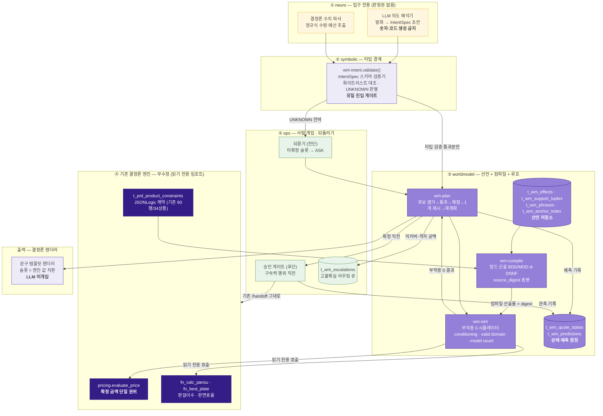

# 설계안 A — 선언적 월드모델 (Declarative World-Model Layer)

> 작성 2026-08-15 · 트랙 `huni-worldmodel/04_design`
> 관점: **A. 선언적/기호적 월드모델** — 상태·행동·행동의 효과·유효성 조건을 **데이터로 선언**하고, 그 위에서 플래너가 탐색한다. 학습이 아니라 선언이 핵심이다.
> [HARD] 규율: 모든 주장에 `파일경로:라인` 또는 선행 산출물 인용. 추정은 `[추정]` 배지. `raw/webadmin/**`·라이브 DB 무수정(본 설계는 얹기만 한다).
> [HARD] 이 설계안은 `04_design/evaluation-rubric.md`(사전등록 v1.0)를 읽고 작성했다. §9에 18개 규칙 전건 대응표를 둔다.

---

## 0. 고정 선언 (RULE-15 ④ — 문서 내 단일 선언)

| 항목 | 이 문서가 쓰는 단일 값 | 근거 |
|---|---|---|
| 권위 엑셀 (가격표) | **260705** | `_workspace/_foundation/PRICE-SHEET-SOT-260705.md:4,52` |
| 권위 엑셀 (상품마스터) | **260703** | 동상 |
| 상품 분모 | **288** (라이브 실측, `del_yn≠Y`) | `02_diagnosis/D8-live-schema.md:79` |
| 가격 값 권위 | `pricing.evaluate_price` **단일** (D-18) | `raw/webadmin/webadmin/catalog/pricing.py:428-429`(실측 확인) |
| 코드 수정 범위 | `raw/webadmin/**` **0줄**. 신규 자산은 별도 패키지 + `t_wm_*` 신규 테이블만 | N-16 `problem-ledger.md:459` |

260702 / 260610 / 260527 은 stale로 취급하며 이 문서에서 권위로 인용하지 않는다(P-23 `problem-ledger.md:311`).

---

## 1. 논지 (a)

> **후니에 없는 것은 모델이 아니라 "행동의 효과를 적어 둔 선언"이다. 그러므로 새 엔진을 만들지 않고, 인쇄 도메인의 `상태·행동·효과·전제조건`을 `t_wm_*` 선언 테이블로 데이터화한 뒤 그 위에 부작용 0의 플래너를 얹는다 — 가격은 여전히 `evaluate_price`가 홀로 산출하고, 플래너는 그것을 순수 오라클로 호출할 뿐이다.**

논지의 세 축:

1. **선언 우선.** R2가 확인했듯 PDDL 계보에서 domain 파일(행동의 전제조건·효과 = 명시적 전이함수)은 **자동생성 대상이 아니라 사람이 만들고 검증하는 자산**이다 — "LLM이 problem 파일은 잘 만들지만 domain 파일 생성은 최강 모델도 성능이 나쁘다"(`01_research/R2-world-model-theory.md` 요약 §선언형). 따라서 이 설계의 중심 작업은 알고리즘이 아니라 **효과 선언 스키마와 그것을 채우는 편집 표면**이다.
2. **제약 전파 + 지식 컴파일 결합.** R6의 판정표(`01_research/R6-cpq-constraint-theory.md:134-143`)가 우리 규모에서 살아남는다고 판정한 것은 GAC 전파(기반) + BDD/MDD·d-DNNF 컴파일(핵심)이며, 전수 열거·캐시 테이블은 배제다. 후니 카탈로그는 "거의 직교하는 축의 곱"이라 컴파일 친화적이다(`R6:85, 321`).
3. **모델이 아니라 루프.** 부품(`evaluate_price`·`_sim_disallowed`·`fn_best_plate`·`delete_usage`)은 이미 있다(`problem-ledger.md:38-44`). 없는 것은 그 부품이 딛고 설 **상태 그릇**과 **커밋 전 시뮬레이션 루프**다(`problem-ledger.md:499`).

**무엇을 대체하지 않는가**: `pricing.py` 3층 분리(값=DB / 문법=파이썬 / 기하=SQL)는 D2가 "의도된 설계이고 잘 지켜지고 있다"고 평가한 자산이다(`D2-pricing-engine.md:221`). 이 설계는 그 층을 **DB로 끌어내리지 않는다**(P-22는 상충 [추정]이므로 판단 보류 — `problem-ledger.md:486`). 대신 **가격 밖의 축**(가능성·효과·상태)을 선언으로 얹는다.

---

## 2. 아키텍처 계층도 (b)



**화살표 규율 (RULE-01 판정 절차용)**: LLM 노드의 출력 화살표는 **`IV`(wm-intent.validate) 단 하나**다. 그 외 어떤 도착지도 없다. 출력 자연어(`REN`)는 결정론 템플릿 렌더러이며 LLM이 관여하지 않는다.

---

## 3. 새로 도입하는 것 — 책임과 데이터 모델 초안 (c)

### 3.0 층 귀속표 (RULE-18)

| # | 구성물 | 층 | 성격 |
|---|---|---|---|
| C1 | `t_wm_effects` | knowledge · worldmodel | 신규 선언 테이블 (정의 원본) |
| C2 | `t_wm_support_tuples` | worldmodel | 신규 파생 인덱스 (정의 원본 아님) |
| C3 | `t_wm_quote_states` | worldmodel · ops | 신규 상태 그릇 |
| C4 | `t_wm_predictions` | worldmodel · ops | 신규 예측·관측 원장 |
| C5 | `t_wm_escalations` | ops | 신규 라우팅 큐 |
| C6 | `t_wm_phrases` | knowledge | 신규 문구 템플릿 (정의 원본) |
| C7 | `t_wm_anchor_index` | knowledge · ops | 신규 파생 인덱스 (원본은 §26/§33 산출물) |
| C8 | `wm-intent` (IntentSpec 스키마 + 검증기) | symbolic | 신규 코드 (별도 패키지) |
| C9 | `wm-compile` (지식 컴파일러) | worldmodel | 신규 코드 (빌드 산출물 생성) |
| C10 | `wm-sim` (부작용 0 시뮬레이터) | worldmodel | 신규 코드 |
| C11 | `wm-plan` (플래너 5단 루프) | worldmodel | 신규 코드 |
| C12 | 결정론 문구 렌더러 | symbolic | 신규 코드 |
| C13 | LLM 의도 해석기 | neuro | 신규 코드 (판정권 없음) |
| C14 | 결정론 수치 파서 | symbolic | 신규 코드 |
| C15 | `wm_golden_sweep.py` · `wm_ledger_diff.py` · `wm_parity_lint.py` | ops | 신규 검증 도구 |
| C16 | 승인 게이트 / DRY-RUN·undo 절차 | ops | 신규 운영 절차 |

미표기 구성물 0건.

---

### 3.1 C1 · `t_wm_effects` — 효과(effect) 선언 테이블 ★ 이 설계의 심장

**해결하는 문제**: P-14(효과 표현 그릇 부재 — `option → component` 링크 없음, `problem-ledger.md:232-238`). R5가 지목한 그대로 "현재 `has_component`는 공식→구성요소만 잇는다"이며, state/action/precondition/effect 4원소 중 **effect를 담을 그릇이 없다**.

**책임**: "이 선택을 켜면 무엇이 붙고, 무엇이 열리고, 무엇이 닫히는가"를 **행(row)으로** 선언한다. PDDL domain 파일의 `:effect` 절에 해당한다.

```
t_wm_effects
  eff_id           bigserial PK
  prd_cd           varchar   FK→t_prd_products         -- 상품 스코프(NULL 불가: 전역 선언 금지)
  act_dim_cd       varchar   -- 행동의 차원. 도메인 = t_cod_base_codes 'OPT_REF_DIM.*'
  act_val_cd       varchar   -- 행동의 값. 도메인 = 해당 차원 마스터의 코드
  eff_typ_cd       varchar   -- EFF_TYPE.01 구성요소 부가 / .02 차원 개방 / .03 차원 폐쇄
                             -- .04 동반 강제 / .05 결과축 영향
  tgt_kind         varchar   -- COMPONENT | DIM | DIM_VALUE | OUTCOME_AXIS
  tgt_cd           varchar   -- 예: comp_cd='COMP_COATING'
  magnitude        numeric   -- .05 결과축 영향에만 사용(예: 판면효율 델타). 가격은 절대 넣지 않음
  auth_anchor      varchar   -- 'xlsx:<파일>#<시트>!<셀>' 또는 't_<table>/<CODE>' (NOT NULL)
  note             text
  use_yn / del_yn / reg_dt / upd_dt        -- 기존 webadmin 규약 그대로
  UNIQUE(prd_cd, act_dim_cd, act_val_cd, eff_typ_cd, tgt_kind, tgt_cd)
```

**설계 규율 3항**
- `magnitude`에 **금액을 넣지 않는다.** 금액은 `evaluate_price` 독점(D-18). 이 컬럼은 결과축(판면효율)에만 쓴다.
- `auth_anchor` **NOT NULL** — 앵커 없는 효과 선언 금지. `huni-ontology-kb/02_ontology/ontology-schema.md:29-33`의 앵커 강제 규약을 그대로 승계한다(개방추출 금지 = N-05 준수).
- 이 테이블은 **정의 원본**이며 다른 어디에도 같은 사실을 두지 않는다(RULE-12 ①).

**편집 표면 판정 (RULE-12 ②)**: `t_wm_effects`는 JSONLogic이 아니라 **평면 행 모델**이다. 따라서 webadmin 폼빌더의 "역파싱 가능성" 문제(P-19 `views.py:3399-3423`의 raw JSONLogic escape hatch)가 **구조적으로 발생하지 않는다** — 폼 필드와 컬럼이 1:1이므로 왕복(round-trip)이 항등이다. 신규 제약을 승격할 때만 JSONLogic이 등장하며, 그때는 기존 하네스 규약대로 **여집합 금지형(`.02`)만** 쓰고 implication(`.03`)은 쓰지 않는다(N-11 준수, `problem-ledger.md:454`).

---

### 3.2 C2 · `t_wm_support_tuples` — 허용 튜플(파생 인덱스)

**해결하는 문제**: P-04(단가행 부재 `price_gap`가 제약 모델 밖 — "제약 그래프에 아예 들어 있지 않은 하드 제약", `D3-widget-cascade.md:190`)와 P-20(`tmpl_combo_gap`이 주문 시점에만 422, 탈출구 "관리자 문의", `widget_api.py:1894-1909`).

**책임**: 두 하드 제약을 **제약 모델 안으로 승격**한다. R6 §3의 명시 권고 — "허용 튜플 테이블 신설: 축 쌍/삼중의 허용 조합을 행으로 저장 → CP solver의 table constraint 및 BDD 컴파일 입력으로 양쪽 다 소비 가능"(`R6-cpq-constraint-theory.md:350`).

```
t_wm_support_tuples
  prd_cd, dim_a, val_a, dim_b, val_b          -- 축 '쌍' (필요 시 dim_c/val_c 삼중까지)
  src_kind    varchar  -- PRICE_ROW | TMPL_COMBO
  src_ref     varchar  -- comp_price_id 또는 tmpl_cd
  src_digest  varchar  -- 원천 테이블 스냅샷 다이제스트
  built_at    timestamptz
  PRIMARY KEY(prd_cd, dim_a, val_a, dim_b, val_b, src_kind)
```

**N-19(전수 열거·사전계산 적재) 재제안이 아님 — 명시 논증**
- N-19가 금지한 것은 "10¹⁵ 조합의 **결과**를 미리 계산해 테이블에 적재"다(`problem-ledger.md:462`).
- `t_wm_support_tuples`는 결과가 아니라 **축 쌍 사영(projection)** 이며 크기 상한이 `Σ_{쌍} |D_a|×|D_b|`로 **곱이 아니라 합**이다. 라이브 단가행 총수 23,573행(`D8:85`)이 사영의 상한 규모이지, 조합 수와 무관하다.
- 이 구조가 정확히 R6이 "채택(전처리)"으로 판정한 것이며(`R6:142`), 배제 판정을 받은 것은 "전수 열거 / 캐시 테이블"이다(`R6:140`).
- **정의 원본 아님**: 원천은 `t_prc_component_prices` / `t_prd_tmpl_combo_configs`이고 이 테이블은 결정론 빌더의 산출 인덱스다. 원천이 바뀌면 digest 불일치로 **판정 자체를 거부**한다(§7 신선도 규율).

---

### 3.3 C3·C4 · 상태 그릇과 예측·관측 원장

**해결하는 문제**: P-01(상태 그릇 부재 — `t_ord_*` 부재, `models.py:883-899`), P-09(전이함수 정확도 미측정), P-11(신뢰도 등급 부재).

```
t_wm_quote_states            -- append-only. 견적 구성의 궤적
  quote_id     uuid
  step_seq     int
  site_key, prd_cd
  intent_json  jsonb          -- 검증 통과한 IntentSpec
  sel_json     jsonb          -- 그 시점 부분 선택
  qty          int
  actor        varchar        -- CUSTOMER | STAFF | PLANNER
  created_at   timestamptz
  PRIMARY KEY(quote_id, step_seq)

t_wm_predictions             -- 예측을 남기고 나중에 관측으로 덮어쓰지 않고 '옆에' 적는다
  quote_id, step_seq, pred_kind        -- PRICE | FEASIBLE | PANSU | PLATE_EFF
  pred_val       jsonb
  confidence     varchar               -- CONFIRMED | PROVISIONAL | UNPRICED
  source_digest  varchar               -- 예측 시점의 컴파일·원천 다이제스트
  observed_val   jsonb                 -- 실제 handoff/실무 확인 결과 (NULL 허용)
  observed_at    timestamptz
  delta          jsonb                 -- 대조 결과 (wm_ledger_diff.py 가 채움)
  PRIMARY KEY(quote_id, step_seq, pred_kind)
```

**주문 테이블이 아니다.** `t_wm_quote_states`는 **견적 구성 궤적**이며 주문 실체(`t_ord_*`)를 신설하지 않는다 — 주문 확정은 기존 `/handoff` 경로가 그대로 소유한다(`widget_api.py:1958-1964`). 하네스 경계를 넘지 않기 위한 의도적 축소다.

---

### 3.4 C5·C6·C7 — 라우팅 큐 · 문구 템플릿 · 앵커 인덱스

| 테이블 | 책임 | 정의 원본? |
|---|---|---|
| `t_wm_escalations` | 고불확실 케이스(권위 격자 미적재 셀 / 신규 조합 / 제약 미커버)를 목적지 하네스와 함께 큐잉. 컬럼: `esc_kind, prd_cd, payload_json, route_to, status, created_at` | 원본 |
| `t_wm_phrases` | `rule_cd` → 고객 문장 + 복원 문장 템플릿. 슬롯은 `{dim_label}` 형태이며 값은 엔진이 채운다 | 원본 |
| `t_wm_anchor_index` | `comp_price_id` → `xlsx:파일#시트!셀`. **새 추출을 하지 않고** §26(`hpti` 권위 격자 추출)·§33(KB 앵커) 산출물을 인덱싱만 한다 | 파생 |

---

### 3.5 C8 · `IntentSpec` — 뉴로→심볼릭 타입 경계 (RULE-02)

```jsonc
// IntentSpec v1 — 자유 텍스트 전달 금지. 이 스키마 외의 것은 경계를 넘지 못한다.
{
  "prd_cd_candidates": ["<prd_cd>", ...],   // 도메인 출처: t_prd_products (화이트리스트 대조 필수)
  "qty":            500 | "UNKNOWN",        // 도메인 출처: t_prd_product_bundle_qtys + 수량규칙
  "dim_prefs": [                            // 선호이지 제약이 아니다
    { "dim_cd": "OPT_REF_DIM.03",           // 도메인 출처: t_cod_base_codes 'OPT_REF_DIM.*'
      "val_cd": "<mat_cd>" | "UNKNOWN",     // 도메인 출처: 해당 차원 마스터(t_mat_materials 등)
      "weight": 0.0 ~ 1.0 }
  ],
  "budget_krw":     50000 | "UNKNOWN",      // 원천 없음(고객 발화). 가지치기 전용, 확정가 아님
  "soft_terms":     ["<term_cd>"],          // 도메인 출처: t_wm_phrases 통제어휘. 자유문자열 금지
  "unresolved":     ["qty", "dim_prefs[2].val_cd"],   // 미확정 슬롯 목록 (필수 필드)
  "provenance":     { "utterance_span": {"qty": [4, 7]} }  // 수치가 원문 어디서 왔는지
}
```

**필드 3요건 (RULE-02 통과 기준)**
1. **필드 목록 + 각 필드 도메인 출처** — 위 주석에 `t_*` 축을 전건 명시.
2. **미확정 표현** — `"UNKNOWN"` 센티널 문자열 + `unresolved[]` 배열. `null` 금지(값 없음과 미확정을 섞지 않기 위함).
3. **검증 지점** — `wm-intent.validate()` 단 하나. 플래너 진입 **직전**이며 우회 경로 없음.

**LLM 숫자·코드 생성 금지 (RULE-01 (a) 방어 2겹)**
- 수치(`qty`·`budget_krw`)는 **결정론 정규식 파서**가 원문에서 추출하고 LLM은 "이 숫자가 수량인가 예산인가" **레이블만** 붙인다. 검증기는 `provenance.utterance_span`으로 **원문 부분문자열 실재를 대조**한다 — 불일치면 즉시 ASK로 반환.
- `prd_cd`·`val_cd`는 LLM이 **생성하지 않고 선택만** 한다. 후보 목록은 DB가 먼저 반환한 것뿐이며(R6이 확인한 Hinterdorfer 패턴 — "DB가 이전에 반환한 옵션 식별자만 전달 가능", `R6-cpq-constraint-theory.md:298`), 검증기가 화이트리스트 대조한다.
- 이는 저장소 [HARD] 규칙 "LLM 숫자전사 금지·결정론 파서"의 직접 구현이다.

---

### 3.6 C9 · `wm-compile` — 지식 컴파일러 (빌드 산출물, DB 아님)

입력: `t_prd_product_option_groups/options/option_items`(변수·도메인) + `t_prd_product_constraints`(기존 JSONLogic 제약) + `t_wm_support_tuples` + `t_wm_effects`의 `.02/.03`(차원 개방·폐쇄).
출력: 상품 1개당 컴파일 산출물(MDD 또는 d-DNNF) + `source_digest`.

제공 질의(R6 §b-3 표 `R6:104-111`): Consistency(CO) / Conditioning / Valid domain / **Model counting(CT)** / Enumeration.

**빌드가 곧 KB 감사다.** 컴파일 실패·void model·dead option은 그 자체가 지식베이스 결함 신호이며(`R6:211-217`), CI 게이트로 무료 획득된다(`R6:356`).

**자유입력 축의 취급**: 가로/세로 mm·직접입력 수량은 유한 도메인이 아니므로 컴파일 대상에서 **제외**하고, 구간 이산화 없이 **전파 밖 잔여 변수**로 분리해 `evaluate_price`·수량규칙(`PV.qty_rule_error`)에 그대로 위임한다. R6이 이 구간을 미해결로 남긴 것을 그대로 인정한다(`R6:429`).

---

### 3.7 C10·C11 · `wm-sim` / `wm-plan` — 부작용 0 시뮬레이터와 5단 루프

**RULE-03이 요구한 5단계의 구현 대응**

| 단계 | 구현 | 부작용 |
|---|---|---|
| ① 후보 열거 | 컴파일 산출물 valid domain 질의 | 없음 (메모리 내) |
| ② 월드모델 통과 | conditioning(가능성) → support tuple(단가행·조합템플릿) → `evaluate_price(mode="strict", only_comps=…)` 순수 호출 → `fn_calc_pansu`/`fn_best_plate` 읽기 전용 SELECT | **없음** (전부 읽기. 임포트만 하고 코드 수정 0) |
| ③ 채점 | feasible × `c_lb` 예산 적합 × 선호 가중치 × 정보이득 | 없음 |
| ④ 1개만 실행 | 사용자가 1개 선택 → `t_wm_quote_states` append | 최초 write (선택 확정 후에만) |
| ⑤ 관측 후 재계획 | `t_wm_predictions` 기록 → 다음 라운드 ①로 | append only |

**"저장 후 검증" 구조의 제거**: 현행 SKU 경로는 **커밋 후** 제약을 평가해 세션 경고를 낸다(`views.py:4081-4114`, `problem-ledger.md:131`). `wm-plan`은 그 반대다 — ②가 끝나기 전에는 어떤 write도 없다.

**`evaluate_price` 호출 규율**: `mode="strict"` **고정**. `lenient`는 데이터 구멍 발견용 진단 모드라고 엔진 스스로 선언하므로(`pricing.py` 독스트링 실측: `"lenient"(데이터 구멍 발견·0원 스킵+경고) | "strict"(계산불가 차단)`), 고객 경로에서는 strict만 쓴다. 이는 엔진의 2모드 인식론(N-24, 잘 되고 있는 것)을 **올바르게 사용하는 것**이지 엔진을 결함으로 세우는 것이 아니다.

**단조 하한 비용 `c_lb`**: 각 `option_item`에 "이걸 켜면 최소 얼마 늘어나는가"의 하한 태그. 가지치기·예산 대화 **전용**이며 화면에는 반드시 `"약 X원부터 (하한 · 확정가 아님)"`으로 확정가와 **구분 표기**한다. R6 §d-5 권장 구조 그대로이며 D-18을 깨지 않는다(`R6:262-271`).

---

### 3.8 도입하는 결과축과 그 원천 (RULE-16)

| 결과축 | 어느 결정을 바꾸는가 | 데이터 원천 | 채택? |
|---|---|---|---|
| 가격 | 견적 확정·예산 가지치기 | `evaluate_price` (기존) | ✅ |
| 제작가능성(feasible) | 후보 제시 여부 · 주문 차단 | `t_prd_product_constraints`(기존 60행) + `t_wm_support_tuples`(파생) | ✅ |
| 판면효율(1장당 판면적) | 동률 후보 중 생산 유리한 쪽 정렬 · 실무 검토 라우팅 | `fn_best_plate` **가 이미 계산하고 버리는 값** (`sql/33_fn_best_plate.sql:48`, `D2:369`) — 함수 재호출로 획득 | ✅ |
| 납기 · 수율 · 불량률 · 설비부하 · 재고 | — | **라이브 46 도메인 테이블에 원천 0** (`D8-live-schema.md:205`) | ❌ **도입하지 않음** |

원천 없는 축은 도입하지 않는다. `t_proc_processes`에 소요시간·수율 컬럼을 신설하자는 제안을 이 설계는 하지 않는다 — 그것은 데이터 수집 트랙의 일이지 월드모델 설계의 일이 아니다.

---

## 4. 기존 자산과의 접합면 (d)

### 4.1 `pricing.py` — 라이브러리 임포트, 수정 0

```python
# wm-sim 내부 (신규 패키지). raw/webadmin 파일은 열지도 않는다.
from webadmin.catalog import pricing            # 순수 모듈 (pricing.py:4-5 선언)

res = pricing.evaluate_price(
    {"prd_cd": prd_cd}, selections, qty,
    grade_cd=None, mode="strict",               # ← 고객 경로 strict 고정
    as_of=as_of,                                # ← 시점 반사실 (pricing.py:428-429 실측)
    only_comps=subset,                          # ← 구성요소 부분집합 what-if
    proc_sels=proc_sels, skip_plate=False,
)
```

- 반사실 인자 `as_of`·`only_comps`·`proc_sels`·`skip_plate`는 **이미 시그니처에 있다**(직접 실측: `pricing.py:428-429`). P-26이 지적한 "실행기는 있는데 연결이 없다"를 **엔진을 고치지 않고** 푸는 유일한 방법이 외부 호출자 신설이다.
- 출력 스키마는 그대로 소비한다 — `base.components[].matched_row`(`comp_price_id` 포함), `data_gap`, `warnings`, `errors`(실측: `pricing.py:560-581` 반환 dict). 특히 **`data_gap`이 있으면 "단가행 없어서 0원"**, 없으면 **"정당한 0원"**으로 판별한다(RULE-09 ② 대응).

### 4.2 `widget_api.py` — 병렬 배치, 대체 아님

| 기존 엔드포인트 | 이 설계의 태도 |
|---|---|
| `POST /price` (`widget_api.py:1244-1307`) | **그대로 둔다.** strict 호출 + `_price_gap_errors` 차단 로직은 이미 언더차지 방어로 작동 중(실측 `widget_api.py:1290-1303`) |
| `POST /validate` / `POST /handoff` | **그대로 둔다.** 주문 확정 권위는 여전히 `/handoff` |
| (신설) `GET /wm/next` | **신규·읽기 전용.** 현재 부분선택 → 각 차원 후보별 `{feasible, deny_kind, rule_cd, restore_candidates[], c_lb, confidence, effects[]}`. `widget_api.py`에는 이 엔드포인트가 없음이 실측됨(`D3-widget-cascade.md:19-34` 엔드포인트 전량 표) |
| (신설) `POST /wm/commit-step` | 사용자가 후보 1개를 고른 뒤에만 호출. `t_wm_quote_states` append |

`_sim_disallowed`(`price_views.py:2701-2734`)는 이미 존재하는 1변수 forward simulation이지만 관리자 전용이고 `widget_api`에서 호출 0건이다(`D3:118`). 이 설계는 **그 함수를 옮기지 않고**, 컴파일 표현으로 같은 질문에 더 깊게(다변수·backtrack-free) 답한 뒤, 파리티 린트로 두 결과가 갈리지 않는지 감시한다(§8 첫 조각 기준 참조).

### 4.3 `assistant_tools` 10종 — **접합하지 않는다 (범위 밖 명시)**

`assistant_tools.py`에 도구를 추가하는 것은 `raw/webadmin/**` 수정이므로 RULE-04·N-16 위반이다. 따라서 이 설계는 **비서 연결(P-26)을 범위에서 제외**한다. 대신:

- `wm-sim`이 노출하는 HTTP 계약을 `simulate_price` 도구와 **동형 파라미터**(`only_comps`·`as_of`·`proc_sels`·`skip_plate`)로 고정해 둔다.
- 후니 측이 나중에 webadmin을 수정하기로 결정하면, `assistant_tools.py:275-282`의 래퍼가 이 HTTP를 호출하도록 바꾸는 **단일 지점 변경**으로 끝난다.
- 그 결정 전까지 P-26은 미해결로 남는다. 숨기지 않고 §9·§10에 적는다.

### 4.4 참조차원 5벌 병렬(P-16)에 대한 태도 — **6벌로 늘리지 않는다**

이 설계는 차원의 **정의를 두지 않는다.** `wm-compile`은 기존 5개 표면(`views.py:61-69` `VAR_KEY_MAP` / `:1882-1890` `DIM_REF_MODELS` / `:1893-1901` `_DIM_LABEL_FIELDS` / `:3670-3678` `_IMPACT_SECTIONS` / DB 트리거 `fn_chk_opt_item_ref`)에서 **읽기만** 하며, 빌드 시 `wm_parity_lint.py`가 다섯 표면의 축 집합이 서로 일치하는지 검사해 **불일치면 빌드를 FAIL** 시킨다. 즉 6번째 정의가 아니라 **기존 5벌에 대한 정합 센서**를 얹는다. 정의는 여전히 webadmin에 산다.

> 정직한 리스크: 이 구분("정의 vs 파생 인덱스")은 논증이지 기계 판정이 아니다. 파리티 린트가 빠지면 이 계층은 실제로 6번째 정의가 된다. 그래서 린트를 **첫 조각의 필수 산출물**로 넣었다(§8).

---

## 5. 종단 시나리오 워크스루 (e)

입력 발화: **"명함 500장, 고급스럽게, 예산 5만원"**

| # | 계층 | 무슨 일이 일어나는가 | 부작용 |
|---|---|---|---|
| 1 | ops | 발화 수신. `quote_id` 발급(메모리) | 없음 |
| 2 | symbolic (C14) | 결정론 파서가 원문에서 숫자 추출 → `[500 @span(4,7)]`, `[50000 @span(15,18)]`. **LLM은 아직 등장하지 않는다** | 없음 |
| 3 | neuro (C13) | LLM이 레이블링만 수행 — `500→qty`, `50000→budget_krw`, `"고급스럽게"→soft_terms:["LUX"]`(통제어휘), 상품 후보는 DB가 먼저 준 목록에서 **선택만** | 없음 |
| 4 | symbolic (C8) | `wm-intent.validate()` — ① `qty=500`이 원문 span과 일치하는가 ② `prd_cd` 후보가 `t_prd_products` 화이트리스트에 있는가 ③ `LUX`가 `t_wm_phrases` 통제어휘인가 ④ `unresolved=[dim_prefs 다수]`. **통과분만 경계를 넘는다** | 없음 |
| 5 | worldmodel (C9→C10) | 후보 상품별 컴파일 산출물에 `qty=500` 조건화. `source_digest`가 라이브와 일치하는지 재확인(불일치 시 **판정 거부**) | 없음 |
| 6 | worldmodel (C11) | 예산 5만원으로 `c_lb` 가지치기. 하한이 50,000 초과인 가지는 **확실히** 배제(단조성 보장). 남은 공간의 model count 산출 | 없음 |
| 7 | worldmodel (C11) | 정보이득 최대 축 선택 → 화면에 질문 1개. `soft_terms:["LUX"]`는 **하드 제약이 아니라 사전분포 편향**으로만 들어간다 | 없음 |
| 8 | ops | **되묻기(전단)**: "종이를 고르실까요?" — 미확정 슬롯을 자동 기본값으로 채우지 않는다 | 없음 |
| 9 | worldmodel (C10) | 사용자가 5개 축을 고른 상태. 6번째 축 후보 3개에 대해 **각각** ①conditioning ②support tuple 조회 ③`evaluate_price(strict, only_comps)` ④`fn_calc_pansu`·`fn_best_plate` 호출. **DB write 0** | **없음** |
| 10 | worldmodel | 후보별 응답: `{feasible:true, c_lb:38,000, confidence:PROVISIONAL, effects:["COMP_COATING 부가"]}` / `{feasible:false, deny_kind:CONSTRAINT, rule_cd:"R_EXCL_COATING_THIN_PAPER", restore_candidates:["mat_cd를 250g 이상으로"]}` / `{feasible:false, deny_kind:DATA_GAP_PRICE, route_to:"§26 hpti"}` | 없음 |
| 11 | symbolic (C12) | 결정론 렌더러가 `t_wm_phrases` 템플릿에 슬롯 치환 → "얇은 종이에는 코팅을 올릴 수 없습니다. 종이를 250g 이상으로 바꾸면 가능합니다." **LLM 미개입** | 없음 |
| 12 | worldmodel (C11→C3) | 사용자가 1개 선택 → `t_wm_quote_states` append (여기서 **최초** write) | append |
| 13 | (7~12 반복 — 재계획) | 슬롯 전부 확정될 때까지 | append |
| 14 | worldmodel + ④ | 전 슬롯 확정 → `evaluate_price(strict)` 확정가 47,300원. `confidence` 판정: `t_siz_pansu` 권위 룩업 행 존재 → **CONFIRMED** / 없으면 기하 폴백 → **PROVISIONAL** | 없음 |
| 15 | knowledge (C7) | 감사 추적 부착 — 각 구성요소에 `{comp_price_id, xlsx:가격표260705#명함!D14, 선택이유:{차원키, 티어 min_qty}}` | 없음 |
| 16 | ops | **승인 게이트(후단)**: 고객 확인 → 기존 `/handoff`(`widget_api.py:1958-1964`)로 넘긴다. wm는 이 시점에 `t_wm_predictions`에 예측 기록 | append |
| 17 | ops (C4) | handoff 결과(200 / 422 코드)를 `observed_val`로 기록. `wm_ledger_diff.py`가 예측≠관측을 집계 | append |

**예산이 안 맞는 경우**: 6단계에서 `c_lb` 하한이 전부 50,000 초과면 "5만원으로는 이 구성이 불가합니다 — 수량을 300으로 줄이거나 후가공을 빼면 가능합니다"를 **알고리즘 출력**으로 낸다(복원 후보 = conditioning으로 계산). "관리자에게 문의"는 이 설계의 응답 어휘에 없다.

---

## 6. 제약·가격 결합의 정확한 차단 지점 (RULE-06)

시나리오: `R_EXCL_COATING_THIN_PAPER` 위반 조합(얇은 종이 + 코팅)으로 견적 요청.

```
wm-plan
  └─ ② 월드모델 통과
       ├─ [게이트 1] conditioning(컴파일 표현)     → INFEASIBLE
       │     └─ 여기서 즉시 종료. evaluate_price 를 호출하지 않는다.
       ├─ [게이트 2] t_wm_support_tuples 조회      (도달 안 함)
       └─ [게이트 3] evaluate_price(strict)         (도달 안 함)
  응답 스키마:  { feasible:false, deny_kind:"CONSTRAINT",
                 rule_cd:"R_EXCL_COATING_THIN_PAPER",
                 restore_candidates:[...] }
                 ← price 필드 자체가 없다 (경고 첨부가 아니라 필드 부재)
```

- **차단 층 = `wm-plan` 게이트 1**. 문서 내 특정 완료.
- **가격을 반환하지 않는다** — 값도, 경고 붙인 값도 아니다. 응답 스키마에서 `price` 키를 **제거**한다. R7이 인수심사 사례에서 확인한 "출력 스키마에서 구속력 있는 필드를 제거한다"(`R7-agentic-commerce.md:93`, 원장 인용 `problem-ledger.md:210`)의 직접 적용.
- **두 하드 제약의 편입**: `price_gap`은 게이트 2에서 `deny_kind:DATA_GAP_PRICE`, `tmpl_combo_gap`은 같은 게이트에서 `deny_kind:DATA_GAP_COMBO`로 잡힌다. 둘 다 **제약 모델 안**(`t_wm_support_tuples`)에 있으므로 캐스케이드가 **미리 예고**한다 — 현행처럼 "가격 다 보고 주문에서 422"(`widget_api.py:11-12`)가 아니다.
- **금지 vs 미등록 구별**: `deny_kind`가 세 값으로 구별한다 — `CONSTRAINT`(금지) / `DATA_GAP_PRICE`·`DATA_GAP_COMBO`(데이터 공백). 후자는 `t_wm_escalations`로 라우팅되며 고객에게는 "확인 후 안내드립니다"가, 실무진에게는 어느 격자 셀이 비었는지가 간다.

---

## 7. 실패 검출·되돌리기·신선도 (RULE-13)

**① fail-closed 전면 적용 — fail-open 도입 0**

| 신규 평가 지점 | 예외 발생 시 동작 |
|---|---|
| `wm-intent.validate()` | **ASK 반환**(되묻기). 통과 처리 금지 |
| 컴파일 조건화(게이트 1) | `feasible=false, deny_kind="WM_EVAL_ERROR"` + 에러 로그 + 에스컬레이션. **통과 금지** |
| support tuple 조회(게이트 2) | 동상 |
| `evaluate_price` 호출(게이트 3) | 예외 → 응답에서 `price` 키 제거 + `WM_ENGINE_ERROR`. 0원 대체 금지 |
| `fn_calc_pansu`/`fn_best_plate` | 예외 → `confidence="UNPRICED"`, 후보를 제시하지 않음 |

현행 `views.py:3836-3839`·`:4101-4104`의 "JSONLogic 예외를 통과로 처리"는 **이 설계가 승계하지 않는다**. 기존 코드는 무수정으로 남지만, `wm` 경로는 그 코드를 통과하지 않는다.

**② 라이브 write 3종 세트**

`t_wm_*` DDL 생성과 데이터 적재는 라이브 write다. 단계마다:
- **백업**: `pg_dump -t 't_wm_*'` + 대상 원천 테이블 스냅샷 다이제스트 기록
- **DRY-RUN**: 롤백 전용 트랜잭션에서 전체 UPSERT 실행 → 영향 행수 보고 (기존 `dbm-load-execution` R1~R6 게이트 절차 재사용, 새 절차 발명 금지)
- **undo**: 각 적재본에 역방향 SQL 동봉. 논리삭제(`del_yn='Y'`)만 사용하며 물리 DELETE 금지
- **인간 승인**: COMMIT 직전 필수 (MEMORY [HARD] "COMMIT=인간승인")

기존 도메인 테이블(`t_prd_*`·`t_prc_*`·`t_cod_*`)에 대한 write는 **이 설계에 0건**이다. 신규 제약 승격이 필요해도 그것은 §31 `huni-constraint-rules` 하네스의 등록 절차로 라우팅한다.

**③ 신선도 — 스냅샷 신뢰 금지 (N-13 준수)**

- `wm-compile` 산출물은 `source_digest`(원천 테이블 `max(upd_dt)` + 행수 해시)를 동봉한다.
- `wm-sim`은 **매 판정마다 라이브를 재-SELECT**해 digest를 재계산하고, 불일치면 **판정을 거부**하고 재컴파일을 요구한다. 낡은 산출물로 답하지 않는다.
- 가격 값은 캐시하지 않는다 — 항상 `evaluate_price` 실호출.

---

## 8. 첫 조각(first slice)과 기계 판정 기준 (f) · 종료 척도 (RULE-05·08·17)

### 8.1 첫 조각 = **상품 1종(일반 명함 계열 대표) × 3산출물**

| # | 산출물 | 내용 |
|---|---|---|
| S1 | `t_wm_support_tuples` 빌더 + 적재 (해당 상품 한정) | `price_gap`·`tmpl_combo_gap`을 제약 모델 안으로 승격 |
| S2 | `wm-compile` 파일럿 + `GET /wm/next` (읽기 전용) | 후보별 `{feasible, deny_kind, rule_cd, restore_candidates, c_lb, confidence}` 반환 |
| S3 | 검증 3종 (`wm_golden_sweep.py` · `wm_parity_lint.py` · `wm_repro_gate.py`) | 아래 게이트 |

`t_wm_effects`·`t_wm_quote_states`·`t_wm_predictions`는 스키마만 정의하고 **적재는 두 번째 조각**으로 미룬다 — 첫 조각의 목적은 "선언적 접근이 우리 데이터에서 작동하는가"를 반증 가능하게 만드는 것뿐이다.

### 8.2 기계 판정 기준 (4항 전부 명시)

| 게이트 | ① 측정 대상 | ② 측정 도구 | ③ 통과 임계(허용오차) | ④ 분모 |
|---|---|---|---|---|
| **G-A 전이함수 정확도** | `evaluate_price(strict)` 산출가 vs 권위 정답가 | `wm_golden_sweep.py` — 골든 CSV(상품·옵션조합·수량·권위 정답가) × 라이브 재-SELECT 재계산, 셀 단위 diff | **오차 0원. 불일치 1건이면 FAIL** | 파일럿 상품의 골든 케이스 **30건** (권위 260705 가격표에서 추출) |
| **G-B 컴파일 실측** (RULE-08) | 노드 수 · 컴파일 시간 · 유효 구성 수(model count) · 질의 지연 | `wm_compile_bench.py` | 노드 수 **≤ 50,000** · 컴파일 **≤ 60초** · `/wm/next` p95 **≤ 50ms**. 초과 시 컴파일 계열 **기각**하고 GAC 전파 단독으로 후퇴 | 파일럿 상품 1종 |
| **G-C 파리티** | `wm-sim` 불가값 판정 vs 기존 `_sim_disallowed`(`price_views.py:2701-2734`) 판정 | `wm_parity_lint.py` — 동일 부분선택 200개 샘플에서 두 결과 대조 | **기존이 불가라 한 것을 wm가 가능이라 하면 0건**(반대 방향은 허용 — wm가 더 깊게 자름). 위반 1건이면 FAIL | 샘플 200 |
| **G-D 차원 정의 정합** | `views.py`의 5개 표면 + DB 트리거의 축 집합 | `wm_parity_lint.py --dims` | **5벌 전부 동일 집합. 불일치 1건이면 빌드 FAIL** | 축 12종(`price_views.py:31-44` `DIM_META` 기준) |
| **G-E 재현 결정론** (RULE-17) | 동일 의도 문장을 k=8회 입력했을 때의 **최종 상태**(확정 옵션 집합 + `final_price`)의 SHA-256 | `wm_repro_gate.py` — 대화 텍스트가 아니라 최종 상태 해시를 비교. LLM 온도 설정에 의존하지 않고, 해시 불일치 시 어느 슬롯에서 갈렸는지 보고 | **8/8 동일. 7/8이면 FAIL** | 의도 문장 10종 × k=8 = 80회 |
| **G-F 신뢰도 구별** (RULE-09) | 권위 룩업 견적 vs 기하 폴백 견적 / 정당한 0원 vs 단가행 부재 0원 | `wm_golden_sweep.py --confidence` | 네 케이스가 **출력 필드로 구별 가능**해야 함(`confidence`·`zero_reason`). 구별 불가 1건이면 FAIL | 각 케이스 최소 1건 |

### 8.3 이 설계가 스스로 선언하는 반증 조건

> **G-B가 FAIL하면 컴파일 계층을 버린다.** 그 경우 이 설계는 "선언 + GAC 전파 + support tuple" 3개만 남는 축소판으로 후퇴하며, 정보이득 대화(model counting 의존)는 **성립하지 않는다**고 인정한다.
> **G-C에서 wm가 기존보다 느슨하면(기존 불가 → wm 가능) 즉시 중단한다.** 그것은 선언이 원천을 배신했다는 뜻이다.
> **G-A가 FAIL하면 월드모델을 얹을 자격이 없다.** 전이함수의 오차를 모르는 상태에서 그 위에 플래너를 올리는 것은 오차를 증폭할 뿐이다(P-09 `problem-ledger.md:190-193`).

---

## 9. [필수] 루브릭 대응표 (h)

| RULE | 등급 | 판정 | 어떻게 충족하는가 (설계의 어느 부분) |
|---|---|---|---|
| **RULE-01** 판정권 심볼릭 독점 | BLOCKER | **충족** | §2 계층도에서 LLM 노드의 출력 화살표는 `wm-intent.validate()` **1개뿐**. 수치는 결정론 파서(C14)가 추출하고 LLM은 레이블만 부여, 검증기가 원문 span 대조(§3.5). `prd_cd`·`val_cd`는 DB가 준 목록에서 선택만. 가능/불가 판정은 `wm-plan` 게이트 1(컴파일 표현)이 하고 LLM은 관여 0. 출구 자연어도 결정론 템플릿(C12) — LLM 미개입 |
| **RULE-02** 인터페이스 타입화 | BLOCKER | **충족** | §3.5 `IntentSpec` — ① 필드별 도메인 출처를 `t_*` 축으로 전건 명시 ② 미확정은 `"UNKNOWN"` 센티널 + `unresolved[]`(null 금지) ③ 검증 지점은 `wm-intent.validate()` 단 하나(플래너 진입 직전, 우회 없음) |
| **RULE-03** 커밋 전 시뮬레이션 루프 | BLOCKER | **충족** | §3.7 5단계 대응표 + §5 워크스루 9행. "6개 중 5개 고른 상태에서 6번째 후보 3개" 시나리오가 §5-9~10에 그대로 있고, 계산은 **DB write 0**. 최초 write는 사용자가 1개 고른 뒤(§5-12). 현행 "저장 후 검증"(`views.py:4081-4114`)은 이 경로에 없음 |
| **RULE-04** 가격 단일권위 + 무수정 | BLOCKER | **충족** | §0 고정 선언 + §4.1 — `raw/webadmin/**` 0줄 수정, `pricing.py`는 임포트만. 확정 금액은 `evaluate_price`만 산출(§5-14). 컴파일·선언 계층은 가격을 계산하지 않음(`t_wm_effects.magnitude`에 금액 금지, §3.1). `c_lb`는 하한 지표이며 화면에 "약 X원부터(하한·확정가 아님)"로 구분 표기(§3.7) |
| **RULE-05** 반증 가능한 종료 척도 | BLOCKER | **충족** | §8.2 게이트표 — G-A~G-F 각각에 ①측정 대상 ②도구(스크립트명) ③임계(허용오차 0원 등) ④분모(30건·200샘플·80회 등) 4항 명기. §8.3에 "무엇이 FAIL이면 이 설계를 버리는가"를 선언 |
| **RULE-06** 제약×가격 결합 | MAJOR | **충족** | §6 — 차단 층은 `wm-plan` 게이트 1로 특정. 가격은 **반환하지 않음**(경고 첨부가 아니라 `price` 키 제거). `price_gap`·`tmpl_combo_gap` 두 하드 제약이 `t_wm_support_tuples`로 제약 모델 **안에** 들어옴(§3.2) |
| **RULE-07** 상태 그릇과 교정 루프 | MAJOR | **충족** | §3.3 — (a) `t_wm_quote_states`(그릇 위치) (b) `t_wm_predictions` + `wm_ledger_diff.py`(예측·관측 대조 절차). 주문 실체는 신설하지 않고 견적 궤적만 담아 하네스 경계 유지 |
| **RULE-08** 조합폭발 대응의 작동성 | MAJOR | **충족** | ① 전수 열거·사전계산 없음 — `t_wm_support_tuples`는 축 쌍 사영이며 N-19와 다름을 §3.2에서 명시 논증 ② 1상품 파일럿 실측 항목이 §8.2 G-B에 4개(노드 수·컴파일 시간·model count·질의 지연) + 임계 + 기각 조건까지 명시 |
| **RULE-09** 불확실성의 가시화 | MAJOR | **충족** | ① `confidence ∈ {CONFIRMED, PROVISIONAL, UNPRICED}` — `t_siz_pansu` 권위 룩업 행 존재 여부로 판정(§5-14) ② `zero_reason ∈ {PRICED_ZERO, NO_ROW}` — `evaluate_price` 출력의 `data_gap` 유무로 판별(§4.1). 게이트 G-F가 이 구별을 기계 검사(§8.2) |
| **RULE-10** 설명과 일관성 복원 | MAJOR | **충족** | §6 응답 스키마가 `rule_cd`(위반 규칙 신원)와 `restore_candidates[]`(무엇을 풀면 가능한가 — conditioning으로 계산)를 반환. `deny_kind` 3값이 금지(`CONSTRAINT`) vs 미등록(`DATA_GAP_*`)을 호출자에게 구별 제공. "관리자에게 문의"는 응답 어휘에 없음(§5) |
| **RULE-11** 감사 추적 | MAJOR | **충족** | §5-15 — (a) `comp_price_id`(`evaluate_price`의 `matched_row`) (b) `t_wm_anchor_index`의 `xlsx:가격표260705#시트!셀` (c) 선택 이유(차원 키 + 티어 `min_qty`) 세 개를 함께 반환. `t_wm_effects.auth_anchor`는 NOT NULL |
| **RULE-12** 단일 정의·단일 편집표면 | MAJOR | **충족** | ① 도입 개념별 "정의가 사는 곳" — 효과=`t_wm_effects`(원본), 허용튜플=원천 `t_prc_*`/`t_prd_tmpl_combo_configs`(파생 인덱스), 상태=`t_wm_quote_states`(원본), 문구=`t_wm_phrases`(원본), 차원=**기존 webadmin(내 계층은 정의를 두지 않음)**. §3.0·§4.4 ② 역파싱 판정: `t_wm_effects`는 평면 행이라 폼 1:1 매핑(왕복 항등), 신규 제약은 여집합 금지형 `.02`만(§3.1) ③ ref_dim은 6벌로 늘리지 않고 파리티 린트(G-D)만 얹음(§4.4) |
| **RULE-13** 실패 검출과 되돌리기 | MAJOR | **충족** | §7 — ① 신규 평가 지점 5개 전부 fail-closed 동작 명시(통과 처리 0) ② 라이브 write마다 백업·DRY-RUN·undo 3종 + 인간 승인 ③ `source_digest` 재계산 + 라이브 재-SELECT, 불일치 시 판정 거부(N-13 준수) |
| **RULE-14** 사람 개입의 배치 | MAJOR | **충족** | ① 미확정 슬롯 자동 기본값 채움 경로 **없음** — 되묻기(ASK)가 정상 경로(§5-8, §7 fail-closed 표) ② 승인 게이트: 라이브 write(§7 ②)·주문 확정(§5-16)·가격 예외(에스컬레이션 승인) 전건 ③ 고불확실 라우팅 목적지 = `t_wm_escalations` + `route_to`(권위 격자 미적재 → §26 hpti / 제약 미커버 → §31 constraint-rules)(§3.4, §6) |
| **RULE-15** 선행 자산 정합 | MINOR | **충족** | ① N-01~N-19 대조 — 임베딩·트리플스토어·OWL·개방추출·RDF 스택 미제안, 온톨로지가 가격 계산 안 함(N-08), raw/webadmin 무수정(N-16), 신경망 latent 미이식(N-17), LLM 판정권 0(N-18), 전수 열거 아님(N-19 §3.2 논증), implication shape 미사용(N-11), 스냅샷 신뢰 금지(N-13) ② N-20~N-30을 결함으로 서술하지 않음 — 특히 lenient/strict 2모드(N-24)를 "올바르게 사용"으로 다룸(§3.7) ③ P-08(가격 배선)을 범위에 흡수하지 않음 — `data_gap`은 **탐지·라우팅**만 하고 배선 작업은 §7 dbmap/§18로 보냄(§6) ④ 권위 260705/260703, 분모 288 단일 선언(§0) |
| **RULE-16** 결과축 확장의 절제 | MINOR | **충족** | §3.8 표 — 채택 3축(가격·제작가능성·판면효율) 각각에 (a)어느 결정을 바꾸는가 (b)데이터 원천 명시. 판면효율은 `fn_best_plate`가 이미 계산하고 버리는 값(`sql/33:48`) 재활용. 납기·수율·불량률·설비부하·재고는 **원천 0이므로 도입하지 않음**을 명시 |
| **RULE-17** 재현 결정론 | MAJOR | **충족** | §8.2 G-E — (a) 의도 문장 10종 × k=8회 (b) 비교 대상은 **최종 상태**(확정 옵션 집합 + `final_price`)의 SHA-256, 대화 텍스트 아님 (c) 재현성은 엔진 쪽에서 확보 — LLM 출력은 `IntentSpec`으로 타입 축소되고 이후 전 경로가 결정론(컴파일 질의·`evaluate_price`·템플릿 렌더러). temperature 설정에 의존하지 않음 |
| **RULE-18** 층 귀속의 명시 | MINOR | **충족** | §3.0 층 귀속표 — C1~C16 전 구성물에 neuro/symbolic/knowledge/worldmodel/ops 귀속 표기. 미표기 0건 |

**미충족 규칙: 0건.** 다만 아래 두 가지는 위반이 아니지만 **범위 축소로 인한 미해결**이므로 숨기지 않고 적는다.

| 항목 | 상태 | 이유 |
|---|---|---|
| P-26 (비서에 반사실 인자 연결) | **범위 밖** | `assistant_tools.py` 수정이 RULE-04 위반이므로 제외. HTTP 계약만 동형으로 고정해 둠(§4.3) |
| P-22 (전이함수 DB 이관) | **판단 보류** | D2와 D8이 상충하고 루브릭 §5-6이 "평가하지 않는다"고 선언 |
| P-16 (ref_dim 5벌) | **완전 해소 아님** | 정의 통합이 아니라 파리티 센서만 얹음. 통합은 webadmin 수정이 필요하므로 이 설계가 할 수 없음(§4.4) |

---

## 10. 이 접근이 실패한다면 이유는 (자기 약점 — 숨기지 않음)

### W-1. 선언 비용이 전부 사람에게 간다 — 그리고 그 사람이 없을 수 있다

이 설계의 심장인 `t_wm_effects`는 **자동으로 채워지지 않는다.** R2가 확인한 대로 PDDL domain 파일 생성은 최강 모델도 성능이 나쁘고, 이는 우연이 아니라 효과 지식이 관측이 아니라 판단이기 때문이다. R6은 같은 것을 이렇게 표현했다 — **"우리가 지불할 비용은 10¹⁵을 다루는 비용이 아니라 암묵지를 명시 제약으로 옮기는 비용"**(`R6-cpq-constraint-theory.md:89`).

즉 이 설계의 성패는 알고리즘이 아니라 **실무진이 288개 상품의 효과를 몇 개나 적어 주는가**에 달렸다. 라이브 제약규칙 커버리지가 현재 **11.8%(34/288)**(`D8-live-schema.md:130`)라는 사실은 이 비용이 지금까지 지불되지 않았다는 증거다. 선언이 안 채워지면 플래너는 아무것도 자르지 못하고, 결과적으로 **비싼 방식으로 현행과 똑같이 동작**한다.

### W-2. 컴파일이 우리 데이터에서 작동한다는 것이 아직 [추정]이다

R6 스스로 미해결로 남겼다 — "§b-1의 '독립축이므로 표현이 작다'는 BDD 이론에서 도출한 [추정]이며 후니 데이터로 실측되지 않았다. 교차 제약을 넣는 순간 결과가 달라질 수 있다"(`R6:430`). 그리고 닭·달걀이 있다 — 유효 구성 수를 세려면 제약이 명시돼야 하는데, 제약 명시가 바로 하려는 일이다(`R6:428`). G-B 게이트는 이 도박을 첫 조각에서 정면으로 치르게 만드는 장치이지, 이길 것이라는 보장이 아니다.

### W-3. 선언은 부분관측을 메우지 못한다

P-10(자재종속 판걸이수 — 프리미엄엽서 권위 15/12/8 vs 엔진 18/12/9, `_foundation/product-scoreboard.csv:2`)은 **규칙으로 적을 수 없는 종류**의 지식이다. `fn_calc_pansu` 2인자 시그니처가 자재 종속을 표현할 수 없다는 것은 근사 문제가 아니라 상태공간 문제이며, 해법은 선언이 아니라 **관측 테이블**(`t_siz_pansu` 권위 룩업)이다. 이 설계는 그 구간을 `confidence:PROVISIONAL` 플래그로 **가시화만** 하고 해결하지 않는다. 저청구가 사라지는 것이 아니라 보이게 될 뿐이다 — 그것도 가치이지만, "해결"이라고 부르면 거짓이다.

### W-4. 자유 입력 축이 컴파일 밖에 남는다

가로/세로 mm·직접입력 수량은 유한 도메인이 아니라 순수 BDD/MDD로 표현 불가하며, R6이 인쇄 도메인 사례를 찾지 못했다고 명시했다(`R6:429`). 이 설계는 그 축을 컴파일에서 제외하고 기존 경로에 위임한다. 따라서 **"backtrack-free 보장"은 이산 축에 한정**되며, 자유 입력이 지배적인 상품군(사인·실사 계열)에서는 이 설계의 이득이 크게 줄어든다.

### W-5. 파리티 센서는 정의 통합이 아니다

§4.4에서 인정한 대로, "정의를 두지 않고 센서만 얹는다"는 논증이지 구조적 보장이 아니다. 린트가 CI에서 빠지거나 누군가 `t_wm_*`에 차원 이름을 직접 적기 시작하면 이 계층은 **여섯 번째 정의**가 되고 P-16이 악화된다. RULE-12 위반으로 뒤집힐 수 있는 가장 현실적인 지점이 여기다.

### W-6. 두 개의 진실 원천이 생긴다 (컴파일 산출물 vs 라이브)

`source_digest` 재검증으로 방어하지만, 그 방어가 작동하는 한 **컴파일 산출물이 자주 무효화되고**(단가행은 23,573행이고 적재 트랙이 계속 돌고 있다), 무효화될 때마다 재컴파일이 필요하다. 재컴파일이 느리면(G-B 60초 임계) 운영 중 판정 거부가 잦아지고, 그 순간 현장은 이 계층을 우회하려 할 것이다. **엄격한 신선도 규율과 실용성이 정면으로 충돌**하며, 이 설계는 신선도 쪽을 택했다.

### W-7. 관점 자체의 한계 — 학습을 배제했다

이 설계는 지정된 관점대로 선언을 극대화했고, 그 대가로 **관측에서 배우는 경로를 전부 잘랐다.** 주문 이력 사전분포로 정보이득 대화의 기대 질문 수를 줄이는 것(`R6:309`)은 데이터가 쌓인 뒤에야 가능하고, 이 설계는 그 데이터(`t_wm_predictions`)를 **모으기만 하고 쓰지 않는다.** "선언으로 다 된다"가 틀렸다면, 그것이 드러나는 자리는 정보이득 계산이 실전에서 균등분포 상한(51비트 — `R6:308`)에 가깝게 나오는 순간이다.

---

## 11. 이 설계가 틀렸다면 어디서 먼저 드러나는가 (g)

**순서대로, 가장 빨리 드러나는 것부터.**

1. **G-D 파리티 린트 (빌드 첫 실행)** — `views.py`의 5개 표면이 실제로 서로 다르면 빌드가 즉시 FAIL한다. 이 경우 "차원 정의는 webadmin에 산다"는 전제 자체가 거짓이고(정의가 이미 갈려 있으므로), §4.4의 논증이 무너진다. **가장 싸게 드러나는 반증.**
2. **S1 support tuple 빌드 (첫 조각 1단계)** — 파일럿 상품의 축 쌍 사영이 거의 비면(제약이 기록돼 있지 않으므로), 승격할 하드 제약이 없다는 뜻이다. 그러면 이 설계가 P-04·P-20에 대해 약속한 "미리 예고"는 **선언이 채워진 뒤에나 성립**하며, 첫 조각은 빈 껍데기를 배포하는 것이 된다.
3. **G-B 컴파일 실측 (첫 조각 2단계)** — 노드 수가 50,000을 넘거나 컴파일이 60초를 넘으면 R6의 "직교 축이라 표현이 작다"는 [추정]이 우리 데이터에서 반증된 것이다. 컴파일 계층을 버리고 GAC 전파 단독으로 후퇴해야 하며, 그 순간 **정보이득 대화(model counting 의존)가 통째로 사라진다.**
4. **G-A 골든 스윕 (첫 조각 3단계)** — 30건 중 1건이라도 오차가 나면, 얹으려는 전이함수가 이미 틀렸다는 뜻이다. 이 경우 월드모델 작업은 중단하고 §7 dbmap/§18 배선 트랙으로 되돌아가야 한다.
5. **G-E 재현 게이트 (첫 조각 이후)** — 8/8이 안 나오면 결정론이 엔진이 아니라 모델 쪽에 새고 있다는 뜻이며, 대개 `IntentSpec` 검증기가 너무 헐거워 LLM 판단이 하류로 새는 지점을 가리킨다.
6. **W-1 (배포 후 수 주)** — 위 전부를 통과해도, `t_wm_effects`가 파일럿 상품 외로 확산되지 않으면 이 설계는 조용히 실패한다. 이것은 게이트로 잡히지 않는 유일한 실패이며, 측정 대리지표는 **`t_wm_effects` 행수 / 상품수**와 **`t_wm_escalations` 처리율**이다.

---

## 12. 미확인 · 한계

1. **`wm-compile`의 구현 라이브러리를 확정하지 않았다.** BDD(CUDD/dd) · MDD · d-DNNF(c2d/D4) 중 무엇을 쓸지는 G-B 실측 후 결정한다. 본 문서는 계열만 지정한다.
2. **골든 케이스 30건을 아직 추출하지 않았다.** 권위 260705 가격표에서 어느 셀을 뽑을지는 §26 `hpti` 산출물(권위 격자)에 의존하며, 그 산출물의 파일럿 상품 커버 여부를 확인하지 않았다.
3. **`c_lb` 하한의 단조성이 판걸이 계단함수에서 실제로 유지되는지 미검증.** R6이 "가장 유리한 구간을 가정하면 단조성이 유지된다"고 했으나(`R6:377`), 오차율은 R6 스스로 미측정으로 남겼다(`R6:431`). 하한이 실제보다 너무 낮으면 가지치기가 무력해지고, 너무 높으면 유효한 후보를 잘라낸다.
4. **`widget_renderer.js`를 읽지 않았다.** 클라이언트 캐스케이드의 실제 깊이는 D3도 서버 주석에서 추론했을 뿐이다(`D3-widget-cascade.md:288`). `/wm/next`가 렌더러와 어떻게 공존할지는 미설계.
5. **라이브 재실측 미수행.** 본 문서의 수치는 D8(2026-08-15 실측)의 인용이며, 첫 조각 착수 시 N-13에 따라 재-SELECT가 선행되어야 한다.
6. **파일럿 상품을 코드로 특정하지 않았다.** "일반 명함 계열 대표 1종"은 `t_prd_products`에서 제약규칙 보유 34상품 ∩ 가격공식 바인딩 171상품의 교집합에서 골라야 하며, 그 교집합을 실측하지 않았다.
7. **웹 검색 미사용.** 본 문서는 선행 산출물(R1·R2·R5·R6·R7·D1~D8·문제 원장·평가 루브릭)과 저장소 내부 파일(`pricing.py`·`price_views.py`·`widget_api.py` 직접 실측)만을 근거로 하므로 `Sources:` 절을 두지 않는다. 외부 1차 출처는 각 R 문서의 `Sources:` 절이 보유한다.
