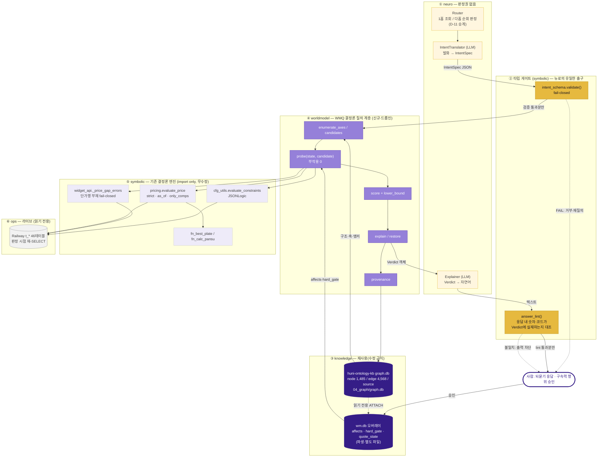

# 설계안 B — 지식 우선 (Knowledge-First / GraphRAG)

> 작성 2026-08-15 · 트랙 `huni-worldmodel/04_design` · 관점 B(지식 계층 우선)
> 입력: `04_design/evaluation-rubric.md`(전문) · `03_problem/problem-ledger.md`(전문) · `01_research/R5·R6` · `02_diagnosis/D7` + 라이브 그래프 실측(2026-08-15) + `raw/webadmin` 읽기 전용 코드 확인
> [HARD] 규율: 모든 주장에 `파일경로:라인` 또는 선행 산출물 인용. 추정은 `[추정]`. raw/webadmin·라이브 DB 무수정(본 문서는 설계까지이며 적재·COMMIT은 인간 승인).
> [HARD] 이 설계안은 **지정된 단일 관점(B)을 극대화**한다. 다른 관점(엔진 신설·컴파일 우선)과 타협하지 않는다 — 3안 비교는 별도 심사 소관이다.

---

## 0. 고정 선언 (RULE-15 (d) 이행)

이 문서 전체가 사용하는 권위와 분모를 **하나로** 못 박는다.

| 항목 | 이 설계가 채택하는 단일 값 | 근거 |
|---|---|---|
| **권위 엑셀** | 인쇄상품 가격표 **260705** · 상품마스터 **260703** | `_workspace/_foundation/PRICE-SHEET-SOT-260705.md:4,52`("최신 권위(절대)"·나머지 stale) |
| **상품 분모** | 라이브 실측 **288** | `02_diagnosis/D8-live-schema.md:79` |
| **최종 금액 권위** | `pricing.evaluate_price` 단일 (D-18) | `raw/webadmin/webadmin/catalog/pricing.py:428-429`; 경계 선언 `_workspace/huni-ontology-kb/02_ontology/ontology-schema.md:19` |
| **판정 입력 신선도** | 판정 시점 **라이브 재-SELECT** (스냅샷 불신) | 기각 N-13 / `problem-ledger.md:456`, `huni-ontology-kb/HANDOFF.md:25`(H-1 드리프트 2회 실증) |

**버전 스큐 정직 기록**: 재사용하는 KB 그래프의 `xlsx:` 앵커는 **260702** 기준이다(`ontology-schema.md:31`). 위 권위 선언(260705/260703)과 어긋난다(P-23). 이 설계는 그 스큐를 숨기지 않고 **역할 분리로 격리**한다 — 그래프는 *구조*(어떤 축이 존재하는가)에만 쓰고, *값·존재 판정*은 항상 라이브 재-SELECT가 한다(§5 G1~G5). 스큐가 구조까지 오염했는지는 종료 척도 A7이 측정한다(§8).

---

## (a) 논지 — 한 문장

> **월드모델을 새로 만들지 않는다. 이미 검증된 지식 그래프(`huni-ontology-kb`, 노드 1,485·엣지 4,568)를 "행위→효과" 스키마로 승격하고, 그 위에 부작용 없는 결정론 질의 계층(WMQ)을 얹어, 기존 결정론 엔진 4종(`evaluate_price`·JSONLogic 제약·`_price_gap_errors`·`fn_best_plate`)을 *같은 상태 위에서* 호출·결합하게 한다 — LLM은 의도→타입 있는 기호 객체 번역과 결과 설명만 맡고, 어떤 판정도 하지 않는다.**

이 논지의 핵심 주장은 세 가지다.

1. **없는 것은 지식이 아니라 지식의 *동적 절반*이다.** 현재 그래프는 구조(product 274·size 174·material 162·option_group 146)는 두껍고 의미·행위층(intent 3·rule 7·constraint 10)은 비어 있다(실측 §1.1). R5가 지목한 직접 원인은 `option → component` 링크 부재다(`R5-ontology-graphrag.md:212`).
2. **그 링크는 새로 채굴하지 않아도 된다 — 이미 있는 두 사실의 조인으로 *파생*된다.** `option_refs` 엣지(298건, option_group→material/process/size)와 `price_component.use_dims`(차원 키 선언)가 그래프에 이미 실재한다(§1.1 실측). 둘을 조인하면 "이 옵션을 켜면 어느 구성요소의 단가행 선택이 바뀌는가"가 나온다. **정의를 새로 만드는 것이 아니라 이미 선언된 두 정의를 잇는 것**이므로 RULE-12(단일 정의)를 구조적으로 위반할 수 없다.
3. **엔진은 4개나 있는데 서로를 모른다(W-2).** 지식 계층이 이들을 *같은 상태 객체* 위에 세우면 결합이 발생한다 — 새 엔진 0개.

---

## (b) 아키텍처 계층도



**LLM 노드 출력 화살표 전수 추적** (RULE-01 위반테스트 이행):

| LLM 노드 | 출력 | 도착지 | 결정론 검증기 통과? |
|---|---|---|---|
| Router | 라우팅 라벨(`onehop`/`multihop`) 1개 | `enumerate_axes` 진입 분기 | 라벨 enum 검증(2값). 값·판정 산출 아님 |
| IntentTranslator | `IntentSpec` JSON | **`intent_schema.validate()`** | ✅ fail-closed 스키마 검증기 |
| Explainer | 자연어 텍스트 | **`answer_lint()`** → 사람 | ✅ 숫자·코드 리터럴 실재 대조 게이트 |

**LLM 노드에서 `evaluate_price`/제약엔진/스키마 검증기가 아닌 곳으로 가는 화살표는 0건이다.** 도착지가 사람인 경로는 반드시 `answer_lint()`를 경유한다.

---

## (c) 새로 도입하는 것 — 책임과 데이터 모델 초안

새로 만드는 것은 **4개**다. 그 외는 전부 기존 자산의 재사용·조인이다.

### N-1. KB-WM 스키마 증분 v1.1 — 관계 3종 추가, 개체 신설 0

| 층 | knowledge |
|---|---|
| 사는 곳 | `_workspace/huni-worldmodel/04_design/kb-wm-schema-delta.md`(신규 문서) + 파생 산출은 `wm.db` |
| 원본 무손상 | `_workspace/huni-ontology-kb/**` 는 **읽기만**. `nodes.jsonl`·`edges.jsonl`·`graph.db`·`build_graph.py` 무수정(보호 자산 — `huni-ontology-kb/HANDOFF.md:59-60`, D7 A1/A3) |

기존 스키마는 개체 17종·관계 19종 폐쇄 목록이며 "신설은 이 문서에 등재 후에만"이 규약이다(`ontology-schema.md:103`). 이 설계는 **개체를 하나도 신설하지 않고**(search-before-mint), 관계 3종만 델타 문서에 등재한다.

| # | 관계 | 방향 | 유래 태그 | 의미 | 왜 신설이 아니라 파생인가 |
|---|---|---|---|---|---|
| **R20** | `affects` | option_group → price_component | `derived` | 이 선택 축이 저 구성요소의 **단가행 선택에 관여**한다 (금액이 아니라 관여 사실) | `option_refs` 타깃 차원 ↔ `price_component.use_dims` 키의 결정론 조인. 두 사실 모두 그래프에 이미 실재 |
| **R21** | `gated_by` | product\|option_group → gap | `derived` | 단가행 부재(`price_gap`)·조합템플릿 미등록(`tmpl_combo_gap`)이라는 **하드 제약**을 제약 모델 안으로 끌어들임 | 라이브 실측(단가행 존재·`t_prd_templates` 등록)에서 결정론 유도. `gap` 개체는 이미 있음(229개) |
| **R22** | `predicted_by` | quote_state → price_component | `derived` | 이 견적이 어느 구성요소를 예측 근거로 삼았는가(관측 대조용) | 기록 관계. 정의 아님 |

`derived_from`(R17)이 이미 "계산 의존성을 관계로 명시"하는 1급 관계로 등재돼 있으므로(`ontology-schema.md:141`), R20~R22는 그 계열의 확장이며 **어휘 철학의 일탈이 아니다**.

**R20 파생 규칙(결정론·의사코드)**

```
for og in option_group:                     # graph.db: node.type='option_group'
    dims = { dim_key_of(t) for t in edges(og, 'option_refs') }
            # material-* → 'mat_cd' | process-* → 'proc_cd'
            # size-*     → 'siz_cd' | print_option-* → 'print_opt_cd'
    prd  = parent_product(og)               # anchor = t_prd_product_option_groups/<prd_cd>
    for f in edges(prd, 'priced_by'):
        for c in edges(f, 'has_component'):
            if dims ∩ keys(c.props.use_dims) ≠ ∅:
                emit affects(og → c, qualifier={via: dims ∩ keys(...)})
            elif keys(c.props.use_dims) == ∅:
                emit gated_by(c → GAP_affect_undefined_<c>)   # P-05 사각지대 강제 등재
```

`use_dims`는 그래프에 이미 저장돼 있다 — 실측 예: `component-COMP_ACRYL_CLEAR3T.props.use_dims = ["mat_cd","siz_width","siz_height","min_qty"]`(graph.db 조회, 2026-08-15). `option_refs`도 실재한다 — 실측 예: `optgroup-016-paper --option_refs--> material-MAT_000074`(동상).

**`use_dims`가 빈 구성요소는 파생 사각지대다**(정확히 P-05 상시과금 케이스). 숨기지 않고 `GAP_affect_undefined_*` 노드로 강제 등재하고, 그 구성요소를 포함하는 견적은 **무조건 PROVISIONAL로 강등**한다(§d-3). 이것이 이 설계의 가장 정직한 지점이자 가장 약한 지점이다(§9-1).

### N-2. `wm.db` — 파생 오버레이 + 상태 그릇

| 층 | knowledge(파생) + worldmodel(상태) |
|---|---|
| 사는 곳 | `_workspace/huni-worldmodel/05_gate/wm.db` (SQLite 단일 파일, 빌드 산출물) |
| 라이브 관계 | 라이브 `t_*` 에 **테이블을 신설하지 않는다.** 라이브 write 0 |
| 원본 관계 | `graph.db` 를 `ATTACH ... AS kb` 읽기 전용으로 붙임 |

```sql
-- 파생 (매 빌드마다 전량 재생성 — 멱등)
CREATE TABLE wm_affect(
  option_group_id TEXT, price_component_id TEXT, via_dims TEXT,
  origin TEXT DEFAULT 'derived', build_hash TEXT,
  PRIMARY KEY(option_group_id, price_component_id));

CREATE TABLE wm_hard_gate(               -- R21 실물. price_gap / tmpl_combo_gap
  prd_cd TEXT, gate_kind TEXT,           -- 'PRICE_ROW_MISSING' | 'TMPL_COMBO_UNREGISTERED'
  dim_key TEXT, dim_val TEXT, gap_node_id TEXT,
  observed_at TEXT,                      -- 라이브 재-SELECT 시점 (스냅샷 아님)
  PRIMARY KEY(prd_cd, gate_kind, dim_key, dim_val));

-- 상태 그릇 (P-01). 견적 1건 = 1행. 라이브 주문 테이블이 아니다
CREATE TABLE wm_quote_state(
  quote_id TEXT PRIMARY KEY,
  prd_cd TEXT, qty INTEGER,
  selections_json TEXT,                  -- 확정 축
  unknown_slots_json TEXT,               -- 미확정 축 (자동 채움 금지 대상)
  intent_spec_json TEXT,                 -- 뉴로 입력 원본 (재현성 측정 키)
  predicted_json TEXT,                   -- 예측: final_price·feasible·confidence·components
  observed_json TEXT,                    -- 관측: 실제 handoff 결과 / 실무진 정정값
  reconcile_verdict TEXT,                -- MATCH | MISMATCH | PENDING
  as_of TEXT, created_at TEXT, approved_by TEXT);
```

`wm_quote_state`는 **주문 실체가 아니라 예측-관측 대조 원장**이다. 주문·견적 실체 테이블 신설은 라이브 스키마 변경이므로 이 설계의 범위 밖이고(RULE-04), 대조 루프에 필요한 최소 그릇만 오버레이에 둔다.

### N-3. WMQ — 결정론 질의·시뮬레이션 계층 (드롭인 패키지)

| 층 | worldmodel(오케스트레이션) + symbolic(게이트) |
|---|---|
| 사는 곳 | `huni_wm/` — **`raw/webadmin` 트리 밖**의 별도 패키지. webadmin 코드를 `import` 만 하고 수정하지 않는다 |

공개 함수 5개. 전부 **부작용 0**(라이브·wm.db 어디에도 write 하지 않음. write는 §e-10 승인 이후 단 1지점).

| 함수 | 책임 | 반환 |
|---|---|---|
| `enumerate_axes(state)` | 미확정 축 목록 + 각 축의 **정보이득 대용치** = `wm_affect` 팬아웃 수 | `[{dim_key, n_candidates, affect_fanout}]` |
| `enumerate_candidates(state, dim_key)` | 그 축의 후보 코드값. **그래프에서 열거하되 실재는 라이브 재-SELECT로 확인** | `[code, …]` |
| `probe(state, dim_key, value)` | **커밋 전 시뮬레이션 1발.** G1~G5 게이트 통과. DB write 0 | `Verdict` |
| `explain(verdict)` | why-not + 복원 후보 | `{rule_cd, reason_kind, restore_candidates[]}` |
| `provenance(verdict, comp_cd)` | 감사 3항 | `{comp_price_id, authority_anchor, selection_reason}` |

**`Verdict` 자료구조 (출력 스키마 — RULE-06·09·10·11이 여기 착지한다)**

```python
Verdict = {
  "feasible": bool,                    # G1~G3 결과. False면 price는 None (경고 아님)
  "reason_kind": str|None,             # OUT_OF_SCOPE | CONSTRAINT_VIOLATION
                                       # | PRICE_ROW_MISSING | TMPL_COMBO_UNREGISTERED
                                       # | NOT_PRICEABLE | EVAL_ERROR
  "rule_cd": str|None,                 # 제약 위반 시 규칙 신원 (cfg_utils 소실분 복원)
  "restore_candidates": [              # 무엇을 되돌리면 가능해지는가
      {"dim_key": str, "revert_to": str|None, "unblocks": [rule_cd]}],
  "price": {                           # feasible=False면 통째로 None
      "final_price": int,              # evaluate_price(strict) 원값 — WMQ 재계산 0
      "authority": "evaluate_price",
      "components": [{
          "comp_cd": str, "subtotal": int,
          "zero_reason": "TRUE_ZERO"|"MISSING_PRICE_ROW"|None,   # RULE-09 ②
          "comp_price_id": int|None,
          "authority_anchor": str,     # 'xlsx:…#시트!범위' 또는 't_prc_component_prices/<id>'
          "selection_reason": {"matched_dims": {...}, "tier_min_qty": int|None}}]},
  "lower_bound": {"amount": int, "kind": "MONOTONE_LOWER_BOUND",
                  "display_label": "최소 ~원부터(확정가 아님)"},   # RULE-04 구분 표기
  "confidence": "CONFIRMED"|"PROVISIONAL",                        # RULE-09 ①
  "confidence_reasons": [str],         # 'PANSU_GEOMETRIC_FALLBACK' | 'AFFECT_UNDEFINED' …
  "as_of": str, "live_read_at": str    # 신선도 증명
}
```

### N-4. `IntentSpec` — 뉴로→심볼릭 인터페이스 (RULE-02 착지점)

| 층 | symbolic(스키마·검증기) |
|---|---|
| 사는 곳 | `huni_wm/intent_schema.py` **단 하나**. 다른 어느 곳에도 이 스키마의 두 번째 정의를 두지 않는다 |
| 검증 지점 | `intent_schema.validate(obj)` — 뉴로 산출물이 WMQ로 들어가는 **유일한 문**. 실패 = **거부(fail-closed)** + 재질의 |

| 필드 | 타입 | 도메인 출처(어느 `t_*` 축인가) | 필수 | unknown 표현 |
|---|---|---|---|---|
| `prd_candidates` | `list[prd_cd]` | `t_prd_products.prd_cd` — **도구가 라이브에서 반환한 코드만** 허용 | ✅ (≥1) | 빈 리스트 금지 → 되묻기 |
| `qty` | `int` | `t_prd_product_bundle_qtys`(min/max/incr) 범위 검사 | ⬜ | `null` |
| `axis_prefs` | `list[{dim_key, ref_code}]` | `dim_key` ∈ `t_prc_price_components.use_dims` 키집합 (**새 어휘 0** — §d-2)<br/>`ref_code` ∈ 그 축의 `t_*` 코드값 | ⬜ | 원소 부재로 표현 |
| `soft_prefs` | `list[str]` | 폐쇄 어휘 — KB `term`·`intent` 노드 id만(`INTENT_*`/`TERM_*`) | ⬜ | 빈 리스트 |
| `budget_krw` | `int` | 원천 없음(고객 발화). **가지치기 전용, 가격 산출에 미투입** | ⬜ | `null` |
| `unknown_slots` | `list[dim_key]` | 위 `dim_key`와 동일 어휘 | ✅ | **명시 열거가 필수** — 비면 "모두 확정"이라는 강한 주장 |
| `provenance` | `{utterance, model, ts}` | — | ✅ | — |

**미확정(unknown)을 두 방향으로 표현한다** — 값 `null`(그 축을 아직 안 물음)과 `unknown_slots` 열거(그 축을 물어야 함). SAP LO-VC가 미할당 값을 3치로 다루는 이유와 같다(`R6-cpq-constraint-theory.md:179`). **`unknown_slots`가 비어 있지 않으면 WMQ는 확정 견적을 산출하지 않는다** — 자동 기본값 채움 경로가 코드에 없다(RULE-14 ①).

**LLM은 값을 생성하지 않고 선택만 한다.** `prd_candidates`·`ref_code`는 직전 도구 호출이 라이브에서 반환한 식별자여야 하며, 그렇지 않으면 검증기가 거부한다 — Hinterdorfer의 "DB가 이전에 반환한 옵션 식별자만 전달 가능 → 환각 식별자는 구조적으로 불가능" 패턴을 그대로 승계한다(`R6-cpq-constraint-theory.md:298`).

---

## (d) 기존 자산과의 접합면

### d-1. `pricing.evaluate_price` — 호출만, 수정 0

| 항목 | 이 설계의 사용법 | 근거 |
|---|---|---|
| 호출 시그니처 | `evaluate_price(target, selections, qty, grade_cd, mode="strict", as_of=<today>, only_comps=…, skip_plate=False)` | `pricing.py:428-429` |
| `mode` | **항상 `strict`.** lenient 기본값(P-06)을 WMQ가 절대 타지 않게 명시 고정 | `pricing.py:429`(기본 lenient), `D2:286` |
| `only_comps` | **반사실 실험 전용** — §8 A1 감사에서 옵션 on/off 스윕에 사용. 고객 견적 경로에서는 미사용(부분 합산 = 저청구 위험) | `pricing.py:428`("시뮬레이터 what-if 전용") |
| `as_of` | probe 시점 오늘 날짜 명시 주입(미래분 배제·재현성 고정) | `pricing.py` docstring |
| 반환값 | **재계산 0.** `final_price`를 그대로 `Verdict.price.final_price`에 전재. WMQ는 금액에 산술 연산을 하지 않는다 | `pricing.py:555-582` 반환 dict |
| `components[].data_gap` | `zero_reason` 판정 입력 — 비어 있고 subtotal 0 → `TRUE_ZERO`, `data_gap` 있으면 `MISSING_PRICE_ROW` | `pricing.py` `_skipped_entry`(`data_gap` 키 실재) |

### d-2. 차원 어휘 — 5벌을 6벌로 늘리지 않는다 (RULE-12 ③)

P-16의 5벌 병렬(`VAR_KEY_MAP` `views.py:61-69` / `DIM_REF_MODELS` `:1882-1890` / `_DIM_LABEL_FIELDS` `:1893-1901` / `_IMPACT_SECTIONS` `:3670-3678` / DB 트리거 `fn_chk_opt_item_ref`)에 **WMQ는 6번째 목록을 만들지 않는다.**

WMQ의 `dim_key` 어휘는 **선언이 아니라 조회**다 — 실행 시점에 `SELECT DISTINCT jsonb_array_elements_text(use_dims) FROM t_prc_component_prices ... ` 계열로 라이브 `t_prc_price_components.use_dims`에서 읽어 온다. 즉 WMQ 소스코드에 차원 이름 리터럴 목록이 존재하지 않는다. 이는 기존 엔진의 강점(N-25 "엔진의 도메인 무지 — 데이터 드리븐", `pricing.py:373-399`)을 그대로 계승하는 것이다.

> 이 설계는 P-16(5벌 병렬)을 **해결하지 않는다.** 해결은 §33/webadmin 소관이고 여기서 흡수하면 하네스 경계 침범이다. 이 설계가 지는 의무는 **악화시키지 않는 것**뿐이며, 조회 방식이 그것을 구조적으로 보장한다.

### d-3. `cfg_utils.evaluate_constraints` — 호출 + 규칙 신원 복원

기존 함수는 `bool`만 반환해 `rule_cd`·`err_msg`가 병합 시점에 소실된다(`cfg_utils.py:42-79`, P-12). WMQ는 **그 함수를 고치지 않고**, 같은 SQL(`compile_constraints_orm`이 읽는 `t_prd_product_constraints`, `cfg_utils.py:43-51`)을 **규칙 단위로 다시 읽어 개별 평가**한다.

```
merged 평가(기존 호출) → False 이면
  for each rule in SELECT rule_cd, err_msg, logic FROM t_prd_product_constraints
      WHERE prd_cd=? AND use_yn='Y' AND del_yn='N':
      if jsonLogic(rule.logic, data) is False:  → 위반 규칙 신원 확보
```
이 재평가는 **읽기 전용이고 기존 판정을 뒤집지 않는다** — 병합 결과(권위)는 그대로 쓰고, 신원만 추가로 얻는다. 예외 발생 시 **fail-closed**: `feasible=False, reason_kind="EVAL_ERROR"` + 로그(P-19 fail-open을 승계하지 않음 — RULE-13 ①).

### d-4. `widget_api._price_gap_errors` — 재구현하지 않고 승계

단가행 부재의 fail-closed 가드는 **이미 존재한다**(`widget_api.py:455-477`). 가족형 쌍 면제(260805)·`proc_cd` 제외 같은 도메인 미묘함이 그 함수 주석에 축적돼 있다(`widget_api.py:463-477`). WMQ는 이것을 **import 해서 그대로 호출**하고, 그 결과를 `reason_kind="PRICE_ROW_MISSING"` + `wm_hard_gate` 행으로 승격시킨다. 즉 **P-04("제약 모델 밖")의 해소는 새 판정기가 아니라 기존 판정기를 제약 모델 안으로 옮기는 것**이다.

`tmpl_combo_gap`도 동형이다 — `widget_api.py:1894-1909`의 422 차단 조건을 **주문 시점이 아니라 probe 시점에** 평가해 `reason_kind="TMPL_COMBO_UNREGISTERED"`로 낸다. "관리자에게 문의"(`widget_api.py:1906-1907`)는 WMQ 출력에 존재하지 않는다.

### d-5. `assistant_tools` 10종 — 접합의 정직한 경계

`assistant_tools.TOOL_SPECS`는 순서가 동결된 모듈 상수이고(`assistant_tools.py:872-874`), 도구 등록은 `_DISPATCH` dict 수정을 요구한다(`assistant_tools.py:1095-1116`). **이는 `raw/webadmin` 수정이므로 RULE-04에 걸린다.**

| 항목 | 이 설계의 처리 |
|---|---|
| 재사용(수정 0) | `search_products`·`get_product_config`·`get_widget_config`·`search_masters`·`run_sql`(읽기 전용 게이트 — N-26) 5종을 **IntentSpec 슬롯 채우기 도구로 그대로 사용**. `ref_code` 허용 집합이 이 도구들의 반환값에서 나온다 |
| 대체 | `simulate_price`(lenient 고정·셋트 거부·반사실 인자 미노출 — `assistant_tools.py:275-282`)는 **사용하지 않는다.** WMQ `probe()`가 strict·셋트 미거부·반사실 인자 노출로 상위집합을 제공 |
| **미해소 (정직 기록)** | WMQ `probe`를 비서 도구로 **등록**하려면 `assistant_tools.py` 수정이 필요하다. 이 설계는 그 수정을 **하지 않는다.** 따라서 **P-26(비서에 월드모델 미연결)은 이 설계 범위에서 해소되지 않는다** — WMQ는 독립 CLI/서비스로 동작하고, 비서 연결은 "webadmin 수정 인간 승인 후 `_DISPATCH`에 1줄, `TOOL_SPECS` 말미에 1개 추가"라는 **후속 이관 명세**로만 남긴다(§10) |

### d-6. `huni-ontology-kb` — 읽기 전용 ATTACH

`graph.db` 스키마 실측(2026-08-15): `node(id,type,anchor,badge,props,standards,file_path)` / `edge(src,rel,dst,origin,qualifier,note)` / `source(node_id,source_file,source_locator,captured_at,badge,src_id)`. **`source` 테이블이 RULE-11(감사추적)의 착지점이다** — 실측 행 예: `DEC_corner_260702 | _workspace/_foundation/batch/wiring/HANDOFF.md | 모서리비 COMP_PP_CORNER_RIGHT .01→.03 | 2026-07-03 | verified | SR-27-wiring`.

`provenance()`는 이 테이블을 조인해 `authority_anchor`를 낸다. 보호 자산이므로 **`ATTACH DATABASE ... AS kb` + `PRAGMA query_only=1`** 로만 접근하고, 빌드 전후 `graph.db` 해시 동일성을 CI에서 검사한다(§8 A8).

---

## (e) 종단 시나리오 워크스루

> 발화: **"명함 500장, 고급스럽게, 예산 5만원"**

| # | 층 | 무슨 일이 일어나는가 | 산출 |
|---|---|---|---|
| 1 | neuro(Router) | 다축 구성 질의로 분류 → 그래프 순회 경로 허용. (만약 "명함 최소 몇 장?"이었다면 1홉 조회로 분류돼 **그래프 순회 금지** — R5 §1.4 / D-11 승계) | `label=multihop` |
| 2 | neuro(IntentTranslator) | `search_products("명함")` 호출 → 라이브가 반환한 `prd_cd` 목록만 후보에 담는다. "고급스럽게"는 **하드 제약으로 번역하지 않는다** → `soft_prefs:["TERM_premium"]`. "500" → `qty`. "5만원" → `budget_krw`. 자재·후가공은 안 물어봤으므로 `unknown_slots:["mat_cd","proc_cd","print_opt_cd"]` | `IntentSpec` |
| 3 | **게이트** | `intent_schema.validate()` — `ref_code` 전부 도구 반환값 집합에 속하는가, `unknown_slots` 어휘가 `use_dims` 키집합에 속하는가. 실패 시 **거부·재질의**(사람에게) | PASS/FAIL |
| 4 | knowledge | `graph.db`: `prd_candidates` 각각에 `has_option_group` → `option_refs`로 축과 도메인을 열거. `wm_affect`로 각 축의 팬아웃(= 그 축이 몇 개 구성요소의 단가행 선택을 바꾸는가)을 붙임 | 축 목록 + 후보 |
| 5 | worldmodel ①**후보 열거** | 팬아웃 최대 축 = `mat_cd`(용지). 후보 3개를 라이브 재-SELECT로 실재 확인 | `[MAT_a, MAT_b, MAT_c]` |
| 6 | worldmodel ②**월드모델 통과 (부작용 0)** | 후보 **3개 각각**에 `probe()`. 게이트 순서:<br/>**G1** KB 범위(앵커 실재·`RULE_scope_boundary`) → **G2** JSONLogic 제약(`cfg_utils`, 라이브 재-SELECT) → **G3** 하드 게이트(`_price_gap_errors` + tmpl_combo) → **G4** `evaluate_price(strict, as_of)` → **G5** 신뢰도 등급.<br/>**G1~G3 중 하나라도 불가면 G4를 호출하지 않는다** — 불가능 조합에 가격이 붙지 않는 이유가 여기다(RULE-06) | `Verdict × 3` |
| 7 | worldmodel ③**채점** | `feasible AND lower_bound.amount ≤ 50000`. `MAT_c`는 하한 62,000원 → 가지치기. **확정가가 아니라 하한이므로 "최소 62,000원부터(확정가 아님)"로만 노출** | 후보 2개 생존 |
| 8 | worldmodel ④**1개만 실행** | "실행" = **화면 제시**. DB write 0. 확정 선택은 사람이 한다 | 카드 2장 + why-not 1장 |
| 9 | worldmodel ⑤**관측 후 재계획** | 사람이 `MAT_a` 선택 → state 갱신 → 5로 복귀. `unknown_slots`가 빌 때까지 반복. **자동 기본값 채움 경로 없음** | 루프 |
| 10 | 불가 발생 시 | 예: 오시+미싱 동시 선택 → `feasible=False, rule_cd="R_DEMO_EXC", reason_kind="CONSTRAINT_VIOLATION"`, `restore_candidates=[{dim_key:"proc_cd", revert_to:null, unblocks:["R_DEMO_EXC"]}]`. **가격 필드는 `None`**(경고 아님) | `explain()` |
| 11 | 확정 | 전 축 확정 → `evaluate_price(strict)` 확정가 + 구성요소별 `authority_anchor`·`selection_reason`·`zero_reason` + `confidence` | 확정 `Verdict` |
| 12 | neuro(Explainer) | Verdict → 자연어. 숫자·코드는 Verdict의 값을 **슬롯으로 삽입**만 하고 LLM이 생성하지 않는다 | 텍스트 |
| 13 | **게이트** | `answer_lint()` — 텍스트에 등장한 모든 숫자·코드 리터럴이 Verdict 객체에 실재하는지 대조. 불일치 1건이라도 있으면 **출력 차단**(R5 기전③ — 오답 0의 대가는 기권) | 통과분만 사람에게 |
| 14 | 사람 | 구속력 행위(`handoff`) **직전 인간 승인**. 승인 시에만 `wm_quote_state`에 `predicted_json` 기록 → 이후 실제 결과를 `observed_json`에 기록 → `reconcile_verdict` | 유일한 write 지점 |

**"고급스럽게"가 어떻게 처리되는가** — 이 설계에서 `soft_prefs`는 **후보를 자르지 않고 순서만 바꾼다**. LLM의 해석이 틀려도 유효 조합이 사라지지 않으며, 틀렸다는 사실은 사람이 다음 축을 고르는 순간 드러난다. R6이 정확히 이 배치를 처방했다 — "하드 제약이 아니라 선호 가중치로만 주입 ← [중요] LLM 출력은 제약이 아니다"(`R6-cpq-constraint-theory.md:390`).

---

## (f) 첫 조각 (first slice)과 기계 판정 기준

### f-1. 파일럿 대상: **PRD_000016 프리미엄엽서** 1상품

선택 이유(전부 실측 근거):

| 조건 | 실측 |
|---|---|
| KB 노드가 이미 정합 예시로 존재 | `ontology-schema.md:183-207`(예시 A) |
| 공식 배선 완료(10구성요소) | `ontology-schema.md:209-233`(`formula-PRF_DGP_A`) |
| option_group 실재 3개 + `option_refs` 실재 | graph.db 실측 — `optgroup-016-{corner,crease,paper}`, `optgroup-016-paper --option_refs--> material-MAT_000074/MAT_000082` |
| 제약 규칙 실재 2건(상호배제 포함) | graph.db 실측 — `constraint-016-demo-exc`(`rule_cd=R_DEMO_EXC`, 오시×미싱 상호배제), `constraint-016-demo-vis` |
| **신뢰도 등급 시나리오가 한 상품에서 나옴** | `gap-digital-pansu-73x98` — 권위 15 vs 시트 18 충돌(`ontology-schema.md:235-249`), 저청구 실측(`_foundation/product-scoreboard.csv:2`) |

즉 RULE-06·09·10·11의 시나리오가 **전부 이 한 상품 안에서 재현된다.**

### f-2. 성공/실패 판정 기준 — 기계 검증 가능 형태

| ID | 측정 대상 | 측정 도구 | 통과 임계(허용오차) | 분모 |
|---|---|---|---|---|
| **A1** | `affects` 파생의 정확성 | `huni_wm/audit/affect_sweep.py` — 각 option_item on/off × `evaluate_price(only_comps=…)` 반사실 스윕. 실제로 `subtotal` 또는 `matched_row`가 바뀐 구성요소 = **관측**, 파생 `wm_affect` = **예측** | **정밀도 = 1.000**(오탐 0, 허용오차 0)<br/>**재현율 ≥ 0.95** | 016의 `option_item` × `PRF_DGP_A` 구성요소 **10개** 전수 쌍 |
| **A2** | probe 무부작용 | `audit/sideeffect.sh` — 스윕 전후 라이브 46개 `t_*`의 `count(*)` + `max(upd_dt)` 해시 비교 | **완전 일치**(차이 0행) | 라이브 도메인 테이블 46 |
| **A3** | 재현 결정론 (RULE-17) | `audit/repeat_k.py` — **동일 IntentSpec** 10회 종단 실행, 비교 대상 = **최종 상태**(`selections` 집합 + `final_price` + `confidence`), 대화 텍스트 아님 | **10/10 완전 일치** | k=10 |
| **A3′** | 뉴로 축 재현성(별도 측정) | 동일 **발화** 10회 → `IntentSpec` 정규화 후 일치율 | 참고 지표(임계 없음). 불일치는 A3를 깨뜨리지 않음 — 불일치 시 `unknown_slots`로 흡수되어 되묻기 | k=10 |
| **A4** | 제약×가격 결합 (RULE-06) | `audit/constraint_price.py` — `R_DEMO_EXC` 위반 조합(오시+미싱) probe | **`price is None` AND `rule_cd=="R_DEMO_EXC"` AND `len(restore_candidates)≥1`** — 100% | 위반 조합 전수(2공정 조합) |
| **A5** | 감사추적 3항 (RULE-11) | `audit/provenance.py` — 확정 견적의 전 구성요소에 대해 `comp_price_id`·`authority_anchor`·`selection_reason` 동시 존재 검사 | **반환률 = 1.000** | 016 확정 견적의 포함 구성요소 전수 |
| **A6** | 라우팅 오분류 (GraphRAG 비용 가드) | `audit/router.py` — 1홉 질의 20건(`nl-query-paths` S3 계열) 투입 | **그래프 순회 호출 0회**, 다홉 질의 20건에서 순회 ≥1회 | 40질의 |
| **A7** | KB 구조 스큐 (P-23 격리 검증) | `audit/skew.py` — 016의 `has_option_group`/`option_refs` 그래프 엣지 vs 라이브 `t_prd_product_option_groups`/`_items` 재-SELECT diff | **구조 diff = 0건**. ≥1건이면 "그래프를 구조에 쓴다"는 전제가 깨짐 → 설계 반증 신호 | 016의 옵션 엣지 전수 |
| **A8** | 원본 무손상 | CI: `sha256 graph.db nodes.jsonl edges.jsonl build_graph.py` 빌드 전후 비교 | **완전 일치** | 4파일 |
| **A9** | 파일럿 규모 실측 (RULE-08) | `audit/scale.py` — 016의 노드/엣지 수, `wm_affect` 파생 행수, 유효 후보 수, `probe()` 지연 p50/p95 | 임계 없음 — **미측정이면 실패**. 수치가 기록되어야 동형 전파 판단이 가능 | 016 |

**실패 판정**: A1~A8 중 **하나라도** 임계 미달이면 이 설계는 파일럿에서 반증된 것으로 간주하고, §9의 해당 실패 경로를 확정 사실로 승격한다. A9는 값이 아니라 **기록 여부**로 판정한다.

### f-3. 첫 조각의 산출물 4개

1. `kb-wm-schema-delta.md` — R20~R22 등재 문서(개체 신설 0)
2. `huni_wm/` 패키지 — `intent_schema.py` · `wmq.py`(5함수) · `audit/`(A1~A9 스크립트)
3. `wm.db` 빌드 스크립트 — 016 범위. 멱등(재실행 시 해시 동일)
4. `pilot-016-verdict.md` — A1~A9 실측표

**DB 미적재.** 라이브 `t_*` write 0. `wm.db`는 오버레이 파일이며, 빌드마다 백업(`wm.db.bak-<ts>`)·DRY-RUN(`--dry-run` 시 임시 파일에만 기록)·undo(백업 복원 1줄)를 갖춘다.

---

## (g) 이 설계가 틀렸다면 어디서 먼저 드러나는가

**드러나는 순서대로** 적는다. 앞의 것이 먼저·싸게 깨진다.

1. **A1 정밀도 < 1.0** — 가장 먼저, 가장 결정적. `use_dims` 차원 키 조인이 "이 옵션이 이 구성요소에 영향을 준다"를 **과잉 주장**한다는 뜻이다. 이 설계의 2번 논지("파생으로 충분하다")가 직접 반증된다. → 파생 규칙에 상품별 예외 목록이 필요해지고, 그 순간 "정의가 사는 곳"이 둘이 되어 RULE-12가 무너진다.
2. **A1 재현율 < 0.95** — 영향은 있는데 `use_dims`에 나타나지 않는 경로가 있다는 뜻. 가장 유력한 원인은 `use_dims`가 빈 구성요소(P-05)와 `dim_vals` JSONB 동적 차원(`D8:104` 계열 — 고정 13차원 밖). 이 경우 `affects` 그래프는 **가장 위험한 구성요소를 못 본다**.
3. **A7 구조 diff ≥ 1** — KB 그래프(260702 앵커)와 라이브 구조가 이미 갈렸다는 뜻. "그래프는 구조에만, 값은 라이브에" 라는 격리 전략이 성립하지 않는다. P-23이 구조까지 오염했음이 확정된다.
4. **A6에서 라우터가 1홉을 그래프로 보냄** — R5 실측대로 토큰 30~330배(`R5:47`)를 무료로 태우게 된다. 지식 우선 설계가 비용으로 자멸하는 경로.
5. **A3′ 발화→IntentSpec 불일치가 크고, 그 불일치가 `unknown_slots`에 흡수되지 않고 `axis_prefs`에 들어감** — LLM이 사실상 선택을 하고 있다는 뜻. RULE-01의 경계에 접근한다. 검증기가 이를 못 걸러내면 스키마 설계가 부족한 것이다.
6. **A9에서 probe p95가 대화형 한계를 넘음** — 게이트 5개가 매 후보마다 라이브를 재-SELECT하므로(신선도 규율 준수 비용), 후보 수 × 게이트 수만큼 왕복이 생긴다. 여기서 깨지면 **신선도와 응답성의 트레이드오프**를 명시적으로 재설계해야 한다(캐시는 N-13이 금지하므로 배치 SELECT로만).

---

## (h) [필수] 루브릭 대응표

| RULE | 등급 | 충족 | 설계의 어느 부분이 · 미충족이면 이유와 대안 |
|---|---|---|---|
| **RULE-01** 판정권 심볼릭 독점 | BLOCKER | **충족** | §b LLM 노드 3개 전수 추적표 — 도착지가 각각 라벨 enum 검증 / `intent_schema.validate()` / `answer_lint()`. `evaluate_price`·제약엔진·스키마 검증기가 아닌 도착지 0건. (a) LLM은 값을 생성하지 않고 라이브 반환 코드만 선택(§N-4). (b) `answer_lint()` 없이 사람에게 도달하는 경로 없음(§e-13). (c) 가능/불가 판정은 G1~G3 전부 결정론(§e-6) |
| **RULE-02** 인터페이스 타입화 | BLOCKER | **충족** | §N-4 `IntentSpec` — ① 7필드 각각의 도메인 출처를 `t_*` 축으로 명시 ② unknown을 값 `null`과 `unknown_slots` 열거 **두 방향**으로 표현 ③ 검증 지점 = `huni_wm/intent_schema.py:validate()`, 뉴로→WMQ의 유일한 문, fail-closed |
| **RULE-03** 커밋 전 시뮬레이션 루프 | BLOCKER | **충족** | §e-5~9가 5단계를 그대로 이행 — ①`enumerate_candidates` ②`probe`(후보 3개 각각, DB write 0 — A2가 기계 검증) ③`score`+하한 가지치기 ④화면 제시(확정은 사람) ⑤선택 반영 후 재계획. "저장 후 검증"(`views.py:4081-4114`) 구조는 이 경로에 존재하지 않는다 |
| **RULE-04** 가격 단일권위 + 코드 무수정 | BLOCKER | **충족** | (a) `Verdict.price.final_price`는 `evaluate_price` 반환값 전재, WMQ 산술 0(§d-1). (b) KB·오버레이는 `use_dims` 차원 *구조*만 읽고 값 계산 0(D-18 승계). (c) `huni_wm/`은 webadmin 트리 밖 드롭인이며 `import`만 — **수정 전제 단계 0건**. 그 대가로 P-26을 해소하지 못함을 §d-5에 정직 기록. 하한 태그는 `kind="MONOTONE_LOWER_BOUND"` + `display_label="최소 ~원부터(확정가 아님)"`로 확정가와 구분 표기(§N-3) |
| **RULE-05** 반증 가능한 종료 척도 | BLOCKER | **충족** | §f-2 표 — A1~A9 각각에 ①측정 대상 ②도구(스크립트 경로) ③임계(허용오차 포함) ④분모를 모두 기재. 전이함수 확장(=`affects` 파생)에 대한 정확도 측정이 A1로 선언됨. A1~A8 중 1건 미달 = 설계 반증 |
| **RULE-06** 제약×가격 결합 | **MAJOR** | **충족** | §e-6 게이트 순서 — G1~G3 불가 시 **G4(`evaluate_price`)를 호출조차 하지 않는다.** `R_EXCL_COATING_THIN_PAPER` 동형 시나리오는 **G2(JSONLogic, `cfg_utils` 경유)** 가 차단하며 `price=None`(경고 아님). `price_gap`·`tmpl_combo_gap` 두 하드 제약은 R21 `gated_by` + `wm_hard_gate`로 **제약 모델 안**에 들어옴(§d-4). A4가 기계 검증 |
| **RULE-07** 상태 그릇과 교정 루프 | MAJOR | **충족** | (a) `wm_quote_state`(§N-2) — 오버레이 SQLite, 라이브 스키마 변경 0. (b) 대조 절차: 승인 시 `predicted_json` 기록 → 실제 결과 `observed_json` 기록 → `reconcile_verdict ∈ {MATCH,MISMATCH,PENDING}`(§e-14). RULE-05는 이 그릇과 독립으로 A1~A9가 만족시킨다 |
| **RULE-08** 조합폭발 대응의 작동성 | MAJOR | **충족** | ① 사전계산 적재 단계 **0건** — `wm_affect`는 조합이 아니라 **축×구성요소 쌍**(016 기준 수십 행 규모, A9가 실측)이며 조합 결과가 아니다. 공간을 접는 방식 = 그래프 조건화(`option_refs`로 축·도메인 열거) + 게이트 순차 가지치기. ② 파일럿 실측 항목 A9 = 노드/엣지 수·파생 행수·유효 후보 수·probe 지연 p50/p95. 미측정이면 실패 판정 |
| **RULE-09** 불확실성의 가시화 | MAJOR | **충족** | ① `confidence ∈ {CONFIRMED, PROVISIONAL}` + `confidence_reasons`. 판걸이수는 **`t_siz_pansu` 권위 룩업 행의 존재 여부만 라이브 SELECT로 확인**(값 계산 0 — D-18 무위반)하고, 부재 시 `PROVISIONAL` + `PANSU_GEOMETRIC_FALLBACK`. ② `zero_reason ∈ {TRUE_ZERO, MISSING_PRICE_ROW}` — `components[].data_gap`(`pricing.py` `_skipped_entry`)으로 판정. 두 쌍 모두 출력 스키마에 구별 필드 존재(§N-3) |
| **RULE-10** 설명과 일관성 복원 | MAJOR | **충족** | `explain()`이 (a) `rule_cd` 반환 — `cfg_utils`가 버리는 신원을 규칙 단위 재평가로 복원(§d-3), (b) `restore_candidates[]` 반환. "금지 vs 미등록"은 `reason_kind`로 구별 — `CONSTRAINT_VIOLATION`(금지) vs `PRICE_ROW_MISSING`/`TMPL_COMBO_UNREGISTERED`(데이터 공백). "관리자 문의"는 WMQ 출력에 없음. A4가 기계 검증 |
| **RULE-11** 감사 추적 | MAJOR | **충족** | `provenance()`가 3항 동시 반환 — (a) `comp_price_id`(`evaluate_price`의 `matched_row`), (b) `authority_anchor` = `graph.db:source` 조인 결과의 `xlsx:파일#시트!범위` 또는 `t_prc_component_prices/<id>`(RULE-11이 허용하는 두 형식 중 하나), (c) `selection_reason={matched_dims, tier_min_qty}`. A5가 반환률 1.000을 요구. **한계 기록**: 단가행 접기(D-22, `ontology-schema.md:55`)로 xlsx 좌표 정밀도는 *시트·열 범위* 단위이며 셀 단위가 아니다 — 셀 단위가 필요하면 `t_prc_component_prices/<id>` 앵커가 그 자리를 메운다 |
| **RULE-12** 단일 정의·단일 편집표면 | MAJOR | **충족** | ① 도입 개념별 "정의가 사는 곳" 정확히 하나 — `affects`/`gated_by`: **정의 없음(파생)**, 원천 정의는 라이브 `t_prd_product_option_items.ref_dim_cd` + `t_prc_price_components.use_dims`, 편집표면 = **기존 webadmin 화면**(새 표면 0). `quote_state`: `wm.db` 유일(기계 기록, 편집표면 없음). `IntentSpec`: `huni_wm/intent_schema.py` 1파일. `confidence`: `wmq.py` 1함수. ② **새 규칙 표현을 `t_prd_product_constraints`에 도입하지 않는다** — 파생 하드 게이트는 런타임 산출물이므로 폼빌더 역파싱 대상이 아니다(판정: 해당 없음, 사유 명시). ③ `dim_key` 어휘를 선언하지 않고 라이브에서 조회하므로 ref_dim 5벌이 6벌이 되지 않는다(§d-2) |
| **RULE-13** 실패 검출과 되돌리기 | MAJOR | **충족** | ① 새 평가 지점 G1~G5의 예외 동작 = **`feasible=False` + `reason_kind="EVAL_ERROR"` + 로그**(fail-closed). P-19의 fail-open을 승계하지 않음을 §d-3에 명시. ② 라이브 write 0 / `wm.db` write에 백업·`--dry-run`·undo 3종 구비(§f-3). ③ 신선도: 모든 판정이 `probe` 시점 **라이브 재-SELECT**, `Verdict.live_read_at`로 증명. 캐시 신뢰 경로 없음(N-13 승계) |
| **RULE-14** 사람 개입의 배치 | MAJOR | **충족** | ① `unknown_slots`가 비어 있지 않으면 확정 견적 산출 경로가 **코드에 없음** — 자동 기본값 채움 불가, 되묻기가 정상 경로(§e-9). ② 인간 승인 게이트: `handoff`(구속력) 직전(§e-14) · `wm.db` 실 빌드 · 향후 webadmin 이관(§d-5) 3지점 전부. ③ 고불확실 라우팅 목적지: `GAP_*` 노드 + 기존 `gap_owner`(=`staff`) 필드로 실무진 큐에 착지(`ontology-schema.md:75-84`). 권위 격자 미적재 셀 → `PRICE_ROW_MISSING` → §26/§7 트랙, 신규 조합 → `TMPL_COMBO_UNREGISTERED` → 실무진, 제약 미커버 → `gap_owner` |
| **RULE-15** 선행 자산 정합 | MINOR | **충족** | ① N-01~N-19 대조: 임베딩 1차 경로 미사용(라우터 1단은 결정론 `alias_of`/사전) · 트리플스토어·OWL·Leiden·개방추출 미도입 · 범용 GraphRAG 도구 미사용(자체 그래프 결정론 순회) · 온톨로지 가격 계산 0 · §33+§35 머지 0(오버레이는 §33 읽기 전용 ATTACH) · 전수 사전계산 0 · `raw/webadmin` 수정 0. **일치 항목 0건**. ② N-20~N-30을 결함으로 서술하지 않음 — 오히려 N-25(엔진의 도메인 무지)·N-26(읽기 전용 경계)·N-27(KB 실물)을 **재사용 근거로 승계**. ③ P-08(가격 배선 미완)을 흡수하지 않음 — 미바인딩 117상품은 `reason_kind="NOT_PRICEABLE"`로 **판정만** 하고 §7/§18로 라우팅. ④ 권위 버전·분모 §0에 단일 선언 |
| **RULE-16** 결과축 확장의 절제 | MINOR | **충족** | 도입 결과축 3개만 — **①가격**(결정: 견적 확정 / 원천: `evaluate_price`) **②제작가능성**(결정: 후보 표시·차단 / 원천: `t_prd_product_constraints` + 라이브 단가행 존재 + `t_prd_templates` 등록) **③신뢰도**(결정: 확정 견적 vs 실무진 확인 라우팅 / 원천: `t_siz_pansu` 행 존재 + `components[].data_gap`). **납기·수율·불량률·설비부하·재고는 도입하지 않는다** — 라이브 46테이블에 원천 0(`D8:205`)이고 원천 계획도 세우지 않는다. `fn_best_plate`의 판면적 효율값(`sql/33_fn_best_plate.sql:48`)도 도입하지 않음 — 반환하려면 SQL 수정이 필요해 RULE-04에 걸린다(§10 후속 항목) |
| **RULE-17** 재현 결정론 | MAJOR | **충족** | (a) A3 — 동일 IntentSpec 10회, (b) 비교 대상 = **최종 상태**(`selections` 집합 + `final_price` + `confidence`), 대화 텍스트 아님, (c) 결정론 확보 수단이 모델 설정이 아님 — LLM 비결정성은 IntentSpec 단계에서 흡수되고, 그 이후 축 선택은 `affects` 팬아웃 최대 + 안정 tie-break(`pricing.py:272-281` 패턴 승계)의 **순수 함수**다. 뉴로 축 변동은 A3′로 별도 측정하되 `unknown_slots`로 흡수되어 최종 상태를 흔들지 않는다 |
| **RULE-18** 층 귀속의 명시 | MINOR | **충족** | §11 전 구성물 층 귀속표. 미표기 구성물 0건 |

**BLOCKER 5/5 충족 · MAJOR 9/9 충족 · MINOR 4/4 충족. 미충족 0건.**

단, 아래 두 건은 "루브릭 위반은 아니나 문제 원장 항목을 해소하지 못하는 것"으로 **정직 기록**한다.

| 미해소 원장 항목 | 이유 | 대안 |
|---|---|---|
| **P-26** 비서에 월드모델 미연결 | 도구 등록이 `assistant_tools.py` 수정을 요구 → RULE-04 위반이므로 하지 않음 | WMQ가 반사실 인자를 노출하는 상위집합 도구를 **제공**하고, 등록은 인간 승인 후 2줄 추가라는 이관 명세로 남김(§d-5·§10) |
| **P-16** ref_dim 5벌 병렬 | §33/webadmin 소관. 흡수하면 하네스 경계 침범(RULE-15 ③ 정신) | 악화 방지만 보장 — WMQ가 6번째 목록을 만들지 않고 라이브 조회로 대체(§d-2) |

---

## 9. [HARD] 이 접근이 실패한다면 — 자기 관점의 약점

지정 관점(B·지식 우선)을 극대화한 대가로 **이 설계가 구조적으로 지는 위험** 5개.

### 9-1. 가장 위험한 구성요소가 파생의 사각지대다 (최대 약점)

`affects` 파생은 `use_dims`가 선언돼 있을 때만 작동한다. 그런데 P-05(판별차원 0 구성요소 상시 과금)는 정확히 **`use_dims`가 비었을 때** 발생하며(`pricing.py:632-635` — "판별차원 없음 — 선택과 무관하게 항상 매칭"으로 `included=True`), 그 실측 피해가 동판비 상시과금 5,000~64,000원이다(`huni-price-engine-design/HANDOFF.md:27`).

즉 **돈이 가장 크게 새는 케이스가 이 설계의 지식 파생에는 보이지 않는다.** 완화는 `GAP_affect_undefined_*` 강제 등재 + 견적 PROVISIONAL 강등(§N-1)뿐이며, 이것은 **탐지이지 해결이 아니다.** 해결하려면 `use_dims`를 채워야 하고 그것은 §7/§18 적재 트랙 소관이다(RULE-15 ③에 따라 흡수 금지).

> 이 위험이 현실화되는 관측 지점: A1 재현율. 016은 `use_dims`가 충전된 상품이라 파일럿에서 안 드러날 가능성이 높다 — **파일럿이 유리한 상품을 골랐다는 자백**이며, 2차 파일럿을 `use_dims` NULL 구성요소 보유 상품으로 반드시 잡아야 한다(§10).

### 9-2. 그래프의 실제 지분이 생각보다 작을 수 있다

이 설계에서 **판정은 전부 라이브 재-SELECT가 한다**(신선도 규율 N-13의 필연적 귀결). 그래프가 하는 일은 ①축 열거 ②`affects` 팬아웃(질문 순서) ③감사 앵커 ④설명 경로 4가지뿐이다.

만약 파일럿에서 "①②는 라이브 SQL 3개로 대체 가능하고 ③④만 그래프가 필요하다"가 나오면, 이 설계의 논지("지식 계층을 승격하면 월드모델이 성립한다")는 **과잉 프레이밍**이 된다. 실체는 "라이브 SQL 오케스트레이터 + 감사용 그래프"일 수 있다.

> 이것을 감추지 않기 위해 first slice에 **대조군을 넣는다** — 같은 016 시나리오를 (가) 그래프 경로 (나) 순수 라이브 SQL 경로로 각각 구현해, ①②의 결과가 동일한지, ③④에서만 차이가 나는지 기록한다. 동일하다면 그래프의 정당한 지분은 감사·설명이며, 그 사실을 판정 기록에 남긴다.

### 9-3. 신선도와 응답성이 정면 충돌한다

N-13(스냅샷 불신·라이브 재-SELECT 필수)은 H-1 드리프트 2회 실증에서 나온 HARD 규율이다. 그런데 커밋 전 시뮬레이션은 **후보 수 × 게이트 수**만큼 라이브를 때린다. 후보 5개 × 게이트 4개 = 20왕복이 축 하나당 발생하고, 축이 6개면 120왕복이다.

캐시는 금지돼 있으므로 남은 수단은 배치 SELECT(후보 전체를 한 쿼리로)뿐이며, 그것이 안 되는 게이트(`evaluate_price`)가 존재한다. **A9에서 p95가 대화형 한계를 넘으면 이 설계는 "정확하지만 못 쓰는" 상태가 된다.**

### 9-4. GraphRAG는 이 문제의 도구가 아닐 수 있다

R5 실측이 명확하다 — GraphRAG는 다중 홉·비교·종합에서만 이기고(+10.45pp/+13.1pp) 단일 사실 조회에서는 지며 토큰이 30~330배 든다(`R5-ontology-graphrag.md:29-47`). 그런데 견적 대화의 대부분은 "이 축의 후보가 뭐냐"라는 **단일 사실 조회**다.

즉 이 설계에서 그래프가 값을 하는 구간은 ①상품 간 비교 ②용도 추천 ③가격 사슬 설명 3종뿐이며(`R5:193`), 그중 ②는 `intent` 노드가 3개·전부 candidate라 지금은 작동하지 않는다(`R5:208`). **키스톤이 비어 있는 상태에서 지식 우선을 선언하는 것** 자체가 이 관점의 구조적 취약점이다.

### 9-5. 상태 그릇이 오버레이에 있다는 것의 대가

`wm_quote_state`는 라이브가 아니라 `wm.db`에 있다(RULE-04를 지키기 위한 필연). 그 결과 **위젯·주문 경로가 실제로 만드는 상태와 이 원장이 갈릴 수 있다** — 위젯은 여전히 무상태이고(`D3:213-224`), `handoff`는 여전히 `evaluate_price`를 처음부터 재호출한다(`widget_api.py:1831-1833`). WMQ를 안 거친 주문은 이 원장에 안 남는다.

즉 **예측-관측 대조 루프의 모수가 "WMQ를 거친 견적"으로 편향된다.** 전체 주문에 대한 교정 루프는 라이브 주문 테이블이 생기기 전까지 원리적으로 불가능하며, 그것은 이 설계가 만들 수 없는 것이다(RULE-04).

---

## 10. 후속으로 넘기는 것 (이 설계의 범위 밖)

| # | 항목 | 왜 여기서 안 하는가 | 어디로 |
|---|---|---|---|
| 1 | 비서 도구 등록(`_DISPATCH` + `TOOL_SPECS` 2줄) | `raw/webadmin` 수정 = RULE-04 | webadmin 수정 인간 승인 트랙 |
| 2 | `fn_best_plate` 판면적 효율값 반환 | `sql/33` 수정 = RULE-04 | 동상 |
| 3 | `use_dims` NULL 구성요소 충전 | §7 dbmap / §18 설계 소관 = RULE-15 ③ | §7/§18 |
| 4 | 미바인딩 117상품 가격 배선 | 동상 (P-08 흡수 금지) | §7/§18 |
| 5 | `intent` 원자 분해 | §35 키스톤(`huni-multibrand-ontology/HANDOFF.md:7,35`) | §35 |
| 6 | 2차 파일럿(`use_dims` NULL 보유 상품) | 1차 결과 확인 후 | 본 트랙 후속 |
| 7 | ref_dim 5벌 단일 레지스트리화 | §33/webadmin 소관 | §33 |

---

## 11. 층 귀속표 (RULE-18)

| 구성물 | 층 | 신규/재사용 |
|---|---|---|
| Router | neuro | 신규(경량) |
| IntentTranslator (LLM) | neuro | 신규 |
| Explainer (LLM) | neuro | 신규 |
| `IntentSpec` 스키마 | symbolic | 신규 (N-4) |
| `intent_schema.validate()` | symbolic | 신규 |
| `answer_lint()` | symbolic | 신규 (R5 기전③ 구현 — 기존 lint 재사용) |
| KB-WM 스키마 델타 R20~R22 | knowledge | 신규 등재 (N-1) |
| `graph.db`(node/edge/source) | knowledge | **재사용(수정 금지)** — D7 A1·A2·A4 |
| `wm_affect` | knowledge(파생) | 신규 (N-2) |
| `wm_hard_gate` | knowledge(파생) | 신규 (N-2) |
| `wm_quote_state` | worldmodel(상태) | 신규 (N-2) |
| `enumerate_axes` / `enumerate_candidates` | worldmodel | 신규 (N-3) |
| `probe()` | worldmodel | 신규 (N-3) |
| `score` + `lower_bound` | worldmodel | 신규 (R6 d-5 하한 태그 승계) |
| `explain()` / `restore_candidates` | symbolic | 신규 (R6 b-6 일관성 복원 승계) |
| `provenance()` | knowledge | 신규 (KB `source` 테이블 조인) |
| `confidence` 등급기 | worldmodel | 신규 (R2 D-3 CONFIRMED/PROVISIONAL 승계) |
| `pricing.evaluate_price` | symbolic | **재사용(import·무수정)** |
| `cfg_utils.evaluate_constraints` | symbolic | **재사용(import·무수정)** |
| `widget_api._price_gap_errors` | symbolic | **재사용(import·무수정)** |
| `fn_best_plate` / `fn_calc_pansu` | symbolic | **재사용(간접·`evaluate_price` 경유)** |
| `assistant_tools` 조회 5종 | neuro 도구 | **재사용(무수정)** |
| 라이브 `t_*` 재-SELECT 규율 | ops | 규율 승계 (N-13/R14) |
| `wm.db` 백업·DRY-RUN·undo | ops | 신규 |
| A1~A9 감사 스크립트 | ops | 신규 (N-3 `audit/`) |
| 권위 버전·분모 단일 선언 | ops | 신규 (§0) |
| 인간 승인 게이트 3지점 | ops | 신규 |

---

## 12. 미확인 · 한계

1. **A1~A9는 아직 실행되지 않았다.** 본 문서의 성공 주장은 전부 *설계 주장*이며 측정값이 아니다. 파일럿 전까지 이 설계의 정확도는 미측정이다(P-09가 이 설계 자신에게도 적용된다).
2. **라이브 DB를 이번 세션에 조회하지 않았다.** 실측한 것은 `_workspace/huni-ontology-kb/04_graph/graph.db`(로컬 SQLite)와 `raw/webadmin` 소스 코드뿐이다. 그래프 수치(node 1,485 계열·edge 4,568 계열)와 `use_dims`/`option_refs` 실재는 2026-08-15 직접 조회로 확인했으나, **라이브 `t_*` 현재 상태는 D8(2026-08-15)의 인용이다.** N-13에 따라 파일럿 착수 시 재-SELECT가 필요하다.
3. **`affects` 파생 규칙의 차원 키 매핑(`material-*` → `mat_cd` 등)은 [추정]이다.** `option_refs` 타깃 타입과 `use_dims` 키의 대응을 코드로 확인하지 않았다 — `t_prd_product_option_items.ref_dim_cd` 값과 `use_dims` 키의 실제 매핑표를 파일럿 0단계에서 확정해야 한다. 어긋나면 A1이 즉시 실패한다.
4. **`answer_lint()`의 기권률을 예측하지 못했다.** R5가 인용한 SHACL 게이트는 오답률 0.0의 대가로 사실 정확도 89.1%(≈10% 기권)를 치렀다(`R5:97`). 우리 도메인의 기권률은 파일럿 전까지 알 수 없다.
5. **하한 비용 태그의 오차율을 측정하지 못했다.** R6 자신이 미해결로 남긴 항목이다(`R6:431`). 하한이 실제보다 지나치게 낮으면 가지치기가 무력해지고, 지나치게 높으면 유효 후보를 잘라낸다.
6. **`t_siz_pansu` 행 존재 확인이 신뢰도 판정에 충분한지 미검증.** 행이 있어도 값이 stale일 수 있다(P-10의 자재종속 미표현). 이 경우 `CONFIRMED`가 잘못 붙는다.
7. **웹 검색 미사용.** 본 문서는 선행 산출물(루브릭·문제 원장·R5·R6·D7)과 저장소 내부 파일·로컬 SQLite 실측만을 근거로 하므로 `Sources:` 절을 두지 않는다. 외부 1차 출처는 R5·R6 각 문서의 `Sources:` 절이 보유한다.
