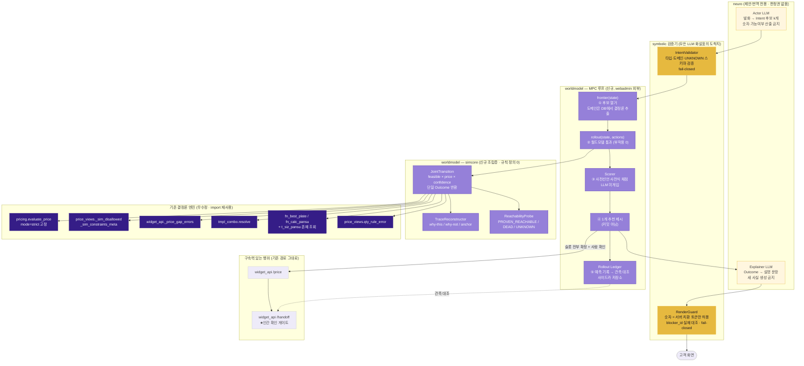

# 설계안 C — 시뮬레이터 루프 (Simulator Loop)

> 트랙 `huni-worldmodel/04_design` · 관점 C(시뮬레이터 중심) 단일 관점 극대화안
> [HARD] 이 문서는 **관점 C만** 최대화한다. A·B안과의 절충을 시도하지 않는다 — 3안 비교는 별도 심사가 한다.
> [HARD] 규율: 모든 주장에 `파일경로:라인` 또는 선행 산출물 인용. 추정은 `[추정]` 배지. `raw/webadmin`·라이브 DB는 읽기 전용(본 설계의 어떤 단계도 두 곳을 수정하지 않는다).
> 사전등록 루브릭(`04_design/evaluation-rubric.md` v1.0) 18규칙에 대한 대응표는 §9.

## 0. 고정 선언 (RULE-15(d))

| 항목 | 본 문서가 사용하는 단일 값 | 근거 |
|---|---|---|
| 권위 엑셀 | **인쇄상품 가격표 260705 · 상품마스터 260703** (그 외 260702/260610/260527 = stale) | `_workspace/_foundation/PRICE-SHEET-SOT-260705.md:4,52`(원장 인용 `problem-ledger.md:311`) |
| 상품 분모 | **288** (라이브 실측) | `02_diagnosis/D8-live-schema.md:79`(원장 인용 `problem-ledger.md:318`) |
| 가격 값 권위 | **`pricing.evaluate_price` 단일** (D-18) | `raw/webadmin/webadmin/catalog/pricing.py:428-429`; 기각목록 N-08·N-16 `problem-ledger.md:451,459` |
| 범위 밖(다른 트랙 소유) | P-08 가격 사슬 배선(미바인딩 117·고아 79·단가행 0인 32) = §7 dbmap / §18 설계 트랙 | `problem-ledger.md:432`(하네스 경계), `D7-prior-harness.md:35` |

---

## 1. 논지 한 문장

**이미 라이브에서 돌고 있는 결정론 엔진 4종(`evaluate_price`·`_sim_disallowed`·`fn_best_plate`/`fn_calc_pansu`·가용성 오라클)을 "하나의 부작용 없는 전이함수"로 묶은 얇은 롤아웃 계층(`simcore`)을 webadmin **바깥에 얹고**, 고객이 옵션을 하나 고를 때마다 후보들을 실행 없이 전부 굴려본 뒤 결과를 비교해 제시하는 MPC 루프를 돌린다 — 새 월드모델을 만드는 것이 아니라 있는 엔진을 에이전트의 월드모델로 승격시킨다.**

근거: 원장이 이미 같은 결론을 냈다 — *"빠진 것은 모델이 아니라 루프"*(`R2-world-model-theory.md:246`, 원장 `problem-ledger.md:65`), 그리고 *"적재 트랙에는 커밋 전 시뮬레이션이 이미 있고 고객 견적 트랙에만 없다"*(`R2:302`, 원장 동일 줄). 본 설계는 그 루프를 고객 견적 트랙에 이식하는 것 **하나만** 한다.

---

## 2. 아키텍처 계층도



**읽는 법 3줄**

1. LLM 노드(ACT·EXP)의 출력 화살표는 **예외 없이** 결정론 검증기(IV·RG)로 들어간다. 고객·주문 시스템에 직접 닿는 LLM 화살표가 0개다 (RULE-01 위반판정 절차 그대로 전수 추적 가능).
2. 파란 박스(ENG)는 **한 줄도 수정하지 않는다.** `simcore`는 이들을 import해 호출하는 조립층일 뿐이며, 가격·제약·기하 규칙을 **새로 정의하지 않는다** (RULE-04·RULE-12).
3. 확정 금액이 고객에게 나가는 경로는 여전히 `widget_api /price` → `/handoff` 하나다. 루프는 그 앞단의 **조언 세션**이며, 스스로 확정하지 않는다.

---

## 3. 새로 도입하는 것 — 책임과 데이터 모델 초안

### 3.0 층 귀속표 (RULE-18)

| # | 구성물 | 층 | 책임 한 줄 | 위치 |
|---|---|---|---|---|
| C1 | `simcore.JointTransition` | worldmodel | 상태+행동 → 단일 Outcome(가능성·가격·신뢰도 결합) | `_workspace/huni-simcore/` (드롭인 패키지) |
| C2 | `simcore.TraceReconstructor` | symbolic | matched_row·탈락행 diff에서 why-this/why-not/앵커 재구성 | 동일 |
| C3 | `simcore.ReachabilityProbe` | worldmodel | 남은 완주 경로 존재 여부 3값 판정 | 동일 |
| C4 | `loop.frontier()` | worldmodel | 다음 슬롯의 후보 집합을 DB 도메인에서 결정론 열거 | 동일 |
| C5 | `loop.rollout()` | worldmodel | 후보 배치를 부작용 0으로 굴림(읽기전용 트랜잭션+무조건 롤백) | 동일 |
| C6 | `loop.Scorer` | symbolic | 사전선언 사전식 비용함수. LLM 미개입 | 동일 |
| C7 | `Intent` 스키마 | symbolic | 뉴로→심볼릭 타입 인터페이스(UNKNOWN 명시) | 동일 (정의 1곳) |
| C8 | `Outcome` 스키마 | symbolic | 심볼릭→뉴로/화면 타입 인터페이스 | 동일 (정의 1곳) |
| C9 | `IntentValidator` | symbolic | Intent 스키마·도메인 검증 게이트(fail-closed) | 동일 |
| C10 | `RenderGuard` | symbolic | LLM 산문의 숫자·주장 결정론 검증(fail-closed) | 동일 |
| C11 | `Rollout Ledger` | worldmodel·ops | 예측 기록 + 관측 대조 그릇 | 사이드카 저장소(라이브 밖) |
| C12 | `provenance-map` | knowledge | `comp_price_id` → `xlsx:파일#시트!셀` 앵커 | 사이드카(§26 권위 격자 산출물 소비) |
| C13 | `Actor LLM` | neuro | 발화 → Intent 후보 k개 + 선호 가중치 | 사이드카 에이전트 |
| C14 | `Explainer LLM` | neuro | Outcome → 설명·복원 안내 산문 | 동일 |
| C15 | `golden-rollout` 하네스 | ops | 종료 척도 G1~G7 자동 측정 | `_workspace/huni-simcore/gates/` |

미표기 구성물 0건. C1~C15 외에 본 설계가 도입하는 것은 없다.

### 3.1 C7 `Intent` — 뉴로→심볼릭 인계 스키마 (RULE-02)

```python
UNKNOWN = "<unknown>"          # 유일한 미확정 표현. None/""/생략은 스키마 위반(=검증 실패)

Intent = {
  "prd_cd":      str | UNKNOWN,          # 도메인: t_prd_products.prd_cd where del_yn='N'
  "qty":         int | UNKNOWN,          # 도메인: t_prd_products / t_prd_product_sizes 의 min/max/incr
  "selections":  { dim: (str|int|UNKNOWN) },
                                          # dim 키 도메인 = pricing.NON_QTY_DIMS ∪ pricing.TIER_DIMS
                                          #   (pricing.py:45-46, :52 — 새 목록을 만들지 않고 import)
                                          # 값 도메인 = price_views._sim_dim_candidates(prd_cd, dim)
  "opt_sels":    [opt_cd] | UNKNOWN,     # 도메인: t_prd_product_options (상품 소속만)
  "proc_sels":   [ {"proc_cd": str, "detail": {k: v}} ] | UNKNOWN,
                                          # 도메인: widget_api._allowed_procs / _coerce_detail 화이트리스트
  "soft_prefs":  [ {"axis": str, "dir": "up"|"down", "w": float} ],
                                          # "고급스럽게" 같은 서술이 착지하는 유일한 곳. 값이 아니라 선호.
  "budget_krw":  int | None,             # 채점에만 쓰는 상한. 어떤 경로로도 가격 값이 되지 않는다.
  "provenance":  {"utterance_id": str, "turn": int}
}
```

- **필드 도메인 출처**: 위 주석의 각 `t_*` 축 (요건 ①).
- **미확정 표현**: `UNKNOWN` 센티널 단일 (요건 ②). 누락·`None`·빈문자열은 전부 검증 실패로 처리한다 — "조용한 기본값"을 스키마 층에서 원천 봉쇄한다(P-05·P-06과 같은 실패 형태의 재발 방지).
- **검증 지점**: `IntentValidator.validate(intent) -> Intent | Reject` (요건 ③). 위치는 루프 진입 직전 단 한 곳이며, 실패 시 **fail-closed**(진행 금지, 되묻기 경로로 라우팅). `assistant_tools`의 화이트리스트 디스패처(`raw/webadmin/webadmin/catalog/assistant_tools.py:1100-1116`)와 동일한 "미등록이면 실행하지 않는다" 정책을 그대로 따른다.
- **Action**: 슬롯 하나의 배정 `(slot, value)` 단위. `Candidate = Intent + Action`.

### 3.2 C8 `Outcome` — simcore 반환 스키마

```python
Outcome = {
  "state_hash":   str,        # (prd_cd, selections, qty, opt_sels, proc_sels) 정규화 해시
  "as_of":        "yyyy-MM-dd",
  "engine_mode":  "strict",   # 고정. lenient 금지 (P-06 흡수 차단)
  "data_version": str,        # 판정 직전 라이브 재-SELECT로 얻은 소스 버전 스탬프

  "feasible":     "PROVEN_OK" | "PROVEN_BLOCKED" | "UNKNOWN",
  "blockers": [ {
      "source": "RULE" | "PRICE_GAP" | "TMPL_COMBO" | "QTY_RULE" | "PLATE",
      "id":     rule_cd | comp_cd | axis_name,          # 규칙 신원 보존
      "kind":   "FORBIDDEN" | "UNREGISTERED",           # 금지 vs 데이터 공백 구별 (RULE-10)
      "msg":    str,
      "repairs": [ {"unset": [slot], "or_set": [(slot, value)]} ]
  } ],

  "price": { "amount": int|None,
             "confidence": "CONFIRMED" | "PROVISIONAL" | "NONE",
             "reason": str },                            # RULE-09

  "components": [ {
      "comp_cd": str, "subtotal": int, "included": bool,
      "matched_row_id": int|None,
      "tier": {"field": "min_qty"|"siz_width"|"siz_height", "threshold": num, "order_value": num},
      "rejected": [ {"row_id": int, "first_diff_dim": str, "row_value": str, "order_value": str} ],
      "anchor": "xlsx:<파일>#<시트>!<셀>" | "t_<table>/<CODE>" | None
  } ],

  "reachability": {"verdict": "PROVEN_REACHABLE"|"PROVEN_DEAD"|"UNKNOWN",
                   "witness": Intent|None, "dead_dim": str|None, "probe_budget_used": int},

  "rollout_ms": int, "cache_hit": bool
}
```

핵심 성질 3가지.

1. **가능성과 가격이 하나의 Outcome에서만 나온다.** `feasible != "PROVEN_OK"`이면 `price.amount`는 **스키마상 반드시 `None`** 이다(직렬화 시 강제). 즉 "제약 위반 조합의 가격"이 존재할 수 있는 자료구조 자체가 없다 (RULE-06). 이는 R7이 정리한 *"출력 스키마에서 능력을 제거한다"*(`R7-agentic-commerce.md:93`)의 직접 적용이다.
2. **`kind`가 금지(FORBIDDEN)와 미등록(UNREGISTERED)을 분리한다.** 현행은 `tmpl_combo_gap`에서 이 둘이 구별 불가하고 탈출구가 "관리자에게 문의"뿐이다(`widget_api.py:1906-1907`, `D6:259` — 원장 `problem-ledger.md:290-291`).
3. **`confidence`는 값이 아니라 플래그다.** 판걸이수가 권위 룩업(`t_siz_pansu`)에서 나왔으면 CONFIRMED, 기하 폴백이면 PROVISIONAL — R2의 처방(`R2:304`) 그대로. 판정 방법은 §3.3-(e).

### 3.3 C1 `JointTransition` — 무엇을 어떻게 합치는가

`step(state, action) -> Outcome` 한 함수. 내부는 **호출 조립만** 하고 도메인 규칙을 새로 쓰지 않는다.

| 순서 | 호출 대상 (전부 기존 코드) | 얻는 것 | 근거 |
|---|---|---|---|
| (a) | `price_views.qty_rule_error` | 수량 규칙 위반 | `price_views.py:1567-1592`(D2 §E) |
| (b) | `price_views._sim_disallowed(prd_cd, sel)` | 차원별 불가값 → 규칙명. **후보값을 실제 대입하는 forward simulation** | `price_views.py:2701-2734` (실측 확인) |
| (c) | `tmpl_combo.resolve` + `missing_axis_names` | 조합템플릿 미등록(UNREGISTERED) | `widget_api.py:1894-1904` |
| (d) | `pricing.evaluate_price(..., mode="strict", as_of=pinned)` | 금액 + `components[].matched_row` + 오류코드 | `pricing.py:428-429`, 출력 스키마 `pricing.py:561-582` (실측 확인) |
| (e) | `widget_api._price_gap_errors(res, prd_cd)` | 단가행 부재(PRICE_GAP). 가족형 면제 규칙까지 **그 정의 그대로** 재사용 | `widget_api.py:455-477` (실측 확인 — 면제 규칙이 이 함수 안에 있으므로 재구현하면 즉시 드리프트) |
| (f) | `SELECT ... FROM t_siz_pansu WHERE ...` 존재 조회 | 판걸이수 권위 룩업 히트 여부 → `confidence` | 룩업 우선·기하 폴백 구조 `sql/32_fn_calc_pansu.sql`(백업 스냅샷 `sql/_backup_fn_calc_pansu_t_siz_pansu_20260701.json:3`, D2 §C) |

**(e)·(f)가 이 설계의 핵심 두 수다.**

- (e): `price_gap`은 지금 "제약 그래프에 아예 들어 있지 않은 하드 제약"이다(`D3-widget-cascade.md:190`). 본 설계는 이것을 **JSONLogic 행으로 새로 작성하지 않는다** — 작성하는 순간 단가행 실물과 규칙 행이 갈려 드리프트가 시작되고, 그것은 RULE-12 위반이다. 대신 **런타임 가능성 오라클의 한 소스로 승격**한다. `feasible`을 계산하는 함수가 곧 제약 모델이며, 그 안에 세 소스(JSONLogic 규칙 / 단가행 존재 / 조합템플릿 등록)가 union으로 들어온다.
- (f): 저청구가 조용한 손실로 남는 지점(프리미엄엽서 권위 15/12/8 vs 엔진 18/12/9, `_foundation/product-scoreboard.csv:2`)을 **가시적 플래그**로 바꾼다. 계산 자체는 손대지 않는다 — 룩업 행이 있었는지만 별도 조회한다.

**부작용 0의 기계적 보장**: 모든 롤아웃은 `assistant_tools.run_sql`이 이미 쓰는 방어선을 그대로 복제한다 — `transaction.atomic()` + `SET TRANSACTION READ ONLY` + `SET LOCAL statement_timeout` + **무조건 롤백 예외**(`assistant_tools.py:689-701`). 새 안전 논증을 만들지 않고 라이브에서 검증된 논증을 재사용한다.

### 3.4 C2 `TraceReconstructor` — 설명을 "재구현 없이" 복원한다 (RULE-10·RULE-11)

문제: 엔진은 `matched_row`는 주지만 티어 선택 근거와 탈락 후보를 버린다(`pricing.py:162-183` vs `:193`, `D2:249-250`). 그렇다고 매칭 알고리즘을 밖에서 다시 구현하면 규칙이 2벌이 된다(RULE-12 위반).

해법 — **다시 계산하지 않고 diff만 한다.**

1. `matched_row`에 이미 티어 필드(`min_qty`/`siz_width`/`siz_height`)와 9개 비수량 차원값이 들어 있다(`pricing.py:669-671`, D2 §a). → `tier = {field, threshold=matched_row[field], order_value=주문값}`. 재구현 0.
2. 같은 `comp_cd`의 후보 행들을 읽기전용으로 조회해 `matched_row`와 **첫 번째로 다른 차원**을 표기한다 → `rejected[]`. 이것은 "어느 행이 왜 안 골렸는가"의 사실적 답이며, 선택 알고리즘의 재현이 아니다.
3. `anchor` — `provenance-map`(C12)에서 `(comp_cd, 차원튜플, apply_ymd) → xlsx:파일#시트!셀`을 조회. 원천은 §26 가격테이블 무결성 트랙이 이미 만든 권위 격자 추출물이다(우리는 소비만 하고 적재하지 않는다). 매핑이 없으면 `anchor=None`을 **명시**한다 — 없는 것을 없다고 말하는 것이 RULE-09의 정신이다.

`repairs[]`는 (b)의 산출물을 뒤집어 만든다: 위반 규칙 `r`이 참조하는 각 변수 `v`에 대해, `v`의 도메인 값을 대입해 롤아웃했을 때 `r`이 만족되는 값 집합이 곧 복원 후보다. `_sim_disallowed`가 이미 "각 후보값 대입"을 하고 있으므로 추가 알고리즘이 없다.

### 3.5 C3 `ReachabilityProbe` — 막다른 길을 미리 본다, 전수 열거 없이 (RULE-08)

3값 판정. 완전성을 주장하지 않는 것이 핵심이다.

```
reachable(state, budget) ->
  PROVEN_DEAD(dim)        : 남은 어떤 슬롯 dim의 도메인 전 값이 blocked  (반례 불필요, 즉시 확정)
  PROVEN_REACHABLE(w)     : 완주 배정 w 하나를 실제로 굴려 feasible=PROVEN_OK + price≠None 확인
  UNKNOWN(budget_used)    : 예산 소진. → 사람에게 라우팅 (자동 확정 금지)
```

- 탐색은 **greedy + 결정론 재시작**: 남은 슬롯을 도메인 크기 오름차순으로 잡고, 각 슬롯에서 Scorer 상위 값부터 시도한다. 예산은 롤아웃 호출 수 상한(파일럿 기본 64회)으로 준다.
- **전수 열거·사전계산 적재를 하지 않는다**(N-19 준수). 롤아웃 결과는 `(prd_cd, state_hash, as_of, data_version)` 키의 **수요 기반 메모 캐시**로만 남으며, (i) 요청된 상태만 채워지고 (ii) `data_version` 변경 시 전량 무효화되며 (iii) **구속력 있는 값은 절대 캐시에서 서빙하지 않는다** — 확정 직전에는 항상 라이브 재-SELECT로 다시 굴린다(RULE-13 ③, 기각목록 N-13 `problem-ledger.md:456`).
- **파일럿 실측 항목**(RULE-08 ②): 스텝당 후보 수, 롤아웃 1건 지연 p50/p95, 스텝당 배치 지연 p95, 캐시 적중률, `feasible=PROVEN_OK` 후보 비율, `UNKNOWN` 판정 비율, 프론티어 스윕 1회의 DB 쿼리 수. 임계는 §7 G7.

### 3.6 C6 `Scorer` — 사전선언 사전식(lexicographic) 비용함수

LLM이 개입하지 않는다. 순서 자체가 설계 산출물이다.

```
key(outcome) = (
  0 if feasible == PROVEN_OK else 1,            # ① 가능한 것이 먼저
  0 if confidence == CONFIRMED else 1,          # ② 권위 룩업 기반이 먼저
  0 if reachability == PROVEN_REACHABLE else (1 if UNKNOWN else 2),
  budget_penalty(price, intent.budget_krw),     # ③ 예산 초과분(원). 예산 없으면 0
  -pref_score(outcome, intent.soft_prefs),      # ④ LLM 선호는 여기 가중치로만 들어온다
  price.amount,                                 # ⑤ 동률이면 저가
  candidate_key                                 # ⑥ 최종 안정 tie-break (결정론 보장)
)
```

⑥은 `pricing.py:272-281`이 동일 `apply_ymd` 2건에서 쓴 **행 내용 기반 안정 tie-break**와 같은 사상이다(N-21 — 이미 잘 되고 있는 것을 모방한다).

`soft_prefs`가 ④에만 들어간다는 점이 RULE-01의 실질적 방어선이다: LLM은 **순서에만** 영향을 주고, ①~③을 뒤집을 수 없다.

### 3.7 C11 `Rollout Ledger` — 상태 그릇과 교정 절차 (RULE-07)

**위치**: 라이브 Railway DB **밖**의 사이드카 저장소(`_workspace/huni-simcore/state/` 하위 SQLite 또는 별도 DB의 `sim` 스키마). 이유는 둘이다 — (i) 라이브는 읽기전용 원칙(MEMORY [HARD])이고, (ii) 주문 실체 테이블 신설은 다른 트랙(위젯·주문)의 소유이므로 흡수하지 않는다(RULE-15 ③). **본 설계는 라이브에 단 한 행도 쓰지 않는다.**

```sql
-- 예측 기록
sim_rollout(id, ts, session_id, state_hash, action_json, outcome_json,
            engine_rev, data_version, cache_hit, rollout_ms)
-- 사람에게 제시된 것 / 고객이 고른 것
sim_decision(id, ts, session_id, presented_state_hashes[], chosen_state_hash,
             asked_slot, ask_reason)
-- 관측 (예측과 대조할 실제)
sim_observation(id, ts, state_hash, obs_source, obs_price, obs_feasible, delta_krw, note)
```

**예측-관측 대조 절차** (RULE-07 (b)) — 관측 채널 3개, 강도 순:

| 채널 | 관측원 | 무엇을 대조하나 | 한계(정직하게) |
|---|---|---|---|
| O1 | 권위 엑셀 격자(가격표 260705)의 해당 셀 | `price.amount` vs 권위값 (허용오차 0) | 격자 미적재 셀은 대조 불가 → `UNKNOWN`으로 기록 |
| O2 | `widget_api /handoff` 실제 응답(성공/422 코드) | `feasible`·`blockers[].source` 예측 적중 여부 | `t_wgt_handoff_logs` 현재 **0행**(`D8-live-schema.md:66-68`), 요약 절단(`widget_api.py:61-64`) → 초기에는 파일럿 리플레이로 대체 |
| O3 | 실무진 확인(고불확실 큐 처리 결과) | `confidence=PROVISIONAL` 건의 실제 판걸이수 | 사람 처리량에 비례. 저빈도 |

**이 설계의 정직한 약점을 여기 먼저 적는다**: 주문·견적 실체 테이블이 없다는 P-01은 본 설계가 **해결하지 않는다**(그 그릇은 라이브 소유이고 우리 범위 밖이다). 우리는 라이브 밖 원장에 **예측만** 완전히 남기고, 관측은 O1(권위 엑셀)에 주로 의존한다. 즉 "예측↔관측" 루프의 관측 쪽은 O1이 지탱하고 O2·O3는 보조다. RULE-05의 종료 척도가 O1 기반으로 설계된 것도 그 때문이다(§7).

---

## 4. 기존 자산과의 접합면

### 4.1 `pricing.py` (무수정)

| 접합 | 방식 | 근거 |
|---|---|---|
| 호출 | `evaluate_price(target, selections, qty, grade_cd, mode="strict", as_of=<핀 고정>, only_comps=None, proc_sels=..., skip_plate=False)` | 시그니처 실측 `pricing.py:428-429` |
| **`mode="strict"` 고정** | 우리 층의 모든 호출에서 강제. lenient 0원 흡수(P-06)를 **엔진 수정 없이 호출 규약으로** 차단 | 2모드 인식론이 이미 설계돼 있음 `pricing.py:30-31`, 치명오류 6종 `:62-71`(N-24) |
| `as_of` 핀 | 세션 시작 시각의 날짜로 고정 → 세션 중 시계열이 바뀌어도 후보 간 비교가 무너지지 않음 | `pricing.py:444`, D2 §(4) |
| `only_comps` | 구성요소 부분집합 what-if(예: "코팅만 빼면?") | `pricing.py:438-439` — 이미 있는 반사실 인자를 **처음으로 실제 사용** |
| 판형 | `skip_plate=False` 유지, 판형은 `_select_default_plate` 자동 도출 그대로 | `widget_api.py:424-432`, `price_views.py:2258-2284` |
| 세트 | 1차 범위에서 **제외**. `evaluate_set_price`는 구성원 수량 산출이 뷰 레이어에 있어(`pricing.py:860-862`, D2 F9) 조립층에서 재구현하면 RULE-12 위반이 된다 → 세트는 2차 슬라이스로 미룬다(명시적 미충족 아님, 범위 선언) | D2 F9 |

### 4.2 `price_views.py` / `widget_api.py` / `tmpl_combo.py` (무수정 · import 재사용)

| 재사용 심볼 | 우리가 얻는 것 | 왜 재구현하지 않는가 |
|---|---|---|
| `_sim_disallowed`, `_sim_active_rules`, `_sim_selection_to_constraint_data`, `_sim_dim_candidates` | 제약 forward simulation + 차원 도메인 | 관리자 시뮬레이터 전용으로 **이미 완성돼 있고 위젯에서 호출만 0건**(`D3:118`). 만들 게 아니라 배선할 것 |
| `_select_default_plate`, `qty_rule_error` | 판형 자동도출·수량규칙 | 5상태 분기(`price_views.py:2223-2284`)를 다시 쓰면 6번째 병렬 정의가 된다 |
| `widget_api._price_gap_errors` | 단가행 부재 + **가족형 쌍 면제 규칙** | 면제 규칙(260805 오리지널박명함 사례)이 이 함수 본문에 있다(실측). 재구현 = 즉시 드리프트 |
| `tmpl_combo.resolve` / `missing_axis_names` | 조합템플릿 미등록 + 미선택 축 이름 | 동일 |
| `pricing.NON_QTY_DIMS` / `TIER_DIMS`, `price_views.DIM_META`, `_SIM_DIM_CONSTRAINT` | 차원 어휘 | **차원 정의를 6벌째로 늘리지 않는다** (RULE-12 ③) — 우리는 import만 한다 |

접합 리스크 1건을 명시한다: 위 심볼 중 다수가 밑줄 접두(private)다. import 재사용은 **webadmin 코드의 내부 이름에 의존**한다는 뜻이며, webadmin이 이름을 바꾸면 우리 층이 깨진다. 대응 — `simcore/_bindings.py` 한 파일에 모든 import를 모으고, 게이트 G0(스모크)이 매 실행 전 심볼 실재를 확인해 **fail-closed**로 멈춘다. 조용한 degrade를 만들지 않는다(RULE-13 ①).

### 4.3 `assistant_tools` 10종 (무수정)

**webadmin 관리자 비서에는 손대지 않는다.** `TOOL_SPECS` 순서 동결(`assistant_tools.py:872-874`, D4 §(f)-3)과 `SYSTEM_BLOCKS` 전역 고정(`assistant.py:226`)이 계약이며, 그 계약을 깨는 것은 raw/webadmin 수정이다(RULE-04 (c)).

대신 **사이드카 에이전트**가 자기 도구 4종을 갖는다. 기존 10종과의 관계는 다음과 같다.

| 사이드카 도구 | 기존 10종과의 관계 |
|---|---|
| `frontier(state)` | **신규** — 기존에 없던 "다음 후보 열거". `search_masters`/`get_product_config`의 조회를 조합 |
| `rollout(state, actions[])` | 기존 `simulate_price`의 **확장 대체**. `simulate_price`가 노출하지 않는 `mode`·`as_of`·`only_comps`·`proc_sels`를 전부 노출(`assistant_tools.py:281-282` 실측 — lenient 고정·4인자만) |
| `reachable(state)` | **신규** |
| `explain(outcome)` | 기존 `_verify_*` 사후검수와 별개. Outcome의 `why[]`/`repairs[]`를 산문화하며, RenderGuard가 뒤를 막는다 |

향후 실무진이 이 도구를 webadmin 비서 안에서도 쓰고 싶다면 그것은 `TOOL_SPECS` **뒤에 append**하는 webadmin 트랙 작업이며, 본 설계 범위 밖이다.

### 4.4 위젯 (`widget_api`) — 확정 경로는 그대로

루프는 위젯을 **대체하지 않는다.** 루프의 산출물은 "전 슬롯이 확정된 selections 집합"이며, 그것을 위젯에 넘기면 위젯이 자기 `/price`로 다시 계산해 표시하고 `/handoff`로 확정한다.

- 이로써 고객에게 보이는 확정 금액의 산출 경로는 변하지 않는다 (RULE-04 (a)).
- 그리고 확정 직전 재계산이 강제되므로 캐시·스냅샷 신뢰 문제가 구조적으로 없다 (RULE-13 ③).
- 루프 예측과 위젯 실제 응답이 **갈리면 그 자체가 신호**다 → `sim_observation`에 O2로 기록되고, G6 게이트가 이를 0으로 요구한다.

클라이언트 캐스케이드 이중 구현(P-21)은 본 설계가 **건드리지 않는다** — 위젯 렌더러는 위젯 트랙 소유다. 우리 층은 세 번째 구현이 되지 않기 위해 **규칙을 한 줄도 쓰지 않고 서버 심볼만 호출한다**. 이 점은 §8의 약점 절에서 다시 다룬다.

---

## 5. 종단 시나리오 워크스루

입력: **"명함 500장, 고급스럽게, 예산 5만원"**

> 아래 값은 흐름 설명을 위한 형태 예시다. 실제 코드값·금액은 파일럿 실측으로 채워진다 — 여기서 특정 `prd_cd`나 금액을 단정하지 않는다.

**T0 · Actor (neuro)** — 발화를 Intent 후보 k=3개로 번역. 숫자를 만들지 않는다.
```
Intent#1 { prd_cd: UNKNOWN(후보 3), qty: 500, selections:{ siz_cd: UNKNOWN, mat_cd: UNKNOWN, print_opt_cd: UNKNOWN },
           proc_sels: UNKNOWN, soft_prefs:[{axis:"mat_grade", dir:"up", w:0.8}], budget_krw: 50000 }
```
"고급스럽게"는 값이 아니라 `soft_prefs`로 착지한다. "5만원"은 `budget_krw`로 들어가되 **Scorer의 ③ 페널티에만** 쓰인다.

**T1 · IntentValidator (symbolic)** — `qty=500`이 int인지, `prd_cd` 후보가 `t_prd_products(del_yn='N')`에 실재하는지 검증. 실패 시 진행 금지.

**T2 · frontier + rollout (worldmodel)** — 상품 후보 3개를 굴린다. 각각 부작용 0.
```
rollout([Intent#1(prd=A), Intent#1(prd=B), Intent#1(prd=C)])
→ Outcome A: feasible=UNKNOWN(슬롯 미확정), reachability=PROVEN_REACHABLE(witness), price=None
→ Outcome B: reachability=PROVEN_DEAD(mat_cd)  ← 500장 도메인에 유효 자재 0
→ Outcome C: PROVEN_REACHABLE
```
B는 **여기서 사라진다.** 현행 구조라면 고객이 B를 끝까지 고른 뒤 주문 단계 422를 맞는다(`widget_api.py:1894-1909`).

**T3 · Scorer → 되묻기 (RULE-14 ①)** — A·C가 남고 `soft_prefs`만으로는 갈리지 않는다. 미확정 슬롯이 남았으므로 **기본값을 채워 확정하지 않는다.** Explainer가 질문을 만들고 RenderGuard를 통과해 고객에게 나간다: *"용지 느낌을 먼저 정할까요 — 매트/펄/엠보 중에서요."*

**T4 · 6번째 후보 3개를 띄우는 순간 (RULE-03 시나리오 그대로)** — 고객이 5개 슬롯을 채웠고 마지막 후가공만 남았다. `frontier()`가 도메인에서 후보 3개를 결정론 열거하고, `rollout()`이 3개를 **선택 전에** 굴린다.
```
후보 1 (무광코팅) : feasible=PROVEN_OK, price=44,300, confidence=CONFIRMED,  reach=PROVEN_REACHABLE
후보 2 (박)       : feasible=PROVEN_BLOCKED,
                    blockers=[{source:"RULE", id:"R_EXCL_...", kind:"FORBIDDEN",
                               repairs:[{unset:["mat_cd"]},{or_set:[("mat_cd","MAT_xxx")]}]}]
                    price=None                                  ← 스키마상 금액이 존재할 수 없음
후보 3 (에폭시)   : feasible=PROVEN_BLOCKED,
                    blockers=[{source:"TMPL_COMBO", id:"조합템플릿", kind:"UNREGISTERED", ...}]
                    price=None
```
- 후보 2·3은 **가격이 계산되지도, 표시되지도 않는다** (RULE-06).
- 후보 2와 3의 `kind`가 다르다 — 하나는 금지, 하나는 데이터 미등록. 후자는 실무진 큐로 라우팅된다 (RULE-10·RULE-14 ③).
- DB write 0건. 주문 상태 변경 0건 (RULE-03 (b)).

**T5 · 1개만 제시** — Scorer 사전식 정렬로 후보 1이 최상위. Explainer가 산문화한다: *"무광코팅이면 44,300원이고 예산 안입니다. 박은 지금 고르신 용지와 같이 쓸 수 없어요 — 용지를 바꾸면 가능합니다."* RenderGuard가 (i) `44,300`이 Outcome에서 서버 치환된 토큰인지, (ii) 언급된 blocker가 실재하는지 검증한 뒤에야 화면에 도달한다.

**T6 · 확정 (RULE-14 ②)** — 고객이 후보 1을 고르면 루프는 selections 집합을 위젯에 넘긴다. 위젯이 `/price`로 **라이브 재계산**하고, 사람이 확인 버튼을 누른 뒤에야 `/handoff`가 서명한다. 루프는 어떤 경우에도 스스로 주문을 확정하지 않는다.

**T7 · 관측 (RULE-07)** — `sim_rollout`에 T2·T4 예측 전량이 남고, `/handoff` 응답(성공/422/코드)이 `sim_observation`에 O2로 남는다. **예측이 PROVEN_OK였는데 422가 나면 G6 위반 1건**으로 집계된다.

---

## 6. 가장 먼저 만들어 검증할 최소 조각 (first slice)

**슬라이스 S1 = "1상품 × 프론티어 스윕 × 부작용 0"**

만드는 것은 4개뿐이다: `simcore/_bindings.py`(import 모음) · `JointTransition` · `frontier`/`rollout`(읽기전용 트랜잭션) · `golden-rollout` 게이트 스크립트. Actor LLM·Explainer·Ledger·ReachabilityProbe는 **S1에 넣지 않는다** — 월드모델이 정확한지 먼저 재는 것이 순서다.

**파일럿 상품 선정 기준**(코드값을 단정하지 않고 기준만 선언 — 실행 시 라이브 SELECT로 확정):
1. `t_prd_product_price_formulas` 바인딩 있음 (전이함수 정의역 안)
2. `t_prd_product_constraints` 활성 규칙 ≥ 1 (제약×가격 결합을 실제로 시험 가능 — 라이브 커버리지 34/288 `D8:130`)
3. `t_prd_product_plate_sizes` 연결 ≥ 2 (판형 자동도출 분기가 살아 있음)
4. `t_siz_pansu` 룩업 히트와 미스가 **둘 다** 존재 (CONFIRMED/PROVISIONAL 구별을 실측 가능)
5. 권위 가격표 260705에 대조 가능한 격자 셀 ≥ 20 (G4의 분모)

조건 1~5를 만족하는 상품이 0건이면 그 사실 자체가 S1의 첫 산출물이며, 4를 완화(3까지)해 재선정한다.

### 성공 판정 기준 (기계 검증 가능 · RULE-05)

| ID | 측정 대상 | 측정 도구 | 통과 임계 (허용오차) | 분모 |
|---|---|---|---|---|
| **G0** | 바인딩 심볼 실재 | `pytest gates/test_bindings.py` — `_bindings.py`의 전 심볼 `getattr` | 실재 100%, 미실재 1건이면 즉시 중단(fail-closed) | 바인딩 심볼 수 (현재 설계 기준 11개) |
| **G1** | 롤아웃 부작용 | 스윕 전후 `pg_dump --data-only` 해시 비교 + 쓰기 시도 시 예외 단위테스트 | 라이브 데이터 해시 **완전 일치**, 변경 행 **0** | 라이브 t_* 46테이블 |
| **G2** | 제약×가격 결합 | 프론티어 전수 스윕 후 `jq 'select(.feasible!="PROVEN_OK" and .price.amount!=null)'` | 해당 건수 **0** | 파일럿 상품의 스윕 Outcome 총수 |
| **G3** | 재현 결정론 (pass^k) | 골든 의도 20건 × k=8 재실행, **최종 상태**(선택 옵션 집합 + final_price) 완전일치 비교 | 8/8 일치 = **100%** (금액 허용오차 0, 집합 동등성 엄격) | 20 의도 |
| **G4** | 전이함수 정확도 | 권위 격자 셀 ↔ `rollout` 금액 대조 스크립트 | 불일치 **0건**, 대조 커버리지 ≥ 20셀 | 파일럿 상품의 권위 격자 셀 수 |
| **G5** | 신뢰도 플래그 정확성 | `t_siz_pansu` 존재 조회 결과 vs Outcome `confidence` | 불일치 **0건** | 파일럿 상품 (판형×사이즈) 쌍 수 |
| **G6** | 막다른 길 예측 | 스윕 조합을 `/validate`·`/handoff`(테스트 사이트키)로 리플레이해 예측 대조 | 예측 PROVEN_OK인데 422 = **0건**, 예측 BLOCKED인데 통과 = **0건** | 스윕 조합 수 |
| **G7** | 롤아웃 비용 | 스윕 계측 로그 (`rollout_ms` p50/p95, 쿼리 수) | 후보 1건 p95 ≤ **300ms**, 스텝 배치(≤40후보) p95 ≤ **2s**, `UNKNOWN` 판정률 ≤ **30%** | 스윕 롤아웃 호출 수 |

**임계의 성격**: G1~G6은 0-허용 게이트다. G7의 300ms/2s/30%는 **[추정] 임계**이며, 근거는 "고객 대화 응답 안에서 스텝당 1회 굴려야 한다"는 요구뿐이다. 첫 파일럿 실측 후 재설정 대상임을 명시한다(루브릭 §5-4가 자기 임계에 대해 한 것과 같은 취급).

**G4가 이 설계의 심장이다.** P-09("전이함수는 있으나 오차를 모른다" `D7:155`)를 해소하지 않은 채 시뮬레이터를 얹으면, 우리는 **틀린 월드모델을 빠르게 굴리는 기계**를 만드는 것이다. Ha&Schmidhuber의 model exploitation 교훈(`R2:58`)이 정확히 이 경고다.

---

## 7. 이 설계가 틀렸다면 어디서 먼저 드러나는가

순서대로, 가장 빨리 깨지는 것부터.

1. **G7(비용)에서 가장 먼저 깨진다.** `_component_rows_bulk`가 `comp_cd`의 전 행을 메모리로 끌어온 뒤 파이썬에서 필터한다(`pricing.py:291-293`, D2-12). 후보 40개 스윕은 이 비용을 40배 한다. p95가 2s를 넘으면 **고객 실시간 루프는 성립하지 않는다** → 설계는 "관리자·CS 도구"로 강등되어야 하며, §5의 종단 시나리오는 폐기된다. 이것이 첫 번째 반증 지점이다.
2. **G4(정확도)에서 두 번째로 깨진다.** 권위 격자와 불일치가 나오면 원인은 둘 중 하나 — 배선 미완(P-08, 다른 트랙 소유) 또는 엔진 오차. 전자면 우리 층의 가치는 그 트랙 진척에 종속되고, 후자면 우리가 굴리는 월드모델 자체가 틀린 것이다. 어느 쪽이든 **"루프만 얹으면 된다"는 논지가 부분 반증**된다.
3. **G6(막다른 길 예측)에서 세 번째.** 예측과 `/handoff` 실제가 갈리면, 그 원인은 십중팔구 우리가 재사용하지 못한 검증층이 있다는 뜻이다(`/handoff`의 방어선은 10층 이상 — `D3` F5 표). 갈림이 1건이라도 나오면 재사용 목록(§4.2)이 불완전하다는 증거다.
4. **`UNKNOWN` 판정률에서 네 번째.** `ReachabilityProbe`가 예산 안에 결론을 못 내는 비율이 30%를 넘으면, 루프는 막다른 길을 예방하지 못하고 "모르겠으니 사람에게"만 반복한다 — 현행 "관리자에게 문의"와 실질적으로 같아진다.

---

## 8. [HARD] 이 접근이 실패한다면 이유는

관점 C의 약점을 감추지 않고 적는다.

**(1) 우리는 관측 채널이 얇다 — 원장이 지목한 근본 B(P-01)를 우리가 못 고친다.**
예측-관측 루프의 관측 쪽은 주문 실체 테이블이 있어야 제대로 선다. 그 그릇은 라이브 소유이고 우리는 라이브에 쓰지 않는다. 결과적으로 우리 원장의 관측은 권위 엑셀(O1)에 편중되며, "고객이 실제로 무엇을 골랐고 그 주문이 어떻게 됐는가"는 `t_wgt_handoff_logs`(현재 0행, 요약 절단)로만 들어온다. **월드모델의 절반(교정)이 구조적으로 약하다.** 시뮬레이터 관점의 가장 큰 자기모순이다.

**(2) 캐시가 사전계산으로 미끄러질 유혹이 상시 있다.**
G7이 안 나오면 가장 쉬운 처방이 "많이 쓰는 조합을 미리 굴려 적재"다. 그 순간 기각목록 N-19(전수 열거·사전계산 적재)로 미끄러진다. 본 설계는 캐시를 수요 기반·`data_version` 무효화·비구속력으로 규정했지만, 이것은 **규율이지 기계적 봉쇄가 아니다.** 압력이 오면 무너질 수 있는 지점이다.

**(3) private 심볼 import 의존은 계약이 아니라 관행에 기댄다.**
`_sim_disallowed`·`_price_gap_errors`는 밑줄 접두다. webadmin 트랙이 리팩터하면 우리 층이 깨진다. G0이 조용한 실패를 막지만, 깨진 뒤 고치는 비용은 우리가 낸다. "무수정 재사용"의 대가다.

**(4) 세 번째 캐스케이드 구현이 되지 않으려 했지만, 우리는 네 번째 판정자가 된다.**
현재 캐스케이드는 클라이언트(렌더러)·서버(`_eval_violations`) 2벌이고(P-21), 관리자 시뮬레이터(`_sim_disallowed`)까지 3벌로 볼 수도 있다. 우리 루프는 규칙을 새로 쓰지 않으므로 규칙 정의는 늘지 않지만, **"고객에게 무엇을 보여줄지 판정하는 주체"는 하나 늘어난다.** 루프 화면과 위젯 화면이 갈릴 가능성이 남고, 그 봉합은 위젯 트랙과의 조율 없이는 불가능하다.

**(5) 시뮬레이터는 의미론 공백을 고치지 못한다.**
원장의 근본 A(P-15 온톨로지 의미론 비형식화)는 우리 관점이 손대지 않는 축이다. 엔진이 "이 구성요소는 자재비인데 자재 축이 없다"를 모르는 한(`D2:351`), 판별차원 0 상시과금(P-05)은 롤아웃해도 **일관되게 과금된 결과**가 나올 뿐이다 — 시뮬레이터는 틀린 값을 충실히 재현한다. 이 축은 다른 관점(지식계층 형식화)이 더 강하며, 관점 C는 그것을 대체하지 못한다.

**(6) LLM이 실제로 기여하는 몫이 작다.**
설계상 LLM은 `soft_prefs` 가중치와 설명 산문만 만든다. 그렇다면 "루프가 좋은가"의 대부분은 결정론 엔진과 채점 순서가 결정한다. **이 설계가 성공해도 그것은 "에이전트가 잘한다"의 증거가 아니라 "엔진이 이미 좋았다"의 증거**일 수 있다. 관점 C는 그 결론을 감수한다.

---

## 9. [필수] 루브릭 대응표

| RULE | 등급 | 충족 | 설계의 어느 부분이 · (미충족이면 이유·대안) |
|---|---|---|---|
| **RULE-01** 판정권 심볼릭 독점 | BLOCKER | **충족** | 계층도 §2에서 LLM 노드는 ACT·EXP 둘뿐이며 출력 화살표 도착지는 각각 `IntentValidator`·`RenderGuard`(둘 다 결정론 스키마/어휘 검증기)다. 금액은 §3.6 Scorer가 아니라 `evaluate_price` 산출값을 그대로 옮기며, LLM 선호는 Scorer ④ 가중치로만 들어가 ①~③(가능성·신뢰도·도달성)을 뒤집을 수 없다(§3.6). 가능/불가 판정은 §3.3 (a)~(e) 결정론 오라클 전용 |
| **RULE-02** 인터페이스 타입화 | BLOCKER | **충족** | §3.1 — ① 필드별 도메인 출처를 `t_*` 축으로 명시, ② 미확정은 `UNKNOWN` 센티널 단일(누락·None은 검증 실패), ③ 검증 지점은 `IntentValidator`(루프 진입 직전 1곳, fail-closed) |
| **RULE-03** 커밋 전 시뮬레이션 루프 | BLOCKER | **충족** | §2의 ①~⑤가 루프 정본 5단계이고, §5 T4가 루브릭의 "5개 고른 뒤 6번째 후보 3개" 시나리오를 그대로 추적한다. (a) 3후보 각각의 가능여부·가격·결손축을 **선택 전** 계산, (b) 부작용은 `SET TRANSACTION READ ONLY`+무조건 롤백으로 0(§3.3, G1이 기계 검증). "저장 후 검증" 구조를 도입하지 않으며, 확정은 §5 T6의 위젯+인간 게이트에서만 |
| **RULE-04** 가격 단일권위·기존코드 무수정 | BLOCKER | **충족** | 확정 금액 경로는 §4.4대로 위젯 `/price`→`/handoff` 그대로. 새 계층은 `_workspace/huni-simcore/` 드롭인 패키지이며 `raw/webadmin/**`·`pricing.py` 수정 단계가 0건(§4.1·§4.2는 전부 호출/import). 온톨로지·컴파일 레이어를 도입하지 않으므로 (b)도 해당 없음. 단조 하한 비용 태그를 쓰지 않는다 |
| **RULE-05** 반증 가능한 종료 척도 | BLOCKER | **충족** | §6 게이트표 — ① 측정 대상, ② 도구(pytest/pg_dump/jq/리플레이/계측), ③ 임계(허용오차 명시), ④ 분모를 G0~G7 전건에 기재. G4가 전이함수 정확도 측정이며, §7이 "어디서 먼저 깨지는가"를 순서로 선언 |
| **RULE-06** 제약×가격 결합 | MAJOR | **충족** | §3.2 Outcome 스키마에서 `feasible != PROVEN_OK`이면 `price.amount`가 **구조상 None**이다 → 위반 조합의 가격이 산출·표시될 자료구조가 없다. 차단 층은 `simcore.JointTransition`으로 특정. price_gap·tmpl_combo_gap은 §3.3 (c)(e)에서 **가능성 오라클의 1급 소스로 승격**되어 제약 모델 안으로 들어온다(JSONLogic 행으로 복제하지 않는 이유는 §3.3 — 복제가 곧 RULE-12 위반이므로). G2가 기계 검증 |
| **RULE-07** 상태 그릇·교정 루프 | MAJOR | **부분 충족** | (a) 그릇 위치 = §3.7 사이드카 `sim_rollout`/`sim_decision`/`sim_observation`(라이브 밖), (b) 대조 절차 = O1(권위 격자)·O2(handoff 응답)·O3(실무진). **약점 명시**: 주문 실체 테이블 부재(P-01)는 라이브 소유라 해결하지 않으므로 관측은 O1 편중이다(§8-(1)). 대안은 없다기보다 **범위 밖** — 주문 그릇 신설은 위젯/주문 트랙 소유이며 흡수 시 RULE-15 ③ 위반이 된다. 그래서 종료 척도(RULE-05)를 O1 기반으로 설계해 이 약점을 우회했다 |
| **RULE-08** 조합폭발 대응의 작동성 | MAJOR | **충족** | 전수 열거·사전계산 적재 단계가 없다(§3.5). 캐시는 수요 기반·`data_version` 무효화·비구속력으로 규정. 채택 기법은 "1스텝 프론티어 롤아웃 + 재계획(MPC) + 예산 제한 도달성 프로브"이며, 파일럿 실측 항목(스텝당 후보 수·롤아웃 지연 p50/p95·캐시 적중률·유효 후보 비율·UNKNOWN 비율·쿼리 수)과 임계를 §3.5·§6 G7에 명시 |
| **RULE-09** 불확실성 가시화 | MAJOR | **충족** | ① 권위 룩업 vs 기하 폴백 = `price.confidence` CONFIRMED/PROVISIONAL(§3.3-(f), G5가 검증). ② 실제 0원 vs 단가행 부재 0원 = `mode="strict"` 고정으로 후자가 애초에 통과하지 못하며(치명오류 승격), 통과 실패는 `blockers[source="PRICE_GAP"]`로 구별된다(§4.1·§3.2). 앵커 부재도 `anchor=None`으로 명시(§3.4) |
| **RULE-10** why-not·복원 경로 | MAJOR | **충족** | §3.2 `blockers[].id`가 `rule_cd`를 보존하고 `repairs[]`가 "무엇을 풀면 가능한가"를 반환한다(생성 방식 §3.4 — `_sim_disallowed`를 뒤집어 계산, 새 알고리즘 없음). 금지 vs 미등록은 `kind: FORBIDDEN|UNREGISTERED`로 호출자가 구별 가능. §5 T4 후보 2·3이 그 구별을 보여준다 |
| **RULE-11** 감사 추적 | MAJOR | **충족** | §3.2 `components[]`가 (a) `matched_row_id`, (b) `anchor`(`xlsx:파일#시트!셀` 또는 `t_<table>/<CODE>`, C12 provenance-map), (c) `tier{field,threshold,order_value}` + `rejected[].first_diff_dim`(선택 이유·탈락 사유) 셋을 모두 반환. 재구현이 아니라 diff로 얻는 방법은 §3.4. 앵커 미보유 셀은 `None`으로 명시 |
| **RULE-12** 단일 정의·편집표면 | MAJOR | **충족** | 도입 개념 각각의 "정의가 사는 곳"이 정확히 1곳이다 — Intent=`simcore/intent.py`, Outcome=`simcore/outcome.py`, 신뢰도=`t_siz_pansu` 존재 여부(파생, 새 정의 아님), Ledger 레코드=사이드카 DDL, provenance-map=사이드카(§26 산출물 소비). **차원·규칙·가격 정의는 하나도 새로 만들지 않고 import한다**(§4.2) → ref_dim 5벌이 6벌이 되지 않는다. **새 규칙 표현을 도입하지 않으므로** 폼빌더 역파싱 판정은 "해당 없음(변경 0)" — 기존 정형 shape 규율(N-11)에 영향 없다 |
| **RULE-13** 실패 검출·되돌리기 | MAJOR | **충족** | ① 새 평가 지점의 예외 동작을 fail-closed로 명시(§3.1 IntentValidator, §4.2 G0 바인딩, §3.2 RenderGuard) — fail-open 도입 0건. ② **라이브 write 단계가 0건**이다(§3.7) → (b) 요건은 공허 충족이며, 사이드카 원장에도 append-only + 스냅샷 백업 + 리플레이 undo를 둔다. ③ 구속력 있는 값은 캐시에서 서빙하지 않고 확정 직전 라이브 재-SELECT(§3.5·§4.4) — N-13 준수 |
| **RULE-14** 사람 개입 배치 | MAJOR | **충족** | ① 미확정 슬롯이 남으면 되묻기가 **정상 경로**(§5 T3). 롤아웃으로 결과 불변이 증명된 슬롯의 자동 채움은 **기본값 off**이며 활성화에 실무진 승인이 필요하다. ② 라이브 write 0건 / 주문 확정은 위젯+사람 확인(§5 T6) / 가격 예외는 실무진 큐. ③ 고불확실 라우팅 목적지 명시 — `UNREGISTERED` blocker·`confidence=PROVISIONAL`·`reachability=UNKNOWN`·`anchor=None` 4종이 실무진 승인 큐로 간다 |
| **RULE-17** 재현 결정론 | MAJOR | **충족** | §6 G3 — 골든 의도 20건 × k=8, 비교 대상은 **최종 상태**(선택 옵션 집합 + final_price)이며 대화 텍스트가 아니다. 결정론 확보 수단은 모델 설정이 아니라 엔진 쪽 — 후보 도메인의 결정론 열거(§3.5) + 사전선언 사전식 채점 + ⑥ 안정 tie-break(§3.6). 불일치가 나오면 처방은 temperature가 아니라 **LLM 영향분(④ 가중치)의 결정론 테이블 하강**이다 |
| **RULE-15** 선행 자산 정합 | MINOR | **충족** | ① N-01~N-19 재제안 0건 — 임베딩/트리플스토어/OWL/Leiden/개방추출/범용GraphRAG/RDF·JDF를 도입하지 않고, 온톨로지가 가격을 계산하지 않으며(N-08), `raw/webadmin`·`pricing.py` 무수정(N-16), 학습형 latent 월드모델 미이식(N-17 — 오히려 그 처방인 "선언형 기본"을 그대로 따른다), LLM에 유효성 판정 미위임(N-18), 전수 열거·사전계산 미채택(N-19). ② N-20~N-30을 결함으로 서술하지 않았다 — 도리어 N-21(안정 tie-break)·N-24(2모드)·N-26(읽기전용 경계)을 **모방 대상으로 인용**했다. ③ P-08은 §0에서 명시적으로 범위 밖 선언. ④ 권위 버전·분모 단일 선언 = §0 |
| **RULE-16** 결과축 확장의 절제 | MINOR | **충족** | 도입하는 결과축은 **2개뿐** — (i) 가능성: 결정=표시/진행 여부, 원천=`t_prd_product_constraints`+`t_prc_component_prices` 존재+조합템플릿; (ii) 신뢰도: 결정=자동확정 vs 실무진 큐, 원천=`t_siz_pansu` 존재. **납기·수율·불량률·설비부하·재고는 도입하지 않는다**(라이브 46테이블에 원천 0 — `D8:205`). 판걸이수·판면적은 새 결과축이 아니라 가격의 **근거(provenance)** 로만 노출한다 |
| **RULE-18** 층 귀속 명시 | MINOR | **충족** | §3.0 표 — C1~C15 전 구성물에 neuro/symbolic/knowledge/worldmodel/ops 귀속 표기. 미표기 0건 |

**요약**: BLOCKER 5/5 충족, MAJOR 8/9 충족·1 부분 충족(RULE-07 — 관측 채널의 구조적 약점, 사유·범위 근거 명시), MINOR 4/4 충족.

---

## 10. 미확인 · 한계

1. **라이브 재실측 미수행.** 본 문서의 수치는 D1~D8 및 선행 하네스 인용이다. 착수 시 R14(라이브 재-SELECT 필수, `problem-ledger.md:456`)에 따라 파일럿 상품 선정 단계에서 재실측한다.
2. **G7 임계(300ms/2s/30%)는 [추정]이다.** 후니 데이터로 측정된 값이 아니며 첫 파일럿 후 재설정 대상이다.
3. **세트 상품은 1차 범위 밖이다.** 구성원 수량 산출이 엔진 계약 밖(뷰 레이어)에 있어(`pricing.py:860-862`, D2 F9) 조립층에서 다루면 규칙 2벌이 된다. 2차 슬라이스로 미룬다.
4. **위젯 렌더러(`widget_renderer.js`) 미독해.** 루프 화면과 위젯 화면의 판정 일치 여부는 G6 리플레이로만 간접 확인되며, 렌더러 코드 대조는 하지 않았다(원장 §5-6과 동일 한계).
5. **P-22(전이함수 DB 이관)에 대해 어느 편도 들지 않았다.** 루브릭 §5-6이 이 축을 평가하지 않는다고 선언했고, 본 설계는 3층 분리를 있는 그대로 호출할 뿐이다.
6. **웹 검색 미사용.** 본 문서는 선행 산출물과 저장소 내부 파일만을 근거로 하므로 `Sources:` 절을 두지 않는다. 외부 1차 출처는 R1~R7 각 문서의 `Sources:` 절이 보유한다.
