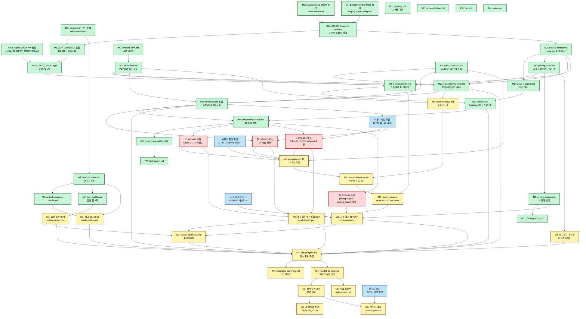

# Task Graph — Print-Quote 작업 의존성 그래프

**작성:** 2026-05-27 (pq-pm)
**범위:** M1~M5 산출물 간 의존 관계 + 병렬화 가능 구간 표시.

본 그래프는 산출물 단위 의존성을 보여준다. 작업 시작 시 본 그래프에서 unblocked 항목을 확인.

---

## 전체 의존성 그래프



---

## 범례

| 색상 | 의미 |
|------|------|
| 🟢 Green | Done (M1 + M2 + PM 산출물 완료) |
| 🟡 Yellow | Pending (M3 ~ M5 진행 예정) |
| 🔴 Red | BLOCKER (M3 시작 전 반드시 해결) |
| 🔵 Blue | 사용자 결정 회신 필요 |

---

## YOU ARE HERE → M3 시작점

M2 완료 직후, M3(화면 설계) 진입 직전 위치.

### M3 진입 조건 (4건 모두 충족 필요)

1. **[BLOCKER]** INC-006 해결 (Order 7↔17 매핑표 작성)
2. **[BLOCKER]** INC-001 해결 (D-PM-01 사용자 회신 후 schema.sql 확정)
3. **권고** INC-005 해결 (pricing-engine.md `pricing_model` 열거형 명시)
4. **권고** D-PM-35 사용자 회신 (UI 라벨 외부 브랜드명 노출 정책)

### 병행 가능 작업 (M3 진입 전에도 가능)

- pq-pm: 사용자에게 V1 critical path D-PM 19건 결정 회신 요청 (AskUserQuestion 경유)
- pq-architect: INC-005, INC-007 자체 해결 (사용자 결정 불요)
- pq-researcher: GAP-006 해결 (Shopby IP 화이트리스트 등록 후 raw 재수집)

---

## 병렬화 가능 구간

### M3 내부 (병렬 실행 가능)

```
M3 진입 후 다음 3 작업 트랙이 병렬 가능:

  ┌── Track A: 정보 구조 ────────────┐
  │ M3A → M3B → M3C                 │
  └─────────────────────────────────┘
                                    
  ┌── Track B: 디자인 토큰 + 위젯 ───┐
  │ M3D → M3E (와이어프레임)         │
  │      → M3I (빌더 에디터)         │
  └─────────────────────────────────┘
                                    
  ┌── Track C: 가격 관련 화면 ───────┐
  │ M3F (옵션 폼) → M3G (가격 결과)  │
  │ M3H (어드민 가격관리 8 팝업)     │
  └─────────────────────────────────┘
       │
       └─→ M3J (design-decisions.md, 통합)
```

### M4 내부 (순차 실행 권고)

M4는 모든 M3 산출물의 인용·통합이라 순차 실행이 안전. 단 M4B(executive-summary)와 M4C(handoff)는 M4A 작성 후 병렬 가능.

### M5 내부 (병렬 실행 가능)

M5A 완료 후 M5B(SPEC 초안)와 M5C(위험 등록부)는 병렬 작성 가능.

---

## 중요 의존성 흐름 (요약)

### Critical Path (가장 긴 의존 체인)

```
M1 As-Is 분석
  → M2 product-master.md
    → M2 cross-mapping.md
      → M2 schema.sql
        → PM consistency-report.md
          → [BLOCKER] INC-006 해결
            → M3 sitemap.md
              → M3 wireframes
                → M3 design-decisions.md
                  → M4 design-spec.md
                    → M4 handoff-to-build.md
                      → M5 SPEC 인덱스
                        → M5 SPEC 초안
```

길이: 13 단계. 본 체인 단축 = 전체 프로젝트 단축.

### 결정-차단 흐름 (사용자 결정이 진행을 막는 경로)

```
D-PM-01 미회신
  → INC-001 미해결
    → schema.sql 미확정
      → M3 상품관리 화면 미정
        → M4 통합 설계서 상품 절 미정
          → M5 SPEC-PQ-CATALOG 미정

D-PM-31 미회신 (배송비)
  → INC-004 미해결
    → 가격 엔진 Step 6 미정
      → M3 결제 화면 총액 표시 미정
        → M4 통합 설계서 결제 절 미정
          → M5 SPEC-PQ-PRICING/ORDER 미정
```

→ 사용자 결정 회신이 critical path를 직접 지배. pq-pm은 결정 요청을 우선 처리.

---

## 변경 이력

| 버전 | 날짜 | 변경 | 작성자 |
|------|------|------|--------|
| 1.0 | 2026-05-27 | M1+M2 완료 시점 1차 작성, YOU ARE HERE 마커 = M3 시작점 | pq-pm |

다음 갱신: M3 진행 중 (Track A/B/C 각각 완료 시).
