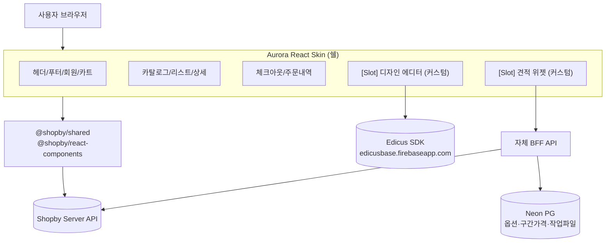
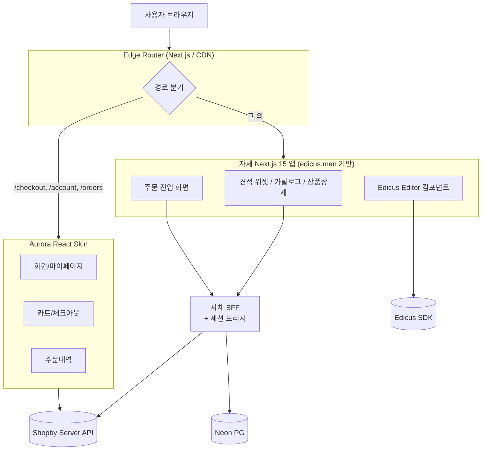
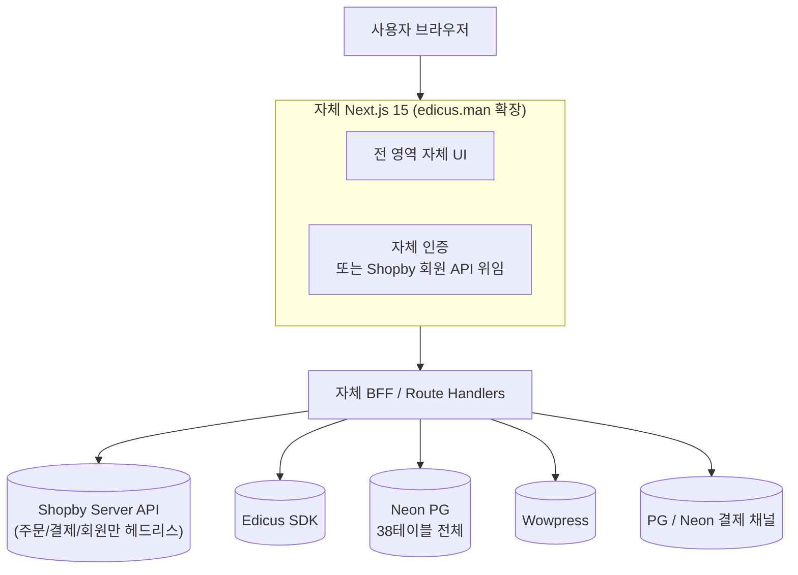

# ADR-001: To-Be 프론트엔드 아키텍처 (3옵션)

- 상태: **Accepted (2026-05-27)** — Aurora 분석 + 3옵션 비교 데이터로 확정
- 결정: **옵션 C — 자체 빌더 100%** (Aurora 미채택, Shopby Server API 부분 활용)
- 점수: A=21.7 / B=65 / **C=80** (8차원 가중합)
- 결정 근거: `01_research/shopby-aurora-analysis/05_recommendation.md`, decisions.md D-004
- Deal-breaker: Shopby가 어드민 상품 가격을 단일 진실로 재계산 → 외부 동적 견적가 결제 불가
- 작성일: 2026-05-27 (Draft) / 격상일: 2026-05-27 (Accepted)
- 관련 ADR: ADR-002 (Edicus 통합), ADR-003 (데이터 레이어)

---

## 1. Context

후니프린팅(`buysangsang.com`)은 현재 **WordPress + WooCommerce + Elementor Pro + TM Extra Product Options + Tiered Price Table + MShop suite (엠샵 에디쿠스 포함) + Lumise Designer 흔적**으로 운영 중이며, 옵션 폼 빌더와 구간 할인 가격엔진을 WP 플러그인에 강하게 의존하고 있다 (참조: `crawl-evidence/2026-05-27_buysangsang/C_findings.md`). 사용자는 점진 마이그레이션이 아닌 **Big-Bang 컷오버 + 자체 웹빌더 구축**을 결정했다.

기 분석된 `docs/edicus.man/`(Next.js 15, React 19, TS5, 12K LOC)는 **외부 Edicus SDK(`edicusbase.firebaseapp.com`)에 디자인 에디터를 위임하는 후니프린팅 전용 신규 셸**이며, S1(Edicus 통합 스택)·S2(Huni Design System v6.0)·S3(Project/Order 도메인)는 거의 그대로 이식 가능하다고 판정됨 (참조: `edicus-analysis/05_verdict-and-recommendations.md`). 그러나 **가격·옵션 엔진과 자체 영속 계층은 0%** 부재(R1, R2).

별도 트랙으로 Shopby 솔루션(Server API + **Aurora React Skin** — `@shopby/shared`, `@shopby/react-components`, mobile-first 통합형, `쇼핑몰 운영방식='스킨'` 가정 — 참조: `docs/shopby/aurora-react-skin-guide/`)을 커머스 백엔드/회원/결제 채널로 도입하기로 한 상태이다.

사용자는 "Aurora는 일반 쇼핑몰 카탈로그 가정이라 인쇄 견적(상품당 단가 0, 수량·옵션 조합에서 가격 산출, 작업파일·교정 워크플로) 도메인과 fit이 떨어질 것 같다"는 직관적 우려를 표명했다. 본 ADR은 그 우려를 데이터로 검증하기 전 골격을 잡는 것이 목적이다.

베이스라인 데이터 모델은 이미 6개 도메인 38테이블(Product 6 / Pricing 6 / Order 7 / Widget 7 / Production 10 / Common 2)로 설계되어 있다 (참조: `_baseline/08_erd.md`). 이 모델은 인쇄 도메인 전용이며, 일반 쇼핑몰(SKU·variation 모델) 가정과 구조적으로 다르다 — 특히 `quantity_price_breaks`, `spec_option_surcharges`, `widget_step_fields`, `production_jobs`, `artwork_files`.

---

## 2. 결정 차원 (Decision Dimensions)

| Dim | 설명 |
|---|---|
| D1. 초기 공력 | 첫 컷오버까지 들어가는 개발 공수 |
| D2. 유지보수 부담 | 컷오버 이후 운영 인력/시간 |
| D3. 업스트림 의존 리스크 | Shopby/NHN, Aurora 스킨 업데이트, Edicus SDK 변동 |
| D4. 인쇄 도메인 fit | 옵션·구간할인·교정·작업파일 워크플로 표현력 |
| D5. Edicus 통합 용이성 | `edicus.man` 자산 이식 단순성 |
| D6. 디자인 자유도 | Figma/Pencil 디자인을 픽셀단위로 구현 가능한 정도 |
| D7. 운영비 | 라이선스/호스팅/PG 수수료 외 추가 부담 |
| D8. 일정 리스크 | 미지(Aurora 내부, Edicus 라이선스, Shopby 인쇄도메인 한계)로 인한 지연 가능성 |

---

## 3. 옵션 A — Aurora Full

### 정의
NHN Aurora React Skin을 **베이스 셸**로 채택하고, 견적·디자인 에디터·옵션 빌더 영역만 커스텀 컴포넌트로 주입(over-ride)하는 구성. 회원/카트/체크아웃/주문내역/마이페이지 등은 Aurora 기본 컴포넌트를 그대로 사용.

### 아키텍처

### 구성 요소 역할
- **Aurora Skin**: UI 셸, 라우팅, 회원/카트/체크아웃, 디자인 시스템 토큰의 1차 소스
- **`@shopby/*` 패키지**: 서버 상태/비즈니스 로직 (NHN 제공)
- **Shopby Server API**: 상품 마스터(가능 시), 주문/결제/회원/배송 (마스터)
- **Edicus SDK**: 디자인 에디터 (iframe)
- **자체 BFF + Neon PG**: 인쇄 옵션·구간 가격·작업파일·생산 워크플로 (Aurora가 표현 못하는 부분만)
- **edicus.man 자산**: S1만 이식, S2(디자인시스템)는 Aurora 토큰과 충돌하므로 폐기 또는 부분 흡수

### 데이터 흐름
- 상품 조회: Shopby `getProducts` → Aurora 리스트 컴포넌트. 인쇄 메타(옵션/구간가격)는 BFF에서 추가 fetch 후 Slot에 hydrate
- 옵션 선택/가격 산출: Slot 위젯 → BFF → Neon PG (Aurora 가격 컴포넌트는 우회)
- 주문: 산출된 단가/수량을 Shopby 주문 API에 "이미 계산된 단가 상품"으로 push (Shopby가 dynamic pricing을 허용한다는 전제 필요 — 미검증)
- 결제: Shopby PG 채널
- 디자인 에디터: Slot → Edicus SDK iframe

### 강점
- 회원/체크아웃/PG 연동 등 commodity 영역의 즉시 사용 (자체 구현 0)
- NHN 운영의 Aurora가 한국 커머스 표준(휴면계정/CI-DI/네이버페이/카카오페이)을 이미 처리
- 유지보수가 분산됨 (NHN이 commodity 유지)

### 약점
- **인쇄 도메인 fit 미지** — Aurora의 상품/카트 모델이 "수량·옵션 조합당 동적 단가"를 1급으로 표현할 수 있는지 불확실. 가격 산출을 BFF에서 한 뒤 Shopby에 푸시하는 모델이 Shopby 정책상 허용되는지 검증 필요
- 디자인 자유도 ↓ — Aurora 토큰/레이아웃 골격을 깨면 업데이트 호환성 손상
- 두 디자인 시스템 충돌 (Aurora vs Huni v6.0)
- Edicus 통합이 Slot 안에 갇혀 SDK의 17가지 모드(02_domain-model A.6) 중 일부만 안전하게 노출 가능
- 업스트림 의존 ↑ (NHN의 Aurora 정책·버전 정책에 묶임 — `index.mdx` "별도 안내 없이 내용이 수정될 수 있습니다")

### 견적 도메인 fit (정성)
- **낮음 추정**. Aurora는 mobile-first 표준 쇼핑 카탈로그를 가정. 견적 단계가 "상품 선택 → 사양 N단계 → 수량/구간 → 미리보기 → 작업파일 업로드 → 잠정주문/확정주문/취소" 8+단계인 인쇄업 워크플로를 자연스럽게 표현하기 어려움. Aurora 분석 결과 도착 후 정량 평가.

### 운영 모델
- 1팀(Aurora 셸 + commodity), 2팀(견적/에디터 Slot)
- 배포 단위: 단일 Aurora 빌드(NHN 배포 채널). Slot 컴포넌트는 같은 빌드 안에 포함

---

## 4. 옵션 B — Hybrid

### 정의
**Commodity 영역(회원, 카트, 체크아웃, 주문내역, 배송조회, 마이페이지, PG 연동)만 Aurora**를 쓰고, **인쇄 핵심 흐름(상품 카탈로그, 옵션 위젯, 가격 산출, 디자인 에디터, 작업파일 업로드, 견적 → 주문 전이)은 자체 빌더(Next.js 15 + edicus.man 자산)**로 구축. 두 앱을 도메인 경로(`/account/**`, `/checkout/**` → Aurora, 그 외 → 자체 Next.js)로 분기하고, 공통 세션을 BFF에서 브리지.

### 아키텍처

### 구성 요소 역할
- **자체 Next.js (edicus.man 베이스)**: 카탈로그, 상품상세, 옵션 위젯(`widget_*` 테이블 표현), 가격 산출 UI, 디자인 에디터 진입, 작업파일 업로드, 잠정주문 생성
- **Aurora**: 카트 → 결제 → 주문완료 → 주문내역/배송조회/회원 영역만
- **BFF**: 가격 산출(Neon `price_tables`, `quantity_price_breaks`, `spec_option_surcharges`), Edicus 토큰/프록시, Shopby 주문 push, **세션 브리지**(자체 인증 ↔ Shopby 세션)
- **Shopby**: 결제·정산·회원 마스터(가설)
- **Neon PG**: 인쇄 도메인(38테이블 중 Product/Pricing/Widget/Production 29개)
- **edicus.man 자산**: S1 + S2 + S3 모두 이식

### 데이터 흐름
- 상품 조회: 자체 카탈로그 → BFF → Neon (캐싱) ± Shopby 마스터(ADR-003 미해결)
- 옵션 선택/가격 산출: 자체 위젯 → BFF → Neon (인쇄 도메인 모델 그대로)
- 디자인 에디터: 자체 화면 → Edicus iframe (edicus.man `EdicusEditor` 컴포넌트)
- 주문 진입: 자체 잠정주문(Edicus `ProjectStatus=ordering`) → BFF가 Shopby에 주문 생성 → Aurora `/checkout` 으로 리다이렉트
- 결제: Aurora + Shopby PG
- 결제 완료: Shopby webhook → BFF → Neon에 `orders.status=definitive`로 동기화

### 강점
- 인쇄 도메인 fit ↑↑ — 견적·옵션·에디터를 우리 모델대로 자유 설계
- commodity 영역(회원/결제/배송) 재구현 0 — 한국 커머스 표준을 NHN이 책임
- edicus.man 자산 100% 활용 (S1+S2+S3)
- 디자인 자유도 ↑ (자체 영역에선 Huni v6.0 그대로)
- 점진 확장 여지: 향후 commodity 영역도 자체화 가능

### 약점
- **세션 브리지 복잡도**: 자체 인증과 Aurora/Shopby 세션 간 SSO/토큰 동기화 설계 필요
- **디자인 일관성 깨질 위험**: 두 영역(자체 Huni v6.0 vs Aurora) 시각적 통일 필요 → 토큰 동기화 작업 추가
- **주문 핸드오프 지점**(자체 → Aurora `/checkout`)의 UX 끊김 가능성
- 두 빌드/배포 파이프라인 관리

### 견적 도메인 fit (정성)
- **높음**. 견적 흐름의 모든 단계가 자체 통제 영역. Aurora는 결제 게이트웨이 역할.

### 운영 모델
- 1팀(자체 빌더 + 견적/에디터/BFF + Neon), 2팀(Aurora 커스터마이즈 + Shopby 연동 + 세션 브리지)
- 배포 단위: 자체 앱(Vercel/Cloud Run) + Aurora 빌드(NHN 배포 채널) 독립

---

## 5. 옵션 C — Own Builder 100%

### 정의
Aurora를 채택하지 않고, **edicus.man 베이스를 확장**하여 견적·카탈로그·디자인·카트·체크아웃·주문내역·회원까지 **모두 자체 Next.js**로 구현. Shopby는 **Server API 한정**(상품/주문/회원/PG)으로 사용 또는 Shopby 자체를 미사용하고 직접 PG/회원 시스템 구축.

### 아키텍처

### 구성 요소 역할
- **자체 Next.js (edicus.man 확장)**: 전 화면. Huni v6.0 디자인 시스템 100% 적용
- **Edicus SDK**: 디자인 에디터
- **Neon PG**: 인쇄 도메인 38테이블 전체 — source of truth
- **Shopby**: **헤드리스 모드** Server API로 결제/주문/회원만 위임 (Aurora 미사용 — `index.mdx`가 명시: "헤드리스(headless)몰은 API 문서 확인하여 스킨개발 진행")
  - 또는 Shopby 미사용 + 직접 PG (Neon, KCP, 토스 등) 구축
- **edicus.man 자산**: S1+S2+S3 그대로 + 카트/체크아웃/마이페이지 신규 구축

### 데이터 흐름
- 모든 흐름이 `자체 UI → BFF → (Neon | Edicus | Shopby API | PG)` 단일 경로
- Aurora를 거치지 않으므로 Slot/세션 브리지 불필요

### 강점
- 인쇄 도메인 fit ↑↑↑ — 모든 화면 자체 통제
- 디자인 자유도 ↑↑↑
- 업스트림 의존 ↓ — Aurora 정책 변동 영향 0
- edicus.man 자산 단일 베이스로 활용
- 데이터 모델·URL·UX 일관성 ↑

### 약점
- **초기 공력 ↑↑** — 회원/카트/체크아웃/주문내역/배송조회/한국 커머스 표준(휴면계정/CI-DI/이용약관 동의 흐름) 자체 구현
- mshop_agreement(한국형 회원 워크플로) 재구현 필요 (As-Is `A2_findings.md` D4)
- 결제 모듈을 Shopby Server API에 위임할 수 있는지 검증 필요 (위임 불가 시 PG 직결 — 일정 리스크 증폭)
- "이미 Shopby 도입 결정"과 충돌할 수 있음 — Shopby를 헤드리스 결제 백엔드로만 쓴다는 합의 필요

### 견적 도메인 fit (정성)
- **최상**. 38테이블 모델이 화면에 1:1 매핑.

### 운영 모델
- 단일팀, 단일 빌드, 단일 배포
- 도메인 분리 시 인쇄 / commodity / 결제 모듈로 패키지 분할

---

## 6. 옵션 비교표

| Dim | A. Aurora Full | B. Hybrid | C. Own 100% |
|---|---|---|---|
| D1. 초기 공력 | ★★★ (낮음) | ★★ | ★ (높음) |
| D2. 유지보수 부담 | ★★ (NHN 의존이 양날) | ★★ | ★★★ (자체 통제) |
| D3. 업스트림 의존 리스크 | ★ (높음) | ★★ | ★★★ (낮음) |
| D4. 인쇄 도메인 fit | ★ (추정 낮음) | ★★★ | ★★★ |
| D5. Edicus 통합 용이성 | ★★ (Slot 한정) | ★★★ | ★★★ |
| D6. 디자인 자유도 | ★ | ★★ | ★★★ |
| D7. 운영비 | ★★ (Aurora 무비용·NHN 운영비 분담) | ★★ | ★★ (PG 직결 시 비용 증가 가능) |
| D8. 일정 리스크 | ★★ (Aurora fit 검증 미완) | ★★ (브리지 복잡도) | ★ (commodity 자체 구현 분량) |

★ 많음 = 유리. 다섯 칸 만점.

---

## 7. 잠정 추천 (Aurora 분석 도착 전)

**1순위: 옵션 C (Own Builder 100%)**, **2순위(보조): 옵션 B (Hybrid)**, **비추: 옵션 A (Aurora Full)**

### 근거

1. **인쇄 도메인 모델의 비표준성** — 베이스라인 38테이블이 일반 쇼핑몰(SKU-variation)이 아닌 "사양 N단계 × 수량 구간 × 옵션 가산 × 작업파일 × 생산 배치(gang printing)" 모델을 전제로 설계됨 (`_baseline/08_erd.md`). Aurora의 mobile-first 통합 쇼핑 카탈로그(`index.mdx`)가 이를 1급으로 표현할 수 있다는 증거가 현재 0. 사용자 직관과 정렬.

2. **edicus.man의 베이스 적합성** — Next.js 15 / React 19 / TS5 / Zod 검증 / Huni v6.0 디자인 시스템 / Edicus 통합이 이미 완성된 후니 전용 셸이 존재 (`05_verdict-and-recommendations.md` S1+S2+S3, ~12K LOC, 85% 테스트 커버리지). 옵션 C에서 가장 자연스럽게 베이스가 됨.

3. **업스트림 의존 리스크 회피** — Aurora 가이드 자체가 "shop by 솔루션 정책과 업데이트에 따라서 별도 안내 없이 내용이 수정될 수 있습니다"라 명시. Big-Bang 컷오버 직후 NHN 변경에 끌려다닐 리스크.

4. **옵션 B를 보조로 유지하는 이유** — commodity 영역(회원/결제/한국 커머스 표준) 자체 구현 분량이 일정 리스크의 주범. Aurora 분석에서 Shopby가 한국 결제 표준을 Aurora 외부로도 깨끗하게 노출한다면(=Server API + Aurora 모두 동등 접근) C 단독이 우월. 그렇지 못하다면 commodity만 Aurora에 위임하는 B로 후퇴 가능.

5. **옵션 A 비추 사유** — 인쇄 도메인을 Aurora의 Slot에 우겨넣어 SDK 17모드(02_domain-model A.6)와 38테이블 모델을 모두 표현하기 어렵고, 표현해도 Aurora 업데이트에 깨지기 쉬움. "데이터로 반증되지 않는 한" 채택 비추.

### Aurora 분석 결과로 갱신해야 할 항목
- D4 (인쇄 도메인 fit) — Aurora가 동적 단가/옵션 가산을 1급으로 지원하는지 정량
- Shopby Server API와 Aurora의 의존성 — Server API만 단독 사용 가능한지(C의 Shopby 헤드리스 옵션 검증)
- 세션/회원/PG의 Aurora-결합도 — B의 세션 브리지 난이도 추정
- mshop_agreement 표준 워크플로(휴면계정/CI-DI)의 Aurora 기본 제공 여부 — C의 commodity 자체 구현 분량 추정

---

## 8. Open Questions (잠정 추천 확정 전 해소 필요)

1. Aurora Skin과 `@shopby/*` 패키지는 분리 가능한가? Aurora 미사용 시 `@shopby/shared`만 차용 가능한가?
2. Shopby가 "수량·옵션 조합당 동적 단가"를 표준 주문 생성 API에서 허용하는가?
3. Shopby의 한국 회원 워크플로(휴면계정/CI-DI/이용약관)는 Server API로 헤드리스 호출 가능한가?
4. Edicus SDK 라이선스가 옵션 C(자체 호스팅 가능성)와 충돌하지 않는가? (`05_verdict-and-recommendations.md` R5)
5. Big-Bang 컷오버 시점에 Aurora를 운영 검증할 시간이 충분한가? (옵션 A/B의 일정 리스크 평가)

---

## 9. Consequences (옵션 미확정 단계에서의 공통 합의)

- BFF 레이어는 옵션 무관 필수. ADR-002/003은 옵션 확정 이전에 선행 진행 가능.
- edicus.man 자산(S1) 이식 작업은 옵션 무관 진행 가능 (ADR-002에서 구체화).
- Neon PG 38테이블 마이그레이션 작업도 옵션 무관 진행 가능.
- Aurora 채택 여부와 무관하게 인쇄 도메인 핵심 위젯/에디터/가격 산출은 자체 구현이 결정됨.

---

REQ coverage: REQ-FE-ARCH-001, REQ-FE-ARCH-002, REQ-FE-ARCH-003
References: edicus-analysis/05_verdict-and-recommendations.md, edicus-analysis/02_domain-model.md, crawl-evidence/2026-05-27_buysangsang/C_findings.md, crawl-evidence/2026-05-27_buysangsang/A2_findings.md, _baseline/08_erd.md, docs/shopby/aurora-react-skin-guide/index.mdx
