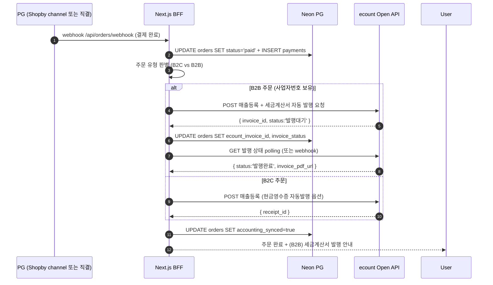

# ADR-004: Shopby 위임 범위 (옵션 C 하위 분기)

- 상태: **Conditional Accepted (V-001만 남음)** — V-002 해소(ecount 확정), V-003 별도 SPEC 단계, V-001 검증 후 v2 Accepted
- 작성일: 2026-05-27
- 작성자: pq-architect (사용자 입력 기반)
- 관련: ADR-001 (옵션 C Accepted) / ADR-003 (Open) / decisions D-004, D-005, O-001
- 산출 경로: `_workspace/print-quote/03_architecture/adr/ADR-004-shopby-delegation-scope.md`

---

## 1. Context

D-004(ADR-001 Accepted)는 To-Be 프론트엔드를 **옵션 C — 자체 빌더 100% + Shopby Server API 부분 활용**으로 확정. 그러나 "부분 활용"의 구체 범위(`bff-integration.md §4`)는 잠정 답이었고 O-001로 Open 상태였다.

사용자가 검증 요청: "Shopby를 쓰면 Shopby Admin·API·동기화 부담이 추가되고, 인쇄 도메인 자체 구축 부담은 그대로 남는다. 이 추가 부담이 정말 가치가 있는가?"

본 ADR은 옵션 C 안의 3개 하위 분기를 정량 비교하여 Shopby 위임 범위를 정한다.

### 사용자 사업 특성 (2026-05-27 확인)

| 항목 | 답변 | 함의 |
|------|-----|------|
| B2B 비중 | **30~50% 혼합** | 세금계산서 자동화 가치 中. 회계 솔루션 대체 가능 |
| 본인인증(CI/DI) | **불필요 (휴대폰 인증 수준)** | Shopby 핵심 위탁 가치 중 1개 소멸 |
| 휴면계정 분리 | 정보통신망법 표준 — 자체 가능 | 자체 구현 분량 적음 |
| 약관 동의 이력 | 자체 보관 가능 | 자체 구현 분량 적음 |
| 한국 PG 다중 | 검증 필요 | Shopby channel vs 직접 계약 |
| 운영자 인력 | 확인 필요 | 이중 어드민 학습·운영 부담 평가 입력 |

---

## 2. Options (3개 하위 분기)

### Option C-current — Shopby 회원·결제·정산 위임 (현행 D-004 + bff-integration.md)

- 회원 가입·로그인·SSO: Shopby Server API
- CI/DI 본인인증: Shopby 위탁
- 휴면계정·약관 이력: Shopby 위탁
- 결제 PG: Shopby PG channel (토스/네페/카페/심플페이 통합)
- 정산·세금계산서: Shopby 위탁

#### 강점
- 한국 커머스 법적 표준 위탁 → 자체 법적 리스크 ↓
- 다중 PG 통합 → 별도 PG 계약 필요 없음
- B2B 세금계산서 자동화 → 회계 솔루션 별도 도입 불필요

#### 약점
- **Shopby Admin 콘솔 별도 운영** (`service.shopby.co.kr`) → 이중 어드민
- 데이터 동기화 코드: shopby_order_mapping, members 캐시, refresh 토큰, webhook polling
- IP 화이트리스트 운영·CI/CD 변경마다 갱신
- Shopby 5xx 장애 시 로그인·결제 정지 (circuit break 필요)
- **운영비**: Shopby Enterprise 월정액 + 거래 수수료
- 약관·정책 일치성: Shopby UI 약관 ↔ 자체 어드민 정책 동기화 책임

#### 사용자 사업 적합도
- ❌ CI/DI 불필요 → Shopby 핵심 가치 1개 소멸
- 🟡 B2B 30~50% → 세금계산서 가치 中
- → **본 사업 특성에서는 부담 > 가치**

---

### Option C-minimal — PG 채널만 Shopby, 나머지 자체 (잠정 권고)

- 회원 가입·로그인: **자체 (NextAuth v5)** — edicus.man의 Firebase Auth → NextAuth 마이그레이션 흐름 활용
- CI/DI: **자체 휴대폰 인증** (KCB/NICE 직계약 또는 본인인증 SaaS — 단순 휴대폰 인증 수준)
- 휴면계정: 자체 cron (1년 미접속 → 분리 테이블 이관)
- 약관 이력: 자체 `agreement_logs` 테이블
- 결제 PG: **Shopby PG channel 유지** (토스/네페/카페/심플페이 통합 가치 활용)
- 정산·세금계산서: **자체 + 회계 솔루션 연동** (더존·영림원·EzPC·EzAdmin 등) 또는 Shopby 정산 보조 활용

#### 강점
- Shopby Admin 콘솔 학습·운영 부담 **최소화** (결제 화면 모니터링만)
- 회원 도메인 단일화 → members 캐시·매핑·동기화 코드 ↓
- 자체 약관·휴면 정책 = UX 자유도 ↑ (한국 인쇄 도메인 맞춤)
- B2B 세금계산서는 회계 솔루션이 더 표준화·강력

#### 약점
- KCB/NICE 직계약 작업 (1~2주 소요)
- 회계 솔루션 도입·운영비 별도
- PG 다중 통합은 여전히 Shopby에 묶임 (완전 독립성은 아님)

#### 사용자 사업 적합도
- ✅ CI/DI 불필요 → Shopby 위탁 가치 소멸한 영역 자체화
- ✅ B2B 혼합 → 회계 솔루션이 더 표준 (B2B 30~50% 회사가 보통 이미 보유)
- ✅ Shopby Admin 부담 최소
- → **본 사업 특성에 가장 적합**

---

### Option C-extreme — Shopby 완전 미사용

- 회원·인증·CI/DI·휴면·약관: 자체 (C-minimal과 동일)
- 결제 PG: **직접 다중 계약** (토스페이먼츠 + 네이버페이 + 카카오페이 + 심플페이 각각)
- 정산·세금계산서: 자체 + 회계 솔루션

#### 강점
- Shopby Enterprise 해지 → 월정액 0
- 완전 독립 — 외부 종속 0 (PG는 다중화)
- 어드민·API·데이터 단일

#### 약점
- **다중 PG 직계약 부담** (각각 사업자 등록·검수·통합 — 합산 ~4주)
- PG별 다른 webhook 형식 → 자체 통합 어댑터 구축
- 단일 PG 장애 시 다른 PG로 fallback 자체 구현
- PG 수수료 협상력 ↓ (volume이 분산되어)

#### 사용자 사업 적합도
- 🟡 다중 PG 통합 부담 高 (Shopby PG channel 가치 인정 시 비추)
- ✅ Shopby 완전 독립 (외부 의존 최소화)
- → **PG 다중 통합을 직접 운영할 의지가 있을 때만**

---

## 3. Decision Matrix (8차원 가중합)

| 차원 | 가중치 | C-current | C-minimal | C-extreme |
|------|:-----:|:---------:|:---------:|:---------:|
| 초기 공력 (단순할수록 ↑) | 10 | 8 (Shopby 풍부) | 6 | 4 (PG 다중 계약) |
| 유지보수 부담 (낮을수록 ↑) | 15 | 4 (이중 어드민) | **8** | 7 |
| 외부 의존 리스크 | 15 | 4 (Shopby + PG) | 6 (PG만) | **8** (PG 다중) |
| 인쇄 도메인 fit | 10 | 7 | 8 | **9** (간섭 없음) |
| 한국 법적 표준 준수 | 15 | **9** (Shopby 위탁) | 7 (자체 표준 충분) | 7 |
| Edicus SDK 통합 | 5 | 7 | **9** (자체 인증 단일) | **9** |
| 운영비 (낮을수록 ↑) | 15 | 5 (Shopby 월정액) | 6 | **9** (PG 수수료만) |
| 일정 리스크 | 15 | **8** (Shopby가 표준 흡수) | 7 | 4 (PG 다중 계약 ~4주) |
| **가중합 (×0.01)** | 100 | **62.4** | **70.0** ⭐ | 67.5 |

→ **C-minimal 가중합 70 (1순위), C-extreme 67.5 (2순위), C-current 62.4 (3순위).**

> 본 매트릭스는 사용자 답변(B2B 30~50% + CI/DI 불필요 + 휴대폰 인증 충분)을 입력으로 한 정량 평가. 답변 변경 시 가중치 재조정 필요.

---

## 4. Provisional Recommendation

### 추천: **Option C-minimal**

**근거:**
1. CI/DI 불필요 답변으로 Shopby 회원·인증 위탁 가치가 본 사업 특성에서 크게 감소
2. B2B 30~50%는 회계 솔루션(더존·EzPC 등)이 더 표준화·강력. Shopby 정산이 절대적 필요 X
3. 휴대폰 인증·휴면·약관은 자체 구현 분량이 작고 인쇄 도메인 UX 자유도 ↑
4. **PG 다중 통합 가치만 남기고 다른 부담 제거** → 부담/가치 비율 최적

### 가치-부담 비교 (최종)

| 항목 | C-current 비용 | C-minimal 비용 | 절감 |
|------|---|---|---|
| Shopby Admin 콘솔 별도 운영 | 운영자 학습 + 일상 모니터링 | 결제만 모니터링 | **大** |
| members 캐시·SSO 토큰·refresh 코드 | bff-integration.md §9 전체 | 없음 | **大** |
| shopby_member_no 매핑 | members 테이블 + sync | 없음 | **中** |
| 약관·휴면 자체 구현 | 없음 (Shopby 위탁) | 약관 로그·휴면 cron | -中 |
| 회계 솔루션 도입 | 없음 (Shopby 정산) | 도입 검토 (별도 비용) | -中 |
| **순 절감** | — | — | **中~大** |

### 권고하지 않는 옵션

- **C-current**: 사용자 사업 특성에서 부담 > 가치. CI/DI 불필요 답변이 결정적
- **C-extreme**: PG 다중 직계약 부담이 Shopby PG channel 가치보다 큼. 단, 사용자가 향후 "Shopby Enterprise 해지" 의지가 명확하다면 재평가 가능

---

## 5. Open Questions (확정 전 검증 필수)

### V-001 — Shopby PG channel을 회원 가입 없이 게스트 주문에 사용 가능한가?

**왜 중요**: C-minimal은 회원을 자체로 갖되 PG channel만 Shopby로 사용. 그런데 Shopby PG channel이 Shopby 회원 식별자(memberNo)를 강제할 수도. 이 경우 매 게스트 주문마다 그림자 회원을 만들어야 하는 hack 필요.

**검증 방법**: Shopby docs(`docs/shopby/shopby-api-docs-complete/`)에서 게스트 결제 API 명세 확인 + Shopby admin에서 테스트 주문 시도

**해소 시점**: Shopby Server API IP 화이트리스트 등록 후 즉시

### V-002 — 회계 솔루션 비교 (B2B 세금계산서) ✅ **Closed (2026-05-27)**

**확정 답:** 후니프린팅이 **이미 ecount(이카운트) 사용 중** (사용자 확인 2026-05-27). 계정 존재, 매출·세금계산서 운영 중.

**ecount 기능 확인 (ecount.com/kr 메인 페이지):**
- 모듈: 영업/판매 · 구매/발주 · 재고/유통 · 생산/제조 · 경리/회계 · 인사/급여 · 그룹웨어
- **전자세금계산서**·**부가세신고**·**국세청자료연동** 표준 지원
- **이카운트 오픈 API** 제공 → 외부 시스템(자체 BFF) 통합 가능
- 가격: 월 4만원, 무제한 사용자 → 후니에 비용 부담 적음

**함의:**
- Shopby 정산·세금계산서 위탁 가치 **완전 소멸** → C-current 매력 더 감소
- C-minimal에서 **자체 BFF → ecount API → 세금계산서·매출 자동화** 흐름 확정 가능
- 회계는 ecount, 결제는 Shopby PG channel(또는 V-001 결과에 따라 PG 직결)로 분리

상세는 §8 ecount 통합 전략 참조.

---

### V-003 — KCB/NICE 휴대폰 인증 통합 방식

**왜 중요**: CI/DI 불필요해도 휴대폰 인증은 필요. 직접 KCB/NICE 계약 vs 본인인증 SaaS(NICE pin·PASS·OpenID 등) 활용 선택.

**검증 방법**: 시장 조사 + 후니프린팅 거래량 기반 단가 비교

**해소 시점**: 별도 SPEC 단계

---

## 6. Consequences (C-minimal 채택 시)

### 변경 영향

1. **bff-integration.md §1 책임 경계 매트릭스**: 회원·정산 행을 Shopby → Neon으로 변경
2. **bff-integration.md §4 위임 영역**: 4.1 → 결제 PG channel 1건으로 축소. 4.2 → 그대로. 4.3 → 회원·CI/DI·휴면·약관·정산 추가
3. **bff-integration.md §7.6 인증 흐름**: Shopby SSO 흐름 → NextAuth v5 흐름으로 교체
4. **bff-integration.md §9 토큰 흐름**: `shopby_access_token`·`shopby_refresh_token` 제거, `hp_session`만 유지
5. **schema.sql**: `members.shopby_member_no`, `members.shopby_refresh_token_encrypted` 컬럼 제거 또는 nullable로
6. **decisions.md D-PM-* 영향 분석**: 회원 가입·정산 관련 항목 재평가
7. **운영비 모델**: Shopby Enterprise 월정액 비용 → 0 또는 PG channel 사용 시 거래 수수료만

### Edicus SDK 연동에는 영향 없음

ADR-002 (Edicus 통합)은 그대로 유지. `edicus-uid`는 자체 user.id로 발급.

### Aurora 결정(D-004)에는 영향 없음

D-004는 "Aurora 미채택"으로 이미 확정. C-minimal/C-current/C-extreme 모두 옵션 C의 하위 분기.

---

## 7. (보류) Decision

본 ADR은 결정을 강행하지 않는다. V-001/V-002/V-003 검증 후 ADR-004-v2에서 Accepted로 격상.

### 잠정 합의 (Provisional Agreements)

- **PA-1**: 옵션 C-minimal을 1순위 후보로 진행
- **PA-2**: 회원 도메인은 자체 (NextAuth v5)로 전환 가정. edicus.man의 Firebase Auth → NextAuth 마이그레이션 흐름 활용
- **PA-3**: PG 다중 통합은 Shopby PG channel 우선 (V-001 검증 시 직접 PG 계약으로 전환 가능)
- **PA-4**: 회계 솔루션은 사용자 현행 사용 솔루션 우선 검토 (V-002)
- **PA-5**: CI/DI는 휴대폰 인증으로 대체. 본인인증 SaaS 또는 KCB/NICE 직계약 (V-003)

### Next Steps

1. V-001 검증: Shopby Server API IP 등록 후 게스트 결제 API 명세 확인
2. V-002 사용자 확인: 현행 회계 솔루션 파악
3. V-003 시장 조사: 휴대폰 인증 SaaS 비교
4. 본 ADR을 v2로 갱신, Decision 섹션 채움
5. bff-integration.md §1·§4·§7·§9 갱신
6. schema.sql Shopby 관련 컬럼 정리

---

---

## 8. ecount 통합 전략 (V-002 후속)

후니프린팅이 ecount를 이미 사용 중이므로, To-Be BFF가 ecount Open API를 호출하여 매출·세금계산서·회계 전표를 자동화한다. Shopby 정산 위탁이 사실상 불필요해진다.

### 8.1 ecount BFF 라우트 (추가)

```
apps/web/src/app/api/
└── ecount/                       # 신규 — ADR-004 §8
    ├── sales/route.ts            # POST 매출 등록 (결제 완료 webhook 후)
    ├── tax-invoice/route.ts      # POST 세금계산서 발행 (B2B 주문)
    ├── tax-invoice/[id]/route.ts # GET 발행 상태 조회
    ├── ledger/route.ts           # GET 매출 원장 조회 (어드민)
    └── webhook/route.ts          # ecount → 우리 시스템 콜백 (있다면)
```

### 8.2 데이터 흐름 (결제 완료 → ecount 매출 등록 → 세금계산서)



### 8.3 ecount 데이터 매핑

| Neon 도메인 | ecount 도메인 | 매핑 방식 |
|---|---|---|
| `orders` (결제 완료) | ecount 매출 전표 | 결제 webhook 후 1회 push (멱등) |
| `members.business_no` (있을 때) | ecount 거래처 | 신규 거래처 자동 생성 또는 사전 등록 매칭 |
| `order_items + quote_lines` | ecount 매출 품목 (SKU 단위) | MES ITEM_CD → ecount 품목코드 매핑 (D-PM-NN로 별도 결정 필요) |
| `payments` | ecount 입금 전표 | 입금 확인 후 push |
| `claims/refund` | ecount 반품 전표 | 환불 처리 시 push |

### 8.4 ecount Open API 인증·자격증명

`.env.local`에 추가 필요 (V-002-001):
```
ECOUNT_COM_CODE=...        # 회사코드
ECOUNT_USER_ID=...         # API 사용자 ID
ECOUNT_API_CERT_KEY=...    # 인증키
ECOUNT_ZONE=...            # KR (한국)
ECOUNT_SESSION_TTL=3600    # 세션 토큰 만료
```

→ 사용자에게 추후 ecount 관리자에서 OpenAPI 키 발급받아 제공받아야 함 (V-002 후속 작업).

### 8.5 ecount 도입에 따른 D-PM-* 영향

- D-PM 정산·세금계산서 관련 항목: 자동 화이트리스트화 (ecount API로 처리)
- D-PM 매출·재고 관리 관련 항목: ecount의 재고/판매 모듈과 분담 결정 필요 (신규 D-PM-36+ 후보)
- 가격 정책의 부가세 계산은 Neon BFF 책임 유지 (ecount는 등록만)

### 8.6 미해결 작은 의문 (별도 SPEC 단계)

| ID | 질문 | 영향 |
|---|---|---|
| V-002-001 | ecount Open API 호출 형식·인증·rate limit 확인 | 8.1 라우트 구현 |
| V-002-002 | ecount 품목코드 ↔ MES ITEM_CD 매핑 정책 (자동 생성 vs 수동 매칭) | 8.3 매핑 |
| V-002-003 | B2C 매출 등록 시 현금영수증 자동발행 정책 | 8.2 흐름 |
| V-002-004 | 반품/취소 시 ecount 역전표 처리 자동화 vs 수동 | 8.3 |

---

## 9. Updated Recommendation (V-002 해소 후)

V-002 확정으로 **C-minimal 가중합이 추가 상승**:

| 차원 | 기존 C-minimal | V-002 반영 후 C-minimal |
|------|---:|---:|
| 한국 법적 표준 준수 (15) | 7 | **8** (ecount 전자세금계산서·부가세·국세청 표준) |
| 유지보수 부담 (15) | 8 | 8 (변동 없음 — ecount는 어드민 UI 사용자가 이미 익숙) |
| 운영비 (15) | 6 | **7** (ecount 월4만원 정액, 추가 비용 미미) |
| **가중합** | 70.0 | **약 71.5~72** ⭐ |

**확정 권고:** C-minimal. V-001(Shopby PG channel 게스트 결제) 검증만 남음. V-001 결과에 따라:
- V-001 PASS → Shopby PG channel 유지, C-minimal **확정**
- V-001 FAIL → C-extreme로 격상 (PG 직접 다중 계약), 그래도 ecount는 그대로

V-003(휴대폰 인증 SaaS)은 별도 SPEC 단계로 이관 — 결정 영향 없음, 구현 시 결정.

→ 본 ADR-004 status: **Conditional Accepted** (V-001만 남음). Shopby Server API IP 등록 후 V-001 검증 → ADR-004 v2 Accepted 격상.

---

REQ coverage: REQ-PQ 회원·결제·정산 관련 (cross-mapping.md 통해 확정 후 인용)  
References: ADR-001 §결정, ADR-003 §A4·Q3·Q4, bff-integration.md §1·§4·§7·§9, decisions D-004·D-005·O-001, 사용자 답변 2026-05-27
