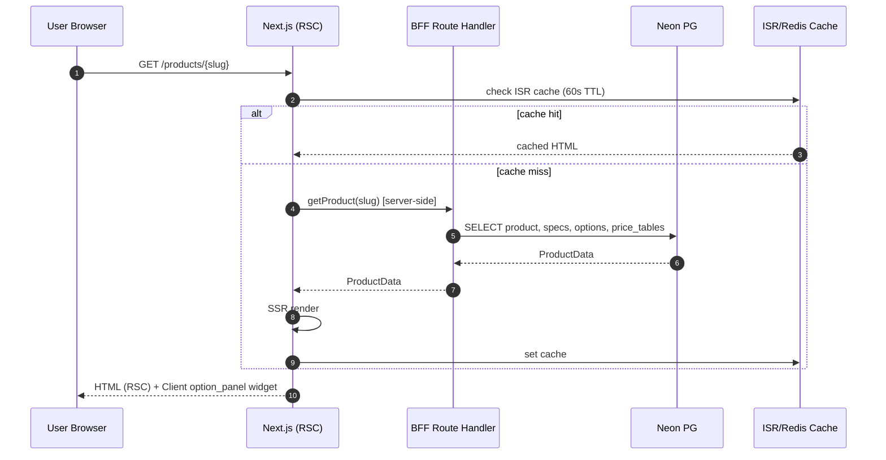
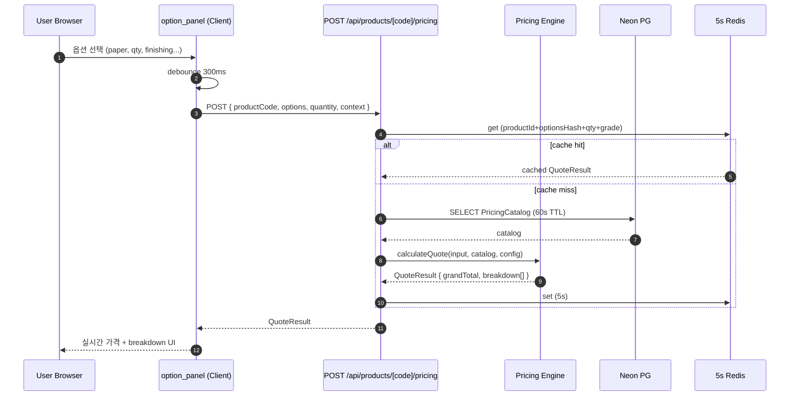
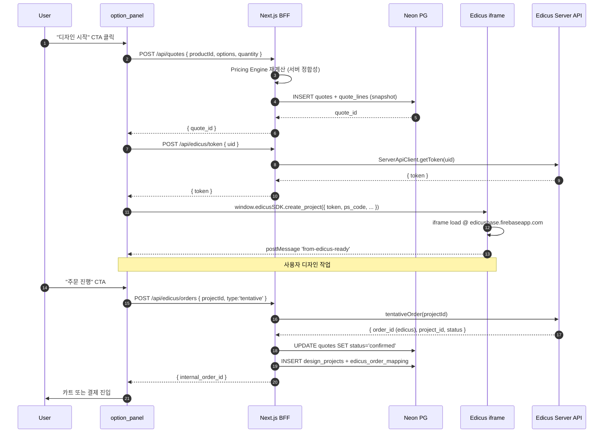
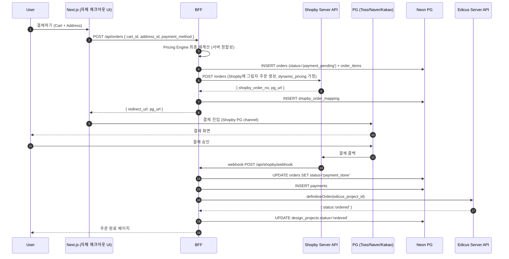
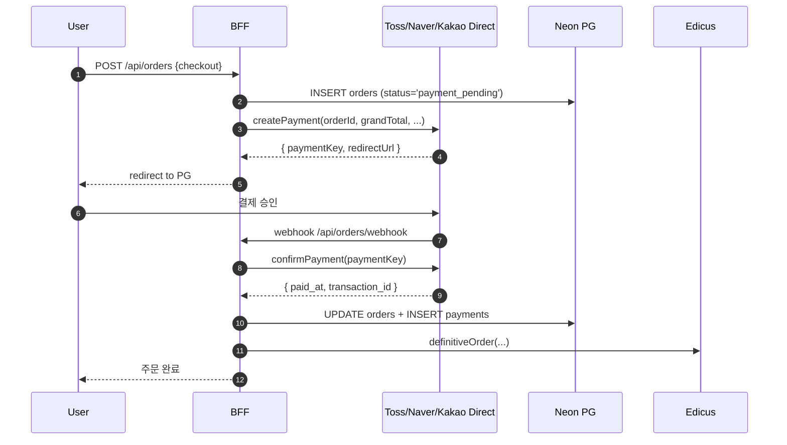
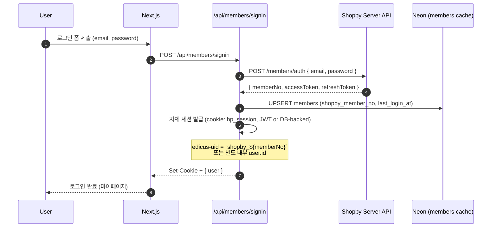
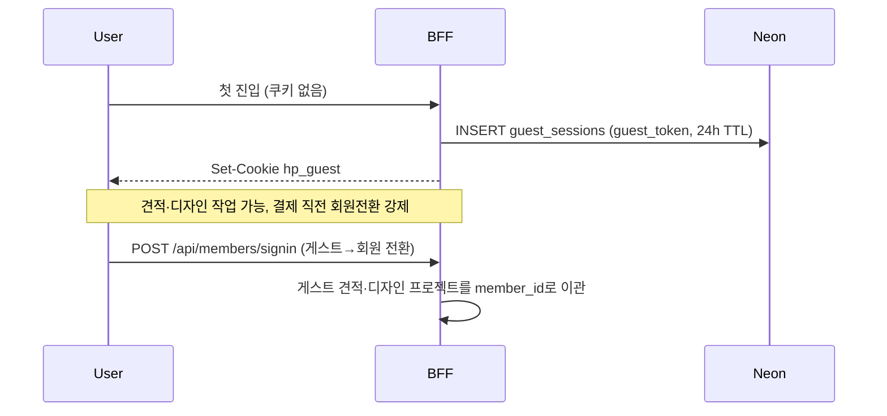

# BFF Integration — Shopby / Edicus / Neon PG 통합 인터페이스 v0.1

- 상태: Draft (O-001 부분 잠정 답 포함)
- 작성일: 2026-05-27
- 작성자: pq-architect
- 관련: ADR-002 (Edicus), ADR-003 (데이터 레이어), pricing-engine.md, domain-model.md
- 산출 경로: `_workspace/print-quote/03_architecture/builder-engine/bff-integration.md`

자체 Next.js 15 BFF가 3개 외부/내부 시스템(Shopby Server API / Edicus SDK·외부 백엔드 / Neon PG)을 어떻게 결합하는지, 책임 경계·자격증명·데이터 흐름·시퀀스를 정의한다. 옵션 C 채택(D-004) 전제.

---

## 0. BFF 단일 진입 원칙

| 원칙 | 설명 |
|---|---|
| 단일 진입점 | 브라우저는 외부 API(Shopby/Edicus/Firebase) **직접 호출 금지**. 모든 호출은 자체 Next.js Route Handler 경유 |
| 자격증명 차폐 | `EDICUS_API_KEY`, `SHOPBY_SERVER_KEY`, PG secret 등은 **서버 전용 env**. `NEXT_PUBLIC_*`은 비기밀 식별자만 |
| Zod 검증 | 모든 API 입출력 단에 Zod 스키마. edicus.man의 기존 패턴 그대로 (`src/app/api/edicus/*/route.ts`) |
| Tracing | 외부 호출 모두 `traceId` 헤더 부여, 응답을 audit_log에 기록 |
| Rate Limit | 외부 호출 retry는 지수 backoff 3회. 5분 누적 100건 이상 시 circuit break |

---

## 1. 책임 경계 매트릭스 (단일 표)

**잠정 답(O-001):** Shopby = "회원 인증 + 주문 결제 헤드리스 채널" 한정. 카탈로그·가격·옵션·견적·디자인·생산은 자체 소유. ADR-003 가설 B + 가설 A4(Shopby 회원) 결합형.

| 도메인 | 마스터 시스템 | 보조/캐시 | BFF 책임 |
|---|---|---|---|
| 페이지·블록·위젯 (Builder) | **Neon PG** | — | CRUD, revisions |
| 상품 카탈로그 (Product/Category/Spec) | **Neon PG** | Shopby 그림자 상품(주문 push용 최소) | 양방향 동기화 (Neon→Shopby 일방향이 기본) |
| 가격표·옵션 가산·할증·할인 | **Neon PG** | — | Pricing Engine 입력 자료 |
| 견적 (Quote/QuoteLine) | **Neon PG** | — | calculateQuote(), 24h 만료 |
| 카트 | **Neon PG** | — | 자체 — Shopby Cart 미사용 |
| 회원 (인증·세션·CI/DI·휴면) | **Shopby Server API** (잠정) | Neon `members` 캐시 + `auth_provider='shopby'` | SSO 토큰, 세션 브리지 |
| 게스트 견적 세션 | **Neon PG** | — | `guest_token` 24h TTL |
| 주문 (Order/OrderItem/Status) | **Neon PG** (1차 소유) + Shopby Order (결제 정산) | `shopby_order_mapping` | 잠정·확정·취소 동기화 |
| 결제 (Payment) | Neon `payments` 기록 + **PG 직결**(토스/네이버페이/카카오페이) 또는 Shopby PG | webhook 수신 | PG 콜백 → status 갱신 |
| 쿠폰·적립금 | **Neon PG** | — | 자체 (O-001에서 Shopby 위임 가능 미정) |
| 배송 (shipping_info, 운송장) | **Neon PG** + 택배사 API | — | 배송 시작 시 운송장 발급 |
| 디자인 프로젝트 (template_uri, content_uri, 미리보기) | **Edicus 외부 백엔드** | Neon `design_projects` 매핑만 | Edicus Server API 프록시 |
| 디자인 자산 스토리지 | Firebase Storage (Edicus) | — | 우리는 URL만 보관 |
| 작업파일 검수 (artwork_files) | **Neon PG** | — | 자체 어드민 (As-Is `wpsyncsheets` 폐기) |
| 생산 공정 (production_jobs, job_stage_status) | **Neon PG** | — | 자체 어드민 |

**Shopby 위임 도메인 수:** 2개 (회원 인증, 주문/결제). 나머지 14개 도메인은 자체 (Neon + BFF).

---

## 2. 환경변수 분리

```bash
# .env.local — 서버 전용 (chmod 600, .gitignore 보호)

# Neon PG
DATABASE_URL=postgres://...

# Edicus SDK (ADR-002 D2)
EDICUS_API_KEY=...
EDICUS_API_HOST=https://api-dot-edicusbase.appspot.com
EDICUS_RESOURCE_HOST=https://resource.../

# Shopby Server API (mall_no=81683)
SHOPBY_SERVER_KEY=...
SHOPBY_MALL_NO=81683
SHOPBY_SERVER_HOST=https://server-api.e-ncp.com
SHOPBY_IP_WHITELIST=211.221.205.141  # 운영 IP

# Shopby Shop API (clientId, IP 제한 없음)
SHOPBY_SHOP_CLIENT_ID=...
SHOPBY_SHOP_HOST=https://shop-api.e-ncp.com

# PG (선택: Shopby 결제 미사용 시 직결)
TOSS_SECRET_KEY=...
NAVERPAY_PARTNER_ID=...
KAKAOPAY_ADMIN_KEY=...

# 인증·세션
NEXTAUTH_SECRET=...
SESSION_COOKIE_NAME=hp_session

# 공개 가능 (브라우저 노출 허용)
NEXT_PUBLIC_EDICUS_PARTNER=hunip
NEXT_PUBLIC_EDICUS_BASE_URL=https://edicusbase.firebaseapp.com
NEXT_PUBLIC_APP_URL=https://huniprinting.com
```

---

## 3. BFF Route Handler 구조

```
apps/web/src/app/api/
├── pages/                   # 빌더 CRUD (자체)
│   ├── route.ts             # GET list / POST create
│   ├── [slug]/route.ts      # GET / PUT publish
│   └── [id]/revisions/route.ts
├── products/                # 상품 카탈로그 (자체)
│   ├── route.ts             # GET search
│   └── [code]/
│       ├── route.ts
│       ├── pricing/route.ts  # POST QuoteInput → QuoteResult
│       └── options/route.ts
├── quotes/                  # 견적 (자체)
│   ├── route.ts             # POST create / GET list (member)
│   ├── [id]/route.ts        # GET / PATCH
│   └── [id]/convert/route.ts # → Order 변환
├── cart/                    # 카트 (자체)
│   ├── route.ts
│   └── items/[itemId]/route.ts
├── orders/                  # 주문 (자체 + Shopby push)
│   ├── route.ts             # POST tentative
│   ├── [id]/route.ts
│   ├── [id]/checkout/route.ts  # PG/Shopby 결제 진입
│   └── webhook/route.ts      # PG / Shopby 콜백 수신
├── members/                 # 회원 (Shopby 위임 + 캐시)
│   ├── signin/route.ts      # Shopby SSO 또는 자체 OAuth
│   ├── signup/route.ts
│   ├── me/route.ts          # 현 세션 정보
│   └── shopby-callback/route.ts
├── edicus/                  # ADR-002 D1 그대로 흡수
│   ├── token/route.ts        # ServerApiClient.getToken
│   ├── projects/route.ts     # getProjects / cloneProject
│   ├── projects/[id]/route.ts
│   ├── orders/route.ts       # tentativeOrder / definitiveOrder
│   ├── orders/[id]/cancel/route.ts
│   ├── preview/[projectId]/route.ts
│   ├── resources/route.ts    # ResourceApiClient.queryTemplates
│   └── webhook/route.ts      # (예약) Edicus webhook
├── admin/                   # 어드민 API
│   ├── pricing/route.ts
│   ├── widgets/route.ts
│   ├── production/route.ts
│   ├── artwork/[id]/review/route.ts
│   └── ...
└── shopby/                  # Shopby 프록시 (자격증명 차폐)
    ├── products/sync/route.ts   # Neon → Shopby 동기화
    └── webhook/route.ts          # 결제·주문 webhook
```

각 route는 다음 패턴:
```ts
// route.ts
import { z } from 'zod';
import { withAuth } from '@/lib/auth/middleware';
import { withRateLimit } from '@/lib/middleware/rate-limit';
import { withTraceId } from '@/lib/middleware/trace';

const BodySchema = z.object({ ... });

export const POST = withTraceId(withRateLimit(withAuth(async (req) => {
  const body = BodySchema.parse(await req.json());
  // ... business logic
  return NextResponse.json(result);
})));
```

---

## 4. Shopby Server API 위임 영역 (잠정)

Sa_malls.json 14 메타 카테고리(`SHOPBY_FINDINGS.md`)와 95+ endpoint(`Sa_categories.json`)에서 **자체와 Shopby의 책임 분리**.

### 4.1 위임 (Shopby 마스터)

| 영역 | Shopby 엔드포인트 | 사유 |
|---|---|---|
| 회원 가입/탈퇴 | `POST /members`, `DELETE /members/{memberNo}` | 한국 커머스 표준 (CI/DI/이용약관/휴면) — 자체 구현 시 법적 리스크↑ |
| 회원 로그인 (SSO) | `POST /members/auth` | 토큰 발급 |
| 본인인증 (CI/DI) | `POST /authentications/ci-di` | 한국 표준 |
| 휴면계정 분리/복원 | `POST /members/{memberNo}/dormant` | 1년 미접속 자동 분리 |
| 이용약관 동의 이력 | `GET /agreements/history/{memberNo}` | 법적 보관 |
| 주문 결제 진입 | Shopby PG channel via `POST /orders` | 한국 PG 다중(토스/네페/카페/심플페이) 통합 |
| 정산 (B2B 세금계산서) | `GET /settlements` | 한국 세무 표준 |

### 4.2 활용 (Shopby 부분 사용)

| 영역 | 엔드포인트 | 자체 사용 방식 |
|---|---|---|
| 비인증 상품 진열 검색 | `/products/search` (Shop API) | 네이버 쇼핑/SEO 호환 백오피스 동기화용 |
| 네이버 쇼핑 설정 | `/products/configuration/naver-shopping` | 외부 채널 노출 메타 |

### 4.3 미사용 (자체 우선)

- `/products/extraInfo`, `/products/options`, `/products/custom-properties` — Q-Master-5(인쇄 메타 표현력)가 Shopby에서 표현 불가 가정. Neon이 마스터.
- `/display/sections`, `/display/banners` — 자체 빌더가 표현
- `/categories` Shopby 트리 — 자체 `product_categories` 마스터
- `/free-gift-condition/*`, `/additional-discounts/*` — 자체 SurchargeRule/DiscountPolicy

---

## 5. Edicus SDK 위임 영역 (ADR-002 D1 + D4)

`docs/edicus.man/src/lib/edicus/`의 SDK 클라이언트·API 프록시를 **as-is 흡수**.

### 5.1 위임 영역

| 영역 | Edicus 인터페이스 | 위임 사유 |
|---|---|---|
| 디자인 캔버스 편집 | iframe @ `edicusbase.firebaseapp.com` | 외부 SDK 블랙박스, 자체 재구현 범위 외 |
| 미리보기 렌더링 | `getPreviewUrls(projectId)` | 외부 자산 스토리지 의존 |
| 인쇄 파일 생성 | Edicus 외부 백엔드 (PDF 렌더) | 외부 인쇄 파이프라인 |
| 템플릿 카탈로그 | `ResourceApiClient.queryTemplates` | 외부 리소스 마스터 |
| VDP 가변 데이터 변환 | `post_to_editor('set-variable-data', varMap)` | iframe 내부 처리 |
| 17가지 편집 모드 호출 | `HuniEditorSDK` 메서드 | edicus.man 그대로 |

### 5.2 자체 보강

| 영역 | 자체 처리 |
|---|---|
| `edicus-uid` 발급 | BFF가 자체 세션 user_id → `edicus-uid` 변환 (게스트는 `guest_<uuid>`) |
| Project ↔ Order 상태 동기화 | `edicus_order_mapping` 테이블 (ADR-002 D7) |
| 장애 fallback (O-002) | iframe 로드 실패 시 "디자인 파일 직접 업로드" 대체 흐름 |
| Webhook 대체 polling | 5분 주기 보정 잡 (ADR-002 D8) |

---

## 6. Neon PG 자체 마스터 영역

자체 빌더가 통제하는 도메인. domain-model.md §1·2·5의 엔티티가 여기 거주.

| 도메인 | 핵심 테이블 | 비고 |
|---|---|---|
| Builder | pages, sections, columns, blocks, widgets, templates, design_tokens, page_revisions | 신규 |
| Quote | products, product_categories, specs, options, price_tables, surcharges, surcharge_rules, discount_policies, quotes, quote_lines | _baseline 활용 + 보강 |
| Member-Cart | members (캐시), guest_sessions, addresses, carts, cart_items | Shopby 회원과 매핑 |
| Order | orders, order_items, order_status_history, payments, shipping_info | 17-state |
| Design Mapping | design_projects, edicus_order_mapping, shopby_order_mapping | 외부 ID 매핑 |
| Production | production_jobs, artwork_files, job_stage_status, qc_checkpoints, ... | _baseline 그대로 |

상세는 `schema.sql` 참조.

---

## 7. 데이터 흐름 시퀀스 다이어그램

### 7.1 상품 카탈로그 조회



### 7.2 옵션 선택 + 실시간 가격 산출



### 7.3 견적 저장 → 디자인 에디터 진입



### 7.4 결제 → 확정주문 (Shopby 위임 시)



### 7.5 결제 → 확정주문 (PG 직결 — Shopby 미사용 분기)

Shopby가 동적 단가 push를 정책상 거부할 경우 (Q1 미해결 시 fallback).



→ O-001 확정 시 이 두 경로 중 하나 선택.

### 7.6 인증 흐름 (Shopby SSO + 자체 세션)



게스트 견적:


---

## 8. 데이터 동기화 정책

### 8.1 Neon ↔ Shopby 상품 그림자 동기화

Shopby 주문 push가 필요한 경우(O-001 결정), Neon에 등록된 상품을 Shopby에 "그림자 상품"으로 1방향 동기화.

| 트리거 | 동작 | 주기 |
|---|---|---|
| 신규 상품 등록 (admin) | BFF가 Shopby `POST /products`로 최소 정보 생성 (`name`, `price=0` placeholder) | 즉시 |
| 가격 변경 | 그림자 상품 가격은 의도적으로 유지 (가격은 주문 시 dynamic_pricing) | — |
| 상품 비활성화 | Shopby `PATCH /products/{no}/sale` | 즉시 |

저장: `products.shopby_product_no` 매핑.

### 8.2 Edicus ↔ Order 상태 보정 잡 (ADR-002 D8)

```
Cron: */5 * * * *
1. SELECT design_projects WHERE updated_at < NOW() - 5min
2. for each: GET Edicus /projects/{project_id}
3. If Edicus.status != Neon.status → reconcile (Edicus가 진실)
4. 운영 알림 (Sentry / Slack)
```

### 8.3 webhook 우선, polling fallback

- Shopby webhook: 결제 완료, 배송 시작, 취소
- Edicus webhook: (현재 미지원 — Q1 검증 필요)
- PG 직결 webhook: 결제 결과
- webhook 손실 시: polling 5분 주기 보정

---

## 9. 인증·세션 토큰 흐름

| 토큰 | 발급 | 저장 | 만료 | 용도 |
|---|---|---|---|---|
| `hp_session` (자체) | BFF 로그인 시 | httpOnly Secure cookie | 24h 슬라이딩 | 자체 API 인증 |
| `shopby_access_token` | Shopby `POST /members/auth` | BFF 메모리/Redis (브라우저 노출 X) | Shopby 정책 (1h) | Shopby API 호출 |
| `shopby_refresh_token` | 동일 | Neon `members.shopby_refresh_token_encrypted` | Shopby 정책 (30d) | access 토큰 재발급 |
| `edicus_token` | BFF `ServerApiClient.getToken(uid)` | iframe URL 파라미터 (단발) | 단발성 | iframe SSO |
| `hp_guest` | 첫 진입 | cookie | 24h | 게스트 견적 |

토큰 갱신 흐름:
- `hp_session` 만료 시 자동 로그아웃
- `shopby_access_token` 만료 시 BFF가 refresh로 재발급 (사용자 무지각)
- `edicus_token`은 매 iframe 진입 시 새로 발급

---

## 10. 에러·장애 처리 매트릭스

| 장애 | 영향 도메인 | 사용자 경험 | 시스템 동작 |
|---|---|---|---|
| Shopby API 5xx | 회원·주문 | 로그인/결제 일시 불가 안내 | 3회 retry, 5분 circuit break |
| Edicus API 5xx | 디자인 | "에디터 점검" 안내 + 파일 업로드 대체 | ADR-002 D9 |
| Edicus iframe 로드 실패 | 디자인 | onError 콜백 → 대체 흐름 | huni-editor-sdk.ts |
| Neon PG 장애 | 전 영역 | 503 | 5분 read-replica fallback (Neon 다중 region) |
| PG 결제 실패 | 결제 | 결제 실패 화면 + 재시도 | orders.status 유지 (payment_pending) |
| webhook 손실 | 동기화 | (지연) | polling 보정 잡 |
| 가격표 변경 직후 견적 산출 | Quote | 새 가격 적용 | cache invalidate `revalidateTag('product:id')` |

---

## 11. API 응답 표준 형식

```ts
// 성공
{
  "data": <ResultPayload>,
  "meta": {
    "traceId": "uuid",
    "timestamp": "2026-05-27T10:00:00Z"
  }
}

// 에러
{
  "error": {
    "code": "PRICING_QTY_EXCEEDS_MAX",   // 도메인-카테고리-사유
    "message": "최대 수량을 초과했습니다",  // 사용자 표시용 (i18n)
    "field": "quantity",                  // 필드 단위 에러일 때
    "detail": { ... }                      // 디버깅용 (개발 환경에서만 노출)
  },
  "meta": { "traceId": "...", "timestamp": "..." }
}
```

에러 코드 prefix:
- `AUTH_*` — 인증
- `PRICING_*` — 가격 엔진
- `QUOTE_*` — 견적
- `ORDER_*` — 주문
- `EDICUS_*` — Edicus 통합
- `SHOPBY_*` — Shopby 통합
- `PG_*` — 결제
- `VALIDATION_*` — Zod 검증

---

## 12. Open Questions

| ID | 질문 | 영향 |
|---|---|---|
| O-BFF-1 | Shopby에 동적 단가 push 허용 여부 (ADR-003 Q1) | 7.4 vs 7.5 시퀀스 분기 |
| O-BFF-2 | Edicus webhook 존재 여부 | 8.3 polling 대체 가능성 |
| O-BFF-3 | Shopby Refresh 토큰 저장 위치 (Neon DB vs Redis) | 9 보안 |
| O-BFF-4 | 결제 PG 다중 사용 시 라우팅 정책 (사용자 선택 vs 추천) | 7.4 |
| O-BFF-5 | 어드민 UI 인증 (Shopby 위탁 vs 자체 RBAC) | 4.3 미사용 영역 |

---

REQ coverage: REQ-BFF-001~012  
References: ADR-002 §D1~D9, ADR-003 §A1~A7, pricing-engine.md, domain-model.md §3, decisions D-004, shopby/SHOPBY_FINDINGS.md, edicus-analysis/02_domain-model.md §E.3, docs/edicus.man/src/lib/edicus/*, docs/edicus.man/src/app/api/edicus/**
