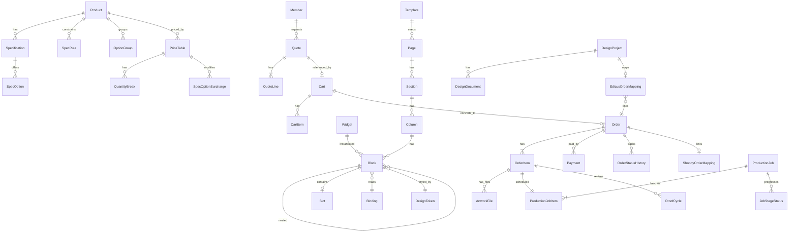

# Builder Engine — Domain Model v0.1 (1차 초안)

- 상태: Draft (D-004 채택 후 1차 골격)
- 작성일: 2026-05-27
- 작성자: pq-architect
- 관련: ADR-001 / ADR-002 / ADR-003, decisions D-001~D-004, Open O-001~O-005
- 산출 경로: `_workspace/print-quote/03_architecture/builder-engine/`

이 문서는 자체 웹빌더 100% (옵션 C) 채택에 따라, To-Be 시스템이 다루는 전체 엔티티 집합을 단일 페이지에 정렬한 1차 도메인 모델이다. 5개 도메인으로 분할: **Builder / Quote / Member-Order / Design-Asset / Production**. 각 엔티티에는 출처 표기 — `[edicus.man]` / `[_baseline]` / `[As-Is/BS]` / `[신규]`.

---

## 0. 도메인 지도 (10초 요약)

```
Builder        (페이지·블록·위젯)   ─ 신규 핵심 (Elementor+TM EPO 대체)
   │
   ├─ Quote          (견적·옵션·가격) ─ _baseline 6+6=12 테이블 보강
   │     │
   │     ▼
   ├─ Member-Order   (회원·주문·결제) ─ Shopby BFF 부분 위임 (O-001)
   │     │
   │     ▼
   ├─ Design-Asset   (디자인 프로젝트)─ edicus.man 흡수 + Edicus SDK 위임
   │     │
   │     ▼
   └─ Production     (공정·작업파일)  ─ _baseline 생산 도메인 활용
```

전체 엔티티 개수: **48** (Builder 9 + Quote 11 + Member-Order 10 + Design-Asset 7 + Production 11). 기존 `_baseline` 38테이블 대비 +10이 빌더 도메인 신규.

---

## 1. Builder Domain — 페이지·블록·위젯 [신규 핵심]

자체 빌더의 캔버스/렌더 트리 모델. As-Is의 `Elementor + Woodmart + JetTabs + Revslider`를 대체. 옵션 폼 빌더(TM EPO builder mode)와 동일 평면에서 다룬다.

### 1.1 `Page` [신규]
| 필드 | 타입 | 설명 |
|---|---|---|
| id | UUID | PK |
| slug | VARCHAR(128) | URL slug (`/{slug}`, 예: `home`, `card-general`) |
| title | VARCHAR(255) | 페이지 제목 |
| page_type | VARCHAR(32) | `landing` / `product_detail` / `category` / `editorial` / `legal` |
| status | VARCHAR(16) | `draft` / `published` / `archived` |
| version | INT | 발행 버전 (revisions 추적용) |
| layout_id | UUID? | 사용 중인 `Template`/`Layout` (선택) |
| seo_meta | JSONB | `{title, description, og_image, robots, ...}` |
| published_at | TIMESTAMPTZ? | |
| published_by | UUID? | → `User` |
| metadata | JSONB | 자유 키 (locale 등) |
| created_at / updated_at | TIMESTAMPTZ | |

관계: `Page ||--o{ Section`. `Page ||--o{ PageRevision`(history). 출처: 신규. As-Is의 WP page CPT 대체.

### 1.2 `Section` [신규]
페이지 내 수직 슬라이스 (Elementor의 `section`). 컨테이너 너비/배경/패딩의 1차 단위.

| 필드 | 타입 | 설명 |
|---|---|---|
| id | UUID | PK |
| page_id | UUID | → `Page` |
| sort_order | INT | 페이지 내 순서 |
| settings | JSONB | `{width, padding, background, gap, ...}` |
| visibility | JSONB | `{device:['desktop','tablet','mobile'], roles:['guest','member']}` |
| created_at / updated_at | TIMESTAMPTZ | |

관계: `Section ||--o{ Column`.

### 1.3 `Column` [신규]
Section 내 수평 칸. 12 grid system 기반.

| 필드 | 타입 | 설명 |
|---|---|---|
| id | UUID | PK |
| section_id | UUID | → `Section` |
| sort_order | INT | |
| span | SMALLINT | 1~12 (grid 단위) |
| span_tablet | SMALLINT? | |
| span_mobile | SMALLINT? | |
| settings | JSONB | `{align, padding, background}` |

관계: `Column ||--o{ Block`.

### 1.4 `Block` [신규] (`tree node` — 핵심 단위)
빌더의 가장 중요한 엔티티. 모든 위젯 인스턴스가 Block. 트리 구조(`parent_block_id`)로 nested column / inner section을 표현.

| 필드 | 타입 | 설명 |
|---|---|---|
| id | UUID | PK |
| column_id | UUID? | → `Column` (top-level Block) |
| parent_block_id | UUID? | → `Block` (nested case, e.g. Tabs 안의 Tab) |
| widget_id | VARCHAR(64) | `Widget.code` 참조 (예: `text`, `image`, `option_panel`) |
| sort_order | INT | |
| props | JSONB | 위젯별 prop schema (block-schema.md) |
| bindings | JSONB | 데이터 바인딩 표현식 맵 `{prop:'{{product.name}}'}` |
| style | JSONB | `{margin, color, typography_token, custom_css}` |
| condition | JSONB? | 조건부 표시 (`{when: 'qty >= 500'}`) |
| version | INT | block schema 버전 (마이그레이션용) |
| created_at / updated_at | TIMESTAMPTZ | |

관계: `Widget ||--o{ Block`, `Block ||--o{ Block`(self).

### 1.5 `Widget` [신규] (위젯 카탈로그 마스터)
| 필드 | 타입 | 설명 |
|---|---|---|
| code | VARCHAR(64) PK | `text`, `image`, `button`, `product_gallery`, `option_panel`, ... |
| display_name | VARCHAR(128) | |
| category | VARCHAR(32) | `layout` / `content` / `commerce` / `print_quote` / `form` |
| icon | VARCHAR(255) | 어드민 사이드바 아이콘 |
| prop_schema | JSONB | Zod/JSONSchema (block-schema.md) |
| default_props | JSONB | 신규 인스턴스 기본값 |
| component | VARCHAR(128) | React 컴포넌트 모듈 경로 (`@/widgets/Text`) |
| ssr_mode | VARCHAR(16) | `rsc` / `client` / `hybrid` |
| is_active | BOOLEAN | |
| version | VARCHAR(16) | |

코드 기반(파일시스템에서 등록), 일부는 DB로 ingest. 출처: 신규 (Elementor pro/JetTabs/Revslider 위젯을 자체 카탈로그로 재구현). 상세는 widget-coverage-matrix.md.

### 1.6 `Template` [신규] (페이지 또는 섹션 템플릿)
재사용 가능한 페이지/섹션 청사진. `Page.layout_id` 또는 사용자가 "이 템플릿 적용" 액션 시 복제 시드.

| 필드 | 타입 | 설명 |
|---|---|---|
| id | UUID | PK |
| code | VARCHAR(64) UNIQUE | |
| scope | VARCHAR(16) | `page` / `section` / `block` |
| title | VARCHAR(255) | |
| category | VARCHAR(32) | |
| tree | JSONB | 직렬화된 Section/Column/Block 트리 |
| thumbnail_url | VARCHAR(512) | |
| is_global | BOOLEAN | 전역 vs 상품 전용 |
| created_at / updated_at | TIMESTAMPTZ | |

### 1.7 `Slot` [신규]
페이지 트리에 정의되는 외부 컴포넌트 삽입 지점. Section/Block과 달리 빌더가 props만 알고, 실제 렌더는 별도 엔진(Edicus iframe, OptionPanel 위젯, BFF-driven product detail 등)이 채운다.

| 필드 | 타입 | 설명 |
|---|---|---|
| id | UUID | PK |
| block_id | UUID | → `Block` (Slot 위젯의 인스턴스) |
| slot_kind | VARCHAR(32) | `edicus_editor` / `option_panel` / `quote_preview` / `member_widget` |
| config | JSONB | slot별 설정 (예: `{product_code, editor_mode}`) |

### 1.8 `Binding` [신규] (데이터 바인딩 표현식 카탈로그)
재사용성 높은 표현식을 named binding으로 관리. Block.bindings의 평가 컨텍스트.

| 필드 | 타입 | 설명 |
|---|---|---|
| id | UUID | PK |
| name | VARCHAR(64) UNIQUE | `current_product`, `quote_total`, `member_grade` |
| source | VARCHAR(32) | `product` / `quote` / `member` / `cms` / `system` |
| expression | TEXT | `product.name`, `quote.grand_total`, ... |
| return_type | VARCHAR(32) | `string` / `number` / `object` / `list` |

블록의 props 내부에서 `{{name}}` 또는 `{{name.field}}` 문법으로 사용 (block-schema.md §데이터 바인딩).

### 1.9 `DesignToken` [edicus.man + 신규]
출처: `docs/edicus.man/src/lib/edicus/custom-css.ts` (`CssPreset`, Huni v6.0 토큰 `#5538B6`) + Tailwind 토큰. As-Is의 Woodmart 토큰을 대체.

| 필드 | 타입 | 설명 |
|---|---|---|
| id | UUID | PK |
| token_key | VARCHAR(128) UNIQUE | `--huni-primary`, `--huni-radius-md`, `font.body` |
| token_type | VARCHAR(16) | `color` / `spacing` / `typography` / `radius` / `shadow` / `motion` |
| value | TEXT | `#5538B6`, `0.5rem`, `Noto Sans KR` |
| theme | VARCHAR(32) | `default` / `dark` / `redprinting` |
| metadata | JSONB | `{description, deprecated}` |

`CssPreset` (`docs/edicus.man/src/lib/edicus/custom-css.ts:7-13`)의 token 형태를 DB로 끌어와 어드민 편집 가능. iframe 디자인에는 여전히 `private_css` 파라미터로 주입.

---

## 2. Quote Domain — 견적·옵션·가격 [_baseline 보강]

`_baseline` Product (6) + Pricing (6) 테이블을 1:1 활용하고, **빌더 위젯과의 바인딩**과 **잠정 견적 세션**을 추가한다.

### 2.1 `Product` [_baseline:products + 보강]
필드: 베이스라인 `products` 16컬럼 그대로. 확장 컬럼 추가:

| 추가 필드 | 타입 | 설명 |
|---|---|---|
| editor_mode | VARCHAR(16) | `iframe` / `passive` / `lite` / `upload_only` (Edicus 모드 결정 — ADR-002 D4) |
| ps_code | VARCHAR(64) | Edicus `ps_code` (Edicus 상품 코드, `EdicusProduct.ps_code`) |
| shopby_product_no | VARCHAR(64)? | Shopby 그림자 상품 매핑 (O-001 잠정) |
| widget_page_id | UUID? | → `Page` (상품 상세 페이지 빌더 산출물) |

관계: `Product ||--|| WidgetConfig`, `Product ||--|| ProductionSpecs`, `Product ||--o{ PriceTable`.

### 2.2 `Category` [_baseline:product_categories]
3-tier self-join. 출처: `_baseline/07_integrated_schema.sql:116`. As-Is buysangsang의 65개 카테고리(`A2_findings.md`)를 이 모델로 매핑 — depth=1 (10x 코드), depth=2 (10xx), depth=3 (1xxxxx).

### 2.3 `Specification` [_baseline:product_specifications]
상품별 사양 정의. 출처: `_baseline:product_specifications`. As-Is의 TM EPO `tm_meta_cpf` 필드 정의에 1:1 대응.

### 2.4 `SpecOption` [_baseline:product_spec_options]
사양의 선택지. `extra_cost_modifier NUMERIC(6,4)` 보존. `is_default` UNIQUE per spec 유지.

### 2.5 `SpecRule` [_baseline:product_spec_rules]
의존성 룰: `enable` / `disable` / `require`. As-Is TM EPO의 Conditional Fields와 동일 기능.

### 2.6 `OptionGroup` [신규]
복수 spec을 묶어 위젯 한 단계로 노출. 예: `사이즈+사각/원형` 묶음. 빌더 위젯 `option_panel`이 이 단위로 렌더.

| 필드 | 타입 | 설명 |
|---|---|---|
| id | UUID | PK |
| product_id | UUID | → `Product` |
| code | VARCHAR(64) | |
| display_name | VARCHAR(128) | |
| spec_ids | UUID[] | 묶인 `Specification` 배열 (순서 유지) |
| layout | VARCHAR(16) | `inline` / `card_grid` / `swatch` |

### 2.7 `PriceTable` [_baseline:price_tables]
시계열 (`valid_from/valid_to`), `print_method` (`offset|digital|wide_format`), 다중 표 운영.

### 2.8 `QuantityBreak` [_baseline:quantity_price_breaks]
수량 구간별 단가. As-Is `Tiered Price Table for WooCommerce`를 직접 표현. `qty_to=NULL` → 무한대 구간.

### 2.9 `SurchargeRule` + `DiscountPolicy` [_baseline:surcharge_rules + discount_policies]
조건부 할증·할인. JSONB condition_value로 다형성.

### 2.10 `Quote` [_baseline:quotes + 보강]
견적 단위. 24h 만료, `spec_snapshot` + `price_breakdown` JSONB 스냅샷.

추가 필드:
| 추가 필드 | 타입 | 설명 |
|---|---|---|
| session_id | VARCHAR(64) | 게스트 견적 세션 (회원 전환 시 user_id 채워짐) |
| widget_state | JSONB | 위젯 입력 원본 (재진입 시 복원) |
| edicus_project_id | VARCHAR(64)? | → `DesignProject` (디자인 진입 후 연결) |

### 2.11 `QuoteLine` [신규] (Quote 다건화)
현재 `_baseline` `quotes`는 단일 상품 견적. 카트(여러 견적 묶음)를 위한 라인 분리.

| 필드 | 타입 | 설명 |
|---|---|---|
| id | UUID | PK |
| quote_id | UUID | → `Quote` |
| product_id | UUID | → `Product` |
| sort_order | INT | |
| spec_snapshot | JSONB | |
| quantity | INT | |
| price_breakdown | JSONB | |
| line_total | NUMERIC(12,2) | |

→ `Quote` 헤더는 합계만, `QuoteLine`이 개별 사양. `order_items`로 변환 시 1:1 매핑.

---

## 3. Member-Order Domain — 회원·주문·결제

D-004에 따라 회원·결제는 Shopby Server API에 부분 위임 (O-001 미해결). 잠정안: **회원 마스터 Shopby (가설 A4)**, **자체 인증 옵션 보존 (게스트 견적 진행)**.

### 3.1 `Member` [_baseline:users + Shopby 매핑]
출처: `_baseline:users` (11컬럼, 17-state). 확장:

| 추가 필드 | 타입 | 설명 |
|---|---|---|
| shopby_member_no | VARCHAR(64)? | Shopby 회원 번호 (O-001) |
| auth_provider | VARCHAR(16) | `local` / `shopby` / `naver` / `kakao` / `guest` |
| ci | VARCHAR(88)? | 본인인증 식별자 (한국 표준) |
| edicus_uid | VARCHAR(64) | Edicus 호출의 `edicus-uid` (`docs/edicus.man/src/lib/edicus/server-api.ts:42-48`) |

기존 `users.guest_token` 유지 (24h TTL 게스트 세션).

### 3.2 `Address` [신규]
| 필드 | 타입 | 설명 |
|---|---|---|
| id | UUID | PK |
| user_id | UUID | → `Member` |
| label | VARCHAR(64) | "회사", "집" |
| recipient_name / phone | VARCHAR | |
| postal_code / address_road / address_detail | VARCHAR | |
| is_default | BOOLEAN | |

### 3.3 `Cart` + `CartItem` [신규]
카트 = "결제 직전의 Quote 묶음". 옵션 C에서는 Shopby Cart 대신 자체 카트 (Aurora 미사용).

| Cart 필드 | | |
|---|---|---|
| id | UUID | PK |
| user_id | UUID? | (게스트는 session_id) |
| session_id | VARCHAR(64) | |
| created_at / updated_at | | |

| CartItem 필드 | | |
|---|---|---|
| id | UUID | PK |
| cart_id | UUID | → `Cart` |
| quote_id | UUID | → `Quote` (확정된 견적 1건) |
| design_project_id | VARCHAR(64)? | Edicus 디자인 매핑 |
| quantity | INT | |
| sort_order | INT | |

### 3.4 `Order` [_baseline:orders 17-state + ADR-002 매핑]
출처: `_baseline:orders` 22컬럼 전체. ADR-002 D5에 따라 `Edicus Project.status`와 이중 상태머신 운영.

추가 필드:
| 추가 필드 | 타입 | 설명 |
|---|---|---|
| shopby_order_no | VARCHAR(64)? | Shopby 주문 매핑 (ADR-003 A7) |
| edicus_order_id | VARCHAR(64)? | (ADR-002 D7) |
| payment_provider | VARCHAR(32) | `toss` / `naverpay` / `kakaopay` / `shopby_pg` |

### 3.5 `OrderItem` [_baseline:order_items]
변경 없음. `spec_snapshot`/`price_snapshot` JSONB로 가격 산정 시점 동결.

### 3.6 `OrderStatusHistory` [_baseline:order_status_history]
변경 없음 — 17-state 이력.

### 3.7 `Payment` [_baseline:payments + 확장]
한국 PG 다양성 반영. `pg_provider` enum 확대: `toss` / `kcp` / `naverpay` / `kakaopay` / `shopby_pg`.

### 3.8 `Coupon` + `CouponUsage` [신규]
한국 커머스 필수. Shopby 위임 가능성 있음 (O-001) — 자체 마스터일 경우.

| 필드 | 타입 | 설명 |
|---|---|---|
| Coupon.id | UUID | PK |
| code | VARCHAR(32) UNIQUE | |
| discount_type | VARCHAR(16) | `percentage` / `fixed` |
| discount_value | NUMERIC | |
| min_order_amount | NUMERIC | |
| valid_from / valid_to | TIMESTAMPTZ | |
| usage_limit | INT? | |
| applicable_categories | UUID[]? | |

### 3.9 `LoyaltyPoint` [신규] (적립금)
| 필드 | 타입 | 설명 |
|---|---|---|
| user_id | UUID | |
| balance | NUMERIC(12,2) | |
| (별도 transactions 테이블) | | |

### 3.10 `ShippingMethod` + `shipping_info` [_baseline 보강]
- `shipping_info` (`_baseline:shipping_info`): 변경 없음
- `ShippingMethod` [신규]: 배송 옵션 마스터 (`standard`, `quick`, `pickup`)

### Shopby vs 자체 경계 (잠정 — O-001)

| 도메인 | 가설 | 비고 |
|---|---|---|
| Member (인증, CI, 휴면) | Shopby (Server API headless) | ADR-003 가설 A4. 자체 인증은 게스트 견적용으로만 |
| Cart | 자체 (옵션 C 결정) | Shopby Cart 미사용 — 카트가 Quote+QuoteLine과 동질이므로 분리 운영 의미 적음 |
| Order, Payment | Shopby BFF or 직접 PG | Q1(동적 단가 push) 검증 필요. 잠정: 자체 PG 직결 + Shopby 미사용 옵션도 보존 |
| Coupon, LoyaltyPoint | 미정 | Shopby 위임 vs 자체 — pq-pm 결정 (O-001) |
| 배송 추적 | 자체 + 택배 API | shipping_info 자체 |

---

## 4. Design-Asset Domain — 디자인 프로젝트 [edicus.man 흡수]

ADR-002에 따라 외부 Edicus SDK 유지. 자체 영속 계층은 매핑 테이블 + 메타만 보유.

### 4.1 `DesignProject` [edicus.man:EdicusProject 흡수]
출처: `docs/edicus.man/src/types/edicus.ts:295-300`.

| 필드 | 타입 | 설명 |
|---|---|---|
| id | UUID | 내부 PK |
| edicus_project_id | VARCHAR(64) UNIQUE | Edicus 발급 (외부 ID) |
| user_id | UUID | → `Member` |
| product_id | UUID | → `Product` |
| status | VARCHAR(16) | `editing` / `ordering` / `ordered` (FROZEN 상태머신, `edicus.ts:97`) |
| title | VARCHAR(255) | |
| template_uri | VARCHAR(512)? | Edicus 외부 스토리지 |
| content_uri | VARCHAR(512)? | |
| preview_urls | TEXT[] | `EdicusContext.preview_path` 산출 |
| created_at / updated_at | TIMESTAMPTZ | |

### 4.2 `DesignDocument` [신규]
프로젝트의 페이지/시트 (다면 인쇄물 — 카드, 책자 등).

| 필드 | 타입 | 설명 |
|---|---|---|
| id | UUID | PK |
| project_id | UUID | → `DesignProject` |
| page_index | INT | (책자: 1~N, 명함: 1~2 양면) |
| canvas_uri | VARCHAR(512) | Edicus 외부 본문 |
| thumbnail_url | VARCHAR(512) | |

### 4.3 `EditorTemplate` [edicus.man:EdicusTemplate]
출처: `edicus.ts:321-329`.

| 필드 | 타입 | 설명 |
|---|---|---|
| resource_id | VARCHAR(64) PK | Edicus Resource API |
| title | VARCHAR(255) | |
| ps_code | VARCHAR(64) | → `Product.ps_code` |
| template_uri | VARCHAR(512) | |
| category | VARCHAR(64) | |
| thumbnail_url | VARCHAR(512) | |

### 4.4 `EdicusOrderMapping` [ADR-002 A6, ADR-003 A6]
| 필드 | 타입 | 설명 |
|---|---|---|
| internal_order_id | UUID | → `Order` |
| edicus_order_id | VARCHAR(64) UNIQUE | |
| edicus_project_id | VARCHAR(64) | |
| synced_at | TIMESTAMPTZ | |

### 4.5 `ShopbyOrderMapping` [ADR-003 A7]
유사 구조: `internal_order_id` ↔ `shopby_order_no`. O-001 의존.

### 4.6 `VdpDataset` [edicus.man:VdpField 보강]
출처: `docs/edicus.man/src/components/editor/VdpEditor.tsx:15-26`. 가변 데이터 인쇄.

| 필드 | 타입 | 설명 |
|---|---|---|
| id | UUID | PK |
| project_id | UUID | → `DesignProject` |
| field_definitions | JSONB | `[{key, label, type:text|number|date, required, defaultValue}]` |
| rows | JSONB | varMap 배열 `[{name:"홍길동",...}]` |

### 4.7 `ProjectStatus` 매핑 [ADR-002 D5]
- `DesignProject.status='editing'` → `Order` 없음
- `DesignProject.status='ordering'` → `Order.status='draft' or 'quote_confirmed'`
- `DesignProject.status='ordered'` → `Order.status >= 'payment_done'`

---

## 5. Production Domain — 공정·작업파일 [_baseline 활용]

`_baseline` Production 10테이블을 거의 그대로 사용. 다만 As-Is `wpsyncsheets` Google Sheets 동기화 폐기 → 자체 어드민 흡수 (Q9 in ADR-003).

### 5.1 `ProductionJob` [_baseline:production_jobs]
변경 없음. gang printing 배치 단위.

### 5.2 `ProductionJobItem` [_baseline:production_job_items]
order_item → job N:M 묶음.

### 5.3 `JobStageStatus` [_baseline:job_stage_status]
6단계 (PREPRESS / PRINTING / FINISHING / CUTTING / PACKAGING / SHIPPING).

### 5.4 `ProductionStageType` [_baseline:production_stage_types]
6 stage master.

### 5.5 `EquipmentConfig` [_baseline:equipment_configs]

### 5.6 `ProductionSpec` [_baseline:production_specs]
DPI, bleed, accepted formats.

### 5.7 `ArtworkFile` [_baseline:artwork_files] (작업파일 + 검수)
4-state (`pending` / `reviewing` / `approved` / `rejected`). As-Is `WooCommerce File Approval` 9.9 대체.

이 4-state는 **검수(Approval) 차원**의 상태. 별도로 **파일 흐름(Flow) 차원**의 상세 상태 머신을 §5.7a `ArtworkFileStatus`에서 다룬다 (PDF p.1 `파일번호` 부속 상태머신, order-flow.md §1.3 출처).

### 5.7a `ArtworkFileStatus` [신규 — INC-007 해결]

**목적:** order-flow.md §1.3 "파일번호 단위 부속 상태 머신"을 도메인 모델에 명시. ArtworkFile.id 단위로 상품 타입별 흐름 상태를 추적하여 Order ↔ ArtworkFile 동기화 규칙(§5.7c)을 구현 가능하게 한다. `ProofCycle`(§5.11, 교정 사이클)과는 **별개 차원** — ProofCycle은 고객-운영 간 교정 협상의 횟수·결정 이력이고, ArtworkFileStatus는 단일 파일의 생산 진행 단계.

| 필드 | 타입 | 설명 |
|---|---|---|
| id | UUID | PK |
| artwork_file_id | UUID | → `ArtworkFile` (1:1) |
| product_type | VARCHAR(16) | `stock` / `upload` / `editor` — 흐름 분기 디스크리미네이터 |
| flow_status | VARCHAR(32) | 상품 타입별 enum (아래 §5.7b) |
| previous_status | VARCHAR(32)? | 직전 상태 (재업로드 후 복귀 추적용) |
| transitioned_at | TIMESTAMPTZ | 현재 상태 진입 시각 |
| transitioned_by | UUID? | → `Member` (관리자 수동 전이 시) |
| actor_role | VARCHAR(16) | `system` / `staff_order` / `staff_production` / `staff_packing` / `customer` |
| notes | TEXT? | 재업로드 사유 등 |
| created_at | TIMESTAMPTZ | |

전이 이력은 별도 `artwork_file_status_history` 테이블에 append-only 기록 (Order의 `order_status_history`와 동일 패턴).

### 5.7b `flow_status` enum — 상품 타입별 (order-flow.md §1.3)

| product_type | flow_status 값 | 전이 (order-flow.md §2.2) |
|---|---|---|
| `stock` (Case 1 — 재고 배송상품) | `상품준비중` → `포장완료` | 단순 2-state |
| `upload` (Case 2 — 파일업로드 상품) | `확인전` / `파일확인` / `재업로드요청` / `재업로드완료` / `다운로드완료` / `포장완료` | `확인전 → 파일확인 → 다운로드완료 → 포장완료`; 결함 시 `확인전 → 재업로드요청 → 재업로드완료 → 확인전` (복귀 루프) |
| `editor` (Case 3 — Edicus 편집기 상품) | `랜더링전` / `랜더링완료` / `수정요청` / `수정완료` / `다운로드완료` / `포장완료` | `랜더링전 → 랜더링완료 → 다운로드완료 → 포장완료`; 고객 수정 시 `랜더링완료 → 수정요청 → 수정완료 → 랜더링완료` (복귀 루프) |

상태 식별자는 한국어 그대로 enum 값으로 사용 (PDF 출처 어휘 보존). DB 컬럼은 `VARCHAR(32)` + CHECK 제약으로 구현.

### 5.7c Order ↔ ArtworkFile 동기화 규칙 (Guard) — order-flow.md §1.4

**불변식 (invariant):** 주문 `Order.status` 전이는 종속 ArtworkFile들의 `flow_status` 집계 결과에 의존한다.

| Order 전이 | 가드 조건 | 출처 |
|---|---|---|
| `Order.status = 'producing' → 'done'` | **해당 Order의 모든 OrderItem에 매핑된 ArtworkFile의 `flow_status = '포장완료'`** 일 때만 허용. 하나라도 아니면 전이 차단. | order-flow.md §1.4 + §2.1: "모든상품이 포장완료이면 제작완료" |
| `ArtworkFileStatus.flow_status → '다운로드완료'` | Order.status 가 `'producing'` 이상이어야 함 (생산팀 다운로드 시점) | order-flow.md §2.2 |
| `ArtworkFileStatus.flow_status → '포장완료'` | 1차포장 바코드 입력 트리거 — 시스템이 자동으로 §5.7c 첫째 규칙 평가 후 Order.status 전이 시도 | order-flow.md §2.2 |

**구현 위치:**
- DB 레벨: `order_status_transition_guard` 트리거 함수 — `Order.status` 업데이트 BEFORE 트리거에서 위 가드 평가.
- 도메인 서비스 레벨: `OrderStateMachine.canTransition(orderId, 'done')` — 화면·API에서 가드 사전 검증.
- 이벤트 레벨: `ArtworkFileStatus.flow_status = '포장완료'` 변경 시 도메인 이벤트 `ArtworkPackedEvent` 발행 → `OrderCompletionHandler`가 Order 자동 전이 시도.

**ProofCycle(§5.11) vs ArtworkFileStatus 구분:**
| 항목 | ProofCycle (§5.11) | ArtworkFileStatus (§5.7a) |
|---|---|---|
| 단위 | OrderItem 단위 (cycle_number 1, 2, 3...) | ArtworkFile 단위 (파일 1개당 1행) |
| 관심사 | 교정 협상(고객 결정: approved/revise/cancel) | 생산 진행(확인전 → 포장완료) |
| 발생 빈도 | 0~N회 (교정 반복) | 파일당 1개 status row + 이력 |
| 액터 | 고객 + 운영자 | 운영자(발주·생산·포장) + 고객(재업로드만) |

### 5.8 `PrintMaterial` + `MaterialUsageLog` [_baseline]
재고/사용 이력.

### 5.9 `BusinessCalendar` [_baseline]
영업일 마스터 + `business_days_from_now(n)` 함수.

### 5.10 `QcCheckpoint` [_baseline:qc_checkpoints]
단계별 QC 결과.

### 5.11 `ProofCycle` [신규]
교정(proof) 사이클. As-Is의 "교정 대기 → 교정 완료" 흐름 (Aurora 분석 03_print-fit §한계 3 참조).

| 필드 | 타입 | 설명 |
|---|---|---|
| id | UUID | PK |
| order_item_id | UUID | → `OrderItem` |
| cycle_number | INT | 1, 2, 3... |
| requested_at | TIMESTAMPTZ | |
| proof_file_key | VARCHAR(500) | 교정본 파일 |
| customer_decision | VARCHAR(16) | `approved` / `revise` / `cancel` |
| operator_id | UUID? | → `Member` (operator) |

---

## 6. 도메인 간 핵심 관계 (요약 ERD)



---

## 7. 엔티티 → 출처 매트릭스 (신뢰성 빠른 점검)

| Domain | 엔티티 수 | edicus.man 흡수 | _baseline 활용 | As-Is 참조 | 신규 |
|---|---|---|---|---|---|
| Builder | 9 | 1 (DesignToken 부분) | 0 | 0 | 8 |
| Quote | 11 | 0 | 9 | 5 (TM EPO 패턴) | 2 (OptionGroup, QuoteLine) |
| Member-Order | 10 | 0 | 6 | 3 (mshop) | 4 (Cart, Coupon, LoyaltyPoint, Address) |
| Design-Asset | 7 | 5 | 0 | 0 | 2 (Mapping 테이블) |
| Production | 11 | 0 | 10 | 1 (File Approval) | 1 (ProofCycle) |
| **합계** | **48** | **6** | **25** | **9 (개념 영향)** | **17** |

baseline 38테이블 중 25개를 활용·확장, edicus.man에서 6개 흡수, 17개 신규 (대부분 Builder 도메인).

---

## 8. Open Questions / 종속

- O-001 (Shopby 활용 범위): Member, Cart, Order, Coupon, LoyaltyPoint 모델의 마스터 시스템 결정 의존.
- O-004 (위젯 카탈로그 1차 범위): Widget 엔티티의 실제 row 수(V1 위젯 개수) 결정.
- O-005 (huni xlsx 정합성): Specification/SpecOption/PriceTable/QuantityBreak 실 데이터 결정 — pq-business-analyst 산출물 대기.
- ADR-002 Q1 (Edicus webhook): `EdicusOrderMapping` 동기화 전략 (polling vs webhook).
- ADR-003 Q5 (Shopby 상품 메타 표현력): `Product` 마스터 — Neon 단일 vs Shopby 그림자 동기화.

---

REQ coverage: REQ-BLDR-DOM-001~009 (Builder), REQ-QUOTE-DOM-001~006 (Quote), REQ-MEM-DOM-001~005 (Member-Order), REQ-DESIGN-DOM-001~005 (Design-Asset), REQ-PROD-DOM-001~003 (Production), REQ-PQ-063~078 (파일 업로드·검수 — §5.7a/b/c ArtworkFileStatus)
References: ADR-001/002/003, decisions D-001~D-004, edicus-analysis/02_domain-model.md, _baseline/07_integrated_schema.sql, crawl-evidence/2026-05-27_buysangsang/C_findings.md, shopby-aurora-analysis/03_print-fit-evaluation.md
