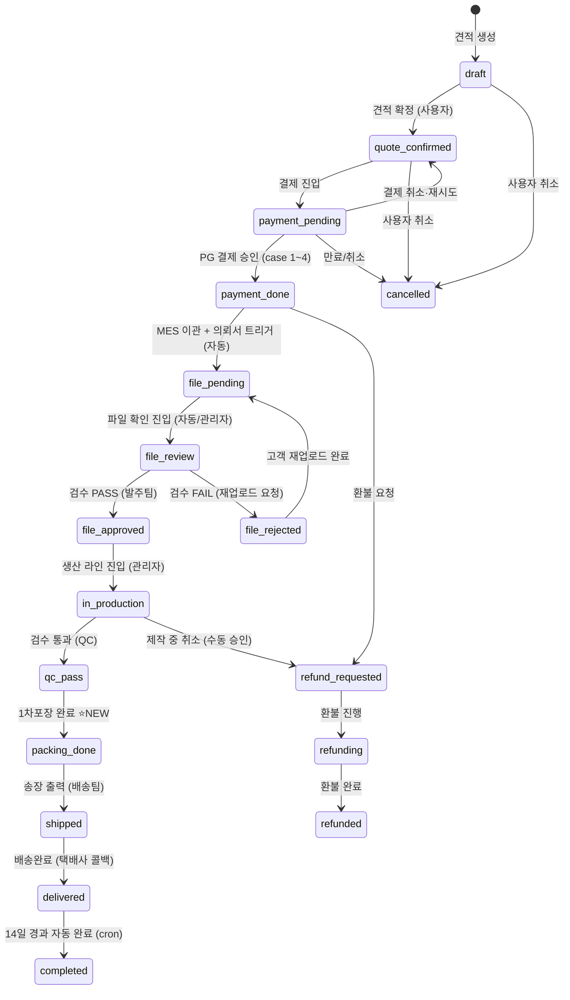
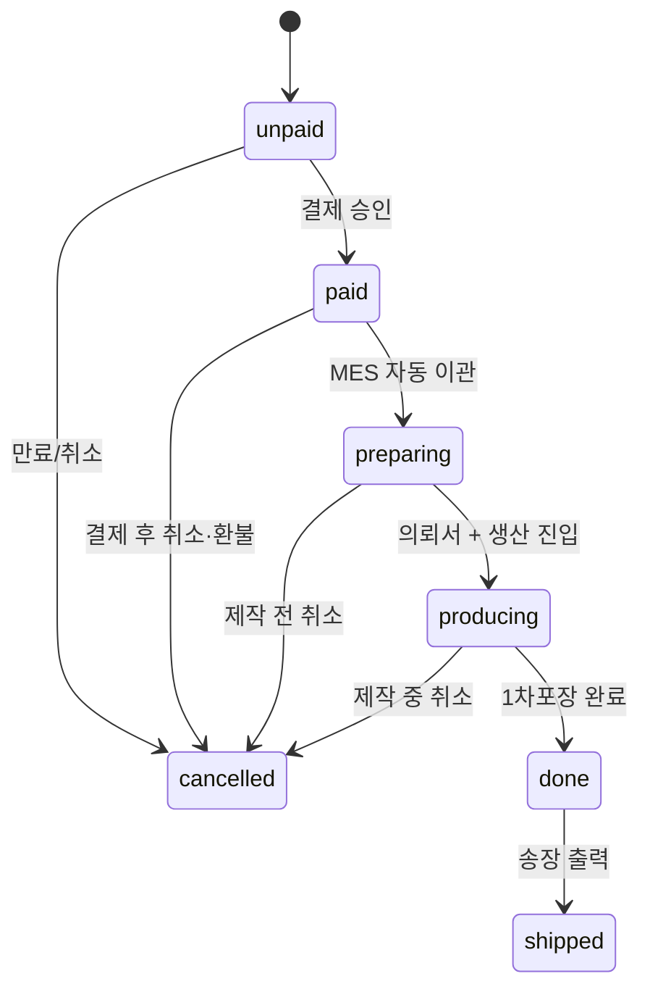

# Order 상태머신 통일 — 7-superstate / 17-substate 매핑 (INC-006 Resolution)

- 작성일: 2026-05-27
- 작성자: pq-architect (INC-006 해결, pq-business-analyst 입력 반영)
- 관련: ADR-002 D5 (Project/Order 이중 상태머신), ADR-003 Q-Master-3, INC-006/007/009
- 산출 경로: `_workspace/print-quote/03_architecture/builder-engine/order-state-mapping.md`

---

## 0. 결정 요약 (TL;DR)

| 결정 | 내용 |
|---|---|
| **D-1 Superstate/Substate 패턴** | BA의 PDF 7-state는 **UI/외부 노출 superstate**, baseline의 17-state는 **DB internal substate**. 둘은 1:N 매핑 |
| **D-2 단일 DB 컬럼** | `orders.status VARCHAR(32)` 컬럼은 17-state(internal)만 저장. 7-state는 view 또는 함수로 도출 |
| **D-3 신규 substate `packing_done` 추가** | 17-state → **18-state**. BA의 `done`(1차포장 완료) 표현을 위해 `qc_pass`와 `shipped` 사이 1개 추가 |
| **D-4 파일 부속 상태머신 분리** | 상품 파일별(배송·업로드·편집기) 부속 상태는 `artwork_files.status`로 분리. orders.status와 동시 운영 (이중 상태머신) |
| **D-5 운영 UI 정책** | 일반 사용자/관리자 일상 화면 = **7 superstate 표시**. 발주팀·생산팀 상세 화면 = **18 substate 표시 옵션** |

INC-006 / INC-007 / INC-009 모두 본 문서로 해소.

---

## 1. Context — INC-006 모순

### BA 입장 (order-flow.md §1.1)
- 출처: `docs/huni/후니프린팅_주문프로세스_20251001.pdf` p.1
- 7개 정식 상태: `unpaid` / `paid` / `preparing` / `producing` / `done` / `shipped` / `cancelled`
- 일관된 운영 흐름·자동 알림 11종이 이 7-state 기반

### ARC 입장 (domain-model.md §3.4, schema.sql)
- 출처: `_baseline/04_order_schema.sql` line 226 + `_baseline/07_integrated_schema.sql` line 659
- 17개 internal state: `draft` / `quote_confirmed` / `payment_pending` / `payment_done` / `file_pending` / `file_review` / `file_approved` / `file_rejected` / `in_production` / `qc_pass` / `shipped` / `delivered` / `completed` / `cancelled` / `refund_requested` / `refunding` / `refunded`
- baseline 38테이블·dbtest 시드 데이터 전부 17-state 기준

### 모순의 본질
**둘 다 옳다.** BA의 7-state는 사용자·관리자가 인지하는 비즈니스 단계, ARC의 17-state는 시스템 내부 추적 세분화. 두 어휘가 명시적으로 매핑되지 않아 발생한 정합성 갭.

---

## 2. 최종 매핑 표 (7-superstate ↔ 18-substate)

| BA Superstate (UI) | DB Substate (internal) | 의미 | UI 색상 |
|---|---|---|:---:|
| 🟡 `unpaid` (미입금) | `draft`, `quote_confirmed`, `payment_pending` | 견적 확정 → 결제 대기까지 | yellow |
| 🟢 `paid` (결제완료) | `payment_done` | 결제 승인 완료, MES 이관 직전 | green |
| 🔵 `preparing` (제작대기) | `file_pending`, `file_review`, `file_approved`, `file_rejected` | 파일 확인·승인 워크플로 | blue |
| 🟣 `producing` (제작중) | `in_production`, `qc_pass` | 생산 라인 + 검수 통과 | purple |
| 🟢 `done` (제작완료) | **`packing_done`** ⭐신규 | 1차포장 완료 (BA p.1 "모든상품이 포장완료이면 제작완료") | green |
| 🟢 `shipped` (출고완료) | `shipped`, `delivered`, `completed` | 출고 → 배송 → 완료 | green |
| 🔴 `cancelled` (주문취소) | `cancelled`, `refund_requested`, `refunding`, `refunded` | 취소·환불 모든 단계 | red |

**총 substate: 18 (기존 17 + `packing_done` 신규 1)**

### 2.1 신규 `packing_done` 추가 근거

BA PDF p.1 명기: *"모든상품이 포장완료이면 제작완료"* — 즉 파일 N개의 부속 상태가 모두 `포장완료`인 시점에 주문 superstate가 `done`으로 전이한다. baseline 17-state에는 이 시점에 해당하는 노드가 없어 `qc_pass`와 `shipped` 사이가 비어있다. 송장 출력은 `shipped`이지 1차포장이 아니므로 별도 노드 필요.

**스키마 변경 (필수):**
```sql
-- schema.sql §5.5 orders 테이블 status CHECK 갱신
ALTER TABLE orders DROP CONSTRAINT chk_orders_status;
ALTER TABLE orders ADD CONSTRAINT chk_orders_status CHECK (status IN (
    'draft','quote_confirmed','payment_pending','payment_done',
    'file_pending','file_review','file_approved','file_rejected',
    'in_production','qc_pass',
    'packing_done',  -- ⭐ NEW (INC-006 해결)
    'shipped','delivered','completed',
    'cancelled','refund_requested','refunding','refunded'
));

-- order_status_history도 동일 갱신
ALTER TABLE order_status_history DROP CONSTRAINT chk_order_status_history_to_status;
ALTER TABLE order_status_history ADD CONSTRAINT chk_order_status_history_to_status CHECK (
    to_status IN (
        'draft','quote_confirmed','payment_pending','payment_done',
        'file_pending','file_review','file_approved','file_rejected',
        'in_production','qc_pass','packing_done',
        'shipped','delivered','completed',
        'cancelled','refund_requested','refunding','refunded'
    )
);
```

---

## 3. Superstate 도출 (DB 함수 + View)

### 3.1 PostgreSQL 함수
```sql
CREATE OR REPLACE FUNCTION order_superstate(internal_status VARCHAR)
RETURNS VARCHAR
LANGUAGE SQL
IMMUTABLE
AS $$
    SELECT CASE internal_status
        WHEN 'draft'             THEN 'unpaid'
        WHEN 'quote_confirmed'   THEN 'unpaid'
        WHEN 'payment_pending'   THEN 'unpaid'
        WHEN 'payment_done'      THEN 'paid'
        WHEN 'file_pending'      THEN 'preparing'
        WHEN 'file_review'       THEN 'preparing'
        WHEN 'file_approved'     THEN 'preparing'
        WHEN 'file_rejected'     THEN 'preparing'
        WHEN 'in_production'     THEN 'producing'
        WHEN 'qc_pass'           THEN 'producing'
        WHEN 'packing_done'      THEN 'done'
        WHEN 'shipped'           THEN 'shipped'
        WHEN 'delivered'         THEN 'shipped'
        WHEN 'completed'         THEN 'shipped'
        WHEN 'cancelled'         THEN 'cancelled'
        WHEN 'refund_requested'  THEN 'cancelled'
        WHEN 'refunding'         THEN 'cancelled'
        WHEN 'refunded'          THEN 'cancelled'
        ELSE 'unpaid'  -- safety default
    END
$$;

-- 인덱스 부착용 generated column
ALTER TABLE orders ADD COLUMN superstate VARCHAR(16) GENERATED ALWAYS AS (order_superstate(status)) STORED;
CREATE INDEX idx_orders_superstate ON orders (superstate);
```

### 3.2 BFF·UI에서 사용
```ts
// BFF
const OrderSuperstate = z.enum(['unpaid', 'paid', 'preparing', 'producing', 'done', 'shipped', 'cancelled']);
type OrderSuperstate = z.infer<typeof OrderSuperstate>;

// API 응답 형식
type OrderSummary = {
  orderNumber: string;
  status: {
    superstate: OrderSuperstate;  // UI 표시 — 7개
    substate: OrderSubstate;       // 관리자 상세 — 18개
    label_ko: string;              // "제작중", "결제완료" 등
    color: 'yellow' | 'green' | 'blue' | 'purple' | 'red';
    progress_pct: number;          // 0~100 (visual progress bar)
  };
  // ...
};
```

---

## 4. 18-Substate 전이 다이어그램 (정상 흐름)



### 4.1 superstate 전이 다이어그램 (사용자 인지)



---

## 5. 파일 부속 상태머신 (이중 상태머신, ADR-002 D5 정합)

파일별 부속 상태는 `artwork_files.status`에 저장. 주문 상태와 **동시 운영**.

### 5.1 artwork_files.file_status 정의
```sql
ALTER TABLE artwork_files ADD COLUMN file_status VARCHAR(24);
ALTER TABLE artwork_files ADD CONSTRAINT chk_artwork_files_status CHECK (file_status IN (
    -- Case 1: 배송상품 (재고)
    'in_stock',          -- 재고
    'packed',            -- 포장완료
    -- Case 2: 파일업로드 상품
    'awaiting_upload',   -- 확인전
    'checking',          -- 파일확인 진행
    'reupload_requested',-- 재업로드요청
    'downloaded',        -- 다운로드완료
    'packed',            -- 포장완료 (중복)
    -- Case 3: 편집기 상품 (Edicus)
    'rendering',         -- 랜더링전
    'render_done',       -- 랜더링완료
    'edit_requested',    -- 수정요청
    'edit_done',         -- 수정완료
    'downloaded',        -- 다운로드완료 (중복)
    'packed'             -- 포장완료 (중복)
));
```

### 5.2 상품 타입별 파일 흐름

| 상품 타입 | 파일 상태 흐름 | 트리거 종결 |
|---|---|---|
| 배송상품 (재고) | `in_stock → packed` | 재고 차감 + 포장 |
| 파일업로드 | `awaiting_upload → checking → downloaded → packed` (+`reupload_requested` 분기) | 고객 파일 + 발주팀 확인 |
| 편집기 (Edicus) | `rendering → render_done → downloaded → packed` (+`edit_requested` 분기) | Edicus 렌더 완료 |

### 5.3 Order 상태 ↔ 파일 상태 동기 규칙

**주문 status 자동 전이 트리거:**
- `payment_done → file_pending`: 모든 파일이 초기 상태(`awaiting_upload`/`rendering`/`in_stock`) 진입 시 자동
- `file_approved → in_production`: 모든 파일이 `downloaded` 도달 시 자동
- `qc_pass → packing_done`: **모든 파일이 `packed` 도달 시 자동** ⭐ (BA p.1 명기 흐름)
- `packing_done → shipped`: 송장 출력 트리거 (배송팀 수동)

### 5.4 동기 검증 함수
```sql
CREATE OR REPLACE FUNCTION check_order_packing_complete(p_order_id UUID)
RETURNS BOOLEAN
LANGUAGE SQL
STABLE
AS $$
    SELECT NOT EXISTS (
        SELECT 1 FROM artwork_files af
        JOIN order_items oi ON oi.id = af.order_item_id
        WHERE oi.order_id = p_order_id
          AND af.file_status != 'packed'
    )
$$;

-- 트리거: artwork_files.file_status UPDATE 시 호출
CREATE OR REPLACE FUNCTION trigger_check_packing_complete()
RETURNS TRIGGER
LANGUAGE plpgsql
AS $$
DECLARE
    v_order_id UUID;
    v_current_status VARCHAR;
BEGIN
    SELECT oi.order_id INTO v_order_id FROM order_items oi WHERE oi.id = NEW.order_item_id;
    SELECT status INTO v_current_status FROM orders WHERE id = v_order_id;

    IF v_current_status = 'qc_pass' AND check_order_packing_complete(v_order_id) THEN
        UPDATE orders SET status = 'packing_done', updated_at = NOW() WHERE id = v_order_id;
        INSERT INTO order_status_history (order_id, from_status, to_status, changed_by, reason)
        VALUES (v_order_id, 'qc_pass', 'packing_done', NULL, '모든 파일 포장완료 (자동 전이)');
    END IF;
    RETURN NEW;
END;
$$;

CREATE TRIGGER trg_artwork_files_status_after_update
AFTER UPDATE OF file_status ON artwork_files
FOR EACH ROW
WHEN (OLD.file_status IS DISTINCT FROM NEW.file_status)
EXECUTE FUNCTION trigger_check_packing_complete();
```

---

## 6. ProjectStatus(Edicus) ↔ Order 매핑 갱신 (ADR-002 D5)

기존 domain-model.md §4.7 매핑을 superstate 기준으로 재정의:

| Edicus `DesignProject.status` | Order superstate | Order substate(들) |
|---|---|---|
| `editing` | (Order 없음) | — (견적 전 단계) |
| `ordering` | `unpaid` | `draft`, `quote_confirmed`, `payment_pending` |
| `ordered` | `paid` 이상 | `payment_done`, `file_*`, `in_production`, `qc_pass`, `packing_done`, `shipped`, `delivered`, `completed` |

→ Edicus 3-state는 본 매핑으로 명확. ADR-002 D5 "이중 상태머신" 정합.

---

## 7. 전이 트리거 통합 표 (BA order-flow.md §2.1 ↔ ARC schema)

BA가 정의한 8개 전이 트리거를 17→18 substate 단위로 풀어 명세:

| superstate 전이 | 세부 substate 전이 | 트리거 | 액터 | 자동/수동 |
|---|---|---|---|:---:|
| (시작) → unpaid | (insert) → `draft` | 견적 생성 | 시스템 | 자동 |
| unpaid → unpaid | `draft → quote_confirmed` | 견적 확정 CTA | 고객 | 수동 |
| unpaid → unpaid | `quote_confirmed → payment_pending` | 결제 진입 | 고객 | 수동 |
| unpaid → paid | `payment_pending → payment_done` | PG 결제 승인 (Case 1~4) | 시스템 (PG 콜백) | 자동 |
| paid → preparing | `payment_done → file_pending` | MES 이관 + 의뢰서 트리거 | 시스템 | 자동 |
| preparing → preparing | `file_pending → file_review` | 파일 확인 진입 | 시스템 (cron) | 자동 |
| preparing → preparing | `file_review → file_approved` | 의뢰서 출력 + 검수 PASS | 발주팀 | 수동 |
| preparing → preparing | `file_review → file_rejected` | 재업로드 요청 | 발주팀 | 수동 |
| preparing → preparing | `file_rejected → file_pending` | 고객 재업로드 완료 | 고객 | 수동 |
| preparing → producing | `file_approved → in_production` | 생산 라인 진입 | 관리자 (발주팀) | 수동 |
| producing → producing | `in_production → qc_pass` | QC 검수 통과 | 생산팀 | 수동 |
| producing → done | `qc_pass → packing_done` | 모든 파일 packed 도달 ⭐ | 시스템 (트리거) | 자동 |
| done → shipped | `packing_done → shipped` | 송장 출력 / 직접 방문 수령 | 배송팀 | 수동 |
| shipped → shipped | `shipped → delivered` | 택배사 배송완료 콜백 | 시스템 (택배 API) | 자동 |
| shipped → shipped | `delivered → completed` | 14일 경과 자동 완료 | 시스템 (cron) | 자동 |
| 모든 → cancelled | `* → cancelled` | 사용자 또는 관리자 취소 | 고객/관리자 | 수동 |
| paid 이상 → cancelled | `* → refund_requested → refunding → refunded` | 환불 처리 | 관리자 + PG | 혼합 |

---

## 8. UI 정책 (D-5)

### 8.1 일반 사용자 화면 (마이페이지·주문상세)
- **superstate 7개만 표시** (`unpaid`/`paid`/`preparing`/`producing`/`done`/`shipped`/`cancelled`)
- progress bar 7-step
- 상세 정보(예: "파일 검수 중")는 보조 텍스트로

### 8.2 관리자·운영 화면
- 기본 view = superstate 7개 (필터·검색 단순화)
- "상세 보기" 토글 시 18개 substate 노출
- 발주팀·생산팀 전용 화면은 substate 기본 노출

### 8.3 알림 발송 정책 (BA §3.1 11종 자동 알림과 정합)
- 사용자 알림은 **superstate 전이**에만 발송 (예: `unpaid → paid` 시 1건)
- substate 전이는 알림 미발송 (소음 방지)
- 예외: `file_rejected` (재업로드 요청)·`refund_requested` 등 고객 액션 필요 substate는 별도 알림

---

## 9. 영향 매트릭스

### 9.1 변경 필요 산출물

| 파일 | 변경 |
|---|---|
| `schema.sql` | orders 테이블 status CHECK + order_status_history CHECK에 `packing_done` 추가 |
| `schema.sql` | `order_superstate()` 함수 + `orders.superstate` generated column + 인덱스 |
| `schema.sql` | `artwork_files.file_status` 컬럼 + CHECK + 트리거 함수 |
| `domain-model.md` §3.4 | "Order [_baseline:orders 17-state + ADR-002 매핑]" → "Order [18-state internal + 7-superstate UI, ADR-002 D5 + INC-006 R]" |
| `domain-model.md` §4.7 | ProjectStatus 매핑 갱신 (본 문서 §6) |
| `bff-integration.md` §1 | 상태 표기 갱신 (superstate/substate 이중) |
| `order-flow.md` §1 | superstate 7 / substate 18 표기 명시 + 본 문서 reference 추가 |
| `consistency-report.md` | INC-006/007/009 Resolved 표기 |
| `decisions.md` | D-PM-30B 신규 등록 — Order 상태 노출 정책 |

### 9.2 영향받지 않는 산출물
- `pricing-engine.md` — 가격은 상태 무관
- `block-schema.md`·`form-builder.md`·`widget-coverage-matrix.md` — 빌더 도메인 무관
- `_baseline/` — 시드 데이터는 17-state 어휘 그대로 유효 (`packing_done`만 신규)

---

## 10. INC-006/007/009 Resolution Status

### INC-006 ✅ Resolved (P0)
**Resolution:** 7-superstate / 18-substate(17 + packing_done) 매핑 채택. 단일 DB 컬럼 + 함수/뷰로 superstate 도출. ProjectStatus 매핑 갱신 (§6).

### INC-007 ✅ Resolved (P1)
**Resolution:** DesignProject ↔ Order 매핑이 §6 표로 단일 어휘 확정. ADR-002 D5 정합 복원.

### INC-009 ✅ Resolved (P1)
**Resolution:** REQ-PQ-040~062 (주문·결제 11건) 모호성 → 본 매핑 표 §2/§7로 해소. M3 화면 설계 시 superstate/substate 표기 일관.

---

## 11. Open Sub-decisions (M3 진입 전 비차단)

| ID | 질문 | 영향 |
|---|---|---|
| O-OSM-1 | `delivered → completed` 자동 14일 cron의 정확한 기간 | 5.3 substate 흐름 (운영 정책) |
| O-OSM-2 | `refund_requested → refunding` 자동 vs 관리자 승인 | 4 cancel paths |
| O-OSM-3 | 외주제작 코드(006)의 별도 substate 필요성 | order-flow §4.2 외주 흐름 |
| O-OSM-4 | `packing_done` 시점의 알림 발송 여부 (사용자에게 "곧 출고됩니다" 안내) | 8.3 알림 정책 |

→ O-OSM-1~4는 M3 진행을 차단하지 않음. M3에서 화면 설계와 함께 일괄 결정.

---

## 12. Action Items (즉시 실행)

1. ✅ **본 문서 작성** (이 파일)
2. 🟡 **schema.sql 갱신** — `packing_done` 추가, `order_superstate()` 함수, `artwork_files.file_status` (pq-architect, 별도 라운드)
3. 🟡 **domain-model.md §3.4/§4.7 갱신** (pq-architect, 별도 라운드)
4. 🟡 **bff-integration.md §1 상태 표기 갱신** (pq-architect, 별도 라운드)
5. 🟡 **order-flow.md §1 reference 추가** (pq-business-analyst, 마이크로 수정)
6. 🟢 **consistency-report.md INC-006/007/009 Resolved 표기** (pq-pm, 본 라운드 후속)
7. 🟢 **decisions.md D-PM-30B 등록** (pq-pm, 본 라운드 후속)

→ #2~#5는 본 매핑이 합의된 후의 후속 작업. M3(화면 설계) 진입은 본 문서 합의로 차단 해제.

---

REQ coverage: REQ-PQ-040~062 (주문·결제), REQ-PQ-063~078 (파일 부속), REQ-PQ-094~110 (회원·정책 일부)
References: BA order-flow.md §1, ARC domain-model.md §3.4·§4.7, _baseline/04_order_schema.sql L226-244, _baseline/07_integrated_schema.sql L658-663, ADR-002 D5, ADR-003 Q-Master-3, consistency-report INC-006/007/009
