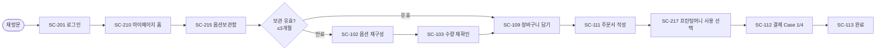
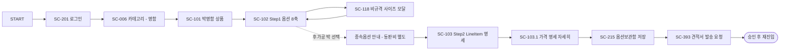
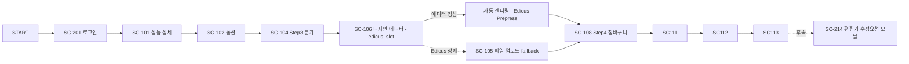
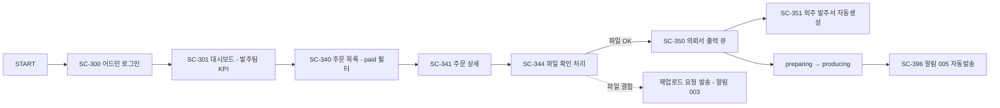

# 사용자 여정 맵 — 후니프린팅 5 페르소나 × V1 Critical Flow

- 작성일: 2026-05-28
- 작성자: pq-designer
- 범위: M3 Track A — 5 페르소나의 V1 critical flow 사용자 여정. screen-inventory.md의 SC-ID로 단계 추적.
- 의존: ia.md §1 (페르소나), order-flow.md §1.2 (5 결제 케이스), sitemap.md, screen-inventory.md
- 표기: 단계 = 화면 ID + 의도 + 고민 + 위험 + 핵심 REQ

---

## 0. 페르소나 매핑 (ia.md §1 인용)

| 페르소나 | 별칭 | 핵심 동기 | V1 critical flow |
|---|---|---|---|
| **P1** | 게스트 비회원 단순 주문 | "빠르게 명함만" | 카탈로그 → 견적 → 비회원 결제 |
| **P2** | 회원 반복 주문 | "지난번 그대로" | 옵션보관함 → 재주문 |
| **P3** | 사용자 정의 옵션 견적 | "복잡 옵션·비규격" | 8축 옵션 → LineItem 명세 → 견적 저장 |
| **P4** | 디자인 의뢰 풀세트 (V1: 에디터 fallback) | "디자인부터" | 디자인 에디터 → 견적 → 결제 |
| **P5** | 어드민/CS 운영자 | "오늘 워크큐 처리" | 대시보드 → 워크큐(발주/생산/출고) → 상태 전이 |

각 페르소나의 결제 케이스(order-flow.md §1.2)는 단계 표에 함께 표기.

---

## 1. 여정 J1 — 게스트 비회원 단순 주문 (P1)

### 1.1 시나리오

> "출장 전에 명함 100장만 빨리 주문하고 싶다. 회원가입은 귀찮으니 비회원으로."

### 1.2 단계 흐름 (Mermaid)

```mermaid
flowchart LR
  START([진입]) --> SC001[SC-001 메인 홈]
  SC001 --> SC002[SC-002 카테고리 그리드]
  SC002 --> SC006[SC-006 카테고리 리스팅]
  SC006 --> SC101[SC-101 상품 상세]
  SC101 --> SC102[SC-102 Step1 옵션 8축]
  SC102 --> SC103[SC-103 Step2 수량·가격]
  SC103 --> SC104[SC-104 Step3 파일/디자인 분기]
  SC104 --> SC105[SC-105 Step3-A 파일 업로드]
  SC105 --> SC108[SC-108 Step4 바로 결제]
  SC108 --> SC111[SC-111 주문서 작성]
  SC111 --> SC112[SC-112 결제 - Case 1 카드]
  SC112 --> SC113[SC-113 결제 완료]
  SC113 --> END([주문 완료, 휴대전화로 조회])
  SC112 -.Case 4 가상계좌.-> SC114[SC-114 가상계좌 안내 +3일 자동취소]
  SC114 --> END
```



### 1.3 단계별 의도·고민·위험·REQ

| Step | SC-ID | 사용자 의도 | 고민·의사결정 포인트 | 위험(드롭오프) | 핵심 REQ |
|--|---|---|---|---|---|
| 1 | SC-001 | 무엇이 가능한지 훑기 | "어떤 종류?" | 메뉴가 복잡하면 이탈 | 001 |
| 2 | SC-002/006 | 명함 카테고리 진입 | "디지털인쇄?" | 분류가 헷갈리면 검색 | 003, 004 |
| 3 | SC-101 | 가격 감 잡기 | "기본가 적정?" | 옵션 안 보이면 이탈 | 003, 020 |
| 4 | SC-102 | 사이즈·종이·도수 선택 | "옵션 너무 많아" | 종속옵션 안내 부족 시 혼란 | **009, 010, 021** |
| 5 | SC-103 | 수량별 단가 확인 | "100장 얼마?" | 0.5초 안에 안 나오면 의심 | **021, 022, 031** |
| 6 | SC-104 | 파일 모드 선택 | "파일 있음 → A" | 3분기 안내 모호 시 혼란 | 047 |
| 7 | SC-105 | PDF 업로드 | "포맷 맞나?" | 포맷 오류 시 즉시 이탈 가능 | **063, 064, 065** |
| 8 | SC-108 | 비회원 결제로 진행 | "회원가입 강제?" | 게이트 있으면 이탈 | **013** |
| 9 | SC-111 | 배송지·연락처 입력 | "도서산간이면?" | 추가비 사후 부과되면 클레임 | 054, 055 |
| 10 | SC-112 | 카드 결제 (Case 1) | "결제 안전?" | PG 실패 시 이탈 | 041, 042, 050 |
| 11 | SC-113 | 주문번호 확인 | "언제 받아?" | 제작 기간 표시 부재 시 불안 | 040 |
| 11' | SC-114 | (Case 4) 가상계좌 입금 | "3일 안에 입금" | 알림 미수신 시 무산 | **043, 044, 045** |

### 1.4 위험·완화

- **R1 — 옵션 복잡도 인지 부담**: 인쇄 도메인 첫 사용자가 도수·종이·후가공 용어를 모름. → 각 옵션 옆 인라인 tooltip + 가이드 페이지(SC-013, SC-014) 링크.
- **R2 — 비회원 게이트 의심**: "정말 비회원도 되나?" → CTA 버튼에 "비회원 주문 가능" 명시.
- **R3 — 가상계좌 미입금 자동취소**: 3일 안내가 약하면 미수령 → SC-114에서 카운트다운 + 알림톡/SMS fallback 발송.

---

## 2. 여정 J2 — 회원 반복 주문 (P2)

### 2.1 시나리오

> "매월 같은 사양의 스티커 1000장. 지난번 옵션 그대로 다시 받고 싶다."

### 2.2 단계 흐름



### 2.3 단계별 분석

| Step | SC-ID | 의도 | 고민 | 위험 | REQ |
|--|---|---|---|---|---|
| 1 | SC-201 | 빠른 재진입 | "SNS 로그인 가능?" | 로그인 실패 | 012, 015 |
| 2 | SC-210 | 진행중 주문/포인트 확인 | "지난번은 어디?" | 옵션보관함 진입 동선이 LNB에 없으면 헤맴 | 094 |
| 3 | SC-215 | 저장된 견적 검색 | "3개월 지났나?" | 만료 안내 부재 시 혼동 | **039** |
| 4 | SC-109 | 장바구니 담기 | "옵션+파일 같이?" | 파일 만료 시 재업로드 필요 | **059** |
| 5 | SC-111 | 배송지 재선택 | "지난 주소 자동?" | 미선택 시 클레임 | 054 |
| 6 | SC-217 | 프린팅머니 차감 | "잔액 충분?" | 잔액 부족 안내 부재 시 혼동 | **094, 095** |
| 7 | SC-112 | 부분 결제(머니+카드 Case 2 + 1 혼합) | "복합 결제 OK?" | 결제 분할 UI 불명확 | 041 |

### 2.4 위험·완화

- **R1 — 보관 만료**: 3개월 직전 알림톡 발송(예: 14일 전·3일 전).
- **R2 — 가격 변동**: 보관된 견적의 가격이 마스터 변경으로 달라진 경우 → 옵션보관함 진입 시 자동 재계산 + "변경됨" 배지.
- **R3 — 프린팅머니 잔액 노출 위치**: SC-210 대시보드 카드 + SC-217 상단 sticky.

---

## 3. 여정 J3 — 사용자 정의 옵션 견적 (P3)

### 3.1 시나리오

> "박명함, 비규격 사이즈, 동판비 별도 — 정확한 가격 명세가 필요하다. 견적서로 사내 결재용."

### 3.2 단계 흐름



### 3.3 단계별 분석

| Step | SC-ID | 의도 | 고민 | 위험 | REQ |
|--|---|---|---|---|---|
| 1 | SC-101 | 박명함 진입 | "박 가능?" | 안내 부재 시 이탈 | 010 |
| 2 | SC-102 | 박 종류·위치 입력 | "동판비?" | 종속옵션 의존성 표시 약하면 잘못 선택 | **010, 028** |
| 3 | SC-118 | 비규격 사이즈 직접 입력 | "보간되나?" | 매트릭스 밖이면 외삽 안내 필요 | **011, 024, 025** |
| 4 | SC-103 | LineItem 단가 확인 | "base+박+동판?" | breakdown 부재 시 신뢰도↓ | **027, 028, 038** |
| 5 | SC-103.1 | 산식 보기 | "VAT 포함?" | "부가세 포함" 라벨 부재 시 의심 | **029, 030** |
| 6 | SC-215 | 옵션 저장 | "3개월 안에 결제 가능?" | 보관 만료 우려 | 039 |
| 7 | SC-393 | 견적서 메일 발송 | "PDF 받을 수 있나?" | 발송 이력 부재 시 재요청 | 030, 038 |

### 3.4 위험·완화

- **R1 — 종속옵션 시각화**: 후가공 박 선택 시 동판비·박 위치 옵션이 자동 노출 + 비용 미리보기.
- **R2 — 보간 vs 외삽 명시**: SC-118에서 입력 사이즈가 매트릭스 내인지 외인지 시각 표시(`보간 - 안전` / `외삽 - 추정치` 배지).
- **R3 — 견적서 산식 신뢰**: SC-103.1에서 base·finish·surcharge·discount·VAT 각 라인 명세, 클릭 시 산식 토글.

---

## 4. 여정 J4 — 디자인 의뢰 (P4, V1 = 에디터 fallback)

### 4.1 시나리오

> "디자인 시안이 없다. 에디터로 직접 만들거나 디자인 의뢰(V2)로 진행하고 싶다."

V1에서 디자인 의뢰(SC-107) 풀세트는 deferred(D-DS-04). V1 critical flow는 **에디터(SC-106)** fallback 경로.

### 4.2 단계 흐름 (V1)



### 4.3 단계별 분석

| Step | SC-ID | 의도 | 고민 | 위험 | REQ |
|--|---|---|---|---|---|
| 1 | SC-106 | 에디터로 직접 디자인 | "사용법 쉽나?" | 진입 장벽 큼 | **076, 113** |
| 2 | (자동 렌더) | Edicus Prepress 결과 확인 | "내가 만든 그대로?" | 폰트·이미지 깨짐 우려 | 077 |
| 3 | SC-105 (fallback) | 에디터 장애 시 파일 업로드 | "에디터 안 되면?" | fallback 안내 부재 시 이탈 | **114** (O-002) |
| 4 | SC-214 | 주문 후 미리보기·수정 요청 | "확정 전 검토 가능?" | 수정 시 추가 비용 우려 | 077 |

### 4.4 위험·완화

- **R1 — Edicus 외부 의존**: edicusbase.firebaseapp.com 장애 시 자동 fallback 모드로 SC-105 안내 (O-002 미결 — 정책 확정 필요).
- **R2 — 외부 브랜드 노출 금지**: 화면 라벨은 "디자인 편집기"로만 표기. "Edicus" 미사용 (REQ-PQ-115).
- **R3 — 수정 요청 무한 루프**: SC-214에서 수정 횟수 카운트 표시 (예: "수정 가능 횟수 2/3회").

---

## 5. 여정 J5 — 어드민/CS 운영자 (P5)

### 5.1 시나리오 (P5b 발주팀 일과)

> "출근 후 오전: 신규 결제 완료 주문의 파일 확인 + 의뢰서 출력. 오후: 재업로드 요청 회신 처리."

### 5.2 단계 흐름



### 5.3 단계별 분석

| Step | SC-ID | 의도 | 고민 | 위험 | REQ |
|--|---|---|---|---|---|
| 1 | SC-300 | 권한 진입 | "오늘 워크큐?" | 권한 누락 시 진입 차단 | — |
| 2 | SC-301 | KPI 확인 | "오늘 신규 paid 몇건?" | 위젯 부정확 시 누락 | 084 |
| 3 | SC-340 | paid 필터·정렬 | "긴급순?" | 정렬·검색 부재 시 손작업 | 040 |
| 4 | SC-341 | 18-substate 토글 | "정확한 단계?" | 7-state만으로는 발주 부족 | 040, 046 |
| 5 | SC-344 | 파일 확인 + 썸네일 | "포맷 OK?" | 결함 미검출 시 클레임 | **065, 066, 070** |
| 6 | SC-344-req | 재업로드 요청 | "고객 알림?" | 알림 미발송 시 지연 | **066, 049** |
| 7 | SC-350 | 의뢰서 출력 | "외주 분리?" | 외주 자동분리 안 되면 손작업 | **074, 088, 089** |
| 8 | SC-351 | 외주 발주서 EXCEL | "업체별 OK?" | EXCEL 포맷 오류 시 재작업 | 086, 089 |
| 9 | (자동) | preparing → producing 전이 + 알림 005 | 자동 처리 신뢰 | 알림 미발송 시 고객 불안 | **048, 049** |

### 5.4 위험·완화

- **R1 — 18-substate 가시화**: 어드민 일상화면 7-state 기본, 우상단 토글로 18-state 전환 (D-DS-08).
- **R2 — 바코드 차단 우회**: 앞공정 미완료 시 강한 차단(D-PM-17) — 우회는 사유 + 감사 로그 (SC-399).
- **R3 — 4채널 OEM 통합**: BIZ/FUJI/CONT/HUNI 4채널 주문이 SC-348에서 자동 흡수되어 SC-340에 일관 표시.

### 5.5 부속 흐름 — 출고팀 (P5d)

```
SC-301 → SC-355 (1차포장 바코드, packing_done) → SC-357 (합배송 리스트)
       → SC-356 (송장 출력, done→shipped, 알림 008/009) → SC-358 (명세서)
```

핵심 REQ: 046, 051, 052, 090, 091, 092.

---

## 6. 페르소나·여정 vs 화면·REQ 추적표

| 여정 | 페르소나 | 결제 Case | 진입점 | 종료점 | 핵심 SC (5~7개) | 핵심 REQ |
|---|---|---|---|---|---|---|
| J1 | P1 | Case 1 (카드) 또는 Case 4 (가상계좌) | SC-001 | SC-113/114 | SC-102, 103, 105, 108, 111, 112 | 009, 013, 021, 044, 063 |
| J2 | P2 | Case 1/2 혼합 | SC-201 | SC-113 | SC-215, 109, 217, 111, 112 | 039, 059, 094, 095 |
| J3 | P3 | (견적 저장 / 후속 결제) | SC-101 | SC-393 | SC-102, 118, 103, 103.1, 215, 393 | 011, 027, 028, 038 |
| J4 | P4 | Case 1 | SC-101 | SC-113 (+ SC-214) | SC-106, 105 fallback, 108 | 076, 113, 114 |
| J5 | P5 (a~e) | — (운영) | SC-300 | (조직별 워크큐 완료) | SC-301, 340, 341, 344, 350, 351, 355, 356 | 046, 048, 065, 074, 081, 090 |

---

## 7. 공통 드롭오프 위험 & UX 가이드

| 위험 ID | 위험 | 발생 단계 | 완화책 |
|---|---|---|---|
| DR-01 | 옵션 8축 인지 과부하 | SC-102 | 인라인 tooltip + 가이드 링크(SC-013/014) + Progressive disclosure |
| DR-02 | 가격 계산 지연(>0.5s) | SC-103 | skeleton 표시 + 백그라운드 prefetch (REQ-PQ-021) |
| DR-03 | 비회원 결제 게이트 의심 | SC-108 | "비회원 주문 가능" 명시 + 비회원 조회 안내 |
| DR-04 | 파일 포맷 오류 즉시 거부 | SC-105 | 허용 포맷·예시 사전 노출, drag&drop 영역에 inline 안내 |
| DR-05 | 가상계좌 자동취소 미인지 | SC-114 | 카운트다운 + 24h 전 알림톡/SMS (#011, REQ-PQ-045) |
| DR-06 | 보관 만료 미인지 | SC-215 | 14/3일 전 알림 + 보관함 진입 시 만료 배지 |
| DR-07 | 도서산간 추가비 사후 부과 | SC-111 | 우편번호 입력 즉시 4구간 자동 반영(SC-111.1 모달) |
| DR-08 | Edicus 장애 | SC-106 | 자동 SC-105 fallback + 안내 토스트 |
| DR-09 | 어드민 권한 누락 | SC-300 | 진입 시점 권한 검증 + 메뉴 동적 가시화 |
| DR-10 | 바코드 우회 무단 처리 | SC-354 | 강한 차단 + 사유 입력 + 감사 로그 (REQ-PQ-083) |

---

## 8. 신규 디자인 결정 (Inline D-DS)

| ID | 결정 | 근거 |
|---|---|---|
| `D-DS-14` (잠정) | J1 비회원 흐름의 모든 게이트에 "비회원 주문 가능" 라벨 명시. 게이트 없는 화면군 보장. | REQ-PQ-013 |
| `D-DS-15` (잠정) | J2 옵션보관함 만료 알림 = 14일 전·3일 전 2회 (알림톡 fallback SMS). | REQ-PQ-039, REQ-PQ-049 |
| `D-DS-16` (잠정) | J3 견적서 PDF 발송은 SC-393에서 트리거. 자체 발송 이력 + 사용자 메일 함께 전달. | REQ-PQ-030, REQ-PQ-038 |
| `D-DS-17` (잠정) | J4 Edicus fallback은 SC-106 진입 시 ping 검사 → 실패 시 자동 SC-105 redirect + 토스트 안내. (O-002 정책 확정 전 잠정 UX) | REQ-PQ-114, O-002 |
| `D-DS-18` (잠정) | J5 워크큐는 모두 동일 단축키 패턴(`E`=편집, `S`=상태 변경, `B`=바코드 입력) 운영. | order-flow.md §5 |

---

## 9. huni-ia-master 재작성 정합성 조정 (v1.1, 2026-05-28)

sitemap/ia/screen-inventory v2.0 재작성(huni-ia-master 기준)과의 정합성을 점검한 결과, **여정의 큰 구조(5 페르소나 × critical flow)는 변경 불필요**하나 다음 2개 충돌점만 조정한다. 나머지 여정 흐름·드롭오프 위험은 그대로 유효하다.

### 9.1 조정 1 — P5 단일 관리자 (7조직 분할 → 통합)

- **충돌:** §5는 P5를 P5a~e(상품/발주/생산/출고/회계) 7조직으로 분할하고 조직별 워크큐를 전제했으나, huni-ia-master는 **단일 관리자**다(huni-ia-master §D, B-2 결정).
- **조정:** V1 P5는 **통합 단일 관리자**. §5.1·§5.5의 발주팀/출고팀 분리 시나리오는 **V2(세분권한)로 이연**. V1 관리자 일과는 하나의 흐름: 주문관리(SC-A-60) → 파일확인(SC-A-61) → 재업로드 요청(SC-A-62) → 주문서출력(SC-A-63) → 상태변경+문자(SC-A-64/67). 바코드 워크큐(공정/출고)는 별도트랙(V1? 협의).

### 9.2 조정 2 — 결제 흐름 백엔드 (BFF-S → 자체+이니시스)

- **충돌:** §1~4 결제 단계가 v1.0 screen-inventory의 BFF-S(Shopby 위임)를 암시했으나, B-2 결정으로 **결제 = 자체 화면 + 이니시스 직연동**, 회원/주문/CS = 자체구축이다.
- **조정:** 모든 결제·주문·회원 단계의 백엔드 종속은 **자체(+이니시스 PG)**. 간편결제는 이니시스 통합형 1차. Shopby PG는 백업이며 여정 화면에 노출 없음. 가상계좌 안내(가상계좌·3일 자동취소)는 이니시스 V-Account 기준 유지.

### 9.3 SC-ID 매핑 (v1.0 → v2.0)

여정 본문의 v1.0 SC-ID는 다음으로 읽는다(본문 미수정, 매핑으로 대체):

| v1.0 | v2.0 | 화면 |
|---|---|---|
| SC-001/002/006 | SC-M-01/02/03 | 메인·서브메인·리스팅 |
| SC-101 | SC-Q-01 | 상품페이지 |
| SC-102/103 | SC-Q-02 | 출력상품 옵션·수량·가격 |
| SC-104/105/106 | SC-Q-10 | 파일/편집 3분기(파일·에디터·의뢰) |
| SC-108 | SC-Q-10.1 | 보관함/장바구니 |
| SC-111 | SC-Q-11 | 배송정보입력 |
| SC-112/116 | SC-Q-12/12.1 | 결제(이니시스)·실패 모달 |
| SC-113 | SC-Q-13 | 주문완료+메일 |
| SC-114 | SC-Q-12.2 | 가상계좌 안내 |
| SC-115/208 | SC-CS-07 | 비회원 주문조회(3키) |
| SC-118 | SC-Q-02.2 | 비규격 사이즈 모달 |
| SC-201 | SC-AC-01 | 로그인 |
| SC-210/215 | SC-MY-01/02 | 마이페이지·옵션보관함 |
| SC-217 | SC-MY-04 | 프린팅머니 |
| SC-393 | (별도트랙/SM-CS-04) | 견적서 발송 — 대량견적문의로 대체 |
| SC-300/301 | (단일 관리자 진입) | 관리자 로그인·대시보드 |
| SC-340/341 | SC-A-60 | 주문관리·상세 |
| SC-344 | SC-A-61/62 | 파일확인·재업로드요청 |
| SC-350/351 | SC-A-63 + 별도트랙 | 주문서출력 / 외주발주(트랙) |
| SC-354/355/356 | 별도트랙(V2) | 공정·출고 바코드 워크큐 |

### 9.4 유지 (변경 없음)

- J1~J4(P1~P4) 여정 흐름·드롭오프 위험 DR-01~DR-08은 그대로 유효.
- 에디터 fallback(J4), 비규격 보간/외삽(J3), 비회원 게이트(J1), 옵션보관함 만료(J2) UX 가이드 전부 유지.

---

## 10. 변경 이력

| 버전 | 일자 | 변경 | 작성자 |
|---|---|---|---|
| 1.0 | 2026-05-28 | 초기 작성 — 5 여정 × V1 critical flow, 10 공통 드롭오프 위험 도출 | pq-designer |
| 1.1 | 2026-05-28 | huni-ia-master 재작성 정합성 조정 — P5 단일 관리자(7조직 V2 이연), 결제 자체+이니시스(BFF-S 폐기), SC-ID v1.0→v2.0 매핑. 여정 구조는 유지 | pq-designer |
