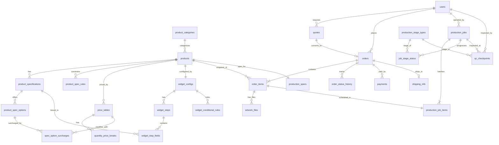

# 인쇄자동견적 서비스 ERD

작성: schema-integrator
작성일: 2026-05-07
대상 스키마: `07_integrated_schema.sql`

---

## 전체 도메인 관계도 (핵심 20 테이블)

---

## 도메인별 테이블 목록

### Common (2)
| 테이블 | 컬럼 수 | 비고 |
|--------|---------|------|
| `users` | 11 | customer/operator/admin/guest 통합 (soft delete) |
| `system_configs` | 6 | VAT_RATE, CURRENCY 등 전역 설정 |

### Product (6)
| 테이블 | 컬럼 수 | 비고 |
|--------|---------|------|
| `product_categories` | 11 | 3-tier self-join hierarchy |
| `products` | 16 | 마스터 카탈로그 |
| `product_specifications` | 16 | 제품별 사양 정의 (input_type 다형) |
| `product_spec_options` | 12 | 사양 선택지 (extra_cost_modifier `NUMERIC(6,4)` FIXED) |
| `product_spec_rules` | 13 | 사양 의존/배제 규칙 (enable/disable/require) |
| `product_templates` | 10 | 사전 설정 세트 (JSONB) |

### Pricing (6)
| 테이블 | 컬럼 수 | 비고 |
|--------|---------|------|
| `price_tables` | 11 | 시계열 가격표 (valid_from/valid_to) |
| `quantity_price_breaks` | 8 | 수량 구간별 단가 (step pricing) |
| `spec_option_surcharges` | 8 | 옵션별 추가비 (per_unit/fixed/percentage) |
| `surcharge_rules` | 13 | 긴급납기/주말 등 조건부 할증 |
| `discount_policies` | 13 | 회원등급/쿠폰 할인 |
| `shipping_fee_rules` | 12 | 지역군별 배송비 |

### Order (7)
| 테이블 | 컬럼 수 | 비고 |
|--------|---------|------|
| `quotes` | 13 | 24h 만료 견적 (snapshot JSONB) |
| `orders` | 22 | 17-state 머신 + 금액 분해 |
| `order_items` | 10 | 스냅샷 보관 (spec/price JSONB) |
| `order_status_history` | 7 | 상태 전이 이력 |
| `artwork_files` | 13 | 디자인 파일 + 검수 상태 |
| `payments` | 13 | PG 거래 (PCI-DSS 토큰만) |
| `shipping_info` | 14 | 1:1 주문 배송 정보 |

### Widget (7)
| 테이블 | 컬럼 수 | 비고 |
|--------|---------|------|
| `widget_configs` | 12 | 1:1 with products |
| `widget_steps` | 10 | 단계별 i18n 라벨 |
| `widget_step_fields` | 16 | 입력 필드 (spec_id 연결) |
| `widget_conditional_rules` | 13 | UI 조건부 룰 (show/hide/...) |
| `preview_templates` | 11 | svg/canvas/image 미리보기 |
| `ui_translations` | 6 | i18n 키-값 저장소 |
| `widget_analytics` | 9 | append-only 이벤트 로그 |

### Production (10)
| 테이블 | 컬럼 수 | 비고 |
|--------|---------|------|
| `production_stage_types` | 8 | 6단계 마스터 (PREPRESS~SHIPPING) |
| `equipment_configs` | 11 | 설비 (offset/digital/wide_format) |
| `production_jobs` | 14 | gang printing 배치 |
| `production_job_items` | 6 | order_item N:M (UNIQUE) |
| `job_stage_status` | 9 | 단계별 진행 상태 |
| `print_materials` | 13 | 자재 재고 |
| `material_usage_log` | 7 | 사용 이력 |
| `business_calendar` | 5 | 영업일 캘린더 |
| `production_specs` | 11 | 1:1 with products (DPI/bleed) |
| `qc_checkpoints` | 11 | 단계별 QC 결과 |

### 합계
- **공통: 2** + **제품: 6** + **가격: 6** + **주문: 7** + **위젯: 7** + **생산: 10** = **총 38 테이블**

---

## 도메인 간 FK 관계 요약

| From (도메인) | → | To (도메인) | 관계 의미 |
|---------------|---|-------------|----------|
| pricing.price_tables.product_id | → | product.products.id | 제품별 가격표 |
| pricing.spec_option_surcharges.spec_option_id | → | product.product_spec_options.id | 옵션별 추가비 |
| order.quotes.user_id / product_id | → | common.users / product.products | 견적-사용자/제품 |
| order.orders.user_id / quote_id | → | common.users / order.quotes | 주문-사용자/견적 |
| order.order_items.product_id | → | product.products.id | 라인 아이템 (navigation only) |
| order.order_status_history.changed_by | → | common.users.id | 상태 변경자 |
| order.artwork_files.reviewer_id | → | common.users.id | 파일 검수자 |
| widget.widget_configs.product_id | → | product.products.id | 1:1 위젯 |
| widget.widget_step_fields.spec_id | → | product.product_specifications.id | 필드-사양 바인딩 |
| production.production_specs.product_id | → | product.products.id | 1:1 생산 사양 |
| production.production_jobs.operator_id | → | common.users.id | 작업자 |
| production.production_job_items.order_item_id | → | order.order_items.id | gang printing 묶음 |
| production.job_stage_status.operator_id | → | common.users.id | 단계별 작업자 |
| production.qc_checkpoints.inspector_id | → | common.users.id | QC 검사자 |
| production.material_usage_log.operator_id | → | common.users.id | 자재 사용자 |

**총 크로스 도메인 FK: 15**
