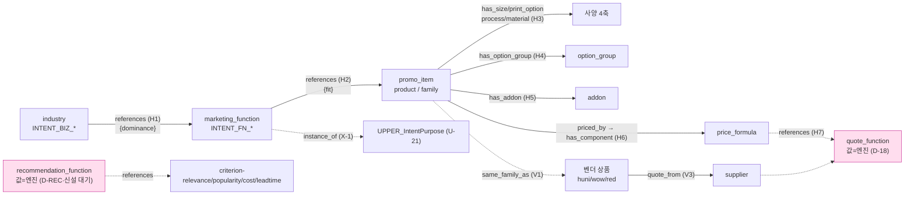

# 프린틀리 — PART 1 Step 2: 전반부 관계(엣지) 정의

> 작성: 2026-07-04 · Step 1(엔티티 그릇) + 전반부 명세(02) 위에서 진행.
> **[HARD] 이 문서는 전반부 흐름의 엣지 정형화까지다.** 제약(Step 3)·후반부 브릿지(PART 2) 미진입.
> 원칙: ①온톨로지=유일 진실원본 ②3추론 분리(선언=온톨로지·절차=에이전트·결정론=엔진) ③AI 값 판단 금지(견적/랭킹 값=엔진) ④근거 node_id ⑥search-before-mint(기존 엣지 재사용·중복 mint 금지).
> **search-before-mint 결과: 전반부 전 전이가 기존 엣지로 표현됨 — 신규 엣지 0.** 신규 후보 1건(recommendation_function 경계 노드)만 지니 확정 대기.

---

## 0. Step 2 목표와 경계

**목표**: 전반부 흐름 `업종 → (추천) 홍보물 → (사양) 4축 → (견적)`의 각 전이를 **기존 온톨로지 엣지에 정확히 매핑**하고, 다중벤더 비교 경로(§35)를 연결하며, **추천 랭킹·되묻기 정책의 소속 층(온톨로지 vs 엔진 vs 에이전트)을 확정**한다.

**경계(3추론 분리·원칙 2)**:
- **온톨로지(선언)** = 후보를 잇는 엣지·기준 축 노드까지. "무엇이 무엇과 연결되나."
- **엔진(결정론)** = 값 계산. 견적값=`quote_function`(evaluate_price 등), 랭킹 점수·정렬=추천 엔진(D-REC). "얼마·몇 순위."
- **에이전트(절차)** = 되묻기(clarification)·대화 흐름. "무엇을 더 물어볼까." 그래프 엣지 아님.

**[HARD] 값 금지 재확인**: 추천 순위·견적 금액을 LLM이 지어내면 버그(원칙 3). 온톨로지는 후보 집합과 순위 기준 축만 제공.

---

## 1. 전반부 엣지 체인 — 기존 엣지 재사용 매핑 (핵심)

전반부 순회를 홉(hop) 단위로 분해하고 각 전이를 §33/§35 폐쇄목록 엣지에 매핑한다.

| 홉 | 전이 (source → target) | 재사용 엣지 | 유래 | 한정자(qualifier) | 신규? |
|---|---|---|---|---|---|
| H1 | 업종 `industry` → 마케팅기능 `function` | **R19 `references`** | §33 | `dominance`(지배도: 이 업종에서 이 기능이 얼마나 핵심) | 재사용 |
| H2 | 마케팅기능 `function` → 홍보물 `product`/`product_family` | **R19 `references`** | §33 | `fit`(적합도 등급: primary/secondary) | 재사용 |
| H3 | 홍보물 `product` → 사양 축 | **R2 `has_size`·R4 `has_print_option`·R5 `has_process`·R3 `uses_material`·R6 `has_plate_size`·R7 `has_qty_rule`** | §33 | (§33 그대로: mand/opt 등) | 재사용 |
| H4 | 홍보물 `product` → 옵션 그룹 `option_group` | **R10 `has_option_group` · R11 `option_refs`** | §33 | 손님 선택 축(사양이 옵션으로 노출될 때) | 재사용 |
| H5 | 홍보물 `product` → 추가상품 | **R14 `has_addon`** | §33 | 봉투·부자재 등 | 재사용 |
| H6 | 홍보물 `product` → 가격공식 `price_formula` → 구성요소 | **R8 `priced_by` · R9 `has_component`** | §33 | 후가공 기여 포함(§27/§18 배선) | 재사용 |
| H7 | 견적 값 계산 (경계) | **E19 `quote_function`** 참조(R19) | §35 | 값=서버(evaluate_price)·온톨로지 밖(D-18) | 재사용 |

**판정: 전반부 흐름 전 전이가 기존 엣지로 표현된다. 신규 엣지 mint 0** — H1~H2는 §33 intent→product 연결의 유일 메커니즘 `references`(R19·any→any 약참조)를 그대로 쓴다(nl-query-paths 유형 2와 동일). 마케팅 기능을 중간 홉으로 넣어 "업종별 지배 기능 → 그 기능이 적합한 홍보물"의 2단 필터를 만든다.

### 1.1 `references` 한정자 확장 (신규 엣지 아님·엣지 속성만)

R19 `references`는 §33에서 이미 한정자(qualifier)를 받을 수 있다(예: `has_component`의 disp_seq/addtn). 전반부 추천 홉에 **순위 신호를 엣지 한정자로 부착**한다 — 값이 아니라 정렬 신호(축):

```yaml
# 업종 → 기능 (H1)
- {rel: references, target: INTENT_FN_RETAIN, qualifier: {dominance: primary}}   # 미용실=단골관리 지배
- {rel: references, target: INTENT_FN_IDENTITY, qualifier: {dominance: secondary}}
# 기능 → 홍보물 (H2)
- {rel: references, target: product-쿠폰, qualifier: {fit: primary}}
- {rel: references, target: product-스탬프적립카드, qualifier: {fit: primary}}
```
- `dominance`/`fit`은 **순위 신호(축)이지 최종 점수가 아니다.** 정렬 계산은 엔진(§4). 한정자 = 온톨로지가 제공하는 결정론 입력.
- 한정자 어휘(`dominance`: primary|secondary|tertiary / `fit`: primary|secondary)는 폐쇄 소집합 — 자유 서술 금지(원칙 4·근거 강제).

---

## 2. 마케팅 기능 = intent 노드 (intent_kind 확장·키스톤·신규 개체 0)

전반부 추천의 중간 홉인 **원자 마케팅 기능 8**(IDENTITY·ACQUIRE·RETAIN·DISPLAY·BRAND·EVENT·SIGN·FORM)을 어떻게 모델링하나?

**결정: 신규 개체를 만들지 않고 §33 `intent`(E-intent) 재사용 — `intent_kind=marketing_function`.**

| 판단 | 근거 |
|---|---|
| 신규 엔티티 미신설 | §33 intent가 이미 `intent_kind`(occasion\|industry)를 **속성으로 접는** 패턴 확립(노드 폭증 방지). `marketing_function` 값 1개 추가 = 일관 확장(search-before-mint) |
| 노드로는 실재해야 함 | 업종→기능→홍보물 2단 필터가 그래프 순회로 되려면 기능이 **노드**여야 함(속성이면 순회 불가). intent 노드로 실재 |
| id 체계 | `INTENT_FN_IDENTITY`·`INTENT_FN_ACQUIRE`·… 8종. `INTENT_BIZ_*`(업종)와 동일 접두 체계 아래 `_FN_` 구분 |
| 앵커 | `none`(+사유="마케팅 기능 축·§33 intent KB전용 레이어") · badge=candidate · N≥3 승격(Step1 tykimos 규칙) |
| 키스톤 연결 | 이것이 MEMORY 기록 "intent 원자 분해 미완(AliCoCo)"의 전반부 실현 — 업종 intent가 기능 intent로 분해되는 첫 배선 |

**2층 정합(§35)**: `INTENT_FN_*`·`INTENT_BIZ_*` 모두 상위 개념 `UPPER_IntentPurpose`(U-21)에 `instance_of`(X-1). 브랜드-중립 — 벤더 무관 추천 축.

**[HARD] 지어내기 차단**: 기능→홍보물 매핑(H2)은 §33 intent 코퍼스·용어집 근거로만 기록(G-FRONT-1). 근거 없는 references 엣지 금지(원칙 4).

---

## 3. 다중벤더 확장 — 홍보물 → 벤더별 견적 비교 (§35 재사용)

프린틀리 정체 = 다중벤더 브로커(§1-C). 전반부 마지막에서 **한 홍보물(브랜드-중립) → 벤더별 실물 상품 → 벤더별 견적**으로 펼친다. 전부 §35 기존 엣지.

| 홉 | 전이 | 재사용 엣지 | 유래 |
|---|---|---|---|
| V1 | 홍보물(브랜드-중립) `product_family` ↔ 벤더 상품 `product`(huni/wow/red) | **X-3 `same_family_as`** | §35 |
| V2 | 벤더 상품 → 벤더 `supplier` | **RT-2 `can_produce`**(포섭 필터·후보) | §35 라우팅 |
| V3 | 주문/상품 → 벤더 `supplier` 견적 (경유 quote_function) | **RT-5 `quote_from`** | §35 라우팅 |
| V4 | 견적 값 | 각 supplier의 **E19 `quote_function`**(후니=evaluate_price·와우=jobcost·레드=WebToProduct 엔진) | §35 |

- **전반부 = 견적 비교까지**(quote_from). 실제 **어느 벤더에 주문 넘길지(RT-4 `routed_to`)는 후반부/라우팅** — 전반부 밖(경계 명확).
- 값 이원성 유지: `quote_from` 엣지=온톨로지("이 벤더에게 견적 받는 관계"), 값=`quote_function` 엔진(D-18/D-ROUTE). LLM 값 추정 금지.
- **레드 벤더** = `red-supplier-*` + 지니 WebToProduct 엔진을 `quote_function`으로 연결(구조=§35 라우팅·엔진=지니 특허). 현재 공급자 데이터 부재로 전 노드 candidate+gap_ref=G-ROUTE-1(§35 닫힌세계 승계).

---

## 4. 추천 랭킹 = 경계 (D-REC · D-18/D-ROUTE 동형)

**"업종에 뭐가 좋아?"의 순위 매기기를 어디서 하나?** → **온톨로지는 후보+기준 축까지, 정렬 값은 엔진.** 가격(D-18)·라우팅(D-ROUTE)과 완전 동형.

```
온톨로지 (KB)                                  |  엔진 (권위·D-REC)
-----------------------------------------------|--------------------------------
· references 엣지(업종→기능→홍보물·후보 집합)     |
· 엣지 한정자(dominance·fit·순위 신호=축)         |  · 신호 → 점수 계산·정렬
· 랭킹 기준 축 노드(criterion 재사용·§4.1)        |  · 최종 추천 순위(값·개수 N)
· recommendation_function 경계 노드(값=엔진)      |
```

- **판정 기준**: 온톨로지가 후보를 좁히고(references 2단 필터) 순위 기준 축을 제공하면 임무 완료. "1위가 뭐고 몇 개 보여줄지"는 엔진/에이전트. KB는 순위 값 계산·저장 안 함.
- **근거**: §35 라우팅 D-ROUTE("semantic matching→optimization 2단")·§33 D-18("축·연결까지·값은 엔진")과 동형.

### 4.1 랭킹 기준 축 = criterion 노드 재사용 (신규 개체 최소)

추천 순위 기준(관련성·인기·마진 등)은 §35 `criterion-*`(U-26·upper_concept 재사용) 패턴을 그대로 차용:

| criterion 노드(E-U) | 정의 | 재사용/신규 |
|---|---|---|
| `criterion-relevance` | 업종-기능-홍보물 적합도(dominance·fit 신호 종합) | 신규 축(전반부 특화·anchor=none+표준 이름표 대기) |
| `criterion-popularity` | 해당 업종에서 실주문 빈도 | 신규 축(데이터=벤더 통계·현재 GAP) |
| `criterion-cost` | 견적 낮음 | **§35 U-26.1 재사용** |
| `criterion-leadtime` | 납기 빠름 | **§35 U-26.2 재사용** |

- 5원칙 "중복 mint 금지" 준수 — cost·leadtime은 §35 라우팅 criterion 재사용. relevance·popularity만 전반부 신규(추천 특화).

### 4.2 `recommendation_function` 경계 노드 — 지니 확정 대기 (신규 후보)

`quote_function`(E19)·`routing_function`(E25) 선례와 동형으로, 추천 순위 값 경계를 그래프에 명시하는 노드 신설을 **제안**한다:
- `recommendation_function`(anchor=none·표준 공백·값=엔진·D-REC). input_criteria=§4.1 criterion 참조(R19).
- **찬성**: 원칙 3 경계(랭킹=엔진)를 그래프에 명시·두 경계 노드와 일관. **반대**: 전반부는 아직 엔진 미구현이라 과-mint일 수 있음(enforce simplicity).
- → **지니 확정(2026-07-04) = 보류.** 경계 규칙(D-REC)만 문서로 유지, 노드 신설은 추천 엔진 구현 시점까지 미룸(§9 확정 참조).

---

## 5. 되묻기(clarification) = 에이전트 절차 (온톨로지 밖·원칙 2)

**"뭐가 좋아?"에 바로 답할지, 되물을지**는 대화 절차 = **에이전트 소관**(3추론 분리: 절차=에이전트). 그래프 엣지 아님.

- **트리거(되묻기 발동)**: ① 업종 미상(intent 노드 미확정) ② 지배 기능 다수 동률(dominance 동급 N개) ③ 후보 홍보물 과다(임계 초과) ④ 사양 필수 축 미선택(견적 불가).
- **되묻기 재료는 온톨로지가 공급**: "어떤 축이 비었나"는 그래프가 안다(예: `has_size` 미선택 → 규격 되묻기). 즉 **되물을 거리=온톨로지, 되물을지 여부·문구·횟수 N=에이전트 정책**.
- **되묻기 N 정책**(최대 되묻기 횟수·언제 후보를 그냥 보여줄지)은 **PART 3 지니 확정 대기**(G-FRONT-2). 구조는 여기까지, 정책 값은 지니.
- **[HARD] 거절 경로 승계**(§33 nl-query 유형 5): 범위 밖(주문·배송 값·경쟁사 가격 복제)은 `RULE_scope_boundary`로 정직 거절 — 되묻지 않고 경계 고지.

---

## 6. 전반부 순회 경로 재-증명 (예시·엣지 정형 반영)

```
"미용실 오픈, 단골 관리용 뭐가 좋아?"
 [1단 노드] "미용실" → INTENT_BIZ_beauty  (intent_kind=industry)
 [H1 references] → INTENT_FN_RETAIN {dominance: primary}  (단골관리 지배 기능)
 [H2 references] → {product-쿠폰, product-스탬프적립카드, product-쿠폰명함} {fit: primary}
 [4.1 기준축] criterion-relevance/popularity → (엔진 D-REC) → 순위 N개 제시   ← 값=엔진
 [H3 has_size/print_option/process/material] → 각 홍보물 사양 축
 [H4 has_option_group] → 손님 선택 노출
 [V1 same_family_as] → {huni·wow·red 벤더 상품}                              ← 다중벤더
 [H6 priced_by → H7 quote_from] → 벤더별 quote_function (evaluate_price 등)  ← 값=엔진
 답: 단골관리 홍보물 후보(순위·근거 node_id) + 사양 + 벤더별 견적 비교
```
- 그래프에 없으면 **GAP 정직 고지**(지어내기 금지). 값(순위·금액)은 전부 엔진 위임 표기.
- 되묻기 예: 업종만 말하고 목적 불명확 → `INTENT_BIZ_beauty`의 dominance 동률 기능 다수 → 에이전트가 "매장 홍보용인가요, 단골 관리용인가요?" 되물음(재료=dominance 동급 노드·§5).

---

## 7. GAP · 지니 결정 대기 (PART 3)

| # | 항목 | 상태 |
|---|---|---|
| G-REL-1 | H1/H2 references는 §33 intent 코퍼스 기준(와우/레드 미보강·후니 우선) | G-FRONT-1 승계 |
| G-REL-2 | 마케팅 기능 8종 `INTENT_FN_*` = 형(型)만·근거 N≥3 승격 전 candidate | 인스턴스 데이터 대기 |
| G-REL-3 | **추천 랭킹 정책**(criterion 가중·recommendation_function 노드 신설 여부·순위 N) | **지니 확정 대기** |
| G-REL-4 | **되묻기 N 정책**(최대 횟수·후보 노출 임계) | **지니 확정 대기** |
| G-REL-5 | 벤더 실물(supplier·can_produce·quote_from)은 §35 G-ROUTE-1 공급자 데이터 부재로 candidate | §35 승계 |

---

## 8. mermaid — 전반부 엣지 체인



> 실선=온톨로지 확정 엣지(재사용) · 점선=경계/2층/신설대기. 분홍=엔진 경계 노드(값=엔진·온톨로지 밖).

---

## 9. 지니 확정 (2026-07-04 · PART 4 게이트 통과)

**만든 것**: 전반부 엣지 체인 정형화(H1~H7·V1~V4 전부 기존 엣지 재사용·신규 엣지 0)·마케팅 기능 intent 노드화 결정(신규 개체 0)·추천 랭킹/되묻기 층 분리(온톨로지 vs 엔진 vs 에이전트).

**지니 확정 결정**:
- (1) ✅ **마케팅 기능 `INTENT_FN_*` 노드화 승인**(§2). — 라이브 길찾기 실증: "오픈 기념 나눠줄 거"가 기능 노드(돌리기/유치)를 반드시 거쳐 프리미엄엽서(PRD_000016)에 도착. 기능이 점이 아니면 경로 불성립.
- (2) ✅ **`recommendation_function` 경계 노드 = 보류**(§4.2). 경계 규칙(D-REC)만 유지·추천 엔진 구현 시 신설 재검토.
- (3) ✅ **다음 = Step 3 제약 정의**로 진행.

**라이브 검증(생성≠검증)**: 대표 질의 2건을 실엔진(evaluate_price)으로 종단 실측 — A 프리미엄엽서 100장=9,424원/500장=24,378원(source=FORMULA), B 단골관리 후보 3종(쿠폰 10,177/10,913·만년스탬프 900,000). 후보 간 가격 성격 격차(만원 vs 90만원)가 **결정 2(순위 계산기 필요)·되묻기 정책의 근거**를 실데이터로 확증. → `_map/master-map.html`·본 문서 관계 정의가 라이브 노드에 그대로 먹힘.

**다음**: Step 3 제약 정의(사양 조합 제약·`constrains` R12·CN-1~CN-6) → 전반부 완결.

## 근거 (재사용·읽기)
- §33 `_workspace/huni-ontology-kb/02_ontology/ontology-schema.md`(R1~R19 폐쇄목록·intent/references) · `nl-query-paths.md`(유형 2 용도 추천·유형 5 거절)
- §35 `_workspace/huni-multibrand-ontology/03_upper_ontology/upper-ontology-schema.md`(X-1 instance_of·X-3 same_family_as·E19 quote_function·U-21 IntentPurpose) · `routing-layer-schema.md`(RT-2 can_produce·RT-5 quote_from·criterion U-26·D-ROUTE 경계)
- 프린틀리 `01_step1-entities.md`(7엔티티·§1-C 다중벤더) · `02_front-half-spec.md`(전반부 흐름 R1~R3)
