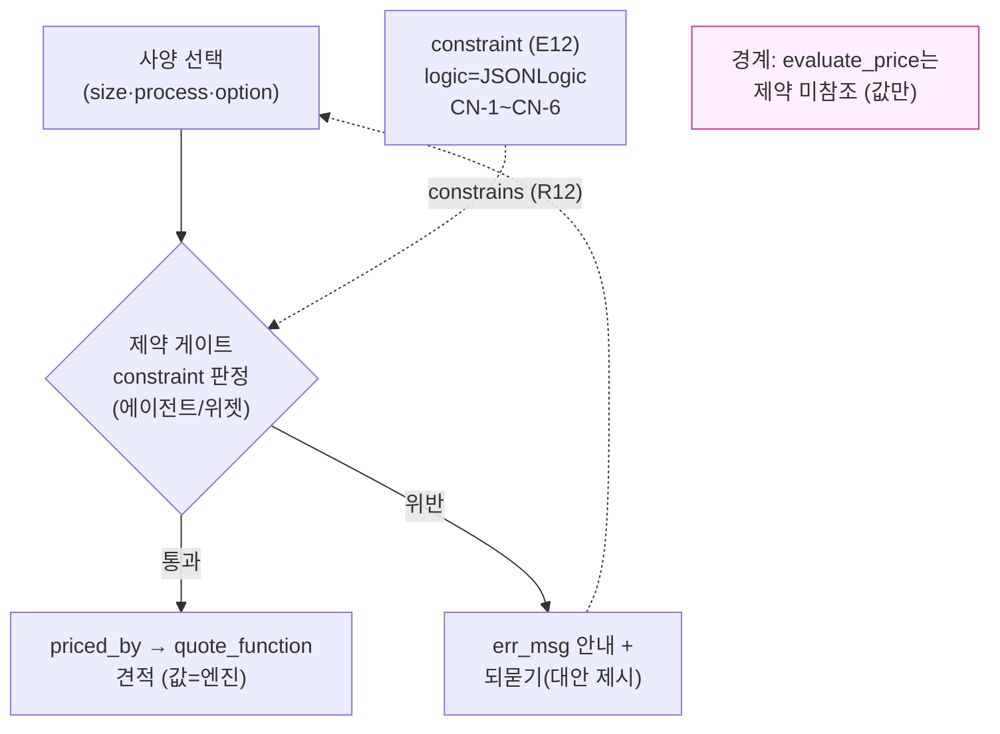

# 프린틀리 — PART 1 Step 3: 전반부 제약(안 되는 조합) 정의

> 작성: 2026-07-04 · Step 2(관계 정의) 확정 위에서 진행. 전반부(업종→추천→사양→견적) 완결 단계.
> **[HARD] 이 문서는 "안 되는 조합"을 어떤 그릇·엣지로 표현하는지까지다.** 실제 제약 규칙 대량 작성(§31 하네스)·후반부 브릿지(PART 2) 미진입.
> 원칙: ②3추론 분리(제약 판정 실행=절차/에이전트·엔진 아님) ③AI 값 판단 금지 ④근거 node_id ⑥search-before-mint(§33 E12·R12·§31 CN 분류 재사용·신규 0).
> **라이브 실재 확인**: `t_prd_product_constraints` 26건/15상품·`logic`(JSONLogic)·`rule_typ_cd` 3종·`err_msg` 안내문구 실측.

---

## 0. Step 3 목표와 경계

**목표**: 고객이 사양을 고를 때 **말이 안 되는 조합**(예: 이 사이즈엔 이 후가공 불가)을 온톨로지가 알고, 추천·되묻기 단계에서 **잘못된 조합·오견적을 막도록** "제약"을 그릇·엣지로 정형화한다.

**경계(3추론 분리·§33 constraint-builder 계약 승계)**:
- **온톨로지(선언)** = "어떤 조합이 제약인가"를 노드·엣지로 기술(E12 constraint·R12 constrains·JSONLogic shape).
- **검증 실행(절차)** = 제약을 실제로 **판정**하는 것은 위젯/주문/AI 에이전트. **[HARD] evaluate_price는 제약을 참조하지 않는다**(§33 constraint-builder-contract: 가격엔진은 값만·validate는 위젯/주문). 즉 제약은 "가격 계산 전" 조합 유효성 게이트.
- **AI 경계(원칙 3)** = 에이전트는 제약을 **지어내지 않고** 그래프의 constraint 노드를 읽어 판정·되묻기. 근거 없는 차단/허용 금지.

---

## 1. 재사용 매핑 — 신규 0 (search-before-mint)

전반부 제약 전부가 §33 기존 그릇·엣지로 표현된다.

| 요소 | 재사용 | 유래 | 라이브 실재 |
|---|---|---|---|
| 제약 노드 | **E12 `constraint`** | §33 | ✅ `t_prd_product_constraints` 26건 |
| 제약 엣지 | **R12 `constrains`** (constraint → option_group\|product) | §33 | ✅ prd_cd 배선 |
| 제약 로직 | `logic` = **JSONLogic**(폼빌더 정형 shape) | §31 | ✅ 26건 실측(`{"!":{"and":[...]}}` 등) |
| 제약 유형 | `rule_typ_cd` 3종(.01/.02/.03) | §31 | ✅ 실재(정확 의미=§31 대조·아래 CN으로 접근) |
| 안내 문구 | `err_msg`(차단 시 손님 안내) | §33 | ✅ 실측 |
| 필요상황 분류 | **CN-1~CN-6** | §31 | (분류 체계·재사용) |

**판정: 제약 표현에 신규 개체·엣지 0.** §33 E12/R12 + §31 CN 분류를 그대로 쓴다.

---

## 2. CN-1~CN-6 — 전반부에 어떤 제약이 필요한가 (§31 재사용)

§31 제약 하네스의 "제약 필요상황" 6분류로 전반부 파일럿 홍보물을 훑는다. **규정 먼저·규칙 나중**(§31 directive).

| CN | 상황(쉬운 말) | 도구 결정 | 전반부 예 |
|---|---|---|---|
| **CN-1** | 물리적으로 불가능한 조합 | E12 constraint(금지) | "이 사이즈엔 이 후가공 물리 불가" |
| **CN-2** | 단가행이 없어 조합이 엇갈림 | 먼저 가격갭(§27)·불가피하면 constraint | 선택은 되는데 그 조합 단가가 비어 견적 0 → 차단 or 갭 |
| **CN-3** | 필수 동반(A 고르면 B 강제) | constraint(강제) or 옵션그룹 필수 | "박 선택 시 코팅 필수" 류 |
| **CN-4** | 상호 배제(A·B 동시 불가) | constraint(배제) | "유광코팅+무광코팅 동시 불가" |
| **CN-5** | 범위·증분 제약 | 옵션그룹 min/max/incr 우선·초과분만 constraint | "수량 100 단위·최소 15" |
| **CN-6** | 옵션그룹이 제약 역할 대행(오용) | 제약으로 이관 | 옵션그룹으로 막던 조합을 constraint로 정본화 |

- **도구 우선순위(§31)**: ①자재/차원 모델링으로 해결되면 제약 안 씀 → ②옵션그룹 min/max로 되면 그걸로 → ③그래도 남는 조합만 E12 constraint. **과잉 제약 금지**(오차단 0이 목표).
- 전반부 파일럿(명함·엽서·쿠폰·스티커)의 실제 CN 후보는 §31 산출·라이브 26건 대조로 확정(생성≠검증).

---

## 3. 제약 ≠ 다른 층 (경계 명확 · 오분류 방지)

"안 되는 것처럼 보이는" 상황을 전부 제약으로 몰면 안 된다. 층을 가른다 — 이게 이번 길찾기(B)가 준 교훈의 정형화:

| 증상 | 올바른 층 | 왜 |
|---|---|---|
| 물리·조합 불가 | **E12 constraint**(Step 3) | 진짜 "안 되는 조합" |
| 이 벤더가 그 사양을 아예 못 만듦 | **RT-2 `can_produce` / 능력**(§35 라우팅) | 벤더 역량 문제(조합은 유효) |
| 단가행이 비어 견적 0 | **가격 갭(§27 배선)** | 데이터 미적재이지 제약 아님 |
| 만년스탬프 100개=90만원(비현실 수량) | **추천·되묻기**(Step 2 §5) | 유효한 견적·용도/수량 맥락 문제 |
| 수량 최소·증분 | **옵션그룹 min/max/incr**(CN-5) | 제약보다 수량규칙이 정본 |

- **[HARD] 오분류 금지**: B 길찾기의 "90만원"은 **제약이 아니다** — 유효한 계산 결과이고, 되묻기로 수량·용도를 좁혀야 할 추천층 사안. 제약으로 막으면 정상 주문(스탬프 대량 발주)까지 차단하는 오차단.

---

## 4. 다중벤더 제약 (§35 정합)

제약은 **브랜드 실물 층**에 붙는다(벤더마다 다를 수 있음).

- 같은 사양 조합이 후니에선 유효, 와우에선 불가일 수 있다 → 각 벤더 product에 자기 E12 constraint(brand 속성). 브랜드-중립 상위(same_family_as)로 묶되 **제약 판정은 벤더별**.
- "벤더가 아예 그 축을 못 만듦"은 제약이 아니라 **능력(can_produce·§3 경계표)**. 제약(조합 불가) vs 능력(역량 없음)을 벤더 비교에서 구분.
- 전반부 벤더 비교(V1~V4)에서 제약·능력 둘 다 후보를 거른 뒤 견적 비교.

---

## 5. 폼빌더 정형 shape [HARD] (§31 규칙 승계)

- `logic`은 **UI 폼빌더에서 확인·조정 가능한 정형 shape로만** 작성 — raw JSONLogic 손코딩 금지(§31 [HARD]). 라이브 26건이 `{"!":{"and":[{"===":[{"var":"siz_cd"},"SIZ_..."]}, ...]}}` 형태의 정형이라 폼빌더로 역편집 가능.
- 각 제약은 `err_msg`(손님 안내 문구) 필수 — 차단만 하고 왜인지 안 알려주는 제약 금지.
- 근거·유형(CN) 병기 — 제약도 근거 없는 mint 금지(원칙 4).

---

## 6. 전반부 순회에 제약 끼우기 (Step 2 경로 + 제약 게이트)

```
… (Step 2) 홍보물 → has_size/has_process/has_option_group → 사양 선택
   ↓  [제약 게이트]  ← 여기서 constraint 판정 (에이전트/위젯, 엔진 아님)
   constraint --constrains--> {option_group|product}  로직 평가(JSONLogic)
     ├─ 통과 → priced_by → quote_function (견적)
     └─ 위반 → err_msg 안내 + 되묻기("그 조합은 안 돼요, 대신…")
```
- 제약 게이트는 **가격 계산 앞단**(evaluate_price 미참조·§0 경계). 유효 조합만 견적으로 넘어감.
- 위반 시 = 차단이 아니라 **되묻기 재료**(Step 2 §5) — "안내 + 대안 제시". 원칙 5(막다른 길 금지).

---

## 7. GAP · 확정 대기

| # | 항목 | 상태 |
|---|---|---|
| G-CN-1 | 전반부 파일럿(명함·엽서·쿠폰·스티커)의 실제 CN 후보 목록 | §31 산출·라이브 26건 대조 후 확정 |
| G-CN-2 | `rule_typ_cd` .01/.02/.03 정확 의미 | §31 제약 하네스 대조(금지/필수/배제 추정·미확정) |
| G-CN-3 | 벤더별 제약(와우/레드) | 벤더 데이터 확보 후(§35 G-ROUTE-1 승계) |
| G-CN-4 | 제약 vs 능력(can_produce) 실배선 경계 | 라우팅 층 데이터 확보 후 |

---

## 8. mermaid — 제약 게이트



> 제약 = 가격 계산 **앞단** 유효성 게이트. 판정 실행=에이전트/위젯, 값=엔진. 둘의 경계가 §33 constraint-builder 계약.

---

## 9. 다음 확인받을 것 (PART 4 규칙 3)

**만든 것**: 전반부 제약 정형화 — E12 constraint·R12 constrains·JSONLogic·CN-1~CN-6 전부 재사용(신규 0)·제약 vs 능력/가격갭/되묻기 층 경계 확정·다중벤더 제약 정합·제약 게이트(엔진 앞단).

**→ 전반부(업종→추천→사양→제약→견적) 관계·제약 설계 완결.** PART 1(온톨로지 설계) Step 0~3 종료.

**다음 후보**:
- (a) **PART 2 브릿지(잡티켓)** — 확정 사양을 후반부 생산으로 넘기는 데이터 계약(WebToProduct 20단계 중반·덱 핵심 엔진).
- (b) **R3 실화면 점검** — 파일럿 홍보물의 후가공 견적 반영을 webadmin 가격시뮬레이터로 확인(일부는 이번 길찾기로 실증됨).
- (c) **전반부 파일럿 인스턴스화** — 명함·엽서·쿠폰·스티커의 실 노드(INTENT_FN·constraint 등)를 candidate로 채워 종단 시뮬레이터(시스템 Stage 2) 재료화.

## 근거 (재사용·읽기)
- §33 `ontology-schema.md`(E12 constraint·R12 constrains·JSONLogic·CN 참조) · `nl-query-paths.md`(유형 4 옵션 조합·제약)
- §31 제약 하네스 `.claude/rules/harness/huni-constraint-rules.md`(CN-1~CN-6·폼빌더 정형 shape·오차단 0) · MEMORY [[constraint-builder-contract-demo-260702]](evaluate_price 제약 미참조)
- §35 `routing-layer-schema.md`(RT-2 can_produce·제약 vs 능력 경계)
- 라이브 `t_prd_product_constraints` 26건/15상품 실측 · 프린틀리 `03_step2-relations.md`(제약 게이트=Step 2 순회 뒤단)
