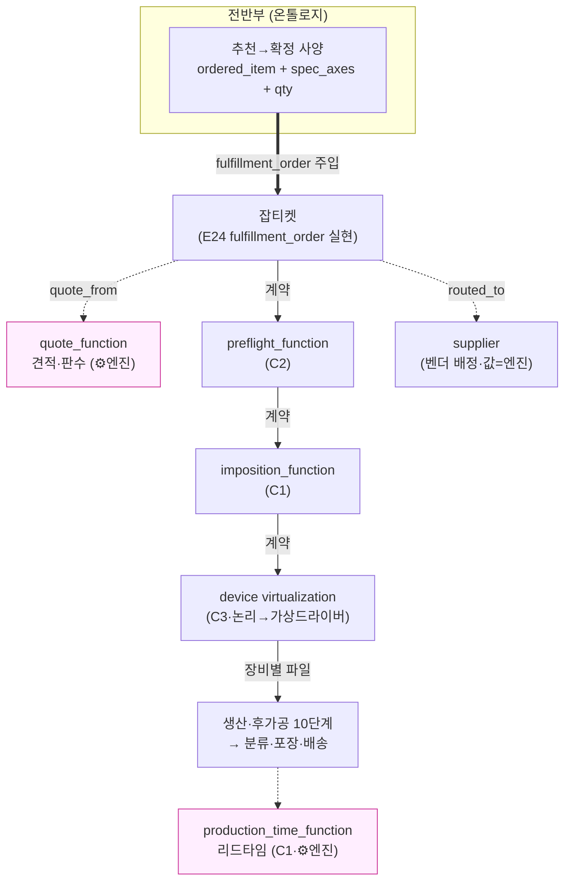

# 프린틀리 — PART 2 (1): 브릿지 = 잡티켓 데이터 계약

> 작성: 2026-07-04 · PART 1(온톨로지 설계 Step 0~3) 완결 위에서 진행. WebToProduct 20단계 중 **WEB↔PRODUCT를 잇는 다리** = 덱의 핵심 엔진(잡티켓).
> **[HARD] 이 문서는 잡티켓 데이터 계약(그릇+필드+계약 연쇄)까지다.** 런타임 루프(에이전트 오케스트레이션)·실 엔진 구현은 후속(PART 2-2·PART 3).
> 원칙: ②3추론 분리(잡티켓=선언 담체·계산=엔진) ③AI 값 판단 금지(견적/판수/리드타임=엔진·잡티켓은 담을 뿐) ④근거 node_id ⑥search-before-mint(§35 E24 fulfillment_order 재사용·신규 그릇 0).
> **라이브 접지**: 잡티켓 사양 담체 = `evaluate_price(target, selections, qty)`의 `selections` 실계약(`{plt_siz_cd·siz_cd·mat_cd·print_opt_cd·proc_sels}`)과 동형 — Step 2 길찾기에서 실측·실견적(9,424원) 확인.

---

## 0. 브릿지가 무엇이고 무엇이 아닌가

**브릿지(잡티켓)** = 전반부에서 **확정된 주문 사양**을 후반부(생산)로 넘기는 **데이터 계약**. 주문 하나가 생산 전 공정을 관통하는 단일 담체(덱 §3 "Evolution of Job Ticket").

**경계(3추론 분리)**:
- **잡티켓 = 선언 담체(declarative carrier)** — "이 주문은 무엇인가"(상품·사양·수량·벤더·파일). **계산하지 않는다.**
- **엔진이 채우는 계산 필드** — 견적(quote_function)·판수(fn_calc_pansu)·리드타임(production_time_function). 잡티켓은 **엔진 산출을 담을 뿐**(원칙 3). AI가 이 값을 지어내면 버그.
- **AI/에이전트 = 선언 필드 채움 + 엔진 호출 오케스트레이션**(런타임 루프·PART 2-2). 계산·최적화 판단 금지.

**아닌 것**: 잡티켓은 가격 계산기도, 생산 엔진도 아니다. **계약(스키마)**이다. 각 엔진이 이 계약을 읽어 다음 산출을 만든다(계약 연쇄).

---

## 1. 잡티켓 그릇 = §35 `fulfillment_order`(E24)의 런타임 실현 (신규 0)

search-before-mint: 잡티켓을 위한 새 그릇을 만들지 않는다. §35가 이미 **주문 담체**를 형(型)으로 뒀다.

| 잡티켓 | 재사용 그릇 | 유래 | 상태 |
|---|---|---|---|
| 주문 담체(형) | **E24 `fulfillment_order`**(U-25·`ford-*`) | §35 라우팅 | 형만·런타임(G-ROUTE-3 접합점) |
| 담긴 상품 | `ordered_item` → **product**(E1) | §33 | ✅ 라이브 |
| 담긴 사양 | `spec_axes` = **evaluate_price selections** | §33/엔진 | ✅ 라이브 실계약 |
| 중개자 | `broker` = brand-huni(RT-7 접기) | §35 | 고정 |
| 벤더 배정 | `routed_to`(RT-4)·`quote_from`(RT-5) | §35 | 형만 |
| 상태 | `status`(런타임) | §35 | 런타임 |

- **잡티켓 = fulfillment_order 인스턴스가 런타임에 채워진 것.** §35 E24는 "형만(런타임 경계)"이라 했는데(G-ROUTE-3), **바로 이 브릿지가 그 접합점**이다 — 전반부 추천→확정 사양이 fulfillment_order 형에 주입되면 잡티켓이 된다.
- 덱의 잡티켓 필드(생산 특화)는 E24를 **확장**(WebToProduct 생산 필드 추가)한다. 새 그릇이 아니라 E24 속성 확장.

---

## 2. 잡티켓 필드 — 누가 채우나 (선언 vs 엔진 vs 고객 vs 파일)

덱 §3 잡티켓 필드를 **채우는 층**으로 가른다. 이게 원칙 3 경계의 핵심 — 어떤 칸은 온톨로지·에이전트가, 어떤 칸은 **엔진만** 채운다.

| 잡티켓 필드(덱) | 채우는 층 | 근거/엔진 |
|---|---|---|
| 아이템(홍보물) | **온톨로지(전반부)** | product 노드(H2 추천 확정) |
| 용지·재단사이즈·색·후가공(사양) | **온톨로지(전반부 확정)** | spec_axes = evaluate_price `selections`(라이브 실계약) |
| 주문수량 | **고객/전반부** | qty |
| **견적(금액)** | **⚙️ 엔진** | `quote_function`(evaluate_price·9,424원 실증) — 잡티켓은 담을 뿐 |
| **인쇄필요매수(판수)** | **⚙️ 엔진** | `fn_calc_pansu`/`plate_qty`(⌈수량/판걸이수⌉·라이브 실증) |
| **조판시각·리드타임·요일** | **⚙️ 엔진** | `production_time_function`(C1·Path 복잡도→시간) |
| 고객명·연락처·배송지·배송방법 | **고객(커머스)** | 주문/회원(⑤ 커머스·범위 외 접합) |
| 파일명·파일수신시각 | **파일 업로드** | 고객 업로드(④ preflight 입력) |
| 비고·메모 | 자유 텍스트 | — |

- **[HARD] 계산 필드 3종(견적·판수·리드타임)은 엔진 전용.** 잡티켓·에이전트는 담체·호출까지. LLM이 이 숫자를 지어내면 원칙 3 위반.
- 사양 담체가 evaluate_price `selections`와 **동형**이라, 전반부 확정 → 잡티켓 → 견적 재계산이 무손실(같은 계약). Step 2 길찾기가 이를 실증.

---

## 3. 계약 연쇄 — 잡티켓이 관통하는 후반부 (WebToProduct 중반)

잡티켓 하나가 후반부 공정을 관통하며 **각 엔진이 잡티켓을 읽어 다음 산출**을 만든다(각 홉=계약). 덱 20단계 중 ④~⑳.

```
[전반부 확정]  ordered_item + spec_axes + qty  (온톨로지)
      │  ← 잡티켓 생성(fulfillment_order 주입)
      ▼
④⑤ preflight   ── preflight_function(C2·커팅 특화) ──▶ 생산적합 파일
      ▼
⑥   imposition ── imposition_function(C1·판걸이+다중주문 배치) ──▶ 터잡기 배치
      ▼
⑦⑧ 파일분리·변환 ── device virtualization(C3·논리→가상드라이버) ──▶ 장비별 입고 파일
      ▼
⑨~⑰ 생산·후가공(순서 10단계: 인쇄→라미→스코딕스→커팅→라운드→접지→제본→…)
      ▼
⑱⑲⑳ 분류·포장·배송 ── production_time_function(C1) ──▶ 리드타임·출고
```
- **후가공 순서 10단계**(덱 §3)가 생산 파이프라인의 뼈대 — 잡티켓의 process 축(§33 E6)이 이 순서로 전개.
- 각 화살표 = 계약(앞 엔진 산출이 뒤 엔진 입력). "계약 연쇄"의 실체.
- **CORE ENGINE 피드백**(덱: CONSTANT BUG FIX·COLLECTING FEEDBACK) = 로드맵 자기개선 루프와 접합(생성≠검증·실패→보강 티켓).

---

## 4. 잡티켓이 부르는 결정론 엔진 (경계 노드·원칙 3·전부 quote_function 동형)

후반부 엔진은 전부 **경계 노드**(anchor=none·값=엔진·표준 공백). Step 1 §1-C에서 추가한 것 + 특허 C1~C3. 온톨로지는 "무엇에 달라지나(축)"까지·값·최적화=엔진.

| 엔진(경계 노드) | 온톨로지가 아는 것(축) | 엔진이 하는 것(값) | 특허 |
|---|---|---|---|
| `preflight_function` | 검사 규칙 축(재단여백·해상도·커팅 가능성) | 통과/반려·원본 수정(중복/초소형 제거·예각 완화·커팅순) | C2 |
| `imposition_function` | 전략 축(n-up·gang/합판·booklet·tiling) | 판걸이수·다중주문 네스팅 최적화 | C1·추가-P2 |
| device virtualization | 논리 출력 계약 축(§5) | 논리→장비별 변환(dpi·회전·포트·오프셋) | C3 |
| `production_time_function` | 시간 영향 축(복잡도·수량·후가공) | Path 분석→리드타임 산출 | C1·추가-P1 |

- 4개 모두 **E19 quote_function / E25 routing_function과 동형 경계** — 값=엔진·anchor=none·표준 공백. 그래프엔 축만, 값은 벤더 엔진.
- 리드타임(production_time)이 ⑦ 배송·라우팅에 시간 축 공급(Step 1 보완-P1·기존 GAP 해소).

---

## 5. 파일포맷 = 논리/가상 2층 (C3 장비 가상화·Step 1 §1-C 승계)

⑦⑧ 파일변환을 **정적 N×M 매트릭스로 두지 않는다**(수정-P1). 3층으로:

```
logical_output_contract   (논리·장비무관 출력 계약: 재단여백·컬러프로파일·해상도·PDF/X)
        │  device virtualization 엔진(C3)
        ▼
device_profile            (dpi 254/500/1016·회전·방식[커터/레이저/오프셋]·포트[USB/Serial/TCP-IP]·변환규칙)
        ▼
물리 출력(장비별 입고 파일: JDF·ZCC·GPGL·PLT·TIFF·PDF…)
```
- **장비 추가 = 가상 드라이버 1개 추가**(전 변환 재배선 X). 덱의 raw 포맷 매트릭스는 가상화 엔진 **내부 구현**이지 온톨로지 1급 모델 아님.
- 온톨로지 = logical_output_contract 축 선언까지 + device_profile 축. 실 변환 값 = 가상화 엔진(C3·CIP4 DeviceCapabilities 정합).

---

## 6. 다중벤더 — 잡티켓 → 벤더 배정 → 벤더 엔진 (§35 재사용)

잡티켓은 브랜드-중립으로 만들고, **벤더 배정 후 각 벤더 엔진**이 소비한다.

| 홉 | 전이 | 재사용 | 벤더별 실체 |
|---|---|---|---|
| 배정 | 잡티켓 —`routed_to`(RT-4)→ supplier | §35 | 값=routing_function(어느 벤더·엔진) |
| 견적 | 잡티켓/상품 —`quote_from`(RT-5)→ 벤더 quote_function | §35 | 후니=evaluate_price·와우=jobcost·레드=**지니 WebToProduct 엔진** |
| 생산 | 잡티켓 → 벤더 생산 파이프라인 | §35 | 후니 생산·와우 생산·레드=지니 C1~C3(preflight/imposition/가상화) |

- **레드 벤더** = 잡티켓을 **지니 WebToProduct 엔진**(특허 C1~C3)에 넘겨 생산. 구조=§35 라우팅·엔진=지니 자산(자유 활용).
- 잡티켓 자체는 벤더 무관(fulfillment_order 형). 벤더별 차이는 배정 후 각 엔진이 흡수(§35 D-18/D-ROUTE 경계).
- 현재 공급자 데이터 부재(G-ROUTE-1)로 벤더 배정은 형만·candidate.

---

## 7. GAP · 확정 대기 (PART 3)

| # | 항목 | 상태 |
|---|---|---|
| G-BR-1 | 잡티켓 정밀 필드 스키마(덱 다이어그램 수준→정형 계약) | 설계까지·실 스키마는 PART 2-2 |
| G-BR-2 | 파일포맷 원천(logical_output_contract 실 축·범례) | **Q5 지니 입력 대기**(장비 매뉴얼/실무 규칙) |
| G-BR-3 | preflight/imposition/production_time 엔진 인터페이스 | **Q7 지니 확정**(신규 구현 vs 기존 도구 래핑) |
| G-BR-4 | 배송 필드(배송방법·리드타임 연동) | **Q6 지니 범위 확정**(1차=리드타임 축만) |
| G-BR-5 | 벤더 배정·벤더별 생산 파이프라인 | 공급자 데이터(G-ROUTE-1)·인간 결정 |
| G-BR-6 | 잡티켓↔커머스(⑤ 고객 필드·주문) 접합 | Shopby 통합(§24)·범위 접합점 |

---

## 8. mermaid — 브릿지(계약 연쇄)



> 굵은 화살표=잡티켓 생성 · 실선=계약 연쇄(엔진→엔진) · 점선=경계 호출(값=엔진). 분홍=계산 엔진(값 지어내기 금지).

---

## 9. 다음 확인받을 것 (PART 4 규칙 3)

**만든 것**: 브릿지=잡티켓 데이터 계약 설계 — §35 fulfillment_order(E24) 재사용(신규 그릇 0)·필드별 채움 층 분리(선언 vs ⚙️엔진 3필드)·계약 연쇄(후반부 엔진 4종·후가공 10단계)·파일포맷 논리/가상 2층(C3)·다중벤더 배정. 사양 담체가 evaluate_price 실계약과 동형(라이브 접지).

**지니 확정 대기**:
- (Q5) 파일포맷 원천 — logical_output_contract 실 축·범례 원천(장비 매뉴얼? 후니 실무?).
- (Q6) 배송 필드 1차 범위(리드타임 축만 vs 실배송 연동).
- (Q7) preflight/imposition/production_time **엔진 인터페이스** — 신규 구현 vs 기존 도구 래핑.

**다음 후보**:
- (a) **PART 2-2 런타임 루프** — 잡티켓을 만들고 엔진들을 호출하는 **에이전트 오케스트레이션**(맥락→제안→선택→견적→매칭→파일변환→생산). ANA 런타임 스타일(온톨로지 경계 유지).
- (b) **잡티켓 정형 스키마** — 덱 다이어그램을 실 필드 계약(JSON shape)으로 (G-BR-1).
- (c) **엔진 인터페이스 스펙**(Q7) — 경계 노드 4종의 입출력 계약 확정.

## 근거 (재사용·읽기)
- 덱 `research/webtoproduct-analysis.md`(§3 잡티켓 필드·후가공 10단계·CORE ENGINE·§4 20단계·§5 파일변환 매트릭스)
- 특허 `research/patent-analysis.md`(C1 production_time·C2 preflight·C3 device virtualization·수정-P1 논리/가상 2층)
- §35 `routing-layer-schema.md`(E24 fulfillment_order·RT-4 routed_to·RT-5 quote_from·G-ROUTE-3 런타임 접합)
- 라이브 `evaluate_price`(pricing.py `selections`·`plate_qty` 실계약·Step 2 길찾기 실증) · 프린틀리 `01_step1-entities.md` §1-C(엔진 경계 노드)·`04_step3-constraints.md`
