# 후니프린팅 (edicus.man)

[](https://nodejs.org/)
[](https://nextjs.org/)
[](https://react.dev/)
[](https://www.typescriptlang.org/)
[](https://tailwindcss.com/)
[](LICENSE)
[](src/test)
[](src/test)

웹-투-프린트 SaaS 플랫폼으로, 사용자가 상품을 탐색하고, 온라인 편집기에서 템플릿을 편집하며, 프로젝트를 관리하고, 인쇄 주문을 배치할 수 있습니다. Edicus SDK를 활용한 브라우저 기반 인쇄 디자인 편집 기능을 제공합니다.

---

## 목차

1. [프로젝트 소개](#프로젝트-소개)
2. [시스템 아키텍처](#시스템-아키텍처)
3. [데이터 흐름](#데이터-흐름)
4. [페이지 라우트 맵](#페이지-라우트-맵)
5. [API 엔드포인트](#api-엔드포인트)
6. [엔티티 관계도](#엔티티-관계도)
7. [컴포넌트 구조](#컴포넌트-구조)
8. [사용자 플로우](#사용자-플로우)
9. [주문 상태 머신](#주문-상태-머신)
10. [디자인 시스템](#디자인-시스템)
11. [프로젝트 구조](#프로젝트-구조)
12. [시작하기](#시작하기)
13. [스크립트](#스크립트)
14. [테스트](#테스트)
15. [배포](#배포)
16. [SPEC 이력](#spec-이력)
17. [라이선스](#라이선스)

---

## 프로젝트 소개

### 핵심 기능

**웹 기반 템플릿 편집**: Edicus SDK를 활용한 강력한 브라우저 내 인쇄 디자인 편집기로 전문가 수준의 템플릿 커스터마이징을 가능하게 합니다.

**프로젝트 관리**: 사용자가 저장된 프로젝트를 생성, 수정, 삭제하고 완료된 작업을 추적할 수 있습니다.

**주문 관리 시스템**: 2단계 주문 프로세스(임시 주문 → 최종 주문)를 통해 안정적인 주문 생성 및 추적을 제공합니다.

**관리 대시보드**: 14개의 전문 관리 페이지를 통해 템플릿, 상품, 주문, 결제, 배송, 분석 데이터를 통합 관리합니다.

**모바일 지원**: 모바일 사용자를 위한 최적화된 인터페이스와 전용 편집 환경을 제공합니다.

**후니 디자인 시스템**: v6.0 디자인 시스템(#5538B6 보라색 테마)으로 일관된 UI/UX 경험을 제공합니다.

### 주요 통계

- **소스 파일**: 84개 (.ts/.tsx, 테스트 제외)
- **테스트 파일**: 13개 (161개 테스트 통과)
- **페이지 라우트**: 34개 (관리자 14개, 모바일 3개)
- **API 라우트**: 10개
- **컴포넌트**: 21개 (후니 UI 8개 포함)
- **테스트 커버리지**: 85%

---

## 시스템 아키텍처

### 5계층 아키텍처

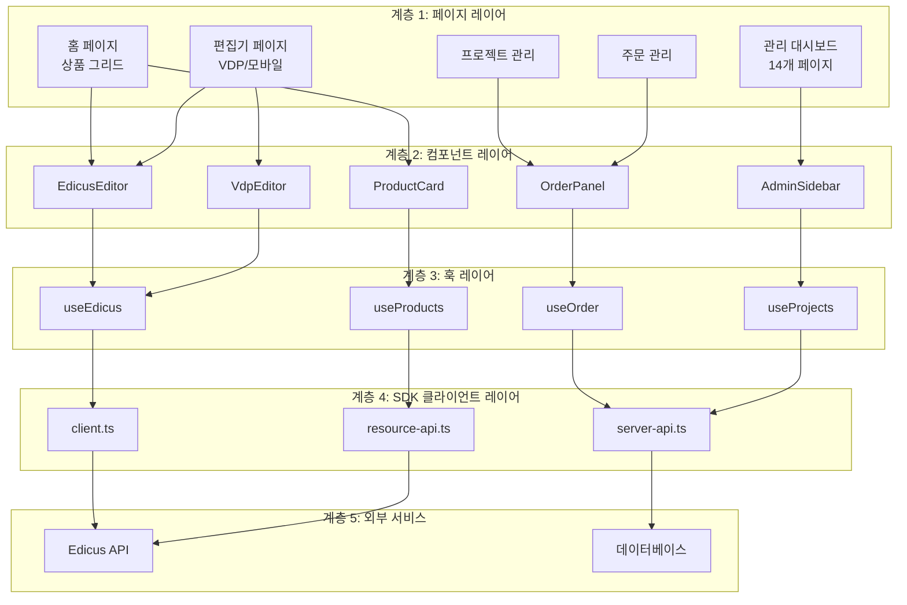

### 기술 스택 상세

| 카테고리 | 기술 | 버전 |
|---------|------|------|
| **프레임워크** | Next.js | 15.3.1 |
| **라이브러리** | React | 19 |
| **언어** | TypeScript | 5 |
| **스타일링** | Tailwind CSS | 3.4 |
| **상태 관리** | Zustand | 5 |
| **데이터 페칭** | TanStack React Query | 5 |
| **유효성 검사** | Zod | 3 |
| **아이콘** | Lucide React | 최신 |
| **컴포넌트** | CVA, clsx, tailwind-merge | - |
| **인증** | Firebase (NextAuth.js v5 예정) | - |
| **테스트** | Vitest, Testing Library, Playwright | 3 |
| **린팅** | ESLint, Prettier | 9 |

---

## 데이터 흐름

### 전체 데이터 흐름도

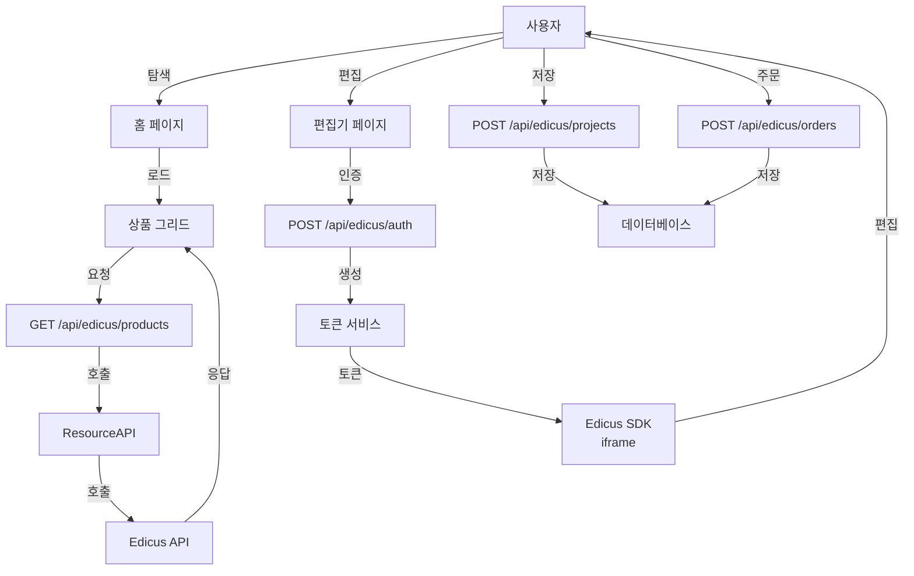

### 상품 조회 시퀀스

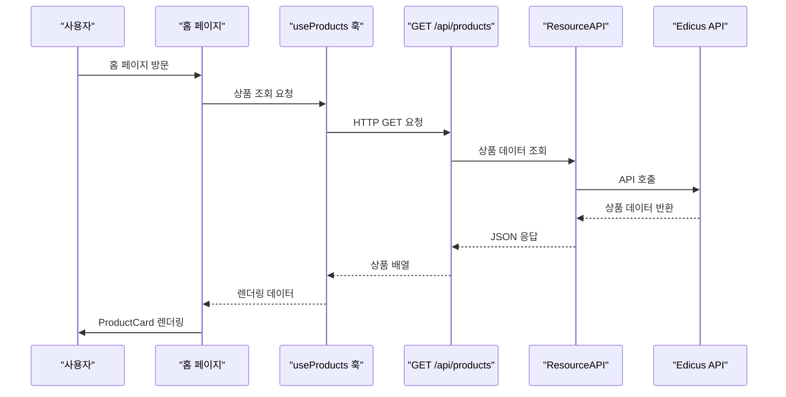

### 편집기 초기화 시퀀스

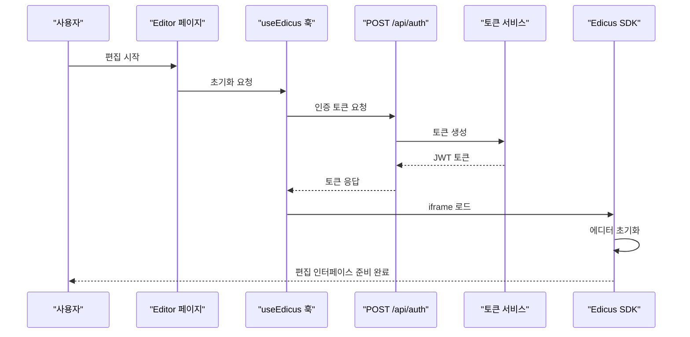

### 주문 생성 시퀀스 (2단계)

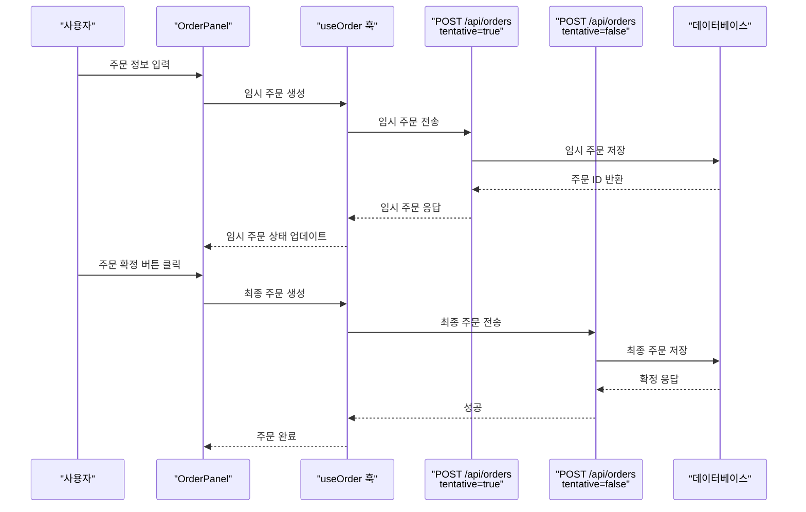

### 인증 흐름

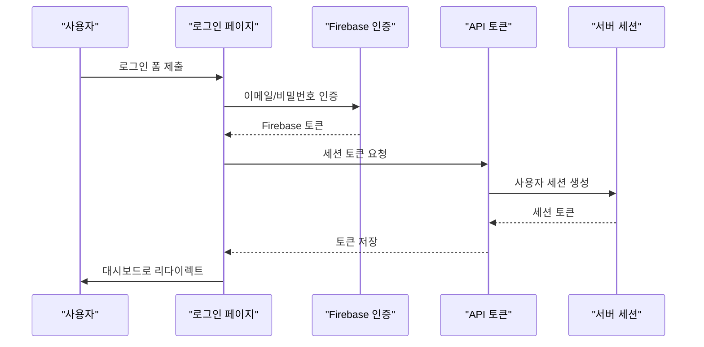

---

## 페이지 라우트 맵

```mermaid
graph TD
    Root["/"] --> Home["홈 페이지<br/>상품 그리드"]
    Root --> Projects["/projects<br/>프로젝트 관리"]
    Root --> Orders["/orders<br/>주문 관리"]
    Root --> Editor["/editor/[templateId]<br/>Edicus 편집기"]
    Root --> VDP["/vdp/[templateId]<br/>VDP 편집기"]
    Root --> Login["/login<br/>로그인"]
    Root --> Register["/register<br/>회원가입"]

    Root --> AdminRoot["/admin"]
    AdminRoot --> AdminDash["대시보드"]
    AdminRoot --> AdminTemplates["/admin/templates<br/>템플릿 관리"]
    AdminRoot --> AdminTemplatesId["/admin/templates/[id]<br/>템플릿 상세"]
    AdminRoot --> AdminProducts["/admin/products<br/>상품 관리"]
    AdminRoot --> AdminOrders["/admin/orders<br/>주문 관리"]
    AdminRoot --> AdminShop["/admin/shop<br/>쇼핑 설정"]
    AdminRoot --> AdminBilling["/admin/billing<br/>결제 관리"]
    AdminRoot --> AdminShipping["/admin/shipping<br/>배송 관리"]
    AdminRoot --> AdminStats["/admin/stats<br/>통계"]
    AdminRoot --> AdminInsights["/admin/insights<br/>인사이트"]
    AdminRoot --> AdminSMS["/admin/sms<br/>SMS 관리"]
    AdminRoot --> AdminProfile["/admin/profile<br/>프로필"]
    AdminRoot --> AdminAssets["/admin/assets<br/>자산 관리"]
    AdminRoot --> AdminSettings["/admin/settings<br/>설정"]

    Root --> MobileRoot["/mobile"]
    MobileRoot --> MobileHome["모바일 홈"]
    MobileRoot --> MobileProduct["/mobile/[productId]<br/>상품 상세"]
```

### 라우트 상세 설명

| 라우트 | 설명 | 접근권한 |
|--------|------|---------|
| `/` | 홈 페이지 - 상품 그리드 표시 | 전체 |
| `/projects` | 사용자 프로젝트 목록 및 관리 | 로그인 사용자 |
| `/orders` | 주문 내역 및 상태 추적 | 로그인 사용자 |
| `/editor/[templateId]` | Edicus SDK 기반 템플릿 편집기 | 로그인 사용자 |
| `/vdp/[templateId]` | VDP(Variable Data Printing) 편집기 | 로그인 사용자 |
| `/login` | 사용자 로그인 | 비로그인 |
| `/register` | 회원 가입 | 비로그인 |
| `/admin` | 관리자 대시보드 | 관리자 |
| `/admin/templates` | 템플릿 CRUD 관리 | 관리자 |
| `/admin/products` | 상품 CRUD 관리 | 관리자 |
| `/admin/orders` | 주문 모니터링 및 관리 | 관리자 |
| `/admin/billing` | 결제 및 청구 관리 | 관리자 |
| `/admin/shipping` | 배송 설정 및 추적 | 관리자 |
| `/admin/stats` | 주요 통계 데이터 | 관리자 |
| `/admin/insights` | 고급 분석 및 인사이트 | 관리자 |
| `/mobile` | 모바일 최적화 홈 | 전체 |
| `/mobile/[productId]` | 모바일 상품 상세 및 편집 | 전체 |

---

## API 엔드포인트

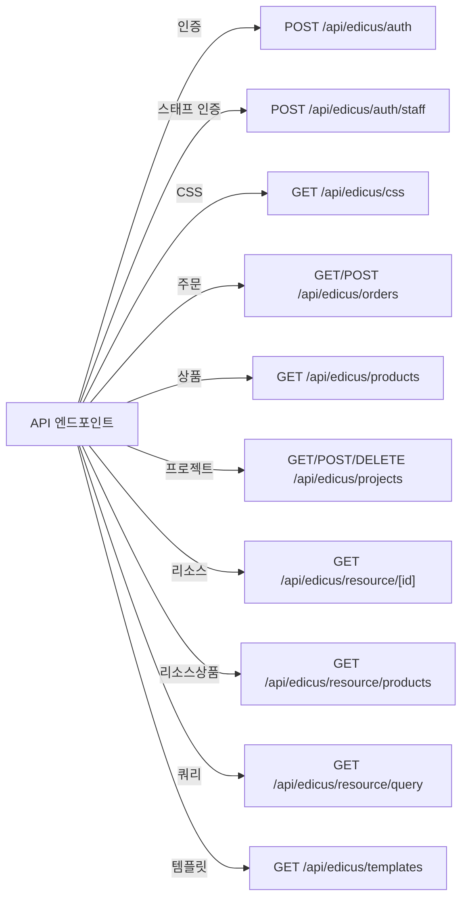

### API 엔드포인트 상세

| 메소드 | 엔드포인트 | 설명 | 요청 본문 | 응답 |
|--------|-----------|------|---------|------|
| POST | `/api/edicus/auth` | 사용자 토큰 발급 | `{userId, email}` | `{token, expiresIn}` |
| POST | `/api/edicus/auth/staff` | 스태프 인증 | `{staffId, password}` | `{token, role}` |
| GET | `/api/edicus/css` | CSS 리소스 조회 | - | CSS 파일 |
| GET | `/api/edicus/orders` | 주문 목록 조회 | - | `Order[]` |
| POST | `/api/edicus/orders` | 주문 생성 | `{items, tentative}` | `{orderId, status}` |
| GET | `/api/edicus/products` | 상품 목록 조회 | - | `Product[]` |
| GET | `/api/edicus/projects` | 프로젝트 목록 조회 | - | `Project[]` |
| POST | `/api/edicus/projects` | 프로젝트 생성 | `{name, data}` | `{projectId}` |
| DELETE | `/api/edicus/projects/[id]` | 프로젝트 삭제 | - | `{success}` |
| GET | `/api/edicus/resource/[id]` | 리소스 조회 | - | Resource |
| GET | `/api/edicus/resource/products` | 상품 리소스 조회 | - | `Product[]` |
| GET | `/api/edicus/resource/query` | 쿼리 리소스 | - | QueryResult |
| GET | `/api/edicus/templates` | 템플릿 목록 조회 | - | `Template[]` |

---

## 엔티티 관계도

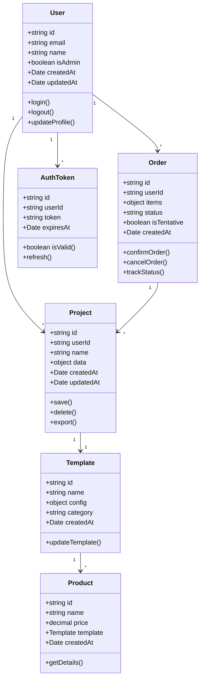

---

## 컴포넌트 구조

### 컴포넌트 의존성

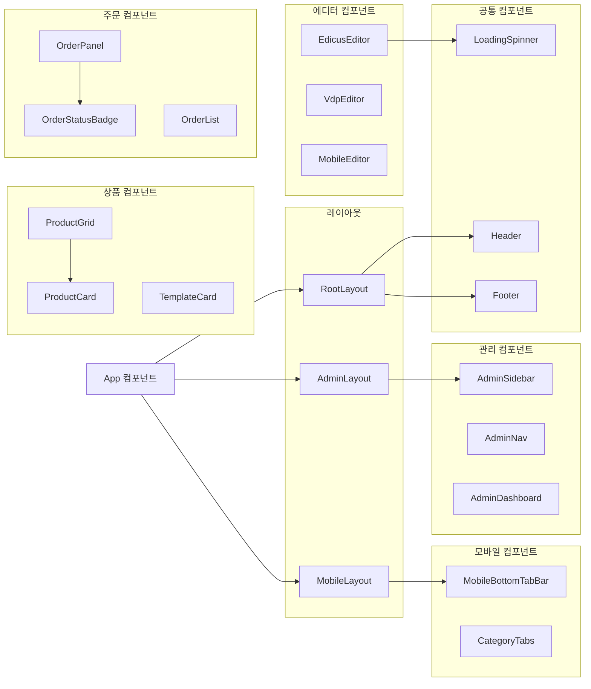

### 후니 디자인 시스템 (Huni Design System v6.0)

| 컴포넌트 | 바리언트 | 설명 |
|---------|--------|------|
| **HuniButton** | primary, outline, small, disabled | 4개 스타일의 CTA 버튼 |
| **HuniInput** | default, active, disabled | 텍스트 입력 필드 (3 상태) |
| **HuniSelect** | - | 커스텀 드롭다운 (RULE-1 준수) |
| **HuniCheckbox** | - | 20x20px 체크박스 |
| **HuniRadio** | - | 20x20px 라디오 버튼 |
| **HuniBadge** | color variants | 컬러 배리언트 뱃지 |
| **HuniCard** | - | 모서리 둥근 shadow-sm 카드 |
| **HuniTab** | - | 활성 표시자 포함 탭 |

### 컴포넌트 파일 위치

```
src/components/
├── editors/
│   ├── EdicusEditor.tsx          # Edicus SDK iframe 래퍼
│   ├── VdpEditor.tsx             # VDP 편집기
│   └── MobileEditor.tsx          # 모바일 편집기
├── products/
│   ├── ProductCard.tsx           # 상품 카드 컴포넌트
│   ├── ProductGrid.tsx           # 상품 그리드 레이아웃
│   └── TemplateCard.tsx          # 템플릿 카드
├── orders/
│   ├── OrderPanel.tsx            # 주문 생성 패널
│   ├── OrderList.tsx             # 주문 목록
│   └── OrderStatusBadge.tsx      # 주문 상태 뱃지
├── admin/
│   ├── AdminSidebar.tsx          # 관리 사이드바
│   ├── AdminNav.tsx              # 관리 네비게이션
│   └── AdminDashboard.tsx        # 대시보드
├── mobile/
│   ├── MobileBottomTabBar.tsx    # 모바일 하단 탭
│   └── CategoryTabs.tsx          # 카테고리 탭
├── auth/
│   ├── LoginForm.tsx             # 로그인 폼
│   └── RegisterForm.tsx          # 회원가입 폼
├── layout/
│   ├── Header.tsx                # 헤더
│   ├── Footer.tsx                # 푸터
│   └── Sidebar.tsx               # 사이드바
└── huni-ui/
    ├── HuniButton.tsx            # 후니 버튼
    ├── HuniInput.tsx             # 후니 입력
    ├── HuniSelect.tsx            # 후니 셀렉트
    ├── HuniCheckbox.tsx          # 후니 체크박스
    ├── HuniRadio.tsx             # 후니 라디오
    ├── HuniBadge.tsx             # 후니 뱃지
    ├── HuniCard.tsx              # 후니 카드
    └── HuniTab.tsx               # 후니 탭
```

---

## 사용자 플로우

### 메인 사용자 여정 (상품 탐색 → 편집 → 주문)

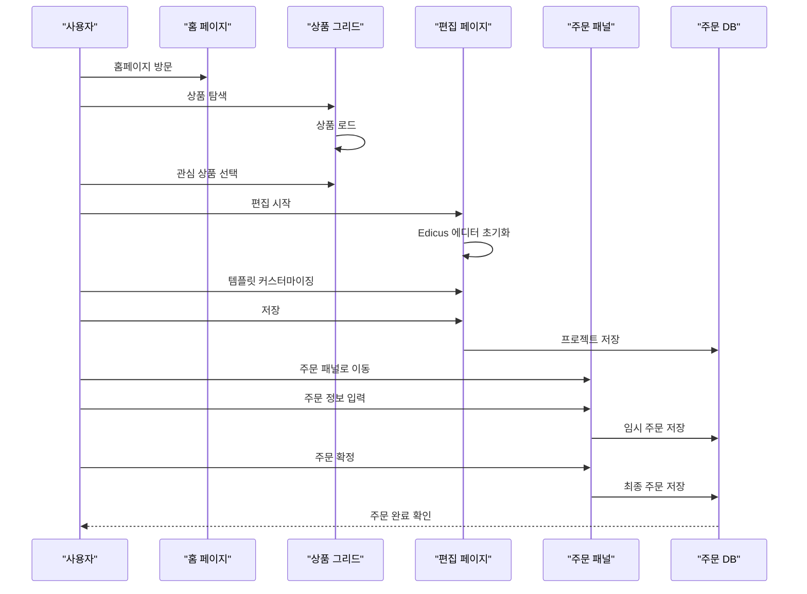

### 관리자 워크플로우

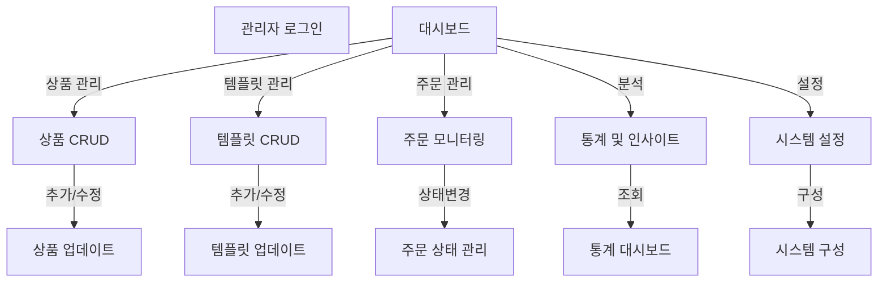

### 모바일 사용자 플로우

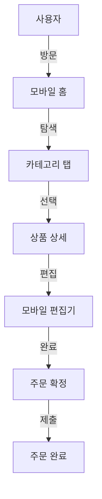

---

## 주문 상태 머신

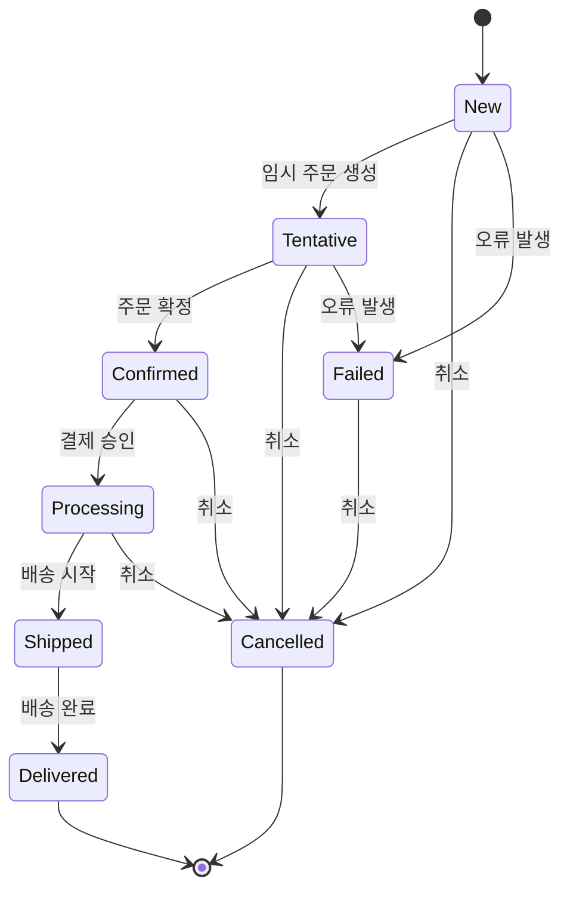

---

## 디자인 시스템

### 컬러 토큰 구조

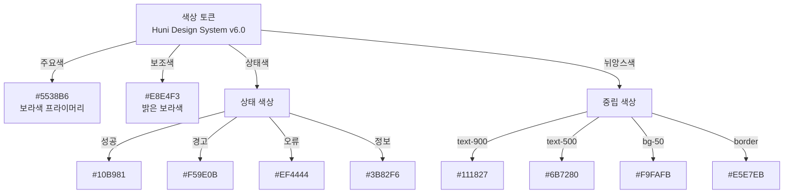

### 타이포그래피 시스템

| 수준 | 크기 | 가중치 | 사용처 |
|------|------|--------|--------|
| **Display** | 48px | 700 | 페이지 제목 |
| **Heading 1** | 36px | 600 | 섹션 제목 |
| **Heading 2** | 28px | 600 | 서브섹션 |
| **Heading 3** | 20px | 600 | 컴포넌트 제목 |
| **Body Large** | 16px | 400 | 주 본문 |
| **Body Regular** | 14px | 400 | 보조 텍스트 |
| **Small** | 12px | 400 | 캡션, 라벨 |

### 컴포넌트 바리언트 시스템

| 컴포넌트 | 바리언트 | 상태 | CSS 클래스 |
|---------|--------|------|-----------|
| Button | primary | default, hover, active, disabled | `btn-primary-[state]` |
| Button | outline | default, hover, active, disabled | `btn-outline-[state]` |
| Input | default | empty, active, error, disabled | `input-[state]` |
| Badge | color | success, warning, error, info | `badge-[color]` |

---

## 프로젝트 구조

```
edicus.man/
├── src/
│   ├── app/                          # Next.js App Router
│   │   ├── page.tsx                  # 홈 페이지
│   │   ├── layout.tsx                # 루트 레이아웃
│   │   ├── login/
│   │   ├── register/
│   │   ├── projects/
│   │   ├── orders/
│   │   ├── editor/[templateId]/
│   │   ├── vdp/[templateId]/
│   │   ├── mobile/
│   │   ├── admin/
│   │   │   ├── page.tsx              # 대시보드
│   │   │   ├── layout.tsx
│   │   │   ├── templates/
│   │   │   ├── products/
│   │   │   ├── orders/
│   │   │   ├── billing/
│   │   │   ├── shipping/
│   │   │   ├── stats/
│   │   │   ├── insights/
│   │   │   ├── sms/
│   │   │   ├── profile/
│   │   │   ├── assets/
│   │   │   └── settings/
│   │   └── api/                      # API 라우트
│   │       └── edicus/
│   │           ├── auth/
│   │           ├── orders/
│   │           ├── products/
│   │           ├── projects/
│   │           ├── resource/
│   │           └── templates/
│   ├── components/                   # React 컴포넌트
│   │   ├── editors/
│   │   ├── products/
│   │   ├── orders/
│   │   ├── admin/
│   │   ├── mobile/
│   │   ├── auth/
│   │   ├── layout/
│   │   └── huni-ui/                  # 후니 디자인 시스템
│   ├── hooks/                        # 커스텀 훅
│   │   ├── useEdicus.ts
│   │   ├── useOrder.ts
│   │   ├── useProducts.ts
│   │   ├── useProjects.ts
│   │   └── useAuth.ts
│   ├── lib/                          # 유틸리티
│   │   ├── edicus/
│   │   │   ├── client.ts
│   │   │   ├── server-api.ts
│   │   │   └── resource-api.ts
│   │   ├── api.ts
│   │   ├── auth.ts
│   │   └── utils.ts
│   ├── types/                        # TypeScript 타입
│   │   ├── edicus.ts
│   │   ├── order.ts
│   │   ├── product.ts
│   │   ├── template.ts
│   │   └── user.ts
│   ├── store/                        # Zustand 스토어
│   │   ├── authStore.ts
│   │   ├── orderStore.ts
│   │   └── productStore.ts
│   └── test/                         # 테스트 파일
│       ├── setup.ts
│       ├── unit/
│       └── integration/
├── public/                           # 정적 자산
│   ├── images/
│   ├── icons/
│   └── fonts/
├── .claude/                          # Claude Code 설정
│   ├── skills/                       # 커스텀 스킬
│   └── rules/                        # 프로젝트 규칙
├── .moai/                            # MoAI 설정
│   ├── config/                       # 워크플로우 설정
│   └── specs/                        # SPEC 문서
├── .github/
│   └── workflows/                    # GitHub Actions
├── next.config.js                    # Next.js 설정
├── tailwind.config.ts                # Tailwind 설정
├── tsconfig.json                     # TypeScript 설정
├── package.json
├── package-lock.json
└── README.md                         # 이 파일
```

---

## 시작하기

### 사전 요구사항

- **Node.js**: 20.x 이상
- **npm**: 10.x 이상
- **Git**: 최신 버전
- **Edicus SDK**: API 크레덴셜

### 설치 단계

**1단계: 저장소 복제**

```bash
git clone https://github.com/your-org/edicus.man.git
cd edicus.man
```

**2단계: 의존성 설치**

```bash
npm install
```

**3단계: 환경 변수 설정**

`.env.local` 파일을 프로젝트 루트에 생성하고 다음 내용을 추가합니다:

```env
# Edicus SDK
NEXT_PUBLIC_EDICUS_API_URL=https://api.edicus.com
EDICUS_API_KEY=your_api_key_here
EDICUS_SECRET_KEY=your_secret_key_here

# Firebase 인증
NEXT_PUBLIC_FIREBASE_API_KEY=your_firebase_key
NEXT_PUBLIC_FIREBASE_AUTH_DOMAIN=your_firebase_domain
NEXT_PUBLIC_FIREBASE_PROJECT_ID=your_firebase_project_id

# 데이터베이스
DATABASE_URL=your_database_url

# NextAuth (향후 업그레이드)
NEXTAUTH_SECRET=your_nextauth_secret
NEXTAUTH_URL=http://localhost:3000

# 환경
NODE_ENV=development
```

**4단계: 개발 서버 시작**

```bash
npm run dev
```

브라우저에서 `http://localhost:3000`을 방문합니다.

### 환경 변수 상세 설명

| 변수 | 설명 | 예시 |
|------|------|------|
| `NEXT_PUBLIC_EDICUS_API_URL` | Edicus API 기본 URL | https://api.edicus.com |
| `EDICUS_API_KEY` | API 인증 키 | sk_test_... |
| `EDICUS_SECRET_KEY` | API 시크릿 | secret_... |
| `NEXT_PUBLIC_FIREBASE_API_KEY` | Firebase API 키 | AIzaSyD... |
| `DATABASE_URL` | 데이터베이스 연결 문자열 | postgresql://... |
| `NEXTAUTH_SECRET` | NextAuth 암호화 키 | (무작위 문자열) |
| `NODE_ENV` | 실행 환경 | development, production |

---

## 스크립트

### npm 스크립트 명령어

| 명령어 | 설명 |
|--------|------|
| `npm run dev` | 개발 서버 시작 (포트 3000) |
| `npm run build` | 프로덕션 빌드 생성 |
| `npm run start` | 프로덕션 서버 시작 |
| `npm run lint` | ESLint 린팅 실행 |
| `npm run format` | Prettier 포매팅 실행 |
| `npm run test` | 테스트 스위트 실행 |
| `npm run test:watch` | 감시 모드 테스트 |
| `npm run test:coverage` | 테스트 커버리지 리포트 |
| `npm run type-check` | TypeScript 타입 검사 |
| `npm run analyze` | 번들 크기 분석 |
| `npm run docs:build` | 문서 빌드 |
| `npm run db:migrate` | 데이터베이스 마이그레이션 |

### 개발 워크플로우

```bash
# 개발 모드에서 시작
npm run dev

# 다른 터미널에서 테스트 실행
npm run test:watch

# 다른 터미널에서 린팅 확인
npm run lint

# 변경사항 포매팅
npm run format

# 타입 검사
npm run type-check

# 빌드 테스트
npm run build

# 프로덕션 빌드 검증
npm run start
```

---

## 테스트

### 테스트 구조

```
src/test/
├── setup.ts                          # 테스트 설정
├── unit/
│   ├── components/
│   │   ├── EdicusEditor.test.tsx
│   │   └── ProductCard.test.tsx
│   ├── hooks/
│   │   ├── useEdicus.test.ts
│   │   └── useProducts.test.ts
│   └── lib/
│       ├── api.test.ts
│       └── auth.test.ts
└── integration/
    ├── editor-flow.test.tsx
    ├── order-flow.test.tsx
    └── admin-dashboard.test.tsx
```

### 테스트 작성 및 실행

**테스트 작성 예시**

```typescript
// src/test/unit/components/ProductCard.test.tsx
import { render, screen } from '@testing-library/react';
import { ProductCard } from '@/components/products/ProductCard';

describe('ProductCard', () => {
  it('상품 정보를 올바르게 렌더링합니다', () => {
    const product = {
      id: '1',
      name: '테스트 상품',
      price: 10000,
    };

    render(<ProductCard product={product} />);
    expect(screen.getByText('테스트 상품')).toBeInTheDocument();
  });
});
```

**테스트 실행**

```bash
# 전체 테스트 실행
npm run test

# 특정 파일 테스트
npm run test ProductCard.test.tsx

# 감시 모드
npm run test:watch

# 커버리지 리포트
npm run test:coverage
```

### 테스트 커버리지 목표

- **전체 커버리지**: 85% 이상
- **컴포넌트**: 90% 이상
- **훅**: 85% 이상
- **API**: 80% 이상
- **유틸리티**: 90% 이상

### E2E 테스트 (Playwright)

```bash
# Playwright 테스트 실행
npm run e2e

# 특정 스펙 파일 실행
npm run e2e -- editor-flow.spec.ts

# UI 모드로 실행
npm run e2e:ui
```

---

## 배포

### Vercel 배포

**1단계: Vercel 프로젝트 생성**

```bash
npm install -g vercel
vercel
```

**2단계: 환경 변수 설정**

Vercel 대시보드에서 프로젝트 Settings → Environment Variables로 이동하여 모든 `.env.local` 변수를 추가합니다.

**3단계: 배포**

```bash
vercel --prod
```

### 배포 확인 체크리스트

- 모든 테스트 통과 확인
- 린트 에러 없음 확인
- 타입 검사 통과 확인
- 빌드 성공 확인
- 프로덕션 환경 변수 설정 확인
- 보안 헤더 설정 확인
- 성능 메트릭 확인

### CI/CD 파이프라인

`.github/workflows/deploy.yml`에서 자동 배포 설정을 관리합니다:

```yaml
name: Deploy to Vercel
on:
  push:
    branches: [main]
jobs:
  build:
    runs-on: ubuntu-latest
    steps:
      - uses: actions/checkout@v4
      - name: Install dependencies
        run: npm install
      - name: Run tests
        run: npm run test
      - name: Build
        run: npm run build
      - name: Deploy
        run: vercel --prod
        env:
          VERCEL_TOKEN: ${{ secrets.VERCEL_TOKEN }}
```

---

## SPEC 이력

### SPEC-REDSDK-001: Edicus SDK 통합

- **상태**: 완료
- **기간**: 2024-10-01 ~ 2024-11-15
- **설명**: 브라우저 기반 인쇄 디자인 편집을 위한 Edicus SDK 통합
- **주요 기능**: EdicusEditor 컴포넌트, 토큰 인증, iframe 통합

### SPEC-MANAGER-001: 관리 시스템 구현

- **상태**: 완료
- **기간**: 2024-11-16 ~ 2025-01-20
- **설명**: 14개의 관리 페이지를 포함한 포괄적인 관리 대시보드
- **주요 기능**: 템플릿 CRUD, 상품 관리, 주문 모니터링, 통계, 설정

### SPEC-MOBILE-001: 모바일 편집기 + 커스텀 CSS + SDK 분석 자동화

- **상태**: 완료
- **기간**: 2025-01-21 ~ 2025-02-28
- **설명**: 모바일 사용자 지원 및 SDK 분석 자동화
- **주요 기능**: 모바일 에디터, 반응형 UI, CSS 최적화, 자동화된 분석

### SPEC-DESIGN-001: 후니프린팅 디자인 시스템 전면 적용

- **상태**: 진행 중
- **기간**: 2025-03-01 ~ 진행 중
- **설명**: Huni Design System v6.0 (#5538B6 보라색 테마) 전면 적용
- **주요 기능**: 8개 후니 UI 컴포넌트, 컬러 토큰, 타이포그래피 시스템

---

## 라이선스

이 프로젝트는 MIT 라이선스 하에 라이선스되었습니다. 자세한 내용은 [LICENSE](LICENSE) 파일을 참조하세요.

---

## 지원 및 문의

- **이슈 보고**: [GitHub Issues](https://github.com/your-org/edicus.man/issues)
- **토론**: [GitHub Discussions](https://github.com/your-org/edicus.man/discussions)
- **문서**: [온라인 문서](https://docs.edicus.man)

---

**마지막 업데이트**: 2026-03-18
**버전**: 1.0.0
**유지보수자**: Edicus Team
