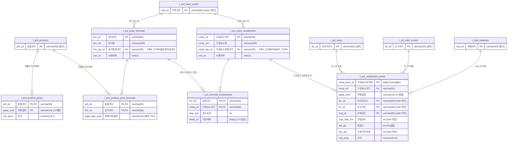

# 가격 도메인 ERD (Pricing)

후니 POD 상품·가격 DB의 **가격 도메인 6테이블** 구조도. 스키마 `sql/01a_tables_master.sql`·`sql/01b_tables_relations.sql` 기준.
현재 가격 테이블은 비어 있으며(데이터는 정리된 엑셀 수령 후 적재 예정), 본 문서는 **구조 설명용**이다.

> 속성 표기 순서: **영문컬럼명 → 한글컬럼명 → PK/FK → 데이터타입** (Mermaid erDiagram Key 컬럼 사용).
> 감사컬럼(`reg_dt`/`upd_dt`)·`note`는 가독성을 위해 생략.

## 가격 계산 흐름

1. **상품 → 공식**: `t_prd_product_price_formulas`가 한 상품에 어떤 가격공식을 쓸지 연결 (M:N)
2. **공식 → 구성요소**: `t_prc_formula_components`가 공식을 구성요소(인쇄비·코팅비·용지비·후가공비·박형압비)의 조합으로 정의. `addtn_yn`=합산 여부
3. **구성요소 → 단가**: `t_prc_component_prices`가 구성요소의 실제 단가를 다차원(사이즈·도수·자재·코팅면수·묶음수·수량구간)별로 보관. 안 쓰는 차원은 NULL
4. **상품 직접단가**: `t_prd_product_prices`는 공식과 별개로 상품에 직접 매기는 단가 (시계열)
5. **유형 enum**: 공식유형(`FRM_TYPE`)·구성요소유형(`PRC_COMPONENT_TYPE`)은 기초코드 참조

## 적재 시 주의
- **시계열 3곳**: `component_prices.apply_ymd` · `product_prices.(prd_cd, apply_ymd)` · `product_price_formulas.apply_bgn_ymd`(메모용, 키 아님)
- **`t_prc_component_prices`가 핵심·최난도** — surrogate PK(`comp_price_id`) + 자연키 8컬럼 조합(`comp_cd, apply_ymd, siz_cd, clr_cd, mat_cd, coat_side_cnt, bdl_qty, min_qty`), 차원 NULL 허용
- **`bdl_qty`는 FK 없음** (묶음수 PK가 복합이라 단독 FK 불가) — 차원 키로만 사용
- 날짜 `_ymd`는 `varchar(10)` `'yyyy-MM-dd'` 형식 (할인 적재 때처럼 `yyyyMMdd`면 변환 필요)
