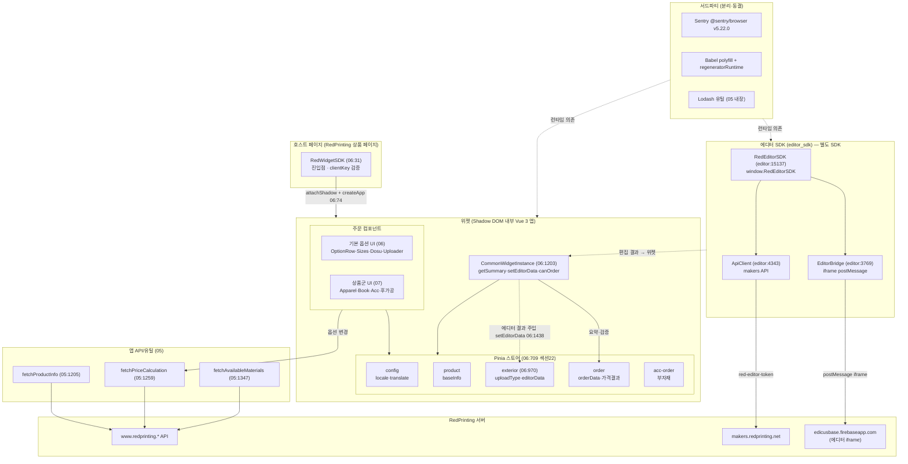
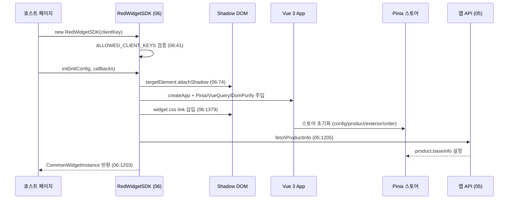
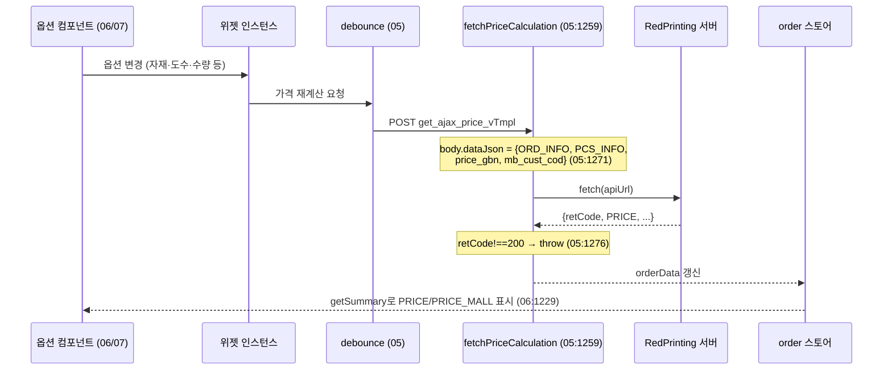
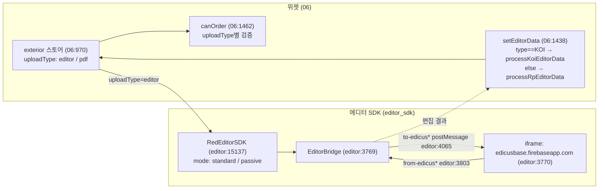

# 00 — 아키텍처 개요 (4모듈 경계)

> RedPrinting 주문 위젯/SDK의 가독 소스 4개 모듈의 정체와 경계, 그리고 위젯 ↔ 에디터 ↔ Pinia
> 스토어 ↔ 서드파티 관계를 정리한다. 근거: 가독 소스(`02_readable/`)·cartography
> `comment-map.json`·`work-units.csv`·verdict. 다이어그램 밖 동작은 단정하지 않는다.

용어 한 줄 풀이:
- **위젯(widget):** RedPrinting 상품 페이지에 임베드되어 옵션 선택·가격·주문을 처리하는 프런트엔드.
- **에디터 SDK(RedEditorSDK):** 디자인 편집기(Edicus)와 통신하는 별도 SDK. `window.RedEditorSDK`로 노출.
- **Pinia:** Vue 3 상태관리 라이브러리. 여기선 위젯 내부 상태(스토어)를 담는다.
- **Shadow DOM:** 호스트 페이지 CSS와 격리된 DOM 서브트리. 위젯이 자기 스타일을 보호하려고 사용.
- **postMessage:** 서로 다른 출처(origin) 창/iframe 간 메시지 통신 브라우저 API.

---

## 1. 4모듈의 정체

| # | 가독 파일 | 정체 | 핵심 책임 | 근거 |
|---|-----------|------|-----------|------|
| 05 | `deob_05_app_api.js` | **앱 API/유틸 레이어** | Lodash 유틸 번들 + RedPrinting 서버 API 통신(제품정보·가격계산·S3·용지·템플릿) + 영어 번역 사전 | comment-map `line:1` |
| 06 | `deob_06_app_widget_sdk.js` | **위젯 SDK + Pinia 스토어 + 기본 컴포넌트** | `RedWidgetSDK` 진입점(Shadow DOM·Vue 마운트) + 5개 Pinia 스토어 + 옵션 UI 컴포넌트 + 위젯 인스턴스(외부 API) | comment-map 섹션 1~26 |
| 07 | `deob_07_app_components.js` | **Vue 주문 컴포넌트 (상품군별)** | 의류·책자·부자재·후가공 등 상품군 주문 UI 컴포넌트(`defineComponent`) | comment-map 섹션 1~28 |
| editor | `deob_editor_sdk.js` | **에디터 SDK (Edicus 브릿지)** | `RedEditorSDK`(45 메서드) + `EditorBridge`(iframe postMessage) + `ApiClient`(makers API) + DDP 빌더 + 커스텀 탭 | comment-map, work-units `proprietary-sdk-iife` |

**중요 경계 (work-units 근거):**
- 05의 **후반부**(Pinia 스토어·주문요약·RedWidgetSDK 클래스·Vue 컴포넌트)는 05 디옵 산출물에 **미포함** — 06으로 위임됨(`deob_05` work-unit: line 1503-1507 TODO). 즉 05는 "유틸 + API 함수 + 영어 번역 사전"까지만 담는다.
- 07은 입력 번들이 절단되어 **합성 복원 scaffold**를 포함하며, 슬라이스 끝 이후 후가공/수량 컴포넌트(COT_DFT~WRK_MTR·Basic·각종 Qty)는 원본(4247줄)에만 존재(03 문서 §절단 경계 참조).

---

## 2. 모듈 경계 컴포넌트 다이어그램

**읽는 법:** 실선 = 직접 호출/마운트, 점선 = 데이터 전달/느슨한 의존. 위젯(06/07)과 에디터
SDK(editor_sdk)는 **별개 번들**이며, 둘을 잇는 접점은 위젯 쪽 `setEditorData`(06:1438)가 에디터 편집
결과를 `exterior` 스토어에 주입하는 흐름이다(에디터→위젯 데이터 경계). 위젯이 RedEditorSDK를 직접
import하는 코드는 가독 소스에서 확인되지 않음 — **두 SDK의 결합 방식(런타임 글로벌/별도 로드 등)은
가독 소스 범위 밖이라 미상**.

---

## 3. 초기화 시퀀스 (위젯 마운트)

근거: comment-map `RedWidgetSDK` JSDoc("attachShadow+createVueApp+Pinia/VueQuery/DomPurify 주입 후
widget.css 링크 삽입·mount") + 소스 `:31`/`:41`/`:74`/`:1379`/`:1203`. 단계 사이 세부 순서 일부는
JSDoc 요약 기준이며, 줄단위 실행 순서는 해당 라인에서 직접 확인 가능.

---

## 4. 가격 계산 흐름 (옵션 → 가격)

근거: `fetchPriceCalculation`(05:1259, body 구조 05:1271, retCode 검사 05:1276)·`getSummary`(06:1229)·
debounce 용도(comment-map `initDebounce` "옵션 변경 시 가격 API 호출 빈도 제한에 사용"). PRICE 필드는
서버 API 데이터 계약(F4 프로퍼티 동결 대상)으로 보존됨.

---

## 5. 에디터(에디쿠스) 연동 경계

**핵심:** 업로드 경로는 `exterior` 스토어의 `uploadType`(editor|pdf)로 분기한다(06:971). `editor`면
에디터 SDK 경로, `pdf`면 직접 파일업로드 경로. 에디터에서 돌아온 결과는 `setEditorData`(06:1438)가
`type === "KOI"` 분기(KOI 편집기) vs 그 외(RP 편집기)로 가공해 스토어에 넣는다. 에디터 SDK 측은
`EditorBridge`가 iframe과 `to-edicus*`/`from-edicus*` postMessage로 양방향 통신한다(editor:3803~,
:4065). RedEditorSDK는 `standard`/`passive` 두 모드를 가지며 passive 전환 지점은 editor:15497·:15995.

---

## 6. 서드파티 경계 (분리·동결 대상)

| 서드파티 | 위치(가독 좌표) | 처리 | 근거 |
|----------|------------------|------|------|
| Babel transpile 헬퍼(head) | `deob_editor_sdk.js:13`~`113` | exclude(상단 유지·집계 제외) | thirdparty-ranges |
| Sentry @sentry/browser v5.22.0 | `deob_editor_sdk.js:122`~`3760` | fold(배너+추출본 분리) | thirdparty-ranges |
| Babel Polyfill + regeneratorRuntime | `deob_editor_sdk.js:4635`~`13902` | fold | thirdparty-ranges |
| Lodash 유틸 번들 | `deob_05_app_api.js`(상단) | 05 내장(리네임 제외 유틸) | comment-map `line:1` |

서드파티는 리네임/수정 대상이 아니며, 식별·분리·요약만 한다(플레이북 F8). 에디터 SDK의 코어 앱 로직은
폴리필 블록 직후 `deob_editor_sdk.js:13903`부터 재개된다(thirdparty-ranges summary). 위젯
파일(05/06/07)에는 서드파티 fold 블록이 없다(thirdparty-ranges = `[]`, 각 verdict G3 N/A→GO).

---

## 7. 정리

- **위젯 스택(05·06·07):** Vue 3 + Pinia + Shadow DOM 임베드. 05=API/유틸, 06=SDK 진입점·스토어·기본 UI, 07=상품군 컴포넌트.
- **에디터 스택(editor_sdk):** Edicus iframe과 postMessage로 통신하는 독립 SDK(`window.RedEditorSDK`).
- **경계:** 위젯↔에디터는 `uploadType=editor`일 때만 연결되고, 데이터는 `setEditorData`로 위젯에 환류된다. 두 SDK 번들의 물리적 결합 방식은 가독 소스 밖이라 미상.
- **서드파티:** Sentry·Babel polyfill·Lodash는 분리·동결.
